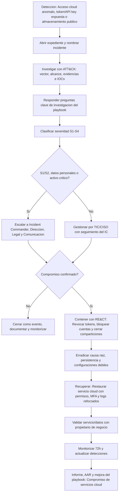
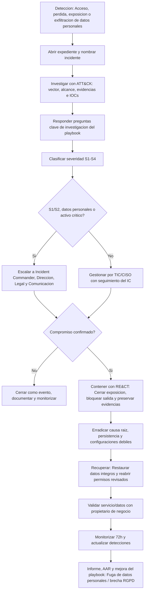
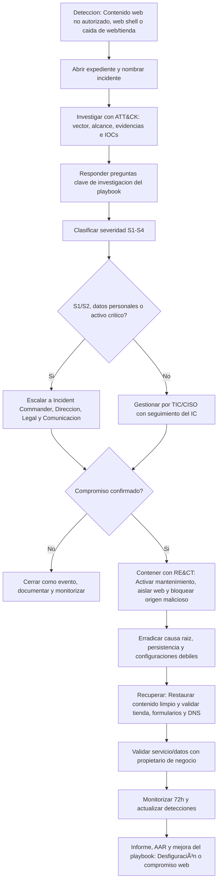
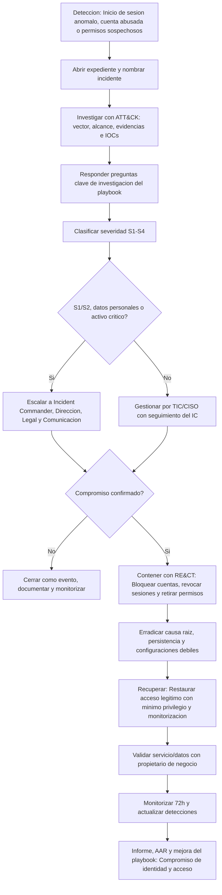
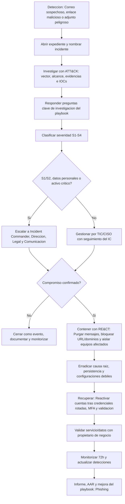
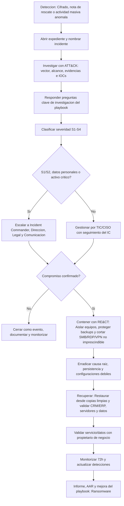
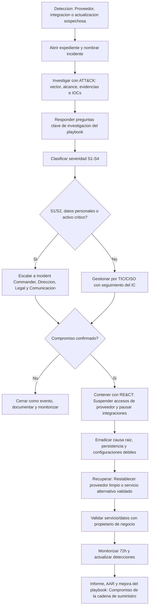
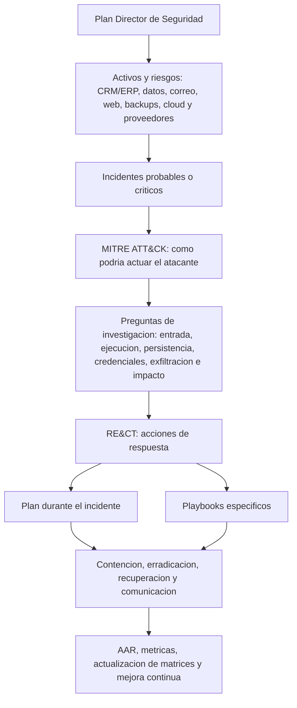
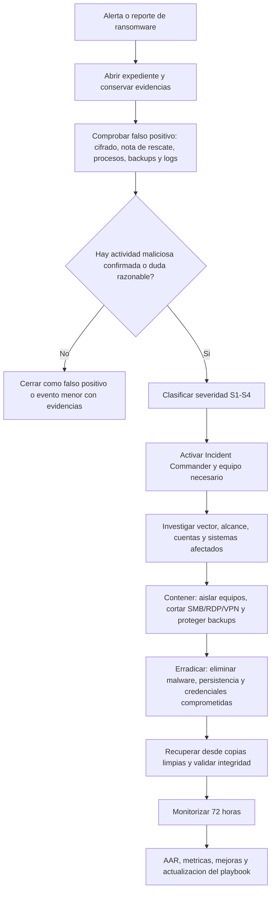
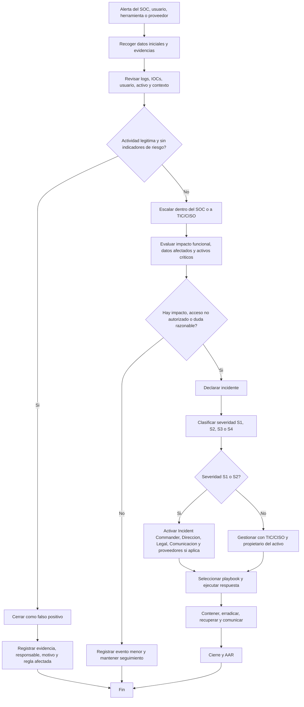

# Plan de respuesta a incidentes para Nexo Lebrija

Autor: GRUPO 3, jescpra2305@g.educaand.es

Revisión 1, publicado 19/05/2026

Este documento indica cómo actuar durante un incidente de ciberseguridad en Nexo Lebrija. Está adaptado al Plan Director de Seguridad, a los activos críticos identificados y a los incidentes más probables para una asesoría que presta servicios a autónomos y PYMES.

Última revisión: 19/05/2026. Última prueba: 19/05/2026.

El objetivo es responder rápido, con orden y con continuidad de negocio siempre que sea posible. También se busca reducir el impacto legal, operativo y reputacional.

# Indice

1. [Evaluar](#evaluar)
   * [Activos definidos en el Plan Director de Seguridad](#activos-definidos-en-el-plan-director-de-seguridad)
   * [Impacto funcional](#impacto-funcional)
   * [Impacto sobre la informacion](#impacto-sobre-la-informacion)
   * [Severidad](#severidad)
   * [Playbook aplicable](#playbook-aplicable)
2. [Iniciar la respuesta](#iniciar-la-respuesta)
   * [Nombre del incidente](#nombre-del-incidente)
   * [Equipo de respuesta](#equipo-de-respuesta)
   * [Roles](#roles)
   * [Ritmo de trabajo](#ritmo-de-trabajo)
   * [Llamada inicial](#llamada-inicial)
   * [Subequipos](#subequipos)
3. [Investigar](#investigar)
   * [Expediente del incidente](#expediente-del-incidente)
   * [Primeras pistas](#primeras-pistas)
   * [MITRE ATT&CK en la investigacion](#mitre-attck-en-la-investigacion)
   * [RE&CT en la respuesta](#rect-en-la-respuesta)
   * [Indicadores de compromiso](#indicadores-de-compromiso)
   * [Pruebas](#pruebas)
   * [Artefactos prioritarios](#artefactos-prioritarios)
   * [Analisis](#analisis)
4. [Remediar](#remediar)
   * [Plan de remediacion](#plan-de-remediacion)
   * [Proteccion](#proteccion)
   * [Deteccion](#deteccion)
   * [Contencion](#contencion)
   * [Erradicacion](#erradicacion)
   * [Momento de remediar](#momento-de-remediar)
5. [Comunicar](#comunicar)
   * [Comunicacion interna](#comunicacion-interna)
   * [Informe de incidente](#informe-de-incidente)
   * [Comunicacion externa](#comunicacion-externa)
   * [MISP](#misp)
6. [Recuperacion](#recuperacion)
   * [Prioridad de recuperacion](#prioridad-de-recuperacion)
   * [Pasos de recuperacion](#pasos-de-recuperacion)
   * [Cierre](#cierre)
7. [Playbooks](#playbooks)
   * [Compromiso de servicios cloud](#playbook-compromiso-de-servicios-cloud)
   * [Fuga de datos personales / brecha RGPD](#playbook-fuga-de-datos-personales--brecha-rgpd)
   * [Desfiguracion o compromiso web](#playbook-desfiguracion-o-compromiso-web)
   * [Compromiso de identidad y acceso](#playbook-compromiso-de-identidad-y-acceso)
   * [Phishing](#playbook-phishing)
   * [Ransomware](#playbook-ransomware)
   * [Compromiso de la cadena de suministro](#playbook-compromiso-de-la-cadena-de-suministro)
8. [Diagramas de flujo de playbooks](#diagramas-de-flujo-de-playbooks)
9. [Roles](#roles-1)
10. [Revision posterior al incidente](#revision-posterior-al-incidente)
11. [Glosario](#glosario)
12. [Respuestas a las preguntas](#respuestas-a-las-preguntas)
    * [1.a Relacion entre MITRE ATT&CK, RE&CT y el plan de respuesta](#1a-relacion-entre-mitre-attck-rect-y-el-plan-de-respuesta)
    * [1.b Playbooks identificados y justificacion](#1b-playbooks-identificados-y-justificacion)
    * [1.c Cobertura de las fases del plan de respuesta](#1c-cobertura-de-las-fases-del-plan-de-respuesta)
    * [2.a Flujo de toma de decisiones, escalado y comunicacion](#2a-flujo-de-toma-de-decisiones-escalado-y-comunicacion)
    * [3.a Respuestas ciberresilientes](#3a-respuestas-ciberresilientes)
13. [Conclusiones](#conclusiones)
14. [Acerca de este plan](#acerca-de-este-plan)
    * [Alcance](#alcance)
    * [Base documental](#base-documental)
    * [Uso de MITRE ATT&CK y RE&CT](#uso-de-mitre-attck-y-rect)
    * [Uso de MISP e intercambio de informacion](#uso-de-misp-e-intercambio-de-informacion)
    * [Mantenimiento y mejora continua](#mantenimiento-y-mejora-continua)
    * [Referencias](#referencias)
    * [Licencia y procedencia de la plantilla](#licencia-y-procedencia-de-la-plantilla)

# Evaluar

1. Mantener la calma y trabajar con hechos.
2. Recoger la información inicial: alerta, usuario afectado, sistema, hora, síntoma, activo implicado, posible vector y evidencias disponibles.
3. Confirmar si hay impacto sobre confidencialidad, integridad o disponibilidad.
4. Clasificar la severidad inicial.
5. Activar el equipo de respuesta si el incidente se confirma o si hay sospecha razonable.

## Activos definidos en el Plan Director de Seguridad

Durante la evaluación se debe comprobar si el incidente afecta a algún activo priorizado en el Plan Director de Seguridad.

| Activo | Motivo de criticidad |
|---|---|
| CRM/ERP | Soporta gestión de clientes, fiscalidad, facturación y operaciones principales. |
| Servidores de archivos y aplicaciones | Contienen documentación contable, fiscal y operativa. |
| Datos personales de clientes, proveedores y empleados | Tienen impacto RGPD/LOPDGDD, reputacional y contractual. |
| Correo corporativo | Es un vector habitual de phishing, fraude, suplantación y fuga de información. |
| Página web y tienda online externalizada | Afecta a reputación, disponibilidad y dependencia de proveedor. |
| Copias de seguridad | Son la base de la recuperación ante ransomware, borrado o corrupción de datos. |
| Puestos de trabajo | Son un punto frecuente de entrada por phishing, malware o credenciales robadas. |
| Servicios cloud y proveedores | Aportan riesgo por dependencia, acceso externo, mala configuración y cadena de suministro. |

## Impacto funcional

Valorar cómo afecta el incidente a la operación de la empresa.

* **Alto:** parada de CRM/ERP, servidor de archivos, correo, web/tienda, backups o varios puestos. Puede afectar a plazos fiscales, atención a clientes o continuidad de negocio.
* **Medio:** degradación de un servicio o afectación parcial a un departamento, con alternativas temporales.
* **Bajo:** incidente localizado sin interrupción relevante.
* **Sin impacto funcional:** tratar como evento de seguridad o ticket ordinario, salvo que haya riesgo sobre datos o credenciales.

## Impacto sobre la información

Valorar si se ha producido o podría producirse alguno de estos hechos:

* Acceso no autorizado a datos personales, fiscales, contables, contractuales o credenciales.
* Exfiltración, publicación, modificación, cifrado o borrado de información.
* Uso indebido de cuentas corporativas, correo, CRM/ERP, cloud o accesos de proveedor.
* Pérdida de trazabilidad, logs o evidencias.

Si hay datos personales afectados, avisar desde el inicio a Legal/Cumplimiento para valorar obligaciones RGPD/LOPDGDD y posible notificación a la AEPD.

## Severidad

La severidad se revisa durante todo el incidente. Si aparecen nuevos hechos, el Incident Commander puede subir o bajar la clasificación.

| Severidad | Criterios | Escalado mínimo |
|---|---|---|
| **S1 Crítico** | Parada de negocio, ransomware activo, afectación a CRM/ERP o backups, fuga masiva de datos personales, compromiso de cuenta privilegiada, proveedor crítico comprometido o exposición pública grave. | Incident Commander, Dirección, TIC/CISO, Legal/Cumplimiento, Comunicación y proveedor/SOC externo si aplica. |
| **S2 Alto** | Afectación a sistemas críticos sin parada total, acceso no autorizado probable, phishing con credenciales usadas, malware contenido, brecha limitada o incidente en proveedor con impacto relevante. | Incident Commander, TIC/CISO, propietario del servicio, Legal si hay datos personales y Comunicación si hay terceros. |
| **S3 Medio** | Incidente confirmado pero localizado: una cuenta, un equipo, un buzón o servicio no crítico, sin evidencias de exfiltración ni propagación. | TIC/CISO, propietario del activo e Incident Commander si requiere coordinación. |
| **S4 Bajo** | Intento bloqueado, falso positivo razonable o evento menor sin acceso confirmado ni impacto. | TIC/seguridad, con registro y seguimiento. |

## Playbook aplicable

Escoger el playbook más cercano al escenario observado. Si el incidente encaja en varios escenarios, activar el principal y usar los demás como apoyo.

| Escenario | Activos/Riesgos PDS | Playbook o línea de respuesta |
|---|---|---|
| Ransomware | R01, R02, R06, R08; CRM/ERP, servidores, backups, puestos | Ransomware |
| Phishing y correo malicioso | R03, R05, R08; correo, credenciales, datos personales | Phishing |
| Compromiso de identidad y acceso | R01, R03, R05, R08; cuentas, VPN, correo, CRM/ERP, cloud | Identidad y acceso |
| Compromiso web/tienda | R04, R11, R03; web, tienda, proveedor, datos de clientes | Web/defacement |
| Cadena de suministro | R11, R04, R03; proveedores, integraciones, servicios gestionados | Supply chain |
| Fuga de datos personales | R03, R01, R02, R11; datos personales, CRM/ERP, servidores, proveedores | Brecha RGPD |
| Servicios cloud | R11, R03, R01, R04; cloud, almacenamiento, cuentas, integraciones | Cloud |

# Iniciar la respuesta

## Nombre del incidente

Crear un nombre breve y trazable con este formato:

`IR-AAAA-MM-DD-[activo]-[tipo]`

Ejemplos:

* `IR-2026-05-19-correo-phishing`
* `IR-2026-05-19-erp-ransomware`
* `IR-2026-05-19-web-proveedor`

El nombre se usará en el chat, la llamada, el expediente, las evidencias, el informe y el AAR.

## Equipo de respuesta

1. Avisar al Incident Commander mediante 123-PAGE o ir.nexo-lebrija.tld/ic-page.
2. Si no responde en 15 minutos, asumirá el mando el adjunto o la persona capacitada disponible.
3. Abrir canal de respuesta en Discord #incidentes y canal privado #[CODENAME-INCIDENTE] con el nombre del incidente.
4. Abrir llamada en Discord canal de voz Incidentes o Discord canal de voz Incidentes.
5. Crear expediente seguro en ir.nexo-lebrija.tld/files/response.
6. Evitar el correo corporativo principal si está afectado o se sospecha compromiso. Usar agardom573@g.educaand.es cuando sea necesario.
7. No usar SMS ni mensajería informal para contenido del incidente. Solo se permite para redirigir al canal oficial.
8. Invitar según severidad:
   * S1/S2: Incident Commander, adjunto, escriba, TIC/CISO, Legal/Cumplimiento, Comunicación, propietario del activo y Dirección.
   * S3: TIC/CISO, propietario del activo, escriba si se abre expediente formal e Incident Commander si hay decisiones de coordinación.
   * S4: TIC/seguridad, con registro y escalado si aparecen nuevos indicadores.
9. Invitar a proveedores cuando el activo afectado dependa de ellos: cloud, web/tienda, SOC/CERT, EDR, correo, backup, seguro o relaciones públicas.

## Roles

| Rol | Responsabilidad principal |
|---|---|
| Incident Commander | Dirige la respuesta, decide severidad, prioridades, escalado y cierre. |
| Incident Commander-Adjunto | Apoya al IC, controla tiempos, coordina tareas y asume el mando si hace falta. |
| Escriba | Documenta línea temporal, evidencias, decisiones, responsables y comunicaciones. |
| Investigación | Determina vector, alcance, activos afectados, TTPs, IOCs y causa probable. |
| Remediación | Protege, detecta, contiene, erradica y prepara la recuperación. |
| Comunicación | Coordina mensajes internos, externos, regulatorios y de proveedores. |
| SME | Aporta conocimiento del sistema, proceso, proveedor o unidad afectada. |
| Legal/Cumplimiento | Evalúa RGPD/LOPDGDD, contratos, evidencias, autoridades y comunicaciones. |

## Ritmo de trabajo

1. Mantener llamada y chat activos durante todo incidente S1/S2.
2. Programar actualizaciones cada 5 horas o antes si el IC lo decide.
3. Registrar toda decisión relevante en el expediente.
4. Separar equipos de Investigación, Remediación y Comunicación si hay personal suficiente.
5. Evitar decisiones paralelas fuera del mando del Incident Commander.

## Llamada inicial

1. El Incident Commander abre la llamada con:
   * Nombre del incidente.
   * Severidad inicial.
   * Activo afectado.
   * Resumen de hechos conocidos.
2. El Escriba toma asistencia y abre la línea temporal.
3. Investigación resume:
   * Qué se ha observado.
   * Qué logs o evidencias existen.
   * Qué hipótesis iniciales se manejan.
4. Remediación resume:
   * Qué acciones de contención ya se han tomado.
   * Qué acciones requieren autorización.
   * Qué riesgos tiene actuar demasiado pronto o demasiado tarde.
5. Comunicación resume:
   * Quién debe ser informado.
   * Si hay clientes, proveedores, AEPD, INCIBE-CERT o fuerzas de seguridad que valorar.
6. El Incident Commander asigna responsables, plazos y siguiente actualización.

## Subequipos

En incidentes S1/S2 se crearán, si es posible, tres subequipos:

* **Investigación:** TIC/CISO, SME técnicos, SOC/CERT externo si aplica.
* **Remediación:** TIC, propietarios de sistemas, proveedor afectado, backup/cloud.
* **Comunicación:** Comunicación, Legal/Cumplimiento, Dirección, enlace externo.

Cada subequipo informa al Incident Commander y registra su actividad en el expediente.

# Investigar

Investigación, remediación y comunicación deben avanzar a la vez. La investigación no debe bloquear la contención cuando haya daño activo. Siempre que sea viable, se preservan evidencias antes de actuar.

## Expediente del incidente

El expediente se crea en ir.nexo-lebrija.tld/files/response y debe contener:

* Nombre del incidente.
* Severidad inicial y cambios posteriores.
* Línea temporal con hora, acción, responsable y evidencia.
* Activos afectados.
* Usuarios, cuentas, buzones, endpoints, servidores, servicios cloud o proveedores implicados.
* Vector inicial probable.
* IOCs y TTPs identificados.
* Evidencias recogidas y cadena de custodia.
* Decisiones de contención, erradicación, recuperación y comunicación.
* Informes técnicos de proveedores.
* Copia del informe final en ir.nexo-lebrija.tld/report/template.

## Primeras pistas

1. Entrevistar a quien reportó el incidente.
2. Identificar primer síntoma, hora, sistema, usuario y acción realizada.
3. Revisar alertas de SIEM, EDR, firewall, correo, VPN, cloud, CRM/ERP y servidores.
4. Consultar:
   * Lista de información crítica: ir.nexo-lebrija.tld/cil
   * Lista de activos críticos: ir.nexo-lebrija.tld/cal
   * Inventario de activos: ir.nexo-lebrija.tld/assets
   * Mapa de red: ir.nexo-lebrija.tld/netmap
   * SIEM: ir.nexo-lebrija.tld/tld
   * Agregador de logs: elk.nexo-lebrija.tld/ic-page
5. Priorizar activos del PDS: CRM/ERP, servidores, datos personales, correo, backups, web/tienda, puestos, cloud y proveedores.

## MITRE ATT&CK en la investigación

MITRE ATT&CK se usa para ordenar hipótesis sobre el comportamiento del atacante. El equipo de Investigación debe identificar tácticas y técnicas observadas o probables.

| Táctica ATT&CK | Preguntas de investigación |
|---|---|
| Initial Access | ¿Entró por phishing, servicio expuesto, proveedor, VPN, credenciales o web? |
| Execution | ¿Qué se ejecutó, dónde, con qué usuario y con qué privilegios? |
| Persistence | ¿Se crearon cuentas, reglas, tareas, tokens, web shells o accesos permanentes? |
| Privilege Escalation | ¿El atacante obtuvo permisos superiores o abusó de cuentas privilegiadas? |
| Defense Evasion | ¿Se borraron logs, se desactivó EDR, se ocultaron procesos o se cambiaron permisos? |
| Credential Access | ¿Se robaron contraseñas, tokens, sesiones, cookies o credenciales guardadas? |
| Discovery | ¿Qué sistemas, usuarios, carpetas, cloud o aplicaciones consultó el atacante? |
| Lateral Movement | ¿Se movió a servidores, CRM/ERP, backups, puestos o cloud? |
| Collection | ¿Qué datos reunió antes de exfiltrar o cifrar? |
| Command and Control | ¿Hay conexiones a dominios, IPs o servicios externos controlados por el atacante? |
| Exfiltration | ¿Salieron datos por web, correo, cloud, túneles, API o proveedor? |
| Impact | ¿Hubo cifrado, borrado, defacement, parada de servicio o manipulación de datos? |

Las técnicas seleccionadas se registran en el expediente y se comparan, si existen, con las capas de ATT&CK Navigator de `evidencias-mitre/`.

## RE&CT en la respuesta

RE&CT se usa para convertir la investigación en acciones. Para cada táctica o técnica relevante, el equipo selecciona acciones de:

* **Preparation:** recursos, contactos, accesos, backups y herramientas necesarias.
* **Identification:** recogida de logs, evidencias, alertas, IOCs y alcance.
* **Containment:** aislamiento, bloqueo, revocación, segmentación y suspensión temporal.
* **Eradication:** eliminación de persistencia, malware, cuentas indebidas y configuraciones inseguras.
* **Recovery:** restauración, validación, monitorización reforzada y retorno controlado.
* **Lessons Learned:** informe, métricas, actualización de playbooks y mejora de controles.

Cada acción RE&CT aplicada debe quedar vinculada a una evidencia o decisión concreta.

## Indicadores de compromiso

1. Crear IOCs desde las primeras pistas, evidencias y análisis.
2. Usar formatos estructurados cuando sea posible: STIX, Sigma, YARA o reglas del SIEM/EDR.
3. Considerar IOCs de:
   * Red: IP, dominio, URL, puerto, user-agent, patrón DNS, conexión C2.
   * Host: hash, ruta, proceso, servicio, tarea programada, clave de registro, archivo.
   * Identidad: cuenta, token, sesión, MFA, ubicación de inicio de sesión.
   * Cloud: API key, bucket, objeto, rol, grupo, regla de compartición.
   * Comportamiento: árbol de procesos, horario anómalo, acceso masivo, descarga inusual.
4. Validar IOCs antes de desplegarlos para evitar falsos positivos.
5. Desplegar detecciones en SIEM, EDR, firewall, correo, proxy, cloud o herramienta equivalente.
6. Registrar quien crea, valida, despliega y retira cada IOC.

## Pruebas

La recogida de pruebas debe conservar integridad, trazabilidad y utilidad legal.

1. Priorizar evidencias volátiles: sesiones activas, procesos, conexiones, memoria, tokens y logs próximos a expirar.
2. Usar ir.nexo-lebrija.tld/velociraptor para respuesta en vivo cuando proceda.
3. Usar ir.nexo-lebrija.tld/winpmem si se requiere captura de memoria.
4. Usar ir.nexo-lebrija.tld/sumuri si se requiere imagen de disco.
5. Exportar logs de SIEM, EDR, correo, VPN, firewall, CRM/ERP, servidores, cloud y proveedores.
6. Documentar cadena de custodia:
   * Qué se recoge.
   * Quién lo recoge.
   * Cuándo.
   * De dónde.
   * Hash o verificación de integridad.
   * Dónde queda almacenado.
7. No modificar sistemas comprometidos salvo que el IC autorice una contención urgente.

## Artefactos prioritarios

| Escenario | Artefactos principales |
|---|---|
| Ransomware | Hashes, procesos, extensiones cifradas, notas de rescate, logs de acceso, estado de backups, conexiones SMB/RDP/VPN. |
| Phishing | Cabeceras, remitente, asunto, adjuntos, URLs, usuarios que hicieron clic, logs de correo, reglas de buzón. |
| Identidad | Logs de autenticación, MFA, sesiones, ubicaciones, cambios de permisos, creación de cuentas, tokens. |
| Web/tienda | Logs web, WAF, CMS, plugins, cambios de código, web shell, capturas, informe del proveedor. |
| Proveedor/cloud | Tickets, logs exportados, API keys, integraciones, cuentas técnicas, evidencias contractuales, SLA. |
| Brecha de datos | Ficheros, tablas, repositorios, descargas, accesos, exportaciones, destinatarios y categorías de datos. |

## Análisis

1. Correlacionar evidencias con la línea temporal.
2. Confirmar vector inicial, alcance y sistemas de interés.
3. Identificar datos afectados y posible exfiltración.
4. Confirmar si existe persistencia, movimiento lateral o cuentas comprometidas.
5. Comparar técnicas observadas con MITRE ATT&CK.
6. Proponer acciones RE&CT de contención, erradicación y recuperación.
7. Actualizar severidad y plan de comunicación.

# Remediar

La remediación combina protección, detección, contención y erradicación. El Incident Commander decide el momento de las acciones teniendo en cuenta daño activo, preservación de evidencias, continuidad de negocio y obligaciones legales.

## Plan de remediación

1. Revisar expediente, severidad, activos afectados y playbook aplicable.
2. Confirmar con Investigación que técnicas ATT&CK están observadas o son probables.
3. Seleccionar acciones RE&CT adecuadas.
4. Priorizar activos críticos: CRM/ERP, servidores, correo, backups, datos personales, web/tienda, cloud y proveedores.
5. Definir responsable, plazo y criterio de éxito para cada acción.
6. Validar riesgos con Legal, Dirección y propietarios de negocio cuando pueda haber interrupción del servicio.

## Protección

Acciones para reducir probabilidad o impacto futuro:

* Parchear sistemas, aplicaciones, CMS, plugins, VPN y servicios expuestos.
* Reforzar MFA, contraseñas, mínimos privilegios y cuentas privilegiadas.
* Reducir exposición pública de servicios.
* Revisar permisos de CRM/ERP, servidores de archivos, correo y cloud.
* Validar copias de seguridad 3-2-1 y protegerlas contra borrado o cifrado.
* Actualizar EDR, antivirus, IDS/IPS, WAF y reglas de correo.
* Revisar contratos, SLA y accesos de proveedores.

## Detección

Acciones para mejorar la identificación temprana:

* Crear reglas SIEM/EDR con IOCs y comportamientos observados.
* Activar alertas sobre inicios de sesión anómalos, MFA fallido, accesos desde ubicaciones inusuales y privilegios nuevos.
* Monitorizar acceso masivo a ficheros, CRM/ERP, cloud y correo.
* Añadir reglas Sigma/YARA cuando existan patrones reutilizables.
* Enviar IOCs relevantes a MISP según la política de intercambio.

## Contención

Acciones para impedir expansión o daño:

* Aislar equipos afectados de la red.
* Bloquear cuentas, revocar sesiones, rotar credenciales y retirar tokens.
* Cortar temporalmente SMB/RDP/VPN no imprescindible si hay propagación.
* Bloquear IPs, dominios, URLs, adjuntos y remitentes maliciosos.
* Suspender accesos de proveedor o integraciones afectadas.
* Poner web/tienda en modo mantenimiento si hay contenido malicioso o riesgo para clientes.
* Pausar sincronizaciones cloud si están propagando borrado, cifrado o fuga de información.

## Erradicación

Acciones para eliminar la causa:

* Eliminar malware, web shells, reglas de buzón, tareas programadas, cuentas no autorizadas y persistencia.
* Reconstruir sistemas si no se puede garantizar la limpieza.
* Corregir vulnerabilidades explotadas.
* Restaurar permisos correctos.
* Validar que el proveedor afectado ha corregido la causa raíz antes de restablecer acceso.
* Confirmar que no quedan IOCs activos antes de iniciar la recuperación completa.

## Momento de remediar

* **Inmediata:** si hay cifrado, exfiltración, fraude, propagación activa, daño reputacional público o riesgo para datos personales.
* **Retrasada:** si actuar inmediatamente destruiría evidencias críticas y el daño está controlado.
* **Combinada:** contener lo imprescindible de inmediato y reservar acciones profundas hasta preservar evidencias.

# Comunicar

Toda comunicación debe ser factual, breve, coordinada y aprobada por el Incident Commander. No se comunican hipótesis como hechos.

## Comunicación interna

1. Informar a las partes interesadas según severidad.
2. Mantener a Dirección actualizada en S1/S2 con resumen ejecutivo:
   * Qué ha pasado.
   * Servicios afectados.
   * Riesgo para clientes/proveedores.
   * Decisiones necesarias.
   * Tiempo estimado de recuperación si se conoce.
3. Informar a usuarios internos solo cuando ayude a contener o recuperar.
4. No usar el correo principal si está afectado.
5. Registrar todos los mensajes relevantes en el expediente.

## Informe de incidente

El informe se prepara usando ir.nexo-lebrija.tld/report/template y se distribuye a ir.nexo-lebrija.tld/report/recipients cuando el IC lo autorice. Debe incluir:

* Resumen ejecutivo.
* Severidad.
* Activos afectados.
* Línea temporal.
* Vector y causa probable.
* Técnicas MITRE ATT&CK observadas.
* Acciones RE&CT aplicadas.
* IOCs.
* Impacto funcional y de información.
* Datos personales afectados, si aplica.
* Comunicaciones realizadas.
* Estado de recuperación.
* Acciones correctivas preliminares.

## Comunicación externa

### Reguladores

Legal/Cumplimiento evalúa si procede notificar a la AEPD u otro regulador. Si existe brecha de datos personales, se debe analizar:

* Categorías de datos afectadas.
* Número estimado de personas afectadas.
* Riesgo para derechos y libertades.
* Medidas tomadas.
* Justificación de notificar o no notificar.

### Clientes

Comunicación y Legal preparan mensajes a clientes si hay impacto en servicio, datos, plazos, credenciales o confianza. El mensaje debe ser claro, factual y sin especulación.

### Proveedores y socios

Contactar con proveedores afectados o necesarios para la respuesta. Solicitar:

* Línea temporal.
* Logs y evidencias.
* Alcance.
* Medidas de contención y erradicación.
* Persona de contacto y número de caso.
* Confirmación antes de restablecer acceso.

### Fuerzas de seguridad e INCIBE-CERT

Coordinar con exec@nexo-lebrija.es y legal@nexo-lebrija.es antes de contactar con fuerzas de seguridad. En España se valorará contactar con:

* INCIBE-CERT para apoyo, coordinación o inteligencia.
* Grupo de Delitos Telemáticos o cuerpos policiales competentes si hay fraude, extorsión, ransomware, robo de datos o delito evidente.
* legal@nexo-lebrija.es como contacto local registrado.

### Soporte externo

Contactar con S2 Grupo / proveedor SOC-CERT externo si el incidente supera la capacidad interna, afecta a varios activos críticos, requiere forense especializado o tiene impacto S1/S2.

Contactar con legal@nexo-lebrija.es si hay exposición pública, clientes afectados o riesgo reputacional.

Contactar con No contratado / pendiente de definir si la póliza exige notificación o puede cubrir respuesta, peritaje, recuperación o comunicación.

## MISP

MISP se usa para compartir inteligencia de amenazas cuando el incidente genera indicadores útiles para la defensa propia o de terceros de confianza.

1. Crear un evento MISP si hay IOCs, TTPs, malware, phishing, dominios, IPs, hashes, reglas YARA/Sigma o técnicas ATT&CK reutilizables.
2. Clasificar con TLP:
   * **TLP:RED:** solo equipo autorizado.
   * **TLP:AMBER:** terceros concretos implicados en defensa.
   * **TLP:GREEN:** comunidad de confianza.
   * **TLP:CLEAR:** información publicable sin riesgo.
3. No incluir datos personales, documentación fiscal, contratos, credenciales, secretos, evidencias forenses completas ni información que identifique innecesariamente a víctimas.
4. Relacionar el evento MISP con:
   * Nombre del incidente.
   * Severidad.
   * Playbook activado.
   * Técnicas MITRE ATT&CK.
   * Acciones RE&CT aplicadas.
5. Registrar en el expediente:
   * ID del evento MISP.
   * Fecha y hora.
   * TLP aplicado.
   * Comunidades o destinatarios.
   * Responsable y autorización.
6. Actualizar o retirar indicadores si se confirman falsos positivos.

# Recuperación

La recuperación debe devolver los servicios a un estado seguro, no solo funcional. Debe estar coordinada por el Incident Commander con propietarios de negocio, TIC/CISO y proveedores.

## Prioridad de recuperación

1. CRM/ERP.
2. Servidores de archivos y aplicaciones.
3. Correo corporativo.
4. Copias de seguridad y repositorios de recuperación.
5. Web/tienda online.
6. Servicios cloud y proveedores.
7. Puestos de trabajo.

La prioridad puede cambiar si Legal, Dirección o el Incident Commander determinan que otro servicio reduce más el impacto sobre clientes, plazos fiscales o continuidad.

## Pasos de recuperación

1. Confirmar que la causa está contenida o erradicada.
2. Restaurar desde copias limpias y verificadas.
3. Recuperar en sistemas parcheados, monitorizados y con credenciales rotadas.
4. Validar integridad de datos con propietarios de negocio.
5. Validar RTO y RPO reales.
6. Reabrir accesos gradualmente y con mínimo privilegio.
7. Mantener monitorización reforzada al menos 72 horas en S1/S2.
8. Confirmar que no hay IOCs activos antes de cerrar la recuperación.
9. Documentar pérdidas, excepciones, riesgos residuales y acciones correctivas.

## Cierre

El Incident Commander puede declarar el cierre cuando:

* El servicio afectado está recuperado o existe una alternativa aceptada por Dirección.
* No hay propagación ni actividad maliciosa activa.
* Las evidencias principales están preservadas.
* Las comunicaciones obligatorias han sido evaluadas.
* Las acciones correctivas urgentes están asignadas.
* Se ha programado el AAR según 5 días hábiles.

El cierre no significa que todas las acciones estén terminadas. Las acciones pendientes pasan a seguimiento posterior en la fase de revisión.

# Playbooks

Los siguientes playbooks capturan los pasos comunes de [investigación](#investigar), [remediación](#remediar), [comunicación](#comunicar) y [recuperación](#recuperación) para los incidentes más probables o de mayor impacto en nuestra empresa.

La selección se basa en nuestro Plan Director de Seguridad, la matriz de riesgos de activos críticos y la trazabilidad con MITRE ATT&CK y RE&CT documentada en `evidencias-mitre/matriz-trazabilidad-mitre-react.md`.

| Playbook | Riesgos PDS | Activos principales | Motivo de prioridad |
|---|---|---|---|
| Ransomware | R01, R02, R06, R08 | CRM/ERP, servidores, backups, puestos | Gran impacto sobre continuidad del negocio y disponibilidad. |
| Phishing | R03, R05, R08 | Correo, puestos, credenciales, datos personales | Vector de entrada más probable para malware, fraude y robo de credenciales. |
| Compromiso de identidad y acceso | R01, R03, R05, R08 | CRM/ERP, correo, VPN, cloud | Permite acceso no autorizado a información crítica. |
| Desfiguración o compromiso web | R04, R11, R03 | Web, tienda online, proveedor externo | Impacto reputacional, fuga de datos. |
| Compromiso de cadena de suministro | R11, R04, R03 | Proveedores, integraciones, servicios externalizados | Riesgo elevado por dependencia de proveedores y falta de control directo. |
| Fuga de datos personales / brecha RGPD | R03, R01, R02, R11 | Datos personales, CRM/ERP, servidores, proveedores | Impacto legal, reputacional y de operaciones. |
| Compromiso de servicios cloud | R11, R03, R01, R04 | Cloud, almacenamiento, cuentas, integraciones | Escenario muy probable por uso de servicios cloud. |

## Playbook: Compromiso de servicios cloud

**Investigar, remediar, comunicar y recuperar en paralelo.** Este playbook cubre accesos no autorizados, exposición de almacenamiento, abuso de cuentas cloud, tokens/API keys, errores de configuración o indisponibilidad de servicios cloud usados por Nexo Lebrija.

### Relación con MITRE ATT&CK y RE&CT

Evidencias asociadas: `evidencias-mitre/attack-cloud-services-layer.json` y `evidencias-mitre/react-response-layer.json`.

| Fase | MITRE ATT&CK | RE&CT | Acción del playbook |
|---|---|---|---|
| Identificación | T1078.004 Cloud Accounts; T1538 Cloud Service Dashboard | RS0002 Identification; List users authenticated; Collect logs | Revisar accesos, paneles cloud, roles, cambios y sesiones. |
| Contención | T1098 Account Manipulation; T1528 Steal Application Access Token | RS0003 Containment; Lock user account; Block external IP address | Bloquear cuentas, revocar tokens y cortar orígenes sospechosos. |
| Erradicación | T1530 Data from Cloud Storage; T1567 Exfiltration Over Web Service | RS0004 Eradication; Remove malicious changes; Delete email/message/file when applicable | Eliminar configuraciones expuestas, integraciones maliciosas y permisos indebidos. |
| Recuperación | T1531 Account Access Removal; T1489 Service Stop | RS0005 Recovery; Restore data from backup; Unlock locked user account | Restaurar acceso legítimo, datos y servicio con controles reforzados. |

### Investigar

1. Identificar servicio cloud afectado: almacenamiento, correo, CRM/ERP SaaS, repositorio documental, backup cloud, panel web o herramienta colaborativa.
2. Recoger logs de:
   * Autenticación y MFA.
   * Creación o modificación de usuarios, roles, grupos y permisos.
   * Descargas, comparticiones, borrados y cambios de configuración.
   * API keys, tokens, aplicaciones OAuth e integraciones.
   * Accesos desde IPs, países o dispositivos no habituales.
3. Revisar si hay datos personales o información fiscal/contable expuesta.
4. Determinar si el incidente nace en:
   * Credenciales comprometidas.
   * Error de configuración.
   * Integración o token filtrado.
   * Proveedor cloud afectado.
   * Dispositivo de usuario comprometido.
5. Verificar dependencias: web/tienda, CRM/ERP, backups, correo o proveedor externo.
6. Clasificar severidad según datos, continuidad, privilegios y extensión.

#### Preguntas clave de la investigación

* ¿Qué servicio cloud está afectado: correo, almacenamiento, CRM/ERP SaaS, backup, colaboración, panel web o integración?
* ¿Qué cuenta, rol, grupo, token, API key, aplicación OAuth o dispositivo inició la actividad sospechosa?
* ¿Qué cambios se realizaron en permisos, comparticiones, configuraciones, usuarios, roles o integraciones?
* ¿Hay enlaces públicos, buckets/carpetas expuestas, descargas masivas o borrados anómalos?
* ¿Desde qué IPs, países, dispositivos o clientes se accedió al servicio?
* ¿El origen probable es credencial robada, error de configuración, token filtrado, proveedor cloud o endpoint comprometido?
* ¿Qué datos personales, fiscales, contables o de clientes/proveedores pudieron exponerse?
* ¿Qué procesos de negocio dependen del servicio afectado y qué impacto tendría revocar accesos o pausar integraciones?
* ¿Qué visibilidad ofrece el proveedor cloud y cuándo caducan los logs necesarios?
* ¿Qué IOCs, cuentas o patrones deben bloquearse, monitorizarse o compartirse en MISP si procede?
* ¿Es necesario activar también los playbooks de identidad, fuga de datos, phishing o cadena de suministro?

### Remediar

* **Planificar eventos de remediación** con TIC/CISO, propietarios del servicio, Legal y proveedor cloud.
* **Considerar el momento**: revocar tokens o cortar integraciones puede parar procesos de negocio; documentar riesgo y aprobación.

#### Contención

1. Bloquear cuentas sospechosas y revocar sesiones activas.
2. Revocar tokens, API keys, aplicaciones OAuth y dispositivos recordados.
3. Deshabilitar enlaces públicos y comparticiones externas no justificadas.
4. Restringir temporalmente acceso por ubicación, IP, dispositivo o grupo.
5. Pausar sincronizaciones o integraciones afectadas.
6. Activar alertas reforzadas sobre descargas masivas, cambios de permisos y nuevas apps.
7. Solicitar soporte del proveedor cloud si hay limitaciones de visibilidad o sospecha de incidente en su plataforma.

#### Erradicar

1. Eliminar roles, usuarios, reglas, apps o integraciones no autorizadas.
2. Corregir configuraciones inseguras: almacenamiento público, permisos heredados, ausencia de MFA o claves sin rotación.
3. Rotar secretos, certificados, API keys y contraseñas asociadas.
4. Revisar dispositivos de usuarios implicados y activar playbook de identidad o phishing si procede.
5. Aplicar políticas de mínimo privilegio y revisión trimestral de permisos.
6. Exportar evidencias antes de que caduquen logs del proveedor.

#### Referencia: Recursos de remediación

* Consola de administración cloud.
* Logs de auditoría, CASB si existe, SIEM, correo y directorio.
* TIC/CISO, propietario del servicio, Legal y proveedor cloud.
* Copias locales/offsite para continuidad.

### Comunicar

1. Informar al Incident Commander de servicio afectado, severidad, datos y acciones de contención.
2. Coordinar con proveedor cloud por canal oficial y registrar número de caso.
3. Escalar a Legal si hay datos personales o acceso de terceros.
4. Avisar a usuarios de cambios temporales: bloqueo de comparticiones, MFA obligatorio, revisión de permisos o indisponibilidad.
5. Preparar comunicación a clientes/proveedores si se interrumpe un servicio o se exponen datos.
6. Evaluar notificación a AEPD si procede.

### Recuperación

1. Restaurar datos borrados o modificados desde versionado o backup limpio.
2. Rehabilitar cuentas e integraciones solo tras rotar credenciales y validar permisos.
3. Validar con propietarios que el servicio funciona y los datos son íntegros.
4. Mantener monitorización reforzada durante al menos 72 horas.
5. Documentar controles nuevos: MFA, alertas, revisión de permisos, backup cloud/local y cláusulas con proveedor.
6. Actualizar inventario de servicios cloud y responsables.

### Recursos

#### Información adicional

1. <a name="cloud-playbook-ref-1"></a>[MITRE ATT&CK - Cloud Accounts](https://attack.mitre.org/techniques/T1078/004/)
2. <a name="cloud-playbook-ref-2"></a>[MITRE ATT&CK - Cloud Service Dashboard](https://attack.mitre.org/techniques/T1538/)
3. <a name="cloud-playbook-ref-3"></a>[MITRE ATT&CK - Data from Cloud Storage](https://attack.mitre.org/techniques/T1530/)
4. <a name="cloud-playbook-ref-4"></a>[MITRE ATT&CK - Account Access Removal](https://attack.mitre.org/techniques/T1531/)
5. <a name="cloud-playbook-ref-5"></a>[RE&CT Framework](https://atc-project.github.io/atc-react/)

## Playbook: Fuga de datos personales / brecha RGPD

**Investigar, remediar, comunicar y recuperar en paralelo.** Este playbook se activa cuando existe acceso, exfiltración, pérdida, modificación o divulgación no autorizada de datos personales de clientes, proveedores o empleados.

### Relación con MITRE ATT&CK y RE&CT

Evidencias asociadas: `evidencias-mitre/attack-data-breach-layer.json` y `evidencias-mitre/react-response-layer.json`.

| Fase | MITRE ATT&CK | RE&CT | Acción del playbook |
|---|---|---|---|
| Identificación | T1213 Data from Information Repositories | RS0002 Identification; Identify transferred data; Collect evidence | Identificar repositorios, ficheros, tablas y personas afectadas. |
| Contención | T1567 Exfiltration Over Web Service; T1041 Exfiltration Over C2 Channel | RS0003 Containment; Block external IP address; Block external domain | Cortar canales de salida, bloquear destinos y preservar logs. |
| Erradicación | T1070.001 Clear Windows Event Logs; T1222 File and Directory Permissions Modification | RS0004 Eradication; Restore permissions; Remove malicious changes | Restaurar permisos, eliminar cambios maliciosos y revisar auditoría. |
| Recuperación | T1565 Data Manipulation | RS0005 Recovery; Restore data from backup; Validate restored data | Restaurar datos alterados y validar integridad con negocio. |

### Investigar

1. Confirmar tipo de incidente:
   * Acceso no autorizado.
   * Exfiltración.
   * Envío erróneo.
   * Pérdida de dispositivo o soporte.
   * Publicación accidental.
   * Modificación o borrado de datos.
2. Identificar datos afectados:
   * Nombre, DNI, datos fiscales, datos de contacto, documentación contable, contratos, nóminas o datos de proveedores.
   * Ubicación: CRM/ERP, servidor de archivos, correo, cloud, backups, web/tienda o proveedor.
3. Delimitar alcance:
   * Número aproximado de personas afectadas.
   * Categorías de datos.
   * Fecha/hora de acceso o exposición.
   * Usuarios, cuentas, dispositivos o proveedores implicados.
4. Recoger evidencias:
   * Logs de acceso, descarga, modificación y borrado.
   * Registros de correo, proxy, VPN, cloud, CRM/ERP y servidores.
   * Copias de mensajes, enlaces, archivos publicados o transferencias.
5. Determinar si hay exfiltración confirmada o solo exposición potencial.
6. Notificar inmediatamente a Legal/Cumplimiento para evaluar obligaciones RGPD/LOPDGDD.

#### Preguntas clave de la investigación

* ¿Qué tipo de brecha se ha producido: acceso no autorizado, exfiltración, envío erróneo, pérdida, publicación accidental, modificación o borrado?
* ¿Qué datos personales están afectados: identificación, contacto, fiscales, contables, laborales, contratos, nóminas o datos de proveedores?
* ¿Dónde estaban los datos: CRM/ERP, correo, servidor de archivos, cloud, web/tienda, backup o proveedor?
* ¿Cuántas personas están afectadas o potencialmente afectadas?
* ¿Desde cuándo estuvieron accesibles, expuestos o manipulados los datos?
* ¿Quién accedió, descargó, envió, modificó o borró la información?
* ¿La exfiltración está confirmada o solo existe exposición potencial?
* ¿Qué logs, mensajes, enlaces, transferencias o capturas prueban el alcance?
* ¿Hay riesgo alto para derechos y libertades de las personas afectadas?
* ¿Debe notificarse a la AEPD dentro del plazo aplicable o comunicarse a personas afectadas?
* ¿Qué IOCs o patrones pueden compartirse en MISP sin incluir datos personales ni información sensible?
* ¿Es necesario activar también los playbooks de phishing, identidad, cloud, web o cadena de suministro?

### Remediar

* **Planificar eventos de remediación** con TIC/CISO, Legal, Comunicación y propietarios de datos.
* **Considerar el momento**: preservar evidencias y cortar exposición sin destruir pruebas.

#### Contención

1. Retirar o restringir acceso al repositorio, enlace, carpeta, tabla o buzón afectado.
2. Bloquear destinos externos, IPs, dominios o cuentas usadas para exfiltración.
3. Revocar enlaces compartidos públicamente y permisos excesivos.
4. Bloquear cuentas comprometidas y rotar credenciales relacionadas.
5. Pausar sincronizaciones cloud o integraciones si están filtrando datos.
6. Activar retención legal de evidencias y evitar borrados automáticos.

#### Erradicar

1. Corregir permisos y aplicar mínimo privilegio.
2. Eliminar copias no autorizadas internas si no son evidencia.
3. Solicitar retirada de datos a terceros si fueron enviados o publicados por error.
4. Corregir reglas de correo, automatizaciones, formularios o configuraciones cloud que expusieron datos.
5. Revisar si la brecha deriva de phishing, identidad, cloud o proveedor y activar playbook correspondiente.
6. Documentar causa raíz y controles fallidos.

#### Referencia: Recursos de remediación

* Legal/Cumplimiento para evaluación RGPD/LOPDGDD.
* TIC/CISO para permisos, logs, bloqueo y recuperación.
* Propietarios de datos para validar impacto.
* Comunicación para mensajes internos/externos.
* Proveedores si trataron o alojaron datos afectados.

### Comunicar

1. Escalar a Dirección, Legal y Comunicación desde el inicio.
2. Preparar informe preliminar con qué ocurrió, datos afectados, personas afectadas, medidas tomadas y riesgo para derechos y libertades.
3. Evaluar notificación a la Agencia Española de Protección de Datos dentro del plazo aplicable si procede.
4. Evaluar comunicación a personas afectadas si el riesgo lo requiere.
5. Coordinar mensajes a clientes/proveedores con lenguaje claro, factual y sin especulación.
6. Registrar todas las decisiones de notificación, incluida la justificación si no se notifica.

### Recuperación

1. Restaurar datos modificados o borrados desde copias limpias si procede.
2. Validar integridad con propietarios de negocio.
3. Reabrir accesos con permisos revisados y MFA cuando aplique.
4. Monitorizar accesos a los datos afectados durante al menos 72 horas.
5. Revisar controles: clasificación de información, DLP, cifrado, permisos, formación y procedimientos de brechas.
6. Incorporar acciones correctivas al AAR.

### Recursos

#### Información adicional

1. <a name="data-breach-playbook-ref-1"></a>[MITRE ATT&CK - Data from Information Repositories](https://attack.mitre.org/techniques/T1213/)
2. <a name="data-breach-playbook-ref-2"></a>[MITRE ATT&CK - Exfiltration Over Web Service](https://attack.mitre.org/techniques/T1567/)
3. <a name="data-breach-playbook-ref-3"></a>[MITRE ATT&CK - Data Manipulation](https://attack.mitre.org/techniques/T1565/)
4. <a name="data-breach-playbook-ref-4"></a>[RE&CT Framework](https://atc-project.github.io/atc-react/)

## Playbook: Desfiguración o compromiso web

**Investigar, remediar, comunicar y recuperar en paralelo.** Este playbook se activa cuando la web corporativa o tienda online muestra contenido no autorizado, se sospecha de web shell, explotación de aplicación pública, caída de servicio o compromiso del proveedor web.

### Relación con MITRE ATT&CK y RE&CT

Evidencias asociadas: `evidencias-mitre/attack-web-provider-layer.json` y `evidencias-mitre/react-response-layer.json`.

| Fase | MITRE ATT&CK | RE&CT | Acción del playbook |
|---|---|---|---|
| Identificación | T1190 Exploit Public-Facing Application | RS0002 Identification; List host vulnerabilities; Collect web logs | Revisar vulnerabilidades, logs web, WAF, CMS, panel de proveedor y cambios de código. |
| Contención | T1505.003 Web Shell; T1505 Server Software Component | RS0003 Containment; Block external IP/domain; Quarantine file by path | Aislar web, bloquear origen y evitar ejecución de ficheros maliciosos. |
| Erradicación | T1491 Defacement | RS0004 Eradication; Remove file; Patch vulnerability | Eliminar web shell, restaurar contenido, parchear CMS/plugins y rotar credenciales. |
| Recuperación | T1489 Service Stop; Exfiltration Over Web Service | RS0005 Recovery; Restore data from backup; Restore service | Recuperar web limpia, validar tienda/formularios y monitorizar. |

### Investigar

1. Capturar evidencia pública antes de retirar contenido:
   * Captura de pantalla.
   * URL, hora, IP, dominio, contenido mostrado y navegador.
   * Código fuente visible si procede.
2. Determinar si el incidente es solo defacement o incluye acceso a datos, tienda, formularios o panel de administración.
3. Revisar con el proveedor web:
   * Logs de acceso y error.
   * WAF/CDN.
   * Panel de hosting.
   * Cambios de ficheros, plugins, temas, CMS y base de datos.
   * Usuarios administrativos y sesiones recientes.
4. Buscar causas probables:
   * CMS o plugin vulnerable.
   * Credenciales de administrador comprometidas.
   * Web shell o fichero malicioso.
   * Inyección SQL, XSS, RFI/LFI o subida insegura de archivos.
   * Compromiso del proveedor.
5. Comprobar si hubo exfiltración de formularios, datos de clientes o pedidos.
6. Clasificar severidad como S1/S2 si hay tienda parada, datos personales, alteración de pagos o compromiso del proveedor.

#### Preguntas clave de la investigación

* ¿Qué URL, dominio, subdominio o formulario muestra comportamiento anómalo?
* ¿El incidente es solo desfiguración visible o hay web shell, malware, redirecciones, robo de formularios o caída de servicio?
* ¿Cuándo se produjo el primer cambio no autorizado y qué usuario, IP o proceso lo realizó?
* ¿Qué CMS, plugin, tema, librería, panel de hosting o componente público pudo ser explotado?
* ¿Existen ficheros nuevos, modificados o sospechosos en rutas web, uploads, plugins, temas o temporales?
* ¿Se han creado usuarios administradores, claves API, cuentas FTP/SFTP o accesos de proveedor no autorizados?
* ¿Hay evidencias de exfiltración de formularios, datos de clientes, pedidos, pagos o credenciales?
* ¿El proveedor web/hosting dispone de logs, snapshots y línea de tiempo suficientes?
* ¿Qué impacto tiene en reputación, continuidad, clientes y obligaciones RGPD?
* ¿Qué dominios, IPs, rutas, hashes o patrones deben bloquearse o compartirse en MISP si procede?
* ¿Es necesario activar también los playbooks de fuga de datos, identidad, cloud o cadena de suministro?

### Remediar

* **Planificar eventos de remediación** con TIC/CISO, proveedor web, Legal y Comunicación.
* **Considerar el momento**: si el contenido es dañino o puede captar datos, retirar o aislar inmediatamente.

#### Contención

1. Activar página de mantenimiento o redirigir tráfico a un sitio seguro temporal.
2. Bloquear IPs, dominios, usuarios o rutas maliciosas identificadas.
3. Deshabilitar temporalmente formularios, pagos o administración si hay riesgo para clientes.
4. Revocar sesiones y credenciales de administradores web, FTP/SFTP, panel de hosting y API.
5. Congelar despliegues y cambios hasta preservar evidencias.
6. Solicitar al proveedor copia de logs y snapshot del estado comprometido.

#### Erradicar

1. Eliminar web shells, ficheros maliciosos, usuarios desconocidos y plugins no autorizados.
2. Actualizar CMS, plugins, temas, librerías y servidor web.
3. Corregir vulnerabilidades de subida de archivos, permisos, inyección o configuración.
4. Rotar credenciales de administración, base de datos, hosting, DNS, CDN y certificados si procede.
5. Revisar integridad de ficheros y base de datos contra versión limpia.
6. Añadir reglas WAF o controles de endurecimiento según el vector.

#### Referencia: Recursos de remediación

* Proveedor web/hosting y propietario de la web/tienda.
* TIC/CISO para logs, DNS, WAF, credenciales y coordinación técnica.
* Legal y Comunicación si hay clientes, datos personales o impacto público.
* Backups limpios de web, base de datos y configuración.

### Comunicar

1. Informar a Dirección, Legal y Comunicación si el contenido fue público, dañino o afectó a clientes.
2. Coordinar con proveedor web un informe técnico con línea de tiempo, causa, alcance y acciones aplicadas.
3. Preparar comunicación externa si hubo indisponibilidad, alteración de contenido o posible captura de datos.
4. Evaluar notificación a AEPD si hay datos personales afectados.
5. Informar internamente de canales alternativos para atención a clientes si la web/tienda queda fuera de servicio.
6. Evitar especulación pública hasta confirmar hechos.

### Recuperación

1. Restaurar contenido desde backup limpio o repositorio verificado.
2. Validar funcionamiento de páginas, formularios, tienda, pagos, certificados y DNS.
3. Verificar que no existen ficheros modificados, usuarios no autorizados ni puertas traseras.
4. Mantener monitorización de integridad, WAF y logs durante al menos 72 horas.
5. Reabrir el sitio solo con aprobación del Incident Commander y propietario del servicio.
6. Documentar mejoras: escaneo periódico, SLA de proveedor, MFA en paneles, backups y pruebas trimestrales.

### Recursos

#### Referencia: Acciones del usuario ante sospecha de compromiso web

1. No interactuar con formularios ni enlaces sospechosos.
2. Tomar captura de pantalla y anotar URL, hora y mensaje observado.
3. Avisar al help desk o equipo de seguridad.
4. No publicar capturas en redes ni reenviar fuera del equipo de respuesta.

#### Referencia: Acciones del help desk

1. Abrir ticket y escalar a seguridad si la web muestra contenido anómalo o está caída.
2. Recoger URL, captura, hora, usuario reportador y navegador.
3. No intentar corregir contenido directamente sin coordinación.
4. Avisar a Comunicación si el contenido es público o reputacionalmente sensible.

#### Información adicional

1. <a name="defacement-playbook-ref-1"></a>[MITRE ATT&CK - Exploit Public-Facing Application](https://attack.mitre.org/techniques/T1190/)
2. <a name="defacement-playbook-ref-2"></a>[MITRE ATT&CK - Web Shell](https://attack.mitre.org/techniques/T1505/003/)
3. <a name="defacement-playbook-ref-3"></a>[MITRE ATT&CK - Defacement](https://attack.mitre.org/techniques/T1491/)
4. <a name="defacement-playbook-ref-4"></a>[RE&CT Framework](https://atc-project.github.io/atc-react/)

## Playbook: Compromiso de identidad y acceso

**Investigar, remediar, comunicar y recuperar en paralelo.** Este playbook se activa cuando hay sospecha de uso indebido de credenciales, acceso no autorizado a correo, VPN, CRM/ERP, cloud o cuentas privilegiadas.

### Relación con MITRE ATT&CK y RE&CT

Evidencias asociadas: `evidencias-mitre/attack-identity-layer.json` y `evidencias-mitre/react-response-layer.json`.

| Fase | MITRE ATT&CK | RE&CT | Acción del playbook |
|---|---|---|---|
| Identificación | T1078 Valid Accounts; T1110 Brute Force | RS0002 Identification; RA2601 List users authenticated; Put compromised accounts on monitoring | Revisar autenticaciones, ubicaciones, sesiones y actividad de las cuentas sospechosas. |
| Contención | T1098 Account Manipulation; T1136 Create Account | RS0003 Containment; RA3601 Lock user account | Bloquear cuentas, revocar sesiones, retirar permisos y cortar accesos remotos. |
| Erradicación | T1548 Abuse Elevation Control Mechanism | RS0004 Eradication; RA4602 Remove user account | Eliminar cuentas o permisos no autorizados y corregir configuraciones débiles. |
| Recuperación | T1087 Account Discovery; T1538 Cloud Service Dashboard | RS0005 Recovery; RA5601 Unlock locked user account | Restaurar cuentas legítimas con MFA, mínimo privilegio y monitorización reforzada. |

### Investigar

1. Confirmar la cuenta o identidad afectada: usuario, cuenta de servicio, administrador, buzón compartido, cuenta cloud o credencial API.
2. Recoger logs de autenticación de correo, VPN, directorio, CRM/ERP, cloud, EDR y SIEM.
3. Determinar desde cuándo existe actividad sospechosa y desde qué IP, país, dispositivo, navegador o cliente.
4. Revisar señales de compromiso:
   * Inicios de sesión fuera de horario o ubicación habitual.
   * Cambios de contraseña, MFA, teléfono de recuperación o reglas de buzón.
   * Reenvíos externos, delegaciones, creación de cuentas o elevación de privilegios.
   * Acceso anómalo a CRM/ERP, servidores de archivos, datos personales o cloud.
5. Identificar si la cuenta se usó para phishing interno, exfiltración, movimiento lateral o cambios administrativos.
6. Clasificar severidad:
   * S1 si afecta a cuentas privilegiadas, CRM/ERP, datos personales masivos o continuidad.
   * S2 si hay acceso no autorizado probable a sistemas críticos.
   * S3 si se limita a una cuenta de usuario sin evidencia de datos afectados.
   * S4 si es intento bloqueado sin acceso confirmado.

#### Preguntas clave de la investigación

* ¿Qué identidad está afectada: usuario, administrador, cuenta de servicio, buzón compartido, API key o cuenta cloud?
* ¿Cuál fue el primer inicio de sesión sospechoso y desde qué IP, país, dispositivo, navegador o cliente?
* ¿La autenticación superó MFA o hubo fatiga MFA, bypass, dispositivo recordado o token robado?
* ¿Qué sistemas fueron accedidos con esa identidad: correo, VPN, CRM/ERP, cloud, servidores o paneles de proveedor?
* ¿Se modificaron permisos, grupos, reglas de correo, delegaciones, aplicaciones OAuth o métodos de recuperación?
* ¿Se crearon cuentas nuevas o se elevaron privilegios?
* ¿La cuenta se usó para phishing interno, exfiltración, movimiento lateral o cambios administrativos?
* ¿Qué datos personales o información crítica pudo consultar, descargar o modificar la identidad?
* ¿Qué otras cuentas presentan patrones de autenticación similares?
* ¿Qué IOCs o patrones de comportamiento deben enviarse al SIEM o compartirse en MISP si procede?
* ¿Es necesario activar también los playbooks de phishing, cloud, ransomware o fuga de datos?

### Remediar

* **Planificar eventos de remediación** con TIC/CISO, propietario del sistema y Legal si hay datos personales.
* **Considerar el momento**: en ataques activos se prioriza contención inmediata; si se sospecha compromiso avanzado, preservar evidencias antes de cambios irreversibles.

#### Contención

1. Bloquear temporalmente la cuenta afectada y cualquier cuenta relacionada.
2. Revocar sesiones, tokens, cookies persistentes, claves API y dispositivos recordados.
3. Forzar cambio de contraseña y reactivación de MFA desde un canal seguro.
4. Retirar permisos administrativos o accesos a CRM/ERP, servidores, correo, VPN y cloud hasta completar revisión.
5. Bloquear IPs, dominios o clientes sospechosos en firewall, correo, VPN o consola cloud.
6. Activar monitorización reforzada de cuentas similares, grupos privilegiados y accesos remotos.
7. Conservar evidencias antes de eliminar reglas, correos o configuraciones sospechosas.

#### Erradicar

1. Eliminar reglas de correo, reenvíos, delegaciones, buzones ocultos o aplicaciones OAuth no autorizadas.
2. Eliminar cuentas creadas por el atacante y restaurar grupos/permisos al mínimo privilegio.
3. Revisar cuentas de servicio y rotar secretos asociados.
4. Corregir configuraciones débiles: MFA ausente, contraseñas compartidas, permisos excesivos, excepciones sin justificar.
5. Revisar dispositivos usados por la cuenta comprometida y tratarlos con el playbook de malware/ransomware si aparecen indicadores.
6. Registrar todos los cambios en el archivo del incidente.

#### Referencia: Recursos de remediación

* TIC/CISO para directorio, correo, VPN, CRM/ERP, SIEM y EDR.
* Propietarios de sistemas para validar permisos legítimos.
* Legal y Cumplimiento si pudo haber acceso a datos personales.
* Proveedor externo de respuesta si hay compromiso de cuentas privilegiadas o múltiples sistemas.

### Comunicar

1. Informar al Incident Commander con resumen de cuenta, alcance, sistemas afectados y severidad.
2. Notificar al propietario del sistema y responsable de la unidad afectada.
3. Coordinar con Legal si hay indicios de acceso a datos personales, CRM/ERP o información de clientes/proveedores.
4. Comunicar al usuario afectado instrucciones concretas: no reutilizar contraseñas, no borrar evidencias, confirmar actividad legítima.
5. Comunicar a la organización solo si hay riesgo de phishing interno, robo de credenciales generalizado o cambios de procedimiento.
6. Coordinar con proveedores cloud/correo/VPN si el acceso no autorizado afecta a sus plataformas.

### Recuperación

1. Reactivar la cuenta solo tras rotar credenciales, revisar MFA y eliminar persistencia.
2. Restaurar permisos estrictamente necesarios y documentar excepciones.
3. Validar con el propietario que el usuario puede trabajar y que no se han perdido datos.
4. Mantener monitorización reforzada durante al menos 72 horas para cuentas críticas.
5. Revisar alertas retrospectivas para detectar actividad similar en otros usuarios.
6. Incorporar lecciones aprendidas: formación, MFA obligatorio, revisión trimestral de permisos y mejora de detecciones.

### Recursos

#### Información adicional

1. <a name="identity-and-access-playbook-ref-1"></a>[MITRE ATT&CK - Valid Accounts](https://attack.mitre.org/techniques/T1078/)
2. <a name="identity-and-access-playbook-ref-2"></a>[MITRE ATT&CK - Account Manipulation](https://attack.mitre.org/techniques/T1098/)
3. <a name="identity-and-access-playbook-ref-3"></a>[RE&CT - Lock user account](https://atc-project.github.io/atc-react/Response_Actions/RA_3601_lock_user_account/)

## Playbook: Phishing

**Investigar, remediar, comunicar y recuperar en paralelo.** Este playbook se activa ante correos maliciosos, suplantación, enlaces fraudulentos, adjuntos peligrosos, robo de credenciales o campañas contra empleados, clientes o proveedores.

### Relación con MITRE ATT&CK y RE&CT

Evidencias asociadas: `evidencias-mitre/attack-phishing-layer.json` y `evidencias-mitre/react-response-layer.json`.

| Fase | MITRE ATT&CK | RE&CT | Acción del playbook |
|---|---|---|---|
| Identificación | T1566.001 Spearphishing Attachment; T1566.002 Spearphishing Link | RS0002 Identification; RA2202 Collect email message; List email message receivers | Recoger mensaje, cabeceras, adjuntos, enlaces y destinatarios. |
| Contención | T1204 User Execution; T1059 Command and Scripting Interpreter | RS0003 Containment; Quarantine email message; Block external domain | Purgar mensajes, bloquear dominios/URLs y aislar equipos que ejecutaron contenido. |
| Erradicación | T1056 Input Capture; T1555.003 Credentials from Web Browsers | RS0004 Eradication; Delete email message; Remove file | Eliminar artefactos, revocar sesiones y limpiar endpoints afectados. |
| Recuperación | T1114 Email Collection; Exfiltration | RS0005 Recovery; Unlock locked user account | Restaurar cuentas legítimas tras cambio de credenciales, MFA y validación. |

### Investigar

1. Abrir expediente con nombre del incidente y conservar el mensaje original como evidencia.
2. Determinar alcance:
   * Usuarios que recibieron el mensaje.
   * Usuarios que lo abrieron, hicieron clic, descargaron adjuntos o introdujeron credenciales.
   * Buzones, grupos o clientes/proveedores a los que se pudo reenviar.
3. Analizar el mensaje en un entorno seguro:
   * Remitente visible y remitente real.
   * Cabeceras, servidores de origen, SPF/DKIM/DMARC.
   * Asunto, cuerpo, idioma, urgencia, marca suplantada y petición realizada.
   * Enlaces, dominios, adjuntos, macros, hashes y URLs acortadas.
4. Revisar logs de correo, proxy, DNS, firewall, EDR y autenticación.
5. Comprobar si hay robo de credenciales:
   * Inicios de sesión posteriores desde ubicaciones inusuales.
   * Reglas de correo, reenvíos externos o delegaciones nuevas.
   * Acceso a CRM/ERP, datos personales, cloud o servidores de archivos.
6. Categorizar el phishing:
   * Robo de credenciales.
   * Malware o ransomware por adjunto/enlace.
   * Fraude financiero o BEC.
   * Suplantación de cliente/proveedor.
   * Campaña masiva sin interacción confirmada.
7. Clasificar severidad según usuarios afectados, credenciales comprometidas, datos personales y propagación.

#### Preguntas clave de la investigación

* ¿Cuál fue el primer buzón que recibió o reportó el mensaje?
* ¿Cuántos usuarios recibieron el correo y cuántos interactuaron con enlaces, adjuntos o formularios?
* ¿Alguien introdujo credenciales, descargó archivos, habilitó macros o ejecutó contenido?
* ¿El mensaje suplanta a un cliente, proveedor, entidad pública, banco, Dirección o personal interno?
* ¿Qué cabeceras, dominios, URLs, IPs, hashes o asuntos pueden usarse como IOCs?
* ¿Hay inicios de sesión posteriores desde ubicaciones, dispositivos o IPs anómalas?
* ¿Se crearon reglas de reenvío, delegaciones, aplicaciones OAuth o sesiones persistentes?
* ¿Se accedió a CRM/ERP, correo, cloud, servidores de archivos o datos personales tras la interacción?
* ¿La campaña sigue activa o ha llegado a clientes/proveedores?
* ¿Qué IOCs deben bloquearse y, si procede, compartirse en MISP con la clasificación TLP adecuada?
* ¿Es necesario activar también los playbooks de identidad, ransomware o fuga de datos?

### Remediar

* **Planificar eventos de remediación** con correo, EDR, directorio, soporte y comunicaciones internas.
* **Considerar el momento**: si hay robo de credenciales o malware, contener primero; si solo hay campaña bloqueada, priorizar evidencias y prevención.

#### Contención

1. Purgar o poner en cuarentena los mensajes relacionados en todos los buzones.
2. Bloquear remitentes, dominios, URLs, hashes de adjuntos e IPs en correo, DNS, proxy y firewall.
3. Aislar equipos donde se hayan abierto adjuntos o ejecutado archivos.
4. Bloquear cuentas que introdujeron credenciales o muestran autenticación anómala.
5. Revocar sesiones activas y tokens de las cuentas afectadas.
6. Activar búsqueda retrospectiva de mensajes similares por asunto, remitente, URL, hash o plantilla.
7. Elevar severidad si se detecta malware, ransomware, exfiltración o acceso a datos personales.

#### Erradicar

1. Eliminar adjuntos, scripts, macros, instaladores o artefactos descargados.
2. Ejecutar análisis EDR/antimalware en equipos afectados.
3. Rotar contraseñas de usuarios afectados y forzar MFA.
4. Eliminar reglas de correo, reenvíos externos y aplicaciones OAuth no autorizadas.
5. Corregir controles fallidos: SPF/DKIM/DMARC, filtrado de correo, bloqueo de macros, sandboxing o formación.
6. Registrar IOCs y actualizar detecciones.

#### Referencia: Recursos de remediación

* Consola de correo, e-discovery o administración de buzones.
* SIEM, EDR, DNS, proxy y firewall.
* Directorio/IAM para bloqueo de cuentas y MFA.
* Help desk para contacto con usuarios.
* Legal y Comunicación si hay clientes, proveedores o datos personales afectados.

### Comunicar

1. Informar al Incident Commander del alcance, tipo de phishing y acciones tomadas.
2. Avisar a usuarios afectados con instrucciones: no reenviar, no borrar evidencias, no abrir enlaces, cambiar contraseña solo por canal oficial.
3. Comunicar a toda la organización si la campaña es masiva o puede seguir llegando.
4. Coordinar con Legal si se han introducido credenciales, accedido a datos personales o suplantado a clientes/proveedores.
5. Notificar a proveedores o clientes si su marca, cuentas o comunicaciones han sido usadas en la campaña.
6. Considerar comunicación a fuerzas de seguridad o CERT si hay fraude, campaña persistente o impacto relevante.

### Recuperación

1. Restaurar acceso a usuarios afectados tras rotar credenciales, revisar MFA y validar el equipo.
2. Confirmar que no quedan mensajes maliciosos en buzones ni reglas persistentes.
3. Mantener monitorización reforzada de cuentas y dominios relacionados durante al menos 72 horas.
4. Revisar si se activan otros playbooks: identidad, ransomware o fuga de datos.
5. Actualizar formación y simulaciones de phishing con indicadores observados.
6. Documentar lecciones aprendidas y mejoras de controles de correo.

### Recursos

#### Referencia: Acciones del usuario ante sospecha de phishing

1. No haga clic en enlaces ni abra adjuntos.
2. No responda al remitente ni facilite credenciales.
3. Conserve el mensaje y repórtelo por el canal de soporte o seguridad.
4. Si ya hizo clic o introdujo credenciales, avise inmediatamente y desconecte el equipo de la red si observa descargas, ventanas extrañas o ejecución de archivos.
5. Indique qué hizo, cuándo, desde qué equipo y con qué cuenta.

#### Referencia: Acciones del help desk

1. Abrir ticket con asunto, remitente, destinatario, hora, usuario reportador y acciones realizadas.
2. Escalar al equipo de seguridad si hay adjunto, enlace, credenciales, cliente/proveedor implicado o varios usuarios afectados.
3. Pedir al usuario que no borre el correo y que no siga interactuando.
4. Recoger capturas si el usuario abrió una página o adjunto.
5. Aplicar aislamiento o bloqueo de cuenta si seguridad lo solicita.

#### Información adicional

1. <a name="phishing-playbook-ref-1"></a>[MITRE ATT&CK - Phishing](https://attack.mitre.org/techniques/T1566/)
2. <a name="phishing-playbook-ref-2"></a>[MITRE ATT&CK - User Execution](https://attack.mitre.org/techniques/T1204/)
3. <a name="phishing-playbook-ref-3"></a>[RE&CT Framework](https://atc-project.github.io/atc-react/)

## Playbook: Ransomware

**Investigar, remediar, comunicar y recuperar en paralelo.** La contención es prioritaria porque el ransomware puede propagarse a CRM/ERP, servidores de archivos, copias de seguridad y puestos de trabajo.

### Relación con MITRE ATT&CK y RE&CT

Evidencias asociadas: `evidencias-mitre/attack-ransomware-layer.json` y `evidencias-mitre/react-response-layer.json`.

| Fase | MITRE ATT&CK | RE&CT | Acción del playbook |
|---|---|---|---|
| Identificación | T1566 Phishing; T1190 Exploit Public-Facing Application; T1078 Valid Accounts | RS0002 Identification; Collect logs; List victims of security alert | Identificar vector inicial, sistemas afectados y usuarios implicados. |
| Identificación | T1059 Command and Scripting Interpreter; T1204 User Execution | RS0002 Identification; List processes executed; Acquire forensic evidence | Recoger procesos, eventos, hashes, binarios y evidencias de ejecución. |
| Contención | T1021 Remote Services; T1021.002 SMB/Windows Admin Shares | RS0003 Containment; Block internal IP address; Lock user account | Aislar equipos, cortar movimiento lateral y bloquear cuentas usadas. |
| Recuperación | T1486 Data Encrypted for Impact; T1490 Inhibit System Recovery | RS0005 Recovery; RA5002 Restore data from backup | Restaurar desde copias limpias, validar integridad y monitorizar reinfección. |

### Investigación

1. Activar severidad S1 si hay cifrado en CRM/ERP, servidores, backups, datos personales o parada de negocio.
2. Identificar la variante:
   * Nota de rescate, extensión de archivos, correo o URL de contacto.
   * Hashes de binarios, procesos, servicios, tareas programadas y rutas.
   * Herramientas usadas para cifrado, compresión, borrado o movimiento lateral.
3. Determinar alcance:
   * Puestos afectados, servidores, comparticiones, CRM/ERP, bases de datos y backups.
   * Usuarios, grupos, cuentas privilegiadas y cuentas de servicio implicadas.
   * Segmentos de red, VPN, RDP, SMB y conexiones externas.
4. Determinar datos afectados:
   * Tipos de archivo cifrados o borrados.
   * Datos personales de clientes/proveedores.
   * Información fiscal, contable o contractual.
   * Backups alcanzados, borrados o cifrados.
5. Buscar vector inicial:
   * Phishing o adjunto malicioso.
   * Credenciales válidas o VPN/RDP.
   * Vulnerabilidad expuesta en web, servidor o proveedor.
   * USB o software no autorizado.
6. Preservar evidencias antes de reconstruir:
   * Capturas de nota de rescate.
   * Logs de EDR, SIEM, correo, VPN, firewall, DNS y servidores.
   * Muestras de malware si se pueden recoger sin aumentar el riesgo.

#### Preguntas clave de la investigación

* ¿Cuál fue el primer equipo, usuario o servidor con síntomas de cifrado?
* ¿Qué vector inicial encaja mejor con las evidencias: phishing, credenciales válidas, VPN/RDP, vulnerabilidad expuesta, proveedor o software no autorizado?
* ¿El cifrado sigue activo o la propagación está detenida?
* ¿Qué activos críticos están afectados: CRM/ERP, servidores de archivos, aplicaciones, puestos o backups?
* ¿Hay indicios de movimiento lateral mediante SMB, RDP, VPN, cuentas privilegiadas o herramientas administrativas?
* ¿Se han borrado, cifrado o manipulado copias de seguridad?
* ¿Existen evidencias de exfiltración previa al cifrado?
* ¿Qué datos personales, fiscales, contables o contractuales pueden estar afectados?
* ¿Qué IOCs deben bloquearse o compartirse en MISP con la clasificación TLP adecuada?
* ¿Es necesario activar también los playbooks de phishing, identidad, fuga de datos, cloud o cadena de suministro?

### Remediar

* **Planificar eventos de remediación** con equipos preparados para cortes de red, restauración y comunicación.
* **Considerar el momento**: si el cifrado sigue activo, contener inmediatamente; si se sospecha actor persistente, preservar evidencias clave.

#### Contención

1. Aislar de red los sistemas infectados o sospechosos.
2. Cortar temporalmente SMB/RDP/VPN no imprescindible y segmentar servidores críticos.
3. Bloquear cuentas afectadas, privilegiadas o usadas en movimiento lateral.
4. Proteger copias de seguridad: desconectar repositorios, verificar inmutabilidad y evitar sobrescritura.
5. Bloquear dominios, IPs, hashes y procesos asociados.
6. Purgar correos vectoriales si el origen fue phishing.
7. Deshabilitar tareas programadas, servicios o scripts de propagación identificados.
8. Subir severidad a Dirección y Legal si hay datos personales, backups afectados o indisponibilidad de CRM/ERP.

#### Erradicar

1. Reconstruir equipos comprometidos desde imagen limpia o reinstalación controlada.
2. Eliminar malware, persistencia, cuentas creadas y herramientas del atacante.
3. Parchear vulnerabilidades explotadas y cerrar servicios expuestos innecesarios.
4. Rotar contraseñas de usuarios, administradores, cuentas de servicio y secretos.
5. Actualizar reglas EDR/antivirus, SIEM, firewall y DNS con IOCs confirmados.
6. Validar que no hay conexiones C2, procesos sospechosos ni nuevas escrituras cifradas.

#### Referencia: Recursos de remediación

* TIC/CISO, propietarios de CRM/ERP, servidores y backups.
* Herramientas EDR/antivirus, SIEM, firewall, DNS, backup y gestión de identidades.
* Soporte externo de respuesta si hay S1, múltiples sedes o impacto en datos personales.
* Legal, Comunicación y Dirección para decisiones de negocio y notificaciones.

### Comunicar

1. Informar a Dirección y Legal desde el inicio si es S1 o S2.
2. Comunicar internamente procedimientos temporales: no conectar equipos sospechosos, no restaurar sin autorización, no borrar evidencias.
3. Coordinar mensajes a clientes si hay interrupción de servicio, retrasos o posible afectación de datos.
4. Evaluar notificación a AEPD si hay brecha de datos personales.
5. Contactar con proveedor de ciberseguro y soporte externo si procede.
6. No pagar rescate como opción por defecto. Solo se evaluaría como decisión excepcional de Dirección y Legal cuando no exista alternativa técnica, teniendo en cuenta que no garantiza recuperación y puede aumentar riesgos legales y de reincidencia.

### Recuperación

1. Confirmar que la causa del compromiso está contenida antes de restaurar.
2. Priorizar recuperación:
   * CRM/ERP.
   * Servidores de archivos y aplicaciones.
   * Correo corporativo.
   * Copias críticas.
   * Puestos de trabajo esenciales.
3. Restaurar desde copias limpias, verificadas y anteriores al compromiso.
4. Recuperar en sistemas parcheados, segmentados, monitorizados y con credenciales rotadas.
5. Validar integridad de datos con propietarios de negocio.
6. Mantener monitorización reforzada al menos 72 horas y búsqueda de IOCs en toda la organización.
7. Documentar RTO/RPO real, pérdidas, excepciones y mejoras de backup 3-2-1.

### Recursos

#### Referencia: Acciones de usuarios ante sospecha de ransomware

1. Desconectar el equipo de red si observa cifrado, nota de rescate o comportamiento anómalo.
2. No apagar salvo indicación del equipo de seguridad.
3. Tomar fotos de pantalla y anotar hora, archivos afectados, acciones previas y red usada.
4. Avisar inmediatamente al help desk o equipo de seguridad.
5. No conectar discos USB ni intentar restaurar archivos por cuenta propia.

#### Referencia: Acciones del help desk

1. Abrir ticket y escalar inmediatamente como incidente de seguridad.
2. Pedir al usuario que desconecte red y no manipule evidencias.
3. Registrar equipo, usuario, ubicación, hora, síntomas, unidades afectadas y datos implicados.
4. Avisar al Incident Commander si hay más de un equipo, servidor, backup o dato personal afectado.
5. Coordinar aislamiento con TIC/CISO.

#### Información adicional

1. <a name="ransomware-playbook-ref-1"></a>[No More Ransom](https://www.nomoreransom.org/)
2. <a name="ransomware-playbook-ref-2"></a>[ID Ransomware](https://id-ransomware.malwarehunterteam.com/)
3. <a name="ransomware-playbook-ref-3"></a>[MITRE ATT&CK - Data Encrypted for Impact](https://attack.mitre.org/techniques/T1486/)
4. <a name="ransomware-playbook-ref-4"></a>[MITRE ATT&CK - Inhibit System Recovery](https://attack.mitre.org/techniques/T1490/)
5. <a name="ransomware-playbook-ref-5"></a>[RE&CT - Recovery](https://atc-project.github.io/atc-react/Response_Stages/RS0005/)

## Playbook: Compromiso de la cadena de suministro

**Investigar, remediar, comunicar y recuperar en paralelo.** Este playbook cubre incidentes originados en proveedores, software de terceros, integraciones, actualizaciones comprometidas, servicios gestionados o accesos externos usados para prestar servicios a Nexo Lebrija.

### Relación con MITRE ATT&CK y RE&CT

Evidencias asociadas: `evidencias-mitre/attack-supply-chain-layer.json` y `evidencias-mitre/react-response-layer.json`.

| Fase | MITRE ATT&CK | RE&CT | Acción del playbook |
|---|---|---|---|
| Identificación | T1195 Supply Chain Compromise; T1199 Trusted Relationship | RS0002 Identification; Contact external company; Collect logs | Confirmar proveedor afectado, vector, alcance y evidencias disponibles. |
| Contención | T1078 Valid Accounts; T1098 Account Manipulation | RS0003 Containment; RA3601 Lock user account; Block external IP/domain | Suspender accesos de proveedor, integraciones y cuentas relacionadas. |
| Erradicación | T1505 Server Software Component; T1554 Compromise Client Software Binary | RS0004 Eradication; Remove file; Patch vulnerability | Eliminar componentes, actualizaciones o credenciales comprometidas. |
| Recuperación | T1489 Service Stop; T1531 Account Access Removal | RS0005 Recovery; Restore data from backup; Switch to alternate service | Restaurar servicio con proveedor limpio, alternativa temporal o copia propia. |

### Investigar

1. Identificar el proveedor, producto, integración o servicio gestionado implicado.
2. Revisar contratos, SLA, responsables, canal de notificación de incidentes y obligaciones de colaboración.
3. Solicitar al proveedor:
   * Línea de tiempo del incidente.
   * Sistemas, cuentas o datos de Nexo Lebrija potencialmente afectados.
   * Logs disponibles y medidas de contención aplicadas.
   * Indicadores de compromiso y recomendaciones técnicas.
4. Revisar localmente:
   * Cuentas de proveedor, VPN, API keys, tokens OAuth, certificados y usuarios técnicos.
   * Cambios en CRM/ERP, web/tienda, cloud, correo, firewall y servidores.
   * Instalaciones o actualizaciones recientes procedentes del proveedor.
   * Transferencias de datos, conexiones anómalas o cambios de permisos.
5. Determinar si hay afectación de datos personales, continuidad de negocio o integridad de servicios.
6. Clasificar severidad como S1 si el proveedor compromete datos personales, CRM/ERP, web/tienda, backups o disponibilidad crítica.

#### Preguntas clave de la investigación

* ¿Qué proveedor, producto, integración, actualización o servicio gestionado está implicado?
* ¿Qué relación mantiene con Nexo Lebrija: tratamiento de datos, acceso remoto, soporte, alojamiento, software o integración?
* ¿Cuándo notificó el proveedor el incidente y qué evidencias técnicas ha entregado?
* ¿Qué cuentas, VPN, API keys, tokens, certificados o usuarios técnicos del proveedor tienen acceso activo?
* ¿Qué sistemas internos pudieron verse afectados: CRM/ERP, web/tienda, correo, cloud, servidores o backups?
* ¿Se instalaron actualizaciones, agentes, scripts o binarios del proveedor durante la ventana de compromiso?
* ¿Hay conexiones anómalas, transferencias de datos, cambios de permisos o actividad administrativa atribuible al proveedor?
* ¿El proveedor ha contenido la causa raíz y puede demostrarlo con evidencias?
* ¿Existe alternativa operativa o proveedor secundario para mantener continuidad?
* ¿Qué IOCs, recomendaciones o TTPs del proveedor deben incorporarse a detecciones o MISP?
* ¿Es necesario activar también los playbooks de cloud, web, identidad, ransomware o fuga de datos?

### Remediar

* **Planificar eventos de remediación** con TIC/CISO, Legal, Compras, propietario del servicio y proveedor.
* **Considerar el momento**: cortar un proveedor puede afectar operaciones, pero mantener acceso puede ampliar el daño.

#### Contención

1. Suspender temporalmente cuentas, VPN, API keys y accesos privilegiados del proveedor afectado.
2. Bloquear IPs, dominios, certificados o endpoints vinculados al compromiso.
3. Deshabilitar integraciones automáticas o sincronizaciones hasta validar su integridad.
4. Congelar actualizaciones del producto afectado si se sospecha de software comprometido.
5. Activar controles compensatorios: revisión manual, doble aprobación, segmentación y monitorización reforzada.
6. Preservar evidencias contractuales, comunicaciones, logs y cambios de configuración.

#### Erradicar

1. Eliminar componentes, agentes, scripts o binarios proporcionados por el proveedor si se confirma compromiso.
2. Reinstalar desde fuentes verificadas y comprobar hashes/firmas cuando sea posible.
3. Rotar credenciales compartidas, claves API, certificados y secretos usados por la integración.
4. Revisar permisos concedidos al proveedor y aplicar mínimo privilegio.
5. Validar que el proveedor ha corregido la causa raíz antes de restablecer acceso.
6. Documentar excepciones aceptadas por Dirección y Legal.

#### Referencia: Recursos de remediación

* TIC/CISO para accesos, integraciones, logs y segmentación.
* Compras/Legal para SLA, contratos, notificaciones y responsabilidades.
* Propietario del servicio para impacto operativo.
* Proveedor afectado y proveedor alternativo si se activa continuidad.

### Comunicar

1. Informar a Dirección, Legal y Comunicación si la severidad es S1 o S2.
2. Mantener comunicación formal con el proveedor por canal trazable y registrar todas las respuestas.
3. Coordinar notificaciones a clientes si hay impacto en servicios, web/tienda o datos personales.
4. Evaluar notificación a AEPD si el proveedor trata datos personales y existe brecha.
5. Informar internamente de limitaciones temporales del servicio y procedimientos alternativos.
6. No atribuir públicamente responsabilidad al proveedor hasta tener hechos confirmados y validación legal.

### Recuperación

1. Restablecer integraciones solo tras validar limpieza, credenciales rotadas y causa raíz corregida.
2. Restaurar datos desde copias limpias si hubo manipulación o pérdida.
3. Validar funcionamiento con el propietario del servicio y registrar pruebas.
4. Mantener monitorización reforzada durante al menos 72 horas.
5. Revisar el riesgo residual del proveedor y decidir si se mantiene, se limita o se sustituye.
6. Incorporar mejoras: cláusulas de seguridad, evidencias de auditoría, canal de incidentes, pruebas periódicas y revisión de permisos.

### Recursos

#### Información adicional

1. <a name="supply-chain-playbook-ref-1"></a>[MITRE ATT&CK - Supply Chain Compromise](https://attack.mitre.org/techniques/T1195/)
2. <a name="supply-chain-playbook-ref-2"></a>[MITRE ATT&CK - Trusted Relationship](https://attack.mitre.org/techniques/T1199/)
3. <a name="supply-chain-playbook-ref-3"></a>[RE&CT Framework](https://atc-project.github.io/atc-react/)

# Diagramas de flujo de playbooks

Este archivo se genera automaticamente desde scripts/generate-playbook-diagrams.ps1. Cada diagrama resume el flujo operativo del playbook y mantiene la relacion con las evidencias MITRE ATT&CK y RE&CT.

Para regenerarlo:

```powershell
.\scripts\generate-playbook-diagrams.ps1
```

## Compromiso de servicios cloud

Playbook fuente: `playbooks/playbook-cloud-services.md`

Evidencias MITRE/RE&CT: `evidencias-mitre/attack-cloud-services-layer.json` y `evidencias-mitre/react-response-layer.json`.



## Fuga de datos personales / brecha RGPD

Playbook fuente: `playbooks/playbook-data-breach.md`

Evidencias MITRE/RE&CT: `evidencias-mitre/attack-data-breach-layer.json` y `evidencias-mitre/react-response-layer.json`.



## Desfiguración o compromiso web

Playbook fuente: `playbooks/playbook-defacement.md`

Evidencias MITRE/RE&CT: `evidencias-mitre/attack-web-provider-layer.json` y `evidencias-mitre/react-response-layer.json`.



## Compromiso de identidad y acceso

Playbook fuente: `playbooks/playbook-identity-and-access.md`

Evidencias MITRE/RE&CT: `evidencias-mitre/attack-identity-layer.json` y `evidencias-mitre/react-response-layer.json`.



## Phishing

Playbook fuente: `playbooks/playbook-phishing.md`

Evidencias MITRE/RE&CT: `evidencias-mitre/attack-phishing-layer.json` y `evidencias-mitre/react-response-layer.json`.



## Ransomware

Playbook fuente: `playbooks/playbook-ransomware.md`

Evidencias MITRE/RE&CT: `evidencias-mitre/attack-ransomware-layer.json` y `evidencias-mitre/react-response-layer.json`.



## Compromiso de la cadena de suministro

Playbook fuente: `playbooks/playbook-supply-chain.md`

Evidencias MITRE/RE&CT: `evidencias-mitre/attack-supply-chain-layer.json` y `evidencias-mitre/react-response-layer.json`.



# Roles

A continuación se presentan las descripciones, deberes y formación para cada uno de los roles definidos en la respuesta a incidentes de Nexo Lebrija.

## Estructura de los roles

- **Equipo de Mando**
  - [Incident Commander](role-1-commander.md)
  - [Adjunto del Incident Commander](role-2-deputy.md)
  - [Escriba](role-3-scribe.md)
- **Equipo de Enlace**
  - [Enlace interno y externo](role-5-liaison.md)
- **Equipo de Operaciones**
  - [Expertos en la Materia (SMEs)](role-4-expert.md) para sistemas
  - SMEs para unidades de negocio
  - SMEs para funciones ejecutivas (Legal, RRHH, Dirección)

En incidentes complejos (S1), la estructura puede ajustarse creando subequipos de Investigación, Remediación y Comunicación.

Ver sección [Subequipos](../during.md#subequipos) del plan.

Es una **estructura flexible**: en incidentes pequeños (S3/S4) el Adjunto puede actuar también como Escriba y Enlace interno.

## Modo respuesta vs. operación normal

Cuando se activa el plan de respuesta a incidentes, las reglas cambian. Porque en una crisis la coordinación clara salva tiempo, y el tiempo salva datos, clientes y reputación.

Estas son las diferencias prácticas:

**Durante un incidente:**

- El IC manda. No importa que en el día a día sea técnico de TIC y la persona al otro lado de la llamada sea la Dirección General. En este contexto, el IC decide.
- Cada SME es la máxima autoridad en su área. Si el responsable de servidores dice que el sistema está comprometido, eso no se cuestiona, se actúa.
- Las decisiones son rápidas y definitivas. El IC escucha, valora y decide. Si hay objeciones fuertes, se plantean antes de que se tome la decisión, no después.
- El IC puede ir contra la mayoría. Si nueve personas opinan una cosa y una opina otra, el IC puede elegir la opción minoritaria si considera que es la correcta.
- El IC puede pedirte que salgas de la llamada. Si en un momento dado tu presencia no está aportando y está dificultando la coordinación, el IC tomará esa decisión.
- El IC puede parecer brusco. La presión es real. No lo tomes como algo personal.

**En el día a día (fuera de incidentes):**

- Las jerarquías habituales vuelven. El IC no tiene autoridad especial fuera de una respuesta activa.
- Es el momento de revisar, mejorar, entrenar y prepararse para la próxima vez.
- Las discusiones sobre decisiones tomadas durante el incidente tienen su lugar aquí: en el post-mortem (AAR), con calma y sin culpas.

## Rol: Todos los participantes

### Descripción

Todos los participantes en la respuesta a un incidente de Nexo Lebrija tienen la responsabilidad de ayudar a resolver el incidente según este plan, bajo la autoridad del Incident Commander.

Esto incluye: personal de TIC, responsables de departamento (Facturación, RRHH, Legal, Compras, Comunicación, Delivery), Dirección General y cualquier SME convocado.

### Que se espera de ti

#### En la llamada

- Únase al canal de voz de Discord **Incidentes** y al canal privado de chat **Discord `#[CODENAME-INCIDENTE]`**.
- Mantenga el ruido de fondo al mínimo.
- Mantenga el micrófono silenciado hasta tener algo que decir.
- Identifíquese al unirse: nombre y rol (ejemplo: "Soy el SME de TIC, responsable de servidores").
- Hable con claridad.
- Sea directo y objetivo.
- Conversaciones y debates cortos, al grano.
- Lleve cualquier preocupación al IC en la llamada.
- Respete los límites de tiempo impuestos por el IC.
- Si se une solo a un canal (llamada o chat), no participe activamente: causa comunicación inconexa.
- **Use terminología clara. Evite acrónimos y abreviaturas. La claridad es más importante que la brevedad.**

##### Frases útiles de coordinación

- **Recibido:** "He recibido y entendido."
- **Repite:** "No he entendido, repite."
- **En espera:** "Dame un momento."
- **Confirmo:** "Lo haré."

No invente abreviaturas nuevas. Sea explícito. Con esto se espera maxima claridad y entendimiento de manera rápida y sencilla.

#### Seguir al Incident Commander

- Sigue sus instrucciones. No actúes por iniciativa propia salvo que el IC te lo haya encomendado expresamente.
- Si el IC te pregunta algo, responde con lo que sabes. Decir "no lo sé" es perfectamente válido. Adivinar no lo es.
- Si el IC te pide que investigues algo en 15 minutos, prepara una respuesta en ese tiempo. Si necesitas más, dilo y dale una estimación.
- Si el IC toma una decisión con la que no estás de acuerdo, la llamada no es el lugar para discutirlo.

## Rol: Incident Commander (IC)

### Descripción

El Incident Commander actúa como única fuente de verdad sobre qué está ocurriendo y qué va a ocurrir durante un incidente en Nexo Lebrija. Es el individuo con mayor rango durante cualquier llamada de incidente, independientemente de su posición en la empresa habitual, incluso por encima de la Dirección General durante la gestión activa.

Toma decisiones, delega tareas y escucha a los expertos para resolver el incidente. **No investiga ni ejecuta remedios directamente: delega.**

En Nexo Lebrija, el IC es preferiblemente el CISO (cuando esté nombrado 'según proyecto P12 del PDS') o, en su ausencia, el responsable de TIC o cualquier persona capacitada con las condiciones requeridas.

### Deberes

Resuelve el incidente lo más rápido y seguro posible usando este plan como marco. Lidera al equipo en investigación, remediación y comunicación. Usa al Adjunto como soporte.

1. **Preparación para incidentes:**
    - Establecer y mantener los canales de comunicación de incidentes en Discord (`#incidentes`, `#[CODENAME-INCIDENTE]` y canal de voz **Incidentes**).
    - Redirigir a las personas a estos canales cuando ocurra un incidente.
    - Formar a miembros del equipo en cómo comunicarse durante incidentes.
    - Organizar el simulacro anual ('proyecto P13 del PDS').

2. **Dirección del incidente hacia la resolución:**
    - Llevar a todos al mismo canal de comunicación.
    - Recoger información de los SMEs sobre el estado de sus sistemas/áreas.
    - Recoger propuestas de acciones de reparación y recomendar las que se llevarán a cabo.
    - Delegar todas las acciones de reparación.
    - Ser la única autoridad sobre el estado del sistema durante el incidente.

3. **Facilitar llamadas y reuniones:**
    - Obtener consenso mediante sondeos.
    - Proporcionar actualizaciones de estado.
    - Crear subequipos si el incidente escala.
    - Transferir el mando cuando sea necesario.
    - Cerrar las llamadas formalmente.
    - Mantener el orden; gestionar intervenciones de Dirección que intenten anular al IC, desmotivar, pedir información o cuestionar la severidad.
    - Expulsar de la llamada a quienes interrumpan de forma activa.

4. **Post-incidente:**
    - Crear la plantilla inicial de revisión post-acción (AAR) inmediatamente tras el cierre.
    - Asignar el AAR después de la llamada.
    - Coordinar con responsables de área las acciones preventivas derivadas.

#### Procedimientos adicionales del IC

- Anúnciate siempre al unirte a la llamada si eres el IC de guardia.
- No dejes que las discusiones se salgan de control. Conversaciones cortas.
- Registra las objeciones, pero tu decisión es definitiva.
- Si alguien interrumpe activamente, expúlsalo de la llamada.
- Anuncia el cierre formal de la llamada.
- Comunica a otros ICs capacitados cualquier lección aprendida tras el incidente.

**Use terminología clara. Evite acrónimos y abreviaturas. La claridad es más importante que la brevedad.**

### Formación

- Leer y comprender este plan completo, incluyendo todos los roles y playbooks.
- Participar en un ejercicio de respuesta a incidentes ('simulacro P13 del PDS').
- Observar a un IC activo sin participar, reservando preguntas para después.
- Actuar como IC con supervisión hasta demostrar competencia.

#### Requisitos previos

- Excelentes habilidades de **comunicación verbal y escrita**.
- Conocimiento de alto nivel de la infraestructura y negocio de Nexo Lebrija (sistemas, departamentos, activos críticos del PDS).
- Pensamiento crítico, juicio y toma de decisiones bajo presión.
- Flexibilidad para escuchar a expertos y modificar planes en tiempo real.
- Haber participado en al menos dos respuestas a incidentes o simulacros.
- Capacidad para **tomar el mando** y **expulsar personas de una llamada** si es necesario, incluyendo a la Dirección General.

**No se requiere conocimiento técnico profundo.** El trabajo del IC es coordinar, no teclear. Cualquier departamento puede tener un IC.

#### Graduación

Al completar la formación, añadirse a la lista de ICs: `ir.nexo-lebrija.tld/ic-roster`.

## Rol: Adjunto del Incident Commander (Adjunto)

### Descripción

El Adjunto es el apoyo directo del IC. Permite que el IC se centre en el problema, sin preocuparse por documentar pasos ni controlar tiempos. Mantiene al IC enfocado en el incidente. Debe estar preparado para asumir el mando si el IC lo solicita.

En Nexo Lebrija, en incidentes S3/S4, el Adjunto puede actuar también como Escriba y Enlace interno.

### Funciones

1. Plantear al IC cuestiones que de otro modo no se abordarían: temporizadores activos, elementos perdidos en el turno de lista, etc.
2. Ser IC "de reserva" si el principal debe cambiar de rol de SME o abandonar la llamada.
3. Gestionar la llamada del incidente; estar preparado para retirar personas si el IC lo indica.
4. Supervisar el estado del incidente y notificar al IC si la severidad escala.
5. Controlar temporizadores:
    - Cuánto tiempo lleva activo el incidente.
    - Notificar al IC cada 4 horas (o con la frecuencia acordada).
6. Supervisar plazos de tareas.

### Formación

- Leer y comprender este plan de respuesta, incluyendo todos los roles y playbooks.

#### Requisitos previos

* Estar formado como [Incident Commander](#role-incident-commander-ic).

## Rol: Escriba

### Descripción

El Escriba documenta la línea de tiempo del incidente a medida que avanza, asegurando que todas las decisiones y datos importantes queden registrados para su revisión posterior. Se centra en el archivo del incidente en `ir.nexo-lebrija.tld/files/responses` y en los elementos de seguimiento para la acción posterior.

### Funciones

1. Asegurarse de que la llamada del incidente se está grabando en Discord, o levantar acta escrita si no hay grabación.
2. Anotar en el chat y en el archivo del incidente los datos, eventos y acciones importantes en tiempo real:
    - Acciones clave conforme se toman, con timestamp.
    - Informes de estado cuando el IC los proporcione.
    - Decisiones relevantes y cualquier llamada clave durante la llamada o en la revisión final.
3. Actualizar el canal `#[CODENAME-INCIDENTE]` en Discord con quién es el IC, quién es el Adjunto y que usted es el Escriba.
4. Capturar específicamente:
    - Resultado de cualquier decisión por sondeo.
    - Elementos de seguimiento tipo "deberíamos hacer esto", "¿por qué no se hizo esto?", etc.
    - IOCs nuevos identificados durante la llamada.
    - Sistemas afectados confirmados y sus estados.

El objetivo es mantener un registro preciso de los eventos importantes.

### Formación

Leer y comprender este plan, incluyendo todos los roles y playbooks.

#### Requisitos previos

- Excelentes habilidades de **comunicación verbal y escrita**.
- Cualquiera puede actuar como Escriba; el IC lo designa al inicio de la llamada.
- Habitualmente el Adjunto actúa como Escriba.


## Rol: Experto en la materia {Subject Matter Expert (SME)}

### Descripción

Un SME es un experto en un dominio concreto o responsable designado de un equipo, componente o servicio. Apoya al IC identificando la causa del incidente, sugiriendo y evaluando acciones de investigación, remediación y comunicación, y ejecutándolas cuando se le encomienden.

En Nexo Lebrija los SMEs principales son:

| Área | SME responsable |
|------|----------------|
| Servidores, red, CRM/ERP | Responsable TIC / Administrador de sistemas |
| Correo corporativo | Responsable TIC |
| Página web / tienda online | Responsable TIC + proveedor externo |
| Copias de seguridad | Responsable TIC |
| Datos personales / RGPD | Asesoría Legal / DPO |
| Facturación y operaciones | Responsable de Facturación y Ventas |
| Recursos Humanos | Responsable de RRHH |
| Comunicación externa | Responsable de Comunicación y RRSS |
| Dirección / decisiones ejecutivas | Consejo de Administración |

### Funciones

1. Diagnosticar problemas comunes dentro de su área de experiencia.
2. Solucionar rápidamente los problemas detectados durante el incidente.
3. Comunicación concisa al IC con el formato:
    - **Estado:** ¿Cuál es el estado actual de su área? ¿Sano o afectado?
    - **Acciones:** ¿Qué medidas hay que tomar si su área no está en buen estado?
    - **Necesidades:** ¿Qué apoyo necesita para ejecutar una acción?
4. Participar en las fases de investigación, remediación y/o comunicación según se le asigne.
5. **Anunciar todas las sugerencias al IC.** Es decisión del IC cómo proceder. No ejecute ninguna acción salvo que se le indique.

Si está de guardia para su equipo, puede ser convocado a un incidente y se espera que responda como SME de su área en cuestión de minutos.

#### Preparación para el período de guardia

1. Familiarícese previamente con este plan y los playbooks aplicables a su área.
2. Asegúrese de tener configuradas las alertas de Discord.
3. Compruebe que puede unirse al canal de voz de Discord **Incidentes**.
4. Conozca su próxima guardia y organice cambios con antelación.
5. Si es IC, no coincida como SME de su equipo en el mismo turno.

#### Durante el período de guardia

1. Tenga su portátil e Internet disponibles en todo momento (oficina, casa, móvil con datos).
2. Si tiene cita importante, busque cobertura en su equipo con antelación.
3. Al recibir alerta de incidente, únase a llamada y chat en cuestión de minutos.
4. Responda preguntas del IC de forma concisa. Siga todas las acciones asignadas aunque no esté de acuerdo.
5. Si no está seguro de algo, llame a otro SME de su equipo. **Nunca dude en escalar.**
6. **No culpe.** Este proceso es completamente sin culpa. La revisión post-acción (AAR) identificará mejoras para todos.

### Formación

Leer y comprender este plan de respuesta a incidentes, incluyendo todos los roles y playbooks. Participar en el simulacro anual del proyecto P13 del PDS.

## Rol: Enlace

### Descripción

El Enlace es quien gestiona todo lo que ocurre fuera del equipo de respuesta activo. Mientras el IC y los SMEs están resolviendo el problema técnico, el Enlace se asegura de que las personas correctas estén informadas, de que los mensajes externos sean precisos y estén aprobados, y de que la llamada principal no se llene de ruido ajeno al incidente.

- **Enlace externo:** interactúa con clientes, medios, reguladores, fuerzas del orden y proveedores externos.
- **Enlace interno:** interactúa con las partes interesadas internas de la organización (departamentos no convocados, Dirección General, RRHH, Legal).

En incidentes S3/S4, el Adjunto puede asumir también el rol de Enlace interno.

### Deberes

#### Enlace externo

1. Publicar cualquier comunicación pública sobre el incidente (web corporativa, RRSS — coordinar con `marketing@nexo-lebrija.es`).
2. Notificar al IC sobre clientes o medios que reporten efectos del incidente.
3. Proporcionar a los clientes el comunicado externo del post-mortem una vez completado.
4. Contactar con partes interesadas externas: proveedores, socios, INCIBE-CERT, GDT, AEPD según proceda.
5. **No** crear mensajes sin trabajarlo con el IC y el equipo de comunicación.
6. Mantener a los clientes informados durante el incidente con la frecuencia y nivel de detalle que el IC apruebe.
7. Actuar como voz de los clientes ante el IC: transmitir su impacto y preocupaciones para la toma de decisiones.
8. **Obtener aprobación del IC antes de publicar cualquier mensaje externo:** copiar el texto en el chat del incidente y esperar confirmación verbal o escrita.

##### Guía para mensajes públicos de Nexo Lebrija

- Preparar un mensaje por defecto para el inicio si el alcance es desconocido.
- Ser honesto. No mentir ni especular.
- Describir el progreso de resolución:
    - *"Nexo Lebrija es consciente de un incidente y está investigando activamente."*
    - *"Estamos trabajando para restablecer el servicio. Actualizaremos en [TIEMPO]."*
    - *"Se ha aplicado una solución y se está desplegando."*
    - *"El servicio ha sido restablecido. Les informaremos de los detalles en breve."*
- Explicar claramente cómo afecta el incidente a los clientes. Es la información que más les importa.
- Proporcionar alternativas mientras se resuelve (contacto telefónico, email alternativo, etc.).
- **No** dar tiempos estimados de resolución.
- Nivel de detalle adecuado: ni alarmista ni evasivo.
- Incluir siempre la fecha y hora en cualquier comunicado.

#### Enlace interno

1. Contactar a SMEs u otro personal de guardia según instrucciones del IC.
2. Notificar o movilizar a otros equipos de Nexo Lebrija (Facturación, Legal, RRHH, Comunicación, Dirección) según el IC indique.
3. Hacer seguimiento de los SMEs convocados y anticipar cuáles pueden ser necesarios.
4. Interactuar con las partes interesadas internas y proporcionar actualizaciones de estado según sea necesario.
5. Absorber las preguntas de las partes interesadas internas para mantener la llamada principal libre de distracciones.
6. Proporcionar actualizaciones periódicas a la Dirección General con resumen ejecutivo del estado actual del incidente.

### Formación

Leer y comprender este plan de respuesta, incluyendo todos los roles y playbooks.

#### Requisitos previos

- Excelentes habilidades de **comunicación verbal y escrita**.

# Revisión posterior al incidente

La fase posterior al incidente es donde convertimos lo que pasó en un aprendizaje real. El objetivo no es buscar culpables, sino confirmar qué ocurrió, qué impacto tuvo en Nexo Lebrija, qué controles funcionaron, qué controles fallaron y qué cambios deben aplicarse para reducir la probabilidad o el impacto de incidentes similares.

La revisión posterior a la acción (After Action Review, AAR) debe programarse dentro de 5 días hábiles tras declarar el cierre operativo del incidente. El Incident Commander puede adelantarla si el incidente fue S1/S2, afectó a datos personales, implicó a proveedores críticos, generó comunicación pública o dejó riesgos residuales relevantes.

## Preparar el AAR (After Action Review)

1. Designar un propietario del AAR. Por defecto será el Escriba, salvo que el Incident Commander designe a otra persona.
2. Invitar a los asistentes definidos en ir.nexo-lebrija.tld/aar/attendees. Como mínimo deben estar:
   * Incident Commander.
   * Escriba.
   * Líderes de Investigación, Remediación y Comunicación.
   * Propietarios de los activos o servicios afectados.
   * CISO o Departamento TIC que participaron en la respuesta.
   * Legal/Cumplimiento si hubo datos personales, evidencias legales, proveedores o contratos.
   * Dirección para incidentes S1/S2 o cuando haya decisiones de continuidad de negocio.
   * Proveedores implicados: SOC/CERT externo, proveedor cloud, proveedor web/tienda, EDR, backup, seguro o comunicación externa, cuando hayan participado en la respuesta.
3. Revisar antes de la reunión:
   * Expediente del incidente.
   * Línea temporal.
   * Severidad inicial y severidad final.
   * Activos afectados según el PDS.
   * Playbook aplicado y desviaciones respecto al procedimiento.
   * Técnicas MITRE ATT&CK observadas o probables.
   * Acciones RE&CT aplicadas.
   * IOCs, TTPs, logs y artefactos forenses conservados.
   * Evento MISP creado, TLP aplicado y destinatarios, si se compartió inteligencia.
   * Comunicaciones internas, externas, regulatorias y con proveedores.
   * Estado de recuperación, excepciones aceptadas y riesgos residuales.

## Realizar la reunión AAR

Todo lo que se documente aquí debe ser claro, verificable y sin atribución personal de culpa. La reunión debe centrarse en hechos, impacto, decisiones y mejora.

1. **Qué ocurrió.**
   * Construir una línea temporal desde la primera señal hasta el cierre operativo.
   * Identificar vector de entrada, sistemas afectados, cuentas afectadas, datos afectados e IOCs.
   * Indicar qué técnicas MITRE ATT&CK se observaron o se consideraron probables.
2. **Qué se suponía que debía ocurrir.**
   * Comparar la respuesta real con `during.md`, el playbook aplicado y las políticas internas.
   * Señalar decisiones de escalado, contención, comunicación y recuperación.
   * Registrar qué controles de prevención, detección, contención y recuperación funcionaron.
3. **Qué impacto tuvo.**
   * Indicar servicios afectados y cuánto tiempo no estuvieron disponibles.
   * Registrar impacto sobre clientes, proveedores, empleados y obligaciones contractuales.
   * Evaluar si afectó a datos personales y si se cumplieron requisitos RGPD.
   * Comparar RTO/RPO esperados con RTO/RPO reales (RTO: Objetivo de Tiempo de Recuperación, RPO: Objetivo de Punto de Recuperación)
4. **Cuáles fueron las causas raíz.**
   * Separar causa técnica, causa organizativa y causa de proceso.
   * Relacionar la causa con riesgos del PDS, controles pendientes o controles insuficientes.
   * Identificar si el incidente deriva de phishing, identidad, cloud, proveedor, ransomware, web o fuga de datos.
5. **Se compartió correctamente la inteligencia del incidente.**
   * Revisar si se creó un evento en MISP cuando existían IOCs o TTPs útiles para terceros de confianza.
   * Confirmar que el TLP aplicado fue correcto.
   * Confirmar que no se compartieron datos personales, credenciales, secretos, contratos ni evidencias forenses sensibles.
   * Registrar identificador del evento MISP, destinatarios/comunidades, fecha de publicación y quién autorizó el intercambio.
6. **Cómo se debe mejorar.**
   * Definir acciones correctivas con propietario, prioridad, fecha límite y evidencia esperada.
   * Clasificar cada acción como prevención, identificación, detección, contención, erradicación, recuperación o cooperación con terceros.
   * Decidir qué debe detenerse, empezar o mantenerse.

## Métricas posteriores al incidente

El AAR debe registrar, siempre que sea posible, las siguientes métricas:

| Métrica | Descripción | Uso |
|---|---|---|
| MTTD | Tiempo hasta detectar el incidente | Medir eficacia de monitorización, alertas, usuarios y proveedores. |
| MTTA | Tiempo hasta reconocer la alerta y activar respuesta | Medir rapidez de escalado y disponibilidad del equipo. |
| MTTC | Tiempo hasta contener el incidente | Medir eficacia de aislamiento, bloqueo, revocación y segmentación. |
| MTTR | Tiempo hasta recuperar o resolver el incidente | Medir capacidad de recuperación y continuidad de negocio. |
| RTO real | Tiempo real de recuperación frente al objetivo esperado | Evaluar si la continuidad del negocio fue suficiente. |
| RPO real | Pérdida real de datos frente al punto de recuperación esperado | Evaluar eficacia de copias de seguridad y sincronización. |
| Alcance | Sistemas, cuentas, buzones, endpoints, servidores, datos o proveedores afectados | Dimensionar impacto y necesidades de remediación. |
| Severidad | Severidad inicial, máxima y final | Evaluar si el escalado fue adecuado. |
| Datos personales | Categorías de datos, número estimado de personas afectadas y riesgo | Sustentar decisiones RGPD/LOPDGDD y comunicación. |
| Comunicación | Mensajes emitidos, destinatarios, tiempos y aprobaciones | Comprobar coordinación interna, externa y regulatoria. |
| MISP | Evento creado, TLP, destinatarios e indicadores compartidos | Medir cooperación con terceros y control de inteligencia. |
| Eficacia del playbook | Pasos útiles, pasos omitidos y pasos que deben cambiarse | Mejorar playbooks y entrenamiento. |

## Evaluar resiliencia

El AAR debe comprobar si la respuesta permitió mantener o recuperar los servicios esenciales de forma segura.

| Capacidad | Preguntas de revisión |
|---|---|
| Identificación | ¿Detectamos a tiempo? ¿Faltaron logs, alertas, inventario o visibilidad de proveedor? |
| Detección | ¿Los IOCs y TTPs se convirtieron en reglas SIEM/EDR/correo/cloud? |
| Prevención | ¿Qué control habría evitado o reducido el incidente? |
| Contención | ¿Se cortó a tiempo la propagación, exfiltración o exposición? |
| Erradicación | ¿Se eliminó la causa raíz o solo se mitigaron síntomas? |
| Recuperación | ¿Los servicios críticos volvieron con datos íntegros, credenciales cambiadas y monitorización? |
| Cooperación | ¿Legal, Dirección, proveedores, INCIBE-CERT, SOC/CERT o comunidades MISP participaron cuando hacía falta? |

## Acciones correctivas

Cada acción correctiva se registra en el sistema de seguimiento acordado y se enlaza desde el AAR. Ningún incidente S1/S2 puede cerrarse sin acciones correctivas revisadas por el Incident Commander y Dirección.

| Campo | Contenido mínimo |
|---|---|
| Acción | Cambio concreto que hay que ejecutar |
| Propietario | Persona o equipo responsable |
| Prioridad | Alta, media o baja según severidad, riesgo residual y exposición |
| Fecha límite | Fecha comprometida de implantación o revisión |
| Riesgo PDS | Riesgo o activo del Plan Director de Seguridad relacionado |
| Fase reforzada | Prevención, identificación, detección, contención, erradicación, recuperación o cooperación |
| Evidencia | Prueba esperada: captura, ticket, configuración, acta, informe, regla, backup validado, formación o contrato actualizado |
| Estado | Abierta, en curso, bloqueada, validada o cerrada |

Las acciones correctivas habituales para Nexo Lebrija deben contemplar:

* Reglas de detección, alertas, IOCs y casos de uso para correo, EDR, firewall, VPN, servidores, CRM/ERP y servicios cloud.
* Endurecimiento de MFA, contraseñas, permisos, cuentas privilegiadas y revisiones de acceso.
* Segmentación, parcheado, reducción de exposición pública y bloqueo de servicios innecesarios.
* Validación de copias de seguridad 3-2-1, restauraciones de prueba y protección frente a borrado o cifrado.
* Formación específica si el incidente estuvo relacionado con phishing, credenciales, uso de datos o puesto de trabajo.
* Ajustes en comunicación interna, comunicación a clientes/proveedores y criterios de notificación a la AEPD.
* Actualización de eventos MISP o feeds internos si hubo inteligencia útil.

## Actualizar plan, playbooks y matrices

Tras cada incidente real o simulacro, el propietario del AAR debe proponer cambios documentales cuando proceda:

1. Actualizar `during.md` si cambian criterios de severidad, escalado, comunicación, evidencias o recuperación.
2. Actualizar el playbook usado si hubo pasos ambiguos, ausentes o poco realistas.
3. Actualizar `playbooks/diagramas-flujo-playbooks.md` si cambia el flujo operativo.
4. Actualizar `evidencias-mitre/matriz-trazabilidad-mitre-react.md` si se identifican nuevas técnicas ATT&CK o acciones RE&CT relevantes.
5. Actualizar las capas JSON de ATT&CK Navigator o RE&CT Navigator si se incorporan técnicas, tácticas o acciones nuevas.
6. Actualizar el PDS y políticas internas si el incidente revela un riesgo no contemplado, un activo mal priorizado o un control insuficiente.
7. Actualizar el glosario si aparecen términos técnicos relevantes para futuras revisiones.

## Validar la recuperación

Antes de cerrar el AAR, el Incident Commander debe confirmar que la organización trabaja con un nivel de riesgo aceptado:

1. Los servicios críticos recuperados han sido validados por los propietarios de negocio.
2. Los accesos reabiertos usan credenciales nuevas, MFA y permisos mínimos cuando aplique.
3. Los sistemas recuperados están parcheados, monitorizados y sin IOCs conocidos.
4. Las copias de seguridad relevantes han sido verificadas o se ha creado una acción correctiva al respecto.
5. Los proveedores implicados han entregado evidencias suficientes de contención, erradicación o recuperación.
6. Legal/Cumplimiento ha evaluado las obligaciones de comunicación interna, externa, contractual o regulatoria.
7. Se mantiene monitorización reforzada durante el periodo definido en `during.md` o por el Incident Commander.
8. Los riesgos residuales han sido aceptados formalmente por Dirección cuando proceda.

## Comunicar resultados

El propietario del AAR, en coordinación con el Enlace interno y Comunicación, informará de los resultados según la audiencia:

* **Equipo de respuesta:** informe completo, línea temporal, decisiones, métricas, evidencias y acciones correctivas.
* **Dirección:** resumen ejecutivo con impacto, estado de recuperación, riesgos residuales, decisiones pendientes y necesidades de inversión.
* **Usuarios internos:** cambios operativos que afecten a su trabajo, formación requerida o medidas preventivas.
* **Clientes, proveedores o terceros:** únicamente mensajes aprobados por Dirección, Legal/Cumplimiento y Comunicación.
* **Reguladores o autoridades:** comunicaciones formales cuando proceda, con evidencias y plazos documentados.

## Estados del AAR

| Estado | Descripción |
|---|---|
| **Borrador** | La recopilación de evidencias, métricas y línea temporal sigue en curso |
| **En revisión** | El AAR está listo para la reunión y pendiente de validación por los asistentes |
| **Revisado** | La reunión se ha celebrado y las conclusiones han sido acordadas. Si hay mensajes externos, Comunicación preparará las versiones aprobadas |
| **Acciones en seguimiento** | El incidente está operativamente cerrado, pero existen acciones correctivas abiertas con responsables y fechas |
| **Cerrado** | Las acciones obligatorias están cerradas o aceptadas formalmente como riesgo residual, la documentación está archivada y el plan/playbooks han sido actualizados si era necesario |

El cierre del AAR debe conservarse junto al expediente del incidente para auditoría, mejora continua, evidencias de cumplimiento y preparación de futuras simulaciones.

# Glosario

Este glosario recoge los términos técnicos y organizativos usados en el Plan de Respuesta a Incidentes de Nexo Lebrija.

1. **AAR (After Action Review):** revisión posterior al incidente. Sirve para analizar qué ocurrió, qué funcionó, qué falló y qué acciones correctivas deben aplicarse.
1. **Activo crítico:** sistema, información, servicio o proveedor cuya pérdida afectaría de forma relevante a la continuidad, legalidad o reputación de Nexo Lebrija.
1. **AEPD:** Agencia Española de Protección de Datos. Autoridad competente en España para supervisar el cumplimiento del RGPD y la LOPDGDD.
1. **ATT&CK:** matriz de MITRE que describe tácticas y técnicas utilizadas por atacantes. En este plan se usa para orientar la investigación y entender el comportamiento del adversario.
1. **Backup 3-2-1:** estrategia de copias de seguridad con tres copias, en dos soportes diferentes y una copia fuera de línea o fuera de la ubicación principal.
1. **BEC (Business Email Compromise):** fraude basado en compromiso o suplantación de correo corporativo para engañar a la organización, clientes o proveedores.
1. **Brecha de datos personales:** incidente que provoca destrucción, pérdida, alteración, comunicación o acceso no autorizado a datos personales.
1. **Cadena de custodia:** registro de quién recoge, accede, traslada o modifica una evidencia, cuándo lo hace y cómo se garantiza su integridad.
1. **CERT/CSIRT:** equipo especializado en respuesta a incidentes de seguridad. INCIBE-CERT es una referencia nacional para empresas y ciudadanía en España.
1. **CISO:** responsable de seguridad de la información. En este plan puede actuar como Incident Commander si está designado y disponible.
1. **C2 (Command and Control):** canal de comunicación usado por un atacante o malware para recibir instrucciones o exfiltrar información.
1. **DLP (Data Loss Prevention):** controles destinados a detectar o impedir fugas de información sensible.
1. **EDR:** herramienta de detección y respuesta en endpoints. Permite investigar procesos, aislar equipos y aplicar acciones de contención.
1. **Escalado:** proceso de elevar un incidente a más responsables, roles, proveedores o autoridades según severidad, impacto o riesgo legal.
1. **IOC (Indicator of Compromise):** indicador técnico que puede revelar actividad maliciosa, como IPs, dominios, URLs, hashes, rutas, procesos o cuentas.
1. **Incident Commander (IC):** persona que dirige la respuesta activa al incidente, decide prioridades, severidad, escalado, comunicación y cierre operativo.
1. **LOPDGDD:** Ley Orgánica de Protección de Datos Personales y garantía de los derechos digitales. Complementa el RGPD en España.
1. **MFA:** autenticación multifactor. Requiere más de un factor para acceder a una cuenta o servicio.
1. **MISP:** plataforma de intercambio de inteligencia de amenazas. En este plan se usa para registrar o compartir IOCs y TTPs respetando TLP y minimización de datos.
1. **MTTA:** tiempo hasta reconocer una alerta y activar la respuesta.
1. **MTTC:** tiempo hasta contener el incidente.
1. **MTTD:** tiempo hasta detectar el incidente.
1. **MTTR:** tiempo hasta recuperar o resolver el incidente.
1. **PDS:** Plan Director de Seguridad. Documento estratégico que identifica activos, riesgos, prioridades y proyectos de seguridad de Nexo Lebrija.
1. **Playbook:** procedimiento específico para responder a un tipo de incidente concreto, como phishing, ransomware, fuga de datos o compromiso cloud.
1. **Ransomware:** malware que cifra, bloquea o impide el uso de sistemas o datos, normalmente acompañado de una petición de rescate.
1. **RE&CT:** matriz de acciones de respuesta ante incidentes. En este plan se usa para transformar hallazgos de ATT&CK en acciones de preparación, identificación, contención, erradicación, recuperación y lecciones aprendidas.
1. **RGPD:** Reglamento General de Protección de Datos. Norma europea que regula el tratamiento y protección de datos personales.
1. **RPO:** punto objetivo de recuperación. Define la cantidad máxima de datos que la organización puede permitirse perder.
1. **RTO:** tiempo objetivo de recuperación. Define cuánto tiempo puede estar interrumpido un servicio antes de causar un impacto inaceptable.
1. **SIEM:** plataforma para centralizar, correlacionar y analizar logs y alertas de seguridad.
1. **SLA:** acuerdo de nivel de servicio. En incidentes se usa para fijar tiempos de respuesta, comunicación o recuperación.
1. **SME (Subject Matter Expert):** experto en un sistema, proceso, proveedor o área de negocio concreta que apoya al Incident Commander.
1. **SOC:** centro de operaciones de seguridad encargado de monitorización, detección y apoyo en respuesta.
1. **STIX:** formato estructurado para representar inteligencia de amenazas.
1. **TLP (Traffic Light Protocol):** sistema de clasificación para compartir información. Usa TLP:RED, TLP:AMBER, TLP:GREEN y TLP:CLEAR.
1. **TTPs:** tácticas, técnicas y procedimientos utilizados por un atacante.
1. **VPN:** red privada virtual usada para acceso remoto seguro.
1. **WAF:** firewall de aplicaciones web. Ayuda a proteger web, tienda online y aplicaciones públicas.
1. **YARA/Sigma:** lenguajes o formatos de reglas usados para detectar malware, patrones de comportamiento o eventos sospechosos.

# Respuestas a las preguntas

## 1.a Relacion entre MITRE ATT&CK, RE&CT y el plan de respuesta

El trabajo con MITRE ATT&CK y RE&CT se ha usado como base para pasar de una lista de riesgos a un plan operativo. Primero se revisaron los activos y riesgos del Plan Director de Seguridad de Nexo Lebrija. Despues se identifico como podria atacar un adversario a esos activos usando MITRE ATT&CK. Por ultimo se usaron acciones de RE&CT para convertir esas tecnicas en medidas de respuesta dentro del plan y de los playbooks.

MITRE ATT&CK ha servido para ordenar la investigacion. En vez de mirar solo el sintoma visible, el plan obliga a preguntar por el vector de entrada, la ejecucion, la persistencia, el robo de credenciales, el movimiento lateral, la exfiltracion y el impacto. Esto se ve en la seccion `MITRE ATT&CK en la investigacion`, donde se plantean preguntas como si el atacante entro por phishing, proveedor, VPN, credenciales o web; que ejecuto; si creo cuentas o reglas; si robo tokens o contrasenas; si se movio a servidores, CRM/ERP, backups o cloud; y si hubo cifrado, borrado, parada de servicio o manipulacion de datos.

RE&CT ha servido para transformar esas preguntas en acciones. Si ATT&CK ayuda a entender lo que puede haber hecho el atacante, RE&CT ayuda a decidir que hacer con esa informacion. En el plan se usa para preparar recursos, identificar alcance, contener sistemas, erradicar persistencia, recuperar servicios y revisar lecciones aprendidas. Por eso los playbooks no se quedan en "bloquear algo" o "restaurar una copia", sino que incluyen recogida de evidencias, contencion, erradicacion, recuperacion, comunicacion, revision y mejora.

El trabajo previo con matrices ha ayudado en tres puntos concretos:

1. **Priorizar incidentes.** A partir del PDS se vio que los riesgos mas importantes estaban en CRM/ERP, servidores, datos personales, correo, web/tienda, backups, puestos de trabajo, cloud y proveedores. Con ATT&CK se tradujeron esos riesgos a escenarios de ataque: phishing, ransomware, uso de cuentas validas, explotacion web, fuga de datos, compromiso cloud y cadena de suministro.
2. **Definir que investigar.** Cada playbook incluye tecnicas ATT&CK relacionadas con el incidente. Por ejemplo, ransomware se relaciona con `Phishing`, `Valid Accounts`, `Remote Services`, `Data Encrypted for Impact` e `Inhibit System Recovery`. Esto obliga a revisar correo, VPN, servidores, cuentas, backups y evidencias de cifrado.
3. **Definir como responder.** Las acciones RE&CT se reflejan en decisiones concretas: aislar equipos, bloquear cuentas, revocar tokens, purgar correos, cerrar comparticiones publicas, suspender accesos de proveedor, restaurar desde backup, validar integridad y actualizar detecciones.

Las evidencias del trabajo con Navigator y matrices quedan en el repositorio:

| Evidencia | Uso dentro del plan |
|---|---|
| `evidencias-mitre/attack-ransomware-layer.json` | Capa ATT&CK para tecnicas de ransomware. Justifica investigacion de acceso inicial, ejecucion, movimiento lateral, cifrado y ataque a backups. |
| `evidencias-mitre/attack-phishing-layer.json` | Capa ATT&CK para phishing. Justifica analisis de adjuntos, enlaces, ejecucion por usuario y robo de credenciales. |
| `evidencias-mitre/attack-identity-layer.json` | Capa ATT&CK para compromiso de identidad. Justifica revision de cuentas validas, fuerza bruta, manipulacion de cuentas, permisos y sesiones. |
| `evidencias-mitre/attack-data-breach-layer.json` | Capa ATT&CK para fuga de datos. Justifica revision de repositorios, exfiltracion, manipulacion de datos y cambios de permisos. |
| `evidencias-mitre/attack-web-provider-layer.json` | Capa ATT&CK para web/proveedor. Justifica revision de explotacion de aplicacion publica, web shell, defacement y servicio parado. |
| `evidencias-mitre/attack-cloud-services-layer.json` | Capa ATT&CK para servicios cloud. Justifica revision de cuentas cloud, paneles, almacenamiento, tokens, roles y cambios de configuracion. |
| `evidencias-mitre/attack-supply-chain-layer.json` | Capa ATT&CK para cadena de suministro. Justifica revision de proveedores, relaciones de confianza, software de terceros e integraciones. |
| `evidencias-mitre/react-response-layer.json` | Capa RE&CT con acciones defensivas priorizadas: preparacion, identificacion, contencion, erradicacion, recuperacion y lecciones aprendidas. |
| `evidencias-mitre/matriz-trazabilidad-mitre-react.md` | Matriz que une riesgos del PDS, activos, incidentes, tecnicas ATT&CK, acciones RE&CT y playbooks. Es la evidencia principal de trazabilidad. |

La relacion queda resumida asi:



## 1.b Playbooks identificados y justificacion

Los playbooks identificados son los siguientes:

| Playbook | Motivo principal | Riesgos PDS relacionados | Activos afectados |
|---|---|---|---|
| Ransomware | Es el escenario con mayor impacto en continuidad. Puede parar CRM/ERP, servidores, puestos y backups. | R01, R02, R06, R08 | CRM/ERP, servidores, copias de seguridad, puestos de trabajo y datos. |
| Phishing | Es uno de los vectores mas probables para una asesoria. Puede iniciar robo de credenciales, malware, fraude o fuga de informacion. | R03, R05, R08 | Correo, puestos, credenciales y datos personales. |
| Compromiso de identidad y acceso | El uso de cuentas validas permite entrar en correo, VPN, CRM/ERP, cloud o sistemas internos sin explotar una vulnerabilidad tecnica visible. | R01, R03, R05, R08 | Cuentas, correo, VPN, CRM/ERP, cloud y cuentas privilegiadas. |
| Desfiguracion o compromiso web | La web/tienda es publica y esta externalizada. Un compromiso afecta a imagen, clientes, disponibilidad y posible captura de datos. | R04, R11, R03 | Web, tienda online, proveedor externo, formularios y datos de clientes. |
| Compromiso de cadena de suministro | Nexo Lebrija depende de proveedores, servicios gestionados e integraciones. Un tercero puede convertirse en via de entrada o provocar indisponibilidad. | R11, R04, R03, R01 | Proveedores, integraciones, web, cloud, CRM/ERP y datos. |
| Fuga de datos personales / brecha RGPD | La empresa trata datos fiscales, contables y personales de clientes y proveedores. Una brecha tiene impacto legal, reputacional y operativo. | R03, R01, R02, R11 | Datos personales, CRM/ERP, servidores, correo, cloud y proveedores. |
| Compromiso de servicios cloud | El PDS identifica servicios cloud y almacenamiento como activos con riesgo por configuracion, accesos externos y dependencia del proveedor. | R11, R03, R01, R04 | Cloud, almacenamiento, cuentas, API keys, integraciones y datos. |

La seleccion se basa en cuatro criterios:

1. **Riesgo del PDS.** Los playbooks cubren los riesgos con mas impacto o mas probabilidad. R01, R02, R04 y R06 tienen riesgo 9 en el PDS, y R03, R05 y R08 tienen impacto relevante por datos personales, correo y puestos de trabajo.
2. **Activos criticos.** Cada playbook protege activos necesarios para que la asesoria siga funcionando: CRM/ERP, servidores, correo, backups, web/tienda, cloud y proveedores.
3. **Amenazas del sector.** Una asesoria trabaja con documentos fiscales, contables, datos personales, plazos administrativos y comunicacion constante con clientes. Por eso phishing, robo de credenciales, ransomware y brechas de datos son escenarios prioritarios.
4. **Trazabilidad con matrices.** Cada playbook tiene una tabla que relaciona fases, tecnicas MITRE ATT&CK, acciones RE&CT y acciones concretas del procedimiento.

Tambien se ha incluido una seccion de falso positivo y escalado en los playbooks fuente. La razon es que no todas las alertas deben tratarse igual. Un phishing bloqueado sin interaccion puede cerrarse como evento menor, pero un phishing con credenciales introducidas debe escalarse. Una alerta cloud puede ser un cambio autorizado, pero si hay token filtrado o almacenamiento publico con datos debe escalarse. En ransomware, la aparicion de cifrado, nota de rescate o backups afectados exige escalado inmediato. Esto mejora el procedimiento de toma de decisiones dentro del SOC y evita tanto infraescalar incidentes reales como sobreactuar ante eventos benignos.

Diagrama de flujo de un playbook, usando ransomware como ejemplo:



El documento tambien incluye diagramas para todos los playbooks en `playbooks/diagramas-flujo-playbooks.md`, integrado dentro del documento final en la seccion `Diagramas de flujo de playbooks`.

## 1.c Cobertura de las fases del plan de respuesta

Para asegurar que se cubren todas las fases, el plan se ha estructurado siguiendo el ciclo completo de respuesta a incidentes: preparacion, identificacion, contencion, erradicacion, recuperacion y lecciones aprendidas. Ademas, cada playbook repite la misma logica: investigar, remediar, comunicar y recuperar, con trazabilidad a MITRE ATT&CK y RE&CT.

**Preparacion.**
La preparacion aparece en la definicion de roles, canales, contactos, herramientas y evidencias. El plan define Incident Commander, adjunto, escriba, investigacion, remediacion, comunicacion, SME y Legal/Cumplimiento. Tambien fija canales como chat, llamada, expediente seguro, correo alternativo y contactos con proveedores. A nivel tecnico se preparan SIEM, EDR, firewall, logs, inventario, mapa de red, herramientas de respuesta en vivo, captura de memoria, imagen de disco, backups y MISP. Esta fase tambien se apoya en el PDS, porque los activos criticos ya estan identificados antes del incidente.

**Identificacion.**
La identificacion se cubre en `Evaluar`, `Impacto funcional`, `Impacto sobre la informacion`, `Severidad`, `Primeras pistas`, `MITRE ATT&CK en la investigacion`, `Indicadores de compromiso` y en las secciones de investigacion de cada playbook. Aqui se decide si hay incidente, evento menor o falso positivo. Se revisan logs, alertas, usuarios, cuentas, activos afectados, IOCs, TTPs, posible vector inicial y datos implicados. La clasificacion S1-S4 permite decidir el nivel de gravedad y el escalado.

**Contencion.**
La contencion se trabaja en el plan general y en cada playbook. Incluye aislar equipos, bloquear cuentas, revocar sesiones, rotar credenciales, cortar SMB/RDP/VPN si hay propagacion, bloquear IPs/dominios/URLs, purgar correos, suspender accesos de proveedor, poner web/tienda en mantenimiento y pausar sincronizaciones cloud. La contencion se adapta al escenario: en ransomware se protege backup y se corta propagacion; en phishing se purgan mensajes y se bloquean URLs; en identidad se bloquean cuentas y tokens; en cloud se cierran comparticiones y se revocan API keys.

**Erradicacion.**
La erradicacion se cubre eliminando la causa del incidente. El plan contempla eliminar malware, web shells, reglas de buzon, tareas programadas, cuentas no autorizadas, permisos indebidos, apps OAuth, integraciones maliciosas y configuraciones inseguras. Tambien se contempla reconstruir sistemas cuando no se pueda garantizar limpieza, parchear vulnerabilidades explotadas, rotar secretos y validar que el proveedor afectado ha corregido la causa raiz antes de restablecer acceso.

**Recuperacion.**
La recuperacion esta definida por prioridad de servicios: CRM/ERP, servidores, correo, copias, web/tienda, cloud/proveedores y puestos de trabajo. Se exige restaurar desde copias limpias, recuperar en sistemas parcheados y monitorizados, rotar credenciales, validar integridad con propietarios de negocio, comprobar RTO/RPO reales y mantener monitorizacion reforzada al menos 72 horas en incidentes S1/S2. La recuperacion busca volver a operar con seguridad, no solo volver a encender el servicio.

**Lecciones aprendidas y mejora continua.**
La fase posterior se cubre en `Revisión posterior al incidente`. Se realiza AAR, se revisa la linea temporal, se miden MTTD, MTTA, MTTC, MTTR, RTO y RPO, se evalua resiliencia, se asignan acciones correctivas y se actualizan plan, playbooks, diagramas, matrices MITRE/RE&CT, PDS, politicas y glosario si procede. Esta fase conecta directamente con ciberresiliencia, porque cada incidente debe dejar mejores controles, mejores detecciones y procedimientos mas claros.

La fase mejor trabajada en este plan es **identificacion y contencion**. Esta muy apoyada por MITRE ATT&CK y RE&CT, por la clasificacion S1-S4, por los criterios de falso positivo/escalado y por los playbooks especificos. Hay preguntas concretas para investigar y acciones claras para cortar propagacion, acceso, exfiltracion o dano.

La fase mas floja en un plan de este tipo suele ser **preparacion**, no porque falte en el documento, sino porque depende mucho de la madurez real de la empresa. El plan puede definir SIEM, EDR, backups, inventario, contactos, MISP y simulacros, pero si la empresa no mantiene esas herramientas, no prueba copias, no actualiza contactos o no entrena al equipo, la respuesta real sera peor. Por eso el AAR y los simulacros son importantes: convierten el documento en un procedimiento practicado.

## 2.a Flujo de toma de decisiones, escalado y comunicacion

El flujo de toma de decisiones empieza con una alerta o reporte. Puede venir del SOC, del SIEM, del EDR, del firewall, del correo, de un usuario, de un proveedor o de un tercero. La primera decision es confirmar si hay indicios suficientes para tratarlo como incidente o si puede ser un falso positivo o evento menor.

Antes de cerrar una alerta como falso positivo se deben revisar evidencias minimas: origen de la alerta, regla que la genero, usuario o activo implicado, hora, logs relacionados, coincidencia con IOCs, repeticion en otros activos y explicacion legitima. Esa explicacion puede ser mantenimiento, actualizacion, prueba tecnica, accion autorizada o comportamiento esperado. Si la evidencia no permite descartar actividad maliciosa, la alerta se escala.

El escalado dentro del SOC o hacia TIC/CISO se produce cuando aparece cualquiera de estas condiciones:

* afecta a un activo critico del PDS;
* hay credenciales usadas, MFA anomalo o inicio de sesion sospechoso;
* hay malware, ejecucion no autorizada, conexion C2 o intento de exfiltracion;
* se repite en varios usuarios, equipos o servicios;
* hay datos personales, fiscales, contables o contractuales implicados;
* la evidencia es insuficiente para cerrar como falso positivo;
* el analista no tiene permisos o visibilidad para contener o validar.

Cuando se confirma impacto, acceso no autorizado o riesgo real, el evento pasa a incidente. En ese momento se clasifica como S1, S2, S3 o S4:

| Severidad | Decision principal | Escalado |
|---|---|---|
| S1 Critico | Hay parada de negocio, ransomware activo, fuga masiva, proveedor critico comprometido, cuenta privilegiada o exposicion publica grave. | Incident Commander, Direccion, TIC/CISO, Legal/Cumplimiento, Comunicacion y proveedor/SOC externo. |
| S2 Alto | Hay sistemas criticos afectados, acceso no autorizado probable, phishing con credenciales usadas, malware contenido o brecha limitada. | Incident Commander, TIC/CISO, propietario del servicio, Legal si hay datos personales y Comunicacion si hay terceros. |
| S3 Medio | Incidente confirmado pero localizado, sin exfiltracion ni propagacion. | TIC/CISO, propietario del activo e Incident Commander si hace falta coordinacion. |
| S4 Bajo | Intento bloqueado, falso positivo razonable o evento menor sin acceso confirmado. | TIC/seguridad, registro y seguimiento. |

El Incident Commander dirige la respuesta cuando el incidente lo requiere. Decide severidad, prioridades, escalado, comunicacion y cierre. El adjunto asume si el IC no responde en el SLA definido. El escriba documenta linea temporal, decisiones, evidencias, responsables y comunicaciones. Investigacion determina vector y alcance. Remediacion ejecuta proteccion, deteccion, contencion, erradicacion y recuperacion. Comunicacion coordina mensajes internos y externos. Legal/Cumplimiento evalua RGPD/LOPDGDD, contratos, autoridades y evidencias.

El plan de comunicacion existe y esta repartido en varias partes:

* **Comunicacion interna:** Direccion recibe resumen ejecutivo en S1/S2; los usuarios reciben instrucciones solo cuando ayuden a contener o recuperar; no se usa el correo principal si esta afectado.
* **Comunicacion externa:** clientes, proveedores y socios reciben mensajes coordinados por Comunicacion y Legal cuando hay impacto en servicio, datos, plazos, credenciales o confianza.
* **Reguladores:** Legal/Cumplimiento evalua si procede notificar a la AEPD cuando hay brecha de datos personales.
* **INCIBE-CERT y fuerzas de seguridad:** se valora contacto si hay fraude, extorsion, ransomware, robo de datos o delito evidente.
* **Proveedores:** se exige linea temporal, logs, alcance, medidas aplicadas, contacto y confirmacion antes de restablecer acceso.
* **MISP:** se comparten IOCs y TTPs con clasificacion TLP, sin datos personales ni evidencias forenses completas salvo autorizacion.

Diagrama del flujo de decision y escalado:



Este flujo refuerza la toma de decisiones porque separa tres situaciones: alerta falsa, evento menor e incidente real. Tambien evita que el SOC cierre alertas sensibles sin evidencias suficientes.

## 3.a Respuestas ciberresilientes

El plan tiene respuestas resilientes porque no se limita a eliminar el problema tecnico. Busca que Nexo Lebrija pueda seguir prestando servicios o recuperarlos de forma controlada, manteniendo evidencias, comunicacion, legalidad y mejora posterior.

La ciberresiliencia se ha asegurado con varias decisiones:

1. **Priorizacion de servicios criticos.** La recuperacion empieza por CRM/ERP, servidores, correo, backups, web/tienda, cloud/proveedores y puestos. Esta prioridad tiene sentido para una asesoria, porque sin CRM/ERP, documentos, correo y datos de clientes se paran plazos fiscales, facturacion y atencion.
2. **RTO y RPO.** El plan obliga a medir tiempos reales de recuperacion y perdida real de datos. Esto permite saber si las copias y procedimientos cumplen lo esperado.
3. **Backups limpios y validados.** En ransomware, borrado o corrupcion de datos, la recuperacion depende de copias limpias, verificadas y protegidas frente a cifrado o borrado.
4. **Contencion con continuidad.** Las acciones de contencion intentan cortar el dano sin parar todo innecesariamente. Por ejemplo, se pueden aislar equipos concretos, pausar sincronizaciones cloud, poner la web en mantenimiento, restringir accesos por IP o suspender solo integraciones afectadas.
5. **Coordinacion con terceros.** El plan incluye proveedores, SOC/CERT externo, INCIBE-CERT, MISP, ciberseguro, cloud, web/tienda, backup y relaciones publicas. Esto es importante porque Nexo Lebrija depende de servicios externos.
6. **Comunicacion controlada.** La resiliencia tambien depende de que clientes, empleados, proveedores y direccion reciban informacion clara. Una mala comunicacion puede empeorar el impacto aunque la parte tecnica este controlada.
7. **Aprendizaje posterior.** El AAR convierte cada incidente en acciones correctivas: nuevas reglas SIEM/EDR, endurecimiento de MFA, revision de permisos, pruebas de restauracion, formacion, actualizacion de playbooks y cambios en proveedores o contratos.
8. **MISP e inteligencia compartida.** Compartir IOCs y TTPs con TLP adecuado ayuda a mejorar la deteccion propia y la cooperacion con terceros sin exponer datos personales.

Las respuestas resilientes se centran sobre todo en estas fases:

| Fase | Como aporta resiliencia |
|---|---|
| Preparacion | Define roles, herramientas, canales, contactos, backups, inventario, proveedores y evidencias antes del incidente. |
| Identificacion | Reduce tiempo de deteccion y evita errores de decision mediante severidad S1-S4, falso positivo, IOCs, logs y ATT&CK. |
| Contencion | Corta propagacion, exfiltracion o dano sin perder de vista la continuidad del negocio. |
| Erradicacion | Elimina causa raiz, persistencia, cuentas indebidas, malware, web shells, permisos excesivos o configuraciones inseguras. |
| Recuperacion | Devuelve servicios criticos con datos integros, credenciales rotadas, sistemas parcheados y monitorizacion reforzada. |
| Lecciones aprendidas | Mejora controles, detecciones, playbooks, matrices, politicas, proveedores y formacion tras cada incidente o simulacro. |

Por ejemplo, ante ransomware la respuesta resiliente no se limita a aislar equipos. Tambien protege backups, corta movimiento lateral, investiga el vector inicial, reconstruye sistemas, restaura desde copias limpias, valida integridad y mide RTO/RPO. Ante phishing, no solo se borra el correo: se revisan usuarios que hicieron clic, credenciales, reglas de buzon, sesiones, MFA, mensajes similares y posibles derivaciones a identidad, ransomware o fuga de datos. Ante cloud o proveedor, se contemplan accesos, tokens, integraciones, SLA, evidencias contractuales, proveedor alternativo y continuidad.

La fase mas importante para la resiliencia es recuperacion, porque permite volver a prestar servicio. Aun asi, la resiliencia real se reparte entre todas las fases. Si se detecta tarde, se contiene mal o no se aprende despues, la recuperacion sera mas lenta y el mismo problema puede repetirse.

# Conclusiones

El plan de respuesta de Nexo Lebrija queda alineado con los riesgos reales del Plan Director de Seguridad y con los incidentes mas probables para una asesoria que trabaja con autonomos y PYMES. Los activos mas sensibles son CRM/ERP, servidores, datos personales, correo, web/tienda, backups, puestos de trabajo, cloud y proveedores. Por eso los playbooks se han centrado en ransomware, phishing, identidad, web, cadena de suministro, brecha de datos y servicios cloud.

El uso de MITRE ATT&CK y RE&CT ha servido para justificar las decisiones del plan. ATT&CK ayuda a investigar como actua el atacante y RE&CT ayuda a convertir esa informacion en acciones concretas de respuesta. La trazabilidad queda documentada en las capas Navigator y en la matriz `evidencias-mitre/matriz-trazabilidad-mitre-react.md`.

La parte mas fuerte del plan es la identificacion y contencion, porque hay criterios de severidad, escalado, falso positivo, investigacion por tecnicas ATT&CK y acciones de respuesta por playbook. La parte que mas dependera de la madurez real de la empresa es la preparacion: contactos actualizados, copias probadas, herramientas disponibles, formacion y simulacros.

La ciberresiliencia se consigue priorizando servicios criticos, manteniendo alternativas, protegiendo backups, coordinando proveedores, midiendo RTO/RPO y usando el AAR para mejorar despues de cada incidente. El objetivo final es que Nexo Lebrija pueda recuperar su actividad con seguridad y que cada incidente deje mejores controles que antes.

# Acerca de este plan

Este Plan de Respuesta a Incidentes ha sido adaptado para Nexo Lebrija por GRUPO 3 como parte de la actividad 4.01, centrada en la creación de un plan de respuesta y playbooks sectoriales. El documento parte de una plantilla general de respuesta a incidentes y la adapta al contexto de una asesoría que presta servicios a autónomos y PYMES, con especial atención a la continuidad del negocio, la protección de datos personales y la coordinación con proveedores externos.

El plan no debe entenderse como un documento teórico aislado. Su utilidad real depende de que se mantenga actualizado, se pruebe periódicamente y se use como guía operativa durante incidentes reales o simulados. La versión actual corresponde a la revisión 1, publicada el 19/05/2026, revisada el 19/05/2026 y probada el 19/05/2026.

## Alcance

El plan cubre los activos y procesos críticos identificados en el Plan Director de Seguridad de Nexo Lebrija:

* CRM/ERP y aplicaciones de gestión
* Servidores de archivos y aplicaciones
* Datos personales de clientes, proveedores y trabajadores
* Correo corporativo
* Página web y tienda online externalizada
* Copias de seguridad
* Puestos de trabajo
* Servicios cloud, integraciones y proveedores externos
* Procesos necesarios para mantener la continuidad del servicio

Los playbooks incluidos se han priorizado por probabilidad e impacto, teniendo en cuenta el análisis de riesgos, la taxonomía de incidentes y la trazabilidad con MITRE ATT&CK y RE&CT. El objetivo es que cada respuesta permita contener el incidente, recuperar el servicio y reforzar las capacidades de prevención, detección, cooperación y mejora continua.

## Base documental

La adaptación del plan se apoya en los siguientes documentos y evidencias internas del repositorio:

* `PlanDirectorSeguridad.md`, referencia principal para activos críticos, riesgos y prioridades de seguridad.
* `1.b - Política de seguridad del puesto de trabajo (3).md`, para alinear las respuestas con las normas de uso seguro del puesto de trabajo.
* `evidencias-mitre/matriz-trazabilidad-mitre-react.md`, que relaciona riesgos del PDS, activos, incidentes priorizados, técnicas ATT&CK y acciones RE&CT.
* Capas JSON de ATT&CK Navigator en `evidencias-mitre/`, como evidencia del trabajo de selección de técnicas.
* Capa JSON de RE&CT en `evidencias-mitre/react-response-layer.json`, como evidencia del trabajo de selección de acciones de respuesta.
* `playbooks/diagramas-flujo-playbooks.md`, que resume el flujo operativo de cada playbook.
* `reference/glossary.md`, que define los términos técnicos necesarios para interpretar el plan.

## Uso de MITRE ATT&CK y RE&CT

MITRE ATT&CK se ha usado para razonar cómo podría actuar un atacante en cada escenario: acceso inicial, ejecución, persistencia, movimiento lateral, acceso a credenciales, exfiltración, impacto y evasión de defensas. Esto permite que la investigación no se quede en el síntoma visible, sino que busque el vector de entrada, alcance real, persistencia, cuentas afectadas, datos comprometidos y los indicadores de compromiso.

RE&CT se ha usado para convertir ese análisis en acciones concretas de respuesta: preparar evidencias, identificar el alcance, contener sistemas, erradicar persistencia, recuperar servicios y extraer lecciones aprendidas. La relación entre ambas matrices queda reflejada en los playbooks, en la fase de investigación de `during.md` y en la revisión posterior de `after.md`.

## Uso de MISP e intercambio de información

El plan incorpora MISP como plataforma de intercambio estructurado de información sobre incidentes. Su uso está previsto cuando existan indicadores de compromiso relevantes, incidentes S1/S2, afectación a terceros, campañas de phishing, malware, ransomware, compromiso de proveedores o necesidad de cooperación con equipos externos.

La información compartida en MISP debe respetar el principio de minimización de datos y la clasificación TLP. No se compartirán datos personales, información contractual sensible ni evidencias forenses completas salvo que exista autorización expresa del Incident Commander y validación legal. El objetivo de MISP es facilitar la detección y cooperación mediante IOCs, TTPs, hashes, dominios, IPs, URLs, patrones de ataque y contexto técnico suficiente.

## Mantenimiento y mejora continua

El plan debe revisarse como mínimo una vez por curso o después de cualquier incidente relevante, simulacro, cambio importante de infraestructura, cambio de proveedor crítico o modificación de la normativa. Tras cada incidente se realizará una revisión posterior a la acción según `after.md`, documentando métricas, decisiones, aciertos, fallos y acciones correctivas.

Las actualizaciones deberán reflejarse en:

* `during.md`, si cambia el flujo general de respuesta
* `after.md`, si cambian las métricas, el proceso de revisión o las acciones de mejora
* `roles/`, si cambian responsabilidades o contactos
* `playbooks/`, si se identifican nuevos escenarios o mejoras operativas
* `evidencias-mitre/`, si se actualizan técnicas ATT&CK o acciones RE&CT
* `info.yml`, si cambian contactos, canales, herramientas, SLA o proveedores

## Referencias

* Counteractive Security, Incident Response Plan Template: https://github.com/counteractive/incident-response-plan-template
* NIST SP 800-61 Rev. 2, Computer Security Incident Handling Guide: https://csrc.nist.gov/publications/detail/sp/800-61/rev-2/final
* MITRE ATT&CK: https://attack.mitre.org/
* MITRE ATT&CK Navigator: https://mitre-attack.github.io/attack-navigator/
* RE&CT Framework: https://atc-project.github.io/atc-react/
* MISP Project: https://www.misp-project.org/
* INCIBE-CERT: https://www.incibe.es/incibe-cert
* Agencia Española de Protección de Datos: https://www.aepd.es/
* Reglamento General de Protección de Datos (RGPD): https://eur-lex.europa.eu/eli/reg/2016/679/oj
* Esquema Nacional de Seguridad, Real Decreto 311/2022: https://www.boe.es/buscar/act.php?id=BOE-A-2022-7191
* CCN-CERT: https://www.ccn-cert.cni.es/

## Licencia y procedencia de la plantilla

Este trabajo se basa en la plantilla pública `incident-response-plan-template` de Counteractive Security, distribuida bajo licencia Apache 2.0. La adaptación, el contenido sectorial, los playbooks, la trazabilidad con MITRE ATT&CK y RE&CT, uso de MISP y las referencias al Plan Director de Seguridad han sido desarrollados para el caso de Nexo Lebrija.

La plantilla original se conserva como referencia metodológica, pero el contenido operativo del plan debe interpretarse según la organización, activos, riesgos, contactos y procedimientos definidos en esta entrega.
