# IS-4.02-ACM.md

# **Atención y Seguimiento de Incidentes Usando Let's Defend**

# Índice
1. [SOC170 - Passwd Found in Requested URL - Possible LFI Attack](#01)  
2. [SOC176 - RDP Brute Force Detected](#02)
3. [SOC210 - Possible Brute Force Detected on VPN](#03)
4. [SOC251 - Quishing Detected (QR Code Phishing)](#04)
5. [SOC175 - PowerShell Found in Requested URL](#05)
6. [SOC202 - FakeGPT Malicious Chrome Extension](#06)
7. [SOC239 - Remote Code Execution Detected in Splunk Enterprise](#07)
8. [SOC173 - Follina 0-Day Detected](#08)
9. [SOC250 - APT35 HyperScrape Data Exfiltration Tool Detected](#09)
10. [SOC169 - Possible IDOR Attack Detected](#10)
 

## SOC170 - Passwd Found in Requested URL - Possible LFI Attack 

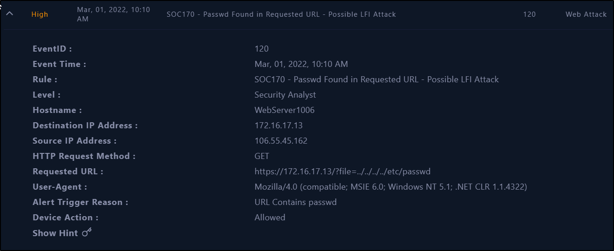

Criticidad: Alta

Taxonomía: Ataque Web

Detalles del caso: El servidor web con IP 172.16.17.13, parece haber sido atacado mediante un “Attack File Inclusion” el cual su objetivo es leer archivos del sistema a través del servidor web.

Lo primero que debemos hacer es recabar información sobre el incidente, esto lo vamos a visualizar en los logs, hacemos la búsqueda por la dirección IP origen del ataque y vemos los resultados obtenidos.

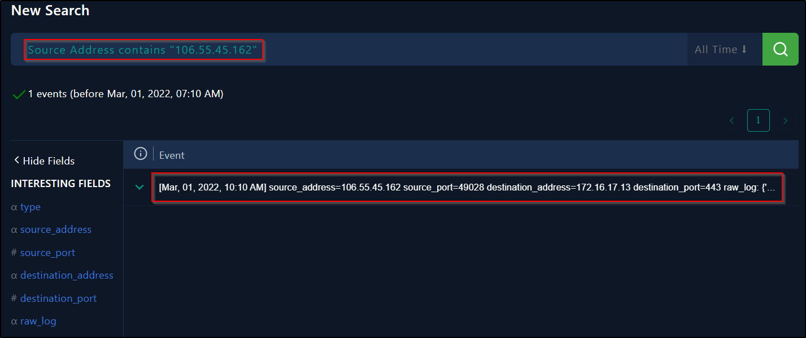

En este log podemos ver las ips tanto de origen como de destino, y la petición que hizo a la URL la máquina atacante.

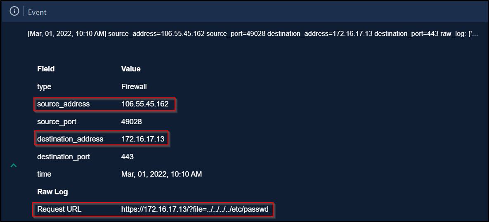

Una vez visto esto, podemos determinar si el trafico indicado es malicioso o no.

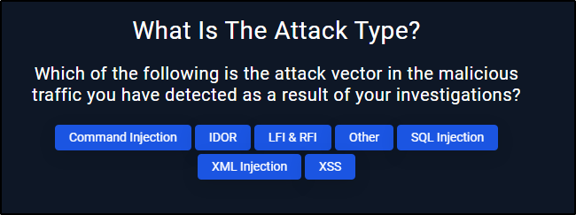

El siguiente paso del playbook, es indicar que tipo de ataque es el que estamos recibiendo, según hemos comprobado en los logs, es un ataque de tipo LFI (un ataque de Inclusión de Archivos Locales se produce cuando un atacante explota vulnerabilidades en aplicaciones web para incluir archivos que residen en el servidor web).

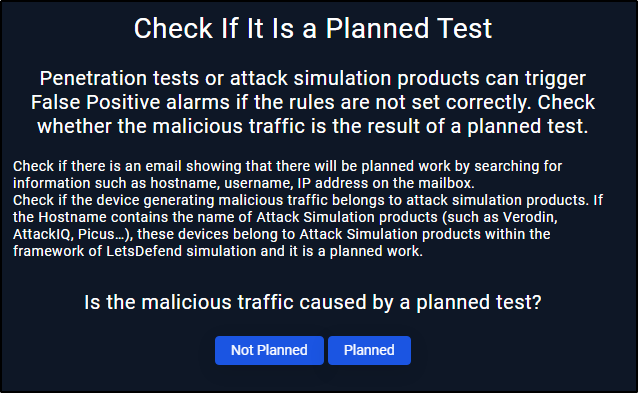

Una vez confirmado el tipo de ataque, deberemos comprobar si este ataque es un Pentesting externo contratado, para ello hemos revisado si hay algún mail avisándonos sobre ello. Como podemos observar, no tenemos ningún mail entrante sobre ello,

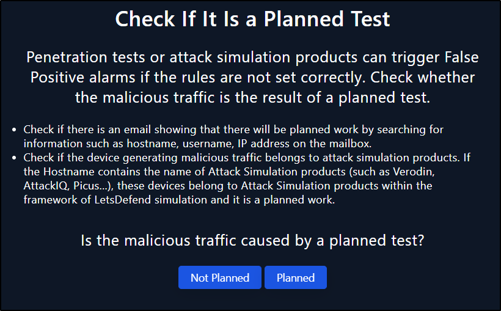

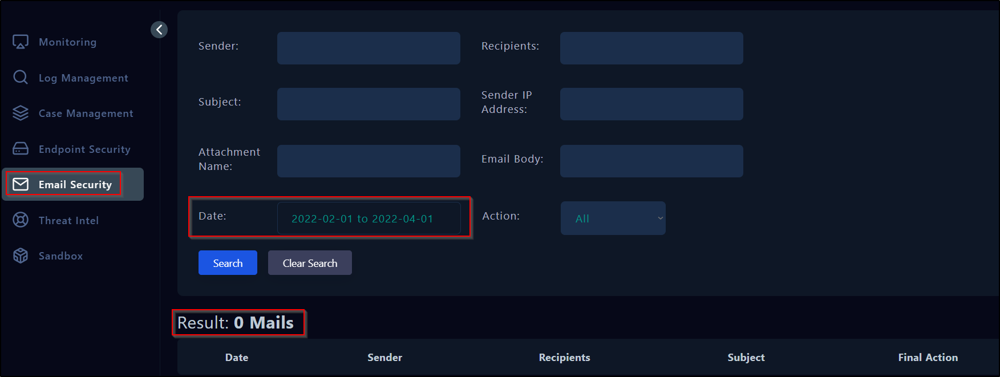

El siguiente paso de este playbook, será dictaminar si la dirección del ataque, si es desde el interior de la empresa al exterior, del exterior al interior o dentro de la misma empresa. Hemos comprobado anteriormente en los logs, que la conexión es desde el exterior hacia dentro de la empresa.

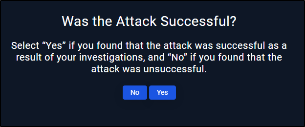

Lo siguiente será confirmar si el ataque fue exitoso, para ello vamos al log otra vez y podemos ver al respuesta del servidor ante el ataque, viendo que ha respondido con el 500 (**Internal Server Error)**, podemos comprobar que no ha sido exitoso el ataque.

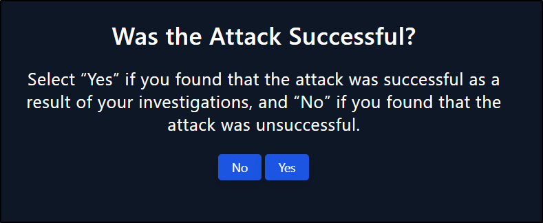

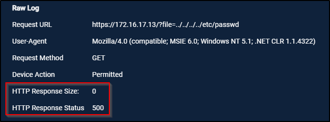

Una vez sabido todo esto, deberemos pensar si el sistema afectado necesita contención, al no haber sido un ataque exitoso, no necesita de esto.

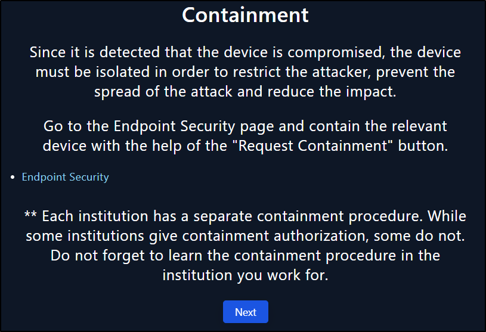

Tampoco es necesaria la escalada de al nivel 2, ya que el ataque al no ser exitoso, ya está contenido sin ninguna medida adicional.

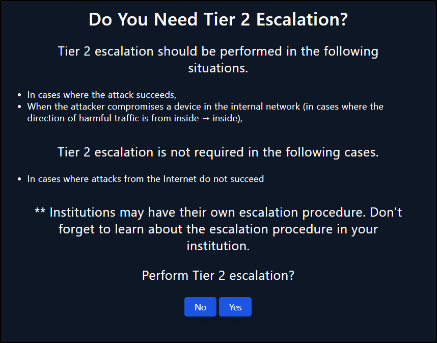

Los dos pasos finales de nuestro playbook sería la creación de los artifacts afectados, en el cual hemos añadido la dirección ip atacada sin haber sido exitosa. Así como en la nota de análisis hemos especificado el intento de ataque así como el método del mismo e indicando que no ha sido necesario contención del sistema afectado.

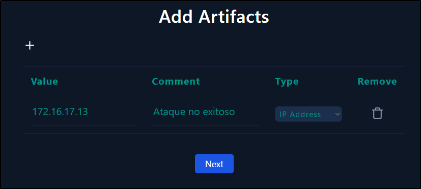

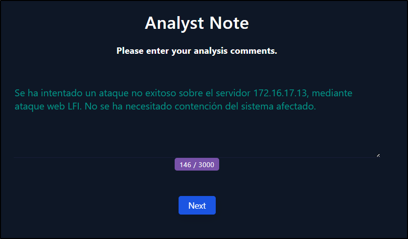

Con todo esto ya podemos cerrar el caso.

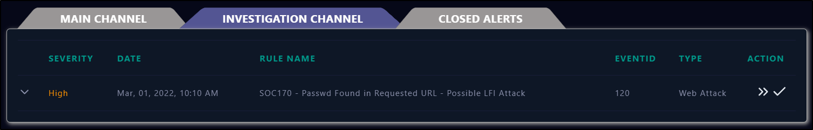

- ¿Has tenido que realizar algún tipo de actuación para el restablecimiento de servicios afectados por el incidente, con el objetivo de volver a la normalidad?

Durante la resolución de este caso, no se ha tenido que realizar al contención ni restablecimiento de ningún sistema afectado, ya que el ataque no fue exitoso.

- ¿Qué acciones/actuaciones destacadas se han realizado para solucionar el incidente?

El análisis de los logs generados, para saber que el ataque ha sido exitoso o no y su propio origen.

- Realizar un proceso de análisis de las actuaciones llevadas a cabo y obtener un registro de lecciones aprendidas, para finalmente concluir en las posibles mejoras que podrías plantear para tu plan/playbooks desarrollado en la práctica anterior.

La importancia del conocimiento de los logs generados para un fácil reconocimiento y respuesta ante los incidentes, así como saber reconocer los diferentes tipos de ataques para la correcta respuesta del mismo.

- ¿Qué actuaciones has decidido para evitar que se pueda dar una situación similar?

Verificación del código para la implementación de seguridad de aplicaciones webs, así como implementar medidas adicional como reglas en el firewall para protegernos de este tipos de ataques.

## SOC176 - RDP Brute Force Detected 

Criticidad: Media

Taxonomía: Fuerza bruta

Detalles del caso: Múltiples intentos de inicios de sesión a través del protocolo RDP. 

El primer paso del playbook es determinar si la dirección ip del atacante es externa o interna, en los datos del incidente arriba ubicado, podemos comprobar que la dirección de origen no es una dirección interna de nuestra empresa.

El siguiente paso será investigar esta ip, ¿Es una IP maliciosa?, esto podemos comprobarlo en las páginas que vienen mostradas, vamos a realizar la comprobación en nuestra propia base de datos (LetsDefend TI).

Podemos comprobar que es una IP maliciosa.

Lo siguiente será buscar en los Logs generados por el firewall que tipo de ataque estamos sufriendo, si es un ataque al puerto del SSH o un ataque RDP.

Podemos comprobar por los logs, que el ataque se esta ejecutando al puerto 3389, por lo cual es un ataque al servicio RDP, podemos ver los múltiples inicio de sesión intentados por el atacante.

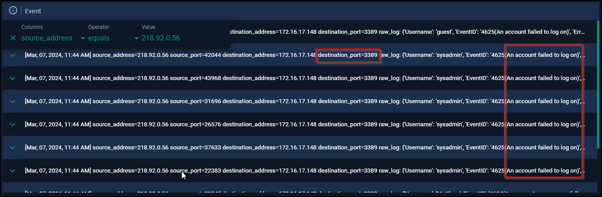

Como hemos comprobado en los logs anteriores, el atacante no está atacando con múltiples servidores o clientes.

Siguiendo con la investigación de los logs, hemos podido comprobar que ha habido una conexión exitosa en este ataque de fuerza bruta, mostrada por el EventID: 4624.

Como hemos visto que el ataque ha sido exitoso, vamos a realizar al contención del equipo.  Nos hemos desplazado hasta el host afectado y hemos aplicado las medidas correspondientes.

Una vez acabado el playbook elaboramos nuestros artifacts, en este caso hemos añadido la ip del host atacado y la ip del atacante y la elaboración de una nota de cierre sobre el incidente.

- ¿Has tenido que realizar algún tipo de actuación para el restablecimiento de servicios afectados por el incidente, con el objetivo de volver a la normalidad?

Se ha tenido que contener el equipo puesto que el ataque que ha sufrido ha sido exitoso. Pero no se ha necesitado el restablecimiento de ningún servicio implicado.

- ¿Qué acciones/actuaciones destacadas se han realizado para solucionar el incidente?

El análisis de los logs generados y el conocimiento de los eventos del sistema, para saber si el ataque ha sido exitoso o no.

- Realizar un proceso de análisis de las actuaciones llevadas a cabo y obtener un registro de lecciones aprendidas, para finalmente concluir en las posibles mejoras que podrías plantear para tu plan/playbooks desarrollado en la práctica anterior.

No se dispone de este tipo de playbook  en nuestra empresa, así que la mayor mejora posible sería realizar uno tal como este.

- ¿Qué actuaciones has decidido para evitar que se pueda dar una situación similar?

Implementar una herramienta IDS que nos realice un bloqueo de la dirección ip del cuál se esta realizando el ataque recogido en los logs del IDS.  
Reforzamiento de las reglas de seguridad a los múltiples intentos de logins.

## SOC210 - Possible Brute Force Detected on VPN 

Criticidad: Alta

Taxonomía: Ataque de Fuerza Bruta

Detalles del caso: Se detectó un inicio de sesión por VPN exitoso poco después de varios intentos fallidos desde la misma dirección IP de origen.

Nota del L1: Revisé los registros de autenticación y vi muchos errores de inicio de sesión desde la misma dirección IP. También se detectó que la misma dirección IP intentaba iniciar sesión para diferentes usuarios. El inicio de sesión exitoso parece sospechoso después de estos intentos fallidos de inicio de sesión.

Para comenzar el playbook de respuesta a este incidente, vamos primero a dictaminar si el ataque ha sido desde el exterior o interior de nuestra empresa, para ello vamos a mirar la dirección ip de origen del ataque. Viendo los datos del incidente, podemos ver que la dirección ip de origen es externa a la empresa.

Ahora vamos a analizar la ip para saber si es maliciosa, hemos buscado en nuestra BD, pero no hemos encontrado resultado alguno, así que hemos mirado en otras BD sobre esta ip y hemos visto que si parece ser maliciosa.

Después de esto podemos dictaminar que hemos sufrido un ataque, aunque el servicio atacado no es ninguno de los dos mostrados a continuación.

También podemos afirmar viendo los logs, que ha intentado múltiples incios de sesión con distintos nombres de usuarios.

La siguiente pregunta de nuestro playbook es si el ataque ha sido exitoso o no, como hemos podido ver en la imagen anterior, uno de los intentos de logins del ataque ha sido exitoso.

Así que vamos a contener o aislar el host afectado por este ataque, como hemos visto en el log, la cuenta de usuario afectada, podemos ir directamente a su equipo para su contención.

Una vez terminado el playbook del incidente, hemos generado la lista de los artifacts afectados, indicando la ip de origen y de destino del ataque, así como la ip del host físico que hemos aislado y añadido una nota de cierre del incidente.

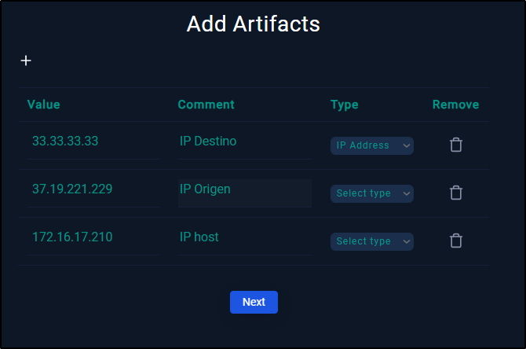

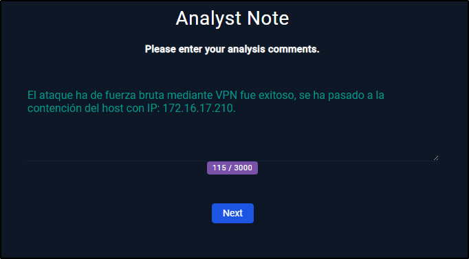

- ¿Has tenido que realizar algún tipo de actuación para el restablecimiento de servicios afectados por el incidente, con el objetivo de volver a la normalidad?

Se ha tenido que contener el equipo puesto que el ataque que ha sufrido ha sido exitoso. Pero no se ha necesitado el restablecimiento de ningún servicio implicado.

- ¿Qué acciones/actuaciones destacadas se han realizado para solucionar el incidente?

El análisis de los logs generados y el conocimiento de los eventos del sistema, para saber si el ataque ha sido exitoso o no.

- Realizar un proceso de análisis de las actuaciones llevadas a cabo y obtener un registro de lecciones aprendidas, para finalmente concluir en las posibles mejoras que podrías plantear para tu plan/playbooks desarrollado en la práctica anterior.

El paso del playbook el cual te pregunta si el ataque ha sido al servicio SSH/RDP debería de incluir mayores opciones, ya que en este caso no ha sido ninguno de estos dos sistemas los afectados

- ¿Qué actuaciones has decidido para evitar que se pueda dar una situación similar?

Crear una regla para que cuando se hacen múltiples intentos de inicio de sesión fallidos, bloquear la cuenta o poner en cuarentena directamente, para así vigilar las acciones del sospechoso si ha sido exitoso el ataque.

## SOC251 - Quishing Detected (QR Code Phishing) 

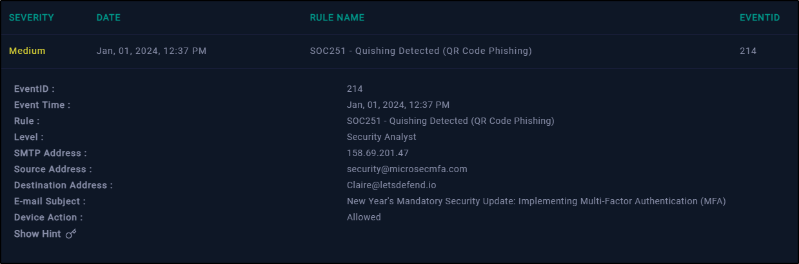

Criticidad: Media

Taxonomía: Phishing

Detalles del caso: Un usuario ha recibido un correo con un código QR malicioso.

Vamos a empezar el playbook indicado para este incidente. En este primer apartado nos pregunta que tipo de phishing es, en nuestro caso es por información, puesto que intenta recabar las credenciales de la victima.

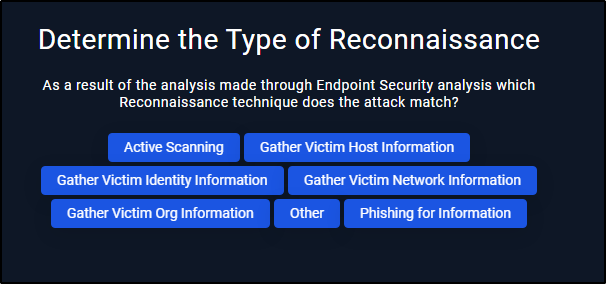

El siguiente paso del playbook es determinar si la dirección ip del atacante es externa o interna, en los datos del incidente arriba ubicado, podemos comprobar que el correo entrante no es un dominio de correo de nuestra empresa.

Ahora debemos comprobar la reputación de la ip, en este caso vamos a analizar la ip, para saber si es maliciosa o no, esto lo hemos realizado a través de [Virustotal.com](http://Virustotal.com) y nos ha arrojado el siguiente resultado:

Ahora debemos determinar cuales son los sistemas afectados. Para ello nos vamos a dirigir a la pestaña mails y recabar información de los usuarios que han recibido dicho mail, podemos comprobar que el único usuario afectado es Caire

Nuestro siguiente paso será determinar si hay que contener al target, puesto que hemos revisado el historial y hemos visto que no se ha accedido a la url maliciosa, se ha determinado que no se debe aislar al host afectado.

Una vez acabado el incidente, vamos a cerrarlo colocando los artifacts afectados y una nota de análisis final.

- ¿Has tenido que realizar algún tipo de actuación para el restablecimiento de servicios afectados por el incidente, con el objetivo de volver a la normalidad?

No se ha tenido que realizar ninguna acción puesto que el QR malicioso no se ha abierto por el destinatario.

- ¿Qué acciones/actuaciones destacadas se han realizado para solucionar el incidente?

El análisis del mail recibido para la comprobación de que el QR era malicioso y la investigación del historial del destinatario para conocer si el mail ha sido abierto.

- Realizar un proceso de análisis de las actuaciones llevadas a cabo y obtener un registro de lecciones aprendidas, para finalmente concluir en las posibles mejoras que podrías plantear para tu plan/playbooks desarrollado en la práctica anterior.

El saber si el usuario final afectado ha abierto o no para no tener que aislar un host y la mayor recuperación de la normalidad.

- ¿Qué actuaciones has decidido para evitar que se pueda dar una situación similar?

Formación de la concienciación de los usuarios respecto a este tipo de ataques, creación de filtros en los mails para detectar y bloquear correos maliciosos.

## SOC175 - PowerShell Found in Requested URL 

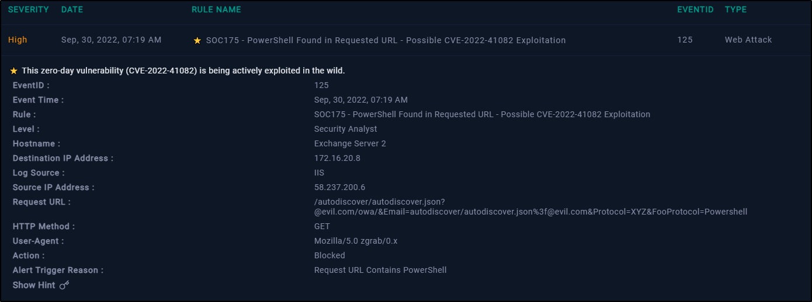

Criticidad: Alta

Taxonomía: Ataque Web

Detalles del caso: Se ha comprobado una petición URL que contiene una powershell

Comenzando con este playbook, lo primero que deberemos hacer es investigar la direción ip de origen de la petición. Esto vamos a realizarlo a través de la web de Virustotal. Podemos comprobar por los comentarios de los usuarios que el objetivo de esta dirección es un ataque de fuerza bruta por SSH.

También hemos podido comprobar en AbuseIPDB que esta IP ha sido reportada 612 veces, confirmando aún más a los usuarios de Virustotal.

Lo siguiente es dictaminar que tipo de ataque esta llevando a cabo, para ello vamos a revisar los logs filtrando por el origen de la ip de este incidente. Podemos ver que ha realizado tres peticiones a nuestro servidor.

Respecto a estos tres tipos de ataque, podemos comprobar que no es ninguno de los arriba indicados, ya que este ataque sería “Ejecución de código remoto”. 

El siguiente apartado del playbook sería conocer si este ataque remoto ha sido un acuerdo de pentesting con otra empresa, para ello vamos a revisar los mails recibidos y podemos ver que no ha habido ningún mail recibido sobre un pentesting programado.

Ahora tenemos que seleccionar desde donde ha sido la conexión, podemos ver en los detalles del incidente, que la conexión ha sido realizada desde el exterior a la empresa.

La respuesta a la siguiente pregunta la vimos anteriormente en los logs de las peticiones, viendo como el dispositivo ha bloqueado todas las peticiones que ha recibido de este incidente.

Los ultimos pasos del playbook será la creación de los artifacts afectados en el cual hemos añadido las dos IPs, tanto origen como destino, así como la petición URL sospechosa. En la nota de análisis hemos indicado que el ataque no ha sido exitoso gracias a la acción bloqueo del servicio.

- ¿Has tenido que realizar algún tipo de actuación para el restablecimiento de servicios afectados por el incidente, con el objetivo de volver a la normalidad?

No se ha tenido que tomar ninguna acción sobre ningún activo, ya que el ataque sufrido no ha sido exitoso.

- ¿Qué acciones/actuaciones destacadas se han realizado para solucionar el incidente?

Investigación de la ip asociada al ataque, análisis de los logs del sistema, determinación del tipo de ataque sufrido.

- Realizar un proceso de análisis de las actuaciones llevadas a cabo y obtener un registro de lecciones aprendidas, para finalmente concluir en las posibles mejoras que podrías plantear para tu plan/playbooks desarrollado en la práctica anterior.

La necesidad de los Logs del sistema para verificar si los ataques han sido exitosos o no,  se debería de tener una carpeta en los mails del sistema, solo para la comprobación de los pentesting programados.

- ¿Qué actuaciones has decidido para evitar que se pueda dar una situación similar?

Se debería de actualizar las políticas de seguridad para restringir o filtrar el trafico y así evitar algunas acciones maliciosas.

## SOC202 - FakeGPT Malicious Chrome Extension 

Criticidad: Alta

Taxonomía: Filtración de datos

Detalles del caso: Se ha encontrado una extensión sospechosa agregada al navegador.

Lo primero que vamos a investigar que son los archivos “.crx”, que haciendo una pequeña búsqueda podemos ver que son las extensiones en los navegadores para ampliar sus características.

El primer paso del playbook es saber el indicador de la amenaza, de las opciones dadas, podemos confirmas que es la primera, ya que es tráfico desconocido o inesperado saliendo a internet.

Ahora vamos a investigar un poco el incidente, vamos a comprobar los logs y el endpoint para saber si el malware ha sido contenido o eliminado. 

En el endpoint hemos encontrado en el historial de navegación que ha accedido a la extensión.

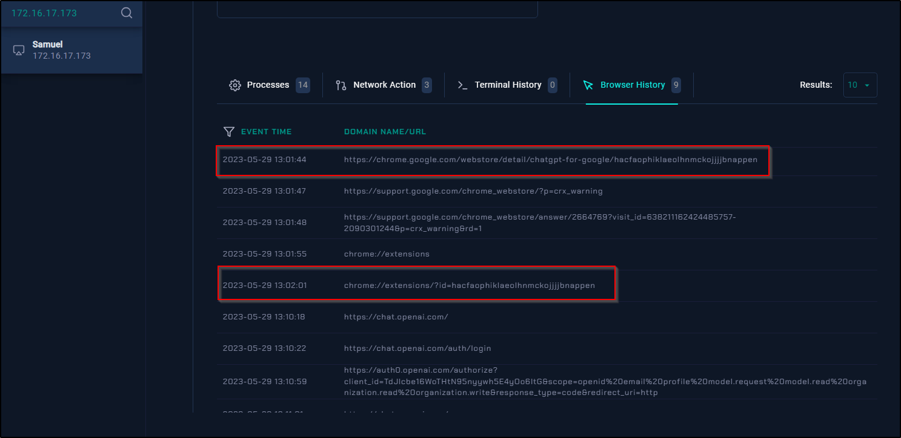

En los logs del sistema hemos encontrado dos conexiones sospechosas desde la IP de Samuel, estas conexiones son desde el navegador chrome y podemos ver que se han hecho en el mismo momento en el cual se ha instalado la extensión.

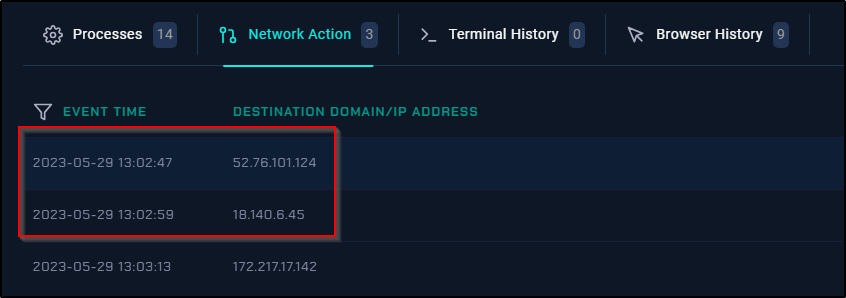

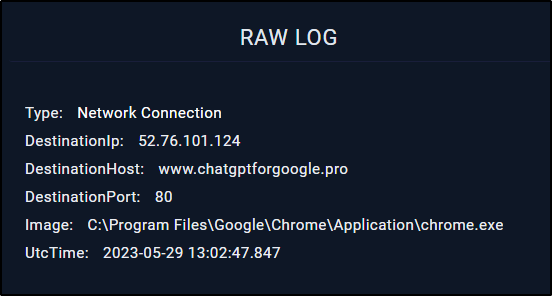

También se ha podido ver un proceso creado por la dicha extensión, que ha ejecutado un comando en el equipo.

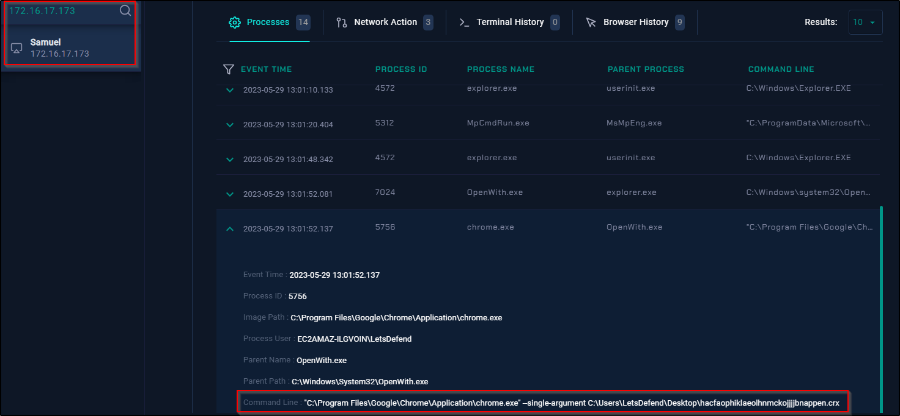

Por lo que podemos tomar la determinación de que el malware no ha sido controlado.

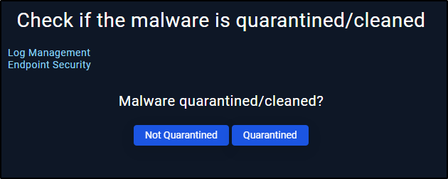

Lo siguiente será el análisis del malware, para ello vamos a usar el hash del archivo proporcionado en el incidente. Podemos comprobar como el archivo no es un malware. Ahora vamos a comprobar la URL dada en el historial de navegación del endpoint.

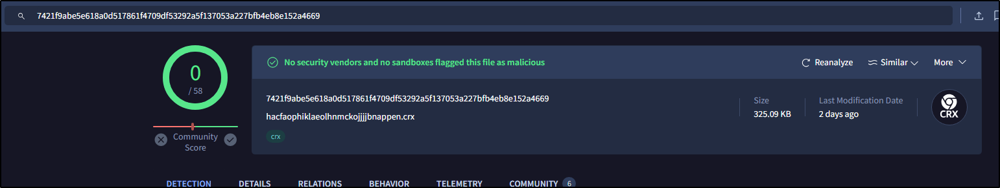

Existe una página web que te da información sobre las extensiones de chrome, vamos a mirar en ella a ver que nos puede contar sobre esta misma.

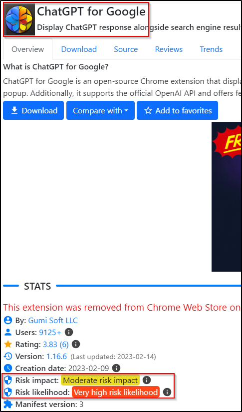

Podemos afirmar después de esta investigación de que el malware es malicioso.

El siguiente paso del playbook es la comprobación de si el usuario ha accedido al archivo malicioso, como hemos podido ver anteriormente en los logs del sistema, este ha accedido a la extensión de navegador.

Como ha accedido y el sistema puede estar comprometido, vamos a aislar al host para la seguridad de nuestra organización.

Una vez acabado el playbook elaboramos nuestros artifacts, en este caso hemos añadido los datos del archivo malicioso y la url del mismo como el equipo comprometido.

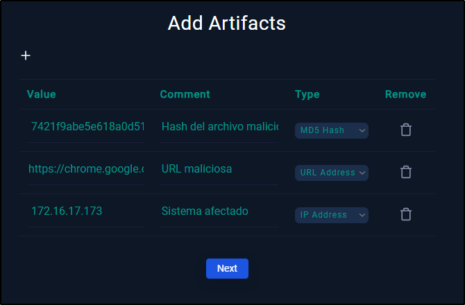

- ¿Has tenido que realizar algún tipo de actuación para el restablecimiento de servicios afectados por el incidente, con el objetivo de volver a la normalidad?

Se ha tenido que contener el host que accedió a la URL maliciosa por seguridad.

- ¿Qué acciones/actuaciones destacadas se han realizado para solucionar el incidente?

Investigación de la extensión del archivo, análisis de los logs y activiada en el endpoint.

- Realizar un proceso de análisis de las actuaciones llevadas a cabo y obtener un registro de lecciones aprendidas, para finalmente concluir en las posibles mejoras que podrías plantear para tu plan/playbooks desarrollado en la práctica anterior.

Necesidad de monitorización continua y reconocimiento de los tipos de amenazas presentes para el correcto desarrollo de los playbooks.

- ¿Qué actuaciones has decidido para evitar que se pueda dar una situación similar?

Mejorar la detección temprana de las amenazas para identificar y bloquear extensiones maliciosas antes de que puedan comprometer los sistemas.

Actualizar las políticas de seguridad para que incluir la prohibición de instalación de extensiones de navegador.

## SOC239 - Remote Code Execution Detected in Splunk Enterprise 

Criticidad: Alta

Taxonomía: Acceso no autorizado

Detalles del caso: Se detectó una carga XSLT maliciosa en el servidor Splunk Enterprise con el potencial de desencadenar la ejecución remota de código.

El primer paso del playbook es determinar si el trafico es malicioso o no, para ello vamos a buscar la ip de origen de la petición en virustotal para comprobarlo.

Podemos ver que muchos de los analistas de seguridad lo catalogan como malicioso.

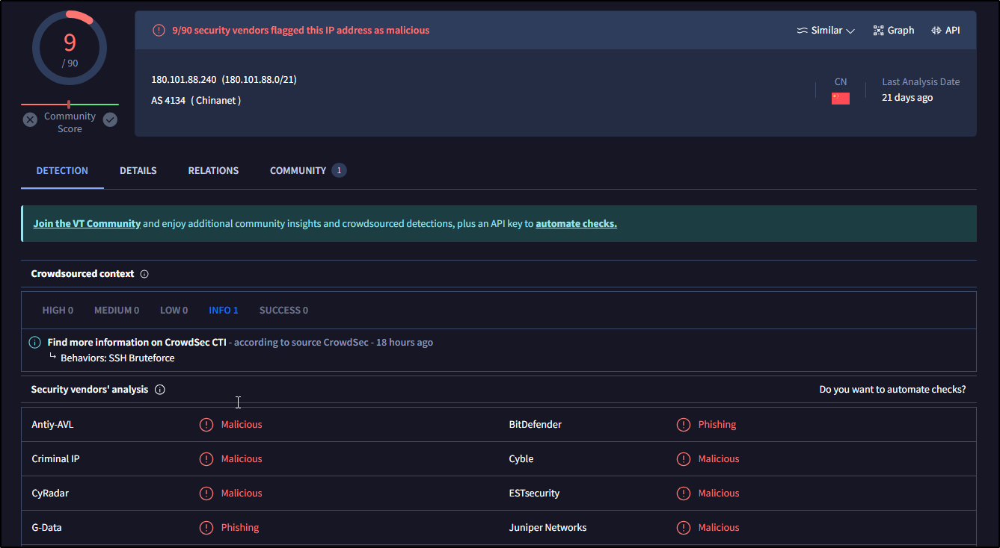

El siguiente paso es determinar que tipo de ataque es el que estamos sufriendo, ya que no tenemos acceso al archivo para ver su contenido y su análisis, podemos pensar que es un ataque de tipo inyección.

Ahora vamos a comprobar si el ataque es un pentesting planeado, para ello nos dirigimos a los emails y buscamos si ha habido algún aviso del mismo. Podemos comprobar que no hemos recibido ningún correo sobre un pentest.

Viendo en los detalles del incidente, podemos comprobar que la dirección del tráfico es entrante a la compañía desde el exterior.

Ahora debemos mirar si el ataque ha sido exitoso, como hemos visto en los detalles, la acción del dispositivo ha sido permisiva con esta petición, lo que podemos intuir que el ataque ha sido exitoso, también podemos ver en el endpoint que ha sucedido y podemos comprobar que ha habido una conexión SSH la cual ha generado un usuario con su carpeta en el menú home.

Así que vamos a proceder con la contención del host y la redacción de los artifacts.

Como el caso no ha sido resuelto, vamos a escalarlo al nivel 2, para que continúen con la investigación del mismo y añadiremos una nota para el escalado del incidente.

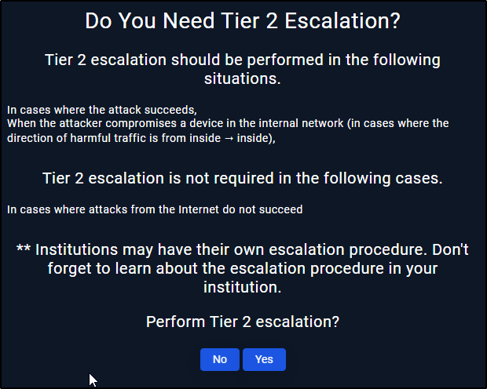

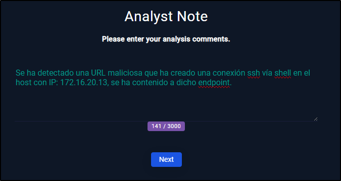

- ¿Has tenido que realizar algún tipo de actuación para el restablecimiento de servicios afectados por el incidente, con el objetivo de volver a la normalidad?

No hemos tenido que restablecer ningún servicio, ya que con el aislamiento del endpoint 

- ¿Qué acciones/actuaciones destacadas se han realizado para solucionar el incidente?

Determinar si la ip atacante es maliciosa o no, identificar el tipo de ataque, la contención del host atacado, análisis de la IP atacante y los logs del sistema.

- Realizar un proceso de análisis de las actuaciones llevadas a cabo y obtener un registro de lecciones aprendidas, para finalmente concluir en las posibles mejoras que podrías plantear para tu plan/playbooks desarrollado en la práctica anterior.

Reforzar la formación del personal para la identificación y gestión de la amenaza y así la solución del incidente sea más fluida y rápida.

- ¿Qué actuaciones has decidido para evitar que se pueda dar una situación similar?

Se debería de mejorar las reglas de SSH, siendo estas más restrictivas a los múltiples inicios de sesión.

## SOC173 - Follina 0-Day Detected 

Criticidad: Media

Taxonomía: Malware

Detalles del caso: Malware en el sistema

Se nos ha proporcionado el archivo malware para su análisis, en un entorno aislado se ha extraido y comprobado en Virustotal dándonos el siguiente resultado:

Ahora vamos a iniciar al playbook, el primer paso de este, es identificar la amenaza a la que nos estamos enfrentando.

Vamos a comprobar los logs generados por el equipo de Jonas, podemos ver que hay vario tráfico de red saliente desconocido desde el equipo Jonas.

El siguiente pasó será revisar si este malware ha sido erradicado o puesto en cuarentena, vamos a irnos al endpont afectado, en este caso es el equipo de JonasPRD y vamos a revisar 

Vamos a irnos al endpont afectado, en este caso es el equipo de JonasPRD y vamos a realizar una investigación de lo ocurrido en su ordenador. Podemos ver en la línea de comandos uno sospechoso, este parece buscar un archivo específico en la carpeta temporal del sistema, copiarlo y realizar algunas operaciones de búsqueda, decodificación y expansión antes de ejecutar un archivo ejecutable llamado "rgb.exe".

Podemos ver que el malware no se pone en cuarentena, pero tampoco se ejecuta completamente.

Ahora deberemos analizar el malware, pero como lo hicimos anteriormente podemos indicar rápidamente que es un archivo malicioso.

Lo siguiente es saber si se ha accedido al fichero malicioso. Habíamos visto anteriormente los registros de Jonas, y pudimos confirmar la conexión remota.

El siguiente paso será contener al endpoint, ya que hemos visto que puede estar comprometido

Una vez acabado el playbook elaboramos nuestros artifacts, en este caso hemos añadido la URL accedida por el malware, la ip del host empresarial afectado y la ip atacante.

- ¿Has tenido que realizar algún tipo de actuación para el restablecimiento de servicios afectados por el incidente, con el objetivo de volver a la normalidad?

Se ha tenido que contener el equipo puesto que ha sido comprometido por el malware, aunque no hubo ejecución exitosa. Pero no se ha necesitado el restablecimiento de ningún servicio implicado.

- ¿Qué acciones/actuaciones destacadas se han realizado para solucionar el incidente?

El análisis del terminal y los procesos en el endpoint para conocer si ha sido ejecutado exitosamente.

- Realizar un proceso de análisis de las actuaciones llevadas a cabo y obtener un registro de lecciones aprendidas, para finalmente concluir en las posibles mejoras que podrías plantear para tu plan/playbooks desarrollado en la práctica anterior.

Puesto que no dispongo playbook para este tipo de ataques, la mejor mejora posible sería realizar uno como el realizado en esta práctica.

- ¿Qué actuaciones has decidido para evitar que se pueda dar una situación similar?

Establecer un sistema de monitorización continua para detectar cualquier intento de explotación de la vulnerabilidad. Desarrollar e implementar medidas temporales de mitigación para reducir el riesgo de explotación de la vulnerabilidad, como la configuración de reglas de firewall.

## SOC250 - APT35 HyperScrape Data Exfiltration Tool Detected 

Criticidad: Media

Taxonomía: Filtración de datos

Detalles del caso: Se han identificado patrones de comportamiento inusuales o sospechosos vinculados al hash, lo que indica posibles intenciones maliciosas.

El playbook inicia con la investigación de los logs generados, para ello vamos a filtrar por la ip del equipo víctima de nuestra organización y buscar detalles sospechosos.

Tenemos dos logs relacionados a la dirección del equipo. 

Ahora investigar en el endpoint y en los emails si hay algo sospechoso, ya sea en peticiones HTTP, DNS, phishing o algún registro de seguridad.

No se ha recibido ningún mail a este destinatario, pero en el endpoint hemos podido encontrar el siguiente proceso ejecutado.

Ahora deberemos determinar que tipo de reconocimiento hace sobre el equipo este “malware”, como sabemos el tipo de vulnerabilidad que explota (HyperScrape), podemos afirmar que este busca filtrar los datos de usuario.

Tal como hemos visto anteriormente en los logs, la ip del atacante (136.243.108.14) viene desde fuera de nuestra empresa.

Debemos comprobar la reputación de la ip atacante, eso lo hemos realizado mediante la herramienta online Virustotal, en el que podemos ver que varios la catalogan como maliciosa.

A la hora de determinar si ha habido más objetivos afectados, podemos ver los logs del endpoint y no parece ser que el malware se haya expandido a otros dispositivos de nuestra red.

Ahora vamos a contener el host afectado para evitar la propagación de este ataque.

Una vez acabado el playbook elaboramos nuestros artifacts, en este caso hemos añadido la IP afectada, la IP maliciosa y el hash del archivo malicioso.

- ¿Has tenido que realizar algún tipo de actuación para el restablecimiento de servicios afectados por el incidente, con el objetivo de volver a la normalidad?

El aislamiento del endpoint empresarial, habría que realizar el seguimiento de este para saber si se ha erradicado el problema en su totalidad.

- ¿Qué acciones/actuaciones destacadas se han realizado para solucionar el incidente?

El análisis del malware, la comprobación de los logs del firewall y el aislamiento del equipo final.

- Realizar un proceso de análisis de las actuaciones llevadas a cabo y obtener un registro de lecciones aprendidas, para finalmente concluir en las posibles mejoras que podrías plantear para tu plan/playbooks desarrollado en la práctica anterior.

Creo que este playbook esta bien guiado para la resolución de este tipo de incidentes.

- ¿Qué actuaciones has decidido para evitar que se pueda dar una situación similar?

Mejorar la configuración del firewall añadiendo reglas para evitar este tipo de ataques a nuestra empresa.

## SOC169 - Possible IDOR Attack Detected 

Criticidad: Media

Taxonomía: Ataque web

Detalles del caso: Se ha detectado un posible ataque IDOR al servidor web empresarias WebServer105.

Este playbook lo iniciamos con una investigación del porqué ha llegado esta alerta. Para ello vamos a dirigirnos a los logs y a ver cual es la normal por la que se ha activado esta alerta.

Podemos comprobar que tenemos varias peticiones POST repetidas con distintos IDs.

Ahora vamos a recolectar los datos sobre los logs revisados anteriormente.

- La IP de destino es un servidor web con nombre de host WebServer1005.
- Realiza varias peticiones POST con distintos UIDs.
- El tráfico es entrante a la empresa.

El siguiente paso ya lo hemos realizado con la investigación de los logs.

Ahora empezamos con la toma de decisiones de nuestro playbook, la primera es determinar si el trafico es malicioso, hemos visto anteriormente que es un ataque intentado robar identidad.

Tal como hemos mencionado en el anterior, es un tipo de ataque IDOR, ya que intenta robar la identidad de su víctima.

Para este apartado nos dirigimos a los correos para verificar si ha sido un pentest programado por la empresa. Podemos ver que no ha habido ninguna notificación de ser un pentesting.

El siguiente paso es determinar la dirección del tráfico, hemos comprobado en los logs del sistema, que la dirección del tráfico es entrante a la empresa.

También respecto a los logs, hemos podido ver que la respuesta a estos ataques ha sido “Status 200”, esto quiere decir que la solicitud ha tenido éxito.

Sabiendo todo esto, vamos a realizar la contención del host víctima de nuestra empresa.

Una vez acabado el playbook elaboramos nuestros artifacts, en este caso vamos a añadir la IP atacante y la IP de nuestro host víctima.

Dado que el ataque ha sido exitoso, vamos a escalar el caso al siguiente nivel para que el equipo web remedie este tipo de ataque.

Creamos nuestra nota de analista y cerramos el caso.

- ¿Has tenido que realizar algún tipo de actuación para el restablecimiento de servicios afectados por el incidente, con el objetivo de volver a la normalidad?

Se ha tenido que contener el equipo puesto que ha sido comprometido por el malware, aunque no hubo ejecución exitosa. Pero no se ha necesitado el restablecimiento de ningún servicio implicado.

- ¿Qué acciones/actuaciones destacadas se han realizado para solucionar el incidente?

La recolección de datos, el análisis de los logs y el tráfico de red para saber que ha pasado.

- Realizar un proceso de análisis de las actuaciones llevadas a cabo y obtener un registro de lecciones aprendidas, para finalmente concluir en las posibles mejoras que podrías plantear para tu plan/playbooks desarrollado en la práctica anterior.

Ya que este problema ha sido escalado, se debería de ver el final de la resolución del caso.

- ¿Qué actuaciones has decidido para evitar que se pueda dar una situación similar?

Implementar controles automáticos en el desarrollo y despliegue de aplicaciones para detectar posibles vulnerabilidades en el código.

Utilizar tokens de sesión para gestionar y validar la identidad del usuario en cada solicitud.
