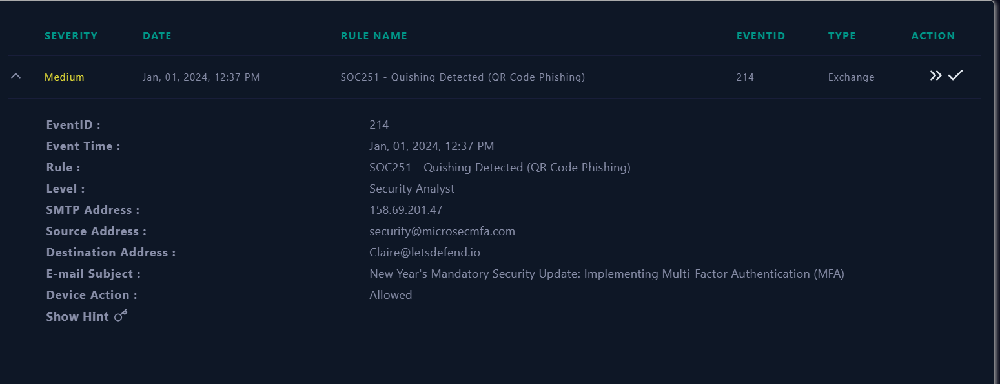
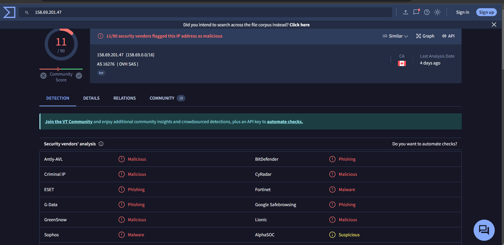

# 4.02 - Respuesta y seguimiento de incidentes (RA4.def)

## **Índice**
1. [SOC210- Possible Brute Force Detected on VPN](#soc210)  
2. [SOC 176- RDP Brute Force Detected](#soc176)  
3. [SOC170 - Passwd Found in Requested URL - Possible LFI Attack](#soc170)  
4. [SOC202 - FakeGPT Malicious Chrome Extension](#soc202)  
5. [SOC239 - Remote Code Execution Detected in Splunk Enterprise](#soc239)  
6. [SOC227 - Microsoft SharePoint Server Elevation of Privilege - Possible CVE-2023-29357 Exploitation](#soc227)  
7. [SOC235 — Atlassian Confluence Broken Access Control 0-Day CVE-2023-22515](#soc235)  
8. [SOC175 - PowerShell Found in Requested URL - Possible CVE-2022-41082 Exploitation](#soc175)  
9. [HyperScrape Data Exfiltration Tool Detected](#data)  
10. [QR Code Phishing](#qr)  

## SOC210- Possible Brute Force Detected on VPN 

1. Trabaja una memoria del trabajo realizado en la resolución de los incidentes. Tipo según taxonomía, Criticidad, Descripción del incidente para entender que ha sucedido. Utiliza imágenes y cualquier tipo de explicación y diagrama que permita aclarar tu trabajo. 
    - Taxonomía: Brute Force
    - Criticidad: Alta
    - Descripción: Se detectó un inicio de sesión en la VPN poco después de intentos fallidos de inicio de sesión desde la misma IP de origen.
    
    Primero veamos los detalles del caso:
    
    
    
    Vamos con la primera que nos dice, si la IP es externa o interna, como vemos, la IP es externa:
    
    
    
    Luego, nos pregunta si la IP, es sospechosa, asi que ponemos la IP en Virus Total y:
    
    
    
    Podemos decir que es sospechosa y maliciosa:
    
    
    
    Luego nos pregunta si recibió request de la IP, si nos vamos a lOg Managment, y filtramos, podemos ver que hay request:
    
    
    
    Asi que la respuesta es si:
    
    
    
    Luego nos dice, si hubo otra IP en el ataque, si nos vamos en el Log Managment, podemos ver que también hay otras IPs, así que podemos decir que sí:
    
    
    
    Luego nos pregunta si ha habido un acceso correcto,, el cual podemos mirar en Log Managment y filtramos por la IP y por el Raw Log:
    
    
    
    Como vemos, hubó un acceso correctó asi que ya sabemos la repsuesta:
    
    
    
    Nos pregunta luego si l dispositivo debe ser aislado, asi que, ponemos que si, ya que su ataque se hizo:
    
    
    
    Y con ello, terminamos el Playbook.
    
2. Durante la resolución del incidente ¿has tenido que realizar algún tipo de actuación para el restablecimiento de servicios afectados por el incidente, con el objetivo de volver a la normalidad?
    
    
    No hay que devolver un servicio, porque fue un fallo de seguridad.
    
3. Tras trabajar en la resolución del incidente ¿Qué acciones/actuaciones destacadas se han realizado para solucionar el incidente? 
    
    
    Aislar el dispositivo, por el fallo de seguridad, para evitar que accedan a más datos.
    
4. Realizar un proceso de análisis de las actuaciones llevadas a cabo y obtener un registro de lecciones aprendidas, para finalmente concluir en las posibles mejoras que podrías plantear para tu plan/playbooks desarrollado en la práctica anterior.
    
    
    Diría que aspecto a tener en cuenta, que se tenia que haber hecho, es darse cuenta, con que usuario ha entrado y cambiar la contraseña inmediatamente, aparte de aislar el dispositivo.
    
5. Seguro que en el proceso de análisis para obtener un registro de lecciones aprendidas anterior, has pensado como evitar que una situación similar se vuelva a repetir. ¿Qué actuaciones has decidido para evitar que se pueda dar una situación similar?

Mejorar la seguridad de la cuentas, estabelcer firewalls, para que solo se puedan conectar IP conocidas, Cambiar la contraseña de las cuentas cada cierto tiempo…

## SOC 176- RDP Brute Force Detected 

1. Trabaja una memoria del trabajo realizado en la resolución de los incidentes. Tipo según taxonomía, Criticidad, Descripción del incidente para entender que ha sucedido. Utiliza imágenes y cualquier tipo de explicación y diagrama que permita aclarar tu trabajo. 
    - Taxonomía: Brute Force
    - Criticidad: Medio
    - Descripción: Posible ataque de fuerza brutal, por intentar loguearse con usuarios que no existen.
    
    Primero veamos los detalles del caso:
    
    
    
    La primera pregunta nos dice si es la IP externa o Interna, si vemos bien, las IP, son muy diferentes, asi que ponemos que es externo:
    
    
    
    La siguiente pregunta nos dice, si es la IP sospechosa o no, podemos verlo a través de VirusTotal:
    
    
    
    El cual ya nos releva, que efectivamente, es sospechoso y malicioso:
    
    
    
    Lo siguiente que nos pregunta y es si, ha habido un request en un puerto SSH o RDP, si nos vamos a Log Managment, podemos filtrar por la IP y puerto:
    
    
    
    Como vemos, ese es el puerto de RDP, así que efectivamente, ha habido Request:
    
    
    
    Lo siguiente que nos pregunta, es si ha habido, mas de una IP atacante. Si miramos todos los Log Managment, podemos ver que todos se han hecho con la misma IP:
    
    
    
    La siguiente, nos pregunta si se logueo al final, el atacante, si miramos los Logs, podemos ver que en uno, hay:
    
    
    
    Lo que significa que se logueo correctamente, así podemos poner que si, se logueo y fue con éxito el ataque de fuerza bruta:
    
    
    
    Luego nos pregunta si hace falta aislarlo, así que ponemos, que si, debido a  que el ataque que le han hecho fue hecho, tuvo éxito :
    
    
    
    Y con ello, terminamos el Playbook.
    
2. Durante la resolución del incidente ¿has tenido que realizar algún tipo de actuación para el restablecimiento de servicios afectados por el incidente, con el objetivo de volver a la normalidad?
    
    
    No hay que devolver un servicio, porque fue más bien un fallo de seguridad.
    
3. Tras trabajar en la resolución del incidente ¿Qué acciones/actuaciones destacadas se han realizado para solucionar el incidente? 
    
    
    Aislar el dispositivo, por el fallo de seguridad, para evitar que accedan a más datos.
    
4. Realizar un proceso de análisis de las actuaciones llevadas a cabo y obtener un registro de lecciones aprendidas, para finalmente concluir en las posibles mejoras que podrías plantear para tu plan/playbooks desarrollado en la práctica anterior.
    
    
    Diría que aspecto a tener en cuenta, que se tenia que haber hecho, es darse cuenta, con que usuario ha entrado y cambiar la contraseña inmediatamente, aparte de aislar el dispositivo
    
5. Seguro que en el proceso de análisis para obtener un registro de lecciones aprendidas anterior, has pensado como evitar que una situación similar se vuelva a repetir. ¿Qué actuaciones has decidido para evitar que se pueda dar una situación similar?

Mejorar la seguridad de la cuentas, estabelcer firewalls, para que solo se puedan conectar IP conocidas, Cambiar la contraseña de las cuentas cada cierto tiempo…

## SOC170 - Passwd Found in Requested URL - Possible LFI Attack 

1. Trabaja una memoria del trabajo realizado en la resolución de los incidentes. Tipo según taxonomía, Criticidad, Descripción del incidente para entender que ha sucedido. Utiliza imágenes y cualquier tipo de explicación y diagrama que permita aclarar tu trabajo. 
    - Taxonomía: Web Attack
    - Criticidad: Alto
    - Descripción: Posible ataque para conseguir acceso al /etc/passwd
    
    Primero veamos los detalles del caso:
    
    
    
    Si no vamos a Log Managment, podemos ver que hay un Log, de un intento de entrar al etc/passwd, pero falló y recibió el código 500 de Error:
    
    
    
    Ya con eso, por ejemplo, pongamos la IP que intentó ponerlo, en Virus Total, para ver si es maliciosa:
    
    
    
    Como podemos ver, es maliciosa, así que, podemos responder a la primera pregunta:
    
    
    
    En la siguiente pregunta, nos dice que tipo de ataque fue:
    
    
    
    La respuesta es LFI (Local File Inclusion) y RFI (Remote File Inclusion). 
    
    La siguiente nos pregunta si el ataque fue planeado, para ello vamos a Email Security, y buscamos, por la IP. No tenemos nada, así que el ataque fue no Planeado
    
    
    
    
    
    La siguiente preguntas nos dice, como fue el ataque, esta ya lo sabemos asi que es de Internet —> a la compañía:
    
    
    
    La siguiente pregunta, nos dice si el ataque se hizó, como vimos anteriormente, sabemos que no, debido a que recibió un código 500 de Error:
    
    
    
    Tras ellos, nos pregunta, si hace falta aislar el equipo, ponemos que no, debido a que el ataque falló:
    
    
    
    Y con ello, terminamos el Playbook.
    
2. Durante la resolución del incidente ¿has tenido que realizar algún tipo de actuación para el restablecimiento de servicios afectados por el incidente, con el objetivo de volver a la normalidad?
    
    
    No ha hecho falta, debido a que fue un intento, pero fallo por la seguridad que tenemos en nuestra empresa
    
3. Tras trabajar en la resolución del incidente ¿Qué acciones/actuaciones destacadas se han realizado para solucionar el incidente? 
    
    
    No pasó nada a mayores, por la seguridad, aunque siempre tengamos que mirar la seguridad, e intentar siempre a mejorarla para que no haya tipo de ataques como este.
    
4. Realizar un proceso de análisis de las actuaciones llevadas a cabo y obtener un registro de lecciones aprendidas, para finalmente concluir en las posibles mejoras que podrías plantear para tu plan/playbooks desarrollado en la práctica anterior.
    
    
    Diría que Aspectos a mejorar, sería mejorar poco a poco la seguridad que ponemos en nuestra emresa, para así evitar estos ataques.
    
5. Seguro que en el proceso de análisis para obtener un registro de lecciones aprendidas anterior, has pensado como evitar que una situación similar se vuelva a repetir. ¿Qué actuaciones has decidido para evitar que se pueda dar una situación similar?

Mejorar la segurdad, evitar que exita estso tipos de enlaces en nuestra página web…

## SOC202 - FakeGPT Malicious Chrome Extension 

1. Trabaja una memoria del trabajo realizado en la resolución de los incidentes. Tipo según taxonomía, Criticidad, Descripción del incidente para entender que ha sucedido. Utiliza imágenes y cualquier tipo de explicación y diagrama que permita aclarar tu trabajo. 

- Taxonomía: Data Leakage
- Criticidad: Alto
- Descripción: Una extension maliciosa en Google Chrome se ha detectado

Primero, veamos la información del problema:

Analicemos, todo lo que tiene la página web sobre este caso,  si vamos a Log Managent, podemos ver información sobre la IP:

Vayamos a EndPoint Security:

Tenemos un vistazo a que tiene busqueda de web sospechosas, asi que ya podemos responder a la primera pregunta:

Pra la siguiente pregunta, nos dice si el Malware fue puesto en Cuarentena. Si vemos, se ha usado comandos, inmediatamente, luego, de haberlo descargado, asi que, ya sabemos la respuesta:

Pasamos a la siguiente, pregunta que nos dice si es malicios o no, para ellos vamos a usar el hash, que se encuentra en la información del problema:

Lo he puesto en Virus Total y se puede ver que no es malicioso. Pero si seguimos analizando, podemos ver:

El nombre de la ID de la extension maliciosa, el cual, si eso lo ponemos en VirusTotal todo el enlace, podemos ver, que en realidad Si era malicioso:

Asi que ponemos de respuesta que es malicioso:

La siguiente pregunta, nos dice si accedió:

Para ello, vamos a Log Management y buscamos por su IP, en una de la opciones, podemos ver:

Un Log en el cual accedió a un enlace falso de chatGPT, asi que ponemos que si accedió :

Por ello, debemos de poner aislado, para mirar su comportamiento:

Y con ello, terminamos el Playbook.

1. Durante la resolución del incidente ¿has tenido que realizar algún tipo de actuación para el restablecimiento de servicios afectados por el incidente, con el objetivo de volver a la normalidad?
    
    Por ahora, lo único que podemos hacer es vigilar el comportamiento de el dispositivo y mirar, si tiene algún probelma en un futuro y no afectará en su funcionamiento .
    
2. Tras trabajar en la resolución del incidente ¿Qué acciones/actuaciones destacadas se han realizado para solucionar el incidente? 
    
    Lo único que se puede hacer es aislar el dispositivo para que no pase a mayores el incidente.
    
3. Realizar un proceso de análisis de las actuaciones llevadas a cabo y obtener un registro de lecciones aprendidas, para finalmente concluir en las posibles mejoras que podrías plantear para tu plan/playbooks desarrollado en la práctica anterior.
    
    Se debería si eso incitar a los empleados de usar solo exclusivamente, extensiones que esten verificadas y que tengan una buena review.
    
4. Seguro que en el proceso de análisis para obtener un registro de lecciones aprendidas anterior, has pensado como evitar que una situación similar se vuelva a repetir. ¿Qué actuaciones has decidido para evitar que se pueda dar una situación similar?

Incitar a los empleados, vigilancias constantes de los equipos,  poner antivirus, cortafuegos…

## SOC239 - Remote Code Execution Detected in Splunk Enterprise 

1. Trabaja una memoria del trabajo realizado en la resolución de los incidentes. Tipo según taxonomía, Criticidad, Descripción del incidente para entender que ha sucedido. Utiliza imágenes y cualquier tipo de explicación y diagrama que permita aclarar tu trabajo. 
    - Taxonomía: Unauthorized Access
    - Criticidad: Alto
    - Descripción: Vulnerabilidad en la Aplicación Splunk que permite a un atacante ejecutar código arbitrario utilizando transformaciones XSLT proporcionadas por el usuario.
    
    Primero miremos las IPs que ha habido del problema con el playload:
    
    
    
    Ahora si vamos al Log Management, podemos apuntar los puertos que incluso que usan:
    
    
    
    Si miramos la IP por ejemplo, en VirusTotal, podemos ver lo siguiente:
    
    
    
    La IP es maliciosa como tal, entonces podemos empezar con el Playbook como tal. La primera pregunta nos dice si es malicioso, si miramos la IP, con lo de virus total, ya podemos decir que es malicioso.
    
    
    
    La siguiente pregunta, nos dice que tipo de ataque es:
    
    
    
    Si investigamos, podemos ver en un log un archivo XSL
    
    
    
    El cual si miramos por internet, podemos ver que es un documento XML, entonces ya con eso, podemos responder la pregunta:
    
    
    
    
    
    En la siguiente pregunta, nos pregunta si el ataque fue intencionado o no, la respuesta sería no planeado debido a que no hubo un correo directo al equipo que se atacó:
    
    
    
    Luego, nos dice como fue la dirección de ataque, como vimos,, fue de Internet a la empresa:
    
    
    
    Como vimos, con logs, para la siguiente pregunta, podemos responder que el ataque se hizo, así tendremos que ponerlo en Tier 2 o en aislamiento y con eso terminamos el playbook.
    
    
    
    
    
2. Durante la resolución del incidente ¿has tenido que realizar algún tipo de actuación para el restablecimiento de servicios afectados por el incidente, con el objetivo de volver a la normalidad?
    
    No se ha hecho nada para restablecer los servicios debido a que buscamos una manera para evitar que se complique y el ataque se haga en más equipos.
    
3. Tras trabajar en la resolución del incidente ¿Qué acciones/actuaciones destacadas se han realizado para solucionar el incidente? 
    
    Se trabajó en más que nada, en aislar el equipo, para evitar el contagio a otros equipos
    
4. Realizar un proceso de análisis de las actuaciones llevadas a cabo y obtener un registro de lecciones aprendidas, para finalmente concluir en las posibles mejoras que podrías plantear para tu plan/playbooks desarrollado en la práctica anterior.
    
    Las mejoras sería la de cerrar o abrir los puertos que sean necesarios debido a que si tenemos los puertos abiertos, hay más posibilidades de ataque pero si tenemos los mínimos, habrá menos ataques
    
5. Seguro que en el proceso de análisis para obtener un registro de lecciones aprendidas anterior, has pensado como evitar que una situación similar se vuelva a repetir. ¿Qué actuaciones has decidido para evitar que se pueda dar una situación similar?

Asegurarse la aplicación este actualizada, restricción de permisos, auditoría de actividad, configurar reglas de firewall, pruebas de seguridad…

## SOC227 - Microsoft SharePoint Server Elevation of Privilege - Possible CVE-2023-29357 Exploitation 

1. Trabaja una memoria del trabajo realizado en la resolución de los incidentes. Tipo según taxonomía, Criticidad, Descripción del incidente para entender que ha sucedido. Utiliza imágenes y cualquier tipo de explicación y diagrama que permita aclarar tu trabajo. 

- Taxonomía: Web Attack
- Criticidad: Critico
- Descripción: La vulnerabilidad CVE-2023-29357 es una vulnerabilidad crítica de escalada de privilegios que, cuando se combina con otras vulnerabilidades, podría conducir a la ejecución de código remoto. Tiene una puntuación CVSS de 9.8

Antes de empezar con el playbook, apuntemos los datos:

Si ponemos la IP maliciosa en, por ejemplo, VirusTotal, podemos ver que la IP es maliciosa:

Ya que es maliciosa, entonces si vamos a Threat Intel, si buscamos la IP, podemos ver que esta 

Y si vamos al Log, podemos ver que hay 3 Logs:

El cual en todos, permite la acción GET en un dispositivo:

Y con ello, empecemos con nuestro Playbook:

La primera pregunta, nos dice si es malicioso o no, con lo que hemos visto, podemos decir que es malicioso como tal:

La siguiente pregunta, nos dice que tipo de ataque era, el cual, ponemos que es otro, porque con las imágenes analizadas anteriormente. podemos ver que no cumple con ningún otro ataque.

La siguiente pregunta nos dice si el ataque fue planeado y todo. Si vemos anteriormente, no hay conexión ni algo relacionado así que no estaba planificado:

Si vamos a la siguiente, nos pregunta como fue la conexión, y como vimos fue de Internet → Company Name

Entonces la siguiente pregunta es si el ataque trinfuó, y como vimos anteriormente, tuvó el código 200 asi que trinfuó y hay que poner el sipositivo en Tier2 y con eso terminamos este playbook.

1. Durante la resolución del incidente ¿has tenido que realizar algún tipo de actuación para el restablecimiento de servicios afectados por el incidente, con el objetivo de volver a la normalidad?
    
    La actuación que se hizo en el playbook, es suficiente, para ver como se desarrolla el comportamiento del equipo tras el ataque. 
    
2. Tras trabajar en la resolución del incidente ¿Qué acciones/actuaciones destacadas se han realizado para solucionar el incidente? 
    
    Aislar el equipo, tras el ataque e investigar la IP maliciosa que hizo el ataque y que tanto daño puede hacer en nuestro sitio web .
    
3. Realizar un proceso de análisis de las actuaciones llevadas a cabo y obtener un registro de lecciones aprendidas, para finalmente concluir en las posibles mejoras que podrías plantear para tu plan/playbooks desarrollado en la práctica anterior.
    
    La mejoras que podemos hacer en nuestro playbook, sería analizar que hizo para obtener el código 200  e incluso como se llegó a conseguir hacerlo para ver como se podría poner más seguridad en los demás equipos
    
4. Seguro que en el proceso de análisis para obtener un registro de lecciones aprendidas anterior, has pensado como evitar que una situación similar se vuelva a repetir. ¿Qué actuaciones has decidido para evitar que se pueda dar una situación similar?

Aplicar parches, Configurar permisos, monitoreo constante, Seguimiento de la vulnerabilidad…

## **SOC235 — Atlassian Confluence Broken Access Control 0-Day CVE-2023-22515** 

1. Trabaja una memoria del trabajo realizado en la resolución de los incidentes. Tipo según taxonomía, Criticidad, Descripción del incidente para entender que ha sucedido. Utiliza imágenes y cualquier tipo de explicación y diagrama que permita aclarar tu trabajo. 

- Taxonomía: Web Attack
- Criticidad: Alta
- Descripción: CVE-2023-22515 afecta a ciertas versiones de Atlassian Confluence Data Center y Server, permitiendo que atacantes maliciosos obtengan acceso a instancias de Confluence creando sin autorización.

Antes de empezar a rellenar el playbook, primero apuntemos las IP, que lo vamos a necesitar ahora, para obtener información :

Si buscamos por la IP de 43.130.1.222, podemos ver que se detecta como maliciosa:

Y ahora, si buscamos la IP, en el Log Managment podemos ver que ha habido acciones con esa IP:

Y ahora si vamos a Threat Intel, podemos ver la información de la IP maliciosa que hay:

Y ahora podemos responder ya a las preguntas del Playbook (Al menos por ahora), par primera pregunta, nos pregunta si es malicioso, ponemos que lo es

Ahora ponemos aquí en otro, debido a que no es ningún de los ataques que hay:

La siguiente pregunta, nos dice si el ataque estaba planeado o no… Si analizamos todos los datos recogidos, vemos que en realidad, no están conectados, así que no estaba planeado 

Lo siguiente, pregunta como se hizo el ataque, si vemos las imágenes anterioes, vemos que fue con Internet y luego fue a la compañía, entonces sería Internet → Company Netowrk

La siguiente nos pregunta, si el ataque se hizó, si miramos los logs, podemos ver que recibió el código 200, asi que en efecto el ataque funciono.

Y ya por último, nos pone si hace falta poner el equipo, en Tier 2, es decir, análisis y todo.. Como el ataque funcionó, entonces tenemos que ponerlo y tras eso, hemos hecho el playbook.

1. Durante la resolución del incidente ¿has tenido que realizar algún tipo de actuación para el restablecimiento de servicios afectados por el incidente, con el objetivo de volver a la normalidad?
    
    La actuación que se hizo en el playbook, es suficiente, para ver como se desarrolla el comportamiento del equipo tras el ataque. 
    
2. Tras trabajar en la resolución del incidente ¿Qué acciones/actuaciones destacadas se han realizado para solucionar el incidente? 
    
    Aislar el equipo, tras el ataque e investigar la IP maliciosa que hizo el ataque.
    
3. Realizar un proceso de análisis de las actuaciones llevadas a cabo y obtener un registro de lecciones aprendidas, para finalmente concluir en las posibles mejoras que podrías plantear para tu plan/playbooks desarrollado en la práctica anterior.
    
    La mejoras que podemos hacer en nuestro playbook, sería analizar que hizo para obtener el código 200  e incluso como se llegó a conseguir hacerlo para ver como se podría poner más seguridad en los demás equipos
    
4. Seguro que en el proceso de análisis para obtener un registro de lecciones aprendidas anterior, has pensado como evitar que una situación similar se vuelva a repetir. ¿Qué actuaciones has decidido para evitar que se pueda dar una situación similar?

Mejorar la seguridad del equipo, actualizar la versiones de software más pronto posible, restringir usuarios autorizados, aplicar parches de seguridad…

## **[SOC175 - PowerShell Found in Requested URL - Possible CVE-2022-41082 Exploitation]** 

1. Trabaja una memoria del trabajo realizado en la resolución de los incidentes. Tipo según taxonomía, Criticidad, Descripción del incidente para entender que ha sucedido. Utiliza imágenes y cualquier tipo de explicación y diagrama que permita aclarar tu trabajo. 

- Taxonomía: Web Attack
- Criticidad: Alta
- Descripción: Esta vulnerabilidad del día cero (CVE-2022-41082) está siendo activamente explotada.

Primero, veamos la información del problema:

Como nos dan la IP, primero comprobemos si la IP, ha sido comprometida, si nos vamos a una pagina para comprobar si la IP ha sido comprometida, como por ejemplo, [mxtoolbox.com](https://mxtoolbox.com/SuperTool.aspx?action=blacklist%3a92.187.155.169&run=toolpage), podemos ver lo siguiente, si ponemos la IP:

Y ahora busquemos más información, haber si podemos ver que ha pasado. Vamos al Log Management y buscamos por la IP, y si vemos:

Podemos ver que incluso en uno de ellos, han intentado acceder a la PowerShell, pero fue bloqueado justo a tiempo

Y ahora con eso, vamos a intentar responder las preguntas del Playbook:

En la primera pregunta, podemos ver que es malicioso, asi que señalamos esa opción.

En la siguiente pregunta, tenemos que poner Otro, debido a que es ejecución de código remoto. En la siguiente:

Tenemos que poner, que no es planeado, debido a que no hay correos en general, así que no esta planeado. Con al siguiente pregunta:

Tenemos que va por el Internet → A la compañía debido a que como miramos anteriormente, la IP se encuentra por Internet en una lista negra. En la siguiente pregunta:

Tenemos que poner no, debido a como puse en la imagen antes, el firewall bloqueó el acceso. Y ya en la última pregunta:

Tenemos que poner No, debido a que el ataque fallo.

Y con ello, terminamos el Playbook.

1. Durante la resolución del incidente ¿has tenido que realizar algún tipo de actuación para el restablecimiento de servicios afectados por el incidente, con el objetivo de volver a la normalidad?
    
    Por suerte, el firewall bloqueó el ataque, así que no pasó nada grave. Solo simplemente, establecer los pasos, de lo que seguimos y ya.
    
2. Tras trabajar en la resolución del incidente ¿Qué acciones/actuaciones destacadas se han realizado para solucionar el incidente? 
    
    Ya que la IP del dispositivo esta en una lista negra, tendríamos que cambiar la IP del sistema, y mejorar la seguridad para que no pase más en el equipo.
    
3. Realizar un proceso de análisis de las actuaciones llevadas a cabo y obtener un registro de lecciones aprendidas, para finalmente concluir en las posibles mejoras que podrías plantear para tu plan/playbooks desarrollado en la práctica anterior.
    
    Por suerte, este problema, no pasó a mayores, así que, lo suyo sería mejorar la seguridad del equipo y establecer pautas, de si pasa otra vez..
    
4. Seguro que en el proceso de análisis para obtener un registro de lecciones aprendidas anterior, has pensado como evitar que una situación similar se vuelva a repetir. ¿Qué actuaciones has decidido para evitar que se pueda dar una situación similar?

Mejorar la seguridad del equipo, establecer IP dinámica….

## HyperScrape Data Exfiltration Tool Detected 

1. Trabaja una memoria del trabajo realizado en la resolución de los incidentes. Tipo según taxonomía, Criticidad, Descripción del incidente para entender que ha sucedido. Utiliza imágenes y cualquier tipo de explicación y diagrama que permita aclarar tu trabajo. 

- Taxonomía: Data Leakage
- Criticidad: Media
- Descripción: Charming KItten fue observado usando una nueva herramienta llamada HYperscrape para extraer correos electrónicos de los buzones de las victimas.

Primero lo que vamos a hacer, es buscar información:

Si ponemos la IP, que nos pone y lo buscamos en Log Managment, podemos ver lo que se ha hecho con la IP. 

Si luego, vamos al endpoint Security y ponemos la IP, podemos ver información sobre el equipo en general:

Y ahora tras eso a Email Security, el cual, veremos que no hay nada

Con todo analizado podemos decir que es:

Debido a que intenta reunir información sobre la victima.

Tras ello, en el siguiente punto nos pregunto si el atacante es externo o interno:

Con todo lo analizado, podemos decir que es externo.

Ahora nos pide que analicemos la IP del atacante, para ver si es peligroso o no:

Para ello, si nos vamos a la recopilación de datos y vemos que IP recogió el Firewall podemos ver que IP es la del atacante:

Tras ello, si ponemos esa IP en VirusTotal, podemos ver que:

La IP es maliciosa o Malware, por lo que podemos declarar que si lo es:

Luego, nos pregunta, si luego ha habido más infectado, como hemos visto, no:

Y por último nos pregunta, si tenemos que poner en aislamiento el dispositivo. Ponemos que si:

Y con esto, ya terminamos nuestro playbook.

1. Durante la resolución del incidente ¿has tenido que realizar algún tipo de actuación para el restablecimiento de servicios afectados por el incidente, con el objetivo de volver a la normalidad?
    
    Ya que aislamos el dispositivo, se tendría que comprobar como se comporta el dispositivo, y dependiendo de como va, se restablecería los servicios o no, aunque, lo más recomendable sería formatear el dispositivo.
    
2. Tras trabajar en la resolución del incidente ¿Qué acciones/actuaciones destacadas se han realizado para solucionar el incidente? 
    
    Aislar el dispositivo, comprobar si otros equipos han sido afectados…
    
3. Realizar un proceso de análisis de las actuaciones llevadas a cabo y obtener un registro de lecciones aprendidas, para finalmente concluir en las posibles mejoras que podrías plantear para tu plan/playbooks desarrollado en la práctica anterior.
    
    Diría que usando todos los medios que se disponen, se ha realizado un buen trabajo, para garantizar la protección de los demás ordenadores y diría que como aspecto a mejorar, sería que cuando el firewall detecte algo, que bloqueé instantáneo a la IP sospechosa.
    
4. Seguro que en el proceso de análisis para obtener un registro de lecciones aprendidas anterior, has pensado como evitar que una situación similar se vuelva a repetir. ¿Qué actuaciones has decidido para evitar que se pueda dar una situación similar?

Mejorar al firewall, tomar medidas en el firewall, para que no vuelva a ocurrir este tipo de situaciones…

## QR Code Phishing 

1. Trabaja una memoria del trabajo realizado en la resolución de los incidentes. Tipo según taxonomía, Criticidad, Descripción del incidente para entender que ha sucedido. Utiliza imágenes y cualquier tipo de explicación y diagrama que permita aclarar tu trabajo. 

- Taxonomía: Exchange
- Criticidad: Media
- Descripción: Se ha enviado al correo de “Claire” un correo de “security@microsecmfa.com” con un código QR malicioso, y se va a investigar sobre si el Código QR es malicioso.

Primero vamos a empezar con la información del incidente, ya que es Código QR que se puso por correo, vamos a ver el correo

Tras ello, vamos a ver el análisis de el problema, ya que nos da el SMBT Address, asi que lo metemos en Virus Total, por si es tiene peligro de malicioso.

Como vemos, tiene un potencial de malicioso, así que busquemos la IP si ha tenido algún envio de datos:

Vemos que no hubó envio de datos entre la IP del ordenador y Claire, asi que ahorá toca comprobar, si el enlace que redirigé en QR es malicioso o no:

Como vemos, es malicioso, asi que ahora toca, responder al playbook:

Aquí sería Phishing for information.

Aquí, seria externo:

Aquí, seria Yes:

Aquí, sería no.

Y por último, se recomienda, que se aislé el ordenador, por el caso.

Tras eso, hemos terminado nuestro Playbook y análisis del caso.

1. Durante la resolución del incidente ¿has tenido que realizar algún tipo de actuación para el restablecimiento de servicios afectados por el incidente, con el objetivo de volver a la normalidad?
    
    Ya que aislamos el dispositivo, se tendría que comprobar como se comporta el dispositivo, y dependiendo de como va, se restablecería los servicios o no
    
2. Tras trabajar en la resolución del incidente ¿Qué acciones/actuaciones destacadas se han realizado para solucionar el incidente? 
    
    Aislar el dispositivo, comprobar por virus total el corre, junto a la dirección web que se redirige…
    
3. Realizar un proceso de análisis de las actuaciones llevadas a cabo y obtener un registro de lecciones aprendidas, para finalmente concluir en las posibles mejoras que podrías plantear para tu plan/playbooks desarrollado en la práctica anterior.
    
    Diría que usando todos los medios que se disponen, se ha realizado un buen trabajo, para garantizar la protección de los demás ordenadores y diría que como aspecto a mejorar, se requiere un filtrado de correo, para filtrar correo importante, a correo Spam.
    
4. Seguro que en el proceso de análisis para obtener un registro de lecciones aprendidas anterior, has pensado como evitar que una situación similar se vuelva a repetir. ¿Qué actuaciones has decidido para evitar que se pueda dar una situación similar?

Comprobar siempre el correo, notificar a los empleados que cualquier pregunta sobre un correo que avise al departamento de seguridad, para garantizar la procedencia y seguridad del correo…
