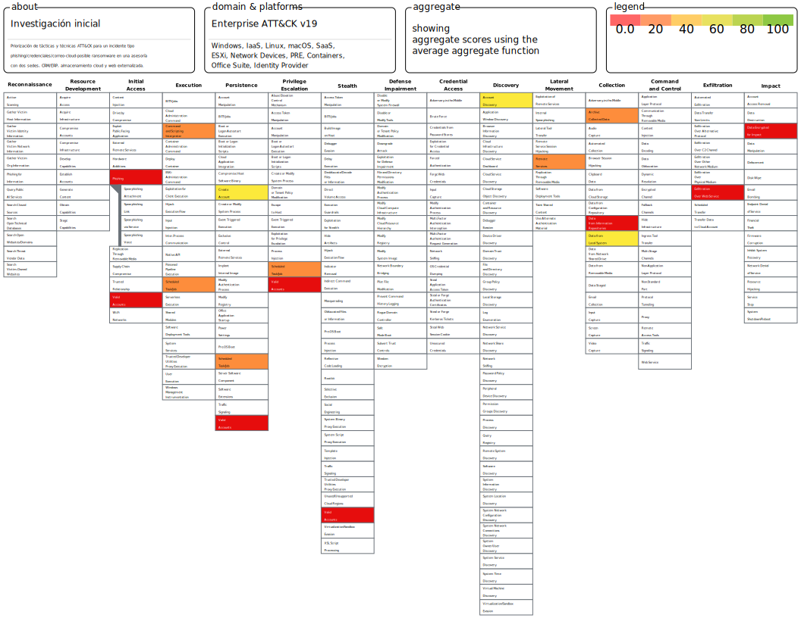
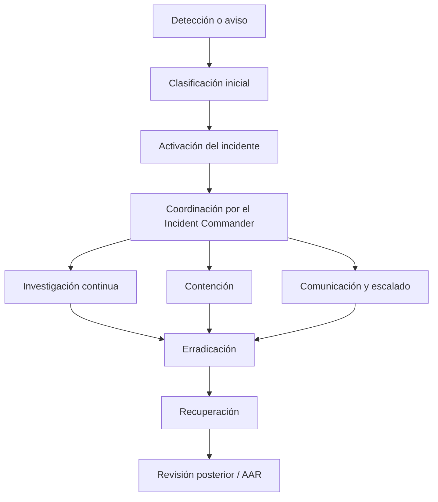
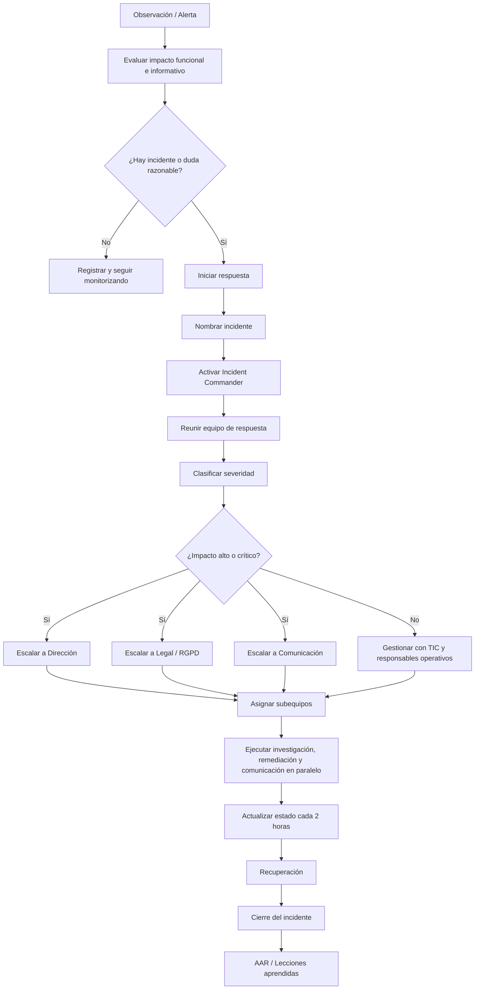

## Indice
## Introducción

En la actualidad, la seguridad de la información se ha convertido en un aspecto fundamental para cualquier organización que dependa de sistemas digitales para desarrollar su actividad diaria. En empresas como la analizada en este trabajo, donde buena parte de la operativa se apoya en el correo corporativo, el almacenamiento en la nube, la web, la tienda online y distintas aplicaciones de gestión, cualquier incidente de seguridad puede afectar de forma directa a la continuidad del negocio, a la protección de los datos y a la confianza de clientes y proveedores.

A partir de esta realidad, el presente trabajo se plantea como una propuesta integral orientada a mejorar la seguridad de la empresa desde una perspectiva práctica y organizada. No se trata solo de identificar riesgos o enumerar amenazas, sino de analizar la situación actual de la organización, estudiar sus activos más importantes, valorar las principales debilidades existentes y, a partir de ello, definir medidas concretas que permitan reforzar su nivel de protección y su capacidad de respuesta ante incidentes.

Uno de los aspectos más relevantes del trabajo es que no se limita a un enfoque teórico. A lo largo del desarrollo se adaptan metodologías, referencias y buenas prácticas al contexto real de la empresa objeto de estudio, teniendo en cuenta su tamaño, su dependencia de terceros, su nivel de madurez y los riesgos ya identificados. De este modo, se busca que las medidas propuestas no solo sean correctas desde el punto de vista técnico o metodológico, sino también razonables, aplicables y útiles dentro de un entorno empresarial real.

En conjunto, este trabajo pretende mostrar la importancia de abordar la ciberseguridad de forma estructurada, conectando la prevención, la gestión del riesgo y la respuesta a incidentes dentro de una misma línea de trabajo. El propósito final es contribuir a que la organización esté mejor preparada para proteger sus activos críticos, responder con mayor eficacia ante situaciones adversas y mantener la continuidad de su actividad en un entorno cada vez más expuesto a amenazas de seguridad.

## Plan de respuesta
## Playbooks

Los playbooks identificados como necesarios son:

1. [Phishing](playbooks/playbook-phishing.md)
2. [Ransomware](playbooks/playbook-ransomware.md)
3. [Compromiso de identidad y acceso](playbooks/playbook-identity-and-access.md)
4. [Compromiso de la cadena de suministro](playbooks/playbook-supply-chain.md)
5. [Desfiguración de sitios web](playbooks/playbook-defacement.md)
6. [Ataque DDoS](playbooks/playbook-ddos.md)
7. [Fuga de datos o exfiltración de información](playbooks/playbook-fuga-de-datos.md)
8. [Explotación de aplicación expuesta a Internet](playbooks/playbook-explotacion-aplicacion-publica.md)

La selección se ha basado en la empresa del caso: uso intensivo de correo, tratamiento de datos personales, dependencia de servicios cloud, web y tienda online externalizadas, exposición pública en Internet y madurez de seguridad básica. También se ha tenido en cuenta la taxonomía de incidentes, el impacto sobre CRM, ERP, correo, almacenamiento compartido y continuidad del negocio, y la relación de estos incidentes con ATT&CK y RE&CT.

La justificación de cada uno es:

1. `Phishing` es necesario porque el correo es un canal crítico y además es una vía habitual de robo de credenciales, malware y fraude.
2. `Ransomware` es prioritario porque la empresa depende de ficheros, aplicaciones internas y continuidad operativa.
3. `Compromiso de identidad y acceso` es clave por el uso de servicios cloud, correo y accesos remotos.
4. `Cadena de suministro` es necesario porque hay varios servicios externalizados, especialmente web, tienda online, antivirus y consultoría.
5. `Desfiguración de sitios web` encaja por la exposición pública de la web y el impacto reputacional directo.
6. `DDoS` está justificado por la dependencia del canal web y de la disponibilidad de servicios expuestos a Internet.
7. `Fuga de datos` es imprescindible por el tratamiento de datos personales y documentación sensible.
8. `Explotación de aplicación pública` es coherente con la existencia de servicios web accesibles desde Internet y con la falta de control directo sobre su securización.

## Respuesta a las preguntas
### 1.a   ¿Que relacción existe entre el trabajo que has hecho con las matrices MITRE ATT&CK y RE&CT y el plan de respuesta que estás planteando? ¿De que manera te ha ayudado el trabajo previo sobre las matrices a la hora de generar el plan? Deja evidencias del trabajo que has realizado sobre le navigator de las matrices, para obtener la información.

El trabajo con MITRE ATT&CK y RE&CT está directamente relacionado con el plan porque ha servido para identificar **qué amenazas son más probables**, **cómo se manifiestan** y **qué respuestas operativas conviene preparar**. No se trata solo de citar marcos conocidos, sino de utilizarlos para pasar de una visión general del riesgo a procedimientos concretos. En el plan esto se refleja, por ejemplo, en el uso de tácticas ATT&CK para formular preguntas de investigación, priorizar IOCs y orientar el análisis del vector, el alcance y el impacto del incidente.

ATT&CK ha ayudado sobre todo a entender el comportamiento del atacante: acceso inicial, abuso de credenciales, exfiltración, cifrado, explotación de aplicaciones públicas o denegación de servicio. Esto encaja con los incidentes más relevantes para la empresa, ya que depende del correo, del cloud, de la web y tienda online externalizadas y del tratamiento de datos personales. RE&CT resulta útil para aterrizar la respuesta: validación de indicadores, recogida de evidencias, contención, comunicación y recuperación. Gracias a ese trabajo previo, el plan no se queda en principios generales, sino que baja a acciones concretas y a playbooks específicos, y además permite justificar por qué se priorizan unos incidentes frente a otros.

### 1.b   ¿Qué playbooks has identificado como necesarios en este plan de respuesta y en que te has basado para identificar esos playbooks y saber que son los necesarios? Deja algún diagrama que describa el flujo de un playbook.

Los playbooks identificados como necesarios son:

1. [Phishing](playbooks/playbook-phishing.md)
2. [Ransomware](playbooks/playbook-ransomware.md)
3. [Compromiso de identidad y acceso](playbooks/playbook-identity-and-access.md)
4. [Compromiso de la cadena de suministro](playbooks/playbook-supply-chain.md)
5. [Desfiguración de sitios web](playbooks/playbook-defacement.md)
6. [Ataque DDoS](playbooks/playbook-ddos.md)
7. [Fuga de datos o exfiltración de información](playbooks/playbook-fuga-de-datos.md)
8. [Explotación de aplicación expuesta a Internet](playbooks/playbook-explotacion-aplicacion-publica.md)

La selección se ha basado en la empresa del caso: uso intensivo de correo, tratamiento de datos personales, dependencia de servicios cloud, web y tienda online externalizadas, exposición pública en Internet y madurez de seguridad básica. También se ha tenido en cuenta la taxonomía de incidentes, el impacto sobre CRM, ERP, correo, almacenamiento compartido y continuidad del negocio, y la relación de estos incidentes con ATT&CK y RE&CT.

Diagrama propuesto de flujo general de playbook:

### 1.c   ¿Como te has asegurado que has cubierto todas las fases del plan de respuesta? ¿Qué fase consideras que está más floja en un plan? ¿Cuál de ellas consideras que está mejor trabajada en tu plan? Asegúrate de hablar de todas las fases y como las cubres.

Se ha intentado cubrir todas las fases exigidas, y esa cobertura se puede justificar porque el plan no se limita a hablar de incidentes, sino que organiza la respuesta desde antes de que ocurran hasta después de cerrarlos:

1. **Preparación**: se cubre con la definición de roles, contactos, canales, estructura del equipo, formación, ritmo de batalla y normas de comunicación.
2. **Identificación**: se cubre con `Evaluar`, las categorías de impacto, la severidad, el nombrado del incidente y los apartados de investigación.
3. **Contención**: se cubre en los playbooks y en la coordinación paralela de investigación, remediación y comunicación.
4. **Erradicación**: se cubre en los playbooks mediante eliminación de persistencia, retirada de accesos no autorizados, corrección de vulnerabilidades y saneamiento de cuentas o sistemas.
5. **Recuperación**: se cubre con el orden de restauración, la validación funcional, la monitorización reforzada y la vuelta controlada a producción.

Además, el plan incluye una revisión posterior mediante AAR, lo que refuerza la cobertura global porque introduce aprendizaje y mejora continua, aunque esa fase vaya más allá de las cinco que el enunciado menciona expresamente.

La fase que suele quedar más floja en muchos planes es **preparación**, porque depende de que existan previamente roles claros, contactos actualizados, formación y procedimientos aprobados. En esta empresa eso es especialmente importante porque la madurez de seguridad es básica y además no existen políticas de seguridad por escrito en sentido amplio. La fase mejor trabajada en este plan es **la coordinación y el escalado durante la respuesta**, porque el documento desarrolla con bastante detalle el papel del Incident Commander, los canales, las llamadas de respuesta, el reparto en subequipos, la frecuencia de actualización y la comunicación interna y externa.

### 2.a   ¿En que consiste el Flujo de Toma de Decisiones y Escalado de tu plan de respuesta? ¿Existe un plan de comunicación, protocolos, etc? Si la respuesta es correcta, haz un resumen del plan y protocolos. Deja evidencias del flujo, mediante un diagrama. 

El flujo de toma de decisiones y escalado empieza con la evaluación del impacto funcional y de la información. Esto es importante porque el plan no propone escalar “por sensación”, sino a partir de criterios de impacto sobre negocio y sobre datos. Si hay indicios suficientes, o incluso si hay dudas razonables, se inicia la respuesta. A partir de ahí se nombra el incidente, se llama al Incident Commander, se activan los canales seguros, se celebra la llamada inicial y se asignan responsables de investigación, remediación y comunicación.

Sí existe un plan de comunicación y protocolos asociados. Se puede afirmar porque el documento no solo nombra la comunicación, sino que define canales, restricciones, frecuencia de actualización y responsables. El plan define:

1. Uso preferente de llamada de voz, chat y canales seguros.
2. Uso muy limitado del correo electrónico.
3. Prohibición de usar SMS salvo para redirigir a canales más seguros.
4. Actualizaciones periódicas cada 2 horas.
5. Aprobación centralizada de comunicaciones externas por el Incident Commander.
6. Coordinación con legal, dirección, negocio y enlaces internos o externos según severidad e impacto.

El flujo resumido puede expresarse así:

`Evaluar impacto -> Confirmar incidente -> Clasificar severidad -> Activar IC -> Reunir equipo -> Asignar subequipos -> Escalar a dirección/legal/comunicación según impacto -> Ejecutar acciones -> Actualizar estado -> Cerrar y hacer AAR`

El diagrama que pide el enunciado debería representar ese recorrido y marcar claramente los puntos en los que se escala a Dirección, Legal, Comunicación, TIC y responsables de negocio. Esa visualización es importante porque resume una de las partes más fuertes del plan: quién decide, cuándo se eleva el incidente y cómo se evita que cada equipo actúe por separado.

Diagrama propuesto del flujo de toma de decisiones y escalado:

### 3.a  ¿Como te has asegurado de que tu plan tiene respuestas resilientes? ¿Porque son resilientes y en qué fases se centran?

El plan busca respuestas ciberresilientes porque no se centra solo en “parar el incidente”, sino en **mantener la operación**, **priorizar servicios críticos** y **recuperar de forma controlada**. Esto se aprecia en la clasificación por impacto, en la priorización de sistemas de interés, en la coordinación paralela de equipos, en la preservación de evidencias, en la gestión de dependencias con terceros y en la revisión posterior con AAR.

Son resilientes porque:

1. Priorizan la continuidad de los procesos críticos.
2. Separan investigación, remediación y comunicación para responder con más rapidez.
3. Definen recuperación gradual y monitorizada.
4. Incluyen escalado temprano a negocio, legal y comunicación cuando el impacto lo exige.
5. Incorporan aprendizaje posterior mediante revisión AAR.

Las fases donde más se nota esa resiliencia son **contención**, **recuperación** y **preparación**, aunque también está presente en la forma de tomar decisiones y comunicar durante todo el incidente. La justificación es que la empresa depende de correo, cloud, CRM/ERP y web para seguir prestando servicio, así que una respuesta válida no puede limitarse a aislar, sino que debe permitir seguir operando de forma degradada o recuperar primero lo más crítico. Precisamente por eso el plan insiste en impacto funcional, priorización, continuidad y recuperación ordenada.

## Conlusiones

### 1. Importancia de una respuesta organizada
El plan demuestra que una gestión eficaz de incidentes requiere una estructura clara de actuación. La definición de roles, responsabilidades y procedimientos permite responder de forma coordinada y reducir la improvisación durante situaciones críticas.

### 2. Coordinación entre equipos
La separación de funciones entre investigación, remediación y comunicación facilita que varias tareas se desarrollen al mismo tiempo. Esto permite contener el incidente con mayor rapidez y minimizar el impacto sobre la actividad de la empresa.

### 3. Relevancia de la documentación
El registro continuo de evidencias, cronologías, decisiones y acciones realizadas es fundamental para garantizar el seguimiento del incidente y disponer de información útil para auditorías, revisiones posteriores y posibles requerimientos legales.

### 4. Comunicación clara y transparente
El documento destaca la necesidad de comunicar únicamente información verificada, evitando especulaciones o mensajes ambiguos. Una comunicación transparente ayuda a mantener la confianza de clientes, empleados y proveedores durante la gestión del incidente.

### 5. Mejora continua mediante revisiones posteriores
La realización de revisiones posteriores al incidente (AAR) permite identificar errores, analizar las causas raíz y proponer acciones de mejora. Este proceso contribuye a fortalecer continuamente la capacidad de respuesta de la organización.

### 6. Reducción del impacto operativo y reputacional
La aplicación de este plan ayuda a disminuir el impacto técnico, económico y reputacional derivado de un incidente de seguridad, favoreciendo una recuperación más rápida de los servicios y de la actividad empresarial.

### 7. Necesidad de formación y preparación
El plan deja claro que la eficacia de la respuesta depende también de la preparación previa del personal. La formación, los simulacros y la revisión periódica del plan son elementos esenciales para garantizar una respuesta eficiente ante futuras amenazas.

## Bibliografía

## Anexo

### MITRE ATT&CK

[Anexo MITRE ATT&CK](Investigacin_inicial.svg)
