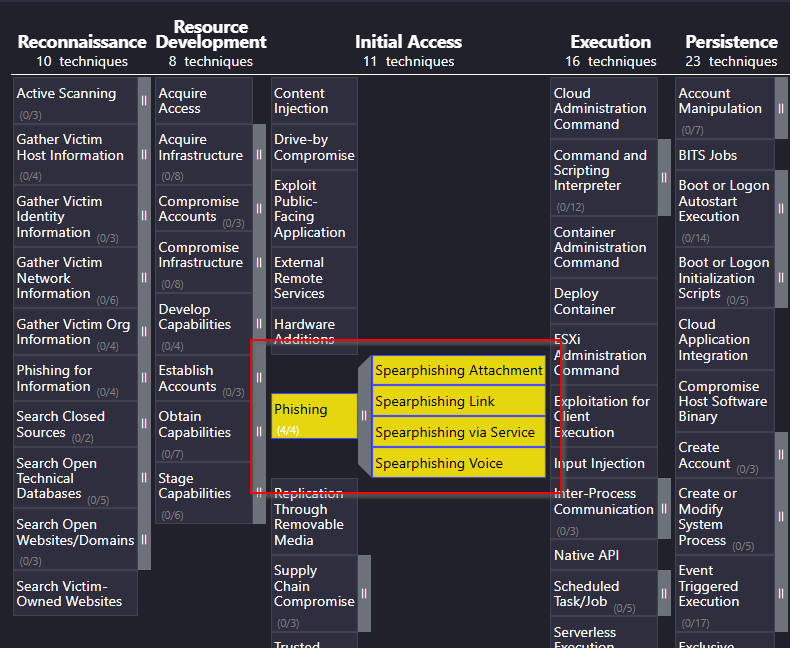
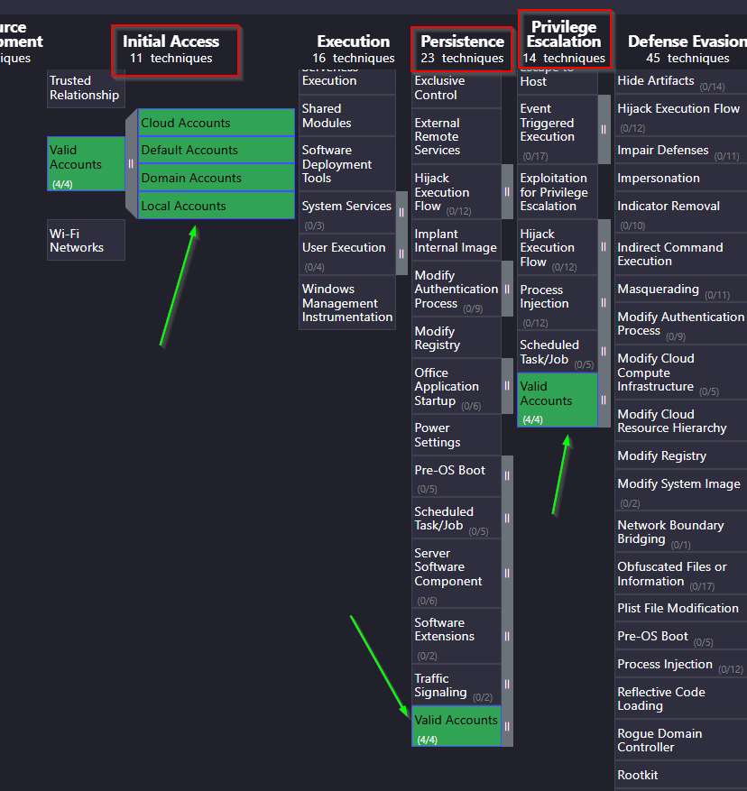
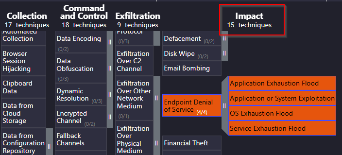
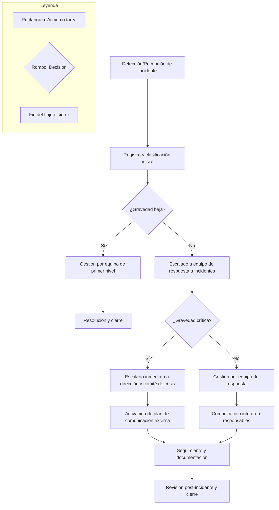

# Documentación del plan

 

## Índice

1. [Introducción](#introducción)
2. [Plan de respuesta a incidentes](#plan-de-respuesta-a-incidentes)
3. [Playbooks](#playbooks)
4. [Conclusiones](#conclusiones)
5. [Bibliografía](#bibliografía)

 

## Introducción

El presente documento forma parte del conjunto de medidas diseñadas para fortalecer la postura de ciberseguridad de **Grupo 1 S.L.**, empresa tecnológica con operaciones distribuidas y activos críticos en diversos departamentos. El objetivo es establecer una respuesta eficaz y coordinada ante incidentes de ciberseguridad, minimizando el impacto en la confidencialidad, integridad y disponibilidad de los activos más relevantes para el negocio.

Este trabajo se apoya en la identificación y valoración de activos, el análisis de riesgos, la definición de roles y responsabilidades, y la utilización de marcos de referencia reconocidos como **MITRE ATT&CK** y **RE&CT**. Además, se han desarrollado playbooks específicos para los escenarios de mayor impacto, alineados con la taxonomía de incidentes y amenazas detectadas en el sector.

 

## Plan de respuesta a incidentes

El **Plan de respuesta a incidentes** de Grupo 1 S.L. establece los principios, procedimientos y responsabilidades para gestionar de manera eficiente cualquier incidente de ciberseguridad que pueda afectar a la organización. El plan cubre todas las fases clave de la gestión de incidentes: preparación, identificación, contención, erradicación, recuperación y lecciones aprendidas.

Para consultar el detalle completo de roles, procedimientos, flujos de escalado, protocolos de comunicación y medidas específicas para cada fase, acceda al documento extenso:  
[Plan de respuesta a incidentes – Grupo 1 S.L.](./Plan%20de%20respuesta.md)

 

## Playbooks

Como complemento al plan general, se han desarrollado playbooks específicos para los incidentes más relevantes y probables en el contexto de **Grupo 1 S.L**.

A continuación, se presenta una breve descripción de cada playbook implementado:

- [**Amenaza interna (Insider Threat):**](./playbooks/playbook-amenaza-interna.md)

  Responde a situaciones en las que empleados, exempleados o colaboradores abusan de sus privilegios para causar daño, filtrar información o sabotear activos críticos. Incluye procedimientos de detección, contención y análisis forense interno.

- [**Compromiso de credenciales:**](./playbooks/playbook-compromiso-credenciales.md)

  Aborda incidentes relacionados con el robo, filtración o uso indebido de credenciales de acceso. Define acciones para revocar accesos, forzar cambios de contraseñas y analizar el alcance del compromiso.

- [**Ataque DDoS:**](./playbooks/playbook-ddos.md)
  
  Establece los pasos para identificar, mitigar y recuperar la disponibilidad de servicios ante ataques de denegación de servicio distribuida. Incluye coordinación con proveedores de servicios y activación de medidas de mitigación.

- [**Defacement de página Web:**](./playbooks/playbook-defacement.md)

  Describe la respuesta ante la alteración no autorizada de la apariencia o contenido de la web corporativa. Incluye restauración de copias seguras, análisis de vectores de ataque y comunicación con partes interesadas.

- [**Fuga de datos / Exfiltración de información:**](./playbooks/playbook-fuga-de-datos.md)

  Detalla las acciones ante la detección de salida no autorizada de información sensible. Incluye análisis de logs, contención, notificación a afectados y cumplimiento de obligaciones legales.

- [**Malware:**](./playbooks/playbook-malware.md)

  Proporciona los procedimientos para la detección, aislamiento, erradicación y recuperación de sistemas afectados por software malicioso, así como recomendaciones para evitar reinfecciones.

- [**Phishing:**](./playbooks/playbook-phishing.md)

  Guía la respuesta ante campañas de suplantación de identidad dirigidas a empleados o clientes. Incluye análisis de correos, bloqueo de enlaces maliciosos, formación y comunicación interna.

- [**Ransomware:**](./playbooks/playbook-ransomware.md)

  Establece los pasos para contener, analizar y recuperar sistemas cifrados por ransomware, priorizando la restauración desde backups y la comunicación con las autoridades competentes.

- [**Compromiso de la cadena de suministro:**](./playbooks/playbook-supply-chain.md)

  Define la respuesta ante incidentes originados en proveedores o socios externos que puedan impactar la seguridad de la organización. Incluye evaluación de dependencias, comunicación y medidas de mitigación conjunta.

## Respuestas a las preguntas

## 1.a   ¿Que relacción existe entre el trabajo que has hecho con las matrices MITRE ATT&CK y RE&CT y el plan de respuesta que estás planteando? ¿De que manera te ha ayudado el trabajo previo sobre las matrices a la hora de generar el plan? Deja evidencias del trabajo que has realizado sobre le navigator de las matrices, para obtener la información. 

La integración de las matrices MITRE ATT&CK y RE&CT ha sido fundamental para diseñar un plan de respuesta a incidentes adaptado a los riesgos y necesidades reales de Grupo 1 S.L. Estas matrices han proporcionado el marco de referencia necesario para identificar amenazas relevantes, estructurar los procedimientos de respuesta y justificar cada decisión tomada en el plan.

---

### **¿Cómo se ha utilizado MITRE ATT&CK y RE&CT en el plan de respuesta?**

- **Identificación y priorización de amenazas reales:**  
  El análisis de MITRE ATT&CK permitió mapear las tácticas y técnicas más probables contra los activos críticos de la empresa, considerando tanto el sector como la infraestructura y los procesos internos. Por ejemplo, se priorizaron incidentes como phishing (T1566), compromiso de credenciales (T1078), exfiltración de datos (T1041) o ataques DDoS (T1499), reflejando los riesgos más relevantes para Grupo 1 S.L..

- **Construcción de playbooks específicos y realistas:**  
  El trabajo previo con ATT&CK y RE&CT facilitó el diseño de playbooks detallados para cada tipo de incidente prioritario. Cada playbook está alineado con las técnicas y fases identificadas en las matrices, asegurando que la respuesta sea concreta y eficaz. Por ejemplo, el playbook de phishing aborda desde la detección y análisis del correo hasta la contención, erradicación, recuperación y comunicación, siguiendo el ciclo de vida del incidente según RE&CT y las técnicas ATT&CK asociadas.

- **Desarrollo de controles y medidas de mitigación justificadas:**  
  Las matrices han servido para seleccionar controles técnicos y organizativos adecuados (como MFA, segmentación de red, DLP, SIEM, EDR, backups), priorizando su implantación en función de las técnicas más relevantes y las carencias detectadas. Además, se han definido indicadores de compromiso y reglas de detección alineadas con ATT&CK, lo que refuerza la capacidad de detección y respuesta temprana.

- **Cobertura de todas las fases del ciclo de respuesta:**  
  RE&CT ha servido de guía para asegurar que cada playbook y procedimiento cubre de forma sistemática todas las fases: detección, contención, erradicación, recuperación, comunicación y lecciones aprendidas. Esto evita lagunas en la gestión de incidentes y garantiza una respuesta coordinada y completa.

- **Lenguaje común y trazabilidad:**  
  El uso de ATT&CK y RE&CT ha permitido estandarizar la terminología y facilitar la comunicación entre los equipos técnicos, la dirección y los responsables de negocio, además de aportar trazabilidad y justificación a cada acción del plan.

---

### **¿De qué manera ha ayudado el trabajo previo sobre las matrices a la hora de generar el plan?**

- **Alineación con riesgos reales:**  
  Gracias a las matrices, el plan de respuesta se centra en amenazas y escenarios probados, evitando suposiciones genéricas y priorizando los incidentes de mayor impacto y probabilidad para la organización.
- **Estandarización y eficiencia:**  
  La estructura y el lenguaje común de ATT&CK y RE&CT han permitido diseñar procedimientos claros, playbooks accionables y roles bien definidos, lo que facilita la formación, la colaboración y la mejora continua.
- **Evidencia y mejora continua:**  
  El trabajo con las matrices y el uso de herramientas como ATT&CK Navigator han permitido documentar las técnicas seleccionadas, visualizar la cobertura de amenazas y justificar la priorización de controles. Esta documentación es clave para auditorías, revisiones y la actualización constante del plan.

---

### **Evidencias del trabajo realizado sobre las matrices**

- **Mapeo de incidentes y técnicas:**  
  En el plan se incluyen referencias directas a tácticas y técnicas ATT&CK para cada tipo de incidente (por ejemplo, T1566 para phishing, T1078 para credenciales, T1041 para exfiltración, T1499 para DDoS), así como la estructura de los playbooks alineada con las fases de RE&CT.

- **Uso de ATT&CK Navigator:**  
  Se han utilizado herramientas como ATT&CK Navigator para identificar, visualizar y priorizar las técnicas más relevantes, generando mapas de cobertura y evidencias que se han incorporado al plan y a los anexos técnicos.

*T1566 para phishing*

*T1078 para credenciales. Por ejemplo: Un atacante consigue el usuario y contraseña de un empleado y accede al sistema de la empresa, evitando muchos sistemas de detección porque se conecta como si fuera legítimo. Primero gana acceso inicial para luego conseguir persistencia y escalada de privilegios.*

*T1499 para ataques DDoS.*

- **Procedimientos y controles derivados de las matrices:**  
  Los controles, indicadores de compromiso y medidas de mitigación especificadas en el plan están directamente vinculados a las recomendaciones y mitigaciones de ATT&CK y RE&CT, lo que aporta justificación y trazabilidad a cada decisión tomada.

---

 

## 1.b   ¿Qué playbooks has identificado como necesarios en este plan de respuesta y en que te has basado para identificar esos playbooks y saber que son los necesarios? Deja algún diagrama que describa el flujo de un playbook.

**Playbooks desarrollados para el plan de respuesta**

Tras el análisis de riesgos, la taxonomía de incidentes y el mapeo de amenazas con MITRE ATT&CK y RE&CT, se han identificado y desarrollado los siguientes playbooks como esenciales para la protección de Grupo 1 S.L.:

- **Ransomware**
- **Phishing**
- **Compromiso de credenciales**
- **Fuga de datos/exfiltración**
- **Malware**
- **Ataque DDoS**
- **Defacement de página web**
- **Amenaza interna (insider threat)**

**Criterios y justificación para la selección**

La selección de estos playbooks se basa en:

- **Incidentes más probables y de mayor impacto** para la organización, según el análisis de riesgos y la experiencia sectorial.
- **Cobertura de técnicas y tácticas relevantes** identificadas en las matrices MITRE ATT&CK y RE&CT, como T1486 (Ransomware), T1566 (Phishing), T1078 (Compromiso de credenciales/amenaza interna), T1041 (Exfiltración), T1499 (DDoS), T1491.001 (Defacement), entre otras.
- **Relevancia para los activos críticos** de la empresa, como la protección de datos personales, continuidad de negocio, imagen corporativa y cumplimiento normativo.
- **Necesidad de procedimientos diferenciados** para incidentes que requieren acciones, herramientas y comunicaciones específicas, tal como recomiendan las mejores prácticas internacionales.

Cada playbook aborda de manera detallada las fases de investigación, contención, erradicación, recuperación, prevención y comunicación, adaptando las acciones a las particularidades de cada tipo de incidente y asignando roles y responsabilidades claras.

**Resumen de los playbooks y su justificación**

| Playbook                      | Justificación principal                                                                                           | Técnicas MITRE ATT&CK asociadas         |
|-------------------------------|------------------------------------------------------------------------------------------------------------------|-----------------------------------------|
| Ransomware                    | Amenaza crítica para continuidad y datos, alta frecuencia sectorial                                              | T1486, T1059, T1078                     |
| Phishing                      | Vector de entrada más común, puerta a otros incidentes (malware, credenciales)                                   | T1566, T1204, T1078                     |
| Compromiso de credenciales    | Acceso a sistemas críticos, movimiento lateral, escalada de privilegios                                          | T1078, T1110, T1556                     |
| Fuga de datos                 | Impacto legal y reputacional, cumplimiento RGPD, protección de propiedad intelectual                             | T1041, T1020, T1005                     |
| Malware                       | Infecciones generalizadas, ransomware, spyware, troyanos                                                         | T1059, T1204, T1105                     |
| Ataque DDoS                   | Riesgo para disponibilidad, servicios online y continuidad                                                        | T1499, T1498                            |
| Defacement de página web      | Daño reputacional, impacto en la confianza de clientes y partners                                                | T1491.001                               |
| Amenaza interna               | Riesgo difícil de detectar, potencial para daño profundo y persistente                                           | T1078, T1565, T1086                     |

**Cómo se ha determinado que son los necesarios**

- Se ha partido de la taxonomía de incidentes y el análisis de activos críticos, cruzando esta información con las técnicas y tácticas más relevantes del sector identificadas en ATT&CK y RE&CT.
- Se han priorizado los incidentes que pueden causar mayor disrupción, daño reputacional, impacto legal o pérdida de datos sensibles.
- Se ha revisado la experiencia de incidentes recientes en el sector y las tendencias de amenazas reportadas por organismos de referencia.
- El trabajo previo con las matrices ha permitido identificar los TTPs más aplicables a la realidad de la empresa y seleccionar los escenarios que requieren una respuesta específica y detallada.

**Ejemplo de diagrama de flujo de un playbook: Playbook de Phishing**
flowchart TD
    %% Leyenda
    subgraph Legend [Leyenda]
        L1[Rectángulo: Acción o tarea]
        L2{{Rombo: Decisión}}
        L3[Fin del flujo]
    end

    %% Diagrama principal
    A[Recepción de alerta o reporte de correo sospechoso] --> B[Análisis de cabeceras, enlaces y adjuntos]
    B --> C{¿Phishing confirmado?}
    C -- Sí --> D[Identificación de usuarios afectados]
    D --> E[Bloqueo de remitente y enlaces en gateway de correo]
    E --> F[Deshabilitar cuentas / cambio de contraseñas si es necesario]
    F --> G[Eliminación de correos maliciosos en bandejas]
    G --> H[Escaneo de equipos afectados]
    H --> I[Comunicación a usuarios y departamentos]
    I --> J[Documentación y cierre]
    C -- No --> K[Comunicación de falso positivo y cierre]

**Características clave de los playbooks**

- Cada playbook detalla acciones para todas las fases: investigación, contención, erradicación, recuperación, prevención y comunicación.
- Se asignan responsables y se establecen protocolos de escalado y documentación.
- Se incluyen recomendaciones para usuarios y helpdesk, así como recursos y herramientas específicas para cada tipo de incidente.
- Los flujos permiten avanzar en paralelo en investigación, remediación y comunicación, optimizando la eficiencia de la respuesta.

---

## 1.c   ¿Como te has asegurado que has cubierto todas las fases del plan de respuesta? ¿Qué fase consideras que está más floja en un plan? ¿Cuál de ellas consideras que está mejor trabajada en tu plan? Asegúrate de hablar de todas las fases y como las cubres. 

Para asegurar que el plan de respuesta a incidentes de Grupo 1 S.L. cubre todas las fases necesarias, se ha seguido un enfoque estructurado basado en los principales marcos internacionales (NIST, MITRE RE&CT, guías sectoriales). El diseño y desarrollo de cada playbook parte de este ciclo de vida, asegurando la trazabilidad y la cobertura de cada etapa en todos los escenarios críticos.

### **Fases cubiertas y cómo se abordan**

**1. Preparación**

- **¿Cómo se cubre?**  
  Se han definido políticas, procedimientos y roles claros para la gestión de incidentes, así como la formación y concienciación periódica de empleados. Se mantiene actualizado el inventario de activos críticos y se realizan simulacros y ejercicios de respuesta.  
  - Ejemplo: Todos los playbooks inician con instrucciones para la recopilación de información y la preservación de evidencias, lo que requiere que el personal esté formado y los recursos estén preparados.

**2. Detección e identificación**

- **¿Cómo se cubre?**  
  Se emplean sistemas de monitorización (SIEM, EDR, DLP, IDS/IPS) y procedimientos definidos para la identificación rápida de incidentes, con criterios claros para la clasificación y priorización.  
  - Ejemplo: En el playbook de phishing, el primer paso siempre es la recogida y análisis de la evidencia, mientras que en ransomware o malware se prioriza el aislamiento y la confirmación de la infección.

**3. Contención**

- **¿Cómo se cubre?**  
  Los playbooks detallan acciones inmediatas para limitar el alcance del incidente, como el aislamiento de sistemas, bloqueo de cuentas, filtrado de tráfico o retirada de servicios afectados. Se prioriza la contención rápida para evitar la propagación y el daño adicional.

**4. Erradicación**

- **¿Cómo se cubre?**  
  Se incluyen pasos para eliminar la causa raíz del incidente: limpieza de malware, cierre de vulnerabilidades, eliminación de cuentas o accesos no autorizados, y revisión de configuraciones comprometidas.  
  - Ejemplo: En el playbook de malware, se especifica la eliminación de persistencias y la aplicación de parches; en fuga de datos, la revocación de permisos y el borrado de herramientas de exfiltración.

**5. Recuperación**

- **¿Cómo se cubre?**  
  Se definen procedimientos para restaurar servicios y sistemas a su estado seguro y funcional, validando la integridad y monitorizando posibles reinfecciones o recaídas. Incluye restauración desde backups, pruebas de funcionamiento y comunicación a los usuarios afectados.

**6. Comunicación**

- **¿Cómo se cubre?**  
  Todos los playbooks incluyen protocolos de comunicación interna y externa: escalado a dirección, notificación a usuarios, clientes, partners, aseguradoras y, si es necesario, autoridades. Se documenta cada acción y se preparan mensajes claros y coordinados para evitar alarmismo y cumplir requisitos legales.

**7. Lecciones aprendidas y mejora continua**

- **¿Cómo se cubre?**  
  Tras cada incidente, se realiza un análisis post-mortem, se documentan las acciones y se identifican áreas de mejora. Se actualizan los procedimientos y se refuerza la formación, aplicando lo aprendido para fortalecer la resiliencia futura.  
  - Ejemplo: Todos los playbooks concluyen con la documentación del incidente, la actualización de controles y la preparación de informes para auditoría y mejora interna.

---

### **Fase más floja y fase mejor trabajada**

**Fase más floja:**  
La fase de *lecciones aprendidas y mejora continua* suele ser la más débil, ya que requiere disciplina para realizar revisiones exhaustivas y destinar recursos tras la resolución del incidente. Aunque está contemplada en todos los playbooks, su ejecución puede verse limitada por la presión operativa y la falta de tiempo, lo que puede retrasar la actualización de procedimientos y la retroalimentación efectiva.

**Fase mejor trabajada:**  
Las fases de *detección/identificación* y *contención* son las más robustas en el plan, gracias a la integración de sistemas de monitorización avanzados, la definición clara de criterios de actuación y la asignación de roles y responsabilidades. Esto permite una reacción rápida y coordinada ante incidentes, minimizando el impacto y evitando la propagación.

---

### **Resumen de la cobertura**

| Fase                       | ¿Cómo se cubre en el plan?                                                                                   | Nivel de madurez |
|----------------------------|-------------------------------------------------------------------------------------------------------------|------------------|
| Preparación                | Políticas, roles, inventario, formación, simulacros                                                         | Alto             |
| Detección e identificación | Monitorización, alertas, análisis forense, clasificación de incidentes                                      | Muy alto         |
| Contención                 | Aislamiento, bloqueo de cuentas, filtrado de tráfico, desconexión de sistemas                               | Muy alto         |
| Erradicación               | Limpieza de malware, cierre de vulnerabilidades, eliminación de cuentas y accesos no autorizados             | Alto             |
| Recuperación               | Restauración desde backups, validación de integridad, monitorización post-incidente                         | Alto             |
| Comunicación               | Protocolos internos y externos, escalado, documentación, notificación a usuarios y autoridades              | Alto             |
| Lecciones aprendidas       | Análisis post-mortem, actualización de procedimientos, formación y mejora continua                          | Medio            |

---

## 2.a   ¿En que consiste el Flujo de Toma de Decisiones y Escalado de tu plan de respuesta? ¿Existe un plan de comunicación, protocolos, etc? Si la respuesta es correcta, haz un resumen del plan y protocolos. Deja evidencias del flujo, mediante un diagrama. 

El flujo de toma de decisiones y escalado en el plan de respuesta a incidentes de Grupo 1 S.L. está diseñado para garantizar que cada incidente sea gestionado de forma eficiente, coordinada y proporcional a su gravedad. Este flujo establece cómo se detectan, clasifican y escalan los incidentes, así como los protocolos de comunicación internos y externos en cada etapa.

---

### **¿En qué consiste el flujo de toma de decisiones y escalado?**

- **Recepción y registro:**  
  Todo incidente o alerta es recibido por el equipo de primera línea (helpdesk, SOC, responsable de área) y registrado en la herramienta de gestión de incidencias.

- **Clasificación y evaluación inicial:**  
  El incidente se evalúa según criterios predefinidos (impacto, urgencia, alcance) y se clasifica en niveles de gravedad (bajo, medio, alto, crítico)[9][11]. Esta clasificación determina los canales de comunicación y los responsables implicados.

- **Toma de decisiones inicial y escalado:**  
  Si el incidente puede ser resuelto por el primer nivel, se aplican los procedimientos del playbook correspondiente. Si supera la capacidad, el incidente se escala automáticamente al siguiente nivel (equipo de respuesta a incidentes, responsables técnicos o dirección, según gravedad)[3][7][9].  
  - Para incidentes críticos, la escalada es inmediata a la dirección y al comité de crisis, activando protocolos especiales.

- **Ejecución de acciones y seguimiento:**  
  El equipo responsable ejecuta las acciones de contención, erradicación y recuperación, documentando cada paso y manteniendo informados a los responsables mediante reportes periódicos.

- **Comunicación y coordinación:**  
  Se activan los protocolos de comunicación interna (informes a dirección, departamentos afectados, comité de crisis) y externa (notificación a clientes, partners, autoridades, según el tipo de incidente y requisitos legales)[2][9][10].  
  - Se designa un portavoz para la comunicación pública y con medios si es necesario.

- **Cierre y revisión:**  
  Una vez resuelto el incidente, se documenta todo el proceso, se realiza una reunión de lecciones aprendidas y se actualizan los procedimientos y controles.

---

### **Plan de comunicación y protocolos**

El plan de respuesta incluye un **plan de comunicación estructurado** que define:

- **Canales de notificación:** correo electrónico, teléfono, mensajería interna y plataforma de gestión de incidencias[2][9].
- **Protocolos de escalado:** definidos por niveles de gravedad y tipo de incidente, con responsables asignados en cada etapa[3][7].
- **Mensajes predefinidos:** para comunicación interna y externa, adaptados a la audiencia y la naturaleza del incidente.
- **Registro y documentación:** cada acción y comunicación queda registrada para auditoría y mejora continua[1][8].

---

### **Resumen del plan y protocolos**

- **Estructura jerárquica clara:** cadena de mando y roles definidos en cada fase[1].
- **Clasificación y priorización:** criterios objetivos para decidir cuándo y cómo escalar un incidente[9][11].
- **Escalado automático o manual:** según la gravedad, con umbrales y responsables claros[3][7].
- **Comunicación coordinada:** canales y mensajes adaptados a cada público, evitando duplicidades y confusiones[2][10].
- **Documentación exhaustiva:** todo el flujo queda registrado para análisis posterior y cumplimiento normativo[8][9].

---

### **Evidencia visual: Diagrama de flujo del proceso de toma de decisiones y escalado**

---

## 3.a ¿Como te has asegurado de que tu plan tiene respuestas resilientes? ¿Porque son resilientes y en qué fases se centran?

El plan de respuesta a incidentes de Grupo 1 S.L. incorpora la resiliencia como principio fundamental en todas sus fases y procedimientos. La resiliencia, en este contexto, se entiende como la capacidad de la organización para anticipar, resistir, responder y recuperarse eficazmente ante incidentes de ciberseguridad, minimizando el impacto y asegurando la continuidad del negocio.

### **Cómo se garantiza la resiliencia en el plan**

**1. Diseño basado en análisis de riesgos y amenazas reales**
- El plan parte de un análisis continuo de riesgos y amenazas específicas para los activos críticos de la empresa, utilizando marcos como MITRE ATT&CK y RE&CT, lo que permite anticipar escenarios plausibles y preparar respuestas adaptadas a la realidad del negocio.
- La taxonomía de incidentes y los playbooks desarrollados cubren los incidentes más probables y de mayor impacto, asegurando que la organización está preparada para los eventos más disruptivos.

**2. Procedimientos estructurados y paralelización de acciones**
- Los playbooks de respuesta están diseñados para que las tareas de investigación, remediación y comunicación se realicen en paralelo, no de forma secuencial, lo que permite contener y mitigar incidentes más rápidamente y evitar cuellos de botella.
- La asignación de roles y responsabilidades claras, junto con la posibilidad de crear sub-equipos específicos según la naturaleza y alcance del incidente, refuerza la capacidad de adaptación y respuesta coordinada.

**3. Preparación, formación y mejora continua**
- El plan incluye formación continua, simulacros y campañas de concienciación para todo el personal, lo que reduce el riesgo del factor humano y mejora la capacidad de reacción ante amenazas como phishing, malware o fuga de datos.
- Se contempla la revisión y actualización periódica de políticas, procedimientos y controles técnicos, integrando las lecciones aprendidas de incidentes previos y ejercicios de simulación.

**4. Redundancia, backups y continuidad de negocio**
- Se asegura la existencia de backups periódicos, pruebas regulares de restauración y la integración con el Plan de Continuidad de Negocio (BCP/DRP), lo que permite restaurar servicios y datos críticos en caso de incidentes graves como ransomware, DDoS o sabotaje físico.
- La segmentación de red, controles de acceso y medidas de hardening incrementan la resistencia ante ataques y dificultan la propagación de amenazas.

**5. Comunicación y escalado eficiente**
- El plan define protocolos de comunicación interna y externa, escalado de incidentes y notificación a autoridades, asegurando que la información fluye correctamente y que las decisiones se toman con rapidez y fundamento.
- La existencia de canales seguros y procedimientos de escalado minimiza el riesgo de descoordinación y permite activar recursos adicionales cuando la situación lo requiere.

### **¿Por qué son resilientes estas respuestas?**

- **Adaptabilidad:** El plan se revisa y ajusta de manera continua, integrando nuevas amenazas, tecnologías y lecciones aprendidas, lo que permite a la organización adaptarse a un entorno cambiante y a ataques cada vez más sofisticados.
- **Reducción del tiempo de respuesta y recuperación:** La ejecución en paralelo de tareas críticas y la existencia de procedimientos claros permiten contener, erradicar y recuperar más rápido, minimizando el tiempo de inactividad y el impacto sobre el negocio.
- **Cobertura integral:** Se abordan todas las fases del incidente, desde la prevención y detección temprana hasta la recuperación y mejora continua, evitando puntos ciegos y asegurando una protección completa.
- **Capacidad de aprendizaje:** La fase de lecciones aprendidas y la revisión post-incidente (AAR) garantizan que cada incidente contribuye a fortalecer la postura de seguridad y a evitar errores repetidos.

### **Fases en las que se centra la resiliencia**

| Fase                  | Acciones resilientes destacadas                                                                                   |
|-----------------------|------------------------------------------------------------------------------------------------------------------|
| **Preparación**       | Formación, simulacros, actualización de políticas, inventario de activos, definición de roles y backups periódicos |
| **Detección**         | Monitorización continua, SIEM, alertas tempranas, inteligencia de amenazas, auditorías regulares                  |
| **Contención**        | Aislamiento rápido, segmentación, bloqueo de accesos, paralelización de equipos y tareas                          |
| **Erradicación**      | Eliminación completa de amenazas, restauración desde imágenes limpias, hardening, actualización de sistemas       |
| **Recuperación**      | Restauración desde backups, validación de integridad, pruebas de funcionamiento, comunicación clara               |
| **Comunicación**      | Protocolos internos y externos, escalado eficiente, documentación exhaustiva, canales seguros                     |
| **Lecciones aprendidas** | Revisión post-incidente, actualización de controles, integración de mejoras y retroalimentación continua         |

 

## Conclusiones

La elaboración de este plan de respuesta a incidentes nos ha permitido conocer en profundidad la situación actual de la seguridad en **Grupo 1 S.L**. y darnos cuenta de la importancia de tener procedimientos claros y bien definidos para actuar ante cualquier incidente. A lo largo del trabajo hemos identificado los activos más críticos, analizado los riesgos y amenazas más probables y hemos aprendido a priorizar los escenarios que pueden tener mayor impacto en la empresa.

El uso de marcos reconocidos como ``MITRE ATT&CK`` y ``RE&CT`` nos ha ayudado a estructurar mejor tanto la identificación de amenazas como la respuesta, y los playbooks desarrollados nos servirán como guías prácticas para actuar de forma rápida y coordinada en caso de que se produzca un incidente real.

Creemos que este plan es un buen punto de partida, aunque somos conscientes de que la seguridad es un proceso continuo que requiere revisión y mejora constante. Por eso, consideramos fundamental seguir formando al personal, realizar simulacros y actualizar los procedimientos según vayan cambiando las amenazas y las tecnologías.

En definitiva, con este trabajo hemos sentado las bases para que **Grupo 1 S.L**. pueda responder de manera más eficaz y resiliente ante los incidentes de ciberseguridad, minimizando el impacto y asegurando la continuidad del negocio.

 

## Bibliografía

- NIST Computer Security Incident Handling Guide (SP 800-61r2). National Institute of Standards and Technology.  
  https://csrc.nist.gov/publications/detail/sp/800-61/rev-2/final

- MITRE ATT&CK® Framework.  
  https://attack.mitre.org/

- RE&CT Navigator.  
  https://www.reactproject.org/

- INCIBE (Instituto Nacional de Ciberseguridad).  
  https://www.incibe.es/

- ISO/IEC 27035:2016 - Gestión de incidentes de seguridad de la información.

- Incident Handler's Handbook. SANS Institute.  
  https://www.sans.org/white-papers/17401/
