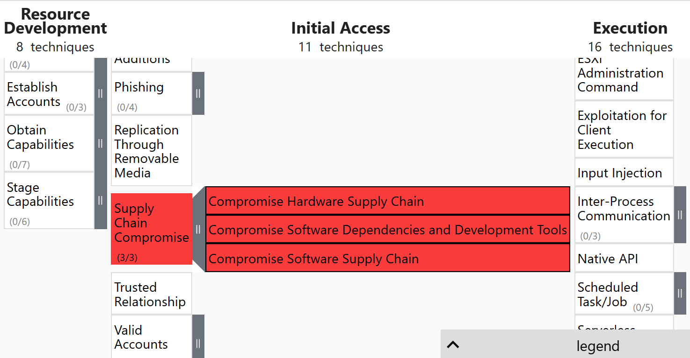
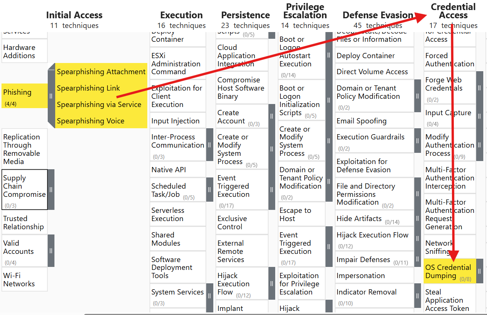
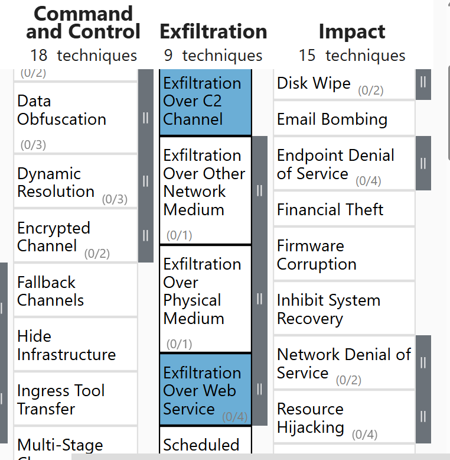
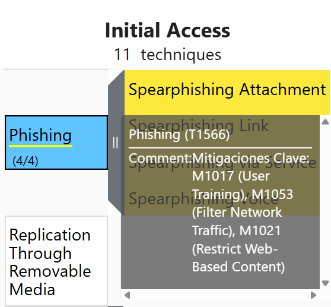
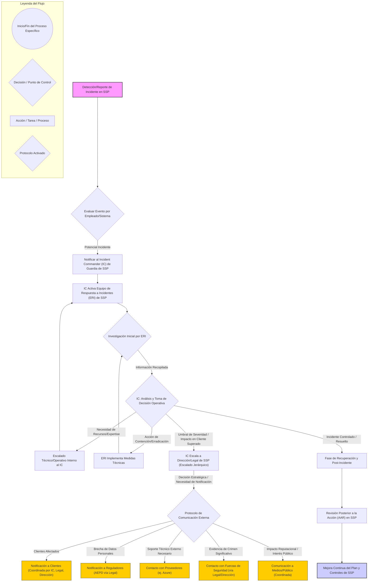

## Índice
1.  [Introducción](#introduccion)
2.  [Plan de Respuesta](#plan-de-respuesta)
    *   [Contexto de este plan](#contexto-de-este-plan)
        *   [Identificación de activos](#identificacion-de-activos)
        *   [Nivel de madurez y proyectos](#nivel-de-madurez-y-proyectos)
        *   [Posibles amenazas](#posibles-amenazas)
        *   [Cálculo del riesgo](#calculo-del-riesgo)
        *   [Taxonomía de incidentes](#taxonomia-de-incidentes)
    *   [Evaluar](#evaluar)
    *   [Iniciar la respuesta](#iniciar-la-respuesta)
    *   [Investigar](#investigar)
    *   [Remediar](#remediar)
    *   [Comunicar](#comunicar)
    *   [Recuperación](#recuperacion)
    *   [Roles](#roles)
    *   [Realizar una revisión posterior a la acción (AAR)](#realizar-una-revision-posterior-a-la-accion-aar)
3.  [Playbooks](#playbooks)
    *   [Playbook: Ataques de Fuerza Bruta](#playbook-ataques-de-fuerza-bruta)
    *   [Playbook: Compromiso en la cadena de proveedores](#playbook-compromiso-en-la-cadena-de-proveedores)
    *   [Playbook: Denegación de Servicio](#playbook-denegacion-de-servicio)
    *   [Playbook: Escaneo activo](#playbook-escaneo-activo)
    *   [Playbook: Exfiltración de Datos](#playbook-exfiltracion-de-datos)
    *   [Playbook: Phishing](#playbook-phishing)
    *   [Playbook: Ransomware](#playbook-ransomware)
4.  [Respuestas a las preguntas](#respuestas-a-las-preguntas)
5.  [Conclusiones](#conclusiones)
6.  [Bibliografía](#bibliografia)

## Introducción
Secure Shield Pentesting S.L. se dedica a realizar auditorías de seguridad y pruebas de penetración para terceros. La empresa es consciente de los riesgos inherentes al panorama actual de ciberamenazas. Con un equipo de 150 a 200 personas, el uso de servicios en la nube de Microsoft Azure, una infraestructura híbrida con servidores propios (Windows y Linux) en una sala técnica dedicada, y una plataforma web con área de cliente para el intercambio de informes y datos sensibles, la seguridad de la información es una responsabilidad primordial.

Este Plan de Respuesta a Incidentes (PRI) establece una pauta de actuación estructurada frente a posibles incidentes de seguridad. Su objetivo es facilitar una gestión eficiente de estos eventos, reducir su impacto y permitir retomar la operatividad con la menor interrupción posible.

El contenido del plan se basa en la plantilla de Counteractive Security, adaptada a las características de Secure Shield Pentesting S.L. Se han considerado los activos críticos, los riesgos identificados y el entorno técnico descrito en el análisis de riesgos y el plan director de seguridad. El PRI aborda las fases de gestión de incidentes: preparación, detección, contención, eliminación, recuperación y revisión posterior.

El documento también incorpora playbooks enfocados en incidentes comunes en el ámbito del pentesting y la consultoría de seguridad, así como una asignación clara de responsabilidades. Para la efectividad del plan, es importante que el personal involucrado lo conozca y sepa cómo aplicarlo.

## Plan de Respuesta
El siguiente enlace permite acceder al Plan de Respuesta a Incidentes elaborado para Secure Shield Pentesting S.L. Este documento detalla los procedimientos y recursos para gestionar distintos tipos de incidentes de seguridad que puedan comprometer los sistemas, los servicios cloud o los datos críticos intercambiados con los clientes. Su objetivo es facilitar una actuación rápida, coordinada y documentada por parte del personal implicado.

[Plan de Respuesta a incidentes para Secure Shield Pentesting S.L.](Plan-de-Respuesta.md)

## Playbooks
Los playbooks en los siguientes enlaces definen los pasos para las fases de investigación, remediación y comunicación ante incidentes que podrían afectar a Secure Shield Pentesting S.L. Están diseñados para ofrecer instrucciones claras y prácticas para una gestión eficaz en situaciones concretas, considerando el entorno técnico de la empresa, los servicios ofrecidos y la sensibilidad de los datos manejados.

[Playbook 1: Ataques de Fuerza Bruta](./Playbooks/playbook-fuerza-bruta.md)

[Playbook 2: Compromiso en la cadena de proveedores](./Playbooks/playbook-compromiso-cadena-proveedores.md)

[Playbook 3: Denegación de Servicio](./Playbooks/playbook-denegacion-servicio.md)

[Playbook 4: Escaneo activo](./Playbooks/playbook-escaneo-activo.md)

[Playbook 5: Exfiltración de Datos](./Playbooks/playbook-exfiltracion-datos.md)

[Playbook 6: Phishing](./Playbooks/playbook-phishing.md)

[Playbook 7: Ransomware](./Playbooks/playbook-ransomware.md)

## Respuestas a las preguntas
A continuación, se presentan las respuestas a preguntas sobre el Plan de Respuesta a Incidentes (PRI) diseñado para **Secure Shield Pentesting S.L. (SSP)**.

**1.a ¿Qué relación existe entre el trabajo realizado con las matrices MITRE ATT&CK y RE&CT y el plan de respuesta que se está planteando? ¿De qué manera ha ayudado el trabajo previo sobre las matrices a la hora de generar el plan? Deje evidencias del trabajo realizado sobre el navegador de las matrices para obtener la información.**

Las matrices MITRE ATT&CK (Adversarial Tactics, Techniques, and Common Knowledge) y RE&CT (Respond & Remediate Common Threats) son esenciales para el plan de respuesta a incidentes (PRI) de **Secure Shield Pentesting S.L. (SSP)**. Estas matrices ofrecen un lenguaje común y una base de conocimiento estructurada sobre las tácticas, técnicas y procedimientos (TTPs) de los adversarios, junto con posibles acciones de respuesta y remediación. Dada la actividad de SSP (auditorías de seguridad y pentesting), comprender y anticipar las TTPs es vital, no solo para proteger a sus clientes, sino también su propia infraestructura y los datos sensibles que maneja.

**Cómo ayudaron las matrices a generar el plan:**

1.  **Identificación de Amenazas Relevantes:** ATT&CK ayudó a comprender las amenazas específicas para **SSP**. Se consideró su sector (servicios de ciberseguridad), activos (datos críticos de clientes como informes de vulnerabilidades, plataforma de intercambio de informes, infraestructura Azure y on-premise) y su perfil como objetivo (poseedora de información sensible de sus clientes). Mapear las TTPs más probables contra SSP (ej. compromiso de credenciales de pentesters, ataques a su infraestructura cloud o a la plataforma de informes) permitió priorizar los escenarios de incidentes.
2.  **Diseño de Playbooks Específicos:** El conocimiento de las TTPs de ATT&CK permitió diseñar playbooks que abordan cadenas de ataque relevantes para SSP. Por ejemplo, un playbook para "Compromiso del Área de Cliente" utiliza el entendimiento de técnicas de "Initial Access" como "Exploit Public-Facing Application" (T1190) o "Valid Accounts" (T1078), y técnicas de "Exfiltration" como "Exfiltration Over C2 Channel" (T1041) o "Transfer Data to Cloud Account" (T1537).
3.  **Estrategias de Detección:** ATT&CK detalla "Data Sources" y "Detection" para cada técnica. Esto informa la fase de "Investigar" del PRI y ayuda a definir qué logs (Azure Activity Logs, logs de servidores web, logs de autenticación) y alertas son cruciales para **SSP**.
4.  **Medidas de Mitigación y Remediación:** La matriz RE&CT (o conceptos derivados de ATT&CK como "Mitigations") guía las fases de "Remediar" (Contener, Erradicar) y "Recuperación". Para una técnica de exfiltración de datos de clientes, ATT&CK puede listar mitigaciones como cifrado de datos y controles de acceso robustos, reflejados en el playbook correspondiente.
5.  **Mejora de la Postura de Seguridad Propia:** El análisis de TTPs informa sobre debilidades potenciales en la seguridad de **SSP**, permitiendo implementar controles preventivos (mencionados en el Plan Director de Seguridad y Análisis de Riesgos específico para SSP). Esto es vital, ya que un compromiso de SSP tendría consecuencias graves para su reputación y la de sus clientes.
6.  **Lenguaje Común:** Las matrices facilitan la comunicación entre el equipo técnico de SSP y la dirección al describir incidentes y respuestas de forma estandarizada.

En resumen, MITRE ATT&CK y RE&CT permiten que el plan de respuesta de **SSP** sea proactivo, específico y efectivo, reflejando los riesgos asociados a una empresa de pentesting que maneja datos críticos.

**Evidencias del trabajo sobre el navegador de las matrices:**

Durante el análisis de riesgos y la definición de escenarios de ataque para **SSP**, se consultó el MITRE ATT&CK Navigator para visualizar y seleccionar técnicas relevantes. Por ejemplo, para entender un ataque dirigido a la exfiltración de informes de clientes.

*Exploración de T1195: Compromiso de la Cadena de Suministro (ej. software de pentesting o servicios cloud comprometidos) y sus sub-técnicas, relevante para SSP.*

*Visualización de una cadena de ataque: Phishing (T1566) a empleados de SSP para obtener Acceso a Credenciales (TA0006) para sistemas internos o datos de clientes.*

*Exploración de tácticas de Exfiltración (TA0010) para proteger informes de vulnerabilidades y datos de clientes en SSP.*

*Investigación de mitigaciones (M1017 - User Training, M1053 - Filter Network Traffic, M1021 - Restrict Web-Based Content) para Phishing, aplicable a SSP.*

----------------------

**1.b ¿Qué playbooks se han identificado como necesarios en este plan de respuesta y en qué se basa esa identificación? Incluya un diagrama que describa el flujo de un playbook.**

Considerando el análisis de riesgos, los activos críticos de **Secure Shield Pentesting S.L. (SSP)** (datos de vulnerabilidades de clientes, plataforma de intercambio de informes, infraestructura de pentesting en Azure y on-premise) y las amenazas prevalentes, se han identificado **7 playbooks** prioritarios:

1.  **Playbook 1: Ataques de Fuerza Bruta:**
    *   *Relevancia para SSP:* Protege el acceso al portal de cliente, cuentas de administrador de Azure, servidores internos y credenciales de pentesters, objetivos de alto valor.
2.  **Playbook 2: Compromiso en la cadena de proveedores:**
    *   *Relevancia para SSP:* SSP usa software especializado, servicios cloud (Azure) y otras herramientas de terceros. Un compromiso en estos proveedores podría impactar la seguridad de SSP o de sus clientes.
3.  **Playbook 3: Denegación de Servicio en Internet (DDoS) y Denegación de Servicio de Dispositivos Finales:**
    *   *Relevancia para SSP:* Asegura la disponibilidad de su web y del área de cliente. La indisponibilidad afecta la operación y fiabilidad. También protege endpoints de pentesters.
4.  **Playbook 4: Escaneo activo:**
    *   *Relevancia para SSP:* Detectar escaneos activos *no autorizados* contra su infraestructura es un indicador temprano de un posible ataque dirigido.
5.  **Playbook 5: Exfiltración de Datos:**
    *   *Relevancia para SSP:* Máxima prioridad. La exfiltración de informes de vulnerabilidades, propiedad intelectual de SSP o credenciales de clientes tendría consecuencias graves.
6.  **Playbook 6: Phishing:**
    *   *Relevancia para SSP:* Empleados de SSP, especialmente con accesos privilegiados, son objetivos de phishing para robar credenciales o introducir malware.
7.  **Playbook 7: Ransomware:**
    *   *Relevancia para SSP:* Amenaza transversal que podría afectar servidores on-premise, infraestructura Azure y endpoints de pentesters. El cifrado de datos de clientes o informes tendría un impacto severo.

**Base para la identificación:**

*   **Análisis de Riesgos de SSP:** Se identificaron activos críticos y amenazas directamente relacionadas con los playbooks seleccionados.
*   **Matrices MITRE ATT&CK:** El análisis de TTPs relevantes para empresas de ciberseguridad que manejan datos sensibles confirmó la necesidad de estos playbooks (ej. T1110 Brute Force, T1195 Supply Chain Compromise, T1498 Network Denial of Service, T1595 Active Scanning, TA0010 Exfiltration, T1566 Phishing, T1486 Data Encrypted for Impact).
*   **Sector y Naturaleza de los Datos:** Como empresa de pentesting, SSP es un objetivo de alto valor. La confidencialidad, integridad y disponibilidad de los datos de vulnerabilidades de sus clientes son primordiales.
*   **Infraestructura Tecnológica:** La combinación de servicios en Azure, servidores on-premise y una plataforma web de cliente hace esenciales los playbooks de DDoS, Fuerza Bruta, Escaneo Activo, Phishing y Ransomware. La dependencia de herramientas externas justifica el playbook de Cadena de Proveedores, y la criticidad de los datos, el de Exfiltración.

**Diagrama de Flujo de un Playbook (Ejemplo General: Phishing, aplicable a SSP):**

*Este diagrama representa un flujo general para un incidente de Phishing. Las acciones específicas están detalladas en el Playbook de Phishing para SSP.*

---
**1.c ¿Cómo se ha asegurado que se cubren todas las fases del plan de respuesta? ¿Qué fase considera que está más floja en un plan? ¿Cuál considera que está mejor trabajada en su plan? Asegúrese de hablar de todas las fases y cómo las cubre.**

Se han cubierto todas las fases del ciclo de respuesta a incidentes (modelo NIST SP 800-61r2) para **Secure Shield Pentesting S.L. (SSP)**:

1.  **Preparación:** Es la creación de este Plan de Respuesta a Incidentes. Incluye:
    *   Desarrollo del PRI y Playbooks para SSP.
    *   Identificación de activos y análisis de riesgos ("Contexto de este plan").
    *   Definición de roles y responsabilidades ("Roles").
    *   Establecimiento de canales de comunicación y herramientas ("Iniciar la respuesta").
    *   Capacitación del personal.
    *   Acuerdos con proveedores clave (ej. Microsoft para Azure).

2.  **Identificación (Detección y Análisis):** Cubierta en "Evaluar". Cada playbook inicia con "Investigar":
    *   Recopilación de pistas (alertas Azure Security Center, logs SIEM).
    *   Análisis de logs, tráfico, IOCs, artefactos forenses.
    *   Determinación de alcance, vector e impacto, especialmente en datos de clientes.

3.  **Contención:** Sub-fase de "Remediar" en cada playbook. Enfocada en:
    *   Aislar sistemas afectados (VMs Azure, servidores on-prem, cuentas).
    *   Bloquear actividad maliciosa (IPs, dominios, procesos).
    *   Prevenir propagación y exfiltración adicional de datos.
    *   Estrategias para cloud y on-premise.

4.  **Eradicación:** Sub-fase de "Remediar". Se centra en:
    *   Eliminar causa raíz (malware, vulnerabilidades, cuentas comprometidas).
    *   Asegurar que el adversario no tiene acceso.
    *   Limpieza de sistemas y restauración de configuraciones seguras.

5.  **Recuperación:** Cubierta en "Recuperación" y como fase final en playbooks. Incluye:
    *   Restaurar sistemas y datos a un estado operativo seguro (VMs Azure, bases de datos de informes desde backups).
    *   Validar que los sistemas estén limpios y funcionales.
    *   Monitorización post-incidente para asegurar eliminación de la amenaza.

6.  **Actividad Post-Incidente (Lecciones Aprendidas):** Cubierta en "Realizar una revisión posterior a la acción (AAR)". Implica:
    *   Analizar qué ocurrió, por qué, y cómo respondieron sistemas y equipo de SSP.
    *   Evaluar efectividad de respuesta, playbooks y herramientas.
    *   Identificar mejoras para plan, playbooks, controles (Azure, on-prem, aplicaciones) y capacitación.
    *   Actualizar documentación y compartir aprendizajes.

**Fase más floja en un plan (potencial para SSP):**

La **Preparación continua** y una **Actividad Post-Incidente efectiva** pueden ser desafiantes.
*   **Preparación continua:** Para SSP, incluye:
    *   Actualizaciones regulares del PRI/Playbooks (TTPs y infraestructura de SSP evolucionan).
    *   Pruebas y simulacros realistas (ej. compromiso de pentester, brecha en plataforma de informes).
    *   Capacitación continua (respuesta a incidentes, seguridad de plataformas Azure, herramientas de pentesting).
    *   Gestión de configuración y vulnerabilidades de su propia infraestructura.
*   **Actividad Post-Incidente:** La tendencia es cerrar el incidente y continuar. Para SSP, donde la confianza es clave, un análisis profundo y la implementación de mejoras son vitales. La falta de seguimiento riguroso debilita la resiliencia.

**Fase mejor trabajada en este plan para SSP:**

Las fases de **Identificación (Investigar)** y **Contención/Eradicación (Remediar)** están conceptualmente bien trabajadas, aprovechando la alta capacidad técnica del personal de SSP.
*   **Investigar:** Los playbooks detallan pasos para análisis técnico profundo. Se espera que el equipo de SSP sea hábil en análisis forense, de malware y logs.
*   **Remediar:** Los playbooks proporcionan acciones claras. La experiencia técnica de SSP debería permitir erradicación efectiva y contención rápida, minimizando el daño.

La estructura detallada de los playbooks, corazón operativo de la respuesta, fortalece estas fases con guías específicas para incidentes críticos en SSP.

**2.a ¿En qué consiste el Flujo de Toma de Decisiones y Escalado del plan de respuesta? ¿Existe un plan de comunicación, protocolos? Si la respuesta es correcta, haga un resumen del plan y protocolos. Incluya un diagrama del flujo.**

Sí, el plan de respuesta de **Secure Shield Pentesting S.L. (SSP)** define un flujo de toma de decisiones y escalado, junto con protocolos de comunicación.

**Flujo de Toma de Decisiones y Escalado:**

El flujo se basa en una estructura de mando de incidentes, con el **Incident Commander (IC)** como figura central (líder técnico senior o gerente de seguridad en SSP).

1.  **Detección e Inicio:** Cualquier empleado de SSP puede detectar y debe reportar un posible incidente. La sección "Evaluar" guía la determinación inicial. Ante un incidente o duda (especialmente si afecta datos de clientes), se inicia la respuesta.
2.  **Activación del IC:** Se contacta al IC de guardia. El IC asume el mando.
3.  **Convocatoria del Equipo de Respuesta (ERI):** El IC convoca al equipo: SMEs (Azure, Linux/Windows, Redes, BBDD, Web Apps), equipo de seguridad, y enlaces (Legal, Comunicación).
4.  **Toma de Decisiones Operativa:**
    *   El IC dirige Investigación, Remediación y Comunicación, delegando tareas.
    *   SMEs/líderes proponen estrategias al IC.
    *   El IC decide las acciones, considerando impacto (datos de clientes, reputación de SSP), riesgos y recomendaciones.
5.  **Escalado:**
    *   **Interno (Operativo):** Si un SME necesita más recursos, escala al IC, quien los moviliza.
    *   **Interno (Jerárquico/Informativo):** El IC actualiza a la dirección de SSP y partes interesadas (responsable área cliente, legal) sobre estado y decisiones. Frecuencia y detalle según gravedad.
    *   **Externo:**
        *   **Clientes Afectados:** Si hay brecha de datos, el IC, con Legal y Dirección de SSP, activa protocolo de notificación.
        *   **Reguladores (AEPD):** Bajo guía de Legal.
        *   **Proveedores (Azure):** Para soporte técnico.
        *   **Fuerzas de Seguridad:** Si hay actividad criminal.

6.  **Ritmo de Batalla:** Reuniones de actualización periódicas (ej. cada 4-6 horas, o más frecuente si es crítico) para revisar estado, tomar decisiones y reasignar tareas.

**Plan de Comunicación y Protocolos:**

Existe un plan de comunicación detallado, adaptado a la sensibilidad de SSP:

1.  **Canales Primarios (Seguros y Dedicados):**
    *   **Chat Seguro Dedicado:** (ej. Mattermost/Signal auto-alojado o canal Teams específico). `chat.ssp-internal.com` (ejemplo).
    *   **Puente de Conferencia Seguro Dedicado:** (ej. Jitsi auto-alojado). `conference.ssp-internal.com/ir-bridge` (ejemplo).
    *   **Correo de Soporte IR (con PGP/GPG):** `ir-secure@ssp-internal.com` (documentación formal, comunicaciones cifradas).
    *   **NO** discutir detalles sensibles en canales no seguros.
2.  **Protocolos de Comunicación Interna:**
    *   **Equipo de Respuesta:** Comunicación constante en canales designados. Escriba documenta decisiones y acciones.
    *   **Actualizaciones a Dirección y Legal:** Coordinadas por IC. Foco en hechos, impacto y remediación.
    *   **Actualizaciones a Empleados SSP:** Solo información necesaria y autorizada por IC para evitar FUD o filtraciones.
3.  **Protocolos de Comunicación Externa (CONTROLADA):**
    *   **Coordinación Absoluta:** TODAS las comunicaciones externas autorizadas por IC y coordinadas con Legal (`legal@ssp-internal.com`) y Dirección (`directiva@ssp-internal.com`). Portavoz designado.
    *   **Clientes Afectados:** Prioridad. Comunicación transparente, factual, oportuna y empática. Detallar qué pasó, datos afectados, acciones de SSP y del cliente.
    *   **Reguladores (AEPD):** Según requisitos legales, gestionado por Legal.
    *   **Proveedores (Azure):** Para soporte técnico.
    *   **Fuerzas de Seguridad:** Coordinado con Legal y Dirección.
    *   **Público/Medios (si inevitable):** Declaraciones preparadas y aprobadas.
4.  **Etiqueta en Llamada:** Profesionalismo, claridad, brevedad. Evitar especulaciones.

**Diagrama del Flujo de Toma de Decisiones y Escalado:**

*Este diagrama ilustra el proceso desde la detección inicial en SSP, la activación del equipo de respuesta, la toma de decisiones, y los niveles de escalado (interno, clientes, reguladores) hasta la resolución y lecciones aprendidas.*

**3.a ¿Cómo se ha asegurado que el plan tiene respuestas resilientes? ¿Por qué son resilientes y en qué fases se centran?**

El plan de respuesta de **Secure Shield Pentesting S.L. (SSP)** incorpora elementos de resiliencia cibernética para asegurar su capacidad de anticipar, resistir, recuperarse y adaptarse a incidentes, protegiendo su operación y la confianza de sus clientes.

**Cómo se asegura la resiliencia:**

1.  **Anticipación y Preparación:**
    *   **Análisis de Riesgos Específico:** El plan se basa en un análisis de riesgos que considera los activos únicos de SSP (informes de vulnerabilidades, plataforma de clientes, infraestructura Azure/on-prem) y las amenazas dirigidas.
    *   **Playbooks para Escenarios Críticos:** Tener playbooks para incidentes como "Exfiltración de Informes de Clientes" permite una respuesta rápida y estructurada.
    *   **Roles Claros y Equipo Capacitado:** La definición de roles y la alta capacitación técnica del personal de SSP son base para la resiliencia.
    *   **Infraestructura Segura por Diseño:** La resiliencia comienza con una arquitectura segura para sistemas Azure, on-prem y plataforma de clientes.

2.  **Resistencia (Durante el Incidente):**
    *   **Contención Rápida:** Los playbooks enfatizan la contención inmediata para limitar la exfiltración de datos o la propagación. Para SSP, esto es vital para minimizar el daño a clientes.
    *   **Estructura de Mando Ágil:** El modelo de IC permite decisiones rápidas.
    *   **Redundancia y Seguridad en Canales de Comunicación.**
    *   **Priorización Basada en Impacto al Cliente:** Las decisiones priorizan la protección de datos del cliente y la integridad de servicios de SSP.

3.  **Recuperación:**
    *   **Planes Robustos:** La fase de "Recuperación" enlaza con BCP/DRP de SSP. Incluye restaurar plataforma de clientes, bases de datos de informes y sistemas de pentesting desde backups seguros y probados.
    *   **Validación Exhaustiva Post-Recuperación:** Antes de reanudar operaciones, se valida la integridad y seguridad de sistemas, especialmente los que manejan datos de clientes.
    *   **Restaurar Confianza:** La comunicación transparente post-incidente es clave para la resiliencia reputacional de SSP.

4.  **Adaptación y Mejora Continua:**
    *   **Revisión Posterior a la Acción (AAR) Rigurosa:** Cada incidente es una oportunidad de aprendizaje. Para SSP, esto significa analizar fallos técnicos y debilidades en procesos de seguridad.
    *   **Actualización de PRI y Playbooks:** Las lecciones del AAR deben integrarse para mejorar el PRI, playbooks y tácticas de respuesta.
    *   **Refuerzo de Controles Preventivos:** El AAR identificará dónde SSP necesita fortalecer defensas (Azure, seguridad de aplicaciones, protección de endpoints de pentesters).

**Por qué son resilientes estas respuestas:**

*   **No asumen invulnerabilidad:** El plan reconoce que incidentes ocurrirán. El foco está en minimizar el impacto, especialmente en datos de clientes.
*   **Énfasis en Protección de Datos Críticos:** La resiliencia de SSP está ligada a su capacidad para proteger informes de vulnerabilidades e información confidencial de clientes.
*   **Ciclo de Retroalimentación y Aprendizaje Continuo:** El AAR es crucial para que SSP aprenda y se adapte, mejorando constantemente su seguridad.
*   **Integración con Cultura de Seguridad:** Se espera que la resiliencia sea parte del ADN de una empresa como SSP.

**Fases en las que se centran las prácticas resilientes:**

La resiliencia es transversal, pero para SSP, tiene énfasis particulares:

*   **Preparación:** Diseño seguro de infraestructura (Azure, on-prem, plataforma web), segmentación de redes, cifrado robusto de datos, capacitación avanzada del personal.
*   **Identificación y Contención:** Rapidez y precisión son vitales. Detectar una brecha de datos de cliente temprano y contenerla antes de una exfiltración masiva es pilar de su resiliencia.
*   **Recuperación:** Capacidad de restaurar rápidamente servicios e integridad de datos de clientes. Incluye análisis forense para entender el alcance.
*   **Actividad Post-Incidente (AAR):** Para SSP, esta fase debe ser rigurosa. Analizar no solo la respuesta, sino también cómo se compara su seguridad con los estándares que predican, y adaptar servicios y defensas.

Para **Secure Shield Pentesting S.L.**, la resiliencia no es solo recuperarse de un ataque, sino mantener y restaurar la confianza del cliente, demostrando que pueden proteger los secretos más sensibles incluso cuando ellos mismos son el objetivo.

## Conclusiones

La elaboración de este Plan de Respuesta a Incidentes (PRI) para Secure Shield Pentesting S.L. representa un avance en el refuerzo de su ciberseguridad y capacidad de respuesta. A partir de un análisis del contexto operativo, activos sensibles y amenazas específicas, se ha diseñado un marco de actuación claro y adaptado.

Los elementos principales del plan son:
- Una **estructura definida de roles y responsabilidades** para la gestión de incidentes, permitiendo una toma de decisiones coordinada.
- **Fases de respuesta organizadas** (Evaluar, Iniciar, Investigar, Remediar, Comunicar, Recuperar y Revisión Posterior), alineadas con prácticas reconocidas.
- Un conjunto de **playbooks operativos** orientados a incidentes relevantes para Secure Shield Pentesting S.L.
- Un enfoque en la **comunicación fluida y precisa**, interna y hacia clientes u otros actores externos.
- La inclusión de un proceso de **Revisión Posterior a la Acción (AAR)** para extraer aprendizajes y fortalecer progresivamente las capacidades.

La utilidad del plan dependerá de su adopción por el personal, la formación continua y la ejecución regular de simulacros. Es un documento dinámico, que debe actualizarse para reflejar la evolución de amenazas y la infraestructura de Secure Shield Pentesting S.L.

Con la puesta en marcha y mantenimiento de este PRI, Secure Shield Pentesting S.L. mejora su preparación técnica y refuerza su reputación y la confianza de sus clientes, demostrando compromiso con la protección de la información y la continuidad de servicios.

## Bibliografía
*   [Awesome Incident Response](https://github.com/meirwah/awesome-incident-response)
*   [NIST Computer Security Incident Handling Guide (SP 800-61r2)](http://nvlpubs.nist.gov/nistpubs/SpecialPublications/NIST.SP.800-61r2.pdf)
*   [CERT Societe Generale Incident Response Methodologies](https://github.com/certsocietegenerale/IRM/tree/master/EN)
*   [Incident Handler's Handbook (SANS)](https://www.sans.org/reading-room/whitepapers/incident/incident-handlers-handbook-33901)
*   [Technical Approaches to Uncovering and Remediating Malicious Activity (CISA)](https://us-cert.cisa.gov/ncas/alerts/aa20-245a)
*   [Defining Incident Management Processes for CSIRTs (CMU)](http://resources.sei.cmu.edu/library/asset-view.cfm?assetid=7153)
*   [Creating and Managing CSIRTS (CERT)](https://www.first.org/conference/2008/papers/killcrece-georgia-slides.pdf)
*   [_Incident Response & Computer Forensics, Third Edition_](http://a.co/cUkFzMh) (Luttgens, Pepe, Mandia)
*   [Debriefing Facilitation Guide (Etsy)](http://extfiles.etsy.com/DebriefingFacilitationGuide.pdf)
*   [US National Incident Management System (NIMS) (FEMA)](https://www.fema.gov/national-incident-management-system)
*   [Informed's NIMS Incident Command System Field Guide](https://www.amazon.com/gp/product/1284038408) (Ward)
*   [PagerDuty IR Docs](https://response.pagerduty.com/)
*   [NIST Cybersecurity Framework (CSF)](https://www.nist.gov/cyberframework)
*   [incidentresponse.com playbooks](https://www.incidentresponse.com/playbooks/)
*   [MITRE ATT&CK® Framework](https://attack.mitre.org/)
*   [MITRE D3FEND (Countermeasure Knowledge Base)](https://d3fend.mitre.org/)