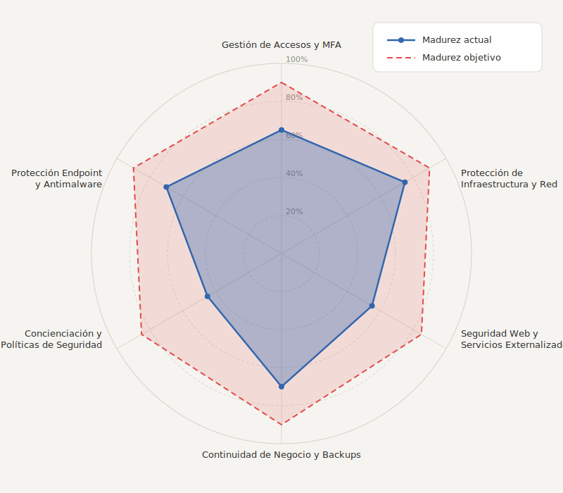
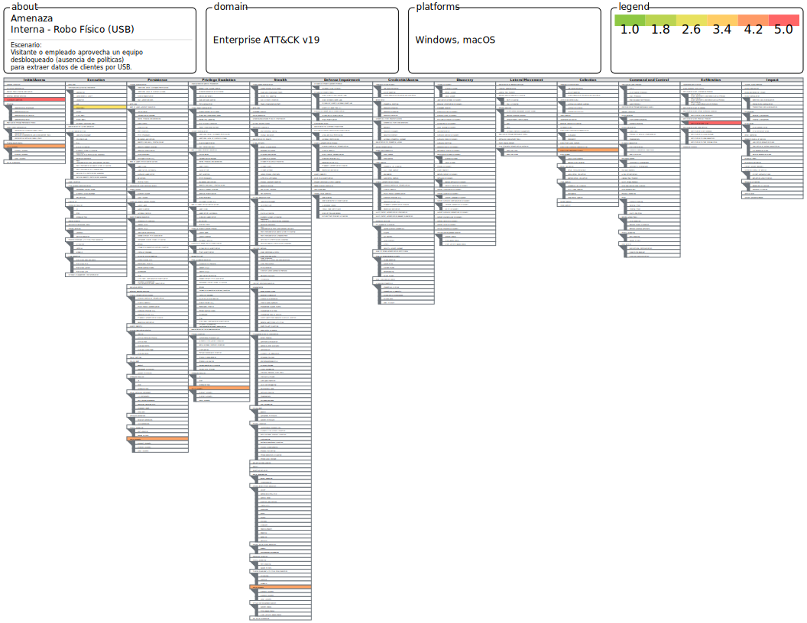
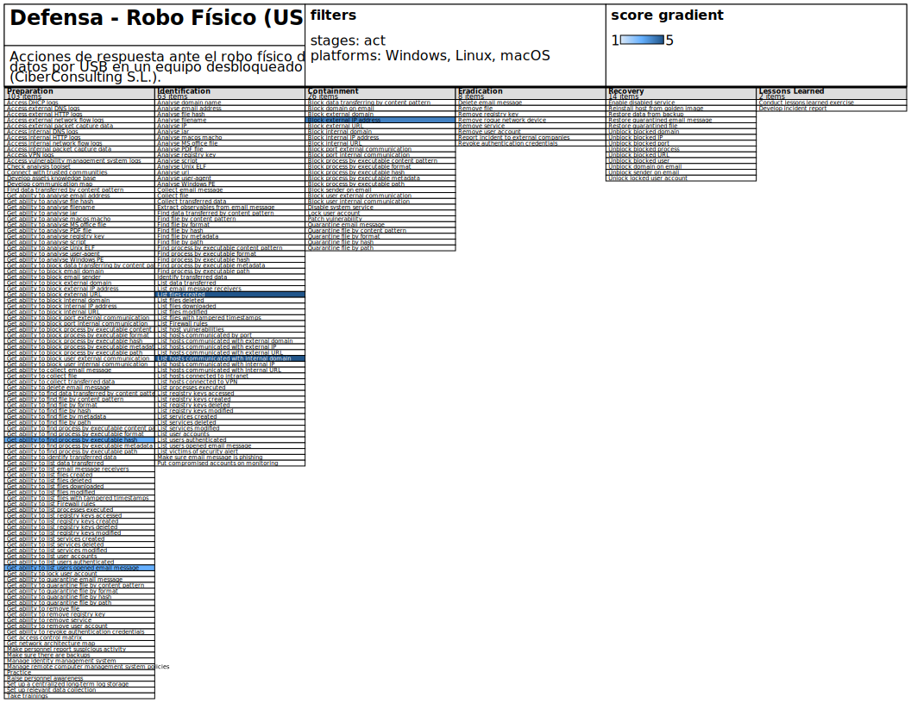
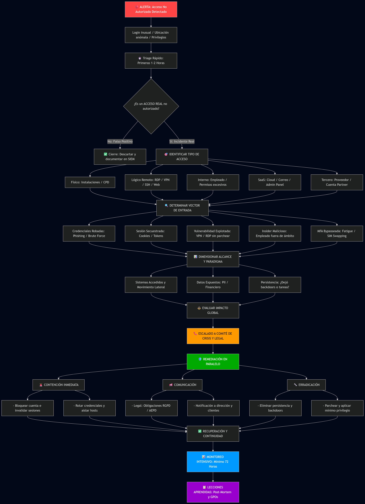

# CiberConsulting S.L. - Plan de Respuesta a Incidentes y Playbooks Sectoriales

**ID Actividad:** 4.01
**Curso:** 2526
**Tarea:** 4.1
**Grupo:** G2
**Entorno de la Empresa:** Asesoría de autónomos y PYMEs (150 empleados, 2 sedes, web/tienda online externalizada).

---

## Índice

1. [Introducción](#introducción)
2. [Plan de respuesta](#plan-de-respuesta)
3. [Playbooks](#playbooks)
4. [Respuesta a las preguntas](#respuesta-a-las-preguntas)
   - [Pregunta 1.a (Relación MITRE ATT&CK y RE&CT)](#1a-qué-relación-existe-entre-el-trabajo-que-has-hecho-con-las-matrices-mitre-attck-y-rect-y-el-plan-de-respuesta-que-estás-planteando)
   - [Pregunta 1.b (Playbooks identificados y flujo)](#1b-qué-playbooks-has-identificado-como-necesarios-en-este-plan-de-respuesta-y-en-qué-te-has-basado)
   - [Pregunta 1.c (Cobertura de fases PICERL)](#1c-cómo-te-has-asegurado-que-has-cubierto-todas-las-fases-del-plan-de-respuesta)
   - [Pregunta 2.a (Flujo de Toma de Decisiones y Escalado)](#2a-en-qué-consiste-el-flujo-de-toma-de-decisiones-y-escalado-de-tu-plan-de-respuesta)
   - [Pregunta 3.a (Respuestas Resilientes)](#3a-cómo-te-has-asegurado-de-que-tu-plan-tiene-respuestas-resilientes)
5. [Conclusiones](#conclusiones)
6. [Bibliografía](#bibliografía)

---

## Introducción

Este documento define el plan de respuesta a incidentes de CiberConsulting S.L. y los playbooks operativos asociados, ajustados al contexto real de la empresa: 150 empleados, dos sedes físicas y una web/tienda online externalizada. El objetivo es que, ante un incidente, el equipo pueda actuar de forma coordinada, rápida y verificable: confirmar el incidente, contenerlo, erradicar la causa, recuperar la operación y capturar lecciones aprendidas.

Para que el plan no sea genérico, el enfoque combina:

- Identificación de activos y criticidad (qué hay que proteger y con qué prioridad).
- Modelado de amenazas y técnicas (MITRE ATT&CK) para aterrizar “qué nos puede pasar”.
- Acciones defensivas concretas (RE&CT) para traducir la teoría en pasos ejecutables.
- Cobertura de ciclo de vida de respuesta (NIST SP 800-61 / PICERL) para asegurar que no se omiten fases.

El resultado se concreta en 6 playbooks que cubren los escenarios de mayor impacto/probabilidad para la organización (exfiltración web, phishing, ransomware, acceso no autorizado, compromiso de proveedores y pérdida/robo de dispositivo), con evidencias de flujo (diagramas) y guías de actuación.

Como punto de partida, el siguiente modelo de madurez refleja el estado actual de la organización frente al objetivo a alcanzar en los seis dominios de ciberseguridad más críticos, y justifica la necesidad del presente plan:

**Leyenda de valores:**

- Gestión de Accesos y MFA: actual 65% / objetivo 90%
- Protección de Infraestructura y Red: actual 75% / objetivo 90%
- Seguridad Web y Servicios Externalizados: actual 55% / objetivo 85%
- Protección Endpoint y Antimalware: actual 70% / objetivo 90%
- Concienciación y Políticas de Seguridad: actual 45% / objetivo 85%
- Continuidad de Negocio y Backups: actual 70% / objetivo 90%

### Inventario de activos

| ID      | Activo                                     | Tipo        | Categoría              | Propietario        | Valor C | Valor I | Valor D | Criticidad |
| :------ | :----------------------------------------- | :---------- | :--------------------- | :----------------- | :------ | :------ | :------ | :--------- |
| ACT-001 | **Datos personales (RGPD)**                | Datos       | Clientes / Legal       | Director Legal     | **5**   | **5**   | 4       | **Alta**   |
| ACT-002 | **Página web / Tienda online**             | Servicio    | Ventas / Marketing     | Director Comercial | 4       | **5**   | **5**   | **Alta**   |
| ACT-003 | Aplicaciones empresariales (CRM/ERP)       | Software    | Procesos / Operaciones | Director TIC       | 4       | 4       | **5**   | **Alta**   |
| ACT-004 | Servidores de Archivos (Local)             | Hardware/SW | Almacenamiento         | Director TIC       | 4       | 4       | 4       | Media      |
| ACT-005 | Propiedad intelectual (Informes)           | Datos       | Negocio / Legal        | Dir. General       | **5**   | 4       | 3       | Media      |
| ACT-006 | Dispositivos Móviles (Portátiles/Tabletas) | Hardware    | Empleados              | Director RRHH      | 3       | 3       | 3       | Media      |
| ACT-007 | Personal cualificado                       | Persona     | RRHH                   | Director RRHH      | 5       | 4       | 4       | Media      |
| ACT-008 | Servidores de Correo Electrónico (Local)   | Servicio    | Comunicaciones         | Director TIC       | 4       | 4       | 4       | Media      |

## Plan de respuesta

[Plan de respuesta en markdown](plan_respuesta/plan.md)

[Plan de respuesta en pdf](plan_respuesta/plan.pdf)

[Plan de respuesta en html](plan_respuesta/plan.html)

[Plan de respuesta en docx](plan_respuesta/plan.docx)

## Playbooks

Aquí se listan los 6 playbooks detallados creados por el equipo:

- [Playbook 1: Exfiltración de Datos (Web/Tienda Online)](./playbooks/exfiltracion-datos/playbook-data-exfiltration.md)
- [Playbook 2: Ataque de Phishing](./playbooks/playbook-phishing.md)
- [Playbook 3: Infección por Ransomware](./playbooks/playbook-ransomware.md)
- [Playbook 4: Acceso No Autorizado (Físico y Lógico)](./playbooks/acceso-no-autorizado/playbook-acceso-no-autorizado.md)
- [Playbook 5: Compromiso de la Cadena de Suministro / Proveedores](./playbooks/playbook-supply-chain.md)
- [Playbook 6: Pérdida o Robo de Dispositivo](./playbooks/perdida-robo-dispositivo/playbook-perdida-robo-dispositivo.md)
- [Playbook 7: Amenaza Interna / Riesgo Físico (Extracción USB)](./playbooks/insider-threat/playbook-insider.md)

---

## Playbook Adicional: Amenaza Interna / Riesgo Físico (Extracción USB)

# Playbook: Amenaza Interna / Riesgo Físico (Extracción USB)

**Investigar, remediar (contener, erradicar) y comunicar en paralelo.**

Asigne pasos a individuos o equipos para que trabajen simultáneamente, cuando sea posible; este playbook no es meramente secuencial. Utilice su mejor criterio.

---

## Diagrama de Flujo del Incidente

[](https://mermaid.ai/live/edit#pako:eNpVUstu2zAQ_JUFz45rSYlh6dDCluMHUKRFHj1U9oGhNjYRiVRJKkhi-GNy7CGnfkCB6se6EuO01kmDndnZHe6OCZ0jS9jG8GoL19OVAvrG2bhA43gCqVb4KJtfCm6uJqA08NppI595zuEDXGKljUPIEZbKmdrqNZycfIRJtlQPaJ3ccNGJZ9qgsgiXzUslc772NpOOnO7-_L6xum0iDOaohOQFWihw07w6WXL7ae_5KfHhqnntZNOMZnMtmwwSmBT6R43cQFqjcrztdmNrbqQGVDCerv9rcaG7DufZWNqCl5IEOoEpWvG-7ax5tVK0bQpYaOve5FMv9OC8A7Ps3BieE7mb5I0487Ugm2iqGrDCyMpZKHkhhdRWW9DgsKT82mWPVWF2iQ9akMzpe8oNnuBOm2fCgpe30kdV8Ac8yIJON8-ucFMbyjd_n_8JPuOGFwdi6IkezT0IyI1yRAN0BLe0BYVgW4s0vf62PqKG2YV28u6wa0uaGBRb3j4_GsWhPQSatUS4bn4KJYU-dPAzLshM1BWao7Tmfq6FRwsPgmxcUVi09fzrl9bqtntif4Jl8-KoOe0neEUUus5DiAvvtMxSicZg94RLOhO6LIdr1qNblzlL6Fyxx0o0JW8h27XqFXNbLHHFEvrNublfsZXak6bi6rvW5UFmdL3ZsuSOF5ZQXeXc4VRyCvAfBVWOJtW1ciwJ4q4FS3bskSVRFPaj0_gsGJ4O4jAcRT32RJxRfxCP4jgKwzg4G0aj0b7HnjvTQT-myukwGsSDUTwcDob7v4n2NJw)

### Visualización de Amenazas y Defensas

---

## Contexto Típico en Esta Organización

Nuestra empresa cuenta con dos sedes donde es habitual el tránsito de personal externo (clientes y proveedores). Al presentar una situación de controles básica sin políticas de seguridad por escrito ni obligación de escritorio limpio, un atacante físico (o un empleado descontento) puede aprovechar un puesto de trabajo desatendido y desbloqueado en departamentos sensibles (como Facturación o Ventas) para conectar un medio físico de almacenamiento y exfiltrar datos locales.

**Implicaciones típicas en una amenaza interna/física:**

- Exfiltración exprés de bases de datos de pymes clientes y listados de facturación en almacenamiento local (MITRE T1025: Exfiltration Over Physical Medium).
- Uso indebido de identidades legítimas corporativas (MITRE T1078: Valid Accounts).
- Introducción de hardware malicioso de ejecución automática (ej. Rubber Ducky o BadUSB) (MITRE T1200: Hardware Additions).

**Regla de oro:** No apague el equipo afectado. Al apagar la máquina se destruye la información volátil de la memoria RAM (como las sesiones activas y los scripts que puedan seguir ejecutándose en segundo plano).

---

## Investigar

`OBJETIVO: Confirmar la intrusión física o el mal uso de identidades, dimensionar alcance de extracción de datos y preservar evidencia forense antes de intervenciones que modifiquen el sistema.`

### Triage Rápido (Primeros 15–30 Minutos)

1. **Confirmar el origen de la sospecha:**
   - ¿Ha sido un reporte visual de un compañero o una alerta automática del software de seguridad por inserción de hardware (MITRE T1200)?
   - Documentar quién reportó, cuándo, dónde y qué observó exactamente.

2. **Preservar evidencia mínima del sistema operativo (RE&CT: Access OS Logs):**
   - Extraer eventos de sistema de Windows:
     - Event ID 4624: Inicios de sesión legítimos.
     - Categoría Kernel-PnP o DriverFrameworks-UserMode: Conexiones USB.
   - NO REINICIAR la máquina. La memoria RAM contiene sesiones activas y scripts en ejecución.
   - Tomar captura de pantalla de la máquina para documentar su estado.

3. **Identificar el usuario activo (RE&CT: List Users Authenticated / MITRE T1078):**
   - Determinar qué usuario legítimo figuraba como activo en la sesión comprometida.
   - Comprobar si la sesión es local o remota.

4. **Abrir ticket de incidente crítico por canal seguro (Out-of-Band):**
   - Iniciar chat privado o llamada telefónica con el equipo de seguridad.
   - No difundir sospechas por canales públicos (email, chat corporativo) hasta tener confirmación.

### Ámbito del Ataque

1. **Determinar tiempo de exposición:**
   - ¿Cuánto tiempo se quedó el equipo desbloqueado y solo?
   - Revisar cámaras CCTV si están disponibles (coordinar con seguridad física).

2. **Comprobar ejecución de comandos automatizados locales:**
   - Revisar historial de comandos ejecutados en PowerShell (`ConsoleHost_history.txt`).
   - Buscar scripts rápidos de recolección (MITRE T1059.001: Command and Scripting Interpreter).
   - Buscar archivos recientemente modificados o creados en directorios temporales (`C:\Temp`, `C:\Users\*\AppData\Local\Temp`).

3. **Verificar actividad de almacenamiento masivo:**
   - Revisar registros de conexión de dispositivos USB (Windows: `setupapi.dev.log`, Event Viewer).
   - Comprobar si se ejecutaron scripts desde medios extraíbles.

### Determinar la Gravedad

- **CRÍTICA (Scoring 5):** El equipo comprometido pertenece a Dirección, Facturación, Ventas o TIC, y contiene accesos a servicios cloud, credenciales de bases de datos o datos confidenciales de clientes.
- **ALTA (Scoring 4):** El equipo contiene datos sensibles de negocio (márgenes, información de proveedores, listados de clientes).
- **MEDIA (Scoring 3):** El equipo contiene datos internos estándar sin acceso a sistemas críticos.
- **BAJA (Scoring 1-2):** Sin evidencia de extracción o acceso a datos sensibles; posible falsa alarma.

---

## Remediar

- **Planificar eventos de remediación:** Las acciones de contención lógica sobre el usuario se realizan en el Directorio Activo (AD). Las acciones físicas requieren la coordinación con el equipo de mantenimiento/TIC en el puesto de trabajo.
- **Considerar el momento y las compensaciones:** La desconexión física del equipo es irreversible en el corto plazo; coordinar con dirección si pertenece a un área crítica.

### Contención

`OBJETIVO: Bloquear el acceso del intruso a la sesión, evitar propagación o fuga continuada de datos, y preservar evidencia en el host.`

`OBJETIVO: Especificar herramientas y procedimientos para bloqueo de cuenta, aislamiento de red y evidencia (AD, EDR, cámaras CCTV).`

- **Bloqueo de cuentas inmediato (Prioridad Máxima — Scoring 5):**
  - RE&CT: Lock user account / MITRE T1078.002: Deshabilitar o congelar inmediatamente la cuenta del usuario afectado en el Directorio Activo.
  - Esto invalida cualquier privilegio técnico que el atacante esté explotando en ese momento.
  - Revisar si el usuario tiene acceso delegado a otros sistemas (CRM, ERP, servidores compartidos) y revocar también en esos servicios.

- **Aislamiento de la red (Prioridad Máxima — Scoring 5):**
  - RE&CT: Isolate system / MITRE T1562: Desconectar el cable de red del puesto de trabajo afectado o aislar mediante el EDR.
  - Esto evita que el atacante intente pivotar hacia servidores de aplicaciones o backups internos.
  - Si la máquina estaba ejecutando scripts, esta desconexión detiene cualquier conexión de C&C (Command & Control).

- **Preservar acceso físico a la máquina:**
  - No apagar ni reiniciar. Mantener el host encendido si es posible.
  - Bloquear físicamente el puesto de trabajo para evitar que se toquen otros periféricos.
  - Documentar el estado físico del equipo (cables, periféricos, estado de monitor).

### Erradicación

`OBJETIVO: Sanear el sistema operativo comprometido, eliminar persistencia maliciosa y restablecer credenciales de seguridad.`

`OBJETIVO: Especificar herramientas y procedimientos para análisis forense, eliminación de artefactos y rotación de secretos.`

- **Análisis forense y eliminación de persistencia (Prioridad Alta — Scoring 4):**
  - RE&CT: Remove file / MITRE T1070.004: Analizar el almacenamiento local (puede requerir herramientas forenses para no destruir logs).
  - Buscar y documentar (antes de eliminar):
    - Scripts maliciosos (`.ps1`, `.bat`, `.vbs`, `.exe`).
    - Archivos temporales sospechosos (directorios `Temp`, descargas recientes).
    - Hardware persistente dejado en la máquina (Rubber Ducky, BadUSB).
  - Guardar copias de estos artefactos para análisis posterior.
  - Eliminar definitivamente tras documentar en cadena de custodia.

- **Saneamiento de identidades (Prioridad Alta — Scoring 4):**
  - RE&CT: Revoke authentication credentials / MITRE T1531:
    - Forzar cambio de contraseña inmediato de la cuenta comprometida.
    - Revocar todos los tokens de sesión activos en servicios cloud corporativos (CRM/ERP, correo, almacenamiento compartido).
    - Si el usuario tenía autenticación multifactor (MFA) activa, revisar si fue bypass-eada.

- **Limpieza de herramientas de acceso remoto:**
  - RE&CT: Remove application / MITRE T1531:
    - Buscar cualquier herramienta de acceso remoto instalada por el atacante (TeamViewer, AnyDesk, etc.).
    - Eliminar cualquier script de backdoor.

### Recuperación

`OBJETIVO: Devolver el puesto de trabajo a producción aplicando políticas estrictas de endurecimiento (Hardening).`

`OBJETIVO: Especificar herramientas y procedimientos para reimaginar sistemas, auditoría de archivos y mitigación de raíz.`

1. **Auditoría forense completa antes de reconectar:**
   - Realizar copia forense de disco (si dispone de herramientas).
   - Auditar todos los archivos modificados desde la fecha sospechada del incidente.
   - Verificar que no haya scripts ocultos en directorios de inicio (`Startup`, `RunOnce`).

2. **Reimaginar o restaurar desde backup limpio:**
   - Si la auditoría revela múltiples cambios: considerar reimaginar el sistema operativo desde imagen golden.
   - Si solo hay cambios superficiales: restaurar desde backup limpio anterior al incidente.

3. **Mitigación de la vulnerabilidad raíz — Implementar obligatoriamente a través de Directivas de Grupo (GPOs):**
   - **Bloqueo automático de pantalla:** Configurar bloqueo automático tras 3 minutos de inactividad.
   - **Restricción de almacenamiento masivo:** Capar o bloquear completamente la capacidad de conectar USBs en puestos de trabajo ordinarios (permitir solo en TIC con justificación).
   - **Auditoría de eventos:** Registrar todos los intentos de conexión USB y cambios de usuario.

4. **Publicar Política de Escritorios Limpios y Pantallas Bloqueadas:**
   - Redactar oficialmente y comunicar política de obligado cumplimiento para todos los empleados de las sedes.
   - Incluir sanciones y procedimientos de concienciación.

---

## Comunicar

`OBJETIVO: Coordinar respuesta física corporativa, registrar pruebas de intrusión y cumplir obligaciones legales y regulatorias.`

`OBJETIVO: Especificar herramientas y procedimientos para notificación (contactos, plantillas, timing).`

1. **Notificar al Responsable de Seguridad Física / Mantenimiento:**
   - Solicitar y acotar grabaciones de cámaras CCTV de la sede correspondiente en la ventana de tiempo del incidente.
   - Documentar identidad física del intruso si es visible.
   - Confirmar horarios de acceso/salida del edificio.

2. **Informar a Dirección y Departamento Legal:**
   - Si se sospecha que el intruso salió del edificio con datos de carácter personal de terceros (clientes o autónomos): notificación obligatoria a AEPD dentro de 72 horas.
   - Evaluar si aplica denuncia a Fuerzas de Seguridad si hay evidencia de delito (sustracción, sabotaje).
   - Revisar cobertura de seguro de ciberseguridad (breach notification).

3. **Entrevistar al empleado titular del puesto:**
   - Documentar circunstancias exactas del descuido (ausencia, si dejó equipos desbloqueados, si notó algo raro).
   - Esta información es clave para la concienciación posterior.

4. **Comunicación interna limitada:**
   - No difundir detalles por canales públicos (email, chat corporativo).
   - Comunicar solo a equipos relevantes (TIC, Seguridad, Dirección, Legal).
   - Si es incidente grave: comunicado corporativo único controlado.

---

## Recursos

### Información Adicional

1. [INCIBE: Política de Pantallas Limpias y Bloqueo de Puestos de Trabajo](https://www.incibe.es/)
2. [MITRE ATT&CK: T1025 Exfiltration Over Physical Medium](https://attack.mitre.org/techniques/T1025/)
3. [MITRE ATT&CK: T1078 Valid Accounts](https://attack.mitre.org/techniques/T1078/)
4. [MITRE ATT&CK: T1200 Hardware Additions](https://attack.mitre.org/techniques/T1200/)
5. [NIST SP 800-61r2: Computer Security Incident Handling Guide](https://nvlpubs.nist.gov/nistpubs/SpecialPublications/NIST.SP.800-61r2.pdf)
6. [RE&CT Framework: Response Actions](https://react.mitre.org/)
7. [OWASP: Physical Security](https://owasp.org/www-community/attacks/Physical_Attack)
8. [AEPD: Notificación de Brechas de Seguridad](https://www.aepd.es/)

---

## Respuesta a las preguntas

### 1.a ¿Qué relación existe entre el trabajo que has hecho con las matrices MITRE ATT&CK y RE&CT y el plan de respuesta que estás planteando? ¿De qué manera te ha ayudado el trabajo previo?

#### De una defensa genérica a una respuesta activa

En realidad, lo importante de MITRE ATT&CK y RE&CT es que funcionan juntas. ATT&CK te dice qué te puede atacar específicamente (según tu sector, infraestructura y contexto), y RE&CT te dice cómo defenderte contra eso de forma concreta. Para CyberConsulting, esto significa pasar de tener un plan defensivo genérico ("protegemos todo") a un plan que realmente funciona ("ante esto, hacemos esto otro").

#### Qué nos puede pasar y por qué

CyberConsulting no es una empresa normal. Tenemos 150 empleados, 2 sedes físicas, y la tienda online está alojada en un servidor que no controlamos. Eso significa que hay riesgos muy específicos que nos van a atacar:

**1. Ataque a la tienda online (T1190 - Exploit Public-Facing Application)**

Nuestra tienda está fuera de nuestro control, en un servidor de terceros. Un atacante puede buscar vulnerabilidades en el CMS, plugins desactualizados o fallos de configuración. Por eso tenemos el playbook de exfiltración de datos específicamente para la web. Cuando investigamos, lo primero que miramos es si hubo accesos raros en los logs del servidor, si descargaron datos en grandes volúmenes, y si hay señales de inyección SQL o webshells.

**2. Phishing y robo de contraseñas (T1598 / T1566 - Phishing, T1110 - Brute Force)**

Uno de nuestros mayores riesgos es que nuestros empleados reciben mails de clientes, proveedores, administraciones públicas. Un atacante puede meterse en el correo de un admin y acceder a todo. Por eso tenemos un playbook específico para phishing que te dice cómo analizar si un correo es legítimo, si la gente lo abrió, y si alguien entró en sistemas. Cuando pasa, lo que hacemos es bloquearlo directamente en el servidor de correo, desactivar la sesión del usuario, y forzar que cambie la contraseña.

**3. Ransomware (T1486 - Data Encrypted for Impact, T1008 - Fallback Channels)**

Este es probablemente el que más nos asusta. Si alguien nos encripta los datos, no podemos facturar, no podemos trabajar con los clientes, se nos cae el negocio. Nuestro playbook para ransomware está bastante enfocado en parar el ataque rápido: aislar los sistemas infectados, bloquear el comando y control del atacante, proteger las copias de seguridad. Es la fase donde más rápido tenemos que actuar.

**4. Acceso no autorizado (T1078 - Valid Accounts, T1098 - Account Manipulation)**

Alguien entra sin permiso. Puede ser un técnico que se aprovecha, un ex-empleado que mantiene acceso, o alguien de fuera. En CyberConsulting tenemos oficinas donde entran personas externas (limpiadores, técnicos, visitantes). Además, manejamos credenciales compartidas que a veces quedan activas de más. Nuestro playbook mira los logs de quién entró cuándo, desde dónde, y qué hizo una vez dentro.

**5. Compromiso de proveedores (T1195 - Supply Chain Compromise)**

Nosotros no controlamos todo lo que usamos. La tienda está en un servidor de terceros, usamos Microsoft 365 para correo, tenemos herramientas en la nube, y los técnicos de mantenimiento entran a nuestras sedes. Si uno de nuestros proveedores se ve comprometido, nosotros también estamos en riesgo. Por eso tenemos un playbook que te dice cómo determinar si el problema vino de adentro o de un proveedor, y qué hacer en cada caso.

#### Cómo juntamos ATT&CK y RE&CT

RE&CT es básicamente la respuesta de ATT&CK. Cada tipo de ataque tiene una forma de defenderlo. Por ejemplo, si alguien está robando cuentas de usuario, RE&CT te dice que bloquees esa cuenta. Si hay ransomware, te dice que aisles la red. Si necesitas recuperar datos, te dice cómo restaurar desde backup.

Por ejemplo, imagina que descubrimos ransomware:

1. ATT&CK dice: alguien está cifrando nuestros archivos (T1486)
2. RE&CT dice: bloquea la red donde está infectado, corta la comunicación del atacante, restaura desde backup limpio
3. Nuestro playbook va directamente a hacer eso, sin perder tiempo

#### Por qué esto importa para nosotros

Gracias a esto, no tenemos un plan genérico que "protege todo". Tenemos un plan específico que sabe qué puede pasarnos y qué hacer. Sabemos exactamente los 6 playbooks que necesitamos (no más, no menos). Sabemos qué es prioritario en cada incidente (parar el ataque primero, investigar después). Y sabemos si nuestro plan funciona o no porque tenemos objetivos claros.

### 1.b ¿Qué playbooks has identificado como necesarios en este plan de respuesta y en qué te has basado para saber que son los necesarios? Deja algún diagrama que describa el flujo de un playbook.

#### Qué playbooks necesitamos y por qué

Para identificar los playbooks, no fue complicado. Miramos qué nos puede pasar basándonos en cómo es CyberConsulting, el historial de ataques en empresas como la nuestra, y qué podemos hacer realmente. Al final, sacamos 6 playbooks que cubren los riesgos reales.

**Playbook 1: Exfiltración de Datos (Web/Tienda Online)**

La tienda está en un servidor que no controlamos. Tiene datos de clientes, tarjetas, cuentas bancarias. Si alguien la ataca, nos roba eso. Es muy delicado porque si roban datos personales, tenemos 72 horas para notificarlo a la autoridad por RGPD. Este playbook es sobre parar rápido el ataque y mirar qué se llevaron.

**Playbook 2: Ataque de Phishing**

Nuestros empleados reciben muchos mails de fuera. Un atacante puede hacerse pasar por un cliente, un proveedor, o la administración pública. Si alguien hace clic, entrega credenciales o aprueba MFA, el atacante puede escalar a correo, nube y aplicaciones internas. Este playbook guía el análisis del mensaje, el alcance y la contención rápida (bloqueo/purga de correos, revocación de sesiones/tokens, etc.).

**Playbook 3: Ransomware**

Un ataque de ransomware nos para el negocio directamente. Si alguien nos encripta los datos, no facturamos, no trabajamos con clientes, se nos cae todo. Es el más peligroso. Lo que hacemos es aislar los sistemas rapidísimo, proteger las copias de seguridad para que no las encripten también, y bloquear al atacante.

**Playbook 4: Acceso No Autorizado (Físico y Lógico)**

En nuestras oficinas entran técnicos, gente de limpieza, visitantes. Cualquiera podría conectar un USB malicioso, robar datos en físico, o acceder a un equipo. Además, a veces la gente se va de vacaciones y deja la sesión abierta. Este playbook cubre ambas cosas: acceso físico y acceso lógico sin permiso.

**Playbook 5: Compromiso de la Cadena de Suministro / Proveedores**

Usamos Microsoft 365, CRM en la nube, hosting de terceros. No controlamos sus servidores. Si uno de ellos se ve comprometido, nosotros también estamos en riesgo. Necesitamos saber si el problema es nuestro o del proveedor, y actuar en consecuencia.

**Playbook 6: Pérdida o Robo de Dispositivo**

Usamos portátiles, móviles y tabletas. Si se pierde o roba un dispositivo, el riesgo no es solo el hardware: puede implicar exposición de datos, sesiones activas, credenciales guardadas y acceso a almacenamiento en la nube. Este playbook define acciones rápidas de bloqueo/contención (revocación de sesiones, rotación de credenciales, MDM si aplica) y verificación de accesos anómalos.

---

#### Diagrama de Flujo: Playbook de Exfiltración de Datos (Web/Tienda)

[](https://mermaid.live/edit#pako:eNpVUstu2kAU_ZXRrAn1AwJYVSuwHYhURSiJVKmGxdS-mFHtGXo9TkMQH5NlF1nlAyrVP9ZrD0SNN54zc865zwNPdQY84DmK3ZbdRyvF6Jsm0wLQiIDdY_O8kalmQjWvpSg0-8DiR4MiTWXzqlgGbBat2cXFJzZLrtUDVEbmwr7tSS1FDswdXvgOK6VaW_tZxw8Pf__EjxtZtG6dABRLa6z056PlhcRjd81LR4-SUCsDqqMGbFbonzUIZNfLNiFAJShgWIMyolr_p7_RnTxOpqp5LmQlKxLXVUrSr_C92kJRVOzeHTpD0n_ReQvciXOyiKzYgrgDV0mMKDKZ2qxPxCv75iYzTa_IBKZb-aArRk2TqdQVHftPckf9-3UK-17pJbfwoNu09gy1oX-KkLX1igLOFV25HXlOvShrdU6hTRxy8WboWZJFcwvcJKaaC5HRKAtGcmma3-34Qmx7sn5H9pIbbeTmzX8aL6N2Oh_ZyNuy2_kyOvNtPgvKPa13gO9aMrd5LCxaWOAStTKiPs_8DnI6UwUR0A5mp9u4oHpo2ienhQ1znYQSEIHY0zqTRmPzItiSRt6uncrXvEeLLDMeGKyhx0vAUrSQH1qfFTdbKGHFAzpmAn-s-EodSbMT6pvW5VmGus63PNiIoiJU7zJhIKJFRlG-3SKoDDDUtTI88J3OgwcH_siDgev2nUt_4Iw933cHw1GP7-l20J94_mQ4nFz63sgZTI49_tQFdfpj1xm7I6J6vjcej_zjP_QHJSY)

#### Diagrama de Flujo: Playbook de Acceso No Autorizado

####

### 1.c ¿Cómo te has asegurado que has cubierto todas las fases del plan de respuesta? ¿Qué fase consideras que está más floja en un plan? ¿Cuál de ellas consideras que está mejor trabajada en tu plan?

#### Cómo cubrimos todas las fases

Nuestro plan sigue las 6 fases del NIST SP 800-61. Básicamente es un círculo: te preparas antes, detectas cuando pasa algo, lo paras lo antes posible, lo cierras del todo, lo arreglas, y luego aprendes de qué pasó.

**PREPARACIÓN: Antes de que pase nada**

Aquí es donde tenemos documentados los roles (Incident Commander, ayudante, personas que escriben notas), los teléfonos para llamar, el chat donde hablan todos, las herramientas que usamos (SIEM, antivirus, etc.). Todo preestablecido para no perder tiempo cuando pase algo.

El problema aquí es que sobre el papel está bien, pero en la práctica no. No tenemos políticas de seguridad por escrito (qué contraseña es válida, cada cuánto cambiarla). No hacemos ejercicios de phishing fake para entrenar a la gente. No probamos si nuestras copias de seguridad funcionan realmente. Si pasa un incidente, nos vamos a dar cuenta de que muchas cosas no están lista.

**IDENTIFICACIÓN: Algo pasó, pero ¿qué?**

Cada playbook comienza mirando si es real o falso positivo. Por ejemplo, si alguien hace clic en un phishing, confirmamos que pasó. Si hay ransomware, miramos qué tipo es. En todos los playbooks, la gente tiene 15-30 minutos para confirmar de verdad que es un incidente.

Aquí estamos bastante bien. Tenemos procedimientos claros para cada tipo de ataque. Sabemos qué mirar en los logs, qué preguntar.

**CONTENCIÓN: Parar esto ahora**

Aquí es donde estamos mejor. Cuando descubrimos ransomware, no esperamos a terminar la investigación. Aislamos los sistemas infectados, bloqueamos el comando que controla el malware, protegemos las copias de seguridad. Cuando hay phishing, bloqueamos el correo, desactivamos la sesión del usuario, forzamos cambio de contraseña.

La idea es parar la propagación en las primeras 2-4 horas. Porque en un ransomware, cada minuto que dejas pasar, se infectan más sistemas.

**ERRADICACIÓN: Que no vuelva**

Aquí eliminamos cualquier rastro del atacante. Parches en sistemas. Eliminar acceso backdoor. Cambiar todas las contraseñas. En un ransomware, reinstalamos desde cero si es necesario.

Lo tenemos documentado, pero faltaría ser más específico sobre qué herramientas usar exactamente para eliminar webshells o malware.

**RECUPERACIÓN: Arreglemos esto**

Validamos que las copias de seguridad están limpias. Restauramos datos. Bajamos los sistemas poco a poco para no volver a infectar. Verificamos que no hay reinfección.

Lo que nos faltaría aquí es un plan más claro sobre cómo degradar elegantemente. Si no podemos levantar todo en 1 hora, ¿qué levantamos primero? ¿Qué puede funcionar parcialmente?

**LECCIONES APRENDIDAS: Qu\u00e9 salió mal**

Después de un incidente hacemos una reunión donde miramos qué pasó de verdad, qué se suponía que pasaría, y qué podemos mejorar. Esto está bien documentado. Hacemos una reunión con los responsables, escribimos qué aprendimos, y lo comunicamos a quien corresponde.

---

#### Donde fallamos y donde estamos bien

**La fase más débil: Preparación**

En la preparación es donde más nos falta. Sobre el papel tenemos todo bonito, pero en la realidad CyberConsulting no está preparada.

Lo primero es que no tenemos políticas de seguridad escritas. No existe un documento que diga "las contraseñas tienen que tener 12 caracteres y cambiarlas cada 90 días". No hay política de uso aceptable para empleados. No sabemos si el que se conecta por VPN tiene que usar MFA o no.

Segundo, no entrenamos a la gente. No hacemos ataques de phishing fake para entrenar. El help desk no sabe cómo es el triage de un incidente. Si alguien llama diciendo "creo que me hackearon", probablemente no sabrán qué hacer.

Tercero, nunca probamos el plan. No hacemos simulacros. Cuando un incidente real pase, nos vamos a dar cuenta de que nuestros canales de comunicación no funcionan o que las copias de seguridad no se pueden restaurar en 2 horas como esperamos.

Y cuarto, no sabemos bien qué sistemas son críticos y qué datos son sensibles. En `info.yml` hay placeholders que nunca completamos.

**Donde estamos bien: Contención**

Contención es lo que mejor tenemos hecho. Aquí es donde el plan realmente brilla.

En cada playbook, cuando detectamos un ataque, sabemos exactamente qué hacer sin esperar. En ransomware no esperamos a terminar la investigación. Aislamos inmediatamente, bloqueamos el comando del atacante, protegemos los backups. En phishing bloqueamos el correo, desactivamos sesiones, forzamos cambio de contraseña.

Todas las acciones están vinculadas a técnicas de respuesta de RE&CT. Eso significa que además pueden automatizarse con scripts.

Tenemos claros los escenarios: si un admin pierde su cuenta, sabemos que el atacante puede entrar a todo, entonces actúamos distinto a si pierde la cuenta un empleado normal.

Y lo más importante: el plan dice específicamente qué hacer. No dice "aislar sistemas". Dice "cuarentena lógica del servidor X, del usuario Y, del almacenamiento compartido Z". Eso es lo que necesitas en un incidente real.

#### Resumen de cómo cubrimos cada fase

| Fase                 | ¿Está cubierta? | Qué tal está   | Notas                                                      |
| -------------------- | --------------- | -------------- | ---------------------------------------------------------- |
| Preparación          | Parcial         | Flojo (2/5)    | Falta políticas por escrito, entrenamientos, pruebas       |
| Identificación       | Sí              | Muy bien (5/5) | Procedimientos claros, triage rápido, decisiones definidas |
| Contención           | Sí              | Muy bien (5/5) | Acciones específicas, RE&CT vinculadas, automatizable      |
| Erradicación         | Sí              | Bien (4/5)     | Documentado pero sin herramientas específicas              |
| Recuperación         | Sí              | Bien (4/5)     | Falta plan más claro de degradación elegante               |
| Lecciones Aprendidas | Sí              | Bien (4/5)     | Proceso AAR bien estructurado, comunicación clara          |

### 2.a ¿En qué consiste el Flujo de Toma de Decisiones y Escalado de tu plan de respuesta? ¿Existe un plan de comunicación, protocolos, etc? Si la respuesta es correcta, haz un resumen del plan y protocolos. Deja evidencias del flujo, mediante un diagrama.

El flujo de toma de decisiones se basa en un proceso escalonado y documentado:

- Alerta inicial: detección de un incidente posible por phishing, acceso no autorizado, ransomware, exfiltración o compromiso de proveedor.
- Triage rápido: evaluación en las primeras 1-2 horas para distinguir falso positivo de incidente real.
- Identificación: determinar el tipo de incidente, vector de entrada y alcance del daño.
- Dimensionamiento: estimar sistemas afectados, datos expuestos, persistencia y movimiento lateral.
- Escalado: activar comité de crisis, legal y dirección según el impacto; notificar a clientes y reguladores cuando corresponda.
- Remediación en paralelo: contención inmediata, comunicación coordinada, erradicación técnica y recuperación controlada.
- Monitoreo intensivo: vigilancia activa durante al menos 72 horas tras la acción inicial.
- Lecciones aprendidas: reunión AAR para documentar causas, fallos y mejoras.

El plan incluye un protocolo de comunicación y roles predefinidos:

- Roles: Incident Commander, deputy, scribe, experto y liaison.
- Canales: chat de incidente, teléfono de crisis, correo de notificación y reuniones de escalado.
- Protocolos operativos: bloquear cuentas, desactivar sesiones, cuarentena lógica de servidores, protección de backups, cambio forzado de credenciales, aislamiento de redes, notificación RGPD/AEPD cuando sea necesario.
- Playbooks específicos: cada tipo de incidente tiene instrucciones concretas (phishing, ransomware, acceso no autorizado, exfiltración, proveedor comprometido).

### 3.a ¿Cómo te has asegurado de que tu plan tiene respuestas resilientes? ¿Por qué son resilientes y en qué fases se centran?

El plan se asegura de ser resiliente porque no es solo una respuesta aislada, sino un ciclo completo basado en NIST SP 800-61:

- Preparación: roles definidos, canales de comunicación preparados, herramientas y playbooks listos.
- Identificación: detección rápida, triage estructurado y clasificación del incidente.
- Contención: acciones inmediatas y específicas para detener la propagación, proteger backups y aislar sistemas.
- Erradicación: eliminación de rastros del atacante, parches, revocación de accesos y cambio de credenciales.
- Recuperación: restauración ordenada de servicios, validación de copias de seguridad y control de reinfección.
- Lecciones aprendidas: análisis post-incidente para ajustar el plan.

Son resilientes porque combinan:

- decisiones rápidas y bien definidas,
- protocolos concretos escritos en los playbooks,
- comunicación estructurada con escalado claro,
- enfoque en contención y recuperación paralelas.

**Leyenda de valores:**

- Gestión de Accesos y MFA: actual 65% / objetivo 90%
- Protección de Infraestructura y Red: actual 75% / objetivo 90%
- Seguridad Web y Servicios Externalizados: actual 55% / objetivo 85%
- Protección Endpoint y Antimalware: actual 70% / objetivo 90%
- Concienciación y Políticas de Seguridad: actual 45% / objetivo 85%
- Continuidad de Negocio y Backups: actual 70% / objetivo 90%

Las fases más centradas en resiliencia son:

- Contención: es la más fuerte y mejor trabajada del plan.
- Recuperación: busca restaurar sin reinfectar y establecer continuidad controlada.
- Lecciones aprendidas: garantiza que el plan se mejore tras cada incidente.

---

## Conclusiones

El plan y los playbooks entregan una respuesta aplicable a la realidad de CiberConsulting S.L., evitando un documento “teórico” y priorizando decisiones y acciones que se pueden ejecutar bajo presión. La parte más sólida del trabajo es la contención: para los escenarios críticos (ransomware, phishing y exfiltración) se definen medidas inmediatas que reducen impacto y limitan la propagación, y se conectan con ATT&CK/RE&CT para que sean trazables y, potencialmente, automatizables.

Las principales conclusiones del proyecto son:

- El plan queda acotado a 6 playbooks alineados con el riesgo real y los activos más sensibles, lo que facilita entrenar, mantener y ejecutar.
- El enfoque ATT&CK + RE&CT ayuda a pasar de “qué podría ocurrir” a “qué hacemos exactamente”, mejorando consistencia y repetibilidad.
- La fase más débil identificada es Preparación: faltan políticas por escrito, entrenamiento operativo y validación periódica (simulacros y pruebas de restauración de copias).
- Para aumentar la resiliencia, el siguiente paso no es añadir más playbooks, sino mejorar la ejecución: ejercicios de mesa, checklist de comunicaciones, y verificación de tiempos objetivo (MTTD/MTTC/MTTR) por escenario.

## Bibliografía

### Marcos y guías

- [MITRE ATT&CK](https://attack.mitre.org/) (matriz y técnicas enlazadas a lo largo de los playbooks)
- [MITRE RE&CT (Response Actions)](https://github.com/mitre-attack/react)
- [NIST SP 800-61 Rev. 2: Computer Security Incident Handling Guide](https://nvlpubs.nist.gov/nistpubs/SpecialPublications/NIST.SP.800-61r2.pdf)
- [NIST Digital Identity Guidelines (SP 800-63 - familia)](https://pages.nist.gov/800-63-3/)
- [NIST SP 800-63B: Digital Identity Guidelines – Authentication](https://pages.nist.gov/800-63-3/sp800-63b.html)
- [NIST SP 800-124r2: Guidelines for Managing the Security of Mobile Devices in the Enterprise](https://nvlpubs.nist.gov/nistpubs/SpecialPublications/NIST.SP.800-124r2.pdf)
- [NIST SP 800-161r1: Cybersecurity Supply Chain Risk Management Practices for Systems and Organizations](https://csrc.nist.gov/publications/detail/sp/800-161/rev-1/final)
- [NIST SP 800-218: Secure Software Development Framework (SSDF)](https://csrc.nist.gov/publications/detail/sp/800-218/final)

### Organismos y recursos

- [INCIBE: Gestión de incidentes de seguridad](https://www.incibe.es/empresas/tematicas/gestion-incidentes)
- [INCIBE: Phishing (orientación al usuario)](https://www.incibe.es/ciudadania/avisos/phishing)
- [INCIBE: Robo o pérdida de dispositivos móviles en la empresa](https://www.incibe.es/empresas/tematicas/dispositivos-moviles)
- [CCN-CERT: guías y recursos (España)](https://www.ccn-cert.cni.es/)
- [AEPD: Guía para la notificación de brechas de datos personales (PDF)](https://www.aepd.es/guias/guia-brechas-seguridad.pdf)
- [RGPD Art. 33 – Notificación a la autoridad de control](https://gdpr-info.eu/art-33-gdpr/)
- [CISA: Report Phishing](https://www.cisa.gov/report)
- [CISA: Cybersecurity Advisories (incluye supply chain)](https://www.cisa.gov/news-events/cybersecurity-advisories)
- [ENISA: Phishing (panorama y recomendaciones)](https://www.enisa.europa.eu/topics/csirts-in-europe/glossary/phishing)
- [ENISA: Threat Landscape 2023](https://www.enisa.europa.eu/publications/enisa-threat-landscape-2023)
- [ENISA: Guidelines for SMEs on the Security of Personal Data Processing](https://www.enisa.europa.eu/publications/guidelines-for-smes-on-the-security-of-personal-data-processing)
- [ENISA: Smartphone Secure Development Guidelines](https://www.enisa.europa.eu/publications/smartphone-secure-development-guidelines)
- [NCSC (UK): Phishing](https://www.ncsc.gov.uk/guidance/phishing)
- [FBI IC3: Report Internet Crime](https://www.ic3.gov/)

### Estándares y buenas prácticas (correo)

- [RFC 5322: Internet Message Format](https://www.rfc-editor.org/rfc/rfc5322)
- [DMARC (RFC 7489)](https://www.rfc-editor.org/rfc/rfc7489), [SPF (RFC 7208)](https://www.rfc-editor.org/rfc/rfc7208) y [DKIM (RFC 6376)](https://www.rfc-editor.org/rfc/rfc6376)
- [ICANN: IDN / Homograph attacks (conceptos)](https://www.icann.org/resources/pages/idn-2012-02-25-en)

### Herramientas y recursos operativos (citados en playbooks)

- [VirusTotal](https://www.virustotal.com/gui/)
- [urlscan.io](https://urlscan.io/)
- [Google Admin Toolbox: Messageheader](https://toolbox.googleapps.com/apps/messageheader/)
- [Microsoft: Message Header Analyzer (MHA)](https://mha.azurewebsites.net/)
- [Reverse WHOIS (Whoxy)](https://www.whoxy.com/reverse-whois/)
- [No More Ransom!](https://www.nomoreransom.org)
- [ID Ransomware](https://id-ransomware.malwarehunterteam.com/)
- [Microsoft: Consent phishing (mitigación)](https://learn.microsoft.com/en-us/microsoft-365/security/office-365-security/identify-and-remediate-oauth-apps-that-are-approved-by-users)
- [CISA: Implementing Phishing-Resistant MFA](https://www.cisa.gov/resources-tools/resources/implementing-phishing-resistant-mfa)
- [OWASP: Authentication Cheat Sheet](https://cheatsheetseries.owasp.org/cheatsheets/Authentication_Cheat_Sheet.html)
- [CIS Controls](https://www.cisecurity.org/controls/)
- [Apple: Find My](https://support.apple.com/es-es/find-my)

### Supply chain (recursos adicionales citados)

- [SLSA: Supply-chain Levels for Software Artifacts](https://slsa.dev/)
- [OWASP: Software Supply Chain Security](https://owasp.org/www-project-software-supply-chain-security/)
- [CNCF: Software Supply Chain Best Practices](https://www.cncf.io/blog/2022/02/10/software-supply-chain-best-practices/)

### Lecturas complementarias citadas

- [GDATA: Ransomware Identification for the Judicious Analyst](https://www.gdatasoftware.com/blog/2019/06/31666-ransomware-identification-for-the-judicious-analyst)
- [Ejemplos de correos de phishing (Phishing.org)](https://www.phishing.org/phishing-examples)
- [SecurityMetrics: 7 ways to recognize phishing emails](https://www.securitymetrics.com/blog/7-ways-recognize-phishing-email)
- [InfoSec Institute: Anti-phishing resources](https://resources.infosecinstitute.com/category/enterprise/phishing/phishing-countermeasures/top-16-anti-phishing-resources/#gref) y [best practices](https://resources.infosecinstitute.com/category/enterprise/phishing/phishing-countermeasures/anti-phishing-best-practices/#gref)
