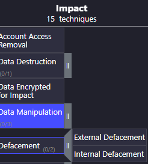
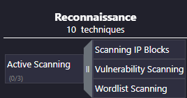
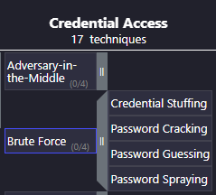

# Documentación

## Índice

1. [Introducción](#1-introducción)
2. [Plan de respuesta](#2-plan-de-respuesta)
3. [Playbooks](#3-playbooks)
4. [Preguntas](#4-preguntas)
5. [Conclusiones](#5-conclusiones)
6. [Bibliografía](#6-bibliografía)

## 1. Introducción

## 2. Plan de respuesta

El siguiente enlace da acceso al Plan de Respuesta a Incidentes desarrollado para Grupo3. Este documento describe los procedimientos y recursos necesarios para gestionar diversos tipos de incidentes de seguridad que puedan afectar a los sistemas, los servicios en la nube o los datos críticos compartidos con los clientes. Su finalidad es asegurar una respuesta rápida, coordinada y debidamente documentada por parte del personal involucrado.

[Plan de respuesta](./Plan_de_respuesta.md)

## 3. Playbooks

Los playbooks disponibles en los siguientes enlaces establecen los pasos a seguir durante las fases de investigación, remediación y comunicación ante incidentes que puedan afectar al Grupo3. Están diseñados para proporcionar instrucciones claras y operativas, adaptadas al entorno técnico de la empresa, los servicios que ofrece y la sensibilidad de los datos que gestiona, con el fin de garantizar una respuesta eficaz ante situaciones específicas.

* [Playbook: Ataque Fuerza Bruta](./playbooks/playbook-bruteforce.md)
* [Playbook: Defacement](./playbooks/playbook-defacement.md)
* [Playbook: Escanéo Activo](./playbooks/playbook-escaneo-activo.md)
* [Playbook: Insider Threats](./playbooks/playbook-insider-threats.md)
* [Playbook: Inyección código](./playbooks/playbook-inyeccion-codigo.md)
* [Playbook: Phising](./playbooks/playbook-phishing.md)
* [Playbook: Rasomware](./playbooks/playbook-ransomware.md)
* [Playbook: Robo Financiero](./playbooks/playbook-robo-financiero.md)

## 4. Preguntas

### 1.a   ¿Que relacción existe entre el trabajo que has hecho con las matrices MITRE ATT&CK y RE&CT y el plan de respuesta que estás planteando? ¿De que manera te ha ayudado el trabajo previo sobre las matrices a la hora de generar el plan? Deja evidencias del trabajo que has realizado sobre le navigator de las matrices, para obtener la información

El plan de respuesta se ha desarrollado tomando como referencia las matrices MITRE ATT&CK y RE&CT, lo que permitió alinear las fases del plan con tácticas y técnicas reales utilizadas por atacantes, y definir acciones de respuesta eficaces.

Contribuciones clave de las matrices:

* Identificación de amenazas relevantes: ATT&CK facilitó el mapeo de TTPs comunes a nuestro entorno (por ejemplo, T1078 – Valid Accounts, T1190 – Exploit Public-Facing Application), lo que ayudó a priorizar escenarios y ajustar medidas preventivas.

* Diseño de playbooks: Se estructuraron playbooks por tipo de incidente, considerando técnicas reales y su detección, facilitando respuestas rápidas y contextualizadas.

* Mitigaciones y contención (RE&CT): La matriz RE&CT orientó la definición de acciones en contención, erradicación y recuperación, reforzando la eficacia de las respuestas en fases críticas.

* Detección basada en fuentes de datos: ATT&CK orientó la configuración del SIEM y EDR con fuentes clave como logs de autenticación, actividad de red y uso de comandos.

Evidencias: Se trabajó con el navegador de ATT&CK para crear capas personalizadas, priorizando técnicas según activos críticos y evaluando la cobertura actual de controles de seguridad.

  

### 1.b   ¿Qué playbooks has identificado como necesarios en este plan de respuesta y en que te has basado para identificar esos playbooks y saber que son los necesarios? Deja algún diagrama que describa el flujo de un playbook

A partir del análisis de riesgos y considerando los activos críticos del Grupo3 (incluyendo el SSP, los datos de vulnerabilidades de clientes, la plataforma de intercambio de informes y la infraestructura de pentesting tanto en Azure como on-premise), se han identificado ocho playbooks prioritarios en función de las amenazas más relevantes para la organización.

**Playbook: Ataques de Fuerza Bruta**
Protege el acceso a servicios críticos como el portal de clientes, cuentas administrativas en Azure, servidores internos y credenciales utilizadas por el equipo de pentesting. Estos accesos son objetivos de alto valor para atacantes externos.

**Playbook: Defacement**
 Un ataque de defacement podría dañar la imagen pública del Grupo3 y afectar la confianza de los clientes en sus servicios. También puede ser un indicio de accesos no autorizados a los servidores web que alojan el área de cliente o sistemas de demostración.

**Playbook: Escaneo Activo**
 La detección de escaneos activos no autorizados en los entornos Azure u on-premise de SSP puede señalar intentos de reconocimiento por parte de atacantes. Actuar rápidamente ante estos eventos ayuda a prevenir intrusiones y compromisos.

**Playbook: Amenaza Interna (Insider Threats)**
 Dado el acceso privilegiado de algunos empleados a información sensible (como informes de vulnerabilidades o configuraciones de infraestructura), una amenaza interna —intencional o no— puede comprometer la confidencialidad e integridad de los datos.

**Playbook: Inyección de Código**
Protege las aplicaciones web del Grupo3, incluyendo las que permiten la entrega y consulta de informes de pentesting. Una vulnerabilidad de este tipo podría usarse para manipular información, acceder a datos sensibles o comprometer sistemas.

**Playbook: Phishing**
 Los empleados de SSP, especialmente aquellos con acceso a sistemas cloud, infraestructura crítica o repositorios de datos de clientes, son blancos habituales del phishing. Este vector puede facilitar el robo de credenciales y la introducción de malware.

**Playbook: Ransomware**
Representa una amenaza crítica para la continuidad del negocio. El cifrado de datos de clientes, informes de vulnerabilidades o servidores utilizados por los pentesters tendría un impacto grave en la operación y en la confianza de los clientes.

**Playbook: Robo Financiero**
 Aunque el foco principal del Grupo3 no es financiero, el acceso indebido a plataformas de facturación, cuentas corporativas o sistemas ERP podría derivar en pérdidas económicas y comprometer información contable y contractual sensible.

Para determinar qué incidentes deben contar con un playbook prioritario, se utilizó la matriz MITRE ATT&CK, una base de conocimiento reconocida globalmente que recopila las tácticas (objetivos del atacante) y técnicas (métodos específicos utilizados) observadas en ataques reales.

Esta metodología permitió identificar amenazas relevantes para el contexto de Grupo3, centrándose en los activos críticos (SSP, datos de clientes, infraestructura cloud y on-premise). A partir de este análisis, se seleccionaron aquellos vectores de ataque más probables y con mayor impacto, garantizando que los playbooks cubran escenarios concretos y realistas de compromiso.

Diagrama de flujo de Inyeccion de código

### 1.c   ¿Como te has asegurado que has cubierto todas las fases del plan de respuesta? ¿Qué fase consideras que está más floja en un plan? ¿Cuál de ellas consideras que está mejor trabajada en tu plan? Asegúrate de hablar de todas las fases y como las cubres

El presente Plan de Respuesta a Incidentes (PRI) del Grupo3. (SSP) abarca de forma estructurada todas las fases establecidas en el marco NIST SP 800-61r2, adaptadas al contexto técnico y operativo de la organización. A continuación, se detalla la cobertura de cada fase:

1. Preparación  
La fase de preparación se materializa en la elaboración de este PRI y sus playbooks asociados. Se han definido claramente roles y responsabilidades clave (Comandante de incidentes, Scribe, Enlace de negocio y Enlace externo), y se dispone de herramientas críticas como:

    * Inventario de activos clasificados por criticidad.

    * Repositorio cifrado de evidencias.

    * Plantillas de informes y playbooks operativos para distintos tipos de incidentes.

    * SIEM y EDR configurados con alertas tempranas y dashboards.

    * Procesos de entrenamiento: ejercicios tipo “tabletop”, simulacros de distribución de IOCs y formación continua.

    Se han establecido canales de comunicación seguros, acuerdos con proveedores clave (como Microsoft para entornos Azure) y procedimientos para garantizar la capacidad de respuesta del equipo ante amenazas complejas.

2. Identificación (Detección y Análisis)  
Esta fase está cubierta a través de las secciones de “Evaluar” e “Investigar” en cada playbook. Se contemplan:

    * Monitorización mediante SIEM, EDR e IPS.

    * Canales de alerta cifrados y mecanismos de reporte por parte de usuarios.

    * Análisis de logs, tráfico, IOCs y artefactos forenses.

    * Determinación de vectores de ataque, alcance e impacto (especialmente en datos sensibles de clientes).

    * Criterios sólidos para la clasificación de eventos como incidentes.

3. Contención  
Abordada en la subfase “Contener” de la sección “Remediar” de los playbooks. Incluye:

    * Aislamiento de sistemas afectados (por VLANs, ACLs o desconexión directa).

    * Bloqueo de cuentas, IPs y dominios maliciosos.

    * Distribución de IOCs y activación de honeypots para estudiar TTPs.

    * Estrategias diferenciadas para entornos cloud (Azure) y on-premise.

4. Erradicación  
Incluida también en “Remediar”. Se detallan pasos para:

    * Eliminación de la causa raíz (malware, cuentas comprometidas, vulnerabilidades).

    * Limpieza del entorno afectado, restauración de configuraciones seguras.

    * Uso de imágenes “golden” y parches críticos.

    * Registro de cadena de custodia y reconstrucción forense del incidente.

5. Recuperación  
Cubierta en la fase “Recuperar” de cada playbook. Se incluyen:

    * Restauración priorizada de sistemas y servicios.

    * Verificación de integridad de datos y aplicaciones restauradas.

    * Reapertura progresiva de accesos bajo monitoreo.

    * Vigilancia activa (“quarantine watch”) y documentación de anomalías posteriores.

6. Actividad Post-Incidente  
Formalizada en la sección de “Ciberresiliencia” y en el proceso de After Action Review (AAR). Involucra:

    * Reunión transversal con todas las áreas implicadas.

    * Evaluación de eficacia de la respuesta, identificación de brechas y oportunidades de mejora.

    * Actualización de playbooks, procedimientos y políticas de escalado.

    * Ejercicios de red teaming, revisiones periódicas y ajustes continuos basados en inteligencia de amenazas.

#### Fase más débil para SSP: Preparación continua y Actividad Post-Incidente

Estas fases suelen ser más difíciles de sostener en el tiempo. Para SSP, su adecuada ejecución es vital, dado que:

* La evolución constante de sus TTPs e infraestructura exige actualizar periódicamente el PRI y los playbooks.

* Los simulacros realistas (compromiso de pentesters, brechas en la plataforma de informes) deben mantenerse vigentes.

* La falta de un análisis post-incidente riguroso podría debilitar la resiliencia organizativa y la confianza del cliente.

#### Fase mejor trabajada para SSP: Identificación y Remediación (Contención + Erradicación)

Estas fases están sólidamente desarrolladas gracias al enfoque técnico de los playbooks y a la experiencia del equipo:

* Investigar: cada playbook contempla pasos claros para análisis forense, interpretación de logs, identificación de IOCs y evaluación de vectores de ataque.

* Remediar: se detallan acciones específicas de contención y erradicación, que aprovechan las capacidades avanzadas del equipo de seguridad y pentesting de SSP.

La estructura operativa centrada en playbooks bien definidos refuerza la respuesta técnica ante incidentes críticos, aportando agilidad, precisión y control.

### 2.a   ¿En que consiste el Flujo de Toma de Decisiones y Escalado de tu plan de respuesta? ¿Existe un plan de comunicación, protocolos, etc? Si la respuesta es correcta, haz un resumen del plan y protocolos. Deja evidencias del flujo, mediante un diagrama

#### Resumen Flujo de toma de decisiones y escalado

Nuestro plan sigue una estructura que empieza con un análisis del impacto y lo seguimos con un árbol de decisiones basado en lo siguiente:

1. ¿Existe riesgo inmediato a vida o continuidad crítica?

1. ¿El impacto económico o regulatorio supera ciertos umbrales?

1. ¿Se requiere apoyo externo?

Esto activa decisiones como:

* Contención agresiva inmediata.

* Escalado al comité ejecutivo.

* Activación del plan de continuidad BC-IM.

* Contratación rápida de especialistas externos (forense, legal, comunicación).

Criterios de escalado incluyen:

* Número de usuarios afectados.

* Volumen de datos sensibles exfiltrados.

* Riesgo regulatorio/legal.

* Exposición mediática.

#### Resumen Flujo del plan de comunicación y protocolos

Esto lo tenemos definido con roles como pueden ser comandante de incidentes, enlace, escriba, etc. Después tenemos canlaes seguros con una notificación cifrada, almacenamiento de evidencias cifradas y un control de acceso. Y seguimos los siguientes protocolos:

* Comunicación inmediata a stakeholders por canal cifrado.

* Información clara a reguladores, clientes y medios, solo si se confirma afectación.

* Participación del área legal y relaciones públicas.

Una vez hecho esto hacemos unas reuniones post-incidentes para documentar, aprender y mejorar continuamente.

#### Diagrama de Flujo para Manejo de Incidente

### 3.a  ¿Como te has asegurado de que tu plan tiene respuestas resilientes? ¿Porque son resilientes y en qué fases se centran?

Perfecto. Para responder adecuadamente a la pregunta **"3.a ¿Cómo te has asegurado de que tu plan tiene respuestas resilientes? ¿Por qué son resilientes y en qué fases se centran?"**, puedes combinar lo que ya contiene tu archivo `plan-de-respuesta.md` con el estilo y enfoque de la respuesta de ejemplo. Aquí tienes una versión adaptada y alineada con ambos:

---

### 3.a ¿Cómo te has asegurado de que tu plan tiene respuestas resilientes? ¿Por qué son resilientes y en qué fases se centran?

Nuestro plan de respuesta incorpora múltiples prácticas diseñadas para asegurar la resiliencia. Estas prácticas permiten anticipar, resistir, recuperarse y adaptarse frente a incidentes de seguridad, garantizando la continuidad operativa y la protección de activos críticos.

**¿Cómo nos aseguramos de que el plan es resiliente?**

* **Preparación estructurada:** Hemos definido roles críticos (comandante de incidentes, scribe, enlaces de negocio y externos) con responsabilidades claras para garantizar coordinación, comunicación y trazabilidad durante toda la respuesta.
* **Playbooks validados:** Disponemos de procedimientos estandarizados para distintos tipos de incidentes (ransomware, phishing, defacement, etc.), que han sido probados en ejercicios periódicos y simulacros realistas.
* **Infraestructura segura y visibilidad continua:** Contamos con herramientas SIEM y EDR configuradas con alertas avanzadas, dashboards y flujos automáticos de respuesta.
* **Ciclo de mejora continua:** Se realizan ejercicios de tabletop trimestrales, red teaming semestral y revisiones periódicas de políticas y umbrales, integrando cada aprendizaje en los playbooks y configuraciones técnicas.

**¿Por qué son resilientes estas respuestas?**

* **No asumimos invulnerabilidad:** Partimos del principio de que los incidentes ocurrirán; el objetivo es minimizar su impacto, especialmente sobre servicios críticos y datos sensibles.
* **Contención y recuperación rápida:** Nuestro plan prioriza la contención inmediata (aislamiento, bloqueo de accesos, desconexión forense) y la restauración controlada desde imágenes “gold” y backups verificados.
* **Protección de evidencia y trazabilidad legal:** El uso de repositorios cifrados, cadena de custodia y registro detallado asegura integridad de evidencia y cumplimiento normativo.
* **Aprendizaje sistemático post-incidente:** Tras cada evento, realizamos una revisión exhaustiva (AAR) con todas las áreas involucradas, definiendo acciones concretas de mejora con responsables y métricas de seguimiento.

**¿En qué fases se centran estas prácticas resilientes?**

* **Preparación:** Definición de roles, simulacros, inventario clasificado, herramientas de detección y respuesta temprana.
* **Identificación y Contención:** Monitorización continua, correlación avanzada, aislamiento rápido y control proactivo de amenazas mediante distribución de IOCs y activación de honeypots.
* **Recuperación:** Restauración priorizada por criticidad, verificación de integridad de datos, supervisión post-incidente y revalidación de accesos.
* **After-action review y mejora continua:** Incorporación de nuevas detecciones basadas en comportamiento, simulaciones ofensivas periódicas y actualización de tácticas de respuesta.

En conjunto, estas acciones garantizan que la resiliencia esté integrada en todo el ciclo de vida del incidente, no solo en la recuperación, sino también en la preparación, respuesta y adaptación posterior.

## 5. Conclusiones

## 6. Bibliografía
