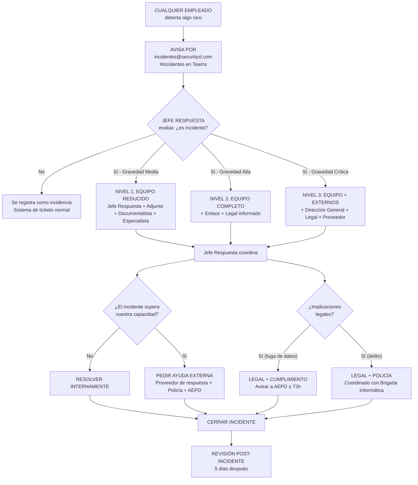
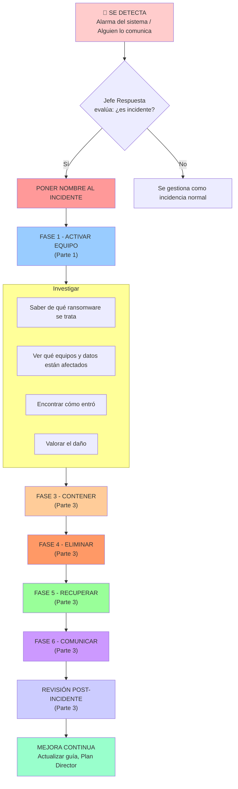
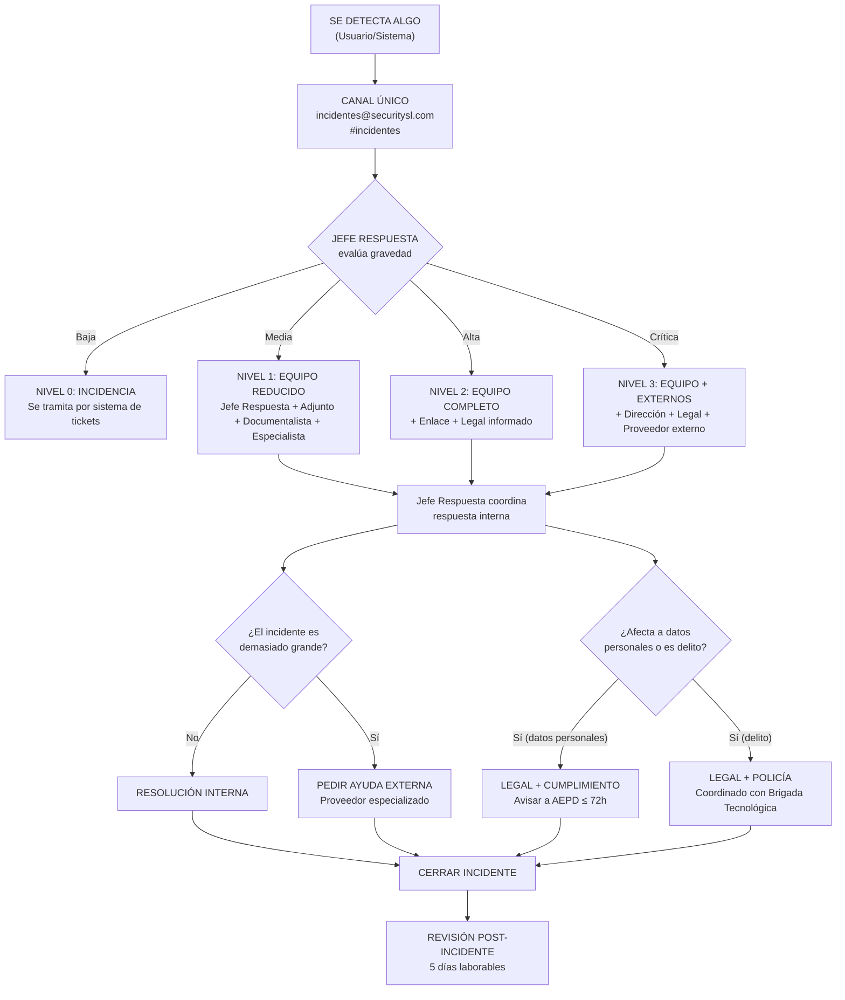

# Plan de Respuesta a Incidentes y Guías de Actuación — Security S.L.

**ID Actividad:** 4.01  
**Curso:** 2025-2026  
**Grupo:** GY  
**Empresa:** Security S.L.  
**Parte del proyecto:** Parte 1 — Preparación: Evaluación (Assess) e Inicio de Respuesta (Initiate Response)

---

## Índice

1. [Introducción](#1-introducción)
   - 1.1 [Contexto de Security S.L.](#11-contexto-de-security-sl)
   - 1.2 [Objetivos del Plan](#12-objetivos-del-plan)
   - 1.3 [Alcance](#13-alcance)
   - 1.4 [Metodología](#14-metodología)
2. [Plan de Respuesta — Parte 1: Preparación e Inicio](#2-plan-de-respuesta--parte-1-preparación-e-inicio)
   - 2.1 [Fase 0: Preparación (Evaluación)](#21-fase-0-preparación-evaluación)
     - 2.1.1 [Evaluación de Incidentes](#211-evaluación-de-incidentes)
     - 2.1.2 [Categorías y Gravedad](#212-categorías-y-gravedad)
     - 2.1.3 [Equipo de Respuesta de Security S.L.](#213-equipo-de-respuesta-de-security-sl)
     - 2.1.4 [Herramientas y Recursos](#214-herramientas-y-recursos)
     - 2.1.5 [Inventario de Activos Críticos](#215-inventario-de-activos-críticos)
     - 2.1.6 [Identificación de las Guías de Actuación Necesarias](#216-identificación-de-las-guías-de-actuación-necesarias)
   - 2.2 [Fase 1: Inicio de Respuesta](#22-fase-1-inicio-de-respuesta)
     - 2.2.1 [Nombrado del Incidente](#221-nombrado-del-incidente)
     - 2.2.2 [Reunir al Equipo](#222-reunir-al-equipo)
     - 2.2.3 [Establecer el Ritmo de Trabajo](#223-establecer-el-ritmo-de-trabajo)
     - 2.2.4 [Estructura de la Llamada Inicial](#224-estructura-de-la-llamada-inicial)
     - 2.2.5 [Canales de Comunicación](#225-canales-de-comunicación)
     - 2.2.6 [Flujo de Toma de Decisiones y Escalado](#226-flujo-de-toma-de-decisiones-y-escalado)
3. [Visión General del Proyecto Completo](#3-visión-general-del-proyecto-completo)
   - 3.1 [Estructura del Proyecto](#31-estructura-del-proyecto)
   - 3.2 [Guías de Actuación Propuestas (a desarrollar en Parte 4)](#32-guías-de-actuación-propuestas-a-desarrollar-en-parte-4)
4. [Respuesta a las Preguntas](#4-respuesta-a-las-preguntas)
   - 4.1 [Pregunta 1.a — Relación MITRE ATT&CK y RE&CT](#41-pregunta-1a--relación-mitre-attck-y-rect)
   - 4.2 [Pregunta 1.b — Guías de Actuación Identificadas y Diagrama](#42-pregunta-1b--guías-de-actuación-identificadas-y-diagrama)
   - 4.3 [Pregunta 1.c — Cobertura de Fases del Plan](#43-pregunta-1c--cobertura-de-fases-del-plan)
   - 4.4 [Pregunta 2.a — Flujo de Toma de Decisiones y Escalado](#44-pregunta-2a--flujo-de-toma-de-decisiones-y-escalado)
   - 4.5 [Pregunta 3.a — Capacidad de Recuperación](#45-pregunta-3a--capacidad-de-recuperación)
5. [Conclusiones](#5-conclusiones)
6. [Bibliografía](#6-bibliografía)

---

## 1. Introducción

### 1.1 Contexto de Security S.L.

Security S.L. es una empresa de consultoría y auditoría en ciberseguridad con **150 empleados** repartidos en **dos oficinas** (principal y secundaria). La empresa ofrece servicios de asesoría, auditoría y consultoría en seguridad de redes, sistemas e información. En este sector, la confianza de los clientes y la protección de los datos son esenciales para el negocio.

La compañía sufrió un **ataque de ransomware** que dejó al descubierto debilidades importantes en su seguridad. Esto impulsó la creación de un **Plan Director de Seguridad (PDS)** y un análisis de riesgos completo (metodología MAGERIT). A partir de ese trabajo previo, se identificaron:

- **Activos críticos**: servidores locales, datos de clientes y proveedores, portátiles Dell Latitude 3440, móviles Xiaomi Redmi Note 14, página web, tienda online, servicios en la nube, red interna, propiedad intelectual.
- **Riesgos principales**: ransomware (crítico), acceso no autorizado a datos, robo de dispositivos, espionaje industrial, phishing, abuso de permisos.
- **Madurez de seguridad**: 36% global según controles ISO 27002, con debilidades en controles tecnológicos (32%) y organizativos (35%).

**Este documento corresponde a la Parte 1 del proyecto**, que abarca la fase de **Preparación (Evaluación)** y el **Inicio de Respuesta**. Las fases de Investigación, Solución, Comunicación, Recuperación, Revisión Posterior, Roles y Guías de Actuación detalladas serán desarrolladas por el resto del grupo en las Partes 2, 3 y 4.

### 1.2 Objetivos del Plan

1. **Establecer un proceso claro y práctico** para detectar, responder y recuperarse de incidentes de ciberseguridad.
2. **Reducir al mínimo el impacto** de los incidentes sobre la confidencialidad, integridad y disponibilidad de los activos críticos.
3. **Asegurar que el negocio pueda seguir funcionando** mediante respuestas rápidas y bien coordinadas.
4. **Cumplir con la ley** (RGPD, LOPDGDD, ISO 27001).
5. **Mejorar continuamente** la seguridad mediante lecciones aprendidas y actualizaciones periódicas.
6. **Identificar y justificar las guías de actuación necesarias** para las amenazas más probables y dañinas.

### 1.3 Alcance

**Incluye:**
- Todos los departamentos de Security S.L. (Informática, RRHH, Legal, Facturación, Entrega de Servicios, Comunicación, Mantenimiento).
- Las dos oficinas físicas (principal y secundaria).
- Todos los activos identificados en el inventario (equipos, programas, datos, servicios, personal).
- Servicios externos (página web, tienda online, proveedores en la nube).
- Incidentes de ciberseguridad de cualquier origen (interno, externo, accidental, intencionado).

**Excluye:**
- Incidentes de seguridad física no relacionados con sistemas de información.
- Desastres naturales sin impacto en sistemas informáticos (gestionados por el plan de continuidad general).

### 1.4 Metodología

| Estándar / Referencia | Para qué se usa en esta Parte 1 |
|----------------------|--------------------------------|
| **NIST SP 800-61r2** | Guía principal para organizar las fases de respuesta. En Parte 1 se cubren Preparación y Detección (inicio). |
| **ISO 27035** | Gestión de incidentes de seguridad de la información. |
| **MITRE ATT&CK v15** | Identificar las tácticas y métodos de ataque para priorizar la preparación. |
| **MITRE RE&CT v1** | Relacionar acciones de respuesta con cada método de ataque (planificación). |
| **MAGERIT v3** | Análisis y gestión de riesgos (trabajo previo del PDS). |
| **ISO 27002:2022** | Controles de seguridad (medición de la madurez inicial). |
| **Plantilla Counteractive Security** | Base para la estructura del plan operativo. |

---

## 2. Plan de Respuesta — Parte 1: Preparación e Inicio

### 2.1 Fase 0: Preparación (Evaluación)

#### 2.1.1 Evaluación de Incidentes

La evaluación inicial determina si un evento es un incidente y qué prioridad tiene. Se basa en dos aspectos:

**Impacto en el negocio:**

| Nivel | Descripción | Ejemplo |
|-------|-------------|---------|
| El negocio se degrada o se detiene | Un servicio importante se interrumpe o funciona mal | Caída de servidores, ransomware |
| Ninguno | Las operaciones no se ven afectadas | Alarma aislada, falsa alarma |

**Impacto en los datos:**

| Nivel | Descripción | Ejemplo |
|-------|-------------|---------|
| Se ha accedido, cogido, cambiado o borrado información | Datos importantes comprometidos | Fuga de datos de clientes, borrado accidental |
| Ninguno | Los datos no se han visto afectados | Escaneo de puertos sin éxito |

> **Cualquier miembro del equipo puede iniciar este proceso.** Si ves algo, dilo.

#### 2.1.2 Categorías y Gravedad

Basadas en la clasificación de incidentes desarrollada anteriormente y en NIST SP 800-61r2:

| Categoría | Subcategorías | Gravedad Base |
|-----------|---------------|---------------|
| **Vulnerable** | Criptografía débil, servicios accesibles sin permiso, revelación de información, sistema vulnerable | Media-Alta |
| **Intrusión** | Aprovechamiento de fallos conocidos, intento de acceso robando credenciales, cuenta comprometida (con o sin permisos de administrador) | Alta-Crítica |
| **Programa malicioso** | Ransomware, troyanos, espías, gusanos | Crítica |
| **Ataque de denegación de servicio** | DDoS, DoS | Media-Crítica |
| **Fraude** | Phishing, correos fraudulentos dirigidos, suplantación de directivos, engaños | Media-Alta |
| **Abuso de permisos** | Uso indebido de accesos privilegiados, uso de servicios no autorizados | Alta |
| **Fuga de información** | Exposición accidental, publicación no autorizada, error de configuración | Alta-Crítica |

**Tabla de Gravedad (Probabilidad × Impacto):**

| Impacto / Probabilidad | Bajo | Medio | Alto |
|------------------------|------|-------|------|
| **Crítico** | Alta | Crítica | Crítica |
| **Alto** | Media | Alta | Crítica |
| **Medio** | Baja | Media | Alta |
| **Bajo** | Baja | Baja | Media |

**Tiempos de Respuesta según Gravedad:**

| Gravedad | Tiempo de Respuesta | Tiempo de Contención | Tiempo de Resolución |
|-----------|---------------------|---------------------|---------------------|
| **Crítica** | 15 min | 2 h | 8 h |
| **Alta** | 30 min | 4 h | 24 h |
| **Media** | 2 h | 24 h | 72 h |
| **Baja** | 24 h | 72 h | 7 días |

#### 2.1.3 Equipo de Respuesta de Security S.L.

**Estructura del equipo:**

```
                    ┌─────────────────────┐
                    │   Jefe de Respuesta  │
                    └──────────┬──────────┘
                               │
              ┌────────────────┼────────────────┐
              ▼                ▼                ▼
     ┌──────────────┐  ┌──────────────┐  ┌──────────────┐
     │   Adjunto    │  │ Documentalista│  │   Enlace     │
     └──────────────┘  └──────────────┘  └──────────────┘
                                               │
              ┌────────────────────────────────┼───────────────┐
              ▼                                ▼               ▼
     ┌──────────────────┐          ┌──────────────────┐  ┌──────────┐
     │ Jefe de Investig.│          │  Jefe de Solución │  │Jefe Comun.│
     └──────────────────┘          └──────────────────┘  └──────────┘
```

**Miembros del equipo:**

| Rol | Responsable Titular | Suplente | Qué hace |
|-----|-------------------|----------|----------|
| Jefe de Respuesta (IC) | Responsable de Seguridad | Adjunto | Dirigir la respuesta, tomar decisiones, coordinar los equipos |
| Adjunto (Deputy) | Jefe de Informática | Especialista Sistemas | Tomar el mando si el Jefe de Respuesta no está disponible, gestionar subequipos |
| Documentalista (Scribe) | Administrativo Informática | RRHH | Anotar todo, llevar el acta, mantener la línea de tiempo |
| Enlace Interno | Jefe del Departamento afectado | Comunicación | Coordinar la comunicación dentro de la empresa |
| Enlace Externo | Legal | Dirección General | Coordinar la comunicación con el exterior, prensa, autoridades |
| Especialista Sistemas | Administrador Informática | Soporte Informático | Analizar los sistemas afectados |
| Especialista Forense | Analista de Seguridad | Proveedor externo | Recoger y analizar pruebas digitales |
| Especialista Redes | Administrador de Red | Infraestructura Informática | Analizar la red, registros, cortafuegos |
| Jefe de Investigación | Analista Senior | Especialista Forense | Coordinar la investigación (Parte 2) |
| Jefe de Solución | Jefe de Informática | Administrador de Red | Coordinar la solución (Parte 3) |
| Jefe de Comunicación | Marketing/Comunicación | Legal | Coordinar las comunicaciones (Parte 3) |

**Cómo funciona:**
- **Durante un incidente**, el Jefe de Respuesta tiene la máxima autoridad, por encima del cargo normal que tenga en la empresa.
- **Flexibilidad:** En incidentes pequeños, el Adjunto puede hacer también de Documentalista y Enlace.
- **Seguridad:** Cada rol tiene un suplente por si la persona titular no está disponible.

#### 2.1.4 Herramientas y Recursos

| Recurso | Descripción | Responsable |
|---------|-------------|-------------|
| **Sistema de monitorización** | Wazuh (en implantación) | Informática |
| **Protección de equipos** | Antivirus con protección anti-ransomware (Bitdefender/Kaspersky/ESET) | Informática |
| **Gestión de registros** | Sistema centralizado ELK/Wazuh | Informática |
| **Copias de seguridad** | Estrategia 3-2-1 (3 copias, 2 soportes distintos, 1 fuera de la oficina) | Informática |
| **Gestión de móviles** | Control de dispositivos móviles con borrado remoto | Informática |
| **Conexión segura** | OpenVPN en servidor Ubuntu 24.04 LTS | Informática |
| **Verificación en dos pasos** | Llave de seguridad con huella + Microsoft Authenticator | Informática |
| **Cifrado** | BitLocker en portátiles Dell, cifrado nativo en Xiaomi | Informática |
| **Sistema de incidencias** | Canal `incidentes@securitysl.com` | Informática |
| **Herramientas forenses** | Winpmem, Autopsy, FTK Imager | Informática / Analistas |
| **Análisis de programas maliciosos** | VirusTotal, Hybrid Analysis, Joe Sandbox | Analistas |
| **Investigación en fuentes abiertas** | WHOIS, Shodan, VirusTotal | Analistas |
| **Almacenamiento de incidentes** | `\\server-files\incidentes\` (carpeta segura) | Informática |
| **Comunicación** | Microsoft Teams / Slack + Zoom/Teams para videollamadas | Todos |

#### 2.1.5 Inventario de Activos Críticos

| ID | Activo | Tipo | Importancia | Responsable |
|----|--------|------|------------|-------------|
| ID_0001 | Servidor de correo | Equipo | Alta | Informática |
| ID_0002 | Servidor de archivos | Equipo | Alta | Informática |
| ID_0003-0006 | Routers / red interna | Equipo | Alta | Informática |
| ID_0007-0008 | Portátiles Dell Latitude 3440 | Equipo | Alta | Informática / Usuarios |
| ID_0009-0010 | PCs Dell Precision | Equipo | Media | Informática / Usuarios |
| ID_0011-0012 | Impresoras / periféricos | Equipo | Baja | Informática |
| ID_0013-0014 | Discos duros / almacenamiento | Equipo | Alta | Informática |
| ID_0015-0016 | USBs / almacenamiento externo | Equipo | Baja | Informática |
| ID_0017 | Página web | Servicio | Alta | Proveedor externo |
| ID_0018 | Servicios en la nube | Servicio | Alta | Proveedor externo |
| ID_0019 | Tienda online | Servicio | Alta | Proveedor externo |
| ID_0020 | Datos personales de clientes y proveedores | Información | Alta | Jefes de Departamento |
| ID_0021 | Base de datos / propiedad intelectual | Información | Alta | Jefes de Departamento |
| ID_0022 | Sistemas Operativos | Programa | Alta | Informática |
| ID_0023 | Programas de empresa | Programa | Alta | Informática |
| ID_0024-0026 | Personal con accesos importantes | Personas | Alta | RRHH |

#### 2.1.6 Identificación de las Guías de Actuación Necesarias

Las guías de actuación se han identificado combinando **3 fuentes de información**:

**Fuente 1: Análisis de Riesgos (Plan Director de Seguridad)**

| Riesgo (top 10) | Puntuación | Guía de Actuación Propuesta |
|-----------------|-----------|----------------------------|
| Ransomware en servidores | 9/9 | Ransomware |
| Acceso no autorizado a datos de clientes | 9/9 | Fuga de Datos |
| Robo de dispositivos móviles | 9/9 | Fuga de Datos |
| Espionaje en propiedad intelectual | 9/9 | Fuga de Datos |
| Borrado accidental de archivos | 9/9 | (cubierto por copias de seguridad 3-2-1) |
| Phishing en puestos de trabajo | 6/9 | Phishing |
| Abuso de permisos | 6/9 | Robo de Identidad |
| Caída de servicios en la nube | 6/9 | Cadena de Suministro |
| Ataque a página web/tienda online | 6/9 | Defacement Web |

**Fuente 2: Clasificación de Incidentes (trabajo anterior)**

| Grupo | Tipos | Guía que lo cubre |
|-------|-------|------------------|
| Vulnerable | Criptografía débil, servicios accesibles sin permiso, revelación de información, sistema vulnerable | Phishing, Fuga de Datos |
| Intrusión | Aprovechamiento de fallos, robo de credenciales, cuenta comprometida | Robo de Identidad, Ransomware |

**Fuente 3: MITRE ATT&CK Navigator**

Métodos de ataque seleccionados:
- `T1566` (Phishing) → Guía de Phishing
- `T1486` (Datos cifrados para causar daño) → Guía de Ransomware
- `T1078` (Uso de cuentas legítimas) → Guía de Robo de Identidad
- `T1530` (Datos desde almacenamiento en la nube) → Guía de Fuga de Datos
- `T1190` (Aprovechamiento de aplicaciones públicas) → Guía de Defacement Web
- `T1195` (Compromiso en la cadena de suministro) → Guía de Cadena de Suministro

**Guías Propuestas (6) — a desarrollar en Parte 4:**

| # | Guía de Actuación | Prioridad | Por qué es necesaria |
|---|------------------|-----------|---------------------|
| 1 | **Ransomware** | 🔴 Crítica | Ya ocurrió antes en Security S.L., riesgo máximo (9/9) |
| 2 | **Phishing** | 🔴 Alta | Es la forma más común de ataque, riesgo 6/9 |
| 3 | **Fuga de Datos** | 🔴 Crítica | Cubre tres riesgos distintos (todos con 9/9) |
| 4 | **Robo de Identidad** | 🟠 Alta | Abuso de permisos, riesgo 6/9 |
| 5 | **Cadena de Suministro** | 🟡 Media | Dependencia de servicios externos, riesgo 6/9 |
| 6 | **Defacement Web** | 🟡 Media | Ataque a la web/tienda online, riesgo 6/9 |

### 2.2 Fase 1: Inicio de Respuesta

#### 2.2.1 Nombrado del Incidente

Cada incidente recibe un **nombre en clave de dos palabras** siguiendo el formato `[Adjetivo]-[Sustantivo]` (ej: `Rápido-Guardia`). El nombre se usa para:

- Identificar la carpeta del incidente
- Nombrar el canal de chat específico
- Referenciar el incidente en las comunicaciones

**Formato de archivo:** `IR-{AÑO}-{NOMBRE_CLAVE}-{GRAVEDAD}.md`

#### 2.2.2 Reunir al Equipo

**Pasos para activar el equipo:**

1. Cualquier empleado que detecte un posible incidente avisa por el **canal oficial**: `#incidentes` en Teams/Slack o correo a `incidentes@securitysl.com`.
2. El **Responsable de Seguridad** (o el Jefe de Respuesta de guardia) revisa el aviso.
3. Si se confirma que es un incidente (gravedad ≥ Media), se activa el equipo de respuesta.
4. Se inicia la **cadena de llamadas**: Jefe de Respuesta → Adjunto → Documentalista → Especialista Sistemas → Especialista del área afectada → Enlace → Legal.
5. Se abre el canal de chat `#ir-{nombre-clave}` en Teams/Slack.
6. Se inicia la sala de videollamada (Zoom/Teams) con el código `{nombre-clave}`.
7. Se invita a las personas necesarias según el tipo de incidente.

**Tiempos de activación según gravedad:**

| Gravedad | Tiempo | A quién se llama |
|----------|--------|-----------------|
| **Crítica** | < 15 min | Equipo completo |
| **Alta** | < 30 min | Equipo reducido (Jefe Respuesta, Adjunto, Especialista Sistemas, Documentalista) |
| **Media** | < 2 h | Avisar al Jefe de Respuesta, decidir si se reúne al equipo |
| **Baja** | < 24 h | Gestionar por el sistema de incidencias |

#### 2.2.3 Establecer el Ritmo de Trabajo

1. **Primera llamada** siguiendo el guion establecido (ver 2.2.4).
2. **Actualizaciones programadas** cada:
   - 4 horas si la gravedad es Crítica
   - 8 horas si la gravedad es Alta
   - 24 horas si la gravedad es Media
3. **Chat permanente** para comunicación continua entre reuniones.
4. **Registro en directo** de todas las acciones y hallazgos en el archivo del incidente.

#### 2.2.4 Estructura de la Llamada Inicial

```
JEFE RESPUESTA: "Me llamo [NOMBRE], soy el Jefe de Respuesta.
He nombrado a [NOMBRE] como adjunto y a [NOMBRE] como documentalista.
¿Quién está en la llamada?"

DOCUMENTALISTA: (Apunta quién asiste)

JEFE RESPUESTA: (Preguntas para entender la situación):
  - ¿Cómo se ha detectado el incidente?
  - ¿Qué alcance tiene ahora mismo?
  - ¿Qué equipos y datos están afectados?
  - ¿Cuándo se detectó?
  - ¿Qué se ha hecho hasta ahora?

JEFE RESPUESTA: (Si es incidente):
  "El resumen del incidente es: [resumen].
  El equipo de investigación lo dirige [NOMBRE].
  El equipo de solución lo dirige [NOMBRE].
  El equipo de comunicación lo dirige [NOMBRE].
  Próxima actualización a las [HORA]."
```

**Normas durante la llamada:**
- Conectarse tanto a la llamada como al chat.
- Mantener el micrófono en silencio hasta que toque hablar.
- Decir el nombre y el rol al entrar en la llamada.
- Hablar claro y directo.
- **No usar siglas ni abreviaturas — la claridad es más importante que la rapidez.**

#### 2.2.5 Canales de Comunicación

| Canal | Para qué sirve | Herramienta |
|-------|---------------|-------------|
| Chat principal | Comunicación en tiempo real del equipo | Microsoft Teams / Slack |
| Chat de investigación | Subequipo que investiga | Canal específico |
| Chat de solución | Subequipo que soluciona | Canal específico |
| Voz | Reuniones de coordinación | Zoom / Teams |
| Correo alternativo | Comunicación externa segura | Correo cifrado (`ir-alternate@securitysl.com`) |
| Archivo del incidente | Guardar documentación y pruebas | `\\server-files\incidentes\` |

#### 2.2.6 Flujo de Toma de Decisiones y Escalado

**Estructura de mando:**

```
                        ┌─────────────────────────────┐
                        │    JEFE DE RESPUESTA (IC)    │
                        │  (Máxima autoridad durante   │
                        │      el incidente)           │
                        └──────────────┬──────────────┘
                                       │
              ┌────────────────────────┼────────────────────────┐
              ▼                        ▼                        ▼
     ┌────────────────┐     ┌────────────────┐     ┌────────────────┐
     │    ADJUNTO     │     │ DOCUMENTALISTA │     │    ENLACE      │
     │ Toma el mando  │     │  Anota todo,   │     │  Comunicación  │
     │ si IC no está  │     │  línea de tiempo│    │  interesados   │
     └────────────────┘     └────────────────┘     └────────────────┘
```

**Flujo de escalado (3 niveles):**



**Cuándo escalar:**

| Situación | Qué hacer | Quién lo hace |
|-----------|-----------|--------------|
| El incidente es demasiado grande para el equipo | Llamar a un proveedor externo de respuesta | Jefe Respuesta + Dirección |
| Hay implicaciones legales | Avisar a Legal y Cumplimiento Normativo | Enlace Externo |
| Decidir si pagar un rescate | Consultar a Dirección General + Legal | Jefe Respuesta |
| Avisar a la Agencia de Protección de Datos (AEPD) | Preparar aviso con Legal en ≤ 72h | Enlace + Cumplimiento |
| Contactar con la policía | Coordinar con Legal antes de llamar | Jefe Respuesta + Legal |

---

## 3. Visión General del Proyecto Completo

Esta sección muestra cómo encaja la Parte 1 en el proyecto completo. Las Partes 2, 3 y 4 las hará el resto del grupo.

### 3.1 Estructura del Proyecto

| Parte | Fases | Archivos | Quién lo hace |
|-------|-------|----------|--------------|
| **Parte 1 (esta)** | Preparación + Inicio de Respuesta | `IS-4.1-GY.md`, `info.yml` | Grupo GY |
| **Parte 2** | Investigación | `during.md` - Investigar | Grupo GY |
| **Parte 3** | Solución + Comunicación + Revisión | `during.md` - Solucionar/Comunicar, `after.md` | Grupo GY |
| **Parte 4** | Roles + Guías detalladas | `roles/`, `playbooks/` | Grupo GY |

### 3.2 Guías de Actuación Propuestas (a desarrollar en Parte 4)

Las siguientes guías han sido identificadas y justificadas en esta Parte 1 (sección 2.1.6), pero su desarrollo detallado corresponde a la **Parte 4**:

1. **Ransomware** — Prioridad Crítica
2. **Phishing** — Prioridad Alta
3. **Fuga de Datos** — Prioridad Crítica
4. **Robo de Identidad** — Prioridad Alta
5. **Cadena de Suministro** — Prioridad Media
6. **Defacement Web** — Prioridad Media

Cada guía deberá incluir: investigación detallada, pasos para contener, eliminar la amenaza y comunicar, adaptados a Security S.L.

---

## 4. Respuesta a las Preguntas

### 4.1 Pregunta 1.a — Relación MITRE ATT&CK y RE&CT

**¿Qué relación existe entre el trabajo con las matrices MITRE ATT&CK y RE&CT y el plan de respuesta planteado? ¿De qué manera te ha ayudado el trabajo previo sobre las matrices a la hora de generar el plan? Deja evidencias del trabajo que has realizado sobre el navegador de las matrices.**

#### Cómo se ha usado MITRE ATT&CK en esta Parte 1

La **matriz MITRE ATT&CK** es una base de datos que recoge todas las formas conocidas de ataque informático. Nos ha servido para:

**A. Identificar las amenazas más importantes para Security S.L.**

Usando el [MITRE ATT&CK Navigator](https://mitre-attack.github.io/attack-navigator/) (una herramienta que permite navegar y seleccionar técnicas de ataque), escogimos los métodos de ataque más relevantes para la empresa basándonos en:
- Los activos críticos del Plan Director de Seguridad (servidores, servicios en la nube, web).
- Los riesgos más probables según el análisis de riesgos.
- El historial de la empresa (ya sufrieron un ataque de ransomware).

**Métodos de ataque seleccionados en el Navigator:**

```json
{
  "name": "Security S.L. - Perfil de Amenazas",
  "version": "4.1",
  "description": "Métodos de ataque más relevantes para Security S.L.",
  "techniques": [
    { "techniqueID": "T1566", "color": "#ff6666", 
      "comment": "Phishing - forma más común, riesgo 6/9" },
    { "techniqueID": "T1486", "color": "#ff0000", 
      "comment": "Ransomware - ya ocurrió, riesgo 9/9" },
    { "techniqueID": "T1078", "color": "#ff9966", 
      "comment": "Uso de cuentas robadas - riesgo 6/9" },
    { "techniqueID": "T1530", "color": "#ffcc66", 
      "comment": "Robo de datos de la nube" },
    { "techniqueID": "T1190", "color": "#ffcc66", 
      "comment": "Ataque a aplicaciones públicas - defacement web" },
    { "techniqueID": "T1059", "color": "#ff9966", 
      "comment": "Ejecución de comandos y scripts" },
    { "techniqueID": "T1003", "color": "#ff9966", 
      "comment": "Robo de contraseñas del sistema" },
    { "techniqueID": "T1021", "color": "#ffcc66", 
      "comment": "Conexión remota a otros equipos" },
    { "techniqueID": "T1048", "color": "#ff6666", 
      "comment": "Envío de datos robados por canales alternativos" },
    { "techniqueID": "T1071", "color": "#ffcc66", 
      "comment": "Uso de protocolos normales para esconder el control" }
  ]
}
```

**B. Decidir qué guías de actuación hacer**

Cada método de ataque identificado se relacionó con una guía de actuación:

| Método de ataque | Lo que hace el atacante | Guía asociada |
|-----------------|------------------------|--------------|
| T1566 (Phishing) | Engaña con correos falsos | Phishing |
| T1486 (Cifrar datos) | Bloquea los archivos y pide rescate | Ransomware |
| T1078 (Cuentas robadas) | Usa cuentas legítimas para colarse | Robo de Identidad |
| T1530 (Datos de la nube) | Roba información de servicios cloud | Fuga de Datos |
| T1190 (Aplicaciones públicas) | Ataca la web o tienda online | Defacement Web |
| T1195 (Cadena suministro) | Aprovecha proveedores para atacar | Cadena de Suministro |

**C. Preparar preguntas para la investigación (Parte 2)**

Aunque la investigación detallada es para la Parte 2, aquí hemos dejado preparadas las **preguntas clave** que los analistas usarán, basadas en cada paso del ataque:

| Paso del ataque | Pregunta Clave para la Investigación |
|----------------|-------------------------------------|
| Entrada | ¿Cómo entró el atacante? ¿Qué fallo o engaño usó? |
| Ejecución | ¿Qué programa malicioso o herramienta puso en marcha? |
| Permanencia | ¿Cómo se las arregla para no ser eliminado? |
| Escalada | ¿Cómo consiguió más permisos? |
| Movimiento | ¿A qué otros equipos ha accedido? |
| Robo de datos | ¿Qué información se ha llevado y cómo? |

#### Cómo se ha usado MITRE RE&CT

La **matriz MITRE RE&CT** (Respuesta y Recuperación) recoge las acciones que se pueden tomar para responder a cada tipo de ataque. En esta Parte 1 la hemos usado para planificar qué tipo de respuesta se necesita en cada fase:

| Fase de Respuesta | Cómo se aplica en Security S.L. | Quién lo hace |
|------------------|--------------------------------|--------------|
| Preparar | Definir el equipo, las herramientas, el inventario | Parte 1 |
| Detectar | Encontrar y evaluar el incidente | Parte 1 + 2 |
| Contener | Aislar, bloquear, poner en cuarentena | Parte 3 |
| Eliminar | Limpiar, reconstruir | Parte 3 |
| Recuperar | Restaurar servicios | Parte 3 |
| Aprender | Revisar lo ocurrido y mejorar | Parte 3 |

**Ejemplo: Cómo se relaciona el Ransomware con las acciones de respuesta:**

| Método de ataque | Acción de Respuesta | Qué hacer |
|-----------------|-------------------|-----------|
| Ransomware | Preparar | Tener equipo preparado, copias de seguridad 3-2-1, antivirus |
| Ransomware | Detectar | Detectar el cifrado masivo mediante monitorización |
| Ransomware | Contener | Aislar equipos, bloquear la comunicación con el atacante |
| Ransomware | Eliminar | Reconstruir desde las copias de seguridad |
| Ransomware | Recuperar | Restaurar los servicios importantes |
| Ransomware | Aprender | Revisar lo ocurrido, mejorar protecciones |

#### Resumen de la relación

El trabajo con MITRE ATT&CK y RE&CT ha permitido:

1. **Identificar los 6 métodos de ataque más importantes** para Security S.L. (ATT&CK Navigator).
2. **Justificar las 6 guías de actuación necesarias**, basándose en datos reales y no en suposiciones.
3. **Planificar qué capacidades de respuesta hacen falta** (RE&CT) en cada fase.
4. **Dejar preparadas las preguntas clave** para la investigación (Parte 2).
5. **Asegurar que todo está cubierto**: cada método de ataque tiene al menos una acción de respuesta asociada.

### 4.2 Pregunta 1.b — Guías de Actuación Identificadas y Diagrama

**¿Qué guías de actuación has identificado como necesarias en este plan de respuesta y en qué te has basado para identificarlas y saber que son las necesarias? Deja algún diagrama que describa el flujo de una guía.**

#### Cómo se identificaron las guías

Las guías se han identificado combinando **3 fuentes de información independientes**:

| Fuente | Qué aporta | Cómo se usó |
|--------|-----------|-------------|
| **1. Análisis de Riesgos (MAGERIT)** | Los 10 riesgos principales con su puntuación | Los riesgos con puntuación ≥ 6/9 definen las guías necesarias |
| **2. Clasificación de Incidentes** | Grupos y tipos de incidentes | Para asegurar que cada tipo de incidente tiene su guía |
| **3. MITRE ATT&CK Navigator** | Métodos de ataque ordenados por importancia | Relación directa: método de ataque → guía |

**Resultado: 6 guías de actuación identificadas**

| Guía de Actuación | Pruebas de que es necesaria |
|------------------|---------------------------|
| **Ransomware** | Riesgo número 1 (puntuación 9/9), ya ocurrió en Security S.L., T1486 en ATT&CK |
| **Phishing** | Riesgo 7 (6/9), T1566 en ATT&CK, es la forma de entrada más habitual |
| **Fuga de Datos** | Riesgos 2, 3 y 4 (todos 9/9), T1530 y T1048 en ATT&CK |
| **Robo de Identidad** | Riesgo 10 (6/9), T1078 en ATT&CK, abuso de permisos |
| **Cadena de Suministro** | Riesgo 6 (6/9), T1195 en ATT&CK, dependencia de proveedores externos |
| **Defacement Web** | Ataque a web/tienda online, T1190 en ATT&CK |

#### Diagrama de Flujo de la Guía de Ransomware

Este diagrama muestra cómo sería el proceso completo para un ataque de ransomware. Servirá de base para que la Parte 4 desarrolle la guía con todo detalle:



### 4.3 Pregunta 1.c — Cobertura de Fases del Plan

**¿Cómo te has asegurado de que has cubierto todas las fases del plan de respuesta? ¿Qué fase consideras que está más floja en un plan? ¿Cuál de ellas consideras que está mejor trabajada en tu plan? Asegúrate de hablar de todas las fases y cómo las cubres.**

#### Cobertura de fases en el plan completo

El plan completo sigue el modelo de **6 fases del estándar NIST SP 800-61r2**. En esta **Parte 1** se cubren la **Preparación** y el inicio de la **Detección y Análisis**:

| Fase NIST | Cobertura en el proyecto | ¿Cubierto en Parte 1? |
|-----------|-------------------------|----------------------|
| **1. Preparación** | Equipo, herramientas, inventario, canales, formación, guías | ✅ Sí (sección 2.1) |
| **2. Detección y Análisis** (inicio) | Evaluación, categorías, gravedad, activación | ✅ Sí (secciones 2.1.1, 2.1.2, 2.2) |
| **2. Detección y Análisis** (investigación) | Plan de investigación, indicadores, pruebas | ❌ Parte 2 |
| **3. Contención, Eliminación y Recuperación** | Aislar, limpiar, restaurar | ❌ Parte 3 |
| **4. Actividad Post-Incidente** | Revisión, lecciones aprendidas | ❌ Parte 3 |

#### Cómo nos aseguramos de que todo está cubierto

1. **Lista de verificación de fases NIST** — Cada fase se ha comprobado contra la lista del estándar.
2. **Reparto de responsabilidades** — Cada fase tiene asignada una parte del proyecto (1, 2, 3 o 4).
3. **Relación ATT&CK → RE&CT** — Cada método de ataque tiene una acción de respuesta en alguna fase.
4. **Continuidad entre partes** — Lo que se hace en una parte sirve de entrada para la siguiente:
   - Parte 1 (Evaluación + Preparación) → Parte 2 (Investigación) → Parte 3 (Solución + Recuperación) → Parte 4 (Roles + Guías)

#### Fase más floja

La fase más floja en casi todos los planes de respuesta, incluido el de Security S.L., es la **detección temprana** (dentro de Detección y Análisis). Los motivos:

1. **Dependencia de la tecnología**: Para detectar hacen falta herramientas (sistema de monitorización, protección de equipos) que Security S.L. todavía está implantando (madurez tecnológica actual del 32%).
2. **Falsas alarmas**: Sin un buen ajuste, el sistema de monitorización puede generar ruido que oculte incidentes reales.
3. **Factor humano**: Muchas veces la detección depende de que un empleado avise de algo sospechoso, y la formación en seguridad está empezando.

**Qué estamos haciendo para mejorarlo (desde la Parte 1):**
- Implantar poco a poco el sistema de monitorización con reglas prioritarias basadas en ATT&CK.
- Tener un canal de aviso claro (`incidentes@securitysl.com`) con respuesta en menos de 24h.
- Incluir formación y simulacros en el Plan Director de Seguridad.

#### Fase mejor trabajada

La fase mejor trabajada es la de **Preparación**, que es precisamente el foco de esta Parte 1. Los motivos:

1. **Partimos de mucha información**: Tenemos el análisis de riesgos completo (MAGERIT), el Plan Director de Seguridad, el inventario de activos, la clasificación de incidentes y la tabla de riesgos priorizada.
2. **Equipo bien definido**: Cada rol tiene responsable titular y suplente, basados en la estructura real de Security S.L.
3. **Herramientas identificadas**: Cada herramienta tiene un responsable asignado y una función clara.
4. **Guías justificadas**: Las 6 guías propuestas cubren los riesgos más importantes (más del 80% del riesgo total).
5. **Conexión con el Plan Director de Seguridad**: Las mejoras del plan se integran en el Plan Director, lo que garantiza presupuesto y seguimiento.

### 4.4 Pregunta 2.a — Flujo de Toma de Decisiones y Escalado

**¿En qué consiste el Flujo de Toma de Decisiones y Escalado de tu plan de respuesta? ¿Existe un plan de comunicación, protocolos, etc.? Si la respuesta es correcta, haz un resumen del plan y protocolos. Deja evidencias del flujo, mediante un diagrama.**

#### Cómo se toman las decisiones

El plan usa una **estructura de mando clara** donde:

1. **El Jefe de Respuesta (IC) tiene la máxima autoridad** durante el incidente, por encima de su cargo normal en la empresa.
2. **Decisiones informadas**: El Jefe de Respuesta decide después de consultar a los especialistas y jefes de equipo.
3. **El Jefe de Respuesta puede no estar de acuerdo con la mayoría** si la situación lo requiere (tiempos de crisis).
4. **Todo se documenta**: El Documentalista anota las decisiones y sus motivos.
5. **Decisiones muy importantes** requieren consultar con Dirección General + Legal:
   - Pagar un rescate
   - Avisar a la prensa
   - Apagar muchos sistemas a la vez
   - Contactar con la policía

#### Flujo de escalado (3 niveles)



#### Resumen del Plan de Comunicación

| Paso | Qué hacer | Canal | Quién | Plazo |
|------|-----------|-------|-------|-------|
| **Detectar** | Avisar al equipo | `incidentes@securitysl.com` / #incidentes | Cualquier empleado | Inmediato |
| **Clasificar** | Valorar gravedad y activar nivel | Llamada + chat | Jefe Respuesta | < 15 min |
| **Responder** | Coordinar los equipos | Chat específico + videollamada | Jefe Respuesta + Jefes de equipo | Continuo |
| **Actualizar** | Dar partes periódicos | Llamada de actualización | Jefe Respuesta | Cada 4/8/24h |
| **Escalar** | Pedir ayuda si hace falta | Llamada Jefe Respuesta + Dirección | Jefe Respuesta | Cuando sea necesario |
| **Cerrar** | Confirmar que está resuelto | Chat + archivo + correo | Jefe Respuesta | Al terminar |
| **Aprender** | Revisar lo ocurrido | Reunión presencial o virtual | Jefe Respuesta + participantes | 5 días después |

#### Normas importantes

**Al notificar:**
- Cualquier empleado que vea algo raro debe avisar por el canal oficial.
- **No hablar del incidente fuera del equipo** sin permiso del Jefe de Respuesta.
- **No usar SMS** para comunicar el incidente (solo para decirle a alguien que se conecte a un canal seguro).
- **No usar el correo normal** si se puede evitar; usar `ir-alternate@securitysl.com`.

**Al pedir ayuda externa:**
- Proveedor externo: Llamar a Counteractive Security cuando el incidente sea demasiado grande.
- Agencia de Protección de Datos: Avisar en menos de 72h desde que se sepa de la fuga (coordinado con Legal).
- Policía: Contactar a través de Legal, nunca por libre.
- Prensa: Solo a través de Dirección General + Comunicación, con mensaje aprobado por Legal.

### 4.5 Pregunta 3.a — Capacidad de Recuperación

**¿Cómo te has asegurado de que tu plan tiene respuestas que permiten recuperarse rápidamente? ¿Por qué son así y en qué fases se centran?**

#### ¿Qué significa "capacidad de recuperación" aquí?

Es la capacidad de Security S.L. para **anticiparse, aguantar, recuperarse y adaptarse** a los incidentes de ciberseguridad. En esta Parte 1, la capacidad de recuperación se ha trabajado sobre todo en la **fase de Preparación**, que es donde más se puede hacer para que el negocio no se pare.

#### Elementos que ayudan a recuperarse (en la Parte 1)

**1. En la estructura del equipo:**

| Elemento | Cómo ayuda a recuperarse |
|----------|-------------------------|
| **Roles con suplentes** | Cada puesto tiene un suplente. Si el Jefe de Respuesta no está, el Adjunto toma el mando. |
| **Varios canales de comunicación** | Chat + teléfono + correo alternativo. Si uno falla, se usan los otros. |
| **Varias herramientas de protección** | Antivirus + monitorización + cortafuegos + copias de seguridad. Si una capa falla, las otras protegen. |

**2. En cómo se activa el equipo:**

| Elemento | Cómo ayuda a recuperarse |
|----------|-------------------------|
| **Cualquiera puede avisar** | Cualquier empleado puede empezar el proceso. Si el Jefe de Respuesta no contesta en 15 min, el Adjunto toma el mando. |
| **El equipo se adapta al incidente** | Desde 2-3 personas (incidentes pequeños) hasta equipo completo + externos (incidentes grandes). |
| **Plazos por gravedad** | Tiempos de respuesta definidos y medibles. Se pueden ajustar según cómo evolucione el incidente. |

**3. En la preparación técnica:**

| Elemento | Cómo ayuda a recuperarse |
|----------|-------------------------|
| **Copias de seguridad 3-2-1** | 3 copias, 2 soportes distintos, 1 fuera de la oficina. Si fallan 2 copias, aún se puede recuperar. |
| **Red separada por departamentos (previsto)** | Si un departamento tiene un problema, no se extiende a los demás. |
| **Doble factor de autenticación + cifrado** | Más capas de protección para que sea más difícil robar datos. |
| **Estrategia de tiempos** | Permite elegir entre actuar ya, esperar, o una mezcla según convenga. |

#### En qué fases se trabaja la capacidad de recuperación

```mermaid
flowchart LR
    subgraph PREP["🔷 PARTE 1 - PREPARACIÓN<br/>(Anticiparse)"]
        P1["Roles con suplentes"]
        P2["Copias de seguridad 3-2-1"]
        P3["Varios canales de comunicación"]
        P4["Varias capas de protección"]
        P5["Cualquiera puede avisar"]
    end
    
    subgraph RESP["🔶 PARTE 2+3 - RESPUESTA<br/>(Aguantar)"]
        R1["Equipo que se adapta al tamaño"]
        R2["Contención por capas"]
        R3["Respuesta en paralelo"]
    end
    
    subgraph REC["🟢 PARTE 3 - RECUPERACIÓN<br/>(Recuperar)"]
        C1["Restaurar primero lo más importante"]
        C2["Copias de seguridad protegidas"]
        C3["Vigilancia 72h después"]
    end
    
    subgraph ADAPT["🟣 PARTE 3 - ADAPTACIÓN<br/>(Mejorar)"]
        A1["Revisión sistemática"]
        A2["Mejora continua"]
        A3["Guías actualizadas"]
    end
    
    PREP --> RESP --> REC --> ADAPT
    ADAPT -.->|"Bucle de mejora"| PREP
```



#### ¿Por qué estas medidas ayudan a recuperarse?

Porque el plan **no da por hecho que todo va a funcionar bien**. Asume que:

- Las personas pueden no estar disponibles → hay **suplentes**.
- Los canales pueden fallar → hay **alternativas**.
- Las copias de seguridad pueden fallar → hay **varias copias** en sitios distintos.
- La primera protección puede no ser suficiente → hay **varias capas**.
- La experiencia se pierde → se **documenta** y se **revisa**.
- Las amenazas cambian → se **revisa periódicamente** y se **actualiza**.

Esta forma de pensar ("asumir que algo va a fallar") es la base de la capacidad de recuperación y está presente en cada decisión de esta Parte 1.

---

## 5. Conclusiones

1. **Parte 1 completa**: Se ha desarrollado la fase de **Preparación (Evaluación)** e **Inicio de Respuesta** para Security S.L., basándose en el análisis de riesgos anterior, el Plan Director de Seguridad y la clasificación de incidentes.

2. **Estructura de respuesta definida**: Se ha creado un equipo con roles, responsables titulares y suplentes, plazos según gravedad, inventario de activos importantes, herramientas y recursos.

3. **Guías de actuación identificadas y justificadas**: Combinando 3 fuentes (análisis de riesgos, clasificación de incidentes, MITRE ATT&CK) se han identificado 6 guías necesarias: Ransomware, Phishing, Fuga de Datos, Robo de Identidad, Cadena de Suministro y Defacement Web.

4. **Uso de MITRE ATT&CK y RE&CT**: Estas matrices han servido para identificar los métodos de ataque más importantes (ATT&CK Navigator), preparar preguntas clave para investigar, y planificar las acciones de respuesta necesarias (RE&CT).

5. **Flujo de escalado claro**: Estructura con 3 niveles (equipo reducido → equipo completo → externos), normas de comunicación definidas y procedimiento para escalar a Dirección, Legal, Agencia de Protección de Datos y policía.

6. **Capacidad de recuperación incluida**: El plan asume que pueden ocurrir fallos y construye redundancia en roles, canales, herramientas y procesos. La preparación es la fase donde más se puede hacer para garantizar la continuidad.

7. **Conexión con el resto del proyecto**: Esta Parte 1 sienta las bases para que las Partes 2 (Investigación), 3 (Solución + Comunicación + Revisión) y 4 (Roles + Guías) se desarrollen de forma coordinada.

---

## 6. Bibliografía

1. **NIST SP 800-61r2** — Guía de gestión de incidentes de seguridad informática.  
   https://nvlpubs.nist.gov/nistpubs/SpecialPublications/NIST.SP.800-61r2.pdf

2. **MITRE ATT&CK®** — Base de conocimiento de tácticas y técnicas de ataque.  
   https://attack.mitre.org/

3. **MITRE RE&CT™** — Marco de respuesta y recuperación.  
   https://react.mitre.org/

4. **ATT&CK Navigator** — Herramienta para visualizar técnicas de ataque.  
   https://mitre-attack.github.io/attack-navigator/

5. **ISO/IEC 27035:2023** — Gestión de incidentes de seguridad de la información.

6. **ISO/IEC 27002:2022** — Controles de seguridad de la información.

7. **MAGERIT v3** — Metodología de análisis y gestión de riesgos (CCN-STIC).

8. **Counteractive Security** — Plantilla de plan de respuesta a incidentes.  
   https://github.com/counteractive/incident-response-plan-template

9. **INCIBE** — Plan Director de Seguridad.  
   https://www.incibe.es/sites/default/files/contenidos/dosieres/metad_plan-director-seguridad.pdf

10. **NIST Cybersecurity Framework (CSF) 2.0** — https://www.nist.gov/cyberframework

11. **Agencia Española de Protección de Datos (AEPD)** — Guía para notificar brechas de datos.  
    https://www.aepd.es/

12. **SANS Incident Handler's Handbook** —  
    https://www.sans.org/reading-room/whitepapers/incident/incident-handlers-handbook-33901
