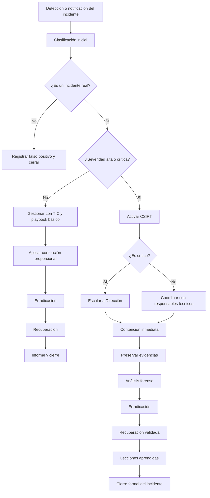

# During

## Índice

- [Introducción](#1-introducción-y-contexto)
- [Plan de respuesta](#2-alcance-del-plan)
- [Playbooks](#4-selección-de-playbooks)
- [Respuesta a las preguntas](#8-respuesta-a-las-preguntas)
- [Conclusiones](#9-conclusiones)
- [Bibliografía](#bibliografía)

## 1. Introducción y contexto

Este documento recoge el núcleo del plan de respuesta a incidentes de Security S.L. y define cómo actuar durante un incidente de ciberseguridad que pueda afectar a la confidencialidad, integridad o disponibilidad de la información corporativa.

El plan se basa en NIST SP 800-61 Rev.2 e integra el Análisis de Riesgos, el Plan Director de Seguridad y la taxonomía de incidentes desarrollada por el equipo.

Se ha revisado y sintetizado la información previamente recopilada sobre la empresa, identificación de activos, análisis de riesgos, Plan Director de Seguridad y taxonomía de incidentes. Esta base de conocimiento se utiliza para priorizar incidentes, seleccionar playbooks y vincular la información de las matrices MITRE ATT&CK y RE&CT con el plan de respuesta.

Security S.L. es una empresa de ciberseguridad, auditoría y consultoría TIC con 150 empleados en dos sedes, con infraestructura local y servicios cloud, y con un antecedente de ransomware previo documentado por USB y una madurez de seguridad global del 36, situada en nivel inicial.

## 2. Alcance del plan

Este plan aplica a todos los empleados, directivos y colaboradores con acceso a sistemas de Security S.L., a ambas sedes físicas y a los entornos de teletrabajo, así como a todos los activos del inventario hardware, software, datos, servicios y personal con acceso privilegiado.

Este plan cubre cuatro playbooks principales: ransomware, compromiso de credenciales, fuga de información y phishing, seleccionados por su relevancia en el análisis de riesgos y en las matrices MITRE ATT&CK y RE&CT.

## 3. Relación con MITRE ATT&CK y RE&CT

MITRE ATT&CK se ha usado para modelar el comportamiento ofensivo del adversario, identificando tácticas, técnicas y procedimientos probables contra los activos de Security S.L. durante la preparación y el diseño de los playbooks.

RE&CT se ha usado como modelo defensivo-reactivo para traducir cada técnica relevante en acciones concretas de identificación, contención y erradicación, seleccionando contramedidas específicas para cada escenario.

Las técnicas más relevantes identificadas incluyen T1566.001, T1566.002, T1190, T1091, T1078, T1110, T1003, T1486, T1041, T1048, T1562.001, T1490, T1021.001 y T1059.001.

## 4. Selección de playbooks

La selección de los playbooks se realizó combinando tres criterios: nivel de riesgo del PDS, frecuencia de técnicas ATT&CK en actores relevantes del sector, e historial de incidentes previos.

Los cuatro playbooks incluidos en la versión 1.0 son:
- [PB-01 Ransomware y Cifrado Malicioso](#pb-01-ransomware)
- [PB-02 Compromiso de Credenciales y Acceso No Autorizado](#pb-02-compromiso-de-credenciales)
- [PB-03 Fuga de Información / Data Breach](#pb-03-fuga-de-informacion)
- [PB-04 Phishing e Ingeniería Social](#pb-04-phishing)

Se descartaron temporalmente escenarios como DoS/DDoS, compromiso de cadena de suministro e insider threat, por estar fuera de la prioridad de esta versión o por requerir mayor madurez de controles.

## 5. Fases del plan de respuesta

### 5.1 Preparación

El objetivo de esta fase es asegurar que Security S.L. dispone de las capacidades, herramientas y procesos necesarios para responder con eficacia antes de que ocurra cualquier incidente.

Los principales elementos de preparación son:
- Antivirus gestionado con capacidades EDR y anti-ransomware, con consola centralizada.
- MDM desplegado en portátiles y móviles corporativos.
- Backups 3-2-1 con pruebas mensuales de restauración.
- VPN OpenVPN para accesos remotos y MFA obligatorio.
- WSUS para gestión de parches.
- Firewall perimetral con reglas documentadas.
- BitLocker en portátiles Dell y cifrado nativo en móviles corporativos.
- Canal de notificación de incidentes mediante email, extensión TIC y formulario interno.

El equipo CSIRT interno queda formado por Coordinador de Incidentes, Analista Técnico Principal, Técnico de Backup y Recuperación, Responsable de Comunicación, Responsable Legal/DPO y Dirección General como soporte de gestión para decisiones críticas.

También se establecen formación anual, simulacros trimestrales de phishing, ejercicios tabletop semestrales y revisión anual del plan tras incidentes significativos.

### 5.2 Identificación

El objetivo de esta fase es detectar, clasificar y declarar formalmente los incidentes de seguridad de forma rápida y precisa, separando falsos positivos de incidentes reales.

Las principales fuentes de detección son:
- Alertas del antivirus/EDR.
- Notificaciones de empleados.
- Alertas de DLP.
- Monitorización de logs de servidor.
- Alertas del MDM.
- Notificaciones de proveedores.
- Detección directa por el usuario.

La taxonomía distingue entre vulnerabilidad, intrusión, impacto, fuga e ingeniería social, y establece niveles de severidad bajo, medio, alto y crítico con tiempos máximos de declaración.

### 5.3 Contención

El objetivo es limitar el impacto del incidente evitando su propagación, mientras se preservan evidencias para el análisis forense.

Las medidas inmediatas incluyen:
- Aislamiento de red del sistema afectado.
- Bloqueo de cuentas comprometidas en Active Directory.
- Revocación de tokens de sesión activos.
- Bloqueo de puertos USB.
- Borrado remoto de móviles perdidos o robados.
- Bloqueo preventivo de IPs sospechosas.

Las medidas de contención a largo plazo incluyen segmentación de red, monitorización intensiva de sistemas no afectados, credenciales temporales con MFA y comunicación interna sobre restricciones operativas.

La preservación de evidencias incluye:
- Captura forense de memoria RAM.
- Copia forense del disco con hash MD5/SHA256.
- Exportación y archivo de logs.
- Registro cronológico detallado.
- Cadena de custodia si procede.

### 5.4 Erradicación

El objetivo es eliminar completamente la causa raíz del incidente y asegurar que el atacante no mantiene persistencia en los sistemas.

Las acciones principales son:
- Identificar el vector de entrada.
- Eliminar malware o realizar reimagen completa en escenarios de ransomware.
- Revocar credenciales comprometidas.
- Aplicar parches de seguridad urgentes.
- Revisar y eliminar backdoors, servicios persistentes y usuarios no autorizados.
- Limpiar certificados, tokens API y claves SSH comprometidas.

La verificación incluye escaneo completo con EDR, auditoría de Active Directory, revisión de reglas de firewall y comprobación de integridad de backups.

### 5.5 Recuperación

El objetivo es restaurar sistemas y servicios de forma segura, verificando que el incidente no puede reproducirse.

La recuperación sigue el orden de prioridad definido por RTO/RPO:
- Servidor de archivos.
- Servidor de correo.
- CRM/ERP.
- Portátiles afectados.
- Web y tienda online.
- Servicios cloud.

Antes de volver a operación normal se exige:
- Verificación técnica de limpieza.
- Verificación de controles corregidos.
- Verificación de integridad de datos.
- Aprobación formal del Coordinador de Incidentes y Dirección.

### 5.6 Lecciones aprendidas

Dentro de los 7 días posteriores al cierre del incidente, el CSIRT celebrará una reunión de lecciones aprendidas para revisar cronología, respuesta, causa raíz, mejoras del plan y acciones correctoras.

El Coordinador de Incidentes elaborará un informe preliminar en 24 horas tras la contención y un informe final en 15 días tras el cierre del incidente. Si procede, el DPO coordinará la notificación a la AEPD en 72 horas y a los afectados según el impacto.

## 6. Flujo de decisión y escalado

El proceso de decisión se basa en tres principios: velocidad con cautela, autoridad clara y proporcionalidad.

El flujo de escalado establece:
- Detección y notificación en 0-15 minutos.
- Clasificación inicial en 15-30 minutos.
- Activación del CSIRT si el incidente es alto o crítico.
- Comunicación a Dirección en incidentes críticos.
- Cierre formal y post-incidente con informe preliminar y final.

En incidentes de ransomware, la política de no pago queda definida de antemano.

## 7. Resiliencia cibernética

La resiliencia del plan se basa en asumir que la prevención puede fallar y en diseñar mecanismos para absorber el impacto, adaptarse y recuperarse.

Los elementos clave son:
- Backups 3-2-1 y pruebas mensuales.
- Diversidad de canales de comunicación.
- Aislamiento quirúrgico en contención.
- Política de no pago de rescate.
- Reimagen desde imagen golden.
- RTORPO definidos.
- Mejora continua tras incidentes.

## 8. Respuesta a las preguntas

### 1.a Relación entre MITRE ATT&CK, RE&CT y el plan de respuesta
El trabajo con las matrices MITRE ATT&CK y RE&CT ha sido fundamental para articular el plan de respuesta. MITRE ATT&CK se ha usado para identificar y priorizar las técnicas ofensivas específicas del sector, mientras que RE&CT se ha utilizado para definir y priorizar las acciones de respuesta defensivas en cada fase.

En el Navigator de MITRE se seleccionaron y mapeó tanto el comportamiento esperado de los adversarios como los controles existentes. Las técnicas elegidas, por ejemplo T1566.001, T1566.002, T1190, T1091, T1078, T1110, T1003, T1486, T1041, T1048, T1562.001, T1490, T1021.001 y T1059.001, se incorporaron directamente al diseño de los playbooks.

### 1.b Playbooks necesarios y su fundamento
Los playbooks identificados como necesarios en este plan son:
- [PB-01 Ransomware y Cifrado Malicioso](#pb-01-ransomware)
- [PB-02 Compromiso de Credenciales y Acceso No Autorizado](#pb-02-compromiso-de-credenciales)
- [PB-03 Fuga de Información](#pb-03-fuga-de-informacion)
- [PB-04 Phishing](#pb-04-phishing)

La identificación de estos playbooks se basa en el análisis de riesgo del Plan Director de Seguridad, el inventario de activos, el historial de incidentes previos y la priorización de técnicas de MITRE ATT&CK asociadas a amenazas del sector. La valoración del impacto sobre servicios críticos, datos sensibles y continuidad del negocio definió estas prioridades.

Diagrama de flujo de un playbook:

Detección -> Clasificación -> Contención -> Análisis forense -> Erradicación -> Recuperación -> Lecciones aprendidas

### 1.c Cobertura de fases del plan de respuesta
Este plan cubre todas las fases del ciclo de respuesta: preparación, identificación, contención, erradicación, recuperación y lecciones aprendidas.
- Preparación: se definen capacidades, formación, herramientas EDR/MDM, backups y simulacros.
- Identificación: se detallan fuentes de detección, taxonomía de incidentes y tiempos de declaración.
- Contención: se describen acciones inmediatas y a largo plazo, así como preservación de evidencias.
- Erradicación: se explica la eliminación de la causa raíz, parches, revocación de credenciales y limpieza de persistencia.
- Recuperación: se priorizan activos, verificaciones técnicas y aprobación formal antes de volver a operar.
- Lecciones aprendidas: se fija un ciclo de revisión post-incidente, cronologías y mejoras del plan.

La fase que suele estar más floja en muchos planes es la preparación, especialmente en lo relativo a coordinación con terceros y proveedores externos; aquí se refuerza con formación, ejercicios y revisión anual. La fase mejor trabajada en este plan es la identificación y contención, gracias a la combinación de EDR, monitorización de logs, DLP y protocolos claros de escalado.

### 2.a Flujo de toma de decisiones y escalado
El flujo de toma de decisiones se basa en velocidad con cautela, autoridad clara y proporcionalidad.
- Detección inicial y notificación.
- Clasificación rápida del incidente.
- Activación del CSIRT si el incidente es alto o crítico.
- Escalado a Dirección en casos críticos.
- Decisiones sobre contención, erradicación y recuperación.

El plan incluye protocolos de comunicación interna y externa, así como roles claros para asegurar que las decisiones se toman con la información adecuada.

Diagrama del flujo de escalado:

[Detección / Alertas] -> [Clasificación] -> [Activación CSIRT] -> [Escalado Dirección si procede] -> [Ejecución de acción] -> [Informe y cierre]

### 3.a Respuestas resilientes
La resiliencia se asegura diseñando respuestas que absorben el impacto, permiten adaptarse y facilitan la recuperación.
- Se centran en la contención rápida y quirúrgica para limitar la propagación.
- Se priorizan backups, reimagen y verificación de integridad para recuperación segura.
- Se establece la mejora continua mediante lecciones aprendidas para reducir la probabilidad de recurrencia.

Estas respuestas son resilientes porque no dependen solo de la prevención, sino de la capacidad de detectar fallos, aislar daños, restaurar servicios críticos y aprender del incidente. Las fases más centradas en resiliencia son la contención, la recuperación y el ciclo de lecciones aprendidas.

## 9. Conclusiones

Este plan de respuesta integra el contexto de Security S.L., el análisis de riesgos, el Plan Director de Seguridad y la taxonomía de incidentes con las matrices MITRE ATT&CK y RE&CT. Las decisiones sobre playbooks y fases de respuesta se basan en datos reales, técnicas priorizadas y una perspectiva de ciberresiliencia.

La prioridad en este documento es disponer de procedimientos claros para los incidentes más relevantes del sector, mantener un flujo de decisión definido, y asegurar que la organización puede recuperarse y mejorar tras cada incidente.

## Bibliografía

- NIST SP 800-61 Rev.2: "Computer Security Incident Handling Guide".
- MITRE ATT&CK: https://attack.mitre.org/
- MITRE RE&CT: modelo de respuesta defensiva-reactiva para ciberseguridad.
- Reglamento General de Protección de Datos (RGPD).
- Plan Director de Seguridad corporativo de Security S.L.
- Taxonomía de incidentes de Security S.L.

## 10. Cierre operativo

Este documento debe tratarse como vivo y revisarse tras cada incidente significativo y, como mínimo, una vez al año. La próxima revisión programada es enero de 2027.

---
title: "Índice de playbooks"
version: "1.0"
date: "Enero 2026"
classification: "CONFIDENCIAL"
organization: "Security S.L."
---

# Playbooks

## Playbooks disponibles

Esta sección reúne los procedimientos específicos de respuesta para los incidentes más probables y con mayor impacto para Security S.L.

Los playbooks incluidos en esta versión son:
- [PB-01 Ransomware y Cifrado Malicioso](#pb-01-ransomware)
- [PB-02 Compromiso de Credenciales y Acceso No Autorizado](#pb-02-compromiso-de-credenciales)
- [PB-03 Fuga de Información](#pb-03-fuga-de-informacion)
- [PB-04 Phishing e Ingeniería Social](#pb-04-phishing)

## Propósito

Cada playbook describe cómo investigar, contener, erradicar, recuperar y comunicar un incidente concreto. El objetivo es reducir la improvisación durante la crisis y asegurar una respuesta homogénea, rápida y trazable.

---
title: "PB-02 Compromiso de Credenciales y Acceso No Autorizado"
version: "1.0"
date: "Enero 2026"
classification: "CONFIDENCIAL"
organization: "Security S.L."
severity: "Alta-Crítica"
---

# Compromiso de Credenciales y Acceso No Autorizado

## Descripción

Este playbook cubre accesos no autorizados a sistemas de Security S.L. mediante credenciales robadas, comprometidas o explotadas. Incluye brute force, credential stuffing, phishing exitoso y compromiso de cuenta privilegiada.

## Técnicas relacionadas

- T1078 Valid Accounts.
- T1110 Brute Force.
- T1003 OS Credential Dumping.
- T1021.001 Remote Services.

## Activos en riesgo

- Active Directory.
- Servidores internos.
- Servicios cloud.
- CRM.
- Datos de clientes.
- Cuentas privilegiadas.

## Indicadores de compromiso

- Múltiples intentos de inicio de sesión fallidos seguidos de éxito.
- Logins en horarios inusuales.
- Accesos desde IPs extranjeras o no habituales.
- Acceso a información fuera del rol del usuario.
- Creación de cuentas nuevas en Active Directory.

## Identificación

- Revisar logs de AD, MDM, correo y VPN.
- Confirmar si la cuenta afectada es estándar o privilegiada.
- Clasificar el incidente según el nivel de acceso comprometido.
- Determinar qué sistemas o datos fueron accesibles.

## Contención

- Bloquear de inmediato la cuenta comprometida.
- Revocar tokens de sesión activos en cloud y VPN.
- Si es una cuenta privilegiada, forzar cambio de contraseñas de administradores.
- Activar MFA si no estaba activo.
- Bloquear la IP de origen sospechosa.
- Notificar al usuario por canal alternativo seguro.

## Erradicación

- Revisar Active Directory en busca de nuevas cuentas o cambios de permisos.
- Buscar herramientas de persistencia como scheduled tasks o servicios.
- Ejecutar cambio masivo de contraseñas si se sospecha credential dumping.
- Revocar y regenerar certificados y tokens API comprometidos.

## Recuperación

- Restablecer la contraseña con requisitos robustos.
- Revisar permisos del usuario afectado.
- Restablecer el acceso solo con mínimo privilegio.
- Mantener monitorización intensiva durante 30 días.
- Evaluar si existió acceso a datos personales y si procede notificación RGPD.

## Lecciones aprendidas

- Documentar el vector de entrada real.
- Revisar si la política MFA fue suficiente.
- Ajustar controles de privilegio y detección.
- Incorporar los hallazgos al siguiente simulacro o revisión del plan.

---
title: "PB-03 Fuga de Información"
version: "1.0"
date: "Enero 2026"
classification: "CONFIDENCIAL"
organization: "Security S.L."
severity: "Alta-Crítica"
---

# Fuga de Información

## Descripción

Este playbook cubre la extracción, exposición o acceso no autorizado a información confidencial o datos personales de Security S.L., sus clientes o proveedores.

La activación de este playbook implica valorar de inmediato las obligaciones del RGPD.

## Técnicas relacionadas

- T1041 Exfiltration Over C2 Channel.
- T1048 Exfiltration Over Alternative Protocol.
- T1567 Exfiltration to Cloud.

## Activos en riesgo

- Datos personales de clientes.
- Datos financieros.
- Nóminas.
- Propiedad intelectual.
- Expedientes de clientes.
- Servicios cloud no autorizados o Shadow IT.

## Indicadores de compromiso

- Tráfico inusual hacia IPs externas.
- Transferencias masivas de archivos.
- Uso de servicios cloud personales o no autorizados.
- Alertas DLP.
- Descargas o consultas fuera de horario normal.

## Identificación

- Confirmar qué datos se han exfiltrado.
- Determinar si incluyen datos personales.
- Revisar logs de firewall, DLP y cloud.
- Notificar de inmediato al DPO.
- Identificar destino, volumen y momento de la exfiltración.

## Contención

- Bloquear el canal de exfiltración en firewall o proxy.
- Revocar el acceso del usuario o proceso implicado.
- Deshabilitar accesos Shadow IT detectados.
- Iniciar la evaluación de notificación a la AEPD dentro del plazo de 72 horas desde la confirmación.

## Erradicación y recuperación

- Identificar y cerrar el vector de exfiltración.
- Corregir reglas DLP o configuraciones débiles.
- Invalidar o recuperar datos exfiltrados si es técnicamente posible.
- Preparar la notificación a AEPD si procede.
- Preparar comunicación a afectados si el riesgo es alto.

## Lecciones aprendidas

- Revisar por qué el control preventivo falló.
- Reforzar DLP y monitorización de exfiltración.
- Ajustar reglas de acceso y permisos.
- Incorporar el incidente al seguimiento de cumplimiento RGPD.

---
title: "PB-04 Phishing"
version: "1.0"
date: "Enero 2026"
classification: "CONFIDENCIAL"
organization: "Security S.L."
severity: "Media-Alta"
---

# Phishing

## Descripción

Este playbook cubre campañas de engaño dirigidas a empleados de Security S.L. para obtener credenciales, ejecutar malware o inducir transferencias económicas fraudulentas.

El phishing es uno de los vectores de entrada más frecuentes y suele ser el inicio de incidentes más graves.

## Técnicas relacionadas

- T1566.001 Spearphishing Attachment.
- T1566.002 Spearphishing Link.
- T1598 Phishing for Information.

## Activos en riesgo

- Credenciales de empleados.
- Cuentas de correo.
- Equipos de usuario.
- Datos financieros si hay fraude tipo CEO/BEC.
- Sistemas que ejecuten adjuntos maliciosos.

## Indicadores de compromiso

- Remitente sospechoso o suplantado.
- Adjuntos con extensiones engañosas.
- Enlaces a dominios parecidos al corporativo.
- Mensajes con urgencia artificial.
- Solicitudes de credenciales o transferencia.

## Identificación

- El empleado reporta el correo sospechoso sin interactuar con él.
- TIC analiza cabeceras, SPF, DKIM y DMARC.
- Verificar el enlace real y el hash del adjunto.
- Si hubo clic o ejecución, escalar de inmediato.
- Si la campaña es masiva, notificar a más empleados.

## Contención

- Bloquear dominio y URL maliciosa en el gateway de correo.
- Poner en cuarentena mensajes similares.
- Si hubo ejecución del adjunto, aislar el equipo y seguir el playbook correspondiente.
- Si se entregaron credenciales, activar de inmediato el playbook de credenciales.
- Enviar una alerta interna breve a los empleados.

## Erradicación y recuperación

- Eliminar los mensajes maliciosos de los buzones afectados.
- Actualizar filtros y reglas del gateway.
- Si hubo malware confirmado, seguir el playbook de ransomware.
- Si hubo robo de credenciales, seguir el playbook de credenciales.
- Registrar el incidente para el próximo simulacro de phishing.

## Lecciones aprendidas

- Revisar el grado de detección de los empleados.
- Ajustar campañas de concienciación.
- Mejorar filtros y reglas antiphishing.
- Usar el caso como ejemplo en formación interna.

---
title: "PB-01 Ransomware y Cifrado Malicioso"
version: "1.0"
date: "Enero 2026"
classification: "CONFIDENCIAL"
organization: "Security S.L."
severity: "Crítica"
---

# Ransomware

## Descripción

Este playbook cubre incidentes en los que un atacante cifra archivos o sistemas de Security S.L. y exige un rescate para restaurar el acceso a la información.

Es el escenario de mayor prioridad debido al antecedente documentado de ransomware previo por USB y a la posibilidad de impacto directo sobre servidores, portátiles y backups.

## Técnicas relacionadas

- T1091 Replication Through Removable Media.
- T1566 Phishing.
- T1486 Data Encrypted for Impact.
- T1490 Inhibit System Recovery.
- T1562.001 Impair Defenses.

## Activos en riesgo

- Servidor de archivos.
- Datos de clientes.
- Portátiles Dell Latitude 3440.
- Backups conectados a red.
- Servicios compartidos y repositorios de información.

## Indicadores de compromiso

- Archivos con extensión desconocida o cifrada.
- Mensajes de rescate en escritorio o carpetas.
- Alto consumo de CPU o disco.
- Alertas del antivirus sobre cifrado masivo.
- Imposibilidad de abrir documentos habituales.

## Regla principal

Nunca se paga el rescate. La decisión de no pago está preaprobada por Dirección.

## Identificación

- Detectar archivos cifrados, extensiones extrañas o mensajes de rescate.
- Notificar de inmediato al equipo TIC.
- Confirmar si el cifrado es real y qué sistemas están afectados.
- Declarar el incidente como crítico y activar el CSIRT.
- Registrar hora, usuario que detectó el evento y equipos afectados.

## Contención

- Aislar físicamente los equipos afectados desconectando red y WiFi.
- No apagar todavía el equipo si se prevé análisis forense.
- Deshabilitar la cuenta del usuario afectado en Active Directory.
- Revisar si el vector de entrada fue USB, correo o red.
- Desconectar backups expuestos en red.
- Si hay propagación, aislar el segmento completo en firewall o VLAN.
- Capturar memoria RAM si es posible antes de apagar.

## Erradicación

- Identificar el tipo de ransomware si es posible.
- Comprobar si existe decryptor gratuito utilizable.
- Si no existe decryptor, preparar reimagen completa.
- Verificar la integridad del backup offsite antes de usarlo.
- Aplicar el parche o corrección que cerró el vector de entrada.
- Revocar credenciales de los usuarios en sistemas afectados.
- Eliminar cuentas, servicios y tareas persistentes creadas por el atacante.

## Recuperación

- Restaurar sistemas desde backup offsite verificado.
- Reinstalar el sistema operativo desde imagen limpia.
- Reaplicar BitLocker y MDM en portátiles restaurados.
- Mantener monitorización intensiva durante al menos 72 horas.
- Volver a producción solo con aprobación formal del RS y del Jefe TIC.

## Lecciones aprendidas

- Celebrar reunión post-incidente en 7 días.
- Emitir informe preliminar en 24 horas.
- Emitir informe final en 15 días.
- Revisar por qué falló la prevención inicial.
- Ajustar frecuencia de backups si no se cumplió el RPO.
- Valorar si hubo obligación de notificación RGPD.

---
title: "Roles del plan"
version: "1.0"
date: "Enero 2026"
classification: "CONFIDENCIAL"
organization: "Security S.L."
---

# Roles

## Equipo de respuesta

Este apartado describe los roles del CSIRT interno de Security S.L., sus responsabilidades principales y el alcance de sus funciones durante la respuesta a incidentes.

El equipo está diseñado para tomar decisiones rápidas, coordinar la contención técnica, asegurar el cumplimiento legal y mantener la comunicación con dirección y con terceros cuando sea necesario.

## Roles incluidos

- Coordinador de Incidentes.
- Analista Técnico Principal.
- Técnico de Backup y Recuperación.
- Responsable de Comunicación.
- Responsable Legal / DPO.
- Dirección General como soporte de gestión.

## Uso del apartado

Cada rol dispone de un documento propio con sus tareas, notas de entrenamiento y dependencias operativas. Este índice centraliza el acceso a esas fichas y mantiene el orden de la estructura de la plantilla.
## Role: All Participants

### Description

All participants in an incident response have the responsibility to help resolve the incident according to the incident response plan, under the authority of the Incident Commander.

### Duties

#### Exhibit Call Etiquette

* Join both the call and chat.
* Keep background noise to a minimum.
* Keep your microphone muted until you have something to say.
* Identify yourself when you join the call; State your name and role (_e.g._, "I am the SME for team x").
* Speak up and speak clearly.
* Be direct and factual.
* Keep conversations/discussions short and to the point.
* Bring any concerns to the Incident Commander (IC) on the call.
* Respect time constraints given by the Incident Commander.
* If you join only one channel (call or chat), do not actively participate, as it causes disjoined communication.
* **Use clear terminology, and avoid acronyms or abbreviations. Clarity and accuracy is more important than brevity.**

##### Reference: Common Voice Procedure

Standard radio [voice procedure](https://en.wikipedia.org/wiki/Voice_procedure#Words_in_voice_procedure) **is not required**, however you may hear certain terms (or need to use them yourself). Common phrases include:

* **Ack/Rog:** "I have received and understood"
* **Say Again:** "Repeat your last message"
* **Standby:** "Please wait a moment for the next response"
* **Wilco:** "Will comply"

**Do not** invent new abbreviations; favor being explicit over implicit.

#### Follow the Incident Commander

The Incident Commander (IC) is the leader of the incident response process.

* Follow instructions from the incident commander.
* Do not perform any actions unless the incident commander has told you to do so.
* The commander will typically poll for strong objections before tasking a large action. Raise objections if you have them.
* Once the commander has made a decision, follow that decision (even if you disagreed).
* Answer any questions the commander asks you in a clear and concise way.  Answering "I don't know" is acceptable. Do not guess.
* The commander may ask you to investigate something and get back to them in X minutes. Be ready with an answer within that time.  Asking for more time is acceptable, but provide the commander an estimate.

### Training

Read and understand the incident response plan, including the roles and playbooks.

---
title: "Rol 01 - Coordinador de Incidentes"
version: "1.0"
date: "Enero 2026"
classification: "CONFIDENCIAL"
organization: "Security S.L."
---

# Coordinador de Incidentes

## Perfil

El Coordinador de Incidentes es el líder del CSIRT y actúa como responsable de la coordinación global durante toda la respuesta.

## Responsabilidades principales

- Activar y coordinar el CSIRT.
- Declarar la severidad del incidente.
- Priorizar decisiones de contención y recuperación.
- Mantener informado a Dirección General.
- Validar el cierre formal del incidente.

## Deberes durante un incidente

- Recibir la notificación inicial.
- Confirmar la activación del playbook correspondiente.
- Coordinar las acciones entre TIC, legal, comunicación y dirección.
- Aprobar el informe preliminar y el informe final.
- Liderar la reunión de lecciones aprendidas.

## Notas de entrenamiento

- Debe participar en los ejercicios tabletop semestrales y en la revisión anual del plan. Su criterio es clave en incidentes críticos, especialmente en ransomware y fuga de datos.

---
title: "Rol 02 - Analista Técnico Principal"
version: "1.0"
date: "Enero 2026"
classification: "CONFIDENCIAL"
organization: "Security S.L."
---

# Analista Técnico Principal

## Perfil

El Analista Técnico Principal es el jefe de TIC y lidera el análisis forense, la contención técnica y la ejecución operativa de los playbooks.

## Responsabilidades principales

- Analizar alertas y validar si un evento es un incidente real.
- Ejecutar medidas de contención técnica.
- Coordinar la preservación de evidencias.
- Guiar la erradicación técnica y la recuperación.

## Deberes durante un incidente

- Revisar logs, alertas EDR, eventos de AD y trazas de red.
- Aislar equipos o segmentos afectados.
- Coordinar el bloqueo de cuentas o tokens comprometidos.
- Supervisar la reimagen de sistemas afectados.
- Verificar que no queden indicadores activos tras la erradicación.

## Notas de entrenamiento

- Debe tener experiencia en administración de sistemas, análisis de logs y respuesta a incidentes. Conviene reforzar formación en adquisición forense y correlación de eventos.

---
title: "Rol 03 - Técnico de Backup y Recuperación"
version: "1.0"
date: "Enero 2026"
classification: "CONFIDENCIAL"
organization: "Security S.L."
---

# Técnico de Backup y Recuperación

## Perfil

El Técnico de Backup y Recuperación gestiona las copias de seguridad, valida la integridad de los respaldos y ejecuta la restauración de servicios.

## Responsabilidades principales

- Verificar la disponibilidad de backups 3-2-1.
- Restaurar sistemas, datos y servicios según prioridades.
- Comprobar la integridad de la información recuperada.
- Coordinar la reconstrucción segura de equipos afectados.

## Deberes durante un incidente

- Identificar el último backup íntegro y utilizable.
- Ejecutar restauraciones offsite cuando sea necesario.
- Validar hashes y consistencia funcional de los datos.
- Informar al Coordinador de Incidentes sobre tiempos reales de recuperación.
- Verificar que el sistema restaurado esté limpio antes de volver a producción.

## Notas de entrenamiento

- Debe participar en pruebas mensuales de restauración y conocer los RTO/RPO de los servicios críticos. Su función es especialmente relevante en ransomware y destrucción de datos.

---
title: "Rol 04 - Responsable de Comunicación"
version: "1.0"
date: "Enero 2026"
classification: "CONFIDENCIAL"
organization: "Security S.L."
---

# Responsable de Comunicación

## Perfil

El Responsable de Comunicación gestiona las comunicaciones internas y externas durante un incidente.

## Responsabilidades principales

- Preparar comunicados internos.
- Coordinar mensajes externos si proceden.
- Evitar filtraciones de información técnica sensible.
- Alinear los mensajes con Dirección y con Legal/DPO.

## Deberes durante un incidente

- Informar a empleados sobre restricciones operativas.
- Coordinar mensajes a clientes o proveedores si existe impacto.
- Apoyar la comunicación con medios cuando sea necesario.
- Mantener un tono claro, breve y no técnico.
- Asegurar coherencia entre el mensaje interno y el externo.

## Notas de entrenamiento

- Debe participar en simulacros de incidentes con componente reputacional o regulatorio. Tiene que conocer los tiempos de notificación y los mensajes tipo para escenarios de fuga de información y phishing.

---
title: "Rol 05 - Responsable Legal"
version: "1.0"
date: "Enero 2026"
classification: "CONFIDENCIAL"
organization: "Security S.L."
---

# Responsable Legal

## Perfil

El Responsable Legal y DPO supervisa el cumplimiento normativo, especialmente RGPD, LOPDGDD y cualquier obligación de notificación a autoridades o afectados.

## Responsabilidades principales

- Evaluar el impacto legal del incidente.
- Determinar si existe compromiso de datos personales.
- Coordinar notificaciones a la AEPD.
- Asesorar sobre obligaciones frente a clientes, proveedores y terceros.

## Deberes durante un incidente

- Valorar si el incidente activa el plazo de 72 horas del RGPD.
- Revisar evidencias para soportar decisiones legales.
- Coordinar la documentación de cadena de custodia si procede.
- Asesorar sobre denuncias ante autoridades cuando exista delito informático.
- Validar mensajes legales en comunicaciones externas.

## Notas de entrenamiento

- Debe participar en los ejercicios tabletop y en la revisión de los playbooks con componente de datos personales. Su papel es crítico en fugas de información y accesos no autorizados.

---
title: "Rol 06 - Dirección General"
version: "1.0"
date: "Enero 2026"
classification: "CONFIDENCIAL"
organization: "Security S.L."
---

# Dirección General

## Perfil

Dirección General actúa como soporte de gestión y como autoridad de aprobación para decisiones críticas durante la respuesta.

## Responsabilidades principales

- Aprobar recursos extraordinarios.
- Respaldar decisiones críticas del CSIRT.
- Validar decisiones estratégicas y de negocio.
- Apoyar la comunicación ejecutiva del incidente.

## Deberes durante un incidente

- Recibir aviso en incidentes críticos.
- Autorizar medidas que afecten al negocio si son necesarias.
- Acompañar la decisión sobre recuperación prioritaria.
- Evitar interferir en la operación técnica salvo necesidad de aprobación.
- Respaldar la comunicación con clientes o terceros cuando proceda.

## Notas de entrenamiento

- Debe conocer los principios de no pago en ransomware, los tiempos de escalado y el impacto financiero, operativo y reputacional de cada tipo de incidente.

---
title: "Guía de acciones posteriores"
version: "1.0"
date: "Enero 2026"
classification: "CONFIDENCIAL"
organization: "Security S.L."
---

# after.md

## Propósito

Esta guía define las acciones posteriores a una respuesta a incidentes, también conocidas como hotwash, debrief o post-mortem.

Su objetivo es consolidar aprendizajes, identificar mejoras y actualizar el plan y los playbooks a partir de la experiencia real del incidente.

## Reunión post-incidente

Dentro de los 7 días posteriores al cierre del incidente, el CSIRT celebrará una reunión de revisión con todos los participantes relevantes.

La reunión debe cubrir:
- Cronología completa del incidente.
- Decisiones tomadas y por qué se tomaron.
- Qué funcionó bien.
- Qué falló o llegó tarde.
- Qué información faltó.
- Qué cambios deben incorporarse al plan.

## Informe preliminar

El Coordinador de Incidentes elaborará un informe preliminar en las 24 horas posteriores a la contención del incidente.

Este informe debe incluir:
- Resumen ejecutivo.
- Activos afectados.
- Medidas de contención aplicadas.
- Estado de la erradicación.
- Próximos pasos de recuperación.

## Informe final

El informe final se emitirá en un plazo máximo de 15 días desde el cierre del incidente.

Debe incluir:
- Cronología consolidada.
- Causa raíz.
- Impacto técnico, operativo, económico y reputacional.
- Medidas correctoras aplicadas.
- Recomendaciones para prevenir recurrencia.

## Análisis de causa raíz

La causa raíz debe documentarse con claridad, evitando descripciones genéricas.

Debe responder, al menos, a estas preguntas:
- Cómo entró el atacante.
- Qué controles fallaron.
- Qué controles no existían.
- Qué se puede hacer para reducir el riesgo en el futuro.

## Acciones de mejora

Todas las acciones de mejora deben registrarse con:
- Responsable.
- Fecha objetivo.
- Estado.
- Prioridad.
- Evidencia de cierre.

Las mejoras deben trasladarse al plan, a los playbooks o a los controles técnicos cuando corresponda.

## Cierre

No debe darse por cerrado un incidente hasta que queden documentadas las lecciones aprendidas y se hayan registrado las acciones de mejora necesarias.

---
title: "Información de la plantilla"
version: "1.0"
date: "Enero 2026"
classification: "CONFIDENCIAL"
organization: "Security S.L."
---

# about.md

## Sobre esta plantilla

Esta plantilla reúne el plan de respuesta a incidentes, los playbooks, los roles del CSIRT y la guía de acciones posteriores para Security S.L.

Su propósito es ofrecer una estructura clara, mantenible y reutilizable para responder a incidentes de ciberseguridad de forma ordenada.

## Información general

- Organización: Security S.L.
- Tipo de documento: Plan de respuesta a incidentes.
- Versión: 1.0.
- Clasificación: CONFIDENCIAL.
- Fecha base: Enero 2026.

## Uso previsto

La plantilla está pensada para ser utilizada por el equipo de respuesta a incidentes, dirección, legal y personal técnico implicado en la gestión de incidentes.

Debe revisarse tras incidentes significativos y, como mínimo, una vez al año.