# Atención y Seguimiento de Incidentes Usando Let's Defend

Nuestros playbooks de referencia:
Deepfakes
Bruteforce -- listo
Code-injection  -- listo
Cryptojacking
Ddos
Defacement
Elevation-privilege -- listo
Identity and access
Iot device attacks
Man in the middle
Phishing -- listo
Ransomware

## Índice

## Incidente 1: SOC239 - Remote Code Execution Detected in Splunk Enterprise

1.a Trabaja una memoria del trabajo realizado en la resolución de los incidentes. Tipo según taxonomía, Criticidad, Descripción del incidente para entender que ha sucedido. Utiliza imágenes y cualquier tipo de explicación y diagrama que permita aclarar tu trabajo. 

### Clasificación según taxonomía

Acceso no autorizado

### Criticidad

Alta

### Descripción del incidente

Se detectó una carga XSLT maliciosa en Splunk Enterprise con el potencial de desencadenar la ejecución remota de código.

1.b ¿Cuál es el proceso de investigación seguido para investigar el incidente y que evidencias han sido clave para la resolución del incidente?

### Acciones tomadas para su resolución

Lo primero que haremos será crear el playbook y examinar el nombre de la regla, donde veremos que esta relacionada con el CVE-2023-46213, el cual es una ejecución remota de código.
Tendremos que ver entre que dos dispositivos se está produciendo el tráfico.

En la siguiente ventana de Collect Data tenemos que recopilar información sobre direcciones ip, nombre de host...

Y podemos recopilar la siguiente información:

Dirección IP de origen: 180.101.88.240

Dirección IP de destino: 172.16.20.13

Puerto de origen: 54321

Puerto de destino: 8000

Si nos vamos a Virustotal e introducimos la ip 180.101.88.240 nos da que es malicioso

A continuación nos vamos a la página abuseipdb y aquí vemos que la dirección IP pertenece a una empresa China llamada Telecom.

A continuación Lets defend nos pregunta si el trafico es malicioso y le decimos que si, ya que con Virustotal y abuseipdb vemos que efectivamente eran maliciosos.

Ahora nos pregunta el tipo de ataque que es, si investigamos encontraremos un archivo shell.zip si lo descomprimimos hay dos archivos un .sh (script) y un archivo .xsl, podemos analizar el contenido de estos para ver realmente el código que se está ejecutando y parece que quiere crear un documento y abrir una reverse shell, por lo tanto deducimos que el tipo de ataque es un XML Injection.

Si buscamos en la parte de la bandeja de entrafa e intentamos buscar la ip de origen o destino no vemos nada relevante por lo tanto deducimos que el ataque no esta planeado.

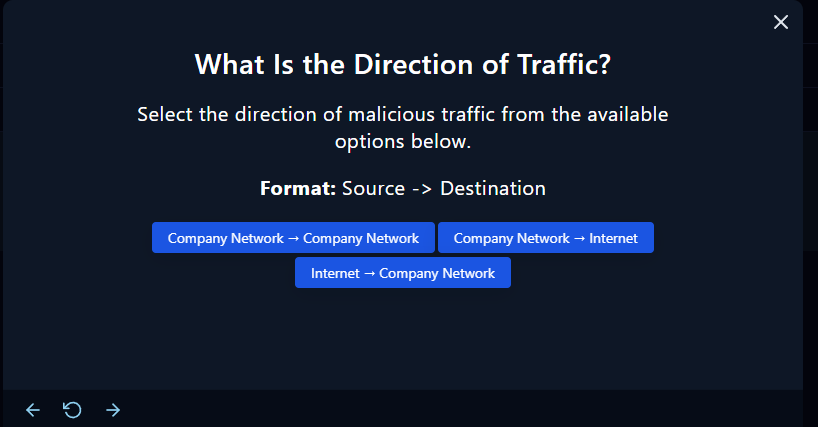

Ante esta pregunta hemos ivenstigado y la dirección de origen 180.101.88.240 de la alerta pertenece a la red externa de la empresa china, pero la dirección de destino que es esta: 172.16.20.13  pertenece a la empresa Splunk. Por eso seleccionaremos la opción de Internet → Red de empresa.

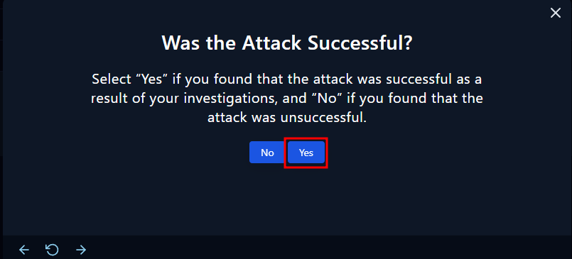

Nos preguntan si el ataque fue exitoso, y si lo fue porque la acción del dispositivo está permitida.

La siguiente parte es el apartado de contención, Como se muestra aquí abajo debemos aislar el dispositivo así restringimos al atacante y contenemos el dispositivo:

Como se muestra aquí abajo Debemos aislar el dispositivo así restringimos al atacante y contenemos el dispositivo:

A cotinuación ponemos los artifacts que veamos importantes y nos quedaría así:

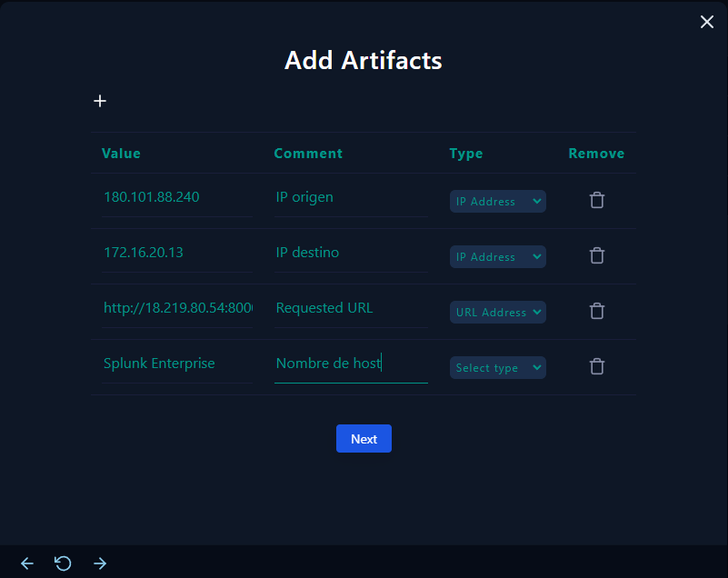

Por ultimo nos pregutan si hay que escalarlo al nivel 2 y diremos que si:

Y ya habríamos terminado el playbook.

### ¿Es necesario realizar alguna acción específica para el restablecimiento de los servicios afectados?

No, no es necesario.

### Documentar acciones y proponer mejoras para futuras respuestas.

### Desarrollar estrategias preventivas para evitar la repetición de incidentes similares

## Preguntas

2.a Durante la resolución del incidente ¿has tenido que realizar algún tipo de actuación para el restableciciomiento de servicios afectados por el incidente, con el objetivo de volver a la normalidad?

No, no he tenido que hacer ninguna acción para el restablecimiento de los servicios afectados.

3.a Tras trabajar en la resolución del incidente ¿Que acciones/actuaciones destacadas se han realizado para solucionar el incidente? 

Hacerrr

3.b Realizar un proceso de análisis de las actuaciones llevadas a cabo y obtener un registro de lecciones aprendidas, para finalmente concluir en las posibles mejoras que podrías plantear para tu plan/playbooks desarrollado en la práctica anterior.

Hacerrr

4.a Seguro que en el proceso de análisis para obtener un registro de lecciones aprendidas anterior, has pensado como evitar que una situación similar se vuelva a repetir. ¿Que actuaciones has decidido para evitar que se pueda dar una situación similar?

Hacerrr

## Incidente 2: 	SOC176 - RDP Brute Force Detected

1.a Trabaja una memoria del trabajo realizado en la resolución de los incidentes. Tipo según taxonomía, Criticidad, Descripción del incidente para entender que ha sucedido. Utiliza imágenes y cualquier tipo de explicación y diagrama que permita aclarar tu trabajo. 

### Clasificación según taxonomía

Fuerza Bruta

### Criticidad

Media

### Descripción del incidente

Error de inicio de sesión desde una única fuente con diferentes cuentas no existentes.

1.b ¿Cuál es el proceso de investigación seguido para investigar el incidente y que evidencias han sido clave para la resolución del incidente? 

### Acciones tomadas para su resolución

Lo primero que haremos será crear el playbook y detectar los detalles más importantes del incidente:

Direccion Ip de origen: 218.92.0.56

Direccón Ip de destino: 172.16.17.148

Nombre de host: Matthew

Protocolo: RDP

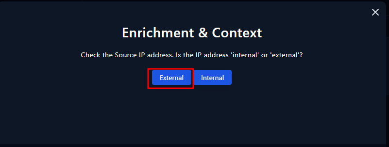

Aquí elegiremos la opción de ip de origen externa, ya que si la ponemos en virustotal y AbuseIPDB nos darán información de que la ip es maliciosa y externa:

Seleccionamos maliciosa también ya que hemos visto que es maliciosa

Si nos vamos a los logs y filtramos por esta dirección ip maliciosa, podemos ver que se realizó un ataque de fuerza bruta en el servicio RDP de este host Matthew.

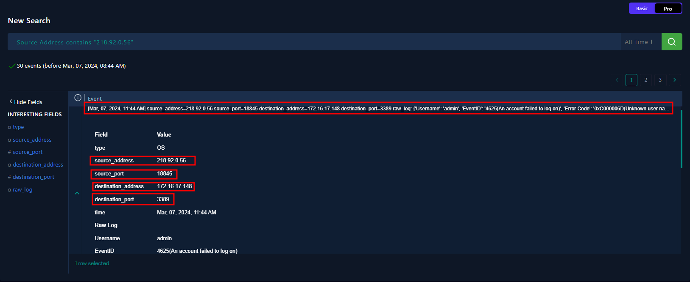

Seleccionamos que si hay una respuesta de la ip del atacante a un puerto SSH o RDP porque el puerto que vemos en la imagen de arriba corresponde a rdp (3389)

En la siguiente opción marcamos no, ya que si vemos los registros, todos los registros de la ip del atacante solo val al host de Matthew.

Si miramos los logs, vemos que el ataque de fuerza bruta fue exitosos y el atacante obtuvo acceso al sistema:

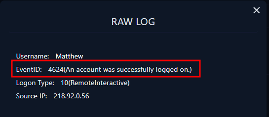

Así que seleccionamos que sí:

Deberiamos aislar el equipo de Matthew, para ello nos vamos a Endpoint Security y le damos a la opción de contener/aislar:

A contunuación seleccionamos los artifacts más importantes:

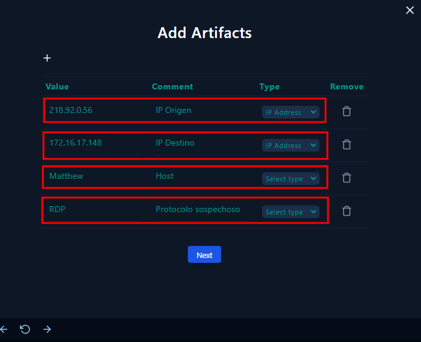

Y ya hemos terminado el playbook.

### ¿Es necesario realizar alguna acción específica para el restablecimiento de los servicios afectados?

### Documentar acciones y proponer mejoras para futuras respuestas.

### Desarrollar estrategias preventivas para evitar la repetición de incidentes similares

## Preguntas

2.a Durante la resolución del incidente ¿has tenido que realizar algún tipo de actuación para el restableciciomiento de servicios afectados por el incidente, con el objetivo de volver a la normalidad?

HACER

3.a Tras trabajar en la resolución del incidente ¿Que acciones/actuaciones destacadas se han realizado para solucionar el incidente? 

HACER

3.b Realizar un proceso de análisis de las actuaciones llevadas a cabo y obtener un registro de lecciones aprendidas, para finalmente concluir en las posibles mejoras que podrías plantear para tu plan/playbooks desarrollado en la práctica anterior.

HACER

4.a Seguro que en el proceso de análisis para obtener un registro de lecciones aprendidas anterior, has pensado como evitar que una situación similar se vuelva a repetir. ¿Que actuaciones has decidido para evitar que se pueda dar una situación similar?

HACER

## Incidente 3: SOC227 - Microsoft SharePoint Server Elevation of Privilege

1.a Trabaja una memoria del trabajo realizado en la resolución de los incidentes. Tipo según taxonomía, Criticidad, Descripción del incidente para entender que ha sucedido. Utiliza imágenes y cualquier tipo de explicación y diagrama que permita aclarar tu trabajo. 

### Clasificación según taxonomía

Ataque Web

### Criticidad

Critica

### Descripción del incidente

Esta actividad puede ser indicativa de un intento de explotar la vulnerabilidad CVE-2023-29357, que podría conducir a un acceso no autorizado y a una escalada de privilegios dentro del servidor de SharePoint.

1.b ¿Cuál es el proceso de investigación seguido para investigar el incidente y que evidencias han sido clave para la resolución del incidente? 

### Acciones tomadas para su resolución

Lo primero que haremos será seleccionar el incidente, asignarnoslo y luego empezar el playbook y detectaremos las direcciones ip y los detalles más importantes del incidente:

Direccion Ip de origen: 39.91.166.222

Direccón Ip de destino: 172.16.17.233

Nombre de host: MS-SharePointServer

URL: /_api/web/siteusers

Lo primero que haremos como siempre meter la ip de origen en Virustotal y abuselPDB y nos dará que la ip es maliciosa:

Ahora nos preguntan si el trafico es malicioso y por lo que hemos visto en Virustotal, los logs y abuselPDB decimos que si es maliciosa:

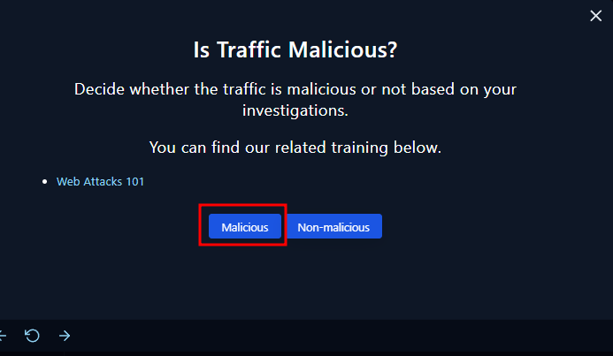

Aún no estamos seguros del tipo de ataque, así que seleccionamos other (otro) en la siguiente pestaña.

Para saber si el incidente fue creado por un test de penetración nos iremos a buscar en la parte de correos y bandeja de entradas y vemos que nada coincide con las ips e información que tenemos, así que no es planeado.

La dirección de origen de la alerta pertenece a la red externa de la empresa, pero la dirección de destino pertenece a MS-SharePointServer. Así que el flujo que seleccionamos es Internet → Red de empresa.

Para ver si el ataque fue exitoso o no, tendremos que ver los logs y los raw y veremos que el atacante accedió a las urls de /currentuser y /siteusers:

Para la parte de contención nos iremos a la ip 172.16.17.233 y lo contendremos:

Ahora añadimos los artifacts más importantes:

Y por ultimo si necesitamos escalar a nivel 2 para alguien más especializado.

### ¿Es necesario realizar alguna acción específica para el restablecimiento de los servicios afectados?

### Documentar acciones y proponer mejoras para futuras respuestas.

### Desarrollar estrategias preventivas para evitar la repetición de incidentes similares

## Preguntas

2.a Durante la resolución del incidente ¿has tenido que realizar algún tipo de actuación para el restableciciomiento de servicios afectados por el incidente, con el objetivo de volver a la normalidad?

3.a Tras trabajar en la resolución del incidente ¿Que acciones/actuaciones destacadas se han realizado para solucionar el incidente? 

3.b Realizar un proceso de análisis de las actuaciones llevadas a cabo y obtener un registro de lecciones aprendidas, para finalmente concluir en las posibles mejoras que podrías plantear para tu plan/playbooks desarrollado en la práctica anterior.

4.a Seguro que en el proceso de análisis para obtener un registro de lecciones aprendidas anterior, has pensado como evitar que una situación similar se vuelva a repetir. ¿Que actuaciones has decidido para evitar que se pueda dar una situación similar?

## Incidente 4: SOC251 - Quishing Detected (QR Code Phishing)

1.a Trabaja una memoria del trabajo realizado en la resolución de los incidentes. Tipo según taxonomía, Criticidad, Descripción del incidente para entender que ha sucedido. Utiliza imágenes y cualquier tipo de explicación y diagrama que permita aclarar tu trabajo. 

### Clasificación según taxonomía

Intercambio

### Criticidad

Media

### Descripción del incidente

Se trata de un codigo QR que no es legitimo y tiene un phishing.

1.b ¿Cuál es el proceso de investigación seguido para investigar el incidente y que evidencias han sido clave para la resolución del incidente? 

### Acciones tomadas para su resolución

Lo primero que haremos será seleccionar el incidente, asignarnoslo y luego empezar el playbook y detectaremos las direcciones ip y los detalles más importantes del incidente:

Direccion SMTP: 158.69.201.47

Correo de origen: security@microsecmfa.com

Dirección de destinos : Claire@letsdefend.io

Luego tendremos que irnos a virustotal e introducir la ip 158.69.201.47 y vemos que es maliciosa y que saltan varios antivirus:

Ahora haremos una busqueda por el correo security@microsecmfa.com y nos saldrá un mensaje con un qr de microsoft:

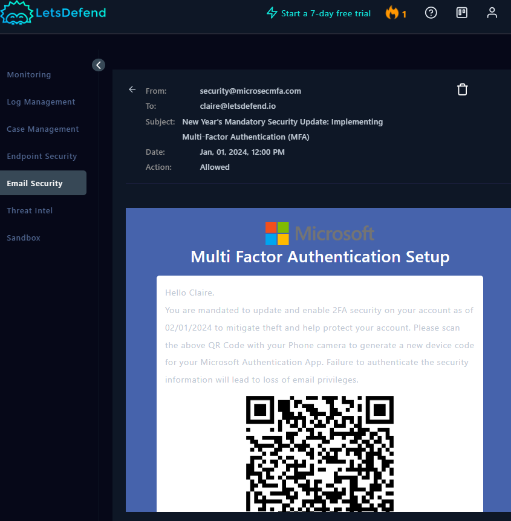

A continuación nos descargamos la imagen del QR y lo metemos en cyberchef y nos dará la siguiente dirección: https://ipfs.io/ipfs/Qmbr8wmr41C35c3K2GfiP2F8YGzLhYpKpb4K66KU6mLmL4#

Si buscamos esa url en virustotal nos sale que es maliciosa y que lo más probable es que sea phishing.

Ahora que sabemos que es malicioso ese correo, lo eliminamos en Let's Defend.

Ahora tenemos que verificar si el usuario accedió a esa URL del QR, para ello nos vamos a Endpoint Security y vemos la ip de Claire y activamos la contención:

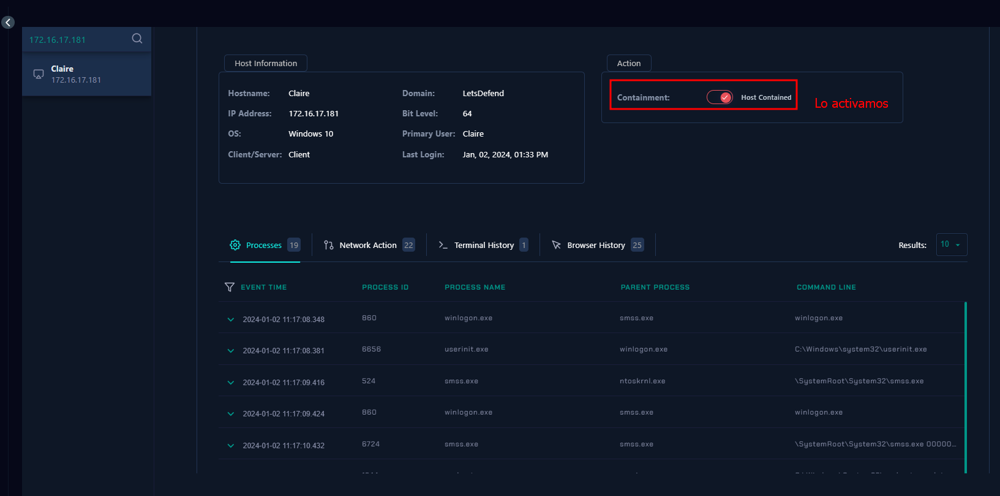

Aquí elegiremos la opción de Phishing for Information.

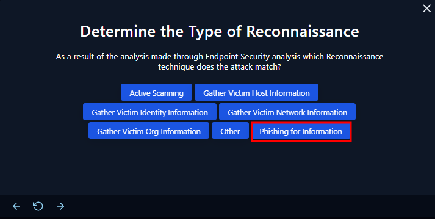

Vemos que el remitente de correo electronico y la URL del código QR es externa, por lo tanto la opción correcta es externa.

En virustotal hemos visto que la ip es maliciosa, así que la ip del atacante si es sospechosa:

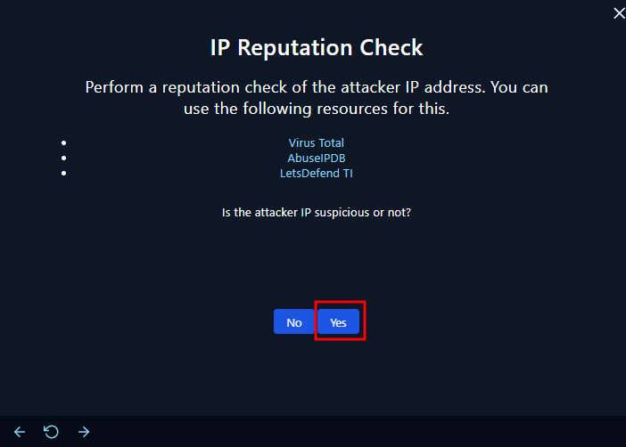

Comprobamos si alguien más recibió el correo electronico con el phishing, pero vemos que solo lo recibió Claire, así que no hay mas de un usuario afectado.

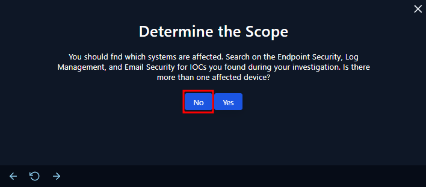

Ya hemos contenido al host, haremos esto para evitar más amenazas, ya que no podemos comprobar al 100% si el usuario llegó a acceder a la URL maliciosa.

Y estos serían los artifacts a poner:

Y ya habriamos terminado el playbook.

### ¿Es necesario realizar alguna acción específica para el restablecimiento de los servicios afectados?

### Documentar acciones y proponer mejoras para futuras respuestas.

### Desarrollar estrategias preventivas para evitar la repetición de incidentes similares

## Preguntas

2.a Durante la resolución del incidente ¿has tenido que realizar algún tipo de actuación para el restableciciomiento de servicios afectados por el incidente, con el objetivo de volver a la normalidad?

3.a Tras trabajar en la resolución del incidente ¿Que acciones/actuaciones destacadas se han realizado para solucionar el incidente? 

3.b Realizar un proceso de análisis de las actuaciones llevadas a cabo y obtener un registro de lecciones aprendidas, para finalmente concluir en las posibles mejoras que podrías plantear para tu plan/playbooks desarrollado en la práctica anterior.

4.a Seguro que en el proceso de análisis para obtener un registro de lecciones aprendidas anterior, has pensado como evitar que una situación similar se vuelva a repetir. ¿Que actuaciones has decidido para evitar que se pueda dar una situación similar?

## Incidente 5: Passwd Found in Requested URL - Possible LFI Attack

1.a Trabaja una memoria del trabajo realizado en la resolución de los incidentes. Tipo según taxonomía, Criticidad, Descripción del incidente para entender que ha sucedido. Utiliza imágenes y cualquier tipo de explicación y diagrama que permita aclarar tu trabajo. 

### Clasificación según taxonomía

Analista de seguridad 

### Criticidad

Alta

### Descripción del incidente

La URL contiene contraseña.

1.b ¿Cuál es el proceso de investigación seguido para investigar el incidente y que evidencias han sido clave para la resolución del incidente? 

### Acciones tomadas para su resolución

Lo primero que haremos será seleccionar el incidente, asignarnoslo y luego empezar el playbook y detectaremos las direcciones ip y los detalles más importantes del incidente:

Direccion IP Destino: 172.16.17.13

Dirección IP Origen: 106.55.45.162

Url solicitada: `https://172.16.17.13/?file=../../../../etc/passwd`

Si nos vamos al apartado de los y buscamos esta url en los logs, veremos más información sobre esta url y si nos fijamos el servidor dió un código de error 500, lo que significa que dió un error interno del servidor y por lo tanto el ataque falló.

Ahora metemos en virustotal la ip del atacante y veremos que varios detalles sobre que la ip es maliciosa y que viene de China:

Si miramos en el apartado de correos y en el de comandos, tampoco vemos nada sospechoso por lo que podemos concluir que fue un falso positivo.

Por  lo tanto deducimos que:

- El ataque falló
- La dirección del tráfico es de: Internet a la red empresarial
- No es una prueba planificada
- Inclusión de archivos locales
- Tráfico malicioso
- No es necesario escalar al Nivel 2 ya que hemos comprobado que el ataque falló y fue un falso positivo.

Y ya habriamos terminado el playbook.

### ¿Es necesario realizar alguna acción específica para el restablecimiento de los servicios afectados?

No no es necesario ya que no ha afectado a ninguna caída o error de los servicios o servidores.

### Documentar acciones y proponer mejoras para futuras respuestas.

HACERRRRRR
### Desarrollar estrategias preventivas para evitar la repetición de incidentes similares
HACERRRRRRRRR

## Preguntas

2.a Durante la resolución del incidente ¿has tenido que realizar algún tipo de actuación para el restableciciomiento de servicios afectados por el incidente, con el objetivo de volver a la normalidad?

HACERR
3.a Tras trabajar en la resolución del incidente ¿Que acciones/actuaciones destacadas se han realizado para solucionar el incidente? 

HACERRR
3.b Realizar un proceso de análisis de las actuaciones llevadas a cabo y obtener un registro de lecciones aprendidas, para finalmente concluir en las posibles mejoras que podrías plantear para tu plan/playbooks desarrollado en la práctica anterior.

HACERRR 
4.a Seguro que en el proceso de análisis para obtener un registro de lecciones aprendidas anterior, has pensado como evitar que una situación similar se vuelva a repetir. ¿Que actuaciones has decidido para evitar que se pueda dar una situación similar?

## Incidente 6: SOC250 - APT35 HyperScrape Data Exfiltration Tool Detected

1.a Trabaja una memoria del trabajo realizado en la resolución de los incidentes. Tipo según taxonomía, Criticidad, Descripción del incidente para entender que ha sucedido. Utiliza imágenes y cualquier tipo de explicación y diagrama que permita aclarar tu trabajo. 

### Clasificación según taxonomía

Analista de seguridad 

### Criticidad

Media

### Descripción del incidente

Se han identificado patrones de comportamiento inusuales o sospechosos vinculados al hash, lo que indica posibles intenciones maliciosas.

1.b ¿Cuál es el proceso de investigación seguido para investigar el incidente y que evidencias han sido clave para la resolución del incidente? 

### Acciones tomadas para su resolución

Lo primero que haremos será seleccionar el incidente, asignarnoslo y luego empezar el playbook y detectaremos las direcciones ip y los detalles más importantes del incidente:

Dirección IP : 172.16.17.72

Nombre de Host/Usuario : Arthur

Nombre del proceso : EmailDownloader.exe

Si nos vamos a los logs y miramos la ip 172.16.17.72 veremos que hay varios logs que nos interesan:

Ahora nos vamos al apartado de Endpoint y páginas de seguridad de correo electrónico.

Y seleccionamos la siguiente opción, porque la herramienta hyperscrape se utiliza para robar datos del usuario.

Ahora vamos a virustotal y vemos que las direcciones ips son externas y son maliciosas:

Aquí seleccionamos la opción de externa:

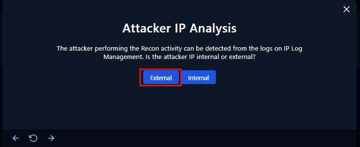

Si miramos en la página de Endpoint Security veremos que solo el host de Arthur fue afectado, y determinamos por tanto que el alcance fue solo a un dispositivo:

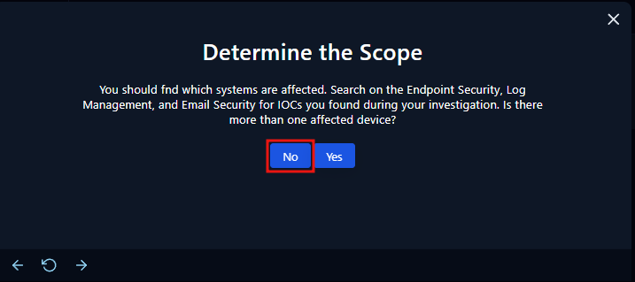

Y como vemos que el ataque tuvo éxito, pues aislamos el dispositivo:

Y por último aquí elegimos que sí, que tenemos que contenerlo:

Y ya habriamos terminado el playbook.

### ¿Es necesario realizar alguna acción específica para el restablecimiento de los servicios afectados?

No no es necesario ya que no ha afectado a ninguna caída o error de los servicios o servidores.

### Documentar acciones y proponer mejoras para futuras respuestas.

### Desarrollar estrategias preventivas para evitar la repetición de incidentes similares

## Preguntas

2.a Durante la resolución del incidente ¿has tenido que realizar algún tipo de actuación para el restableciciomiento de servicios afectados por el incidente, con el objetivo de volver a la normalidad?

3.a Tras trabajar en la resolución del incidente ¿Que acciones/actuaciones destacadas se han realizado para solucionar el incidente? 

3.b Realizar un proceso de análisis de las actuaciones llevadas a cabo y obtener un registro de lecciones aprendidas, para finalmente concluir en las posibles mejoras que podrías plantear para tu plan/playbooks desarrollado en la práctica anterior.

4.a Seguro que en el proceso de análisis para obtener un registro de lecciones aprendidas anterior, has pensado como evitar que una situación similar se vuelva a repetir. ¿Que actuaciones has decidido para evitar que se pueda dar una situación similar?

## Incidente 7: SOC164 - Suspicious Mshta Behavior

1.a Trabaja una memoria del trabajo realizado en la resolución de los incidentes. Tipo según taxonomía, Criticidad, Descripción del incidente para entender que ha sucedido. Utiliza imágenes y cualquier tipo de explicación y diagrama que permita aclarar tu trabajo. 

### Clasificación según taxonomía

Analista de seguridad 

### Criticidad

Alta

### Descripción del incidente

Archivo hta de baja reputación fue ejecutado a través de mshta.exe

1.b ¿Cuál es el proceso de investigación seguido para investigar el incidente y que evidencias han sido clave para la resolución del incidente? 

### Acciones tomadas para su resolución

Lo primero que haremos será seleccionar el incidente, asignarnoslo y luego empezar el playbook y detectaremos las direcciones ip y los detalles más importantes del incidente:

Dirección IP : 172.16.17.38

Nombre de Host/Usuario : Roberto

Nombre del proceso : mshta.exe

MD5 Hash: 6685c433705f558c5535789234db0e5a

Si nos vamos a virustotal y analizamos el hash veremos que es bastante malicioso:

Ahora nos vamos al apartado de Endpoint y buscamos por Roberto y veremos algunos comandos sospechosos:

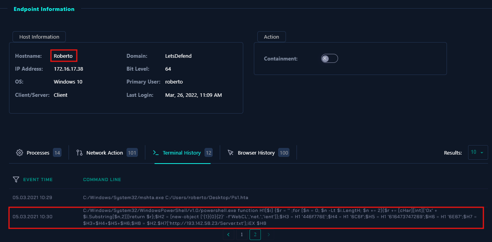

En los comandos podemos ver que intenta descargar y ejecutar algunos procesos en Powersheel desde una URL de Internet, podemos deducir que el comando fue el resultado de un intento malicioso.

Si nos vamos a los logs y filtramos por la ip, nos saldrá esta información de una solicitud 404.

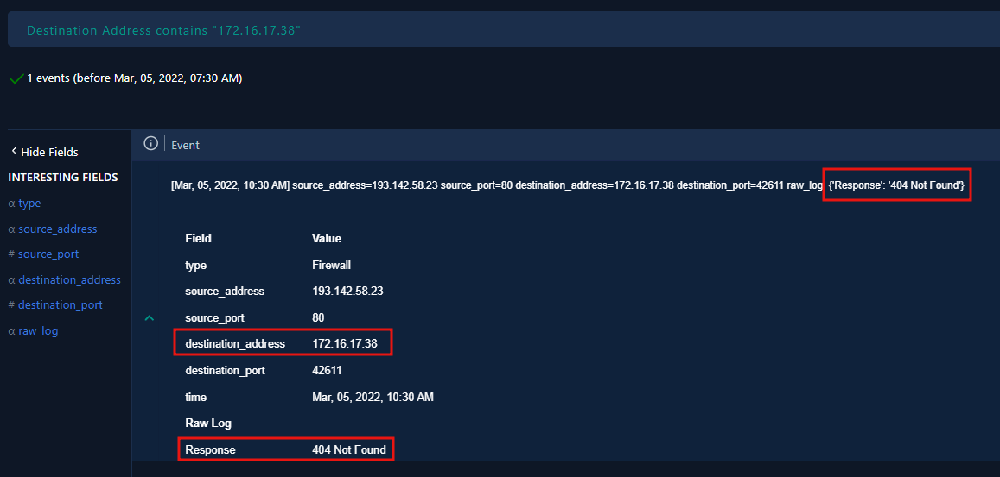

Por lo tanto deducimos que fue sospechoso:

Lo que significa que el código malicioso en server.txt no se ejecutó, aunque el script ofuscado intentó acceder a él. 

La actividad fue sospechosa por ejecución de comandos:

Para esta pregunta de quién realizó esta acción, pudimos ver en el historial de procesos que fue iniciado por explorer.exe, lo que implica que fue una ejecución interactiva por parte del usuario final.

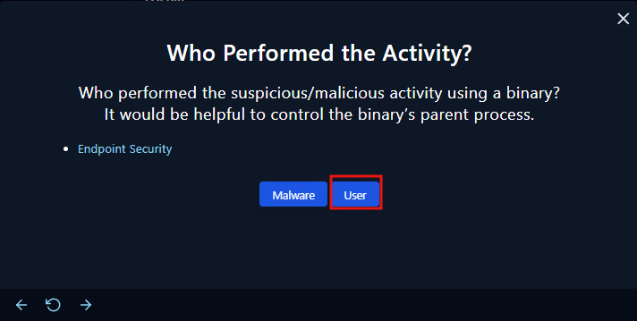

Ahora vamos a contener el host: 

Y ya habriamos terminado el playbook.

### ¿Es necesario realizar alguna acción específica para el restablecimiento de los servicios afectados?

No no es necesario ya que no ha afectado a ninguna caída o error de los servicios o servidores, basta con contener el host.

### Documentar acciones y proponer mejoras para futuras respuestas.

### Desarrollar estrategias preventivas para evitar la repetición de incidentes similares

## Preguntas

2.a Durante la resolución del incidente ¿has tenido que realizar algún tipo de actuación para el restableciciomiento de servicios afectados por el incidente, con el objetivo de volver a la normalidad?

3.a Tras trabajar en la resolución del incidente ¿Que acciones/actuaciones destacadas se han realizado para solucionar el incidente? 

3.b Realizar un proceso de análisis de las actuaciones llevadas a cabo y obtener un registro de lecciones aprendidas, para finalmente concluir en las posibles mejoras que podrías plantear para tu plan/playbooks desarrollado en la práctica anterior.

4.a Seguro que en el proceso de análisis para obtener un registro de lecciones aprendidas anterior, has pensado como evitar que una situación similar se vuelva a repetir. ¿Que actuaciones has decidido para evitar que se pueda dar una situación similar?

## Incidente 8: SOC166 - Javascript Code Detected in Requested URL

1.a Trabaja una memoria del trabajo realizado en la resolución de los incidentes. Tipo según taxonomía, Criticidad, Descripción del incidente para entender que ha sucedido. Utiliza imágenes y cualquier tipo de explicación y diagrama que permita aclarar tu trabajo. 

### Clasificación según taxonomía

Analista de seguridad 

### Criticidad

Media

### Descripción del incidente

Código de Javascript detectado en URL.

1.b ¿Cuál es el proceso de investigación seguido para investigar el incidente y que evidencias han sido clave para la resolución del incidente? 

### Acciones tomadas para su resolución

Lo primero que haremos será seleccionar el incidente, asignarnoslo y luego empezar el playbook y detectaremos las direcciones ip y los detalles más importantes del incidente:

Dirección IP destino : 172.16.17.17

Dirección IP origen : 112.85.42.13

URL solicitada : `https://172.16.17.17/search/?q=<$script>javascript:$alert(1)<$/script>`

Si nos vamos al tráfico HTTP de la alerta y buscamos por la URL solicitada, vemos que tiene el siguiente payload XSS:

`<$script>javascript:$alert(1)<$script>`

Por lo tanto el tráfico es malicioso:

Y el tipo de ataque es un XSS:

Si nos vamos a la pestaña de Email Security y miramos no hay ningún correo que indique que sea un test planificado, por lo tanto no lo es:

La dirección IP del atacante es 112.85.42.13, por lo que pertenece a una IP pública. Entonces, la dirección del tráfico es Internet -> Company Network.

Ahora nos vamos al apartado de Endpoint Security y veremos los distintos historiales del navegador y de la terminal, si vemos el payload del XSS vemos que no se representaba ningún intento para compremeter el Web Server, así que el host no fue comprometido.

Por lo que dijimos antes, esta alerta no necesita una escalada al siguiente nivel:

Y ya habriamos terminado el playbook.

### ¿Es necesario realizar alguna acción específica para el restablecimiento de los servicios afectados?

No no es necesario ya que no ha afectado a ninguna caída o error de los servicios o servidores, basta con contener el host.

### Documentar acciones y proponer mejoras para futuras respuestas.

### Desarrollar estrategias preventivas para evitar la repetición de incidentes similares

## Preguntas

2.a Durante la resolución del incidente ¿has tenido que realizar algún tipo de actuación para el restableciciomiento de servicios afectados por el incidente, con el objetivo de volver a la normalidad?

3.a Tras trabajar en la resolución del incidente ¿Que acciones/actuaciones destacadas se han realizado para solucionar el incidente? 

3.b Realizar un proceso de análisis de las actuaciones llevadas a cabo y obtener un registro de lecciones aprendidas, para finalmente concluir en las posibles mejoras que podrías plantear para tu plan/playbooks desarrollado en la práctica anterior.

4.a Seguro que en el proceso de análisis para obtener un registro de lecciones aprendidas anterior, has pensado como evitar que una situación similar se vuelva a repetir. ¿Que actuaciones has decidido para evitar que se pueda dar una situación similar?

## Incidente 9

1.a Trabaja una memoria del trabajo realizado en la resolución de los incidentes. Tipo según taxonomía, Criticidad, Descripción del incidente para entender que ha sucedido. Utiliza imágenes y cualquier tipo de explicación y diagrama que permita aclarar tu trabajo. 

### Clasificación según taxonomía

Analista de seguridad 

### Criticidad

Media

### Descripción del incidente

Código de Javascript detectado en URL.

1.b ¿Cuál es el proceso de investigación seguido para investigar el incidente y que evidencias han sido clave para la resolución del incidente? 

### Acciones tomadas para su resolución

Lo primero que haremos será seleccionar el incidente, asignarnoslo y luego empezar el playbook y detectaremos las direcciones ip y los detalles más importantes del incidente:

Dirección IP destino : 172.16.17.17

Dirección IP origen : 112.85.42.13

URL solicitada : `https://172.16.17.17/search/?q=<$script>javascript:$alert(1)<$/script>`

Si nos vamos al tráfico HTTP de la alerta y buscamos por la URL solicitada, vemos que tiene el siguiente payload XSS:

`<$script>javascript:$alert(1)<$script>`

Por lo tanto el tráfico es malicioso:

Y el tipo de ataque es un XSS:

Si nos vamos a la pestaña de Email Security y miramos no hay ningún correo que indique que sea un test planificado, por lo tanto no lo es:

La dirección IP del atacante es 112.85.42.13, por lo que pertenece a una IP pública. Entonces, la dirección del tráfico es Internet -> Company Network.

Ahora nos vamos al apartado de Endpoint Security y veremos los distintos historiales del navegador y de la terminal, si vemos el payload del XSS vemos que no se representaba ningún intento para compremeter el Web Server, así que el host no fue comprometido.

Por lo que dijimos antes, esta alerta no necesita una escalada al siguiente nivel:

Y ya habriamos terminado el playbook.

### ¿Es necesario realizar alguna acción específica para el restablecimiento de los servicios afectados?

No no es necesario ya que no ha afectado a ninguna caída o error de los servicios o servidores, basta con contener el host.

### Documentar acciones y proponer mejoras para futuras respuestas.

### Desarrollar estrategias preventivas para evitar la repetición de incidentes similares

## Preguntas

2.a Durante la resolución del incidente ¿has tenido que realizar algún tipo de actuación para el restableciciomiento de servicios afectados por el incidente, con el objetivo de volver a la normalidad?

3.a Tras trabajar en la resolución del incidente ¿Que acciones/actuaciones destacadas se han realizado para solucionar el incidente? 

3.b Realizar un proceso de análisis de las actuaciones llevadas a cabo y obtener un registro de lecciones aprendidas, para finalmente concluir en las posibles mejoras que podrías plantear para tu plan/playbooks desarrollado en la práctica anterior.

4.a Seguro que en el proceso de análisis para obtener un registro de lecciones aprendidas anterior, has pensado como evitar que una situación similar se vuelva a repetir. ¿Que actuaciones has decidido para evitar que se pueda dar una situación similar?

## Incidente 10

