# Atención y Seguimiento de Incidentes Usando Let's Defend

## Índice de Incidentes de Seguridad

1. [SOC239 - Remote Code Execution Detected in Splunk Enterprise](#incidente-1-soc239---remote-code-execution-detected-in-splunk-enterprise)
2. [SOC176 - RDP Brute Force Detected](#incidente-2-soc176---rdp-brute-force-detected)
3. [SOC227 - Microsoft SharePoint Server Elevation of Privilege](#incidente-3-soc227---microsoft-sharepoint-server-elevation-of-privilege)
4. [SOC251 - Quishing Detected (QR Code Phishing)](#incidente-4-soc251---quishing-detected-qr-code-phishing)
5. [Passwd Found in Requested URL - Possible LFI Attack](#incidente-5-passwd-found-in-requested-url---possible-lfi-attack)
6. [SOC250 - APT35 HyperScrape Data Exfiltration Tool Detected](#incidente-6-soc250---apt35-hyperscrape-data-exfiltration-tool-detected)
7. [SOC164 - Suspicious Mshta Behavior](#incidente-7-soc164---suspicious-mshta-behavior)
8. [SOC166 - Javascript Code Detected in Requested URL](#incidente-8-soc166---javascript-code-detected-in-requested-url)
9. [SOC169 - Possible IDOR Attack Detected](#incidente-9-soc169---possible-idor-attack-detected)
10. [SOC235 - Atlassian Confluence Broken Access Control 0-Day CVE-2023-22515](#incidente-10-soc235---atlassian-confluence-broken-access-control-0-day)

## Incidente 1: SOC239 - Remote Code Execution Detected in Splunk Enterprise

### 1.a Clasificación según taxonomía

Acceso no autorizado

### Criticidad

Alta

### Descripción del incidente

Se detectó una carga XSLT maliciosa en Splunk Enterprise con el potencial de desencadenar la ejecución remota de código.

### 1.b Acciones tomadas para su resolución

Lo primero que haremos será crear el playbook y examinar el nombre de la regla, donde veremos que esta relacionada con el CVE-2023-46213, el cual es una ejecución remota de código.
Tendremos que ver entre que dos dispositivos se está produciendo el tráfico.

En la siguiente ventana de Collect Data tenemos que recopilar información sobre direcciones ip, nombre de host...

Y podemos recopilar la siguiente información:

Dirección IP de origen: 180.101.88.240

Dirección IP de destino: 172.16.20.13

Puerto de origen: 54321

Puerto de destino: 8000

Si nos vamos a Virustotal e introducimos la ip 180.101.88.240 nos da que es malicioso

A continuación nos vamos a la página abuseipdb y aquí vemos que la dirección IP pertenece a una empresa China llamada Telecom.

A continuación Lets defend nos pregunta si el trafico es malicioso y le decimos que si, ya que con Virustotal y abuseipdb vemos que efectivamente eran maliciosos.

Ahora nos pregunta el tipo de ataque que es, si investigamos encontraremos un archivo shell.zip si lo descomprimimos hay dos archivos un .sh (script) y un archivo .xsl, podemos analizar el contenido de estos para ver realmente el código que se está ejecutando y parece que quiere crear un documento y abrir una reverse shell, por lo tanto deducimos que el tipo de ataque es un XML Injection.

Si buscamos en la parte de la bandeja de entrafa e intentamos buscar la ip de origen o destino no vemos nada relevante por lo tanto deducimos que el ataque no esta planeado.

Ante esta pregunta hemos ivenstigado y la dirección de origen 180.101.88.240 de la alerta pertenece a la red externa de la empresa china, pero la dirección de destino que es esta: 172.16.20.13  pertenece a la empresa Splunk. Por eso seleccionaremos la opción de Internet → Red de empresa.

Nos preguntan si el ataque fue exitoso, y si lo fue porque la acción del dispositivo está permitida.

La siguiente parte es el apartado de contención, Como se muestra aquí abajo debemos aislar el dispositivo así restringimos al atacante y contenemos el dispositivo:

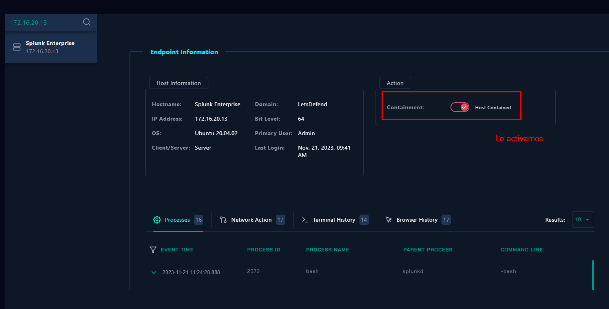

Como se muestra aquí abajo Debemos aislar el dispositivo así restringimos al atacante y contenemos el dispositivo:

A cotinuación ponemos los artifacts que veamos importantes y nos quedaría así:

Por ultimo nos pregutan si hay que escalarlo al nivel 2 y diremos que si:

Y ya habríamos terminado el playbook.

## Preguntas

### 2.a Durante la resolución del incidente ¿has tenido que realizar algún tipo de actuación para el restableciciomiento de servicios afectados por el incidente, con el objetivo de volver a la normalidad?

No fue necesario realizar ninguna acción específica para el restablecimiento de los servicios afectados, ya que el foco estaba en contener y analizar el incidente.

### 3.a Tras trabajar en la resolución del incidente ¿Que acciones/actuaciones destacadas se han realizado para solucionar el incidente? 

Las acciones destacadas durante la resolución del incidente incluyen la recopilación de datos críticos como las direcciones IP y puertos involucrados, la confirmación de la malicia del tráfico usando herramientas como Virustotal y abuseipdb, y el análisis detallado del código malicioso encontrado en los archivos decomprimidos.

### 3.b Realizar un proceso de análisis de las actuaciones llevadas a cabo y obtener un registro de lecciones aprendidas, para finalmente concluir en las posibles mejoras que podrías plantear para tu plan/playbooks desarrollado en la práctica anterior.

El análisis de las actuaciones llevadas a cabo mostró que es fundamental mejorar la monitorización y respuesta automática ante indicadores de compromiso. Se pueden integrar mejoras en el playbook como la automatización de algunas respuestas a indicadores conocidos y la revisión periódica de las reglas de seguridad.

### 4.a Seguro que en el proceso de análisis para obtener un registro de lecciones aprendidas anterior, has pensado como evitar que una situación similar se vuelva a repetir. ¿Que actuaciones has decidido para evitar que se pueda dar una situación similar?

Para prevenir futuros incidentes similares, se decidió mejorar la configuración de seguridad de los dispositivos y aplicaciones implicadas, aumentar la vigilancia de las comunicaciones de red con IPs de alto riesgo, y realizar auditorías de seguridad más frecuentes.

## Incidente 2:	SOC176 - RDP Brute Force Detected

### 1.a Clasificación según taxonomía

Fuerza Bruta

### Criticidad

Media

### Descripción del incidente

Error de inicio de sesión desde una única fuente con diferentes cuentas no existentes.

### 1.b Acciones tomadas para su resolución

Lo primero que haremos será crear el playbook y detectar los detalles más importantes del incidente:

Direccion Ip de origen: 218.92.0.56

Direccón Ip de destino: 172.16.17.148

Nombre de host: Matthew

Protocolo: RDP

Aquí elegiremos la opción de ip de origen externa, ya que si la ponemos en virustotal y AbuseIPDB nos darán información de que la ip es maliciosa y externa:

Seleccionamos maliciosa también ya que hemos visto que es maliciosa

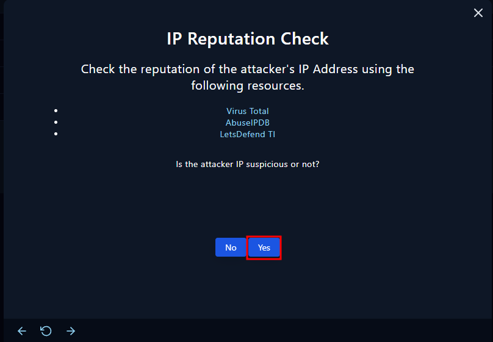

Si nos vamos a los logs y filtramos por esta dirección ip maliciosa, podemos ver que se realizó un ataque de fuerza bruta en el servicio RDP de este host Matthew.

Seleccionamos que si hay una respuesta de la ip del atacante a un puerto SSH o RDP porque el puerto que vemos en la imagen de arriba corresponde a rdp (3389)

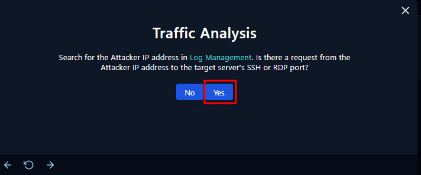

En la siguiente opción marcamos no, ya que si vemos los registros, todos los registros de la ip del atacante solo val al host de Matthew.

Si miramos los logs, vemos que el ataque de fuerza bruta fue exitosos y el atacante obtuvo acceso al sistema:

Así que seleccionamos que sí:

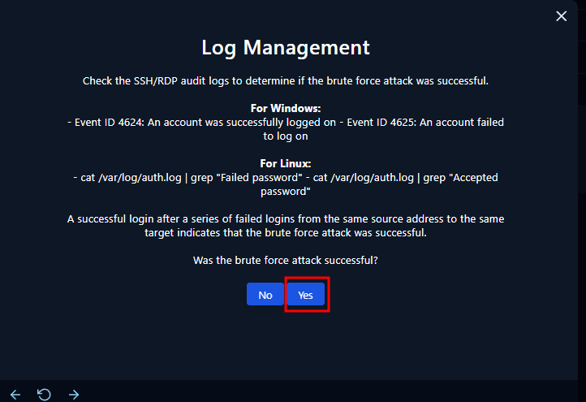

Deberiamos aislar el equipo de Matthew, para ello nos vamos a Endpoint Security y le damos a la opción de contener/aislar:

A contunuación seleccionamos los artifacts más importantes:

Y ya hemos terminado el playbook.

## Preguntas

### 2.a Durante la resolución del incidente ¿has tenido que realizar algún tipo de actuación para el restableciciomiento de servicios afectados por el incidente, con el objetivo de volver a la normalidad?

No fue necesario realizar acciones específicas para el restablecimiento de los servicios, ya que el enfoque estaba en la contención del ataque

### 3.a Tras trabajar en la resolución del incidente ¿Que acciones/actuaciones destacadas se han realizado para solucionar el incidente? 

Las principales acciones realizadas incluyeron la identificación y análisis de la IP de origen maliciosa, utilizando herramientas como Virustotal y AbuseIPDB, y la revisión de los registros para confirmar un ataque de fuerza bruta.

### 3.b Realizar un proceso de análisis de las actuaciones llevadas a cabo y obtener un registro de lecciones aprendidas, para finalmente concluir en las posibles mejoras que podrías plantear para tu plan/playbooks desarrollado en la práctica anterior.

El análisis reveló la importancia de mejorar las configuraciones de seguridad en los servicios expuestos, como RDP. Posibles mejoras para el playbook podrían incluir el fortalecimiento de las políticas de contraseñas y la implementación de la autenticación de dos factores.

### 4.a Seguro que en el proceso de análisis para obtener un registro de lecciones aprendidas anterior, has pensado como evitar que una situación similar se vuelva a repetir. ¿Que actuaciones has decidido para evitar que se pueda dar una situación similar?

Para prevenir incidentes similares, se decidió mejorar la monitorización de intentos de inicio de sesión fallidos y configurar alertas automáticas para patrones sospechosos, además de reforzar el uso de VPN para accesos remotos y la segmentación de la red.

## Incidente 3: SOC227 - Microsoft SharePoint Server Elevation of Privilege

### 1.a Clasificación según taxonomía

Ataque Web

### Criticidad

Critica

### Descripción del incidente

Esta actividad puede ser indicativa de un intento de explotar la vulnerabilidad CVE-2023-29357, que podría conducir a un acceso no autorizado y a una escalada de privilegios dentro del servidor de SharePoint.

### 1.b Acciones tomadas para su resolución

Lo primero que haremos será seleccionar el incidente, asignarnoslo y luego empezar el playbook y detectaremos las direcciones ip y los detalles más importantes del incidente:

Direccion Ip de origen: 39.91.166.222

Direccón Ip de destino: 172.16.17.233

Nombre de host: MS-SharePointServer

URL: /_api/web/siteusers

Lo primero que haremos como siempre meter la ip de origen en Virustotal y abuselPDB y nos dará que la ip es maliciosa:

Ahora nos preguntan si el trafico es malicioso y por lo que hemos visto en Virustotal, los logs y abuselPDB decimos que si es maliciosa:

Aún no estamos seguros del tipo de ataque, así que seleccionamos other (otro) en la siguiente pestaña.

Para saber si el incidente fue creado por un test de penetración nos iremos a buscar en la parte de correos y bandeja de entradas y vemos que nada coincide con las ips e información que tenemos, así que no es planeado.

La dirección de origen de la alerta pertenece a la red externa de la empresa, pero la dirección de destino pertenece a MS-SharePointServer. Así que el flujo que seleccionamos es Internet → Red de empresa.

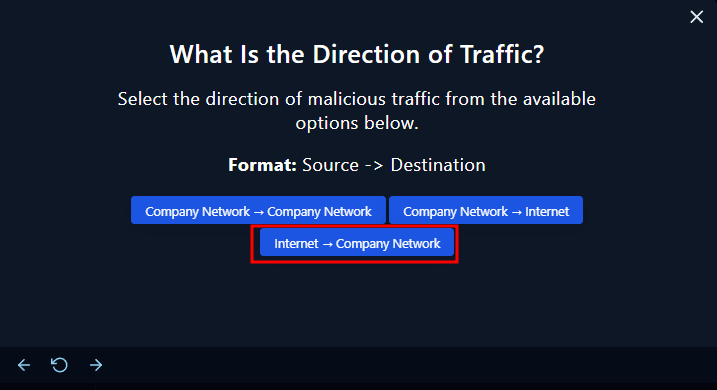

Para ver si el ataque fue exitoso o no, tendremos que ver los logs y los raw y veremos que el atacante accedió a las urls de /currentuser y /siteusers:

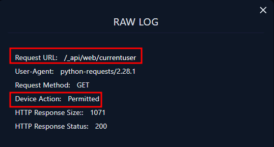

Para la parte de contención nos iremos a la ip 172.16.17.233 y lo contendremos:

Ahora añadimos los artifacts más importantes:

Y por ultimo si necesitamos escalar a nivel 2 para alguien más especializado.

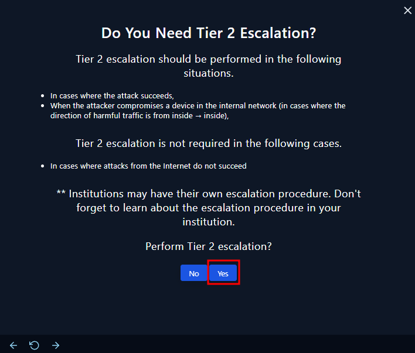

## Preguntas

### 2.a Durante la resolución del incidente ¿has tenido que realizar algún tipo de actuación para el restableciciomiento de servicios afectados por el incidente, con el objetivo de volver a la normalidad?

No se realizaron acciones específicas para el restablecimiento de servicios afectados, dado que el enfoque primario fue contener y analizar la actividad sospechosa y maliciosa.

### 3.a Tras trabajar en la resolución del incidente ¿Que acciones/actuaciones destacadas se han realizado para solucionar el incidente? 

Las acciones destacadas incluyeron la verificación de la IP de origen en Virustotal y AbuseIPDB, confirmación de que la actividad era maliciosa y la investigación de logs que mostraban acceso no autorizado a URLs críticas dentro del servidor SharePoint.

### 3.b Realizar un proceso de análisis de las actuaciones llevadas a cabo y obtener un registro de lecciones aprendidas, para finalmente concluir en las posibles mejoras que podrías plantear para tu plan/playbooks desarrollado en la práctica anterior.

El análisis llevado a cabo destacó la importancia de mejorar las alertas automáticas y la respuesta ante indicadores de compromiso. Se sugieren mejoras en las configuraciones de seguridad de SharePoint y en la formación del personal para detectar actividades sospechosas más rápidamente.

### 4.a Seguro que en el proceso de análisis para obtener un registro de lecciones aprendidas anterior, has pensado como evitar que una situación similar se vuelva a repetir. ¿Que actuaciones has decidido para evitar que se pueda dar una situación similar?

Para prevenir futuros incidentes similares, se ha decidido aumentar la monitorización de las URLs críticas de SharePoint, fortalecer las políticas de acceso y implementar mejores prácticas de seguridad como la segmentación de la red y el endurecimiento de endpoints.

## Incidente 4: SOC251 - Quishing Detected (QR Code Phishing)

### 1.a Clasificación según taxonomía

Intercambio

### Criticidad

Media

### Descripción del incidente

Se trata de un codigo QR que no es legitimo y tiene un phishing.

### 1.b Acciones tomadas para su resolución

Lo primero que haremos será seleccionar el incidente, asignarnoslo y luego empezar el playbook y detectaremos las direcciones ip y los detalles más importantes del incidente:

Direccion SMTP: 158.69.201.47

Correo de origen: security@microsecmfa.com

Dirección de destinos : Claire@letsdefend.io

Luego tendremos que irnos a virustotal e introducir la ip 158.69.201.47 y vemos que es maliciosa y que saltan varios antivirus:

Ahora haremos una busqueda por el correo security@microsecmfa.com y nos saldrá un mensaje con un qr de microsoft:

A continuación nos descargamos la imagen del QR y lo metemos en cyberchef y nos dará la siguiente dirección: https://ipfs.io/ipfs/Qmbr8wmr41C35c3K2GfiP2F8YGzLhYpKpb4K66KU6mLmL4#

Si buscamos esa url en virustotal nos sale que es maliciosa y que lo más probable es que sea phishing.

Ahora que sabemos que es malicioso ese correo, lo eliminamos en Let's Defend.

Ahora tenemos que verificar si el usuario accedió a esa URL del QR, para ello nos vamos a Endpoint Security y vemos la ip de Claire y activamos la contención:

Aquí elegiremos la opción de Phishing for Information.

Vemos que el remitente de correo electronico y la URL del código QR es externa, por lo tanto la opción correcta es externa.

En virustotal hemos visto que la ip es maliciosa, así que la ip del atacante si es sospechosa:

Comprobamos si alguien más recibió el correo electronico con el phishing, pero vemos que solo lo recibió Claire, así que no hay mas de un usuario afectado.

Ya hemos contenido al host, haremos esto para evitar más amenazas, ya que no podemos comprobar al 100% si el usuario llegó a acceder a la URL maliciosa.

Y estos serían los artifacts a poner:

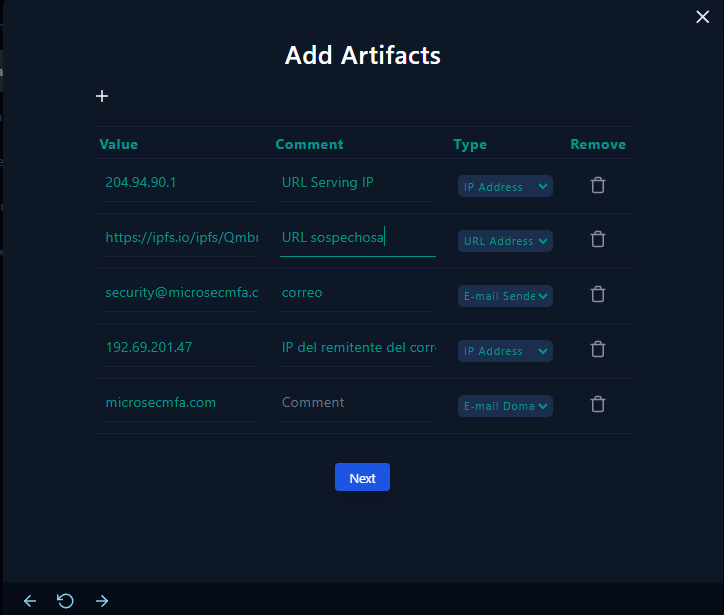

Y ya habriamos terminado el playbook.

## Preguntas

### 2.a Durante la resolución del incidente ¿has tenido que realizar algún tipo de actuación para el restableciciomiento de servicios afectados por el incidente, con el objetivo de volver a la normalidad?

No se requirieron acciones específicas para el restablecimiento de los servicios ya que el incidente se centró en la detección y contención de un correo de phishing.

### 3.a Tras trabajar en la resolución del incidente ¿Que acciones/actuaciones destacadas se han realizado para solucionar el incidente? 

Las principales acciones incluyeron la verificación de la dirección IP y del correo de origen en Virustotal, la descodificación del QR para identificar la URL maliciosa y la eliminación del correo malicioso.

### 3.b Realizar un proceso de análisis de las actuaciones llevadas a cabo y obtener un registro de lecciones aprendidas, para finalmente concluir en las posibles mejoras que podrías plantear para tu plan/playbooks desarrollado en la práctica anterior.

El análisis destacó la necesidad de mejorar los filtros de correo y la educación del usuario sobre seguridad. Mejoras en el playbook podrían incluir automatización en la detección y respuesta a correos sospechosos, así como pruebas regulares de penetración y simulacros de phishing para mejorar la conciencia de seguridad.

### 4.a Seguro que en el proceso de análisis para obtener un registro de lecciones aprendidas anterior, has pensado como evitar que una situación similar se vuelva a repetir. ¿Que actuaciones has decidido para evitar que se pueda dar una situación similar?

Para prevenir futuros incidentes similares, se ha decidido implementar mejores prácticas de seguridad, como la validación y bloqueo de URLs en QRs sospechosos, y la mejora de la capacitación de los empleados sobre los riesgos del phishing.

## Incidente 5: Passwd Found in Requested URL - Possible LFI Attack

### 1.a Clasificación según taxonomía

Analista de seguridad 

### Criticidad

Alta

### Descripción del incidente

La URL contiene contraseña.

### 1.b Acciones tomadas para su resolución

Lo primero que haremos será seleccionar el incidente, asignarnoslo y luego empezar el playbook y detectaremos las direcciones ip y los detalles más importantes del incidente:

Direccion IP Destino: 172.16.17.13

Dirección IP Origen: 106.55.45.162

Url solicitada: `https://172.16.17.13/?file=../../../../etc/passwd`

Si nos vamos al apartado de los y buscamos esta url en los logs, veremos más información sobre esta url y si nos fijamos el servidor dió un código de error 500, lo que significa que dió un error interno del servidor y por lo tanto el ataque falló.

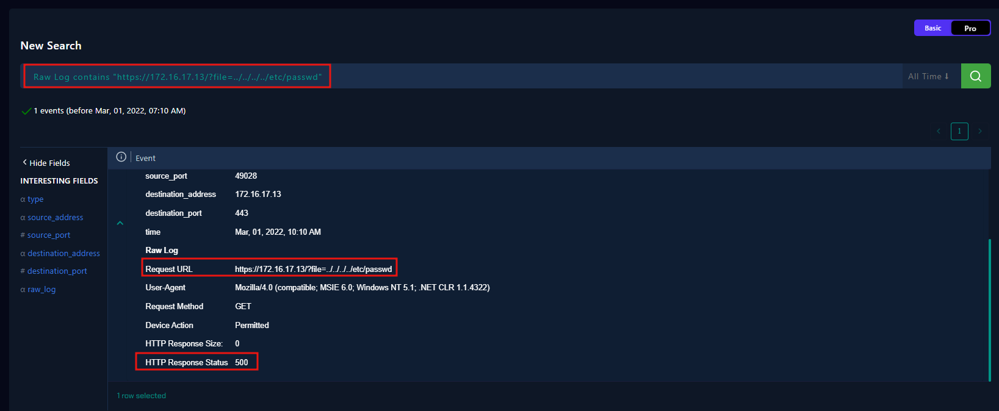

Ahora metemos en virustotal la ip del atacante y veremos que varios detalles sobre que la ip es maliciosa y que viene de China:

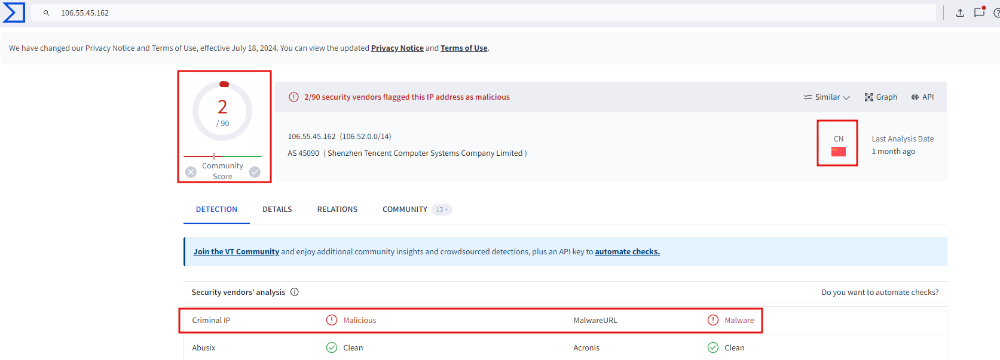

Si miramos en el apartado de correos y en el de comandos, tampoco vemos nada sospechoso por lo que podemos concluir que fue un falso positivo.

Por  lo tanto deducimos que:

- El ataque falló
- La dirección del tráfico es de: Internet a la red empresarial
- No es una prueba planificada
- Inclusión de archivos locales
- Tráfico malicioso
- No es necesario escalar al Nivel 2 ya que hemos comprobado que el ataque falló y fue un falso positivo.

Y ya habriamos terminado el playbook.

## Preguntas

### 2.a Durante la resolución del incidente ¿has tenido que realizar algún tipo de actuación para el restableciciomiento de servicios afectados por el incidente, con el objetivo de volver a la normalidad?

No se realizaron acciones específicas para el restablecimiento de los servicios, ya que el ataque resultó en un error y fue catalogado como un falso positivo.

### 3.a Tras trabajar en la resolución del incidente ¿Que acciones/actuaciones destacadas se han realizado para solucionar el incidente? 

Las acciones destacadas incluyeron la revisión de los logs para identificar y analizar la URL maliciosa y la verificación de la IP de origen en Virustotal, que confirmó su naturaleza maliciosa pero procedente de un ataque que no tuvo éxito.

### 3.b Realizar un proceso de análisis de las actuaciones llevadas a cabo y obtener un registro de lecciones aprendidas, para finalmente concluir en las posibles mejoras que podrías plantear para tu plan/playbooks desarrollado en la práctica anterior.

El análisis subrayó la importancia de tener robustos sistemas de detección de anomalías y la validación de URLs para evitar falsos positivos. Mejoras en el playbook podrían incluir la implementación de mejores filtros de URL y la educación continuada sobre las últimas técnicas de ataques LFI.

### 4.a Seguro que en el proceso de análisis para obtener un registro de lecciones aprendidas anterior, has pensado como evitar que una situación similar se vuelva a repetir. ¿Que actuaciones has decidido para evitar que se pueda dar una situación similar?

Para prevenir futuros incidentes similares, se ha decidido fortalecer las políticas de seguridad de las aplicaciones web, incluyendo la validación de todas las entradas de los usuarios para evitar manipulaciones maliciosas de las URLs.

## Incidente 6: SOC250 - APT35 HyperScrape Data Exfiltration Tool Detected

### 1.a Clasificación según taxonomía

Analista de seguridad 

### Criticidad

Media

### Descripción del incidente

Se han identificado patrones de comportamiento inusuales o sospechosos vinculados al hash, lo que indica posibles intenciones maliciosas.

### 1.b Acciones tomadas para su resolución

Lo primero que haremos será seleccionar el incidente, asignarnoslo y luego empezar el playbook y detectaremos las direcciones ip y los detalles más importantes del incidente:

Dirección IP : 172.16.17.72

Nombre de Host/Usuario : Arthur

Nombre del proceso : EmailDownloader.exe

Si nos vamos a los logs y miramos la ip 172.16.17.72 veremos que hay varios logs que nos interesan:

Ahora nos vamos al apartado de Endpoint y páginas de seguridad de correo electrónico.

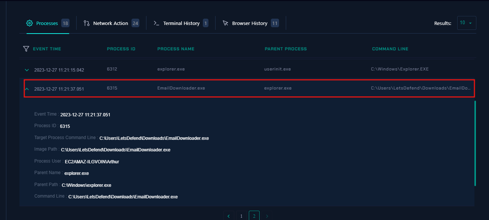

Y seleccionamos la siguiente opción, porque la herramienta hyperscrape se utiliza para robar datos del usuario.

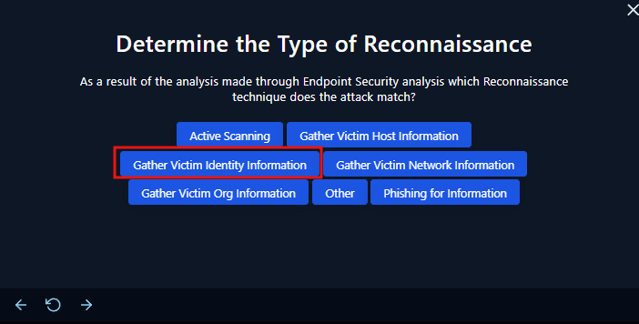

Ahora vamos a virustotal y vemos que las direcciones ips son externas y son maliciosas:

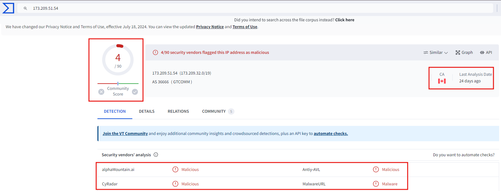

Aquí seleccionamos la opción de externa:

Si miramos en la página de Endpoint Security veremos que solo el host de Arthur fue afectado, y determinamos por tanto que el alcance fue solo a un dispositivo:

Y como vemos que el ataque tuvo éxito, pues aislamos el dispositivo:

Y por último aquí elegimos que sí, que tenemos que contenerlo:

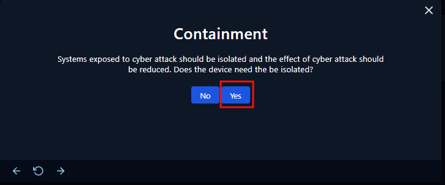

Y ya habriamos terminado el playbook.

## Preguntas

### 2.a Durante la resolución del incidente ¿has tenido que realizar algún tipo de actuación para el restableciciomiento de servicios afectados por el incidente, con el objetivo de volver a la normalidad?

No se menciona específicamente la necesidad de restablecer servicios, pero se tomó acción inmediata para contener la amenaza, lo que podría incluir el aislamiento de servicios afectados como medida preventiva.

### 3.a Tras trabajar en la resolución del incidente ¿Que acciones/actuaciones destacadas se han realizado para solucionar el incidente? 

Las acciones destacadas incluyeron la revisión de logs para identificar actividad sospechosa relacionada con el proceso EmailDownloader.exe y la verificación de la dirección IP en Virustotal, que confirmó la naturaleza maliciosa de la conexión.

### 3.b Realizar un proceso de análisis de las actuaciones llevadas a cabo y obtener un registro de lecciones aprendidas, para finalmente concluir en las posibles mejoras que podrías plantear para tu plan/playbooks desarrollado en la práctica anterior.

El análisis resaltó la necesidad de mejorar la detección y respuesta rápida a herramientas de exfiltración de datos. Mejoras en el playbook podrían incluir la implementación de sistemas avanzados de detección de anomalías y la integración de respuestas automáticas a patrones de comportamiento conocidos de APTs.

### 4.a Seguro que en el proceso de análisis para obtener un registro de lecciones aprendidas anterior, has pensado como evitar que una situación similar se vuelva a repetir. ¿Que actuaciones has decidido para evitar que se pueda dar una situación similar?

Para prevenir futuros incidentes similares, se decidió fortalecer los controles de seguridad en el correo electrónico y en puntos finales, además de realizar capacitaciones regulares sobre amenazas avanzadas persistentes y cómo detectarlas tempranamente.

## Incidente 7: SOC164 - Suspicious Mshta Behavior

### 1.a Clasificación según taxonomía

Analista de seguridad 

### Criticidad

Alta

### Descripción del incidente

Archivo hta de baja reputación fue ejecutado a través de mshta.exe

### 1.b Acciones tomadas para su resolución

Lo primero que haremos será seleccionar el incidente, asignarnoslo y luego empezar el playbook y detectaremos las direcciones ip y los detalles más importantes del incidente:

Dirección IP : 172.16.17.38

Nombre de Host/Usuario : Roberto

Nombre del proceso : mshta.exe

MD5 Hash: 6685c433705f558c5535789234db0e5a

Si nos vamos a virustotal y analizamos el hash veremos que es bastante malicioso:

Ahora nos vamos al apartado de Endpoint y buscamos por Roberto y veremos algunos comandos sospechosos:

En los comandos podemos ver que intenta descargar y ejecutar algunos procesos en Powersheel desde una URL de Internet, podemos deducir que el comando fue el resultado de un intento malicioso.

Si nos vamos a los logs y filtramos por la ip, nos saldrá esta información de una solicitud 404.

Por lo tanto deducimos que fue sospechoso:

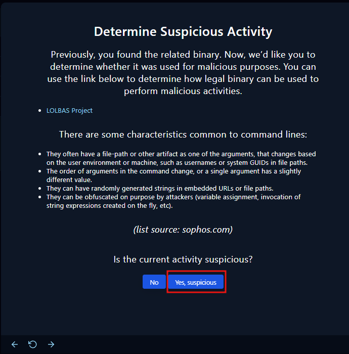

Lo que significa que el código malicioso en server.txt no se ejecutó, aunque el script ofuscado intentó acceder a él. 

La actividad fue sospechosa por ejecución de comandos:

Para esta pregunta de quién realizó esta acción, pudimos ver en el historial de procesos que fue iniciado por explorer.exe, lo que implica que fue una ejecución interactiva por parte del usuario final.

Ahora vamos a contener el host: 

Y ya habriamos terminado el playbook.

## Preguntas

### 2.a Durante la resolución del incidente ¿has tenido que realizar algún tipo de actuación para el restableciciomiento de servicios afectados por el incidente, con el objetivo de volver a la normalidad?

No se mencionan acciones específicas para el restablecimiento de servicios ya que el enfoque principal fue la contención y análisis del comportamiento sospechoso.

### 3.a Tras trabajar en la resolución del incidente ¿Que acciones/actuaciones destacadas se han realizado para solucionar el incidente? 

Las acciones destacadas incluyeron el análisis del hash del archivo sospechoso en Virustotal y la revisión de los comandos ejecutados en el host de Roberto, identificando intentos de descarga y ejecución maliciosa.

### 3.b Realizar un proceso de análisis de las actuaciones llevadas a cabo y obtener un registro de lecciones aprendidas, para finalmente concluir en las posibles mejoras que podrías plantear para tu plan/playbooks desarrollado en la práctica anterior.

El análisis subrayó la importancia de mejorar los sistemas de detección de malware y la respuesta a indicadores de ataque. Se sugieren mejoras como la actualización de las firmas de antivirus y la configuración de alertas automáticas para comportamientos anómalos.

### 4.a Seguro que en el proceso de análisis para obtener un registro de lecciones aprendidas anterior, has pensado como evitar que una situación similar se vuelva a repetir. ¿Que actuaciones has decidido para evitar que se pueda dar una situación similar?

Para prevenir futuros incidentes similares, se decidió fortalecer las políticas de seguridad del endpoint, incluyendo la restricción de ejecución de scripts y la mejora de la monitorización de la actividad de los procesos sospechosos.

## Incidente 8: SOC166 - Javascript Code Detected in Requested URL

### 1.a Clasificación según taxonomía

Analista de seguridad 

### Criticidad

Media

### Descripción del incidente

Código de Javascript detectado en URL.

### 1.b Acciones tomadas para su resolución

Lo primero que haremos será seleccionar el incidente, asignarnoslo y luego empezar el playbook y detectaremos las direcciones ip y los detalles más importantes del incidente:

Dirección IP destino : 172.16.17.17

Dirección IP origen : 112.85.42.13

URL solicitada : `https://172.16.17.17/search/?q=<$script>javascript:$alert(1)<$/script>`

Si nos vamos al tráfico HTTP de la alerta y buscamos por la URL solicitada, vemos que tiene el siguiente payload XSS:

`<$script>javascript:$alert(1)<$script>`

Por lo tanto el tráfico es malicioso:

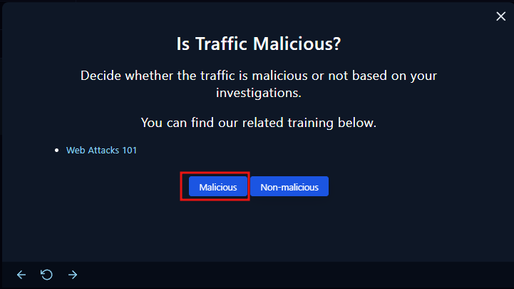

Y el tipo de ataque es un XSS:

Si nos vamos a la pestaña de Email Security y miramos no hay ningún correo que indique que sea un test planificado, por lo tanto no lo es:

La dirección IP del atacante es 112.85.42.13, por lo que pertenece a una IP pública. Entonces, la dirección del tráfico es Internet -> Company Network.

Ahora nos vamos al apartado de Endpoint Security y veremos los distintos historiales del navegador y de la terminal, si vemos el payload del XSS vemos que no se representaba ningún intento para compremeter el Web Server, así que el host no fue comprometido.

Por lo que dijimos antes, esta alerta no necesita una escalada al siguiente nivel:

Y ya habriamos terminado el playbook.

## Preguntas

### 2.a Durante la resolución del incidente ¿has tenido que realizar algún tipo de actuación para el restableciciomiento de servicios afectados por el incidente, con el objetivo de volver a la normalidad?

No se realizaron acciones específicas para el restablecimiento de los servicios ya que el incidente no comprometió el servidor web, solo se identificó y clasificó el intento de ataque.

### 3.a Tras trabajar en la resolución del incidente ¿Que acciones/actuaciones destacadas se han realizado para solucionar el incidente? 

Las acciones destacadas incluyeron la identificación de la naturaleza maliciosa del tráfico mediante la revisión de la URL con código JavaScript inyectado y la confirmación de que no era un test planificado.

### 3.b Realizar un proceso de análisis de las actuaciones llevadas a cabo y obtener un registro de lecciones aprendidas, para finalmente concluir en las posibles mejoras que podrías plantear para tu plan/playbooks desarrollado en la práctica anterior.

El análisis reveló la importancia de mejorar los filtros de URL y las prácticas de seguridad en los navegadores web y servidores. Se sugiere mejorar la detección de scripts maliciosos y configurar alertas para intentos similares en el futuro.

### 4.a Seguro que en el proceso de análisis para obtener un registro de lecciones aprendidas anterior, has pensado como evitar que una situación similar se vuelva a repetir. ¿Que actuaciones has decidido para evitar que se pueda dar una situación similar?

Para prevenir futuros incidentes similares, se decidió implementar mejoras en la validación de entradas en formularios y URLs, aumentar la educación en seguridad para los empleados sobre los riesgos de XSS y fortalecer las políticas de seguridad web.

## Incidente 9: SOC169 - Possible IDOR Attack Detected

### 1.a Clasificación según taxonomía

Analista de seguridad 

### Criticidad

Media

### Descripción del incidente

Se han encontrado solicitudes consecutivas a la misma página

### 1.b Acciones tomadas para su resolución

Lo primero que haremos será seleccionar el incidente, asignarnoslo y luego empezar el playbook y detectaremos las direcciones ip y los detalles más importantes del incidente:

Dirección IP destino : 172.16.17.15

Dirección IP origen : 134.209.118.137

Si nos vamos al apartado de Log Management podremos ver que el atacante esta cambiando los parametros del id del usuario, lo intenta con el user_id=1, user_id=2, user_id=3, user_id=4, user_id=5.

Sabemos por la investigación de alertas y registros lo siguiente:

- La IP de destino es un servidor web con nombre de host WebServer1005, el usuario principal es webadmin35.
- La IP de origen tiene un impacto malicioso en virustotal.
- El tráfico es entrante.

Como vimos antes con el tema del atacante y los parametros del user_id, deducimos que el tráfico es malicioso:

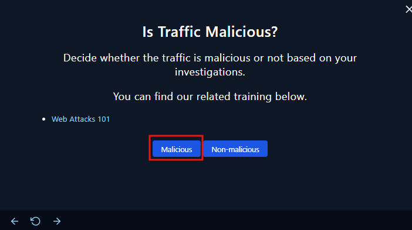

El tipo de ataque es IDOR:

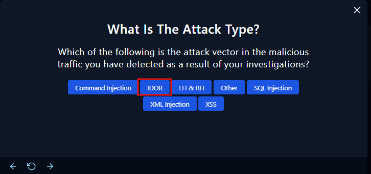

Vemos en el apartado de Correo que no hay ningun correo indicando que el ataque fuera planeado, por lo tanto no lo es:

La dirección de trafico es de Internet a la red de la compañía:

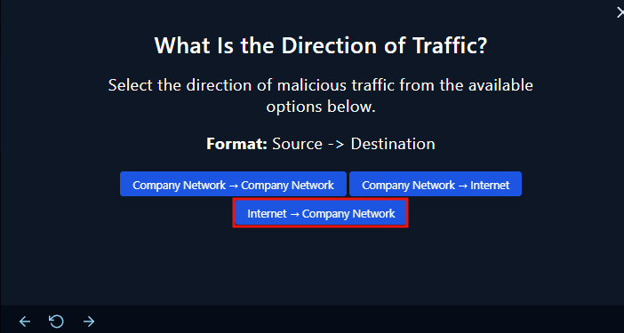

Si nos fijamos en la captura de RAW LOG de antes veremos que el HTTP Response Status es 200, eso significa que el ataque fue exitoso:

En la parte de contener, tendremos que irnos al host y contener el WebServer1005:

Y ahora pondremos este artifact:

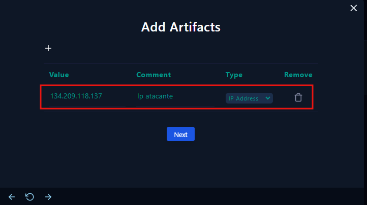

Como vemos que el ataque fue exitoso, la vulnerabilidad IDOR debe derivarse al equipo de aplicación/web para su solución/correción.

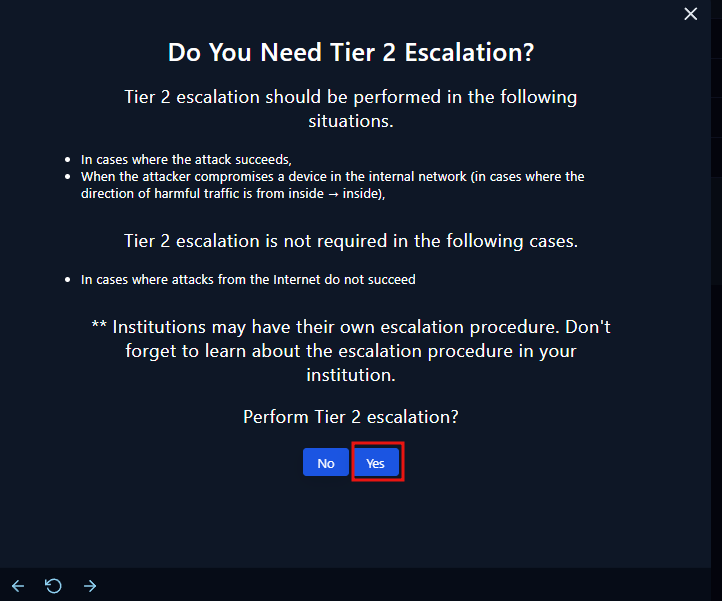

Y ya habriamos terminado el playbook.

## Preguntas

### 2.a Durante la resolución del incidente ¿has tenido que realizar algún tipo de actuación para el restableciciomiento de servicios afectados por el incidente, con el objetivo de volver a la normalidad?

No se mencionan acciones específicas para el restablecimiento de los servicios, ya que el enfoque principal fue la contención y análisis del ataque.

### 3.a Tras trabajar en la resolución del incidente ¿Que acciones/actuaciones destacadas se han realizado para solucionar el incidente? 

Las acciones destacadas incluyeron el análisis de los registros de log para identificar los intentos de manipulación de parámetros de usuario y la verificación de la IP de origen en Virustotal, confirmándose como maliciosa.

### 3.b Realizar un proceso de análisis de las actuaciones llevadas a cabo y obtener un registro de lecciones aprendidas, para finalmente concluir en las posibles mejoras que podrías plantear para tu plan/playbooks desarrollado en la práctica anterior.

El análisis resaltó la necesidad de mejorar la gestión y control de acceso a los datos de usuarios. Mejoras en el playbook podrían incluir la implementación de validaciones más estrictas en el servidor para parámetros críticos y la revisión periódica de los controles de acceso.

### 4.a Seguro que en el proceso de análisis para obtener un registro de lecciones aprendidas anterior, has pensado como evitar que una situación similar se vuelva a repetir. ¿Que actuaciones has decidido para evitar que se pueda dar una situación similar?

Para prevenir futuros incidentes similares, se decidió fortalecer las políticas de seguridad en la gestión de identidades y accesos, incluyendo la implementación de controles más robustos en las aplicaciones web para detectar y bloquear automáticamente solicitudes sospechosas.

## Incidente 10: SOC235 - Atlassian Confluence Broken Access Control 0-Day CVE-2023-22515

### 1.a Clasificación según taxonomía

Analista de seguridad 

### Criticidad

Alta

### Descripción del incidente

Esta actividad puede ser indicativa de un intento de explotar la vulnerabilidad CVE-2023-22515, lo que podría conducir a la creación de un nuevo usuario administrador.

### 1.b Acciones tomadas para su resolución

Lo primero que haremos será seleccionar el incidente, asignarnoslo y luego empezar el playbook y detectaremos las direcciones ip y los detalles más importantes del incidente:

Dirección IP destino: 172.16.17.234

Dirección IP origen:  43.130.1.222

Nombre de Host: Confluence Data Center

URL solicitada: /server-info.action?bootstrapStatusProvider.applicationConfig.setupComplete=false

Si nos vamos al apartado de Log Management podremos vervarios logs intenresantes y en Threat Intel veremos que tiene marcado como TAG que es malicoso.

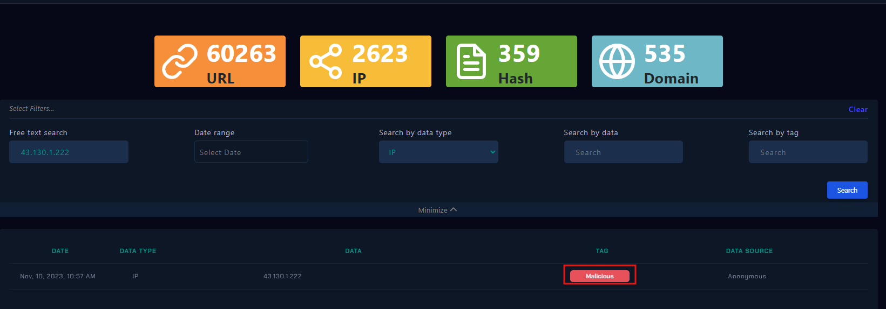

Por lo tanto marcamos que el tráfico es malicioso, también si lo miramos en Virustotal vemos que es malicioso:

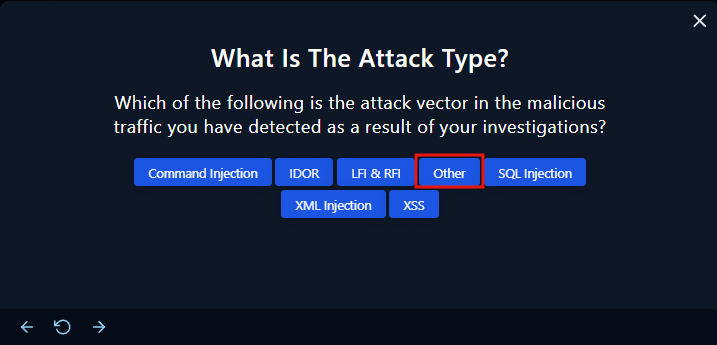

En el tipo de ataque ponemos Otro, ya que de lo que hemos investigado no pertenece a ninguno de los otros ataques.

La dirección de origen 43.130.1.222 de la alerta pertenece a la red externa de la empresa. Pero 172.16.17.234 es la dirección de destino interna, por lo tanto el flujo va de Internet a la red de la compañía.

Aquí en el RAW Log vemos que el código de respuesta es un 200.

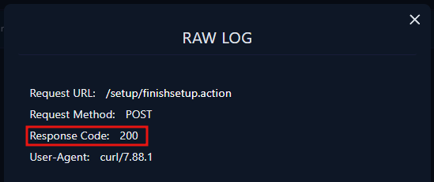

Por lo tanto el ataque fue exitoso.

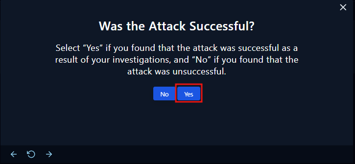

Tendremos que aislar el host:

Ahora pondremos los siguientes artifacts:

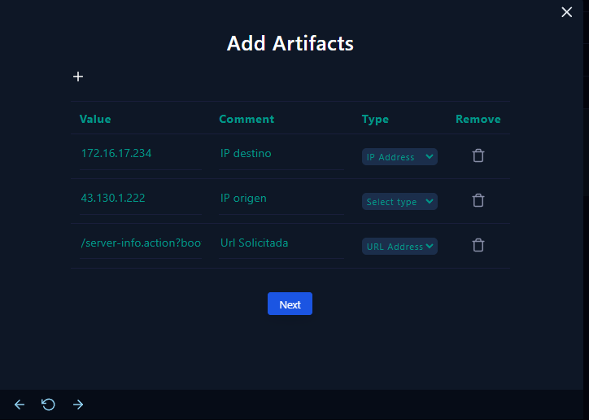

Y por último escalamos a nivel 2 el caso, ya que ha sido exitoso y requiere un análisis de mayor nivel para su resolución.

Y ya habríamos terminado el playbook.

## Preguntas

### 2.a Durante la resolución del incidente ¿has tenido que realizar algún tipo de actuación para el restableciciomiento de servicios afectados por el incidente, con el objetivo de volver a la normalidad?

No se mencionan acciones específicas para el restablecimiento de los servicios, ya que el foco estaba en contener y analizar el incidente.

### 3.a Tras trabajar en la resolución del incidente ¿Que acciones/actuaciones destacadas se han realizado para solucionar el incidente? 

Las acciones destacadas incluyeron la revisión de los registros de log para identificar la solicitud maliciosa y la verificación de la IP de origen en Virustotal, confirmando su naturaleza maliciosa.

### 3.b Realizar un proceso de análisis de las actuaciones llevadas a cabo y obtener un registro de lecciones aprendidas, para finalmente concluir en las posibles mejoras que podrías plantear para tu plan/playbooks desarrollado en la práctica anterior.

El análisis resaltó la necesidad de mejorar la monitorización y las respuestas automáticas ante vulnerabilidades conocidas. Se sugieren mejoras como la actualización y fortalecimiento de las configuraciones de seguridad y la implementación de parches de forma más proactiva.

### 4.a Seguro que en el proceso de análisis para obtener un registro de lecciones aprendidas anterior, has pensado como evitar que una situación similar se vuelva a repetir. ¿Que actuaciones has decidido para evitar que se pueda dar una situación similar?

Para prevenir futuros incidentes similares, se decidió fortalecer las políticas de seguridad en las aplicaciones críticas y realizar auditorías de seguridad más frecuentes para detectar y remediar configuraciones incorrectas o vulnerabilidades sin parchear.

