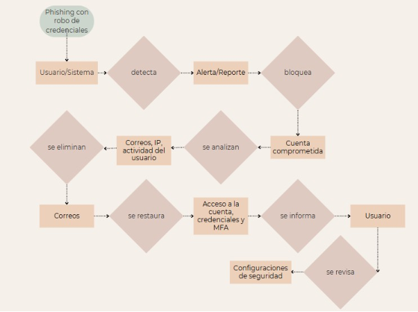
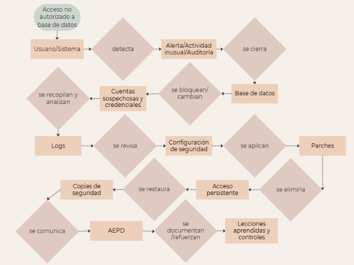
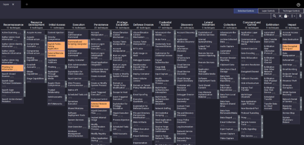
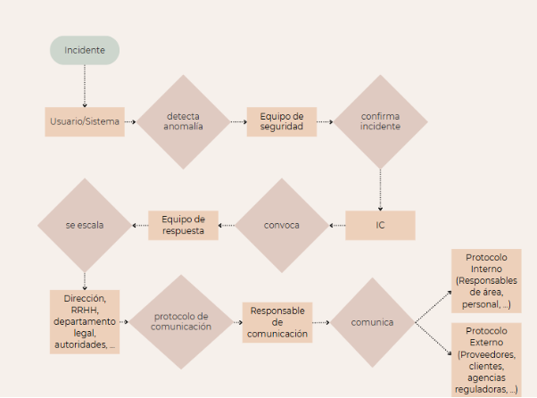

**Índice**

[Índice................................................................................................................................... 1](#_page0_x72.00_y90.00)

1. [Introducción..................................................................................................................... 2](#_page1_x72.00_y72.00)
1. [Plan de respuesta............................................................................................................ 2](#_page1_x72.00_y221.65)
1. [Fases del plan de respuesta..................................................................................... 2](#_page1_x72.00_y307.15)
1. [Estructura del equipo de respuesta..........................................................................3](#_page2_x72.00_y113.30)
3. [Playbooks........................................................................................................................ 3](#_page2_x72.00_y422.65)
1. [Infección por Ransomware.......................................................................................3](#_page2_x72.00_y520.80)
1. [Phishing con robo de credenciales........................................................................... 4](#_page3_x72.00_y424.00)
1. [Acceso no autorizado a base de datos..................................................................... 5](#_page4_x72.00_y425.00)
1. [Ataque de denegación de servicio (DDoS)...............................................................6](#_page5_x72.00_y426.00)
4. [Respuesta a las preguntas.............................................................................................. 7](#_page6_x72.00_y433.00)

[1.a Relación entre las matrices MITRE ATT&CK / RE&CT y el plan de respuesta planteado........................................................................................................................ 7 ](#_page6_x72.00_y468.55)[1.b Playbooks identificados como necesarios y justificación..........................................9](#_page8_x72.00_y524.05)

[1.c Cobertura de todas las fases del plan de respuesta...............................................10 ](#_page9_x72.00_y201.20)[2.a Flujo de toma de decisiones y escalado................................................................. 10](#_page9_x72.00_y669.75)

5. [Conclusiones................................................................................................................. 12](#_page11_x72.00_y240.50)
5. [Bibliografía..................................................................................................................... 12](#_page11_x72.00_y629.00)
1. **Introducción**

A continuación se presenta el plan de respuesta a incidentes realizado por “Grupo 4 Company”, elaborado para el proyecto 4.01. La base de todo este trabajo se ha llevado a cabo a partir del análisis de riesgos realizado mediante la herramienta PILAR,[ la ](https://pilar.ccn-cert.cni.es/)identificación de activos, el plan director de seguridad, y las matrices MITRE ATT&CK y RE&CT. El objetivo principal ha sido crear un sistema de actuación eficaz ante incidentes, garantizar la continuidad del servicio y reforzar la capacidad de resiliencia de la empresa. Esta iniciativa permite establecer procedimientos claros, estructurados y sostenibles frente a los incidentes que puedan afectar a la organización.

2. **Plan de respuesta**

Este plan contempla cada fase del ciclo de vida de cualquier tipo de incidente de ciberseguridad, cubriendo a los mismos desde la preparación hasta el aprendizaje posterior al incidente.

1. **Fases del plan de respuesta**

**Preparación:** Esta fase implica que la organización adopte una actitud proactiva frente a los incidentes. Se desarrollan programas de formación y concienciación en ciberseguridad para todo el personal, que es fundamental para reconocer señales tempranas de ataques. Además, se implantan controles técnicos como sistemas de detección y respuesta (SIEM, EDR), firewalls, segmentación de red y copias de seguridad. También se elabora un inventario de activos críticos, se definen los responsables de cada uno y se crean políticas claras sobre cómo actuar ante incidentes.

**Identificación:** Cuando ocurre un evento inusual, como un acceso no autorizado o un comportamiento anómalo en la red, este debe detectarse lo antes posible. Esta fase se basa en el uso de herramientas automatizadas que generan alertas y en la capacidad del personal para reconocer actividades sospechosas. Una vez identificado un posible incidente, este se valida y se documenta oficialmente, iniciando así el proceso de respuesta.

**Contención:** El objetivo es limitar el alcance del incidente para que no se propague. Por ejemplo, si un ordenador se infecta con malware, debe aislarse de la red inmediatamente. Se pueden aplicar reglas en el firewall, bloquear cuentas comprometidas, detener servicios o desconectar sistemas. Esta contención puede ser temporal (para análisis) o permanente (si se decide eliminar el sistema afectado).

**Erradicación:** Una vez que el incidente ha sido contenido, se procede a eliminar completamente cualquier rastro del atacante o software malicioso. Esto puede implicar desinstalar malware, eliminar cuentas creadas por el atacante, actualizar software vulnerable o incluso reinstalar sistemas comprometidos. Esta fase también incluye analizar cómo ocurrió el incidente para evitar su repetición.

**Recuperación:** Tras eliminar la amenaza, se restauran los servicios interrumpidos. Se recuperan los datos desde copias de seguridad fiables, se verifica que los sistemas funcionan correctamente y se monitoriza de cerca para asegurar que no haya recaídas. Esta fase es crítica para volver a la normalidad operativa sin comprometer la seguridad.

**Lecciones aprendidas:** Una vez finalizado el incidente, se debe realizar una revisión completa del caso. Se documentan todas las acciones realizadas, los tiempos de respuesta, las decisiones tomadas y los errores cometidos. Esta información se utiliza para actualizar el plan, mejorar las políticas y realizar formación específica. Es una oportunidad de mejora continua y de aprendizaje organizacional.

2. **Estructura del equipo de respuesta**

El equipo de respuesta a incidentes se compone de varios roles clave que aseguran una coordinación eficaz:

- **Coordinador de incidentes ó “Incident Commander (IC)”:** Es la figura principal durante un incidente. Toma decisiones estratégicas, coordina a los equipos y comunica el estado del incidente a la dirección.
- **Adjunto al responsable de incidentes ó “Deputy IC”:** Suple al IC en caso de ausencia y colabora estrechamente con él en la gestión táctica del incidente.
- **Especialistas técnicos ó “SME (Subject Matter Experts)”:** Son los expertos técnicos en las áreas afectadas: redes, servidores, aplicaciones, bases de datos, seguridad, etc. También se incluyen expertos legales o de recursos humanos si la situación lo requiere.
- **Redactor ó “Scribe”:** Se encarga de registrar cada acción, decisión y hallazgo durante el proceso. Su labor permite construir la documentación para las lecciones aprendidas.
- **Responsable de comunicación ó “Liaison de Comunicación”:** Gestiona la comunicación interna y externa. Se asegura de que la información llegue a los interesados sin generar alarmismo, y coordina con autoridades si es necesario.

Esta estructura permite una respuesta organizada, rápida y eficaz, minimizando el impacto que cualquier incidente pueda provocar.

3. **Playbooks**

Para facilitar la respuesta organizada ante los distintos tipos de incidentes, se han desarrollado una serie de guías específicas o playbooks. Cada uno de ellos está adaptado a un escenario concreto y describe, de manera detallada, las acciones que deben realizarse en cada fase del ciclo de vida del incidente en cuestión.

1. **Infección por Ransomware**

Una infección por ransomware representa una de las amenazas más críticas, ya que puede cifrar información sensible, interrumpir los servicios y dañar gravemente la reputación de la organización. En este caso, la respuesta comienza con la identificación de indicios como archivos cifrados, mensajes de rescate o alertas de herramientas de seguridad.

Una vez detectado, el dispositivo afectado se aísla inmediatamente de la red para evitar que el ransomware se propague a otros sistemas. Esto puede implicar la desconexión física, el aislamiento lógico o la desactivación del usuario. Posteriormente, se lleva a cabo una erradicación completa del malware, lo que implica el análisis forense para identificar el punto de entrada, así como la limpieza del sistema o su reinstalación.

La recuperación implica restaurar los datos desde copias de seguridad limpias y verificadas. Es crucial asegurarse de que los backups no estén comprometidos. Finalmente, se comunica el incidente a la dirección, a los afectados (si corresponde) y a las autoridades, y se lleva a cabo una sesión de revisión para documentar el caso y reforzar los controles existentes.

2. **Phishing con robo de credenciales**

El phishing es una técnica muy común mediante la cual los atacantes intentan engañar a los usuarios para que revelen información confidencial. En este escenario, se detecta un posible phishing a través de una alerta del sistema o el reporte de un usuario.

La respuesta comienza bloqueando inmediatamente la cuenta comprometida y supervisando las sesiones activas. Luego se analizan los correos maliciosos, se eliminan si es posible, y se recopila información sobre la IP de acceso y la actividad reciente del usuario. Una vez neutralizado el riesgo, se restaura el acceso a la cuenta con nuevas credenciales y se aplica autenticación multifactor (MFA).

Como parte del cierre, se ofrece formación al usuario y se revisan las configuraciones de seguridad del sistema de correo para evitar nuevos ataques similares. Este tipo de incidentes son especialmente peligrosos cuando se trata de usuarios con privilegios elevados, por lo que se debe usar siempre el principio de “mínimos privilegios” (least privileges).

3. **Acceso no autorizado a base de datos**

Cuando un atacante consigue acceder a una base de datos sin autorización, existe un grave riesgo de robo o modificación de información crítica o confidencial. La detección puede ocurrir por medio de alertas del sistema de monitorización, actividad inusual o una auditoría rutinaria.

En respuesta, se procede a la contención cerrando el acceso a la base de datos, bloqueando cuentas sospechosas y cambiando las credenciales comprometidas. Se recopilan los logs del sistema y se realiza un análisis para determinar el alcance del acceso. La erradicación del incidente incluye revisar la configuración de seguridad, aplicar parches si existían vulnerabilidades y eliminar cualquier acceso persistente.

En caso de alteración o pérdida de datos, se restauran desde copias de seguridad recientes. Si la base de datos contenía información personal, se considera la obligación de notificar a la Agencia Española de Protección de Datos (AEPD). Finalmente, se documentan las lecciones aprendidas y se refuerzan los controles de acceso.

4. **Ataque de denegación de servicio (DDoS)**

Un ataque DDoS busca saturar un servidor o red para que deje de prestar servicio. Se detecta generalmente por la caída del servicio o el incremento repentino del tráfico de red.

La respuesta incluye activar los mecanismos de mitigación proporcionados por el ISP o soluciones anti-DDoS. También se revisan y actualizan las reglas del firewall para limitar el tráfico entrante desde IPs maliciosas. En algunos casos, puede ser necesario reconfigurar el servidor afectado o escalar el problema al proveedor de servicios.

Durante y después del ataque, se mantiene informada a la dirección y a los usuarios sobre el estado del servicio. Una vez recuperada la disponibilidad, se realiza un análisis técnico del tráfico, se implementan medidas preventivas adicionales y se documenta el incidente para futuras referencias.

4. **Respuesta a las preguntas**

**1.a Relación entre las matrices MITRE ATT&CK / RE&CT y el plan de respuesta planteado**

El uso de las matrices MITRE ATT&CK y RE&CT ha sido muy importante y útil para diseñar un plan de respuesta basado en amenazas reales, conocidas y bien documentadas. La matriz MITRE ATT&CK permite identificar las técnicas específicas utilizadas por adversarios durante sus ataques, clasificándolas por fases del ciclo de vida de un ataque. Por ejemplo, para incidentes como ransomware, hemos señalado técnicas como el uso de scripts maliciosos (T1059), cifrado de datos para impacto (T1486) y técnicas de phishing (T1566), todas ellas altamente relevantes en el contexto empresarial analizado.

Utilizando el ATT&CK Navigator, hemos marcado estas técnicas en el entorno Windows Enterprise, lo que nos ha permitido visualizar de forma clara los vectores de ataque más comunes que podrían afectar a nuestros activos críticos. Esto ha facilitado la priorización de controles y medidas de detección temprana.

*Navegador ATT&CK*

Por otro lado, la matriz RE&CT se centra en cómo responder de manera efectiva a las tácticas detectadas en ATT&CK, y nos ha servido para diseñar respuestas estructuradas y específicas frente a técnicas ofensivas, considerando prácticas como la segmentación de

red, la gestión de credenciales, la comunicación efectiva con las partes interesadas y la reducción del impacto operativo. Se utilizaron estrategias como ISL (aislamiento), CRM (gestión de credenciales) y COMM (comunicación), que están integradas directamente en nuestros playbooks.

**RE&CT Enterprise Matrix**

**filters**

|
**legend**

Ransomware Phishing

Acceso no autorizado DDoS

Comunes
||
| - | :- |
|
**Recovery**

14 items

Reinstall host from golden image
||
|Restore data from backup Unblock blocked domain||
|Unblock blocked URL Unblock blocked port Unblock blocked user||
|
Unblock domain on email

Unblock sender on email

Restore quarantined email message
||
|Restore quarantined file Unblock blocked process Enable disabled service||

stages: act

Response Stages and Response Actions, platforms: Windows, Linux, macOS colorized by Categories

**Preparation Identification Containment Eradication**

**Lessons Learned**

103 items 63 items 26 items 8 items

2 items

Practice List victims of security alert Patch vulnerability Report incident to external companies

Develop incident report

Take trainings List host vulnerabilities Block external IP address Remove rogue network device Raise personnel awareness Put compromised accounts on monitoring Block internal IP address Delete email message

Conduct lessons learned exercise

Make personnel report suspicious activity List hosts communicated with internal domain Block external domain Remove file

Set up relevant data collection List hosts communicated with internal IP Block internal domain Remove registry key

Set up a centralized long-term log storage List hosts communicated with internal URL Block external URL Remove service

Develop communication map Analyse domain name Block internal URL Revoke authentication credentials

Make sure there are backups Analyse IP Block port external communication Remove user account Get network architecture map Analyse uri Block port internal communication

Get access control matrix List hosts communicated by port Block user external communication

Develop assets knowledge base List hosts connected to VPN Block user internal communication

Check analysis toolset List hosts connected to intranet Block data transferring by content pattern

Access vulnerability management system logs List data transferred Block domain on email

Connect with trusted communities Collect transferred data Block sender on email

Unlock locked user account

Access external network flow logs Identify transferred data Quarantine email message

Access internal network flow logs List hosts communicated with external domain Quarantine file by format

Access internal HTTP logs List hosts communicated with external IP Quarantine file by hash

Access external HTTP logs List hosts communicated with external URL Quarantine file by path

Access internal DNS logs Find data transferred by content pattern Quarantine file by content pattern

Access external DNS logs Analyse user-agent Block process by executable path

Access VPN logs List Firewall rules Block process by executable metadata

Access DHCP logs List users opened email message Block process by executable hash

Access internal packet capture data Collect email message Block process by executable format

Access external packet capture data List email message receivers Block process by executable content pattern

Get ability to block external IP address Make sure email message is phishing Disable system service

Get ability to block internal IP address Extract observables from email message Lock user account

Get ability to block external domain Analyse email address

Get ability to block internal domain List files created

Get ability to block external URL List files modified

Get ability to block internal URL List files deleted

Get ability to block port external communication List files downloaded

Get ability to block port internal communication List files with tampered timestamps

Get ability to block user external communication Find file by path

Get ability to block user internal communication Find file by metadata

Get ability to find data transferred by content patternFind file by hash

Get ability to block data transferring by content patternFind file by format

Get ability to list data transferred Find file by content pattern

Get ability to collect transferred data Collect file

Get ability to identify transferred data Analyse file hash

Find data transferred by content pattern Analyse Windows PE

Get ability to analyse user-agent Analyse macos macho

Get ability to list Firewall rules Analyse Unix ELF

Get ability to list users opened email message Analyse MS office file

Get ability to list email message receivers Analyse PDF file

Get ability to block email domain Analyse script

Get ability to block email sender Analyse jar

Get ability to delete email message Analyse filename

Get ability to quarantine email message List processes executed

Get ability to collect email message Find process by executable path

Get ability to analyse email address Find process by executable metadata

Get ability to list files created Find process by executable hash

Get ability to list files modified Find process by executable format

Get ability to list files deleted Find process by executable content pattern

Get ability to list files downloaded List registry keys modified

Get ability to list files with tampered timestamps List registry keys deleted

Get ability to find file by path List registry keys accessed

Get ability to find file by metadata List registry keys created

Get ability to find file by hash List services created

Get ability to find file by format List services modified

Get ability to find file by content pattern List services deleted

Get ability to collect file Analyse registry key

Get ability to quarantine file by path List users authenticated

Get ability to quarantine file by hash List user accounts

Get ability to quarantine file by format

Get ability to quarantine file by content pattern

Get ability to remove file

Get ability to analyse file hash

Get ability to analyse Windows PE

Get ability to analyse macos macho

Get ability to analyse Unix ELF

Get ability to analyse MS office file

Get ability to analyse PDF file

Get ability to analyse script

Get ability to analyse jar

Get ability to analyse filename

Get ability to list processes executed

Get ability to find process by executable path

Get ability to find process by executable metadata

Get ability to find process by executable hash

Get ability to find process by executable format

Get ability to find process by executable content pattern

Get ability to block prGet ability to block prGet ability to block prGet ability to block prGet ability to block pr~~pattern~~ ocess bocess bocess bocess bocess by ey ey ey ey exxxxxecutable pathecutable metadataecutable hashecutable formatecutable content

Manage remote computer management system policies

Get ability to list registry keys modified

Get ability to list registry keys deleted

Get ability to list registry keys accessed

Get ability to list registry keys created

Get ability to list services created

Get ability to list services modified

Get ability to list services deleted

Get ability to remove registry key

Get ability to remove service

Get ability to analyse registry key

Manage identity management system

Get ability to lock user account

Get ability to list users authenticated

Get ability to revoke authentication credentials

Get ability to remove user account

Get ability to list user accounts

*Matriz RE&CT*

Gracias al trabajo con estas matrices, hemos podido no solo identificar amenazas realistas, sino también preparar una respuesta coherente y alineada con las mejores prácticas internacionales.

**1.b Playbooks identificados como necesarios y justificación**

Los playbooks seleccionados han sido definidos tras realizar un análisis exhaustivo de los activos más críticos, los resultados obtenidos en la herramienta PILAR y la evaluación de riesgos asociados. El ransomware, el phishing, el acceso no autorizado y los ataques de denegación de servicio se han identificado como los escenarios más probables y dañinos para la organización, ya que se trata de una consultoría informática en la que se tiene posesión y se maneja gran cantidad de datos de clientes.

- **Ransomware:** La empresa almacena grandes volúmenes de información sensible en servidores, lo que representa un blanco atractivo para este tipo de ataques. Su impacto puede ser catastrófico, por lo que contar con un protocolo detallado para contener y recuperar es vital.
- **Phishing:** La cantidad de servicios que dependen del correo electrónico como medio de autenticación y comunicación interna lo convierte en un vector de ataque prioritario. Además, la exposición a este tipo de amenazas aumenta en campañas específicas, como las de marketing o comunicación externa.
- **Acceso no autorizado:** Las bases de datos de clientes y sistemas de facturación deben protegerse frente a accesos no legítimos que puedan derivar en robos de información o manipulaciones de datos. El playbook permite actuar con rapidez para limitar daños y restaurar el control del sistema.
- **DDoS:** Al tratarse de una empresa que presta servicios en línea, garantizar la disponibilidad del servidor web es esencial. Un ataque de denegación de servicio puede provocar pérdidas económicas y de reputación, especialmente si se prolonga.

Los diagramas asociados a estos playbooks, que han sido incluidos en su propio apartado, muestran de forma clara los pasos que deben seguirse desde la detección hasta la recuperación completa.

**1.c Cobertura de todas las fases del plan de respuesta**

El plan que se ha elaborado aborda con detalle las seis fases esenciales del ciclo de respuesta a incidentes: preparación, identificación, contención, erradicación, recuperación y lecciones aprendidas.

Durante la fase de **preparación**, se han planificado acciones de concienciación, identificación de activos, aplicación de herramientas preventivas y designación de roles dentro del equipo de respuesta. Se busca que todos los miembros de la organización tengan claro qué hacer antes de que ocurra un incidente.

En la fase de **identificación**, se han empleado herramientas como SIEM y EDR para la detección automatizada, y se establece un protocolo de validación y registro del incidente, asegurando que cada evento se documente correctamente desde el inicio.

En la fase de **contención** se han incluido estrategias técnicas inmediatas para evitar la propagación, como el aislamiento de sistemas, cierre de sesiones, y cambios de contraseñas comprometidas. En esta etapa se ha tratado de limitar el daño potencial y se prepara el entorno para la limpieza.

Durante la **erradicación**, se eliminarán las amenazas identificadas mediante la restauración de sistemas, el análisis forense y la aplicación de parches. Es un proceso técnico pero esencial para asegurar que no quede rastro del atacante.

En la **recuperación**, el objetivo será restablecer la normalidad operativa lo antes posible, usando copias de seguridad y validando que los servicios están completamente restaurados sin presencia de nuevas amenazas.

Finalmente, la fase de **lecciones aprendidas** contemplará la realización de un análisis retrospectivo (AAR), donde se evaluará la eficacia de la respuesta y se detectarán las posibles áreas de mejora. También se actualizará el plan de respuesta con lo aprendido.

Consideramos que la fase mejor desarrollada es la de identificación, ya que contamos con múltiples herramientas y procedimientos para detectar anomalías en tiempo real. Por otro lado, la fase que necesita mayor refuerzo es la de documentación de lecciones aprendidas, ya que aún estamos en proceso de establecer mecanismos estandarizados para esa tarea.

**2.a Flujo de toma de decisiones y escalado**

El flujo de toma de decisiones se ha diseñado para garantizar una respuesta rápida y bien estructurada, que evite confusión o demoras en la gestión del incidente. Todo comienza cuando un usuario o sistema detecta una anomalía o evento sospechoso. Esa información se remitirá inmediatamente al equipo de seguridad, que realizará una evaluación preliminar del incidente.

Si se confirmara que se trata de un incidente real, el Incident Commander (IC) será notificado y asumirá desde ese momento el control del proceso. El IC convocará al equipo de respuesta, distribuirá responsabilidades y evaluará si el incidente requiere escalarse a dirección, recursos humanos, departamento legal o incluso a las autoridades.

Se activará entonces el protocolo de comunicación, tanto interno como externo. Internamente, se informará a los responsables de área y personal afectado. Externamente, si corresponde, se notificará a los clientes, proveedores o agencias reguladoras según la naturaleza del incidente. Toda esta comunicación estará coordinada por el responsable de comunicación.

El proceso de escalado sigue un diagrama jerárquico predefinido que garantiza que ninguna decisión importante quede sin una autoridad competente, y que las acciones tengan trazabilidad. Podemos verlo a continuación:

**3.a Estrategias de ciberresiliencia aplicadas**

Partiendo de la afirmación de que la resiliencia en ciberseguridad no solo implica la capacidad de resistir un ataque, sino también de recuperarse rápidamente y aprender de la experiencia. En este plan se ha procurado asegurar la ciberresiliencia de la organización en todos los frentes.

En primer lugar, se han implementado mecanismos de prevención y detección que permiten identificar rápidamente las amenazas. El uso de backups regulares, aislados del sistema principal, permite restaurar la operatividad sin ceder ante chantajes ni pérdidas permanentes.

Además, se dispone de redundancia en servicios críticos, lo que permite mantener la continuidad del negocio incluso durante un ataque. Las tareas de recuperación han sido probadas y documentadas, y se realizan simulacros periódicos para verificar que los tiempos de respuesta cumplen los objetivos definidos.

Otro aspecto esencial es la colaboración con terceros: proveedores tecnológicos, CERT/CSIRT y fuerzas de seguridad. Esta cooperación mejora la capacidad de respuesta, especialmente cuando se trata de amenazas complejas o persistentes.

Las fases que más contribuyen a la resiliencia son la preparación, al minimizar el impacto inicial; la recuperación, al acortar los tiempos de inactividad; y las lecciones aprendidas, al convertir cada incidente en una oportunidad de mejora del sistema.

5. **Conclusiones**

A lo largo del desarrollo de este plan de respuesta a incidentes y sus correspondientes playbooks, hemos logrado construir una estructura sólida y adaptada a las necesidades de una organización real, basada en un análisis detallado de sus riesgos y activos. Se ha pretendido que este trabajo, pueda servir como una herramienta práctica y funcional para la gestión de incidentes de seguridad.

La integración de las matrices MITRE ATT&CK y RE&CT ha permitido basar nuestras decisiones en datos comprobados y contrastados sobre tácticas y técnicas utilizadas por actores maliciosos. Gracias a ello, hemos podido identificar los escenarios más probables y diseñar respuestas específicas y realistas, alineadas con el contexto de la organización.

El conjunto de playbooks propuestos cubre los principales tipos de incidentes con los que una empresa de este sector puede enfrentarse en la actualidad, desde infecciones por ransomware hasta campañas de phishing o ataques de denegación de servicio. Estos procedimientos están estructurados para actuar con rapidez, contener el incidente, erradicar la amenaza y restaurar los sistemas con garantías, minimizando el impacto en la operativa del negocio.

Asimismo, el plan contempla no solo la respuesta inmediata, sino también el aprendizaje posterior al incidente y la mejora continua del sistema de seguridad. Esta visión ciberresiliente asegura que la organización no solo sea capaz de defenderse y recuperarse, sino también de adaptarse y evolucionar frente a nuevas amenazas.

Por último, destacamos la importancia de la documentación clara y accesible, el trabajo colaborativo del equipo de respuesta, y la comunicación eficaz tanto interna como externa. Todos estos elementos refuerzan la confianza en la capacidad de la empresa para gestionar sus riesgos de ciberseguridad de forma profesional y efectiva.

6. **Bibliografía**
1. Web CCN-CERT ([PILAR)](https://pilar.ccn-cert.cni.es/)
1. [MITTRE ATT&CK Framework ](https://attack.mitre.org/)
1. [RE&CT Framework](https://atc-project.github.io/atc-react/)
