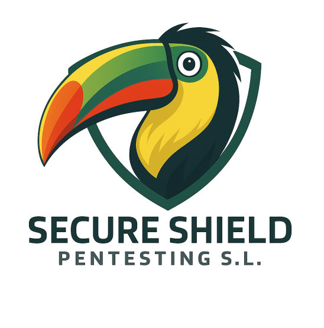
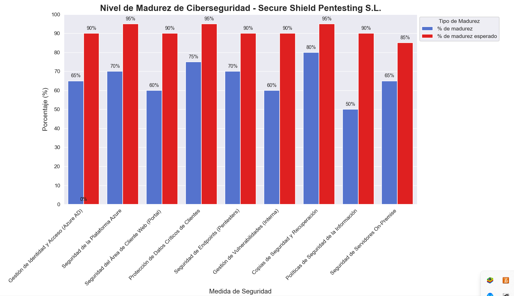
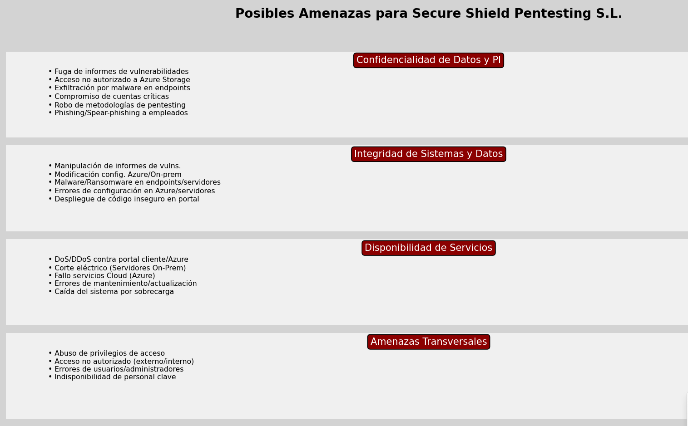
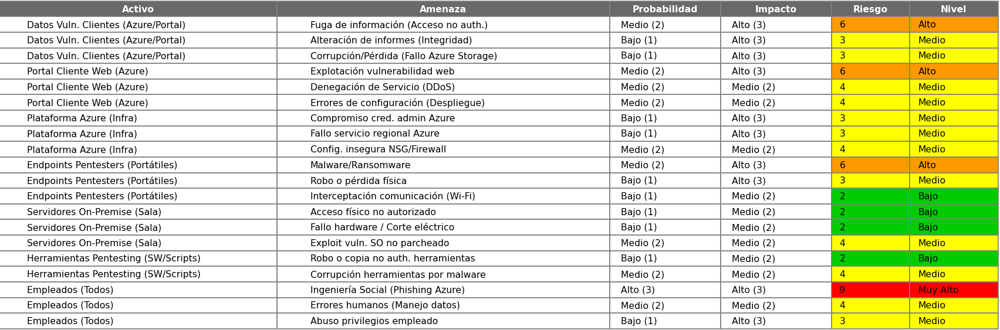

# Plan de Respuesta a Incidentes – Secure Shield Pentesting S.L.

**Fecha de publicación:** 13/05/2025

**Revisión 1:** 13/05/2025

**Autor:** Grupo 2

**Contacto de revisión:** grupo2@secureshield.es

Este Plan de Respuesta a Incidentes se basa en la plantilla de Counteractive Security disponible en GitHub. Dicha plantilla es concisa, directiva, específica, flexible y de libre acceso. Este documento la adapta para Secure Shield Pentesting S.L., una empresa dedicada a auditorías de seguridad y pruebas de penetración, considerando su entorno técnico y operativo.

El plan fue revisado y probado por última vez el 13/05/2025.

### Contexto de este plan

Para crear este plan de respuesta, se completaron los siguientes pasos:

#### Identificación de activos

Tras una descripción inicial de la empresa, se inventariaron los activos relevantes. La siguiente tabla los detalla:

| Identificador   | Nombre                             | Descripción                                                       | Responsable                 | Tipo                                  | Ubicación             | Crítico |
|-----------------|------------------------------------|-------------------------------------------------------------------|-----------------------------|---------------------------------------|-----------------------|---------|
| SS_0001         | Servidor Pentesting 01 (Linux)     | Servidor para entornos de pruebas y análisis de seguridad.        | Equipo de Infraestructura   | Servidor (físico)                     | Sala Técnica CPD      | Sí      |
| SS_0002         | Servidor Pentesting 02 (Windows)   | Servidor para herramientas de pentesting en entorno Windows.      | Equipo de Infraestructura   | Servidor (físico)                     | Sala Técnica CPD      | Sí      |
| SS_0003         | Plataforma Web – Área de Cliente   | Aplicación web donde los clientes acceden a informes.             | Dpto. Desarrollo Web        | Aplicación Web (cloud / Azure)        | Azure                 | Sí      |
| SS_0004         | Almacenamiento Crítico de Informes | Repositorio cifrado con informes de auditorías y vulnerabilidades.| Dpto. Seguridad             | Repositorio de datos (cloud y físico) | Azure / CPD Local     | Sí      |
| SS_0005         | Directorio Activo                  | Gestión de cuentas, autenticación y permisos internos.            | Administradores de sistemas | Servicio de Directorio                | Sala Técnica CPD      | Sí      |
| SS_0006         | Correo Corporativo                 | Servicio de correo electrónico para el personal.                  | Administradores de sistemas | Servicio Cloud (Microsoft 365)        | Azure                 | No      |
| SS_0007         | Consola de Gestión de Incidentes   | Plataforma SIEM/SOAR para monitoreo y respuesta.                  | Dpto. Seguridad             | Plataforma Cloud                      | Azure                 | Sí      |
| SS_0008         | Estaciones de Trabajo (Auditores)  | Equipos usados por pentesters para tareas de auditoría.           | Administradores de sistemas | Dispositivos (Físico)                 | Oficinas / Remoto     | Sí      |
| SS_0009         | Portátiles del Personal Técnico     | Equipos asignados al equipo técnico y de análisis.                | Departamento de TI          | Dispositivos (Físico)                 | Oficinas / Remoto     | No      |
| SS_0010         | Dispositivos de Red Internos        | Switches, routers y firewalls que soportan la red interna.        | Administradores de sistemas | Dispositivos de red                   | Sala Técnica CPD      | Sí      |
| SS_0011         | Subsistema de Backups               | Sistema automatizado de copias de seguridad.                      | Dpto. Seguridad             | Dispositivo de almacenamiento         | Sala Técnica / Azure  | Sí      |
| SS_0012         | Dispositivos Móviles Empresariales  | Teléfonos de empresa usados para MFA y gestión remota.            | Departamento de TI          | Dispositivos móviles (Físico)         | Personal autorizado   | No      |
| SS_0013         | Almacenamiento Portátil            | Discos externos, USBs utilizados para transportar datos sensibles.| Departamento de Seguridad   | Dispositivo de almacenamiento (Físico)| Dpto. Seguridad       | Sí      |

#### Nivel de madurez y proyectos

Se evaluó la madurez de **Secure Shield Pentesting S.L.** en ciberseguridad. Los resultados actuales y los objetivos esperados son:

| Medida                                            | % de madurez Actual | % de madurez Esperado | Descripción                                                                                                                                                              |
| :------------------------------------------------ | :-------------------- | :-------------------- | :----------------------------------------------------------------------------------------------------------------------------------------------------------------------- |
| Gestión de Identidad y Acceso (Azure AD)          | 65%                   | 90%                   | Implementado Azure AD con MFA para empleados. Se requiere revisión periódica de roles y privilegios mínimos, especialmente para el acceso a datos de clientes y entornos de pentesting. |
| Seguridad de la Plataforma Azure                  | 70%                   | 95%                   | Uso de Azure Security Center y Azure Sentinel. WAF configurado para el área de cliente. Necesaria optimización continua de reglas y monitorización proactiva de logs de Azure. |
| Seguridad del Área de Cliente Web (Portal)        | 60%                   | 90%                   | Portal con HTTPS, validación de entradas. Se realizan pruebas de pentesting internas regulares. Se busca implementar DAST/SAST en el ciclo de desarrollo y mejorar protección anti-DDoS. |
| Protección de Datos Críticos de Clientes          | 75%                   | 95%                   | Cifrado en reposo (Azure Storage) y en tránsito (TLS 1.2+). Políticas de clasificación de datos y manejo de informes de vulnerabilidades definidas. Reforzar DLP y segregación de datos. |
| Seguridad de Endpoints (Equipos de Pentesters)    | 70%                   | 90%                   | Solución EDR desplegada y configurada. Políticas de hardening aplicadas. Necesaria mayor automatización en la respuesta a alertas y revisión de configuraciones específicas para pentesting. |
| Gestión de Vulnerabilidades (Infraestructura Interna) | 60%                   | 90%                   | Escaneos de vulnerabilidad periódicos en servidores propios (Windows/Linux) y red interna. Programa de parcheo establecido. Mejorar tiempos de remediación y seguimiento. |
| Copias de Seguridad y Recuperación (Azure y On-prem) | 80%                   | 95%                   | Backups automatizados en Azure (Azure Backup) y para servidores on-prem en sala dedicada. Pruebas de restauración trimestrales. RPO/RTO definidos y comunicados.      |
| Políticas de Seguridad de la Información          | 50%                   | 90%                   | Políticas generales existentes. Se requiere actualización para cubrir específicamente el uso de Azure, el manejo de datos de clientes (vulnerabilidades) y el trabajo remoto seguro. |
| Seguridad de Servidores On-Premise (Sala Dedicada) | 65%                   | 85%                   | Acceso físico controlado a sala de servidores. Hardening básico de SO. Monitoreo de logs centralizado pendiente de optimización.                                         |

El siguiente gráfico visualiza estos niveles de madurez:

Para aumentar el nivel de madurez en **Secure Shield Pentesting S.L.**, se proponen las siguientes tareas:

1.  **Análisis Continuo de Riesgos y Amenazas Específicas:**
    *   Responsable: Equipo de Inteligencia de Amenazas / Departamento de Seguridad.
    *   Tarea: Identificar y evaluar continuamente riesgos y TTPs de adversarios que afecten a **Secure Shield Pentesting S.L.**, sus clientes, los datos de vulnerabilidades y su infraestructura (Azure y on-premise).
2.  **Definición y Actualización de Políticas de Seguridad Detalladas:**
    *   Responsable: Director de Seguridad / Comité de Seguridad.
    *   Tarea: Establecer y revisar anualmente políticas de seguridad claras. Estas deben cubrir el uso de Azure, la gestión del ciclo de vida de datos de clientes (incluyendo informes de pentesting), la seguridad en el desarrollo del portal de cliente y el trabajo seguro de los pentesters.
3.  **Elaboración de Procedimientos y Normativas Específicas:**
    *   Responsable: Departamento de Seguridad / Jefes de Equipo Técnico.
    *   Tarea: Desarrollar procedimientos y normativas para implementar las políticas de seguridad. Esto incluye guías de hardening para Azure, servidores Linux/Windows, endpoints de pentesters y protocolos de respuesta a incidentes.
4.  **Gestión Avanzada de Accesos y Autorizaciones (Principio de Mínimo Privilegio):**
    *   Responsable: Departamento de Seguridad / Administradores de Azure.
    *   Tarea: Administrar y auditar regularmente permisos de acceso a sistemas, plataforma Azure, área de cliente y datos críticos de clientes. Aplicar el principio de mínimo privilegio y usar Azure AD PIM/RBAC.
5.  **Formación y Concienciación Especializada en Seguridad:**
    *   Responsable: Departamento de Seguridad / Recursos Humanos.
    *   Tarea: Desarrollar e impartir programas de formación continua en seguridad adaptados a los roles. Poner énfasis en el manejo seguro de datos de vulnerabilidades, phishing y seguridad en la nube para todos los empleados, especialmente el equipo de pentesting.
6.  **Seguridad Física Robusta para Infraestructura Crítica:**
    *   Responsable: Jefe de Operaciones / Departamento de Seguridad.
    *   Tarea: Garantizar la protección física de la sala de servidores dedicada, incluyendo controles de acceso, monitorización y condiciones ambientales.
7.  **Gobernanza de la Seguridad de la Información:**
    *   Responsable: Departamento de Seguridad / CISO (si aplica).
    *   Tarea: Proteger la integridad, confidencialidad y disponibilidad de datos y sistemas de **Secure Shield Pentesting S.L.** Enfocarse en los datos de auditorías de clientes y la propiedad intelectual de la empresa.
8.  **Gestión Proactiva de Incidentes de Seguridad:**
    *   Responsable: Equipo de Respuesta a Incidentes de Seguridad (CSIRT).
    *   Tarea: Investigar, gestionar y mitigar incidentes de seguridad. Esto abarca brechas de datos de clientes, compromiso de la plataforma Azure o del portal de cliente, y realizar análisis forense si es necesario.
9.  **Auditorías de Seguridad Internas y de Terceros:**
    *   Responsable: Departamento de Seguridad / Auditores Externos.
    *   Tarea: Realizar auditorías de seguridad internas regulares de la infraestructura y procesos de **Secure Shield Pentesting S.L.** Contratar auditorías de terceros para validar la postura de seguridad.
10. **Actualización y Mejora Continua del Programa de Seguridad:**
    *   Responsable: Departamento de Seguridad.
    *   Tarea: Revisar y actualizar regularmente el plan de seguridad, controles y procedimientos para adaptarse a cambios en amenazas, nuevas tecnologías (Azure) y servicios de pentesting ofrecidos.
11. **Monitoreo Avanzado de Seguridad (SIEM/SOAR):**
    *   Responsable: Equipo de Operaciones de Seguridad (SOC) / Departamento de Seguridad.
    *   Tarea: Implementar y gestionar un SIEM (ej. Azure Sentinel) para monitorizar logs de Azure, servidores on-premise, endpoints y el área de cliente web. Explorar capacidades SOAR para automatizar respuestas.
12. **Configuración y Mantenimiento de Firewalls y Segmentación de Red:**
    *   Responsable: Administradores de Red / Departamento de Seguridad.
    *   Tarea: Configurar y mantener firewalls perimetrales, NSGs en Azure y WAF para el portal de cliente. Asegurar una segmentación de red adecuada entre entornos de producción, desarrollo y pentesting.
13. **Implementación y Gestión de Soluciones EDR/XDR:**
    *   Responsable: Departamento de Seguridad.
    *   Tarea: Garantizar la instalación, actualización y monitorización regular de la solución EDR/XDR en todos los endpoints (especialmente los de pentesters) y servidores.
14. **Ejecución, Supervisión y Pruebas de Copias de Seguridad:**
    *   Responsable: Administradores de Sistemas / Departamento de Seguridad.
    *   Tarea: Asegurar copias de seguridad periódicas de datos y sistemas críticos (Azure y on-premise), supervisar su correcta finalización y realizar pruebas de restauración regulares.

#### Posibles amenazas

El análisis de amenazas, utilizado para calcular riesgos, consideró las clasificaciones de INCIBE.

#### Cálculo del riesgo

Considerando el inventario de activos y las posibles amenazas, se presenta la siguiente tabla para el cálculo de riesgos en Secure Shield Pentesting:

#### Taxonomía de incidentes

Se identificaron varios incidentes que podrían afectar a **Secure Shield Pentesting S.L.**, dada su especialización en auditorías de seguridad y el manejo de datos críticos de clientes:

1.  **Exfiltración de Datos de Clientes (Informes de Vulnerabilidades)**
    *   **Descripción:** Acceso no autorizado y extracción de informes de pentesting, datos de vulnerabilidades o información confidencial de los clientes de Secure Shield Pentesting S.L.
    *   **Funcionamiento:** Puede ocurrir por compromiso de la plataforma Azure, el portal de cliente, endpoints de pentesters o por insiders.
    *   **Identificación:** Alertas de DLP, monitorización de tráfico de red anómalo (especialmente a destinos desconocidos), logs de acceso inusuales a Azure Storage o bases de datos.
    *   **Protección:** Cifrado robusto en reposo y tránsito, MFA, políticas de acceso de mínimo privilegio, segmentación de red, EDR en endpoints, formación del personal.
    *   **Caso Análogo:** Brecha en una consultora de seguridad con filtración de herramientas internas o datos de clientes.

2.  **Compromiso del Portal de Cliente Web**
    *   **Descripción:** Explotación de vulnerabilidades en el portal web de Secure Shield Pentesting S.L. que los clientes usan para subir/descargar informes.
    *   **Funcionamiento:** Inyección SQL, XSS, CSRF, explotación de componentes no actualizados, fuerza bruta a cuentas de clientes.
    *   **Identificación:** Alertas de WAF, logs del servidor web con actividad sospechosa, reportes de clientes sobre comportamiento anómalo del portal.
    *   **Protección:** WAF, escaneos de vulnerabilidad regulares (DAST/SAST), parches de seguridad, validación de entradas, cabeceras de seguridad HTTP.
    *   **Caso Análogo:** Defacement o compromiso de un portal de servicios que expone datos de usuarios.

3.  **Compromiso de la Infraestructura de Pentesting (Azure y On-Premise)**
    *   **Descripción:** Acceso no autorizado a servidores (Windows/Linux en sala dedicada) o a la infraestructura en Azure usada para auditorías y almacenamiento de herramientas.
    *   **Funcionamiento:** Explotación de vulnerabilidades, credenciales débiles/robadas, configuraciones incorrectas en Azure (NSGs, roles IAM).
    *   **Identificación:** Alertas de Azure Security Center/Sentinel, logs de actividad inusual en servidores, EDR detectando actividad maliciosa.
    *   **Protección:** Hardening de sistemas, gestión de parches, MFA para acceso a Azure y servidores, monitorización de seguridad continua, segmentación de red.
    *   **Caso Análogo:** Un atacante compromete la red interna de una empresa de seguridad para robar herramientas o usar su infraestructura para otros ataques.

4.  **Ataque de Ransomware**
    *   **Descripción:** Cifrado de datos críticos en servidores on-premise, endpoints de pentesters o almacenamiento en Azure, con exigencia de rescate.
    *   **Funcionamiento:** Mediante phishing, explotación de vulnerabilidades o credenciales comprometidas.
    *   **Identificación:** Archivos inaccesibles con extensiones cambiadas, notas de rescate, alertas de EDR.
    *   **Protección:** Backups robustos y probados (inmutables si es posible), EDR, segmentación de red, formación anti-phishing, parches de seguridad.
    *   **Caso Análogo:** Empresa de servicios afectada por ransomware que interrumpe operaciones o expone datos.

5.  **Ingeniería Social dirigida a Pentesters/Administradores**
    *   **Descripción:** Manipulación de empleados clave para obtener acceso a sistemas sensibles, credenciales de Azure o datos de clientes.
    *   **Funcionamiento:** Spear-phishing dirigido, vishing, pretexting.
    *   **Identificación:** Reportes de empleados sobre intentos de phishing, análisis de logs de autenticación buscando accesos desde IPs/dispositivos inusuales tras un posible compromiso.
    *   **Protección:** Formación avanzada en seguridad, MFA robusto, procedimientos de verificación para solicitudes sensibles.
    *   **Caso Análogo:** Ataques de ingeniería social a empleados de empresas tecnológicas para obtener acceso a redes corporativas.

6.  **Denegación de Servicio (DoS/DDoS) contra el Portal de Cliente o Servicios Azure**
    *   **Descripción:** Saturación de servicios web o infraestructura de red, impidiendo el acceso legítimo de clientes o la operatividad de Secure Shield Pentesting S.L.
    *   **Funcionamiento:** Múltiples solicitudes desde una botnet o ataque volumétrico.
    *   **Identificación:** Alertas de sistemas de protección DDoS, logs de tráfico masivo, inaccesibilidad de servicios.
    *   **Protección:** Servicios de mitigación DDoS (ej. Azure DDoS Protection), WAF, infraestructura escalable.
    *   **Caso Análogo:** Empresas con portales de cliente o servicios online objetivo de ataques DDoS.

7.  **Amenaza Interna (Insider Threat)**
    *   **Descripción:** Empleado (actual o ex-empleado) con acceso legítimo que abusa de sus privilegios para robar datos, sabotear sistemas o causar daño.
    *   **Funcionamiento:** Uso de credenciales válidas, conocimiento interno de sistemas y debilidades.
    *   **Identificación:** Monitorización de comportamiento de usuarios (UBA), auditoría de logs de acceso a datos sensibles, alertas sobre actividad inusual de cuentas privilegiadas.
    *   **Protección:** Principio de mínimo privilegio, segregación de funciones, monitorización de actividad, procesos de offboarding robustos.
    *   **Caso Análogo:** Empleado descontento de una empresa de TI que filtra información confidencial.

### Evaluar

1.  **Mantenga la calma y la profesionalidad.** La naturaleza de los datos manejados por **Secure Shield Pentesting S.L.** exige una respuesta serena y metódica.
2.  Reúna la información pertinente: alertas de Azure Sentinel/Security Center, logs de EDR, reportes de clientes, actividad inusual en el portal, suposiciones, intuiciones (**observar**).
3.  Considere las categorías de impacto (**orientar**) y determine si existe un posible incidente (**decidir**).
4.  Inicie una respuesta si hay un incidente (**actuar**). En caso de duda, especialmente si afecta datos de clientes o la reputación de **Secure Shield Pentesting S.L.**, inicie una respuesta. El responsable de gestión de incidentes y el equipo de respuesta pueden ajustarse tras la investigación.

#### Evaluar el impacto funcional

¿Cuál es el impacto directo o probable en la operatividad de **Secure Shield Pentesting S.L.** o de sus clientes? (ej. incapacidad para realizar pentests, inaccesibilidad del portal de cliente, interrupción de servicios Azure).

*   Degradación o fracaso de operaciones de pentesting, servicios a clientes o funciones internas críticas: **incidente!**
*   Ninguno: evalúe el impacto de la información.

#### Evaluar el impacto de la información

¿Cuál es el impacto directo o probable sobre los datos/información, en particular informes de vulnerabilidades de clientes, datos de configuración de Azure o propiedad intelectual de **Secure Shield Pentesting S.L.**?

*   Información sensible de clientes o de la empresa accedida, filtrada, modificada o borrada: **incidente!**
*   Ninguno: gestione a través de canales no relacionados con incidentes (ej. ticket de soporte técnico interno).

**Cada miembro del equipo está facultado para comenzar este proceso.** Si ve algo, dígalo.

### Iniciar la respuesta

#### Nombrar el incidente

Cree una [frase simple de dos palabras](http://creativityforyou.com/combomaker.html) para referirse al incidente (un nombre en clave) que se usará para el archivo y el canal del incidente (ej. "Operación Fénix Azul").

#### Reunir el equipo de respuesta

1.  Llame al Incident Commander (IC) de turno/guardia de **Secure Shield Pentesting S.L.**
2.  **No** discuta el incidente fuera del equipo de respuesta a menos que el IC lo autorice. La confidencialidad es primordial.
3.  Inicie y/o únase al canal de chat de respuesta dedicado en la plataforma de comunicación interna de **Secure Shield Pentesting S.L.** (ej. `secure-shield.teams.microsoft.com/ir-channel` o `ir.secure-shield.com/chat`).
4.  Inicie y/o únase a la llamada de respuesta en el puente de conferencia designado (ej. `+34 91 XXX XX XX Ext: YYYY` o `meet.secure-shield.com/ir-warroom`).
5.  Prefiera usar llamada de voz, chat seguro e intercambio seguro de archivos (ej. Azure Files con acceso restringido) sobre otros métodos.
6.  **No** use el correo electrónico principal de la empresa si es posible que esté comprometido. Si el correo es necesario, úselo con moderación o use una cuenta de emergencia designada (ej. `ir-emergency@secure-shield-pentesting.com`). Encripte los correos si algún participante está fuera del dominio de **Secure Shield Pentesting S.L.**
7.  **No** use SMS/texto para comunicar detalles del incidente, salvo para dirigir a alguien a un canal más seguro.
8.  Invite al personal de turno/guardia a la llamada y chat de respuesta:
    *   Equipo de Seguridad Interna / SOC de **Secure Shield Pentesting S.L.**
    *   SME de sistemas afectados (Azure, servidores on-prem, portal web, EDR).
    *   Partes interesadas ejecutivas (Dirección, CISO) y Asesor Legal lo antes posible, priorizando responsables operativos.
9.  OPCIONAL: Establezca una sala de colaboración física ("sala de guerra") en las oficinas de **Secure Shield Pentesting S.L.** para incidentes complejos, o use una sala virtual dedicada.

##### Referencia: Estructura del equipo de respuesta

*   Equipo de Mando
    *   [Incident Commander (IC)](./Roles/rol-1-jefe-incidentes.md)
    *   [Incident Commander-Adjunto (Subjefe)](./Roles/rol-2-subjefe-incidentes.md)
    *   [Escriba](./Roles/rol-3-escriba.md)
*   [Equipo de Enlace](./Roles/rol-5-enlace.md)
    *   Enlace Interno (Partes Interesadas de Secure Shield)
    *   Enlace Externo (Clientes Afectados, Reguladores, Proveedores como Microsoft Azure si es necesario)
*   [Equipo de Operaciones](./Roles/rol-4-experto-materia-sme.md)
    * Expertos en la Materia (SME) para Plataforma Azure, Servidores Windows/Linux, Redes, Seguridad de Endpoints, Desarrollo Web (Portal Cliente).
    *   SME para Equipos/Unidades de Negocio (ej. Jefe de Pentesting si afecta operaciones).
    *   SME para Funciones Ejecutivas (Legal, Dirección, Comunicación).

##### Referencia: Información de contacto del equipo de respuesta

| Rol del equipo de respuesta        | Información de contacto                         |
| :--------------------------------- | :---------------------------------------------- |
| Localizador del Incident Commander | `+34 623 456 789` (Línea de Emergencia)         |
| Portal del Incident Commander      | `ir.secure-shield.com/ic`                       |
| Lista del Incident Commander       | `ir.secure-shield.com/roster/ic`                |
| Lista del equipo de seguridad      | `ir.secure-shield.com/roster/security`          |
| Lista del equipo SME               | `ir.secure-shield.com/roster/sme`               |
| Lista de ejecutivos                | `ir.secure-shield.com/roster/exec`              |

#### Establecer el ritmo de batalla

##### Realizar la primera llamada de respuesta

1.  Realice la llamada inicial usando la [estructura de llamada de respuesta inicial](#referencia-estructura-de-la-llamada-de-respuesta-inicial).
2.  Siga las instrucciones del IC. Si el IC de turno/guardia no se une a la llamada **en 15 minutos** y usted es un IC capacitado, tome el mando.
3.  Siga las [instrucciones de su función](#roles).
4.  Siga la llamada y el chat; comente según corresponda. Si no es un SME, comunique aportaciones a través del SME de su equipo si es posible.
5.  **Mantenga la llamada y el chat activos durante el incidente para comunicación basada en eventos.**
6.  Programe actualizaciones **cada 2-4 horas** (o según gravedad) sobre la comunicación activa. Para **Secure Shield Pentesting S.L.**, la rapidez es clave.

###### Referencia: Estructura de la llamada de respuesta inicial

*   Incident Commander (IC): Mi nombre es \[NOMBRE], soy el IC para **Secure Shield Pentesting S.L.** He designado a \[NOMBRE] como adjunto y a \[NOMBRE] como escriba. ¿Quién está en la llamada representando a qué área?
*   ESCRIBA: \[Toma asistencia, roles y áreas de responsabilidad]
*   IC: \[Si falta personal clave, ej. SME de Azure] Adjunto, contacte y movilice a \[PERSONAL FALTANTE].
*   IC: \[Pregunta para comprender situación, síntomas, alcance (qué clientes/datos podrían estar afectados), vector, impacto y cronología al reportador y SMEs aplicables].
*   SMEs: \[Responden breve, factual y concisamente al IC].
*   IC: \[Si es un incidente]:
    *   Resumen del incidente: \[reitera resumen]. El equipo de Investigación será liderado por \[NOMBRE], Remediación por \[NOMBRE] y Comunicación por \[NOMBRE]. Coordinarán sus equipos y me informarán. Miembros del equipo, reporten a su líder.
    *   ¿Qué medidas de investigación, remediación o comunicación se han tomado?
    *   Esta llamada y canal de chat permanecerán activos. Úsenlos para TODAS las comunicaciones del incidente. Actualizaciones de estado en tiempo real en el chat. ¿Preguntas o aportaciones? \[Responde].
    *   Líderes de equipo, procedan. Nos reuniremos en \[UPDATE_TIME] (ej. "en 60 minutos") para discutir el estado. Gracias.
*   IC: \[Si no es un incidente]: La información actual no escala a un incidente de seguridad mayor. Coordinaré seguimiento con \[REPORTADOR/EQUIPO]. Gracias.

###### Referencia: Etiqueta de la llamada

*   Únase a la llamada y al chat dedicado.
*   Minimice el ruido de fondo. Silencie el micrófono si no habla.
*   Identifíquese al unirse: nombre y rol en **Secure Shield Pentesting S.L.** (ej. "Soy María, SME de Azure").
*   Hable con claridad. Sea directo y factual.
*   Comunicaciones cortas y al grano.
*   Dirija preocupaciones al IC.
*   Respete los tiempos del IC.
*   **Use terminología clara. Evite acrónimos no comunes. Claridad y precisión sobre brevedad.** Dada la sensibilidad de los datos de **Secure Shield Pentesting S.L.**, la precisión es vital.

##### Realizar la actualización de la respuesta

*   Realice actualizaciones programadas usando la [estructura de llamada de actualización](#referencia-estructura-de-la-llamada-de-actualizacion-de-la-respuesta) en el puente activo. La frecuencia puede ser mayor (ej. cada 1-2 horas) si el incidente es grave o afecta datos de clientes.
*   Ajuste la frecuencia según necesidad.
*   Coordine actualizaciones separadas (ejecutivas, legales, clientes clave) según necesidad, minimizando la frecuencia para mantener el foco operativo.

###### Referencia: Estructura de la llamada de actualización de la respuesta

*   Incident Commander (IC): Actualización del incidente \[NOMBRE CLAVE]. Desde la última comunicación, el resumen es:
    *   \[Impacto actual en clientes/datos de Secure Shield Pentesting S.L.]
    *   \[Vector confirmado o hipótesis principal]
    *   \[Actualización del resumen general]
    *   \[Actualización de la línea de tiempo]
*   IC: Equipo de Investigación, actualicen.
    *   LÍDER DE INVESTIGACIÓN: \[Actividades realizadas, hallazgos, o "sin cambios significativos"]
    *   ¿Plan de investigación recomendado para las próximas X horas?
    *   ¿Acciones de investigación que necesitan aprobación/asignación? \[Escuchar, consensuar, asignar/aprobar]
*   IC: Equipo de Remediación, actualicen.
    *   LÍDER DE REMEDIACIÓN: \[Actividades (contención/erradicación) o "sin cambios"]
    *   ¿Estrategia de remediación recomendada? ¿Objeciones fuertes? \[Escuchar, consensuar, asignar/aprobar]
    *   ¿Acciones de remediación que necesitan aprobación/asignación?
*   IC: Equipo de Comunicación, actualicen.
    *   LÍDER DE COMUNICACIÓN: \[Comunicaciones realizadas/planificadas (internas/externas) o "sin comunicaciones nuevas"]
    *   ¿Estrategia de comunicación recomendada? ¿Objeciones? \[Escuchar, consensuar, asignar/aprobar]
    *   ¿Acciones de comunicación que necesitan aprobación/asignación (ej. borrador de comunicado a clientes)?
*   IC: La llamada y el chat siguen activos. Úsenlos para todas las communications. ¿Preguntas o aportaciones? \[Responde].
*   IC: Líderes de equipo, procedan. Próxima reunión en \[UPDATE_TIME]. Gracias.

#### Supervisar el alcance

*   Supervise el alcance de la respuesta. Si involucra múltiples sistemas de clientes o una brecha de datos mayor, el IC debe asegurar recursos adecuados.
*   Si un incidente es complejo (ej. compromiso de plataforma Azure afectando múltiples clientes y servicios internos de **Secure Shield Pentesting S.L.**), considere crear subequipos más granulares.

##### Crear Sub-Equipos

*   Para incidentes en **Secure Shield Pentesting S.L.**, los subequipos predefinidos (Investigación, Remediación, Comunicación) son el estándar.
*   El IC designará líderes.
*   Si un incidente afecta simultáneamente infraestructura Azure, servidores on-premise y portal de cliente masivamente, el IC podría crear sub-equipos técnicos específicos (ej. "Sub-equipo Azure", "Sub-equipo Portal Web") bajo el Líder de Remediación.

##### Incidente dividido

Si un incidente resulta ser dos o más incidentes distintos (ej. DDoS al portal y phishing a administradores de Azure no relacionados):

*   Establezca un nuevo [archivo de incidentes](#crear-el-archivo-del-incidente) para el segundo.
*   Seguimiento y coordinación separados, con conocimiento mutuo si hay recursos compartidos.
*   **Mantenga un IC de alto nivel** si los incidentes son de gran magnitud y compiten por recursos críticos de **Secure Shield Pentesting S.L.**

### Investigar

**[Investigar](#investigar), [Remediar](#remediar) y [comunicar](#comunicar) en paralelo, con equipos separados si es posible.** El IC coordinará. Notifique al IC si hay pasos que el equipo debe considerar. La confidencialidad de los datos de clientes de **Secure Shield Pentesting S.L.** es prioritaria durante la investigación.

#### Crear el archivo del incidente

1.  Cree un nuevo archivo de incidentes en el sistema de gestión de **Secure Shield Pentesting S.L.** (ej. `ir-cases.secure-shield.com` o carpeta segura en Azure) usando el [nombre del incidente](#nombre-del-incidente). Almacene de forma segura logs, pruebas, artefactos, etc.
    *   Asegure almacenamiento digital seguro con control de acceso estricto (solo personal autorizado del equipo IR).
    *   Asegure intercambio de archivos seguro (ej. enlaces de Azure con expiración y contraseña).
    *   Si hay pruebas físicas (discos duros), asegure almacenamiento físico seguro en **Secure Shield Pentesting S.L.**
    *   Comparta la ubicación del archivo en el canal de respuesta.
1.  Documente el impacto funcional y de información (ver [Evaluar](#evaluar)). Preste atención al impacto en datos de clientes y reputación de **Secure Shield Pentesting S.L.**
2.  Documente el vector, si se conoce.
3.  Documente el resumen del incidente.
4.  Documente la línea de tiempo (actividad del atacante y respuesta de **Secure Shield Pentesting S.L.**).
5.  Documente los pasos de investigación, remediación y comunicación.
6.  Registre información significativa:
    *   **Pruebas forenses** (imágenes de disco/memoria, logs de Azure, PCAPs), con cadena de custodia.
    *   **Sistemas afectados** (VMs en Azure, servidores on-prem, endpoints de pentesters, portal cliente).
    *   **Archivos de interés** (malware, scripts, informes de vulnerabilidad accedidos).
    *   **Datos accedidos/exfiltrados** (identificar informes de clientes, datos específicos).
    *   **Actividad significativa del atacante** (comandos ejecutados en Azure, logs de acceso).
    *   **IOCs** de red (IPs, dominios) y de host (hashes, rutas).
    *   **Cuentas comprometidas** (Azure AD, locales, de cliente), alcance del acceso.

#### Recoger las pistas iniciales

1.  Entreviste a quien reportó el incidente (empleado de **Secure Shield Pentesting S.L.**, cliente).
2.  Recoja datos iniciales (alertas de Azure Sentinel, logs de EDR, capturas de pantalla del portal cliente).
3.  Entreviste a SMEs de **Secure Shield Pentesting S.L.** (Azure, Redes, Seguridad) para detalles técnicos y contexto.
4.  Entreviste a responsables de negocio/cliente (si aplica) para entender el impacto.
5.  Asegure que las pistas sean relevantes, detalladas y accionables.

##### Referencia: Lista de recursos de respuesta

| Recurso                             | Ubicación                                        |
| :---------------------------------- | :----------------------------------------------- |
| Lista de información crítica        | `docs.secure-shield.com/ir/critical-info`      |
| Lista de activos críticos           | `docs.secure-shield.com/ir/critical-assets`    |
| Portal de Gestión de Activos        | `assets.secure-shield.com`                     |
| Diagramas de Red (Azure y On-Prem)  | `docs.secure-shield.com/ir/network-maps`       |
| Consola Azure Sentinel / SIEM       | `portal.azure.com` / `siem.secure-shield.com`    |
| Agregador de Logs (On-Prem)         | `logs.secure-shield.com`                       |
| Consola EDR                         | `edr.secure-shield.com`                        |

#### Actualizar el plan de investigación y el archivo del incidente

1.  Revise y precise el impacto (¿qué clientes/datos de **Secure Shield Pentesting S.L.** están afectados?).
#### Actualizar el plan de investigación y el archivo del incidente (Continuación)

2.  Revise y precise el vector.
3.  Revise y precise el resumen.
4.  Revise y precise la línea de tiempo con hechos e inferencias.
5.  Cree hipótesis: qué pudo ocurrir y con qué certeza.
6.  **Identifique y priorice preguntas clave** (lagunas de información) para apoyar o desacreditar hipótesis.
    *   Use MITRE ATT&CK para guiar las preguntas (ver [matriz](#referencia-tactica-del-atacante-a-la-matriz-de-preguntas-clave)). Considere tácticas relevantes para compromiso de cloud (Azure) y exfiltración de datos sensibles.
    *   Preguntas específicas para SSP: ¿Cuándo ocurrió el acceso inicial a Azure? ¿Qué informes de vulnerabilidad fueron accedidos? ¿Cómo se eludió el MFA (si ocurrió)? ¿Desde dónde se originó el ataque?
1.  **Identifique y priorice dispositivos y estrategias testigo** para responder preguntas clave.
    *   Consulte logs de Azure AD, logs de actividad de Azure, logs de Azure Storage, logs de WAF del portal cliente.
    *   Considere imágenes forenses de VMs en Azure o endpoints de pentesters comprometidos.
    *   Consulte a SMEs de **Secure Shield Pentesting S.L.**
1.  Consulte [playbooks](#playbooks) para amenazas específicas (ej. exfiltración de datos, compromiso de cuenta Azure).

**El plan de investigación es fundamental. Use pensamiento crítico y creatividad.**

##### Referencia: Táctica del atacante a la matriz de preguntas clave

*(Esta tabla es genérica. Adapte las preguntas al contexto de Secure Shield Pentesting S.L.; por ejemplo, "¿Qué cuentas de Azure se comprometieron?", "¿Qué técnicas de evasión de defensa se usaron contra Azure Sentinel?")*

| Táctica del atacante    | La forma en que los atacantes ...      | Posibles preguntas clave                                          |
| :---------------------- | :------------------------------------- | :---------------------------------------------------------------- |
| Reconocimiento          | ... aprender sobre los objetivos       | ¿Cómo? ¿Desde cuándo? ¿Dónde? ¿Qué sistemas?                      |
| Desarrollo de recursos  | ... construir infraestructuras.        | ¿Qué sistemas?                                                    |
| Acceso inicial          | ... entrar                             | ¿Cómo? ¿Desde cuándo? ¿Dónde? ¿Qué sistemas?                      |
| Ejecución               | ... ejecutar código hostil             | ¿Qué malware? ¿Qué herramientas? ¿Dónde? ¿Cuándo?                   |
| Persistencia            | ... quedarse en el sistema             | ¿Cómo? ¿Desde cuándo? ¿Dónde? ¿Qué sistemas?                      |
| Escalada de Privilegios | ... obtener acceso de mayor nivel      | ¿Cómo? ¿Dónde? ¿Qué herramientas?                                  |
| Evasión de la defensa   | ... esquivar la seguridad              | ¿Cómo? ¿Dónde? ¿Desde cuándo?                                     |
| Acceso a credenciales   | ... obtener/crear cuentas              | ¿Qué cuentas? ¿Desde cuándo? ¿Por qué?                             |
| Descubrimiento          | ... aprender nuestra red               | ¿Cómo? ¿Dónde? ¿Qué saben?                                        |
| Movimiento lateral      | ... moverse                            | ¿Cómo? ¿Cuándo? ¿Qué cuentas?                                     |
| Recogida                | ... encontrar y reunir datos           | ¿Qué datos? ¿Por qué? ¿Cuándo? ¿Dónde?                             |
| Mando y control         | ... herramientas y sistemas de control | ¿Cómo? ¿Dónde? ¿Quién? ¿Por qué?                                   |
| Exfiltración            | ... tomar datos                        | ¿Qué datos? ¿Cómo? ¿Cuándo? ¿Dónde?                                |
| Impacto                 | ... romper cosas.                      | ¿Qué sistemas o datos? ¿Cómo? ¿Cuándo? ¿Dónde? ¿Cómo de malo?       |

Consulte [MITRE ATT&CK](https://attack.mitre.org/) para más información, especialmente las matrices de Cloud y Enterprise.

#### Crear y desplegar indicadores de compromiso (IOC)

> Dé énfasis a indicadores dinámicos y de comportamiento, además de estáticos.

*   Cree IOCs a partir de [pistas iniciales](#recoger-las-pistas-iniciales) y [análisis](#analizar-las-pruebas).
*   Use formatos abiertos (STIX 2.0).
*   Automatice el despliegue de IOCs en Azure Sentinel, EDR, Firewalls.
*   **No** despliegue feeds no curados.
*   Considere todos los tipos de IOC:
    *   Red: IPs, dominios, URLs (especialmente de C2 o exfiltración).
    *   Host: Hashes de malware, rutas de persistencia, claves de registro.
    *   Cloud (Azure): Patrones de logs de actividad inusuales, IPs de acceso a Azure anómalas, uso de APIs sospechoso.
    *   Comportamiento: TTPs, desviación de línea base de actividad de cuentas Azure.
*   Correlacione IOCs (ej. IP de C2 vista en logs de red y en endpoint de pentester).

#### Identificar los sistemas de interés

1.  Valide relevancia.
2.  Categorice (ej. "VM Azure Comprometida", "Endpoint con Malware", "Cuenta Azure con Acceso a Datos Cliente X").
3.  Priorice recogida/análisis/remediación según impacto en clientes de **Secure Shield Pentesting S.L.** y datos sensibles.

#### Recogida de pruebas

*   Priorice según plan de investigación.
*   Use herramientas aprobadas por **Secure Shield Pentesting S.L.** para respuesta en vivo (ej. KAPE, herramientas nativas de Azure).
*   Recoja logs relevantes (Azure Monitor, logs de VMs, EDR, servidores on-prem).
*   Obtenga imágenes de memoria/disco (Volatility, FTK Imager) de sistemas críticos si es necesario.
*   Mantenga una cadena de custodia rigurosa.
*   **Artefactos útiles (adaptar a Azure y contexto de pentesting):**
    *   Logs de Azure AD Sign-ins y Audit.
    *   Logs de Actividad de Azure para recursos específicos.
    *   Logs de Azure Storage si hay sospecha de acceso a informes.
    *   Diagnósticos de VMs en Azure.
    *   Netflow/NSG Flow Logs en Azure.
    *   Artefactos de endpoints (procesos, conexiones, persistencia, Prefetch, Shimcache).
    *   Historial de comandos en servidores.

#### Analizar las pruebas

*   Priorice según plan de investigación.
*   Realice análisis forense de imágenes, análisis de malware (sandbox interno de **Secure Shield Pentesting S.L.** o externo con precauciones).
*   Enriquezca con inteligencia de amenazas (feeds, OSINT).
*   Documente nuevos IOCs.
*   Actualice archivo del caso.
*   **Indicadores útiles (adaptar a Azure):**
    *   Creación/modificación inusual de roles o políticas IAM en Azure.
    *   Acceso a Azure Portal/CLI/PowerShell desde IPs desconocidas o Tor.
    *   Ejecución de comandos de reconocimiento en Azure (Get-AzResource, etc.).
    *   Creación de snapshots de VMs o discos no autorizada.
    *   Configuración de reenvío de correo en cuentas de Office 365 (si se usa).
    *   Actividad anómala en Azure Key Vault.

#### Iterar la investigación

[Actualice el plan de investigación](#actualizar-el-plan-de-investigacion-y-el-archivo-del-incidente) y repita hasta el cierre.

### Remediar

**[Investigar](#investigar), [Remediar](#remediar) y [Comunicar](#comunicar) en paralelo.** El IC coordinará. Notifique al IC.

#### Actualización del plan de remediación

1.  Revise el archivo del incidente en `ir-cases.secure-shield.com`.
2.  Revise [playbooks](#playbooks) aplicables (ej. Compromiso de Cuenta Cloud, Exfiltración de Datos).
3.  Revise la [lista de recursos de respuesta](#referencia-lista-de-recursos-de-respuesta).
4.  Considere tácticas ATT&CK en juego (especialmente las de Cloud).
5.  Desarrolle remedios (Proteger, Detectar, Contener, Erradicar) para cada TTP.
6.  Priorice según [estrategia de tiempo](#elegir-el-momento-de-la-reparacion), impacto en **Secure Shield Pentesting S.L.** y sus clientes, y urgencia.
7.  Documente en archivo de incidentes.

##### Protección (Ejemplos para Secure Shield Pentesting S.L.)

> "¿Cómo evitamos que esto se repita en nuestra infraestructura Azure o afecte más datos de clientes?"

*   Revise y fortalezca políticas de MFA para acceso a Azure y portal cliente.
*   Implemente/revise Azure AD Conditional Access.
*   Rote claves de API, secretos de Azure Key Vault.
*   Revise y aplique principio de mínimo privilegio en roles IAM de Azure.
*   Fortalezca el hardening de VMs en Azure y servidores on-prem.
*   Mejore la segmentación de red en Azure (VNETs, NSGs).

##### Detección (Ejemplos para Secure Shield Pentesting S.L.)

> "¿Cómo detectamos esto antes en Azure o en nuestros endpoints?"

*   Cree/ajuste reglas de alerta en Azure Sentinel para actividad sospechosa en Azure.
*   Mejore la ingesta de logs de Azure a SIEM.
*   Despliegue/mejore EDR en todos los endpoints de pentesters.
*   Realice auditorías de logs de acceso a Azure Storage más frecuentes.

##### Contención (Ejemplos para Secure Shield Pentesting S.L.)

> "¿Cómo evitamos que esto se extienda en Azure o afecte a más clientes?"

*   Deshabilite/aísle cuentas Azure AD comprometidas.
*   Bloquee IPs maliciosas en NSGs, Azure Firewall, WAF.
*   Aísle VMs o redes en Azure (modifique NSGs, quite IPs públicas).
*   Revoque sesiones activas en Azure Portal o aplicaciones.
*   Ponga en cuarentena endpoints de pentesters.

##### Erradicar (Ejemplos para Secure Shield Pentesting S.L.)

> "¿Cómo eliminamos la presencia del atacante de Azure y nuestros sistemas?"

*   Reconstruya VMs comprometidas en Azure desde una imagen limpia.
*   Elimine backdoors, malware, persistencia en Azure o sistemas on-prem.
*   Restablezca todas las credenciales (Azure AD, locales, claves API).
*   Revise y revierta cambios no autorizados en configuraciones de Azure.

#### Elegir el momento de la reparación

Determine la estrategia (inmediata, retrasada, combinada) con el IC, SMEs de **Secure Shield Pentesting S.L.** y Dirección. Para incidentes que afectan datos de clientes, la reparación inmediata o combinada (contener inmediatamente, investigar más antes de erradicar completamente si es seguro) suele ser preferible.

#### Ejecutar la remediación

*   Evalúe y explique riesgos de remediación a partes interesadas de **Secure Shield Pentesting S.L.**
*   Implemente acciones de postura (ej. mejorar logging en Azure) inmediatamente.
*   Programe y asigne acciones.
*   Ejecute en lotes coordinados.
*   Documente estado y tiempo en archivo de incidentes.

#### Iterar la remediación

[Actualice el plan de remediación](#actualizacion-del-plan-de-remediacion) y repita hasta el cierre.

### Comunicar

*   **[Investigar](#investigar), [Remediar](#remediar) y [Comunicar](#comunicar) en paralelo.** Notifique al IC.
*   **Toda comunicación debe ser precisa y factual. Muestre integridad. No especule, especialmente sobre datos de clientes.**

#### Comunicación Interna (Secure Shield Pentesting S.L.)

##### Notificar y actualizar a las partes interesadas

*   En llamadas iniciales/actualización y chat.
*   Actualizaciones a Dirección y Legal con la frecuencia necesaria. Enfóquese en vector, impacto (especialmente en clientes), resumen, cronología y remediación.

##### Notificar y actualizar la organización

*   **No** notifique al personal no involucrado hasta autorización del IC, para evitar pánico o filtraciones.
*   Comunicaciones a equipos o toda la organización coordinadas con Dirección.

##### Crear Informe de Incidentes

*   Tras el cierre, capture información del [archivo del incidente](#crear-el-archivo-del-incidente) usando la plantilla de **Secure Shield Pentesting S.L.** (`docs.secure-shield.com/ir/report-template`).
*   Distribuya a `docs.secure-shield.com/ir/report-recipients`.

#### Comunicar al exterior

##### Notificar a los reguladores

*   **No** notifique hasta autorización del IC y consulta con Legal.
*   Notifique a AEPD si hay brecha de datos personales de clientes, según RGPD.
*   Coordine con `legal@secure-shield.com`.

##### Notificar a los clientes (Afectados)

*   **No** notifique hasta autorización del IC y consulta con Legal/Dirección.
*   Coordine con `communications@secure-shield.com` o responsable designado.
*   **Prioridad alta si sus datos (informes de vulnerabilidades) fueron comprometidos.**
*   Comunique de forma honesta y factual qué datos se afectaron, qué hizo **Secure Shield Pentesting S.L.** y qué pueden hacer ellos.
*   No culpe a terceros públicamente sin confirmación y asesoramiento legal.
*   Publique lo antes posible una vez tomada la decisión.
*   Considere contacto directo y personalizado con clientes afectados por brechas graves.

##### Notificar a los proveedores y socios (ej. Microsoft Azure si es un problema de su plataforma o se requiere su ayuda)

*   **No** notifique hasta autorización del IC.
*   Enfóquese en aspectos que les afecten o requieran su acción.

##### Notificar a las Fuerzas de Seguridad

*   **No** notifique hasta autorización del IC y consulta con `exec@secure-shield.com` y `legal@secure-shield.com`.
*   Contacte con la Unidad de Delitos Tecnológicos de Policía Nacional/Guardia Civil.
*   Contacte con INCIBE / CCN-CERT.

##### Contactar con el servicio de asistencia de respuesta externa

*   Contacte con el [proveedor de ciberseguro de Secure Shield Pentesting S.L.](`insurance.secure-shield.com`)
*   Contacte con la [consultora externa de IR si está contratada](`external-ir.secure-shield.com`)
*   Contacte con la [agencia de PR si es necesario](`pr-agency.secure-shield.com`)

##### Compartir Inteligencia

*   Comparta IOCs anonimizados con INCIBE o ISACs relevantes para el sector de ciberseguridad.

### Recuperacion

**Dirigida por unidades de negocio y propietarios de sistemas en Secure Shield Pentesting S.L.** Coordine con partes interesadas.

1.  Active el Plan de Continuidad de Negocio / Recuperación de Desastres (BCP/DRP) de **Secure Shield Pentesting S.L.** si es necesario (ej. si el portal de cliente está caído por mucho tiempo o hay pérdida masiva de datos en Azure).
2.  Integre acciones de seguridad con esfuerzos de recuperación.
3.  **Valide que todos los datos de clientes restaurados sean íntegros y que los accesos estén correctamente configurados.**

### Roles

A continuación se presentan las descripciones, deberes y entrenamiento para cada rol en la respuesta a incidentes en **Secure Shield Pentesting S.L.** (Consulte los enlaces para más información)

*   Equipo de Comando
    *   [Jefe de Incidentes (IC)](./Roles/rol-1-jefe-incidentes.md)
    *   [Subjefe de Incidentes (Subjefe)](./Roles/rol-2-subjefe-incidentes.md)
    *   [Escriba](./Roles/rol-3-escriba.md)
*   [Equipo de Enlace](./Roles/rol-5-enlace.md)
    *   Enlace Interno (Secure Shield)
    *   Enlace Externo (Clientes, Reguladores, etc.)
*   [Equipo de Operaciones (SME)](./Roles/rol-4-experto-materia-SME.md)
    *   Expertos en la Materia (SME) para Sistemas (Azure, On-Prem, Red, Endpoints, Web)
    *   SME para Unidades de Negocio (Pentesting, Consultoría)
    *   SME para Funciones Ejecutivas (Legal, Dirección, Comunicaciones)

### Realizar una revisión posterior a la acción (AAR)

1.  Programe una reunión AAR dentro de 3-5 días laborales e invite a asistentes de **Secure Shield Pentesting S.L.** listados en `docs.secure-shield.com/ir/aar-attendees`. Incluya siempre:
    *   IC.
    *   Propietarios de servicios/plataformas afectadas (Azure, Portal Cliente).
    *   Ingenieros/pentesters/analistas clave implicados.
    *   Representante legal si hubo implicaciones legales o de clientes.
1.  Designe un propietario del AAR de **Secure Shield Pentesting S.L.**

#### Realización de la reunión AAR

Documente respuestas a preguntas clave, enfocándose en cómo mejorar la respuesta de **Secure Shield Pentesting S.L.** y la protección de datos de clientes.

1.  **¿Qué ocurrió?** (Línea de tiempo detallada, datos afectados).
1.  **¿Qué se suponía que iba a ocurrir según los planes de Secure Shield Pentesting S.L.?**
1.  **¿Cuáles fueron las causas fundamentales?**
1.  **¿Cómo podemos mejorar en Secure Shield Pentesting S.L.?** (Acciones para detener, empezar, continuar).

#### Comunicar el estado y los resultados del AAR

El propietario del informe de **Secure Shield Pentesting S.L.** comunicará el estado.

##### Descripciones de estado

| Estado          | Descripción                                                                                                                                                                                                                                                                                                              |
| :-------------- | :----------------------------------------------------------------------------------------------------------------------------------------------------------------------------------------------------------------------------------------------------------------------------------------------------------------------- |
| **Borrador**    | La investigación AAR sigue en curso.                                                                                                                                                                                                                                                                                   |
| **En revisión** | La investigación AAR se ha completado y está lista para revisión durante la reunión AAR.                                                                                                                                                                                                                               |
| **Revisado**    | La reunión AAR ha terminado; el contenido ha sido revisado y acordado.  Si hay "Mensajes externos" adicionales, el equipo de comunicación los preparará.                                                                                                                                                             |
| **Cerrado**     | No se requieren más acciones en el AAR (problemas pendientes se rastrean en tickets). Si no hay "Mensajes Externos", pase a este estado una vez terminada la reunión. Si hay "Mensajes Externos" adicionales, el equipo de comunicaciones actualizará el AAR a Cerrado una vez enviados. |

Comunique internamente en **Secure Shield Pentesting S.L.** los resultados y finalice la documentación.