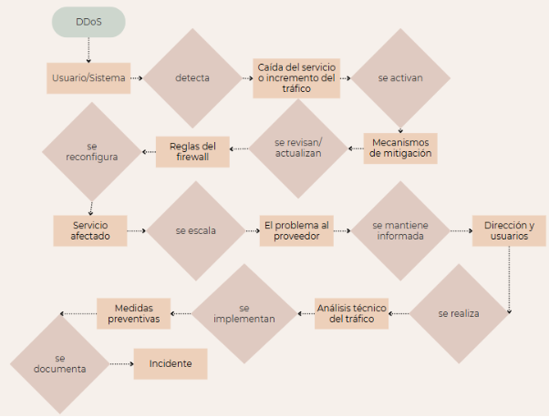

**Ataque de denegación de servicio (DDoS)**

Un ataque DDoS busca saturar un servidor o red para que deje de prestar servicio. Se detecta generalmente por la caída del servicio o el incremento repentino del tráfico de red.

La respuesta incluye activar los mecanismos de mitigación proporcionados por el ISP o soluciones anti-DDoS. También se revisan y actualizan las reglas del firewall para limitar el tráfico entrante desde IPs maliciosas. En algunos casos, puede ser necesario reconfigurar el servidor afectado o escalar el problema al proveedor de servicios.

Durante y después del ataque, se mantiene informada a la dirección y a los usuarios sobre el estado del servicio. Una vez recuperada la disponibilidad, se realiza un análisis técnico del tráfico, se implementan medidas preventivas adicionales y se documenta el incidente para futuras referencias.

