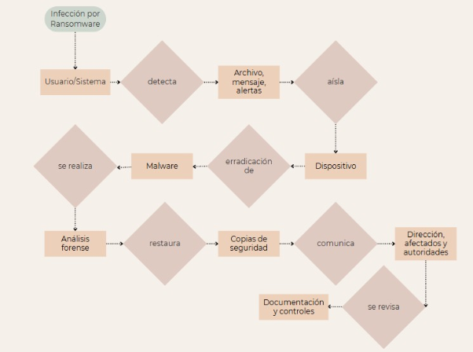

**Infección por Ransomware**

Una infección por ransomware representa una de las amenazas más críticas, ya que puede cifrar información sensible, interrumpir los servicios y dañar gravemente la reputación de la organización. En este caso, la respuesta comienza con la identificación de indicios como archivos cifrados, mensajes de rescate o alertas de herramientas de seguridad.

Una vez detectado, el dispositivo afectado se aísla inmediatamente de la red para evitar que el ransomware se propague a otros sistemas. Esto puede implicar la desconexión física, el aislamiento lógico o la desactivación del usuario. Posteriormente, se lleva a cabo una erradicación completa del malware, lo que implica el análisis forense para identificar el punto de entrada, así como la limpieza del sistema o su reinstalación.

La recuperación implica restaurar los datos desde copias de seguridad limpias y verificadas. Es crucial asegurarse de que los backups no estén comprometidos. Finalmente, se comunica el incidente a la dirección, a los afectados (si corresponde) y a las autoridades, y se lleva a cabo una sesión de revisión para documentar el caso y reforzar los controles existentes.

