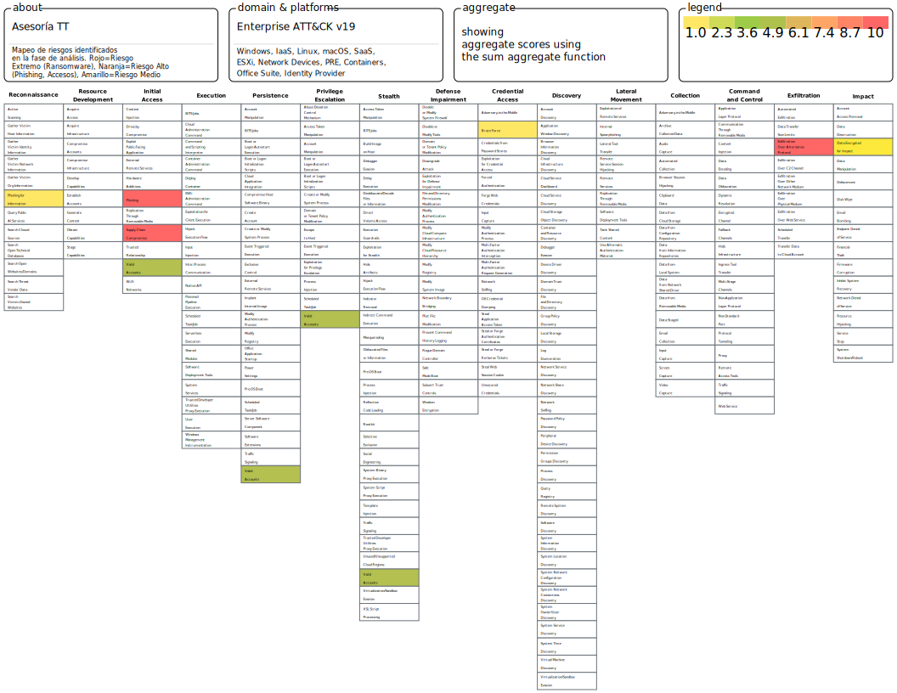
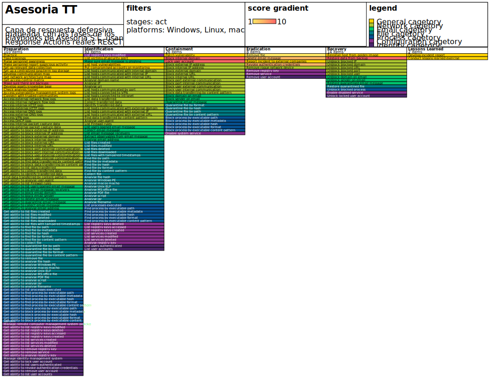
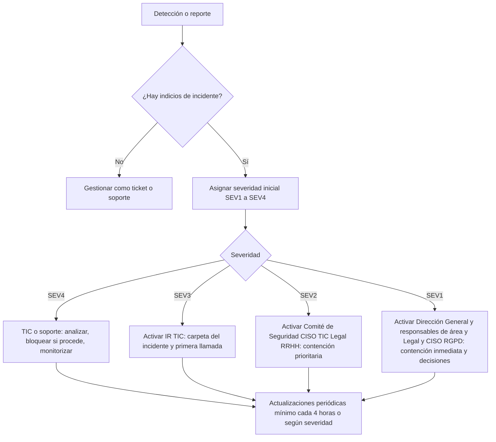

# Plan de respuesta a incidentes para Asesoría de PYMES y Autónomos

Autores: Grupo 5 (Sergio G., Iván P., Manuel P. y Javier C.), grupo5@asesorias-pymes.local

Revisión 1.0, Publicado 19 May 2026

Este plan de respuesta a incidentes está basado en el plan conciso, directivo, específico, flexible y gratuito disponible en [Github](https://github.com/counteractive/incident-response-plan-template) de Counteractive Security y discutido en [www.counteractive.net](https://www.counteractive.net/blog/an-ir-plan-you-will-use/)


Fue revisado por última vez el 19 May 2026. Fue probado por última vez en 19 May 2026 (simulacro tabletop interno).

## Contexto de la empresa y alcance (resumen operativo)

La organización es una asesoría (contable/fiscal/laboral/legal) con ~150 empleados y 2 sedes. Opera en entorno híbrido (infraestructura interna + servicios externos/nube).

Activos críticos destacados (según PDS):
- Datos de clientes (confidencialidad e integridad altas; RGPD).
- Servidores principales (servidor de archivos y aplicaciones).
- Software de gestión interna.

Riesgos más críticos documentados (según PDS):
- Ransomware en servidor de archivos.
- Accesos no autorizados en red interna (contraseñas débiles / segmentación insuficiente).
- Debilidades en copias de seguridad (externalización/validación insuficientes).

Áreas en alcance directo del PDS: TIC, RRHH, Facturación/Ventas y Legal. Fuera de alcance: web corporativa (proveedor), seguridad física (externalizada), equipos personales.

## Preparación (mínimo necesario, alineado con el PDS)

Esta sección existe porque los incidentes "durante" solo salen bien si lo previo está listo. Estado actual (según PDS): madurez global ~74% (ISO 27002), con brechas en formación y backups externos/validación.

Controles/proyectos que habilitan respuesta eficaz (PDS 2025–2027):
- PRY-001/002: formación + concienciación (phishing/errores humanos).
- PRY-003: copias cifradas y externas con verificación y pruebas de restauración.
- PRY-004: segmentación y monitorización de red.
- PRY-005: SGSI (ISO 27001) para formalizar roles, políticas y evidencias.

Entregables de preparación mínimos que deben existir antes de un SEV1/SEV2:
- Lista de guardias y roles (Incident Commander, TIC, Legal, RRHH) y canal oficial de comunicación.
- Ubicación de la carpeta segura del incidente (evidencias, timeline, decisiones, IOCs).
- Procedimiento de preservación de evidencias (cadena de custodia, hash, acceso mínimo).
- Fuentes de logs priorizadas: firewall, servidores, endpoints, autenticación (según disponibilidad).

## Mapeo de Amenazas y Respuesta (MITRE ATT&CK & RE&CT)

Para estructurar la respuesta durante un incidente, este plan utiliza las matrices **MITRE ATT&CK** (perspectiva del atacante) y **MITRE RE&CT** (perspectiva del defensor), garantizando que las respuestas sean estándar, eficaces y, sobre todo, **ciberresilientes**.

A continuación se muestra el mapeo directo entre nuestros incidentes más probables (según el análisis de riesgos sectorial de Asesoría PYMES) y los Playbooks específicos desarrollados:

### 1. Mapa de Amenazas (MITRE ATT&CK)
Se han priorizado las técnicas que afectan directamente al sector (Ransomware, Phishing, Robo de identidades y Cadena de Suministro).



* **Riesgo Crítico (Rojo):** `T1486` (Data Encrypted for Impact) y `T1048` (Exfiltration Over Alternative Protocol). Estos conforman el **Playbook de Ransomware**, donde el riesgo de paralización del negocio y la doble extorsión por pérdida de datos fiscales es inaceptable.
* **Riesgo Alto (Naranja):** `T1566` (Phishing), `T1078` (Valid Accounts) y `T1195` (Supply Chain Compromise). Técnicas abordadas en nuestros **Playbooks de Phishing, Identidad y Cadena de Suministro**.
* **Riesgo Medio (Amarillo):** `T1598` (Phishing for Information) y `T1110` (Brute Force). Acciones pre-ataque mitigadas en el **Playbook de Ingeniería Social**.

### 2. Acciones Defensivas y Resiliencia (MITRE RE&CT)
Cada técnica detectada desencadena acciones concretas de los playbooks en las fases de Contención, Erradicación y Recuperación, apostando siempre por mantener la continuidad operativa.



**Medidas implementadas en el plan:**
* **Contención:** 
  * *Isolate Network:* Aislamiento inmediato de servidores afectados por Ransomware para cortar el cifrado de datos fiscales.
  * *Disable Account* y *Reset Password:* Bloqueo de identidades comprometidas en ataques T1078.
* **Erradicación:** 
  * *Delete Email Message / Remove File:* Purga a nivel organizativo de los vectores iniciales (phishing/malware).
* **Recuperación (Ciberresiliencia):**
  * *Restore System from Backup:* Medida vital tras un ataque de Ransomware. Asegura que la empresa levanta su ERP/CRM desde copias desconectadas sin tener que negociar la extorsión.

Uso operativo durante el incidente:
- **Investigar:** Buscar siempre el TTP (Técnica) según ATT&CK en el EDR o en los logs.
- **Remediar:** Vincular cada TTP detectado de forma estricta a su bloque en RE&CT (Ej. detectar T1486 -> activar Isolate Network inmediatamente).

## Métricas y mejora continua (KPIs/KRIs)

Estas métricas se alinean con los objetivos del PDS y se revisan en comité (cadencia sugerida: mensual para operativas, trimestral para estratégicas):

Métrica | Definición | Objetivo (según PDS / recomendación)
---|---|---
MTTD | Tiempo medio desde el primer evento hasta la detección | Reducir trimestre a trimestre
MTTC | Tiempo medio hasta contención efectiva | Reducir trimestre a trimestre
MTTR | Tiempo medio hasta restauración segura | Compatible con continuidad y criticidad
Backups externos validados | % de sistemas críticos con copia cifrada externa + verificación | 100% (PRY-003)
Pruebas de restauración | Nº de pruebas/periodo y % exitosas | 4/año (PRY-003)
Formación completada | % empleados formados en ciberseguridad | 90% (PRY-001)
Phishing simulado | % de clics en campañas internas | <5% (PRY-002)
Segmentación de red | % segmentación implementada | 100% (PRY-004)
Incidentes de red | Nº incidentes de red (normalizado) | reducción >=50% (PRY-004)

# Evaluar

1. **Mantenga la calma y la profesionalidad.**
2. Reúna la información pertinente, _por ejemplo_, alarmas, eventos, datos, suposiciones, intuiciones (**observar**).
3. Considerar las categorías de impacto, a continuación (**orientar**), y determinar si hay un posible incidente (**decidir**):
4. Iniciar una respuesta si hay un incidente (**actuar**).  En caso de duda, inicie una respuesta. El responsable de gestión de incidentes y el equipo de respuesta pueden ajustarse tras la investigación y la revisión.

## Evaluar el impacto funcional

¿Cuál es el impacto directo o probable en su trabajo? (_por ejemplo_, operaciones comerciales, empleados, clientes, usuarios)

* Degradación o fracaso del trabajo/negocio: **incidente!**
* Ninguno: evalúe el impacto de la información.

## Evaluar el impacto de la información

¿Cuál es el impacto directo o probable sobre sus datos/información, en particular los sensibles? (_por ejemplo_, información personal, datos de propiedad, financieros o sanitarios)

* Información a la que se ha accedido, extraído, modificado o eliminado: **incidente!**
* Ninguno: gestión a través de canales no relacionados con incidentes (por ejemplo, un ticket de soporte).

**Cada miembro del equipo está facultado para comenzar este proceso.** Si ves algo, dilo.

## Determinar severidad (mínimo viable)

Una vez confirmado que es un incidente, determine una severidad inicial para guiar escalado, comunicación y priorización.

Severidad | Descripción | Ejemplo
--------- | ----------- | ------
SEV1 | Impacto crítico en negocio o datos sensibles | Ransomware, caída total
SEV2 | Impacto importante parcialmente contenido | Compromiso de cuenta privilegiada
SEV3 | Impacto limitado | Malware aislado
SEV4 | Evento sin impacto confirmado | Phishing reportado

## Tabla de clasificación inicial (triage)

Complete estos campos en la primera llamada y en el archivo del incidente.

Campo | Valor
----- | -----
Vector probable | Email/phishing; Endpoint; Credenciales; SaaS; Cloud; VPN; Web app; Insider; Supply chain
Severidad inicial | SEV1/SEV2/SEV3/SEV4
Sistemas/servicios afectados | 
Identidad/cuenta afectada | 
Datos potencialmente afectados | 
Clasificación de datos afectada | Pública; Interna; Confidencial; Restringida
Estado | Sospecha; Confirmado; Contenido; En recuperación; Cerrado
Propietario de negocio | 

## Escalado y toma de decisiones (diagrama)



# Iniciar la respuesta

## Nombre del incidente

Cree una [frase simple de dos palabras](http://creativityforyou.com/combomaker.html) para referirse al incidente -un nombre en clave- que se utilizará para el archivo y el canal del incidente.

Recomendación de nomenclatura (mínimo viable):
1. Dos palabras, sin datos sensibles.
2. Añada fecha si hay riesgo de colisión (por ejemplo, "Aurora Papel 2026-05-18").
3. Use exactamente el mismo nombre en el chat/canal, en la carpeta del incidente y en el informe.

## Reunir el equipo de respuesta

1. Llame al Incident Commander de turno/de guardia usando Contacto interno y mención directa mediante Discord (Grupo5-IC) y validando el responsable en Repositorio privado de GitHub del Grupo 5 (roles y guardias).
2. **No** discuta el incidente fuera del equipo de respuesta a menos que el Incident Commander lo autorice
3. Inicie y/o únase al chat de respuesta en Servidor de Discord del Grupo 5 - canal privado de respuesta a incidentes.
  - Cree un canal o hilo específico del incidente (por ejemplo, `#inc-<nombre-del-incidente>`).
  - Fije un mensaje inicial con: nombre, hora de inicio, resumen (vector/impacto), y quién es el IC.
4. Iniciar y/o unirse a la llamada de respuesta en +34 000 00 00 00 y/o Canal de voz de Discord del Grupo 5.
  - Publique en el chat el enlace/datos de acceso.
  - Mantenga una única sala/puente "oficial" para evitar duplicidades.
5. Preferible usar la llamada de voz, el chat y el intercambio seguro de archivos sobre cualquier otro método.
6. **No** utilizar el correo electrónico principal si es posible. Si el correo electrónico es necesario, utilícelo con moderación o use grupo5.backup@gmail.com.
  - No incluya datos sensibles innecesarios en correo.
  - Encripte los correos electrónicos cuando cualquier participante esté fuera del dominio asesorias-pymes.local.
7. **No** usar SMS/texto para comunicar el incidente, a menos que sea para decirle a alguien que se mueva a un canal más seguro.
8. Invite al personal de turno/guardia a la llamada y al chat de respuesta.
   * Invite al equipo de seguridad según Comité de Seguridad: CISO + TIC + RRHH + Legal + jefaturas según necesidad.
   * Invitar al SME de los equipos y sistemas afectados según SMEs: Admin. Sistemas, Admin. Redes, responsables de procesos (RRHH, Legal, Comercial).
   * Invitar a ejecutivos y/o asesoría según Dirección General + responsables de área (TIC, RRHH, Legal, Comercial) (priorice operativos si hay urgencia).
9. OPCIONAL:_ Establecer una sala de colaboración en persona ("sala de guerra") para incidentes complejos o graves. Si es remoto, use un canal de voz dedicado en Canal de voz de Discord del Grupo 5.

### Referencia: Estructura del equipo de respuesta

* Equipo de Mando
  * [Incident Commander](#rol-incident-commander)
  * [Incident Commander-Adjunto](#rol-delegado-del-incident-commander-subdelegado)
  * [Escriba](#rol-scriba)
* Equipo de enlace
  * Enlace [interno](#rol-enlace)
  * Enlace externo
* Equipo de operaciones
  * [Expertos en la materia](#rol-experto-en-la-materia-subject-matter-expert-sme) (SME) para sistemas
  * SME para equipos/unidades de negocio
  * SME para Funciones Ejecutivas (_por ejemplo_, Legal, RRHH, Finanzas)

### Referencia: Información de contacto del equipo de respuesta

Rol del equipo de respuesta         | Información de contacto
----------------------------------- | ---------------------------
Pager del Incident Commander        | Grupo5-IC
URL del Incident Commander          | Contacto interno y mención directa mediante Discord
Lista del Incident Commander        | Repositorio privado de GitHub del Grupo 5 (roles y guardias)
Lista del equipo de seguridad       | Comité de Seguridad: CISO + TIC + RRHH + Legal + jefaturas según necesidad
Lista del equipo SME                | SMEs: Admin. Sistemas, Admin. Redes, responsables de procesos (RRHH, Legal, Comercial)
Lista de ejecutivos                 | Dirección General + responsables de área (TIC, RRHH, Legal, Comercial)

## Establecer el ritmo de batalla

### Realizar la primera llamada de respuesta

1. Realice la llamada inicial utilizando la [estructura de llamada de respuesta inicial](#referencia-estructura-de-la-llamada-de-respuesta-inicial)
2. Siga las instrucciones del Incident Commander.  Si el Incident Commander de turno/de guardia no se une a la llamada **dentro de 15 minutos** y usted es un Incident Commander capacitado, tome el mando de la llamada.
3. Siga las [instrucciones correspondientes a su función](#roles).
4. Siga la llamada y el chat, y comente según corresponda.  Si no es un SME, comunique las aportaciones a través del SME de su equipo si es posible.
5. **Mantenga la llamada y el chat activos durante todo el incidente para una comunicación basada en eventos.**
6. Programe actualizaciones **cada 4 horas** sobre la comunicación activa.

#### Referencia: Estructura de la llamada de respuesta inicial

* Incident Commander (IC): Mi nombre es [NOMBRE], soy el Incident Commander.  He designado a [NOMBRE] como adjunto y a [NOMBRE] como escriba. ¿Quién está en la llamada?
* ESCRIBA: [Toma asistencia]
* IC: [Si falta personal clave] Adjunto, por favor llame a [PERSONAL FALTANTE].
* IC: [Hace preguntas para comprender la situación, los síntomas, el alcance, el vector, el impacto y el calendario del reportador del incidente, los SME aplicables para los sistemas y las unidades de negocio].
* SMEs: [Responde brevemente a las preguntas del IC].
* IC: [Si se trata de un incidente]:
  * En este momento, el resumen del incidente es el siguiente: [reitera el resumen].  El equipo de investigación estará dirigido por [NOMBRE], el equipo de reparación estará dirigido por [NOMBRE] y el equipo de comunicación estará dirigido por [NOMBRE].  Ellos coordinarán la composición del equipo y me informarán.  Los miembros del equipo, por favor, informen a su jefe de equipo correspondiente.
  * ¿Qué medidas de investigación, corrección o comunicación se han tomado ya? [esta debería ser una lista corta, pero tiene que salir ahora]
  * Esta llamada y el chat permanecerán activos y disponibles hasta el cierre del incidente, por favor, utilícelos para todas las comunicaciones relacionadas con el incidente.  Proporcione actualizaciones de estado en tiempo real en el chat, si es posible.  ¿Hay alguna pregunta o aportación restante? [responde a las preguntas]
  * Líderes de equipo, por favor procedan con sus acciones planeadas.  Nos reuniremos de nuevo en [UPDATE_TIME] para discutir el estado.  Gracias.
* IC: [Si esto no es un incidente]: En este momento, estos hechos no alcanzan el nivel de un incidente.  Me coordinaré directamente con el reportador del incidente para las acciones de seguimiento.  Gracias por su tiempo.

#### Referencia: Etiqueta de la llamada

* Únase tanto a la llamada como al chat.
* Mantenga el ruido de fondo al mínimo.
* Mantenga su micrófono silenciado hasta que tenga algo que decir.
* Identifícate cuando te unas a la llamada; di tu nombre y tu función (por ejemplo, "Soy el SME del equipo x").
* Habla con claridad.
* Sea directo y objetivo.
* Mantenga conversaciones/discusiones cortas y al grano.
* Comunicar cualquier preocupación al Incident Commander (CI) en la llamada.
* Respetar las limitaciones de tiempo impuestas por el Incident Commander.
* **Utilizar una terminología clara y evitar acrónimos o abreviaturas. La claridad y la precisión son más importantes que la brevedad.

### Realizar la actualización de la respuesta

* Llevar a cabo actualizaciones programadas utilizando la [estructura de llamada de actualización](#referencia-estructura-de-la-llamada-de-actualización-de-la-respuesta) cada 4 horas en el puente activo.
* Ajustar la frecuencia según sea necesario.
* Coordinar las actualizaciones independientes (_por ejemplo_, ejecutivas, legales) según sea necesario, pero con la menor frecuencia posible.

#### Referencia: Estructura de la llamada de actualización de la respuesta

* Incident Commander (IC): Desde la última actualización programada, el resumen del incidente es el siguiente:
  * [Impacto]
  * [Vector]
  * [Actualización del resumen]
  * [Actualización de la línea de tiempo]
* IC: Equipo de investigación, por favor proporcione una breve actualización
  * LÍDER DE LA INVESTIGACIÓN: [Actividades de investigación o "nada que informar"]
  * ¿Cuál es su plan de investigación recomendado?
  * ¿Qué acciones de investigación necesitan ser asignadas o aprobadas?  [escuchar, obtener consenso, encargar/aprobar]
* IC: Equipo de remediación, por favor proporcione una breve actualización
  * Líder de remediación: [Actividades de remediación o "nada que informar"]
  * ¿Cuál es su estrategia de corrección recomendada?  ¿Objeciones fuertes? [escuchar, obtener el consenso, asignar/aprobar]
  * ¿Qué acciones de corrección necesitan ser asignadas o aprobadas?
* IC: Equipo de comunicación, por favor, proporcione una breve actualización:
  * COMMUNICATIONS LEAD: [Actividades de comunicación o "nada que informar"]
  * ¿Cuál es su estrategia de comunicación recomendada?  ¿Objeciones fuertes? [escuchar, obtener consenso, encargar/aprobar]
  * ¿Qué acciones de comunicación necesitan ser asignadas o aprobadas?
* IC: Esta llamada y el chat permanecerán activos y disponibles hasta el cierre del incidente, por favor, utilícelos para todas las comunicaciones relacionadas con el incidente.  Si es posible, proporcione actualizaciones del estado en tiempo real en el chat.  ¿Hay alguna pregunta o aportación restante? [responde a las preguntas]
* IC: Líderes de equipo, por favor procedan.  Nos reuniremos de nuevo en [por definir en la llamada] para discutir el estado. Gracias.

## Supervisar el alcance

* Supervisar el alcance de la respuesta para asegurarse de que no excede el ámbito de control del Incident Commander.
* Si un incidente es lo suficientemente complejo y hay suficientes intervinientes, considere la posibilidad de crear subequipos.

### Crear Sub-Equipos

* En la preparación de incidentes complejos, se predefinen tres subequipos: Investigación, Remediación y Comunicación, generalmente responsables de esas funciones de respuesta.
* Crear un puente de llamadas y un chat para cada subequipo.
* El Incident Commander designará a los líderes de los equipos, que dependen del IC, y a los miembros de los equipos, que dependen de su líder.  _Los líderes de equipo no tienen que estar formados como Incident Commanders, pero es preferible que tengan alguna experiencia de liderazgo._
* El Incident Commander puede ajustar el propósito o el nombre de los subequipos según sea necesario.
* Si desea cambiar de equipo, pregunte a su **líder de equipo actual**.  **No** pregunte al Incident Commander, o al líder del otro(s) equipo(s).  Utilice la cadena de mando.

### Incidente dividido

Si un incidente resulta ser dos o más incidentes distintos:

* Establezca un nuevo [archivo de incidentes](#crear-archivo-del-incidente).
* Haga un seguimiento y coordine la investigación, la reparación y la comunicación en el archivo correspondiente.
* Considere la posibilidad de establecer subequipos para cada incidente.
* **Mantener un Incident Commander de alto nivel**, para coordinar los activos de baja densidad y alta demanda y mantener la unidad de mando.

# Investigar

**[Investigar](#investigar), [Remediar](#remediar) y [Comunicar](#comunicar) en paralelo, utilizando equipos separados, si es posible.** El Incident Commander coordinará estas actividades.  Notifique al Incident Commander si hay pasos que el equipo debe considerar.

## Crear archivo del incidente

1. Cree un nuevo archivo de incidentes en Google Drive privado del proyecto + carpeta segura de incidentes utilizando el [nombre del incidente](#nombre-del-incidente).  Utilice este archivo para el almacenamiento seguro de documentación, pruebas, artefactos, _etc._.
    * Proporcionar un almacenamiento digital seguro.
    * Proporcionar un intercambio de archivos seguro.
    * Obtener almacenamiento físico.
    * Compartir la ubicación del archivo del incidente en la llamada y el chat.
1. Documente el impacto funcional y de la información, si se conoce (véase [Evaluar](#evaluar)).
1. Documente la severidad inicial y la clasificación de datos afectada (véase [Tabla de clasificación inicial](#tabla-de-clasificacion-inicial-triage)).
2. Documentar el vector, si se conoce (por ejemplo: web, correo electrónico, credenciales/acceso remoto, endpoint, red, nube/SaaS, medios extraíbles).
3. Documente el resumen del incidente: un breve resumen del vector, el impacto, la investigación y la situación de la reparación, si se conoce.
4. Documente la línea de tiempo del incidente, incluyendo la actividad del atacante y la actividad de la respuesta.
5. Documente los pasos de investigación, reparación y comunicación.  Documente las actividades de forma independiente para que puedan combinarse y reutilizarse, si es posible.
6. Registre la información significativa, como:
    **Pruebas**, con la hora de recogida, la fuente, la cadena de custodia, _etc._.
    * **Sistemas afectados**, con el modo y el momento en que se identificó el sistema, y el resumen del efecto (_por ejemplo, tiene malware, datos a los que se ha accedido).
    * **Archivos de interés**, como el malware o los archivos de datos, con el sistema y los metadatos.
    * **Datos accedidos y extraídos**, con nombres de archivos, metadatos y hora de presunta exposición.
    * **Actividad significativa del atacante**, como inicios de sesión y ejecución de malware, con la hora del evento.
    * **Indicadores de compromiso (IOC)** basados en la red, como direcciones IP y dominios.
    * **Indicadores de compromiso basados en el host**, como nombres de archivos, hashes y claves de registro.
 * **Cuentas comprometidas**, con el alcance del acceso y la hora del compromiso.


## Recoger las pistas iniciales

1. Entrevistar a los reportadores del incidente.
2. Recoger los datos de apoyo iniciales (_p. ej._, alarmas, eventos, datos, suposiciones, intuiciones) en el archivo del incidente.
3. Entrevistar a lo(s) SME con experiencia en el dominio o el sistema, para comprender los detalles técnicos, el contexto y el riesgo.
4. Entrevistar a lo(s) SME de la unidad de negocio afectada, para comprender el impacto de la misión/negocio, el contexto y el riesgo.
5. Asegúrese de que las pistas son relevantes, detalladas y procesables.

### Referencia: Lista de recursos de respuesta

Recurso                             | Ubicación
----------------------------------- | -----------------------------------
Lista de información crítica        | Activos/datos críticos: datos de clientes, RRHH, servidores y software de gestión (según PDS)
Lista de activos críticos           | Inventario de activos del laboratorio y sistemas simulados de la asesoría
Base de datos de gestión de activos | Repositorio de documentación técnica y activos TIC
Mapa de red                         | Esquema de red y segmentación (PRY-004) almacenado en Drive
Consola SIEM                        | Servidor ELK del laboratorio
Agregador de registros              | Panel centralizado de logs ELK


## Actualizar el plan de investigación y el archivo del incidente

1. Revisar y perfeccionar el impacto del incidente.
2. Revisar y refinar el vector del incidente.
3. Revisar y perfeccionar el resumen del incidente.
4. Revisar y perfeccionar la línea de tiempo del incidente con hechos e inferencias.
5. Crear hipótesis: qué puede haber ocurrido y con qué seguridad.
6. **Identificar y priorizar las preguntas clave** (lagunas de información) para apoyar o desacreditar las hipótesis.
    * Utilizar la matriz ATT&CK de MITRE o un marco similar para [desarrollar preguntas](#referencia-tactica-del-atacante-a-la-matriz-de-preguntas-clave).
        * [ATT&CK for Enterprise](https://attack.mitre.org/wiki/Main_Page), incluyendo enlaces a los específicos de Windows, Mac y Linux.
        * [ATT&CK Mobile Profile](https://attack.mitre.org/mobile/index.php/Main_Page) para dispositivos móviles.
    * Utilizar palabras interrogativas como inspiración:
        * **¿Cuándo?**: primer compromiso, primera pérdida de datos, acceso a x datos, acceso a y sistema, etc.
        * **¿Qué?**: impacto, vector, causa de origen, motivación, herramientas/explotaciones utilizadas, cuentas/sistemas comprometidos, datos atacados/perdidos, infraestructura, IOCs, etc.?
        * **¿Dónde?**: ubicación del atacante, unidades de negocio afectadas, infraestructura, etc.?
        * **¿Cómo?**: compromiso (explotación), persistencia, acceso, exfiltración, movimiento lateral, etc.?
        * **¿Por qué?**: objetivo, momento, acceso a x datos, acceso a y sistema, etc.
        * **¿Quién?**: atacante, usuarios afectados, clientes afectados, etc.?
1. **Identificar y priorizar los dispositivos y estrategias testigo** para responder a las preguntas clave.
    * Consultar los diagramas de la red, los sistemas de gestión de activos y la experiencia de las SME
    * Consultar la [Lista de recursos de respuesta](#referencia-lista-de-recursos-de-respuesta)
1. Consulte las [guías operativas (playbooks)](#guias-operativas-playbooks) para conocer preguntas clave, dispositivos testigo y estrategias para investigar amenazas comunes o muy dañinas.

**El plan de investigación es fundamental para una respuesta eficaz; impulsa todas las acciones de investigación.  Utilice el pensamiento crítico, la creatividad y el buen juicio.**

### Referencia: Táctica del atacante a la matriz de preguntas clave

Táctica del atacante    | La forma en que los atacantes ...      | Posibles preguntas clave
----------------------- |----------------------------------------| -----------------------------------
Reconocimiento          | ... aprender sobre los objetivos       | ¿Cómo? ¿Desde cuándo? ¿Dónde? ¿Qué sistemas?
Desarrollo de recursos  | ... construir infraestructuras.        | ¿Qué sistemas?
Acceso inicial          | ... entrar                             | ¿Cómo? ¿Desde cuándo? ¿Dónde? ¿Qué sistemas?
Ejecución               | ... ejecutar código hostil             | ¿Qué malware? ¿Qué herramientas? ¿Dónde? ¿Cuándo?
Persistencia            | ... quedarse en el sistema             | ¿Cómo? ¿Desde cuándo? ¿Dónde? ¿Qué sistemas?
Escalada de Privilegios | ... obtener acceso de mayor nivel      | ¿Cómo? ¿Dónde? ¿Qué herramientas?
Evasión de la defensa   | ... esquivar la seguridad              | ¿Cómo? ¿Dónde? ¿Desde cuándo?
Acceso a credenciales   | ... obtener/crear cuentas              | ¿Qué cuentas? ¿Desde cuándo? ¿Por qué?
Descubrimiento          | ... aprender nuestra red               | ¿Cómo? ¿Dónde? ¿Qué saben?
Movimiento lateral      | ... moverse                            | ¿Cómo? ¿Cuándo? ¿Qué cuentas?
Recogida                | ... encontrar y reunir datos           | ¿Qué datos? ¿Por qué? ¿Cuándo? ¿Dónde?
Mando y control         | ... herramientas y sistemas de control | ¿Cómo? ¿Dónde? ¿Quién? ¿Por qué?
Exfiltración            | ... tomar datos                        | ¿Qué datos? ¿Cómo? ¿Cuándo? ¿Dónde?
Impacto                 | ... romper cosas.                      | ¿Qué sistemas o datos? ¿Cómo? ¿Cuándo? ¿Dónde? ¿Cómo de malo?

Consulte la página [MITRE ATT&CK](https://attack.mitre.org/) para obtener más información e ideas.

## Crear y desplegar indicadores de compromiso (IOC)

> Haga hincapié en los indicadores **dinámicos y de comportamiento** junto con las huellas digitales estáticas.

* Crear IOCs basados en [pistas iniciales](#recoger-las-pistas-iniciales) y [análisis](#analizar-las-pruebas).
* Cree IOCs usando un formato abierto soportado por sus herramientas (_por ejemplo_, [STIX 2.0](https://oasis-open.github.io/cti-documentation/stix/intro)), si es posible.
* Utilice la automatización, si es posible.
* **No** desplegar "feeds" de IOCs no relacionados y no curados, ya que pueden causar confusión y fatiga.
* Considerar todos los tipos de IOCs:
  * IOCs basados en la red, como direcciones IP o MAC, puertos, direcciones de correo electrónico, contenido o metadatos del correo electrónico, URLs, dominios o patrones PCAP.
  * IOCs basados en el host, como rutas, hashes de archivos, contenido o metadatos de archivos, claves de registro, MUTEXes, autoejecuciones o artefactos y permisos de usuarios.
  * IOCs basados en la nube, como patrones de registro para despliegues [SaaS](https://en.wikipedia.org/wiki/Software_as_a_service) o [IaaS](https://en.wikipedia.org/wiki/Infrastructure_as_a_service)
  * IOCs de comportamiento (a.k.a., patrones, TTPs) tales como patrones de árbol de procesos, heurística, desviación de la línea base y patrones de inicio de sesión.
* Correlacionar varios tipos de IOCs, como indicadores basados en la red y en el host en los mismos sistemas.

## Identificar los sistemas de interés

1. Validar si son relevantes.
2. Categorizar la(s) razón(es) por la(s) que son "de interés": tiene malware, acceso por cuenta comprometida, tiene datos sensibles, etc.  Trátelas como "etiquetas", puede haber más de una categoría por sistema.
3. Prioriza la recogida, el análisis y la reparación en función de las necesidades de la investigación, el impacto en el negocio, _etc_.

## Recogida de pruebas

* Priorizar en base al plan de investigación
* Recoger datos de respuesta en vivo utilizando Velociraptor.
* Recoger los registros relevantes de los sistemas (si no forman parte de la respuesta en vivo), agregadores, SIEM o consolas de dispositivos.
* Recoger la imagen de la memoria, si es necesario y si no forma parte de la respuesta en vivo, utilizando WinPmem.
* Recoger la imagen del disco, si es necesario, utilizando FTK Imager.
* Recoger y almacenar las pruebas de acuerdo con la política, y con la cadena de custodia adecuada.

Considere la posibilidad de recopilar los siguientes artefactos como evidencia, ya sea en tiempo real (_por ejemplo_, a través de EDR o un SIEM) o bajo demanda:

###  Ejemplo de artefactos útiles

* Procesos en ejecución
* Servicios en ejecución
* Hashes ejecutables
* Aplicaciones instaladas
* Usuarios locales y de dominio
* Puertos de escucha y servicios asociados
* Configuración de resolución del sistema de nombres de dominio (DNS) y rutas estáticas
* Conexiones de red establecidas y recientes
* Clave de ejecución y otra persistencia de la ejecución automática
* Tareas programadas y trabajos cron
* Artefactos de ejecución pasada (por ejemplo, Prefetch y Shimcache)
* Registros de eventos
* Política de grupo y artefactos WMI
* Detecciones antivirus
* Binarios en ubicaciones de almacenamiento temporal
* Credenciales de acceso remoto
* Telemetría de conexiones de red (por ejemplo, netflow, permisos de cortafuegos)
* Tráfico y actividad de DNS
* Actividad de acceso remoto, incluido el Protocolo de Escritorio Remoto (RDP), la red privada virtual (VPN), SSH, la informática de red virtual (VNC) y otras herramientas de acceso remoto
* Cadenas de identificadores de recursos uniformes (URI), cadenas de agentes de usuario y acciones de aplicación del proxy
* Tráfico web (HTTP/HTTPS)

## Analizar las pruebas

* Priorizar basándose en el plan de investigación
* Analizar y clasificar los datos de la respuesta en vivo
* Analizar la memoria y las imágenes de disco (es decir, realizar análisis forenses)
* Analizar el malware
* _OPCIONAL:_ Enriquecer con investigación e inteligencia
* Documentar nuevos indicadores de compromiso (IOCs)
* Actualizar el archivo del caso

### Ejemplo de indicadores útiles

* Comportamiento inusual de autenticación (_p. ej._, frecuencia, sistemas, hora del día, ubicación remota)
* Nombres de usuario con formato no estándar
* Binarios no firmados que se conectan a la red
* Balizamiento o transferencias de datos significativas
* Solicitudes de línea de comandos PowerShell con comandos codificados en Base64
* Actividad excesiva de RAR, 7zip o WinZip, especialmente con nombres de archivo sospechosos
* Conexiones en puertos no utilizados previamente.
* Patrones de tráfico relacionados con el tiempo, la frecuencia y el recuento de bytes
* Cambios en las tablas de enrutamiento, como la ponderación, las entradas estáticas, las pasarelas y las relaciones entre pares.

## Iterar la investigación

[Actualizar el plan de investigación](#actualizar-el-plan-de-investigación-y-el-archivo-del-incidente) y repetir hasta el cierre.

# Guías operativas (Playbooks)

Las guías operativas son anexos prácticos y accionables por tipo de incidente. Mantenga este IRP enfocado en lo estratégico/táctico y use playbooks para lo operativo.

Nota: en esta carpeta del proyecto no se incluyen playbooks separados; aquí solo se deja la referencia de cuáles serían los mínimos recomendados.

- Playbook: Identity and Access
- Playbook: Ingeniería Social
- Playbook: Phishing
- Playbook: Ransomware
- Playbook: Supply Chain

# Remediar

**[Investigar](#investigar), [Remediar](#remediar) y [Comunicar](#comunicar) en paralelo, utilizando equipos separados, si es posible.** El Incident Commander coordinará estas actividades. Notifique al Incident Commander si hay pasos que el equipo debe considerar

## Actualización del plan de remediación

1. Revise el archivo del incidente en Google Drive privado del proyecto + carpeta segura de incidentes utilizando el [nombre del incidente](#nombre-del-incidente)
2. Revise las [guías operativas (playbooks)](#guias-operativas-playbooks) aplicables.
3. Revise la [lista de recursos de respuesta](#referencia-lista-de-recursos-de-respuesta).
4. Considere qué tácticas del atacante están en juego en este incidente.  Utilice la lista de MITRE [ATT&CK](https://attack.mitre.org/wiki/Main_Page) (_i._, Persistencia, Escalada de Privilegios, Evasión de la Defensa, Acceso a Credenciales, Descubrimiento, Movimiento Lateral, Ejecución, Recolección, Exfiltración y Mando y Control), o un marco similar.
5. Desarrollar remedios para cada táctica en juego, en la medida en que sea factible teniendo en cuenta las herramientas y los recursos existentes.  Considere remedios para [Proteger](#protección), [Detectar](#detección), [Contener](#contención), y [Erradicar](#erradicar) cada comportamiento del atacante.
6. Priorizar en base a la [estrategia de tiempo](#elegir-el-momento-de-la-reparacion), el impacto y la urgencia.
7. Documentar en el archivo de incidentes.

Utilice [marcos de seguridad de la información (infosec)](https://www.nist.gov/cyberframework) como inspiración, pero **no utilice la reparación de incidentes como sustituto de un programa de infosec con un marco apropiado.** Utilícelos para complementarse.

### Protección

> "¿Cómo podemos evitar que la táctica X se repita o reducir el riesgo?  ¿Cómo podemos mejorar la protección futura?"

Utilice lo siguiente como punto de partida para la corrección de la protección:

* Parchear las aplicaciones.
* Parchee los sistemas operativos.
* Actualice las firmas de IPS de la red y del host.
* Actualizar las firmas de protección de puntos finales/EDR/antivirus.
* Reducir las ubicaciones con datos críticos.
* Reducir las cuentas administrativas o privilegiadas.
* Habilitar la autenticación multifactor.
* Reforzar los requisitos de las contraseñas.
* Bloquear los puertos y protocolos no utilizados en los límites del segmento y de la red, tanto entrantes como salientes.
* Poner en lista blanca las conexiones de red para los servidores y servicios críticos.

### Detección

> "¿Cómo podemos detectar esto en los nuevos sistemas o en el futuro?  ¿Cómo podemos mejorar la detección y la investigación en el futuro?"

Utilice lo siguiente como punto de partida para la corrección de detecciones:

* Mejorar el registro y la retención de los registros del sistema, en particular de los sistemas críticos.
* Mejorar el registro de las aplicaciones, incluidas las aplicaciones SaaS.
* Mejorar la agregación de registros.
* Actualizar las firmas de IDS de la red y del host utilizando IOC.

### Contención

> "¿Cómo podemos evitar que esto se extienda o se agrave? ¿Cómo podemos mejorar la contención en el futuro?"

Utilice lo siguiente como punto de partida para la corrección de la contención:

* Implementar listas de acceso (ACL) en los límites de los segmentos de la red.
* Implementar bloqueos en el límite de la empresa, en múltiples capas del [modelo OSI](https://en.wikipedia.org/wiki/OSI_model).
* Desactivar o eliminar el acceso de las cuentas comprometidas.
* Bloquear direcciones IP o redes maliciosas.
* Bloquee los dominios maliciosos.
* Actualizar las firmas de IPS y antimalware de la red y el host mediante IOC.
* Retirar de la red los sistemas críticos o comprometidos.
* Póngase en contacto con los proveedores para obtener ayuda (por ejemplo, proveedores de servicios de Internet, proveedores de SaaS).
* Poner en lista blanca las conexiones de red para los servidores y servicios críticos.
* Matar o deshabilitar procesos o servicios.
* Bloquear o eliminar el acceso de proveedores y socios externos, especialmente el acceso privilegiado.

### Erradicar

> "¿Cómo podemos eliminar esto de nuestros activos?  ¿Cómo podemos mejorar la erradicación en el futuro?"

Utilice lo siguiente como punto de partida para las acciones de erradicación:

* Reconstruir o restaurar los sistemas y datos comprometidos a partir de un estado bueno conocido.
* Restablecer las contraseñas de las cuentas.
* Eliminar cuentas o credenciales hostiles.
* Borrar o eliminar malware específico (¡difícil!).
* Implementar proveedores alternativos.
* Activar y migrar a ubicaciones, servicios o servidores alternativos.

## Elegir el momento de la reparación

Determine la estrategia de plazos -cuando se llevarán a cabo las acciones de remediación- involucrando al Incident Commander, a los SME y propietarios del sistema, a los SMEs y propietarios de la unidad de negocio, y al equipo ejecutivo.  Cada estrategia es apropiada en diferentes circunstancias:

* Elija la reparación **inmediata** cuando sea más importante detener inmediatamente las actividades del atacante que seguir investigando.  Por ejemplo, una pérdida financiera en curso, o un fracaso de la misión en curso, una pérdida de datos activa, o la prevención de una amenaza significativa inminente.
* Elija una reparación **retrasada** cuando sea importante completar la investigación o no alertar al atacante.  Por ejemplo, el compromiso a largo plazo de un atacante avanzado, el espionaje corporativo o el compromiso a gran escala de un número desconocido de sistemas.
* Elija la remediación **combinada** cuando las circunstancias inmediatas y retardadas se apliquen en el mismo incidente.  Por ejemplo, la segmentación inmediata de un servidor o red sensible para cumplir con los requisitos reglamentarios mientras se investiga un compromiso a largo plazo.

## Ejecutar la remediación

* Evaluar y explicar los riesgos de las acciones de remediación a las partes interesadas.
* Implementar inmediatamente aquellas acciones de remediación que afecten poco o nada al atacante (a veces llamadas "acciones de postura"). Por ejemplo, muchas de las acciones de [protección](#protección) y [detección](#detección) anteriores son buenas candidatas.
* Programar y asignar acciones de remediación de acuerdo con la estrategia de tiempo.
* Ejecute las acciones de corrección en lotes, como eventos, para lograr la máxima eficacia y el mínimo riesgo.
* Documentar el estado de ejecución y el tiempo en el archivo de incidentes, especialmente para las medidas temporales.

## Iterar la remediación

[Actualizar el plan de remediación](#actualización-del-plan-de-remediación) y repetir hasta el cierre.

# Comunicar

* [Investigar](#investigar), [Remediar](#remediar) y [Comunicar](#comunicar) en paralelo, utilizando equipos separados, si es posible.  Notifique al Incident Commander si hay pasos que el equipo debe considerar

Toda comunicación debe incluir la información más precisa disponible.  Muestre integridad.  No comunicar especulaciones.

## Comunicación Interna

### Notificar y actualizar a las partes interesadas

* Comunicarse con las partes interesadas como parte de las llamadas iniciales y de actualización, así como a través de actualizaciones basadas en eventos en la llamada y el chat.
* Coordinar las actualizaciones independientes (_p. ej._, ejecutivas, legales) según sea necesario, pero con la menor frecuencia posible, para mantener el foco en la investigación y la reparación.
* Concéntrese en la mejor evaluación del vector, el impacto, el resumen y los aspectos más destacados de la línea de tiempo, incluidos los pasos de remediación.  No especule.

### Notificar y actualizar la organización

* **No** notifique o actualice al personal que no responde hasta que el Incident Commander lo autorice, en particular si existe el riesgo de una amenaza interna.
* Coordine las actualizaciones de los equipos o de toda la organización con los ejecutivos y la dirección de la empresa.
* Concéntrese en la mejor evaluación del vector, el impacto, el resumen y los aspectos más destacados de la línea de tiempo, incluidos los pasos de remediación.  No especule.

### Crear Informe de Incidentes

* Tras el cierre del incidente, capture la información en el [archivo del incidente](#crear-archivo-del-incidente) para su distribución utilizando Plantilla de informe de incidente almacenada en GitHub.
* Distribuir el informe de incidentes a: Dirección General, CISO, TIC, Legal, RRHH (según alcance y severidad).

## Comunicar al exterior

### Notificar a los reguladores

* **No** notifique ni ponga al día al personal que no ha respondido hasta que el Incident Commander lo autorice.
* Notificar a los organismos reguladores (por ejemplo, HIPAA/HITRUST, PCI DSS, SOX) si es necesario y de acuerdo con la política.
* Coordinar los requisitos, el formato y los plazos con Área Legal + CISO (RGPD/obligaciones contractuales).

### Notificar a los clientes

* **No** notifique o actualice al personal que no responde hasta que el Incident Commander lo autorice.
* Coordine las notificaciones a los clientes con Dirección General + Comunicación/RRSS (si aplica) + CISO.
* Incluya la fecha en el título de cualquier anuncio, para evitar confusiones.
* No utilice tópicos como "nos tomamos la seguridad muy en serio". Céntrese en los hechos.
* Sea honesto, acepte la responsabilidad y presente los hechos, junto con el plan para prevenir incidentes similares en el futuro.
* Sea lo más detallado posible con la línea de tiempo.
* Sea lo más detallado posible en cuanto a la información que se vio comprometida y cómo afecta a los clientes. Si estábamos almacenando algo que no debíamos, sé honesto al respecto. Saldrá a la luz más tarde y será mucho peor.
* No hablemos de las partes externas que podrían haber causado el problema, a menos que ya lo hayan hecho público, en cuyo caso enlazaremos con su información. Comunícate con ellos de forma independiente (ver [Notificar a los proveedores](#notificar-a-los-proveedores-y-socios))
* Publique la comunicación externa lo antes posible. Las malas noticias no mejoran con el tiempo.
* Si es posible, contacte con los equipos de seguridad internos de los clientes antes de notificar al público.

### Notificar a los proveedores y socios

* **No** notifique o actualice al personal que no responde hasta que el Incident Commander lo autorice.
* Si es posible, póngase en contacto con los equipos de seguridad internos de los proveedores y socios antes de notificar al público.
* Céntrese en los aspectos específicos del incidente que afectan o implican al proveedor o socio.
* Coordine los esfuerzos de respuesta y comparta la información si es posible.

### Notificar a las Fuerzas de Seguridad

* **No** notifique o actualice al personal que no responde hasta que el Incident Commander lo autorice.
* Coordinar con Dirección General + responsables de área y Área Legal (en alcance según PDS) antes de interactuar con las fuerzas del orden.
* Póngase en contacto con las fuerzas del orden locales (Policía Nacional) según procedimiento interno.
* Póngase en contacto con los operadores de los sistemas utilizados en el ataque, sus sistemas también pueden haber sido comprometidos.

### Contactar con el servicio de asistencia de respuesta externa

* Póngase en contacto con Soporte interno TIC + herramientas open source y documentación pública para apoyo especializado.
* Póngase en contacto con No aplica para coordinar comunicación externa.
* Póngase en contacto con No aplica.

### Compartir Inteligencia

* Comparta los IOCs con [Infragard](https://www.infragard.org/) si procede.
* Comparta los IOCs con Fuentes públicas de ciberseguridad y comunidades de intercambio (si aplica).

# Recuperación

La recuperación se centra en volver a la operación normal con seguridad, minimizando el riesgo de reinfección o re-compromiso.

En esta organización, la recuperación debe priorizar (según PDS):
- Restauración segura del servidor de archivos y servicios internos críticos.
- Recuperación desde copias cifradas/externas con verificación (PRY-003) y pruebas de restauración periódicas.
- Reducción de reinfección mediante segmentación/monitorización (PRY-004) y rotación de credenciales.

Checklist recomendado (genérico):

1. Confirmar criterios de "sistema limpio" antes de levantar el servicio (sin IOCs activos, cuentas rotadas, parches aplicados, monitorización reforzada).
2. Restaurar desde backups verificados cuando aplique (idealmente con pruebas de restauración previas y backups cifrados/externos).
3. Rotar credenciales relevantes (usuarios afectados, cuentas privilegiadas, API keys/tokens, cuentas de servicio).
4. Reaplicar hardening y configuración base (políticas, segmentación, MFA, reglas de firewall/WAF si aplica).
5. Validar integridad y disponibilidad:
  * pruebas funcionales por el área de negocio,
  * verificación de integridad de datos (si aplica),
  * verificación de logs/telemetría.
6. Monitorización post-incidente:
  * elevar el nivel de logging/alertas temporalmente,
  * hunting proactivo de IOCs y comportamiento anómalo.
7. Comunicación de vuelta a normalidad: informar a las partes interesadas del estado y de restricciones temporales.
8. Programar el After Action Review (AAR) en un plazo de 5 días laborables con: CISO, TIC (sistemas/redes), Legal, RRHH, Comercial/Delivery, Dirección y miembros del Grupo 5 según severidad.

**La recuperación suele estar dirigida por las unidades de negocio y los propietarios de los sistemas.  Tome medidas de recuperación sólo en colaboración con las partes interesadas pertinentes.**

1. Poner en marcha un plan de continuidad de negocio/recuperación de desastres: Por ejemplo, considerar la migración a ubicaciones operativas alternativas, sitios de conmutación por error, sistemas de copia de seguridad.
2. Integrar las acciones de seguridad con los esfuerzos de recuperación de la organización.

## Criterios de cierre técnico

El incidente podrá considerarse contenido y en recuperación cuando:

- No existan IOCs activos durante 14 días
- Las credenciales comprometidas hayan sido rotadas
- Los sistemas críticos hayan sido validados
- Los propietarios de negocio aprueben la restauración
- El Incident Commander autorice el cierre operativo

RTO objetivo: 2 horas (objetivo operativo para restauración de datos, según KPI PRY-003)

RPO objetivo: Pendiente de definir por proceso/dato crítico (no documentado en el PDS)

## After Action Review (AAR)

El AAR debe incluir:

- Qué ocurrió
- Qué funcionó bien
- Qué falló
- Decisiones clave
- Brechas de detección
- Brechas de comunicación
- Acciones correctivas
- Responsable y fecha objetivo de cada acción

# Respuesta a las preguntas (Actividad 4.01)

> Esta sección responde de forma directa a las preguntas 1.a–3.a del enunciado.  
> Para evitar repetir información del IRP, aquí se responden las preguntas y, cuando hace falta, se referencian apartados que ya están desarrollados en el documento principal.

***
## 1.a Relación MITRE ATT&CK / RE&CT con el plan de respuesta

### ¿Qué relación existe?

La relación entre MITRE ATT&CK y RE&CT con el plan de respuesta es bastante clara, porque ambos ayudan a organizar mejor la respuesta ante incidentes y a que el análisis no se quede en algo demasiado genérico.

En lugar de limitarse a ideas generales como "investigar un incidente", estos marcos permiten concretar mejor:
- qué técnicas puede estar utilizando un atacante,
- qué evidencias deberían revisarse,
- y qué acciones de contención o respuesta tienen más sentido en cada situación.

En este plan:
- **MITRE ATT&CK** se utiliza como referencia para identificar y describir técnicas de ataque. Por ejemplo, permite relacionar comportamientos observados con técnicas concretas como phishing o uso de credenciales válidas.
- **RE&CT** se utiliza de una forma más práctica, ya que ayuda a traducir esas técnicas en acciones reales de detección y respuesta, como qué monitorizar, qué bloquear o qué sistemas aislar.

***
### ¿Cómo me ayudó el trabajo previo con las matrices?

El trabajo previo con MITRE ATT&CK y RE&CT ha sido útil principalmente para estructurar mejor el plan y justificar algunas decisiones.

1. **Priorización de riesgos**  
   En lugar de intentar cubrir todos los escenarios posibles, se priorizan los más probables y críticos para la empresa, como phishing, robo de credenciales y ransomware, que además coinciden con el análisis de riesgos del PDS.

2. **Mejor definición del triage**  
   Ayuda a convertir síntomas en algo más concreto. Por ejemplo:
   - muchos intentos fallidos de acceso → posible T1110 (fuerza bruta),
   - uso de cuentas válidas → posible T1078 (credenciales legítimas).

   Esto ayuda a pasar de un simple "algo raro está pasando" a preguntas más concretas como:
   - qué usuario está implicado,
   - desde dónde se conecta,
   - cuándo empezó la actividad,
   - o qué sistemas pueden estar afectados.

3. **Definición de evidencias mínimas**  
   Cada tipo de incidente necesita conservar información distinta antes de actuar:
   - phishing: correo original, cabeceras y enlaces o adjuntos,
   - ransomware: artefactos del sistema y línea temporal antes de restaurar,
   - credenciales comprometidas: logs de autenticación y sesiones activas.

4. **Relación entre detección y respuesta**  
   RE&CT ayuda a no quedarse solo en la parte de análisis. Si se detecta un posible compromiso de credenciales, la respuesta no es únicamente investigar, sino también actuar: revocar sesiones, cambiar contraseñas y aplicar medidas de contención.

***
### Evidencias que se deberían aportar

Como soporte de este apartado, lo más adecuado sería incluir:
- un export de MITRE ATT&CK Navigator con las técnicas priorizadas,
- y una tabla de relación ATT&CK → RE&CT donde se vea el vínculo entre técnicas y acciones de detección o respuesta.

***
## 1.b Playbooks necesarios y en qué me baso para identificarlos

### Playbooks identificados

A partir del análisis de riesgos, la taxonomía y las técnicas más relevantes, los playbooks mínimos para esta empresa serían:

- Ransomware  
- Phishing  
- Ingeniería social  
- Gestión de identidades y accesos (Identity & Access)  
- Ataques a proveedores o cadena de suministro (Supply Chain)

***
### Criterios utilizados para seleccionarlos

La selección de playbooks se basa en varios elementos del análisis previo.

1. **Plan Director de Seguridad (PDS)**  
   El PDS identifica riesgos importantes como:
   - ransomware en servidores de archivos,
   - problemas relacionados con copias de seguridad,
   - debilidades en credenciales y accesos,
   - y falta de concienciación de usuarios.

   Esto justifica directamente la necesidad de playbooks relacionados con ransomware, phishing e identidad.

2. **Taxonomía de incidentes**  
   La taxonomía refuerza cuáles son los vectores más habituales dentro de la organización, especialmente correo, credenciales, acceso remoto y posibles terceros. Esto ayuda a priorizar los playbooks más útiles para incidentes reales.

3. **MITRE ATT&CK / RE&CT**  
   Las técnicas identificadas como más relevantes (por ejemplo T1566, T1078, T1110 o T1486) indican claramente qué tipos de incidentes necesitan una respuesta rápida y estandarizada.

Además, algunos comportamientos como escaneo o sniffing no se consideran playbooks independientes, ya que normalmente forman parte de fases de reconocimiento dentro de incidentes más amplios.

***
### Diagrama de ejemplo de un playbook (ransomware)

```mermaid
flowchart TD
  A[Alerta o detección] --> B{¿Indicios de cifrado}
  B -- No --> C[Triage y monitorización]
  B -- Sí --> D[Clasificación SEV1 / SEV2]
  D --> E[Preservar evidencias]
  E --> F[Contención: aislamiento de equipos]
  F --> G[Erradicación del vector de entrada]
  G --> H[Recuperación desde backups verificados]
  H --> I[Revisión y lecciones aprendidas (AAR)]
```

## 1.c Cobertura de fases del plan y valoración de fases

### ¿Cómo aseguro que cubro todas las fases?

La cobertura del plan se asegura principalmente por la propia estructura del IRP, ya que cada fase del proceso de respuesta está separada y definida dentro del documento.  
En lugar de repetir todo el contenido aquí, la evidencia está en que el flujo completo aparece organizado de forma secuencial:

**Preparación → Evaluación → Investigación → Remediación → Comunicación → Recuperación → AAR (Lessons Learned)**

Esto permite seguir el ciclo completo de gestión de incidentes sin dejar partes "sueltas" o poco definidas.

Además, el plan no solo describe qué hacer en cada fase, sino también cuándo se considera completada una etapa y cuándo se puede pasar a la siguiente. Para ello se incluyen criterios de cierre técnico y condiciones mínimas de validación.

***
### Criterios de activación y transición entre fases

Uno de los puntos importantes para que el plan sea útil es evitar ambigüedades. Por eso se definen criterios claros para activar el IRP y para escalar la severidad de un incidente.

- **Paso de evento a incidente:**  
  Se activa formalmente el proceso de respuesta cuando existe impacto funcional, afectación a la información o indicios razonables de compromiso.  
  Si existe duda, se prioriza iniciar la respuesta y ajustar posteriormente la clasificación.

- **Escalado de SEV3 a SEV2:**  
  Algunos ejemplos que justificarían el escalado serían:
  - afectación a sistemas críticos,
  - compromiso de cuentas privilegiadas,
  - múltiples equipos afectados,
  - o indicios de acceso no autorizado mantenido en el tiempo.

- **Escalado a SEV1:**  
  Se considera especialmente crítico cuando existe:
  - ransomware activo,
  - caída generalizada de servicios,
  - extorsión,
  - o una posible brecha de datos relevante relacionada con RGPD.

- **Estado de contención:**  
  Un incidente se considera contenido cuando:
  - se ha detenido la propagación,
  - los accesos comprometidos han sido bloqueados,
  - y la monitorización deja de mostrar actividad maliciosa asociada.

- **Paso a recuperación:**  
  La recuperación comienza cuando el equipo técnico considera que el entorno está suficientemente controlado y que ya es posible restaurar servicios sin riesgo alto de reinfección.

- **Cierre técnico del incidente:**  
  El cierre se realiza cuando:
  - los sistemas han sido validados,
  - las credenciales comprometidas han sido rotadas,
  - la monitorización no detecta nueva actividad,
  - y negocio aprueba el retorno a la normalidad.

***
### ¿Qué fase suele estar más floja en un plan de respuesta?

En muchos casos, la fase más débil suele ser la de **erradicación**.

Esto ocurre porque eliminar completamente la causa raíz no siempre es sencillo. A veces se restaura un sistema afectado, pero el vector inicial sigue presente, por ejemplo:
- una cuenta comprometida,
- una vulnerabilidad sin corregir,
- o una regla maliciosa que continúa activa.

Además, esta fase depende mucho de la visibilidad disponible. Si la organización no tiene buen inventario, SIEM o EDR correctamente configurados, identificar persistencia o movimiento lateral se vuelve más complicado.

También es una fase que suele generar presión por parte de negocio, ya que una erradicación completa puede implicar:
- reinicios,
- cambios masivos de credenciales,
- cortes de acceso,
- o paradas temporales de servicios.

Por último, actuar demasiado rápido puede provocar pérdida de evidencias útiles para el análisis posterior.

***
### ¿Qué fase está mejor trabajada en este plan?

La parte más sólida del plan es la relacionada con el **triage y el escalado inicial**.

Esto se debe a varios motivos:

- La clasificación SEV1–SEV4 está bien definida.
- El flujo de escalado evita decisiones improvisadas.
- Las responsabilidades están repartidas de forma clara.
- Existe una cadencia de comunicación definida según la severidad.
- Se prioriza actuar rápido durante las primeras fases del incidente.

En general, el plan intenta que las primeras decisiones sean lo más rápidas y organizadas posible, ya que normalmente son las que más influyen en limitar el impacto final.

***
## 2.a Flujo de toma de decisiones y escalado + plan de comunicación

### ¿En qué consiste el flujo de toma de decisiones y escalado?

El flujo principal de actuación ya aparece representado en el IRP mediante el diagrama de escalado y gestión de incidentes.  
El proceso sigue una secuencia lógica:

**detección → validación → clasificación → escalado → contención → recuperación**

Sin embargo, más allá del flujo técnico, en incidentes reales suelen aparecer decisiones que no son totalmente automáticas y que requieren coordinación entre diferentes áreas.

***
### Puntos de ambigüedad y decisiones humanas

Aunque el proceso esté definido, hay situaciones donde la parte humana tiene bastante peso.

- **Aislamiento de sistemas críticos:**  
  La decisión técnica suele tomarla el Incident Commander junto con el equipo técnico, pero el impacto operativo debe validarlo el responsable de negocio afectado.

- **Comunicación externa:**  
  Las decisiones relacionadas con clientes, reguladores o posibles brechas RGPD deben coordinarse con los equipos de legal y compliance para evitar comunicar información incorrecta o incompleta.

- **Priorización durante el incidente:**  
  Dependiendo del escenario, las prioridades cambian:
  - si hay exfiltración activa, la prioridad es contener,
  - si el ransomware se está propagando, lo urgente es aislar,
  - y si hay caída de servicios críticos, debe buscarse equilibrio entre recuperación rápida y seguridad.

- **Presión por restaurar servicios:**  
  En algunos casos negocio puede pedir restaurar sistemas rápidamente.  
  Aun así, antes de recuperar servicios se consideran mínimos necesarios:
  - preservar evidencias,
  - cortar el vector de entrada,
  - y rotar credenciales comprometidas.

***
### Reglas básicas de decisión

Para evitar conflictos o falta de coordinación, el plan define varios principios básicos:

- El Incident Commander coordina la respuesta técnica.
- Legal y Compliance gestionan la comunicación externa.
- Negocio valida el impacto operativo y las prioridades de continuidad.
- Seguridad mantiene la autoridad sobre los controles mínimos necesarios antes de restaurar servicios.

***
### ¿Existe un plan de comunicación?

Sí. El plan incluye una fase específica de comunicación para reducir desorganización y evitar información contradictoria.

Se definen:
- canales oficiales,
- responsables de comunicación,
- frecuencia de actualizaciones,
- y destinatarios según la severidad del incidente.

La comunicación se divide principalmente en:
- comunicación técnica interna,
- comunicación a dirección,
- y comunicación externa cuando aplica.

***
## 3.a Respuestas resilientes: por qué lo son y en qué fases se centran

### ¿Cómo se asegura la resiliencia en el plan?

La resiliencia se trabaja principalmente intentando que la organización pueda seguir operando o recuperarse rápidamente incluso después de un incidente grave.

Para ello el plan incluye medidas como:

- backups externos y verificados,
- segmentación de red,
- MFA y mínimo privilegio,
- y preservación adecuada de evidencias.

***
### ¿Por qué estas medidas se consideran resilientes?

Se consideran resilientes porque reducen el impacto cuando algo falla.

Por ejemplo:
- la segmentación limita la propagación,
- las copias de seguridad permiten restaurar servicios,
- y la gestión de identidades reduce el impacto de credenciales comprometidas.

La idea no es evitar todos los incidentes, sino conseguir que el daño sea controlable y la recuperación más rápida.

***
### ¿En qué fases se centran principalmente?

Las medidas resilientes aparecen sobre todo en tres fases:

- **Preparación:**  
  backups, segmentación, formación y controles de identidad.

- **Contención:**  
  aislamiento de equipos, bloqueo de accesos y limitación de propagación.

- **Recuperación:**  
  restauración controlada, validación de sistemas y monitorización posterior.

***
### Ejemplos prácticos de recuperación resiliente

#### Ransomware en servidor de archivos

- **Qué falla:**  
  indisponibilidad del sistema y riesgo de propagación.

- **Respuesta resiliente:**  
  aislamiento rápido, bloqueo del movimiento lateral y restauración desde backups verificados.

- **Fases principales:**  
  contención y recuperación.

***
#### Compromiso de credenciales

- **Qué falla:**  
  acceso no autorizado usando cuentas legítimas.

- **Respuesta resiliente:**  
  revocación de sesiones, cambio de contraseñas, MFA y revisión de accesos sospechosos.

- **Fases principales:**  
  contención y erradicación.

***
#### Posible brecha de datos

- **Qué falla:**  
  riesgo legal, reputacional y posible exfiltración.

- **Respuesta resiliente:**  
  conservación de evidencias, bloqueo del canal de salida y coordinación con legal/compliance.

- **Fases principales:**  
  comunicación, remediación y recuperación.
# Playbooks de Respuesta a Incidentes

Los siguientes playbooks capturan los pasos comunes de investigación, remediación y comunicación para determinados tipos de incidentes.

## Playbooks Disponibles

### [Playbook: Ingeniería Social y Phishing](playbook-ingenieria-social.md)

Respuesta a ataques de ingeniería social y phishing. Estos ataques buscan engañar a empleados para obtener credenciales, información sensible, o acceso a sistemas.

**Incluye**:
- Investigación de correos sospechosos
- Evaluación de riesgos (bajo, moderado, alto, crítico)
- Contención de correos maliciosos
- Protección de cuentas comprometidas
- Investigación técnica de URLs y archivos
- Comunicación y alertas internas

---

### [Playbook: Compromiso de Identidad y Acceso](playbook-identity-access.md)

Respuesta a compromiso de credenciales y acceso no autorizado a sistemas.

**Incluye**:
- Detección de compromiso de contraseñas
- Cambio de credenciales
- Revocación de acceso
- Búsqueda de puertas traseras

---

### [Playbook: Ransomware](playbook-ransomware.md)

Respuesta a ataques de ransomware que cifran archivos y demandan rescate.

**Incluye**:
- Detección de cifrado
- Aislamiento de sistemas
- Restauración desde copias de seguridad
- Decisión de pago/no pago

---

### [Playbook: Compromiso de Cadena de Suministro](playbook-supply-chain.md)

Respuesta a compromiso de proveedores, software de terceros, o servicios utilizados por la empresa.

**Incluye**:
- Confirmación de alerta
- Identificación de sistemas afectados
- Evaluación de riesgo
- Desinstalación de software comprometido
- Validación de versiones limpias
- Comunicación con proveedores

---

### [Playbook: Defacement](playbook-defacement.md)

Respuesta a modificación no autorizada de sitios web o contenido.

**Incluye**:
- Detección de cambios
- Restauración de contenido
- Investigación de acceso no autorizado
- Mejora de seguridad web

---

## Marco de Respuesta a Incidentes

Todos los playbooks siguen el marco de **6 fases** de NIST SP 800-61:

1. **Preparación**: Herramientas, personal, procedimientos listos
2. **Identificación**: Detección y confirmación del incidente
3. **Contención**: Evitar propagación del daño
4. **Erradicación**: Eliminar la causa del incidente
5. **Recuperación**: Restaurar sistemas a normalidad
6. **Post-Incidente**: Aprender y mejorar# Playbook: Compromiso de Identidad y Acceso

## Resumen

Este playbook cubre la respuesta a incidentes de compromiso de credenciales e identidad. Estos incidentes ocurren cuando un atacante obtiene contraseña, tokens, o acceso a una cuenta de usuario. El atacante puede usar esa identidad para acceder a datos, sistemas, o para propagar el ataque a otros usuarios.

Para nuestra empresa IT con servidores en la nube, aplicaciones críticas (ERP, CRM), y datos de clientes, el compromiso de credenciales es una amenaza inmediata. Si alguien accede con credenciales válidas, es difícil detectar que es un atacante.

---

## Investigar, Remediar y Comunicar en Paralelo

**Importante**: Los siguientes pasos no son puramente secuenciales. Asigna tareas a diferentes personas o equipos para que trabajen simultáneamente.

Mientras el equipo técnico investiga en los logs, el equipo de sistemas puede estar preparándose para cambiar credenciales, y el equipo de comunicación puede estar alertando a usuarios. No esperes a que termine una fase para empezar la siguiente.

---

## Investigar

Cuando se detecta posible compromiso de credenciales, el equipo de respuesta reúne información rápidamente.

### Paso 1: Confirmar el Compromiso

**Quién**: Investigador de seguridad o administrador
**Tiempo**: Primeros 5-10 minutos
**Acciones**:

- ¿Cómo detectamos el compromiso?
  - Un usuario reportó actividad sospechosa en su cuenta.
  - Un servicio de monitoreo detectó acceso anormal.
  - Una base de datos de contraseñas comprometidas muestra la contraseña.
  - El usuario no puede acceder pero alguien más sí está usando su cuenta.

- Valida el reporte. ¿Es realmente el usuario comprometido o es un error?
- ¿Cuándo fue el último acceso legítimo del usuario?
- ¿Hay acceso concurrente (usuario legítimo + atacante accediendo simultáneamente)?

**Resultado esperado**: Confirmación de que la credencial está realmente comprometida.

### Paso 2: Determinar Qué Fue Accedido

**Quién**: Investigador técnico, en paralelo con Paso 1
**Tiempo**: 15-30 minutos
**Acciones**:

- Obtén todos los logs de acceso para esa cuenta desde los últimos 7-30 días.
- Identifica accesos desde ubicaciones o horarios anormales.
- ¿Qué sistemas accedió? (correo, aplicaciones, bases de datos, archivos, ...)
- ¿Se descargaron datos? ¿Se modificó algo? ¿Se creó otra cuenta?
- ¿Se crearon reglas de reenvío de correo?
- ¿Se cambió la contraseña recientemente (por el atacante)?

**Herramientas sugeridas**: Logs de servidor, Microsoft 365 audit logs, logs de aplicación, firewall logs

**Resultado esperado**: Línea de tiempo clara de qué hizo el atacante.

### Paso 3: Evaluar el Riesgo

**Quién**: Investigador senior
**Tiempo**: 15-20 minutos
**Acciones**:

Clasifica según el acceso obtenido:

- **Bajo riesgo**: Acceso a datos no sensibles, tiempo corto, sin modificaciones.
  - Acción siguiente: Cambiar contraseña. Monitorear.
  
- **Moderado riesgo**: Acceso a datos sensibles, pero sin evidencia de descarga.
  - Acción siguiente: Cambiar contraseña. Investigación profunda. Monitoreo intenso.
  
- **Alto riesgo**: Acceso a datos sensibles con descarga, o a sistemas críticos.
  - Acción siguiente: Cambiar credenciales de inmediato. Investigación forense. Revisar si hay puertas traseras.
  
- **Crítico**: Credencial de administrador comprometida. Múltiples sistemas accedidos. Puertas traseras dejadas.
  - Acción siguiente: Cambiar todas las credenciales administrativas de inmediato. Investigación profunda. Posible reimplementación de seguridad.

**Comunica el nivel de riesgo al Incident Commander de inmediato**.

### Paso 4: Investigación Técnica Profunda

**Quién**: Técnico forense, al mismo tiempo si es moderado/alto/crítico
**Tiempo**: 30-90 minutos
**Acciones**:

- Analiza todos los accesos a fondo. ¿Fueron automáticos o manuales?
- ¿Hay herramientas de ataque instaladas? (backdoor, malware, ...)
- ¿Se conectaron a servidores externos sospechosos?
- ¿Se escalaron privilegios? (de usuario regular a administrador)
- ¿Se crearon cuentas nuevas o puertas traseras?
- ¿Se modificaron configuraciones de seguridad?
- ¿Hay indicios de que accedieron con múltiples credenciales o tokens?

**Documenta**: Qué accedieron, cuándo, desde dónde (IP), qué hicieron, a dónde se conectaron.

**Herramientas sugeridas**: Análisis de logs, herramientas forenses, búsqueda de malware

---

## Remediar

La remediación ocurre en tres fases: Contención, Erradicación, Recuperación. Coordina equipos para trabajar en paralelo.

### Contención

**Objetivo**: Evitar que el atacante siga usando la credencial comprometida. Prevenir acceso a más sistemas.

#### Paso 1: Cambiar la Contraseña Inmediatamente

**Quién**: Administrador de sistemas
**Tiempo**: 5 minutos
**Acciones**:

- Cambia la contraseña de la cuenta comprometida.
- Nueva contraseña: fuerte, diferente a cualquier anterior, generada aleatoriamente.
- Si la cuenta tiene privilegios altos, también cambia esas credenciales.
- Comunica al usuario que su contraseña fue cambiada.

**Herramientas sugeridas**: Active Directory, panel de cuentas

#### Paso 2: Desconectar Sesiones Activas

**Quién**: Administrador de sistemas
**Tiempo**: 5-10 minutos
**Acciones**:

- Invalida todas las sesiones activas de esa cuenta.
- En Microsoft 365, revoca todos los tokens.
- En sistemas locales, cierra todas las conexiones remotas.
- El usuario legítimo tendrá que volver a iniciar sesión con la nueva contraseña.

**Herramientas sugeridas**: Panel administrativo, Microsoft 365, sistemas de aplicación

#### Paso 3: Proteger Otras Cuentas del Usuario

**Quién**: Administrador de sistemas
**Tiempo**: 10-15 minutos
**Acciones**:

- Si el usuario tiene múltiples cuentas (usuario normal + administrador), cambia todas.
- Si comparte credenciales con otros (no recomendado pero ocurre), cambiar esas también.
- Requiere autenticación de dos factores para esa cuenta (si no la tiene).
- Revisa si ese usuario accede a otras plataformas (VPN, sistemas remotos, ...): cambia credenciales allí también.

**Herramientas sugeridas**: Active Directory, consolas administrativas

#### Paso 4: Investigar Acceso a Otros Sistemas

**Quién**: Investigador técnico
**Tiempo**: 15-30 minutos
**Acciones**:

- Revisa logs de todos los sistemas donde esa cuenta accedió.
- ¿Hubo cambios? ¿Se descargaron datos? ¿Se crearon cuentas?
- En sistemas críticos, revisa si hay actividad sospechosa DESPUÉS del cambio de contraseña.
- Si en otro sistema también hay actividad sospechosa, ese también está potencialmente comprometido.

**Herramientas sugeridas**: Logs de servidor, logs de aplicación, herramientas de monitoreo

---

### Erradicación

**Objetivo**: Eliminar accesos no autorizados, cerrar puertas traseras, limpiar cualquier malware.

#### Paso 1: Buscar y Eliminar Puertas Traseras

**Quién**: Administrador de sistemas
**Tiempo**: 20-45 minutos
**Acciones**:

- Busca cuentas de usuario nuevas creadas por el atacante.
- Busca reglas de reenvío de correo nuevas.
- Busca tareas programadas o servicios nuevos.
- Busca cambios en permisos de archivos.
- Busca conexiones remotas configuradas (RDP, SSH, ...).
- Busca aplicaciones o scripts ejecutándose.

**Documenta todo lo que encuentres y elimínalo**.

**Herramientas sugeridas**: Active Directory, Event Viewer, autoruns (Windows), cron jobs (Linux), netstat

#### Paso 2: Escanear en Busca de Malware

**Quién**: Técnico de antivirus
**Tiempo**: 15-45 minutos
**Acciones**:

- Si hay evidencia de herramientas de ataque descargadas, ejecuta escaneo antivirus completo.
- En modo seguro del sistema si es posible.
- Si se detecta malware, elimínalo o aísla el sistema.
- Ejecuta segundo escaneo para confirmar limpieza.

**Herramientas sugeridas**: Antivirus, Malwarebytes, herramientas forenses

#### Paso 3: Revisar Cambios Realizados por el Atacante

**Quién**: Administrador
**Tiempo**: 20-30 minutos
**Acciones**:

- Si el atacante cambió la contraseña, ya la cambiaste.
- Si modificó permisos de archivos, revierte esos cambios.
- Si creó reglas de reenvío, elimínalas.
- Si cambió configuraciones de seguridad, restáuralas.
- Si descargó datos, documenta cuáles (necesitas notificar después si son datos personales).

---

### Recuperación

**Objetivo**: Restaurar sistemas a seguridad normal. Validar que todo está limpio.

#### Paso 1: Validación Post-Cambio

**Quién**: Investigador técnico
**Tiempo**: 20-30 minutos
**Acciones**:

- Revisa que la cuenta no tenga acceso anormal DESPUÉS del cambio de contraseña.
- Verifica que no hay procesos sospechosos en sistemas críticos.
- Monitorea la cuenta durante 3-7 días en busca de acceso anormal.
- Si el usuario legítimo accede normalmente, es buena señal.

#### Paso 2: Comunicar al Usuario

**Quién**: Administrador de sistemas
**Tiempo**: 10-15 minutos
**Acciones**:

- Notifica al usuario que su cuenta fue comprometida y que fue corregida.
- Explicar: Su contraseña fue cambiada. Sus sesiones fueron cerradas. Necesita volver a iniciar sesión.
- Pregunta: ¿Cómo fue comprometida la credencial? (¿Phishing? ¿Débil? ¿Compartida?)
- Educar: Cómo mantener la contraseña segura, no compartir, reconocer intentos de phishing.

#### Paso 3: Monitorear Durante Plazo

**Quién**: Equipo de seguridad
**Tiempo**: 7 días continuo
**Acciones**:

- Monitorea la cuenta: ¿hay acceso anormal?
- Monitorea los sistemas que accedió: ¿hay actividad sospechosa?
- Si ves nuevas anomalías, es posible que el atacante dejó una puerta trasera.

---

## Comunicar

**Objetivo**: Mantener informados a stakeholders. Transparencia controlada.

### Comunicación Interna

**Paso 1: Al Incident Commander (de inmediato)**

- Reporte: "Credencial de [usuario/tipo] comprometida. Sistemas accedidos: [lista]. Acciones tomadas: cambio de contraseña, desconexión de sesiones."
- Nivel de riesgo
- Tiempo estimado de monitoreo completo

**Paso 2: Al Equipo de Seguridad**

- Detalles técnicos: Qué accedieron, cuándo, desde dónde.
- IPs del atacante (para bloquear si es necesario).
- Indicios de herramientas o malware.

**Paso 3: A Departamentos Afectados**

- Si accedió a datos de ciertos departamentos (finanzas, clientes, ...), notifica a esos departamentos.
- Información: Qué datos fueron potencialmente accedidos, qué hicimos, qué monitoreo está activo.

**Paso 4: A Todos los Usuarios (si es patrón o campaña)**

- Si detectamos múltiples compromisos similares, alerta a todos.
- Información: Cómo fueron comprometidas, qué hacer, a quién reportar intentos similares.

### Comunicación Externa

**Si datos de clientes fueron expuestos**:
- Consultar con departamento legal sobre obligación de notificación (RGPD).
- Preparar comunicado: qué datos, qué pasó, qué hacemos, cuándo sabrán más.

---

## Monitoreo Post-Incidente

**Quién**: Equipo de seguridad
**Tiempo**: 14-30 días

- Monitorea la cuenta comprometida: ¿hay acceso anormal?
- Monitorea los sistemas que accedió: ¿hay actividad nueva sospechosa?
- Revisa si otros usuarios tienen patrones similares (posible ataque más amplio).
- Si detectas nuevas anomalías, es posible que haya puertas traseras: reinicia investigación.

---

## Lecciones Aprendidas

Después de resolver el incidente, el equipo se reúne:

**Preguntas a responder**:
- ¿Cómo fue comprometida la credencial? (phishing, contraseña débil, compartida, reutilizada, ...)
- ¿Cuánto tiempo pasó antes de detectar el compromiso?
- ¿Qué monitoreo funcionó? ¿Por qué detectó la anomalía?
- ¿El atacante dejó puertas traseras?
- ¿Se accedió a datos sensibles? ¿Se descargaron? ¿Se modificaron?
- ¿Hay otros usuarios con credenciales similares o débiles?

**Mejoras identificadas**:
- Implementar autenticación de dos factores para todos los usuarios.
- Entrenar a empleados en reconocer phishing.
- Revisar políticas de contraseña (longitud, complejidad, cambio periódico).
- Mejorar monitoreo de acceso anormal (horarios, ubicaciones, sistemas).
- No reutilizar contraseñas en múltiples sistemas.
- Usar gestor de contraseñas corporativo para credenciales complejas.

---

## Recursos

### Herramientas Recomendadas

- **Gestión de identidad**: Active Directory, Azure AD, OKTA
- **Auditoría**: Microsoft 365 audit logs, Splunk, ELK Stack
- **Monitoreo**: EDR (Endpoint Detection Response), SIEM, herramientas de detección de anomalías
- **Investigación**: Herramientas forenses, análisis de logs, búsqueda de malware
- **Protección**: Gestor de contraseñas, autenticación multifactor, VPN

### Personal Requerido

- 1-2 Investigadores de seguridad
- 1 Administrador de sistemas
- 1 Administrador de Active Directory/Identidad
- 1 Incident Commander
- 1 Especialista en comunicación

### Tiempo Típico de Respuesta

- Detección a confirmación: 5-15 minutos
- Contención (cambio de contraseña): 5-10 minutos
- Investigación técnica: 30-90 minutos
- Erradicación: 20-45 minutos
- Recuperación: 20-30 minutos
- Monitoreo: 14-30 días

---

## Referencias

- NIST SP 800-61: Computer Security Incident Handling Guide
- NIST SP 800-63B: Authentication and Lifecycle Management
- Microsoft: Incident Response Reference Guide
- MITRE ATT&CK: Credential Access Tactics

---

**Documento**: Playbook de Compromiso de Identidad y Acceso
**Grupo G5**: Iván Paúl Alba, Sergio González Noria, Manuel Pérez Romero, Javier Calvillo Acebedo
**Fecha**: 18 de Mayo de 2026# Playbook: Ingeniería Social

## Resumen

Este playbook cubre la respuesta a incidentes de ingeniería social. Estos ataques buscan engañar a empleados para obtener información sensible, credenciales, o acceso a sistemas. La ingeniería social puede ocurrir por teléfono, redes sociales, o en persona con excusas falsas para ganar confianza.

Para nuestra empresa IT con empleados en varias ubicaciones y acceso a datos de clientes, este es un riesgo significativo. Muchos empleados son nuevos o no tienen entrenamiento en reconocer intentos de manipulación. Los atacantes saben esto.

---

## Investigar, Remediar y Comunicar en Paralelo

**Importante**: Los siguientes pasos no son puramente secuenciales. Asigna tareas a diferentes personas o equipos para que trabajen simultáneamente.

Mientras el equipo técnico investiga en los sistemas, el equipo de comunicación puede estar preparando mensajes de alerta, y el equipo de contención puede estar protegiendo credenciales o accesos. No esperes a que termine una fase para empezar la siguiente.

---

## Investigar

Cuando se reporta un posible ataque de ingeniería social, el equipo de respuesta reúne información rápidamente.

### Paso 1: Recolectar Información del Incidente

**Quién**: Investigador de seguridad o administrador
**Tiempo**: Primeros 5-10 minutos
**Acciones**:

- Contacta inmediatamente al usuario que reportó el incidente. Pregunta:
  - ¿Cuándo ocurrió? (hora exacta)
  - ¿Quién contactó al empleado? ¿Nombre o información que proporcionó?
  - ¿Cómo fue el contacto? (teléfono, redes sociales, en persona, ...)
  - ¿Qué información buscaban?
  - ¿Qué hizo el empleado? ¿Dio información? ¿Credenciales? ¿Acceso físico?
  - ¿Otros compañeros recibieron contactos similares?

- Si el usuario entregó credenciales, notifica de inmediato al equipo de sistemas.
- Si involucró acceso físico o ubicación, documenta detalles exactos.
- Si es urgente (el usuario dio credenciales), avisa al Incident Commander de inmediato.

### Paso 2: Buscar Otros Incidentes Similares

**Quién**: Investigador de seguridad, en paralelo con Paso 1
**Tiempo**: 10-15 minutos
**Acciones**:

- Revisa reportes recientes: ¿hay otros empleados reportando contactos similares?
- Busca patrones: ¿mismo número de teléfono? ¿Mismo nombre falso? ¿Misma excusa o historia?
- Revisa redes sociales: ¿perfiles falsos que finjan ser empleados de la empresa?
- Busca en logs de acceso: ¿hay intentos de acceso sospechosos recientes?

**Resultado esperado**: Lista de todos los empleados potencialmente contactados por el mismo atacante.

### Paso 3: Evaluar el Riesgo Inicial

**Quién**: Investigador senior
**Tiempo**: 15-20 minutos acumulados
**Acciones**:

Clasifica el incidente según lo que pasó:

- **Bajo riesgo**: El empleado vio el contacto sospechoso, no confió, lo reportó.
  - Acción siguiente: Documentar. Alerta preventiva.
  
- **Riesgo moderado**: El empleado proporcionó información no sensible (ej: extensión, nombre del jefe).
  - Acción siguiente: Investigación técnica. Monitorear acceso.
  
- **Riesgo alto**: El empleado proporcionó información sensible o acceso limitado.
  - Acción siguiente: Investigación técnica inmediata. Cambiar credenciales.
  
- **Riesgo crítico**: El empleado proporcionó credenciales administrativas o permitió acceso físico.
  - Acción siguiente: Cambiar credenciales de inmediato. Investigación forense.

**Comunica el nivel de riesgo al Incident Commander para que decida si esto necesita activación total del equipo o solo respuesta técnica**.

### Paso 4: Investigación Técnica

**Quién**: Técnico de sistemas, en paralelo con pasos anteriores si es riesgo alto/crítico
**Tiempo**: Depende de hallazgos
**Acciones**:

Si se proporcionaron credenciales:
- Busca intentos de inicio de sesión con esa cuenta desde ubicaciones anormales.
- Busca acceso a sistemas o datos que ese usuario normalmente no accede.
- Revisa qué pasó después de que se entregaron las credenciales.

Si hubo acceso físico comprometido:
- Revisa logs de acceso físico (puertas, tarjetas, video).
- ¿Qué sistemas o ubicaciones fueron accedidos?
- ¿Qué se movió, copió, o modificó?

Si involucró información de sistemas:
- Busca si esa información (nombres de servidores, IP, ...) se usa en otros ataques.
- Revisa si alguien accedió a información similar después de la llamada.

---

## Remediar

La remediación ocurre en tres fases: Contención, Erradicación, Recuperación. Coordina equipos para trabajar en paralelo.

### Contención

**Objetivo**: Evitar que la información comprometida se use para daño mayor. Proteger credenciales y accesos.

#### Paso 1: Proteger Credenciales Comprometidas

**Quién**: Administrador de sistemas
**Tiempo**: 5-10 minutos
**Acciones**:

Si se comprometieron credenciales:
- Cambia la contraseña inmediatamente. Una contraseña fuerte, diferente a la anterior.
- Si el usuario tiene privilegios de administrador, cambia esas credenciales también.
- Requiere autenticación de dos factores para esa cuenta (si no la tiene).
- Informa al usuario que su información fue comprometida y que ha sido cambiada.

Si se proporcionó información no-técnica (nombre del jefe, departamentos, ...):
- No cambies credenciales (no hay indicación de compromiso técnico).
- Pero notifica al usuario. Explica qué pasó. Educa sobre ingeniería social.

**Herramientas sugeridas**: Active Directory, panel de cuentas de usuario

#### Paso 2: Investigar Acceso No Autorizado

**Quién**: Investigador técnico
**Tiempo**: 15-30 minutos, en paralelo
**Acciones**:

- Revisa logs de acceso: ¿alguien usó esa cuenta desde ubicación/hora anormal?
- ¿Se accedió a sistemas críticos? ¿Se descargaron datos? ¿Se modificó algo?
- ¿Se crearon reglas de reenvío, cuentas de usuario, o tareas programadas?
- Busca si alguien exploró la red o buscó otros sistemas.

**Documenta**: Qué se accedió, cuándo, desde dónde (IP).

**Herramientas sugeridas**: Logs de servidor, logs de aplicación, Microsoft 365 audit logs, firewall logs

#### Paso 3: Aislar Acceso Comprometido (si es necesario)

**Quién**: Administrador de sistemas
**Tiempo**: 10-15 minutos, en paralelo
**Acciones**:

- Si la cuenta tiene acceso crítico, desactívala temporalmente mientras investigas.
- Si hay acceso físico comprometido (tarjeta de acceso), bloquea la tarjeta.
- Si se compromete una cuenta de servicio, desactívala y reasigna a otra.

---

### Erradicación

**Objetivo**: Eliminar accesos no autorizados, cerrar puertas traseras que el atacante dejó.

#### Paso 1: Cerrar Accesos No Autorizados

**Quién**: Administrador de sistemas
**Tiempo**: 10-20 minutos
**Acciones**:

- Si el atacante creó una cuenta de usuario, elimínala.
- Si creó reglas de reenvío, elimínalas.
- Si se accedió a través de una vulnerabilidad, ciérrala (parcheando).
- Si creó una puerta trasera (tarea programada, script, ...), elimínala.
- Si se activo el acceso remoto no autorizado, desactívalo.

**Busca indicadores en**:
- Cuentas de usuario nuevas o modificadas
- Reglas de reenvío de correo
- Tareas programadas nuevas
- Aplicaciones instaladas nuevas
- Cambios en permisos de archivos
- Credenciales nuevas o compartidas

**Herramientas sugeridas**: Active Directory, Event Viewer, autoruns (Windows), cron jobs (Linux)

#### Paso 2: Cambiar Todas las Credenciales Relacionadas

**Quién**: Administrador
**Tiempo**: 10-30 minutos
**Acciones**:

- Cambiar la contraseña de la cuenta del usuario (si no la cambiaste en contención).
- Si el usuario tiene acceso a cuentas de servicio, cambiar esas también.
- Si el usuario accede a sistemas remotos (VPN, ...), cambiar esas credenciales.
- Notificar al usuario de todos los cambios.

---

### Recuperación

**Objetivo**: Devolver los sistemas a funcionamiento normal. Validar que todo está limpio.

#### Paso 1: Validación Post-Contención

**Quién**: Investigador técnico
**Tiempo**: 20-30 minutos
**Acciones**:

- Revisa que no hay acceso anormal en la cuenta después del cambio de contraseña.
- Verifica que las aplicaciones funcionan correctamente.
- Pide al usuario que acceda a sistemas críticos y valida funcionamiento.
- Monitorea la cuenta durante 3-7 días buscando acceso sospechoso.

#### Paso 2: Comunicar al Usuario

**Quién**: Administrador de sistemas
**Tiempo**: 10-15 minutos
**Acciones**:

- Notifica al usuario que:
  - Su contraseña fue cambiada.
  - Su cuenta está siendo monitoreada.
  - Qué pasó exactamente (en términos simples).
  - Cómo evitarlo en el futuro (verificar identidad, colgar y llamar de vuelta, ...).

- Aprovecha para educar: "Este es un ejemplo de ingeniería social. En el futuro, si reciben una llamada que..."

---

## Comunicar

**Objetivo**: Mantener informados a los stakeholders apropiados. Educar a otros empleados. Transparencia controlada.

### Comunicación Interna

**Paso 1: Al Incident Commander (de inmediato si es alto riesgo)**

- Reporte ejecutivo: "Detalle del incidente, riesgo identificado, acciones tomadas"
- Tiempo estimado de resolución

**Paso 2: Al Equipo de Seguridad**

- Una vez confirmado, todos los miembros del equipo de respuesta deben saber.
- Compartir información específica (número de teléfono falso, nombre usado, tipo de excusa) para detectar intentos similares.

**Paso 3: A los Usuarios Afectados**

- Comunicado educativo: "Recibiste un intento de ingeniería social. Lo reportaste bien. Así se ve este tipo de ataque. En el futuro..."
- Si comprometieron credenciales: "Tomamos estas acciones para protegerte. Tu cuenta está segura."

**Paso 4: Alerta a Toda la Empresa (si es campaña grande)**

- Si múltiples empleados recibieron contactos similares, envía alerta general.
- Asunto: "ALERTA DE SEGURIDAD: Campaña de Ingeniería Social Detectada"
- Incluir: Qué tipo de engaño usa (falsa identidad, urgencia creada, autoridad falsa, ...), qué NO hacer, a quién reportar
- Esto previene que otros caigan en el mismo ataque.

### Comunicación Externa

**Si acceso o datos fueron expuestos**:
- Consultar con departamento legal sobre obligación de notificación.
- Preparar comunicado: qué pasó, qué datos, qué estamos haciendo.
- Notificar según requisitos legales (RGPD u otros).

---

## Monitoreo Post-Incidente

**Quién**: Equipo de seguridad
**Tiempo**: 7 días mínimo

- Monitorea la cuenta del usuario comprometido: busca acceso anormal.
- Busca nuevos intentos de ingeniería social similares.
- Revisa si el mismo atacante apunta a otros usuarios.
- Si se detecta acceso no autorizado DESPUÉS de la remediación, activa nuevamente: es posible que haya dejado una puerta trasera.

---

## Lecciones Aprendidas

Después de resolver el incidente, el equipo se reúne:

**Preguntas a responder**:
- ¿Cómo el atacante obtuvo el número o información? (¿es pública en redes sociales?)
- ¿Por qué ese empleado en particular? ¿Tiene acceso especial?
- ¿Qué hizo creíble el engaño? ¿Fue urgencia? ¿Falsa autoridad? ¿Amenaza?
- ¿El usuario tenía entrenamiento en ingeniería social? ¿Debemos entrenar más?
- ¿Tuvimos respuesta rápida? ¿Qué ralentizó las cosas?
- ¿Hay formas de verificar identidad mejor? (Colgar y llamar de vuelta a número verificado, ...)

**Mejoras identificadas**:
- Entrenar a empleados en tácticas de ingeniería social.
- Implementar protocolos de verificación de identidad.
- Usar autenticación de dos factores para acceso crítico.
- Mejorar monitoring de acceso anormal.
- Crear cultura de reportar intentos sospechosos sin miedo.

---

## Recursos

### Herramientas Recomendadas

- **Análisis de llamadas**: Logs de teléfono PBX, grabación de llamadas (si permitido)
- **Investigación de identidad**: Búsqueda reversa de números, verificación de perfiles
- **Monitoreo de acceso**: Logs de servidor, logs de aplicación, Microsoft 365 audit logs
- **Logs**: Syslog, Windows Event Log, firewall logs - para investigación

### Personal Requerido

- 1-2 Investigadores de seguridad
- 1 Administrador de sistemas
- 1 Incident Commander
- 1 Especialista en comunicación (para alertas)
- 1 Especialista en entrenamiento (para educación)

### Tiempo Típico de Respuesta

- Detección a contención: 5-10 minutos
- Contención a erradicación: 10-30 minutos
- Investigación completa: 1-3 horas
- Monitoreo: 7 días

---

## Referencias

- NIST SP 800-61: Computer Security Incident Handling Guide
- NIST SP 800-50: Building an Information Technology Security Awareness and Training Program
- OWASP: Social Engineering
- MITRE ATT&CK: Reconnaissance Techniques

---

**Documento**: Playbook de Ingeniería Social
**Grupo G5**: Iván Paúl Alba, Sergio González Noria, Manuel Pérez Romero, Javier Calvillo Acebedo
**Fecha**: 18 de Mayo de 2026# Playbook: Phishing

## Resumen

Este playbook cubre la respuesta a incidentes de Phishing, identificados como un vector de entrada inicial crítico (T1566) en nuestra Taxonomía de Incidentes. El objetivo principal de estos ataques contra nuestra **Asesoría de PYMES y Autónomos** es robar credenciales corporativas (robo de cuentas) o engañar a los empleados (recursos humanos, facturación, comercial) para que abran enlaces maliciosos o descarguen malware (como Ransomware).

Dado que la empresa gestiona datos fiscales y financieros de multitud de clientes, el impacto de una intrusión exitosa está categorizado como de Riesgo "Muy Alto". La exposición de estos datos conlleva obligaciones legales severas bajo el RGPD frente a la AEPD en menos de 72 horas.

---

## Investigar, Remediar y Comunicar en Paralelo

**Importante**: Los siguientes pasos no son puramente secuenciales. Asigna tareas a diferentes personas o equipos para que trabajen simultáneamente.

Mientras el equipo técnico investiga en los sistemas, el equipo de comunicación corporativa/legal (DPO) puede estar preparando mensajes de alerta para las PYMES afectadas bajo protocolo RGPD, y el equipo de sistemas puede estar revocando tokens o bloqueando dominios.

---

## Investigar

Cuando se reporta un posible ataque de phishing o el EDR salta por acceso sospechoso.

### Paso 1: Recolectar Información del Incidente

**Quién**: Nivel 1 TIC (Soporte) o Analista de Seguridad
**Tiempo**: Primeros 5-15 minutos
**Acciones**:

- Si un usuario lo reportó, aíslalo y pregúntale:
  - ¿Qué acciones realizó? (¿Solo lo leyó? ¿Hizo clic en un enlace falso del banco/Agencia Tributaria? ¿Descargó un PDF/Excel de supuestas facturas? ¿Introdujo contraseñas de Microsoft 365?)
  - ¿Desde qué dispositivo lo hizo? (PC de la oficina, portátil remoto por VPN o móvil).
- Identifica el **Remitente**, **Asunto** y **Enlaces adjuntos** sin hacer clic en ellos desde tu máquina.
- Revisa en la consola del servidor de correo si ese mismo email ha llegado a otros empleados de la firma.
- Si el usuario introdujo credenciales: avisa al CISO inmediatamente (Escalado Nivel 2).

### Paso 2: Análisis Técnico y de Sandbox

**Quién**: Técnico de Sistemas o SOC
**Tiempo**: 15-30 minutos, en paralelo con Paso 1
**Acciones**:

- Extrae las cabeceras del correo en un entorno aislado para comprobar falsificación de dominio (SPF, DKIM, DMARC).
- Envía los enlaces sospechosos o ficheros anexos a plataformas como VirusTotal o un entorno Sandbox (ej: Cuckoo).
- Busca en los logs del FireWall o proxy corporativo si hay peticiones salientes a los dominios extraídos del cuerpo del correo.

**Resultado esperado**: Lista de Indicadores de Compromiso (IoCs) como dominios, IPs maliciosas y hashes de archivos adjuntos.

### Paso 3: Evaluar el Riesgo Inicial y Compromiso RGPD

**Quién**: CISO, en conjunto con Asesor Legal
**Tiempo**: 20-40 minutos acumulados
**Acciones**:

Clasifica el incidente de Phishing:

- **Bajo riesgo**: El empleado borró o reportó el correo de Phishing sin interactuar.
  - Acción: Bloquear el remitente. Documentar como buena práctica.
- **Riesgo alto**: El empleado hizo clic en un enlace fraudulento o introdujo sus contraseñas corporativas.
  - Acción: Cambiar credenciales de inmediato. Chequeo de conexiones en O365/Workspace.
- **Riesgo crítico**: El empleado descargó y ejecutó un adjunto malicioso (posible preludio de Ransomware) o las credenciales robadas tienen acceso de administrador al Servidor de Archivos / BBDD de clientes.
  - Acción: Aislamiento total del equipo de la red VLAN. Activación del plan de contención de brecha de datos. Preparar notificación a la AEPD.

---

## Remediar

La remediación ocurre en tres fases fundamentales. Coordina equipos según la matriz RE&CT para asfixiar las capacidades del atacante (T1078 Valid Accounts).

### Contención

**Objetivo**: Evitar la lateralidad en la red y denegar al atacante el uso de las credenciales comprometidas.

#### Paso 1: Bloqueo de Cuentas y Revocación de Sesiones

**Quién**: Administrador de Sistemas
**Tiempo**: Inmediato (0-10 minutos desde calificación Alta)
**Acciones**:

- Cambia la contraseña de los usuarios afectados inmediatamente.
- **Revoca las sesiones abiertas** (Tokens Oauth) en todos los servicios cloud corporativos (Email, CRM, ERP).
- Habilita Autenticación Multifactor (MFA) obligatoria en la cuenta si estaba deshabilitada por configuración antigua.

#### Paso 2: Eliminación del Vector de Phishing

**Quién**: Administrador del Servicio de Correo (Ej. Exchange Admin)
**Tiempo**: 10-15 minutos
**Acciones**:

- Usa los IoCs (dominios, IPs, Asunto) para crear reglas en el filtro Anti-Spam de la Asesoría y bloquear temporalmente al remitente matriz.
- Ejecuta un script de purga automatizado ("Hard Delete") en todos los buzones de correo de los empleados para eliminar el correo de phishing, evitando que víctimas adicionales hagan clic.
- Bloquea los dominios en el Firewall perimetral y soluciones proxy web (DNS filtering).

### Erradicación

**Objetivo**: Confirmar que el atacante no ha establecido persistencia silenciosa (puertas traseras).

#### Paso 1: Detectar Persistencias y Reglas de Correo

**Quién**: Analista de Seguridad / Sistemas
**Tiempo**: 20-45 minutos
**Acciones**:

- En el buzón comprometido, revisa si el atacante creó **Reglas de reenvío de correo** (Forwarding rules) hacia direcciones externas genéricas (ej: atacante@gmail.com). Elimínalas inmediatamente.
- Revisa los permisos de delegación u Oauth Apps autorizadas por error durante el ataque (ej: una app que dice ser "Plugin de facturación" pero es malware de robo de tokens). Revócalas.

#### Paso 2: Análisis de Endpoint

**Quién**: Técnico TIC
**Tiempo**:  1-2 horas
**Acciones**:

- Si se descargó un archivo (.zip, excel con macros), ejecuta un escaneo completo (Full Scan) en el portátil corporativo infectado mediante el EDR o las herramientas forenses locales.
- Si se detecta *malware* instalado: aísla físicamente la estación y comienza restauración desde imagen corporativa base.

---

### Recuperación

**Objetivo**: Devolver el servicio a los operarios de la Asesoría, gestionar las consecuencias legales y entrenar a la plantilla para crear resiliencia.

#### Paso 1: Validación y Regreso Operativo

**Quién**: IT Support
**Tiempo**: Según afectación (1-4 horas)
**Acciones**:

- Confirmar que la cuenta del empleado ha dejado de emitir alertas de login sospechoso.
- Entregar al empleado las nuevas credenciales de forma segura.
- Restablecer acceso a la plataforma de gestión de los clientes con el equipo parcheado o verificado.

#### Paso 2: Ejecución del Plan de Comunicación (RGPD / AEPD)

**Quién**: CISO, Dirección General, Asesor Legal / DPO
**Tiempo**: Menos de 72 Horas
**Acciones**:

- Si en el análisis técnico (Logs) se corrobora que el atacante extrajo copias de DNI, modelos de impuestos o datos de nóminas de las PYMES asesoradas usando las credenciales robadas:
  - Rellenar formulario y notificar a la **AEPD**.
  - Contactar por vías seguras (no solo correo electrónico, preferiblemente teléfono) con los clientes impactados ("Asuntos críticos: Información sobre incidente de seguridad y transparencia").
  - Coordinar posible apoyo y reportes con **INCIBE-CERT**.

#### Paso 3: Ciberresiliencia y Mejora Continua

**Quién**: Comité de Seguridad
**Tiempo**: Siguientes 5 días hábiles
**Acciones**:

- Lanzar un mensaje flash informativo ("Lesson Learned") a toda la plantilla (los 150 empleados) mostrando el pantallazo anonimizado del Phishing. Recalcar la importancia de no introducir contraseñas en links relacionados con "Urgencia Bancaria" o "Errores SEPE / AEAT".
- Realizar pruebas simuladas de Phishing a la red en las semanas posteriores para evaluar la cultura de la plantilla.
- Incluir en el PDS las posibles deficiencias del Anti-Spam que permitieron la entrada del correo inicialmente.
# Playbook: Ransomware

## Resumen

Este playbook cubre la respuesta a incidentes de Ransomware, identificados como el riesgo "Muy Alto" definitivo en nuestro Análisis de Riesgos y catalogado bajo la técnica de MITRE ATT&CK T1486 (Data Encrypted for Impact). El objetivo principal de estos ataques contra nuestra **Asesoría de PYMES y Autónomos** es cifrar los Servidores de Archivos (donde residen BBDD de facturación, contratos y nóminas) y extorsionar a la empresa paralizando la atención al cliente.

Dado que la empresa no puede operar sin el ERP/CRM, una parálisis supondría daños reputacionales y económicos irreversibles, además de ser una violación de seguridad de datos ante la AEPD si exfiltraron información antes de cifrarla (Doble Extorsión). Nuestra estrategia se basa en resiliencia mediante copias externas y la estricta **negativa a pagar rescates**.

---

## Investigar, Remediar y Comunicar en Paralelo

**Importante**: Los siguientes pasos no son puramente secuenciales. Asigna tareas a diferentes personas o equipos para que trabajen simultáneamente.

La velocidad es crítica. Mientras el equipo de sistemas desenchufa redes (Contención), el Incident Commander (CISO) activa planes de contingencia (papel y boli, o correos de emergencia alternativos) para no paralizar urgencias de los clientes.

---

## Investigar

### Paso 1: Identificación y Alcance Inmediato

**Quién**: Nivel 1 TIC (Soporte) o Alerta del EDR
**Tiempo**: 0-5 minutos
**Acciones**:

- Si un usuario reporta "archivos en el servidor no abren" o "tienen extensiones extrañas (.locked, .cry)", aíslalo INMEDIATAMENTE.
- Identifica el **Epicentro**: ¿Qué servidor o terminal comenzó a cifrar? ¿Es el servidor principal donde corre el programa contable (A3, Sage, etc.)?
- Busca notas de rescate: Archivos de texto en el escritorio (`READ_ME.txt`, `DECRYPT.html`) o fondos de pantalla cambiados.
- NO APAGUES EL SERVIDOR. Desconéctalo del switch/Wi-Fi (para que luego el equipo forense pueda extraer las llaves de cifrado en la memoria RAM que se borrarían al reiniciar).

### Paso 2: Análisis y Caza de Lateralidad

**Quién**: SOC / Administrador de Sistemas
**Tiempo**: 15-30 minutos
**Acciones**:

- Identifica hasta dónde llegó el cifrado (Scope): ¿Afectó a los servidores SQL? ¿Almacenamiento en red (NAS)? ¿Y a los backups locales?
- Sube una muestra del archivo de la nota de rescate (o archivo cifrado) a plataformas como [No More Ransom (Crypto Sheriff)](https://www.nomoreransom.org/crypto-sheriff.php) o [ID Ransomware](https://id-ransomware.malwarehunterteam.com/) para descubrir la familia del malware.
- Verifica registros de Firewall buscando los servidores de Comando y Control (C2) usando IoCs conocidos, para descubrir si se produjo exfiltración de datos previa al ransomware (Doble extorsión).

### Paso 3: Evaluar el Impacto Legal y Negocio

**Quién**: CISO y Dirección
**Tiempo**: 20-40 minutos
**Acciones**:

- Define las implicaciones: ¿Está caída la presentación trimestral de impuestos de los clientes de la Asesoría por no tener el servidor? 
- Si se estima robo de base de datos antes del cifrado, activa al equipo Legal para preparar notificación RGPD (AEPD < 72h).

---

## Remediar

### Contención

**Objetivo**: Detener el proceso de cifrado en seco y evitar que pase de una VLAN a otra (ej. que no salte de los PCs de los contables a los Servidores principales).

#### Paso 1: Aislamiento Físico y de Red (Network Isolation)

**Quién**: Administrador de Red / TIC
**Tiempo**: Inmediato
**Acciones**:

- Desconecta los cables de red física de los equipos infectados. Deshabilita la Wi-Fi.
- En los switches gestionados, corta las conexiones entre la red de Empleados y los Servidores Críticos (Segmentación/VLAN Isolation).
- Desconecta los repositorios de Backups de Inmutabilidad de la nube para asegurar que el ransomware no se sincronice sobrecopiando la información sana.

#### Paso 2: Contención Perimetral y de Credenciales

**Quién**: Administrador de Sistemas
**Tiempo**: 10-15 minutos
**Acciones**:

- Bloquea todo el tráfico saliente desde el servidor afectado hacia el exterior para impedir la comunicación criptográfica con los C2 del atacante.
- Inhabilita las cuentas de Administrador de Dominio (Admin / Root) temporalmente, ya que el Ransomware T1486 suele emplearlas para lanzar el cifrado masivo vía GPO.

### Erradicación

**Objetivo**: Eliminar la amenaza y el mecanismo por donde entraron.

#### Paso 1: Búsqueda del Payload y Puertas Traseras

**Quién**: Analista de Seguridad / Perito Forense
**Tiempo**: 1-4 horas
**Acciones**:

- Extrae y analiza qué puerta usó el atacante: ¿Entró por un RDP expuesto (Escritorio Remoto de la oficina) o por el correo de phishing previamente identificado?
- Cierra ese agujero (bloqueo RDP en Firewall, deshabilitar servicio VPN vulnerable, etc).
- Usa el EDR para barrer el resto de la red certificando que el malware ("dropper") no está pausado en el equipo de otro empleado de la asesoría esperando para actuar.

#### Paso 2: Limpieza Quirúrgica o Reconstrucción

**Quién**: Sistemas (TIC)
**Tiempo**: 2-6 horas
**Acciones**:

- NO se recomienda descifrar con claves de atacantes (no pagar).
- Si la máquina es fundamental (el servidor de bases de datos), la política oficial es Formatear ("Wipe") e instalar una imagen "Golden" del sistema limpia validada, para asegurar que no quede persistencia.

---

### Recuperación

**Objetivo**: Reestablecer la facturación y la operativa de la empresa basándose en resiliencia en lugar de negociar.

#### Paso 1: Restauración de Backups (Preparación Inmutable)

**Quién**: IT Support
**Tiempo**: 2-8 horas (según volumen de terabytes)
**Acciones**:

- Montar Servidor Nuevo o paralelo (Sandbox).
- Obtener el Backup comprobado con fecha ANTERIOR al inicio del incidente. 
- Realizar pruebas de integridad de la BBDD de clientes antes de abrirlo al resto de ordenadores de la oficina.

#### Paso 2: Volver a Operatividad Segmentada

**Quién**: TIC y Jefes de Departamento
**Tiempo**: Según afectación
**Acciones**:

- Conectar progresivamente pequeños grupos a la red (Primero Facturación, luego RRHH...).
- Comprobar que no se inician procesos de cifrado al volver a integrar la red.

#### Paso 3: Comunicación RGPD y Lecciones

**Quién**: Legal / CISO
**Tiempo**: < 72 Horas
**Acciones**:

- Ejecutar comunicación exigida a la **Agencia Española de Protección de Datos (AEPD)** en caso de que la doble extorsión involucre volcado de datos fiscales de Pymes.
- Contactar proactivamente a las PYMES impactadas garantizándoles que la Asesoría cuenta con copias externalizadas y el servicio va a volver en X horas sin comprometer sus datos (Ciberresiliencia del negocio).
- Reportar hashes y detalles a **INCIBE-CERT** para cooperar en bloqueos nacionales.

---

### Recursos

#### Referencia: Acciones del empleado ante la sospecha de Ransomware

1. **Mantenga la calma.** No intente reiniciar el PC, no apague el ordenador a la fuerza.
2. Si ves pantallas raras con cuentas atrás rojas, o tus excels se vuelven iconos blancos con terminación `.cry`: **QUITA EL CABLE DE RED o APAGA EL WIFI DE INMEDIATO**. 
3. Avisa a gritos o por móvil al departamento TIC: "Cifrado en curso en la oficina".
4. Saca una foto de la pantalla con tu móvil para tener la cuenta de correo de los atacantes o dirección btc y adjúntala al parte TIC. 
5. Cede tu puesto y aléjate de los ordenadores hasta nueva orden.

# Playbook: Compromiso de la Cadena de Suministro

## Resumen

Este playbook cubre la respuesta a incidentes de compromiso de la cadena de suministro. Estos ataques ocurren cuando un proveedor, software, servicio, o componente de hardware que la empresa usa es comprometido por atacantes. Luego la empresa descarga, instala, o usa el componente comprometido, trayendo el ataque adentro.

Para nuestra empresa IT que usa servicios en la nube, software de terceros, actualizaciones externas, y servidores terceros para hosting, este es un riesgo importante. No controlamos completamente los proveedores.

---

## Investigar, Remediar y Comunicar en Paralelo

**Importante**: Los siguientes pasos no son puramente secuenciales. Asigna tareas a diferentes personas o equipos para que trabajen simultáneamente.

Mientras el equipo técnico investiga qué fue comprometido, el equipo de comunicación puede estar contactando proveedores, y el equipo de contención puede estar aislando sistemas afectados. No esperes a que termine una fase para empezar la siguiente.

---

## Investigar

Cuando se detecta un posible compromiso en la cadena de suministro, el equipo reúne información rápidamente.

### Paso 1: Confirmar la Alerta

**Quién**: Investigador de seguridad o administrador técnico
**Tiempo**: Primeros 10-15 minutos
**Acciones**:

- ¿Recibimos una notificación de un proveedor de que fue comprometido?
- ¿Detectó nuestro antivirus o monitoreo algo sospechoso en software de terceros?
- ¿Un servicio que usamos tiene comportamiento anormal?
- ¿Encontramos actualizaciones de software con versiones maliciosas?
- Valida la información con la fuente. ¿Es un anuncio legítimo del proveedor?
- Si es alerta de antivirus, documenta: cuándo, qué proceso, qué máquina.

**Resultado esperado**: Confirmación de que hay realmente un compromiso en la cadena.

### Paso 2: Identificar Qué Fue Comprometido

**Quién**: Administrador de sistemas e investigador técnico, en paralelo
**Tiempo**: 15-30 minutos
**Acciones**:

- ¿Cuál es el nombre exacto del proveedor/software/servicio comprometido?
- ¿Qué versión comprometida? ¿Qué versiones usamos nosotros?
- ¿En cuántos sistemas está instalado?
- ¿Cuándo fue instalado? ¿Fue una actualización automática?
- ¿Quién tiene acceso a ese software? ¿Qué datos puede ver?
- Busca en bases de datos de vulnerabilidades (NVD, CVE) información sobre este compromiso.

**Herramientas sugeridas**: Inventario de software, logs de instalación, sistemas de actualización

**Resultado esperado**: Lista clara de sistemas afectados, versiones, fechas.

### Paso 3: Evaluar el Riesgo y Daño Potencial

**Quién**: Investigador senior
**Tiempo**: 20-30 minutos acumulados
**Acciones**:

Analiza:
- ¿Qué daño puede hacer el software comprometido? ¿Es malware? ¿Spyware?
- ¿Pudo ejecutarse con privilegios altos? ¿O acceso limitado?
- ¿Pudo acceder a datos sensibles? (clientes, finanzas, configuraciones)
- ¿Pudo crear puertas traseras para acceso futuro?
- ¿Cuánto tiempo estuvo el software comprometido en nuestros sistemas? (desde instalación hasta detección)

Clasifica el riesgo:
- **Bajo**: Software sin acceso a datos, sin ejecución, detectado rápido.
- **Moderado**: Software con acceso limitado, pero sin evidencia de actividad maliciosa.
- **Alto**: Software ejecutado con acceso a datos, pero sin evidencia de robo.
- **Crítico**: Evidencia de acceso no autorizado a datos o sistemas.

**Comunica el nivel de riesgo al Incident Commander de inmediato**.

### Paso 4: Investigación Técnica Profunda

**Quién**: Técnico forense, en paralelo si es moderado/alto/crítico
**Tiempo**: 30-60 minutos
**Acciones**:

- En sistemas afectados, busca procesos sospechosos o conexiones de red.
- Busca archivos creados o modificados por el software comprometido.
- Analiza logs de red: ¿se conectó el software a servidores externos?
- ¿Se crearon tareas programadas o servicios nuevos?
- ¿Modificó configuraciones de seguridad?
- Sube archivos sospechosos a VirusTotal para análisis.

**Documenta**: Qué hizo, cuándo, a dónde se conectó, qué datos accedió.

**Herramientas sugeridas**: Process Explorer, Wireshark, Event Viewer, VirusTotal

---

## Remediar

La remediación ocurre en tres fases: Contención, Erradicación, Recuperación. Coordina equipos para trabajar en paralelo.

### Contención

**Objetivo**: Evitar que el software comprometido siga haciendo daño o propagándose a otros sistemas.

#### Paso 1: Aislar Sistemas Afectados

**Quién**: Administrador de sistemas
**Tiempo**: 10-20 minutos
**Acciones**:

- Si el software comprometido es crítico para operaciones, planifica el aislamiento cuidadosamente (tiene consecuencias).
- Desconecta los sistemas de la red (desenchufa cable de red o deshabilita WiFi).
- Si está en la nube, detén la instancia pero no la borres (necesitamos preservarla para análisis).
- Si está en un servidor compartido, asílalo en una VLAN separada si es posible.
- Notifica a usuarios afectados: "Tu sistema está siendo revisado. Tendrás acceso restringido temporalmente."

**Herramientas sugeridas**: Switch de red, consola de virtualización, hipervisor

**Resultado**: Sistemas comprometidos aislados. No pueden hacer daño a otros.

#### Paso 2: Bloquear Comunicación Saliente Maliciosa

**Quién**: Administrador de firewall/red
**Tiempo**: 5-10 minutos, en paralelo
**Acciones**:

- Si identificaste servidores C2 (command and control) a los que el software se conecta, bloquéalos en el firewall.
- Bloquea rangos de IP o dominios sospechosos.
- Revisa logs de firewall: ¿otros sistemas se conectaron a estos servidores?
- Si sí, estos sistemas también están potencialmente comprometidos.

**Herramientas sugeridas**: Firewall corporativo, WAF (Web Application Firewall)

#### Paso 3: Pausar Actualizaciones Automáticas

**Quién**: Administrador de parches
**Tiempo**: 5 minutos, en paralelo
**Acciones**:

- Pausa temporalmente las actualizaciones automáticas de software de terceros.
- Necesitamos validar que las nuevas actualizaciones no están comprometidas también.
- Una vez investigado, vuelve a activar.

**Herramientas sugeridas**: Windows Update, WSUS, herramientas de actualización centralizadas

---

### Erradicación

**Objetivo**: Eliminar completamente el software comprometido y cualquier puertas traseras que dejó.

#### Paso 1: Desinstalar el Software Comprometido

**Quién**: Administrador de sistemas
**Tiempo**: 10-30 minutos
**Acciones**:

- En cada sistema afectado, desinstala completamente el software comprometido.
- Asegúrate de que se borran todos los archivos, configuraciones, y directorios asociados.
- Si hay archivos de configuración en áreas no obvias, búscalos y elimínalos.
- Reinicia el sistema después de desinstalar.

**Herramientas sugeridas**: Panel de control, CCLEANER, AppRemover

#### Paso 2: Buscar y Eliminar Puertas Traseras

**Quién**: Administrador de sistemas
**Tiempo**: 20-45 minutos
**Acciones**:

- Busca cuentas de usuario nuevas creadas por el software comprometido.
- Busca reglas de firewall nuevas.
- Busca tareas programadas o servicios nuevos.
- Busca cambios en permisos de archivos.
- Busca rutas de ejecución modificadas.
- Busca conexiones persistentes (VPN no autorizadas, ...).

**Documenta todo lo que encuentres y elimínalo**.

**Herramientas sugeridas**: Active Directory, Event Viewer, autoruns (Windows), cron jobs (Linux), netstat

#### Paso 3: Validar Que el Sistema Está Limpio

**Quién**: Investigador técnico
**Tiempo**: 15-30 minutos
**Acciones**:

- Ejecuta escaneo antivirus completo en cada sistema.
- Busca nuevamente procesos sospechosos o conexiones de red.
- Si usas EDR (Endpoint Detection Response), marca el sistema como comprometido anterior, ahora monitoreado.
- Valida logs de sistema: ¿hay actividad sospechosa después de la desinstalación?

**Herramientas sugeridas**: Antivirus, EDR, escaneo de vulnerabilidades

---

### Recuperación

**Objetivo**: Restaurar sistemas a funcionamiento normal. Implementar la solución limpia.

#### Paso 1: Instalar Versión Limpia del Software

**Quién**: Administrador de sistemas
**Tiempo**: 10-20 minutos
**Acciones**:

- Descarga la versión limpia (parcheada) del software desde la fuente oficial del proveedor.
- Valida la firma digital o hash si es disponible (para asegurar que no fue modificado).
- Instala la versión limpia en los sistemas.
- Configura exactamente como estaba antes (pero sin la versión comprometida).

**Herramientas sugeridas**: Sitio oficial del proveedor, verificación de hash SHA-256

#### Paso 2: Reconectar a la Red

**Quién**: Administrador de sistemas
**Tiempo**: 5-10 minutos
**Acciones**:

- Reconecta los sistemas aislados a la red corporativa.
- Valida que funcionan correctamente.
- Valida que tienen conectividad a recursos necesarios.
- Monitora intensamente durante la primera hora.

#### Paso 3: Validación de Funcionalidad

**Quién**: Usuarios afectados y administrador
**Tiempo**: 15-30 minutos
**Acciones**:

- Pide a usuarios que prueben funciones críticas.
- Verifica que aplicaciones dependientes del software funcionan.
- Monitorea la máquina durante 3-7 días buscando comportamiento anormal.

---

## Comunicar

**Objetivo**: Mantener informados a proveedores, clientes, y personal. Transparencia controlada.

### Comunicación Interna

**Paso 1: Al Incident Commander (de inmediato)**

- Reporte: "Software/proveedor comprometido, sistemas afectados, acciones tomadas"
- Tiempo estimado de resolución

**Paso 2: Al Equipo de Seguridad**

- Detalles técnicos del compromiso.
- IOCs (Indicators of Compromise) para detectar en otros sistemas.
- Protecciones a implementar.

**Paso 3: A Departamentos Afectados**

- Si el software afectó correo, finanzas, o clientes, notifica a esos departamentos.
- Información: qué pasó, cuándo será restituido, qué hacer entretanto.

**Paso 4: A Todos los Usuarios (si es proveedor usado ampliamente)**

- Alerta: "Software XXX debe ser actualizado. Descarga desde [URL oficial]."
- Instrucciones claras de qué hacer.

### Comunicación Externa

**Paso 1: Contactar al Proveedor Comprometido**

- Notifica al proveedor sobre el incidente.
- Pregunta: ¿Cuándo fue comprometido? ¿Quién más afectado?
- Solicita: versión parcheada, IOCs, mitigaciones recomendadas.

**Paso 2: Si Datos de Clientes Fueron Expuestos**

- Consultar con departamento legal sobre obligación de notificación.
- Preparar comunicado: qué pasó, qué datos, qué hacemos.
- Notificar clientes según requisitos (RGPD u otros).

**Paso 3: Actualizar Estado en Redes Internas**

- Publica en intranet: "Software XXX fue comprometido. Esto es lo que hicimos. Ahora está seguro."

---

## Monitoreo Post-Incidente

**Quién**: Equipo de seguridad
**Tiempo**: 14 días mínimo

- Monitorea sistemas afectados: busca comportamiento anormal.
- Monitorea la organización: busca sistemas que puedan haber sido comprometidos desde estos.
- Revisa logs de red: ¿hay conexiones a servidores maliciosos?
- Si el proveedor tiene más actualizaciones, valida cada una antes de instalar.

---

## Lecciones Aprendidas

Después de resolver el incidente, el equipo se reúne:

**Preguntas a responder**:
- ¿Cómo fue el software comprometido? ¿Falta seguridad en el proveedor?
- ¿Cuánto tiempo pasó antes de que lo detectáramos?
- ¿Tuvimos visibilidad de lo que hace el software en nuestros sistemas?
- ¿Nuestro monitoreo funcionó? ¿Por qué detectó el compromiso?
- ¿Nuestros proveedores tienen planes de seguridad documentados?

**Mejoras identificadas**:
- Implementar firma de código verification para software de terceros.
- Mejorar monitoreo de comportamiento de software.
- Usar Software Composition Analysis (SCA) para identificar componentes vulnerables.
- Tener inventario actualizado de software de terceros.
- Validar que los proveedores tienen seguridad adecuada antes de usar.

---

## Recursos

### Herramientas Recomendadas

- **Desinstalación**: Panel de control, CCLEANER, AppRemover
- **Análisis**: Wireshark, Process Explorer, VirusTotal
- **Monitoreo**: EDR (Endpoint Detection Response), SIEM
- **Inventario**: CMDB (Configuration Management Database), herramientas de descubrimiento
- **Verificación de integridad**: HashTab, PowerShell (Get-FileHash)

### Personal Requerido

- 1 Administrador de sistemas
- 1-2 Investigadores técnicos
- 1 Administrador de firewall/red
- 1 Incident Commander
- 1 Contacto de relaciones con proveedores (para comunicación)

### Tiempo Típico de Respuesta

- Detección a confirmación: 10-20 minutos
- Contención: 15-30 minutos
- Erradicación: 30-60 minutos
- Recuperación: 20-40 minutos
- Validación: 15-30 minutos
- Investigación completa: 2-8 horas

---

## Referencias

- NIST SP 800-161: Supply Chain Risk Management Practices for Federal Information Systems and Organizations
- MITRE ATT&CK: Supply Chain Compromise (T1195)
- CISA: Software Supply Chain Security
- OWASP: Software Composition Analysis
- SBOM (Software Bill of Materials): SPDX, CycloneDX

---

**Documento**: Playbook de Compromiso de Cadena de Suministro
**Grupo G5**: Iván Paúl Alba, Sergio González Noria, Manuel Pérez Romero, Javier Calvillo Acebedo
**Fecha**: 18 de Mayo de 2026

# Roles

A continuación se presentan las descripciones, los deberes y la formación para cada uno de los roles definidos en la respuesta a un incidente.

`TODO: Personalizar los roles, las descripciones, las funciones y la formación, si es necesario.`

## Estructura de los roles

* Equipo de Mando
  * [Incident Commander](#rol-incident-commander)
  * [Incident Commander-Adjunto](#rol-delegado-del-incident-commander-subdelegado)
  * [Escriba](#rol-escriba)
* Equipo de enlace
  * Enlace Interno [Enlace](#rol-enlace)
  * Enlace externo
* Equipo de Operaciones
  * [Expertos en la materia](#rol-experto-en-la-materia-subject-matter-expert-sme) (SMEs) para Sistemas
  * SMEs para equipos/unidades de negocio
  * SMEs para las funciones ejecutivas (_p.ej._, Legal, RRHH, Finanzas)
En el caso de incidentes complejos de mayor envergadura, la estructura de funciones puede ajustarse para tener en cuenta la creación de subequipos. Para más información, lea cómo gestionamos los [Incidentes Complejos](/before/complex_incidents.md).

Esta es una **estructura flexible**: cada rol no será ocupado por una persona diferente para cada incidente. Por ejemplo, en un incidente pequeño, el adjunto podría actuar como escribiente y enlace interno. La estructura es flexible y se adapta al incidente.

## Tiempos de Guerra vs. Tiempos de Paz

En las llamadas de respuesta a Incidentes ("tiempos de guerra"), una estructura organizativa diferente anula las operaciones normales ("tiempos de paz"):

* El Comandante del incidente está al mando. Independientemente de su rango en tiempos de paz, ahora es la persona de mayor rango en la llamada, superior al director general o CEO.
* Los primeros intervinientes (las personas que actúan como primeros intervinientes de un equipo/servicio) son las personas de mayor rango de ese servicio.
* Las decisiones serán tomadas por el IC tras considerar la información presentada. Una vez tomada la decisión, es definitiva.
* El IC puede tomar decisiones más arriesgadas que las que normalmente se considerarían en tiempos de paz.
* El IC puede ir en contra de una decisión consensuada. Si se hace una encuesta, y 9/10 personas están de acuerdo pero 1 está en desacuerdo. El IC puede elegir la opción del desacuerdo a pesar del voto de la mayoría. Aunque no esté de acuerdo, la decisión del IC es definitiva. Durante la convocatoria no es el momento de discutir con ellos.
* El IC puede utilizar un lenguaje o comportarse de una manera que usted considere grosera. Esto es tiempo de guerra, y necesitan hacer lo que sea necesario para resolver la situación, por lo que a veces se producen groserías. Esto no es personal, y es algo que debes estar preparado para experimentar si nunca has estado en una situación de guerra.
* Es posible que el IC te pida que abandones la llamada, o incluso que te eche a la fuerza de una llamada. Esto queda a discreción del IC si considera que no estás aportando nada útil. De nuevo, esto no es personal y debes recordar que los tiempo de guerra son diferentes a los tiempo de paz.
# Roles: Todos los participantes (Reglas Generales)

## Descripción
Todo el que entra a participar en la respuesta a un incidente tiene una única misión: ayudar a resolver el problema siguiendo el plan establecido y trabajando siempre bajo la autoridad del Incident Commander (IC). 

## Normas básicas y etiqueta en la llamada

* **Presencia total:** Conéctate tanto a la llamada de voz como al chat escrito. No te quedes solo en uno de los dos lados porque se pierde información.
* **Cuidado con el ruido:** Mantén el micrófono silenciado siempre que no estés hablando. El ruido de fondo distrae mucho.
* **Preséntate:** Cuando entres a la llamada, di quién eres y tu función. Por ejemplo: "Soy el experto del equipo de bases de datos, ya estoy dentro".
* **Ve al grano:** Habla claro, de forma directa y basándote en datos objetivos. Las conversaciones y debates tienen que ser lo más cortos posibles.
* **Comunica los riesgos:** Si ves algo que te preocupa o un riesgo importante, avisa inmediatamente al IC.
* **Respeta los tiempos:** Si te dan un límite de tiempo para hacer algo, cúmplelo.
* **Cero jerga innecesaria:** Usa términos claros. Huye de las siglas raras o abreviaturas que solo entiendes tú. En una crisis, que se entienda el mensaje es mucho más importante que ahorrar un par de palabras.

## Comunicación rápida (Estilo radio)
Aunque no es obligatorio hablar como en el ejército, ayuda mucho usar expresiones cortas para agilizar la llamada. Lo normal es usar o escuchar cosas como:
* **Recibido / Entendido:** Para confirmar que has captado el mensaje.
* **Repite:** Si no has escuchado bien el último mensaje.
* **A la espera:** Para pedir un momento antes de dar una respuesta.
* **En ello / Procedo:** Para confirmar que vas a ejecutar la orden.
* **Regla de oro:** No te inventes abreviaturas sobre la marcha. Es mejor explicar las cosas de forma explícita que dar lugar a malentendidos.

## La regla más importante: Seguir al Incident Commander

El Incident Commander es el líder absoluto durante la crisis. 
* Sigue sus instrucciones al pie de la letra.
* **No toques nada:** No ejecutes ninguna acción, ni cambies configuraciones por tu cuenta a menos que el IC te lo indique expresamente.
* **Habla ahora o calla:** Antes de tomar una decisión drástica, el IC suele preguntar si alguien ve algún problema grave. Si tienes objeciones, es el momento de decirlas.
* **Acatar:** Una vez que el IC toma una decisión, se sigue sin rechistar, incluso si tú hubieras preferido hacerlo de otra forma.
* **Respuestas directas:** Si el IC te pregunta algo, responde corto y claro. Si no sabes la respuesta, di "No lo sé". Nunca intentes adivinar ni suponer cosas.
* **Control de tiempos:** Si el IC te pide que investigues algo y le avises en 10 minutos, a los 10 minutos tienes que darle un reporte. Si necesitas más tiempo es totalmente aceptable, pero díselo y dale una estimación real de cuánto vas a tardar.

## Requisito de formación
Para participar de forma útil, es obligatorio haberse leído y entendido bien el plan de respuesta a incidentes de la empresa, incluyendo cómo funcionan el resto de roles y los playbooks técnicos.

***
**Documento:** Rol - Todos los participantes
<br>
**Grupo G5:** Iván Paúl Alba, Sergio González Noria, Manuel Pérez Romero, Javier Calvillo Acebedo
<br>
**Fecha:** Mayo 2026
# Rol: Incident Commander

## Descripción

El Incident Commander (IC) es la persona a cargo durante un incidente grave. Es la única fuente de verdad sobre qué está pasando y qué pasará después. El IC es quien tiene la máxima autoridad durante el incidente, sin importar su rango en el día a día.

El trabajo del IC es:
- Evaluar la situación del incidente.
- Dar direcciones claras y coordinadas.
- Recopilar información de los expertos técnicos.
- Delegar tareas a equipos especializados.
- **NO realizar investigaciones o reparaciones técnicas** - eso lo hacen otros equipos.

El IC es como el capitán de un barco: dirige la respuesta, pero no pilota todos los sistemas. Confía en sus especialistas.

---

## Deberes Principales

### 1. Preparación Previa a Incidentes

Antes de que ocurra un incidente:

- **Establece canales de comunicación**: Chat, teléfono, videoconferencia. Todo el equipo debe saber dónde contactarse.
- **Dirige a personas**: Cuando hay un incidente grave, asegúrate de que todos usen el canal correcto de comunicación.
- **Entrena al equipo**: Enseña a otros cómo comunicarse durante incidentes. Entrena a otros Incident Commanders.

### 2. Dirección del Incidente

Durante un incidente activo:

- **Reúne a todos en un solo canal**: No queremos a gente en múltiples conversaciones. Un canal, un IC.
- **Recopila información**: Pregunta a cada equipo: "¿Cuál es el estado de tu área?" Obten hechos claros, no suposiciones.
- **Propone acciones**: Escucha las recomendaciones de expertos. Decide qué hacer basándote en sus recomendaciones.
- **Delega el trabajo**: Tú no repares nada. Di: "Equipo técnico, cambien la contraseña. Equipo de comunicación, preparen un mensaje."
- **Mantén autoridad sobre el estado**: Eres la única fuente de verdad. Si hay desacuerdo, decides el curso de acción.

### 3. Facilita las Reuniones y Llamadas

Durante la llamada del incidente:

- **Mantén el orden**: No permitas que haya múltiples conversaciones simultáneas. Una persona habla a la vez.
- **Proporciona actualizaciones**: Cada cierto tiempo (ej: cada 5 minutos), di el estado: "Esto es lo que sabemos ahora. Esto es lo que estamos haciendo."
- **Obtén respuestas directas**: No accepts explicaciones largas. "¿Sí o no?" "¿Cuánto tiempo?" "¿Qué es lo peor que puede pasar?"
- **Reduce participantes**: Cuando alguien ya no es necesario, pídele que se retire. Menos gente = más velocidad.
- **Crea sub-equipos si es necesario**: Si la investigación técnica es muy larga, crea un sub-equipo que investigue en paralelo.
- **Transfiere mando si es necesario**: Si hay decisiones ejecutivas o legales, pasa el control a quien corresponda, pero tú sigues coordinando.
- **Termina la llamada claramente**: "El incidente está resuelto. Nos encontramos a las [hora] para analizar qué pasó."

#### Manejo de Situaciones Difíciles

- **Ejecutivos que cuestionan tus decisiones**: Tú estás a cargo. Escúchalos, pero tú decides. Si son contraproducentes, expúlsalos de la llamada.
- **Gente que discute técnicamente**: "Entiendo tu punto. Hazlo así y reporta en 5 minutos."
- **Gente que se comporta mal o es irrespetuosa**: Saca la del incidente. No hay lugar para egos durante una crisis.
- **Tensión alta**: Mantén la calma. Tu tono calma el equipo. Sé directo pero respetuoso.

### 4. Post-Mortem (Análisis Posterior)

Después de que el incidente está resuelto:

- **Programa una reunión**: Reúne al equipo mientras todo está fresco en sus mentes.
- **Facilita el análisis**: ¿Qué salió bien? ¿Qué salió mal? ¿Qué podemos mejorar?
- **No busques culpables**: El objetivo es aprender, no castigar.
- **Documenta acciones futuras**: "Próxima vez, haremos esto diferente."
- **Asigna propietarios**: "Tú eres responsable de implementar esta mejora para el 30 de mayo."

---

## Principios y Métodos

### Lenguaje y Comunicación

- **Usa terminología clara**: Nada de siglas confusas. Di "contraseña" en lugar de "credencial". Di "cambiar" en lugar de "revocar".
- **Sé breve**: "¿Qué es el estado actual?" no "Cuéntame la historia completa de lo que pasó desde las 10 de la mañana."
- **Obtén respuestas directas**: "¿Está resuelto?" "¿Sí o no?" Si la respuesta es complicada, pídele que responda en un mensaje después.

### Autoridad y Decisiones

- **Tus decisiones son finales**: Escucha a expertos, pero la decisión es tuya. No busques consenso perfecto; busca la mejor decisión conocida en ese momento.
- **Sé responsable**: Si tomas una decisión mala, asúmelo después. Pero durante el incidente, no te disculpes: decide y avanza.
- **Respeta a los expertos**: No eres más inteligente que tus especialistas. Confía en su criterio. Si dicen "esto es crítico", créeles.

### Antes del Incidente

Antes de ser Incident Commander en incidentes reales:

- **Lee todo**: El plan de respuesta a incidentes, todos los playbooks, todos los roles.
- **Haz un ejercicio simulado**: Practica en una situación de simulacro antes de hacerlo en vivo.
- **Sigue a un IC experimentado**: Observa cómo otra persona dirige un incidente. No participes, solo aprende.
- **Toma mando con supervisión**: Dirige tu primer incidente real con un IC experimentado listo para intervenir si es necesario.
- **Opcional**: Facilita entrenamientos para otros IC. Aprenderás más.

---

## Requisitos para Ser Incident Commander

No hay requisitos de antigüedad o departamento. Cualquier persona puede ser Incident Commander si cumplen:

### Habilidades Necesarias

- **Excelentes habilidades de comunicación**: Oral y escrita. Debes explicar cosas claramente incluso bajo presión.
- **Conocimiento general de la empresa**: No necesitas ser un técnico, pero debes entender qué hace la empresa, cuáles son sus sistemas críticos, quién depende de qué.
- **Buen pensamiento crítico**: Capacidad de analizar información incompleta y tomar decisiones razonables.
- **Flexibilidad**: Disposición a escuchar retroalimentación de expertos y cambiar de curso si es necesario.
- **Capacidad de liderazgo**: Disposición a tomar mando, hacer que las cosas pasen, y si es necesario, expulsar a alguien de la llamada.

### Experiencia Requerida

- **Participado en al menos 2 incidentes reales**: Como observador o participante, pero necesitas ver cómo funciona esto en la práctica.
- **Entrenamiento completado**: Haber leído el plan, practicado en simulacros, y observado a un IC experimentado.

### Qué NO Necesitas

- **Ser ingeniero**: No necesitas conocimientos técnicos profundos. Tu trabajo es coordinar, no reparar.
- **Ser del departamento técnico**: Puede ser cualquiera: gerente de proyecto, líder de negocio, gerente de producto, etc.
- **Ser el de mayor rango**: A veces un técnico junior que sabe cómo comunicar bien es mejor IC que un gerente senior.

---

## Cómo Ser Agregado a la Lista de IC

Una vez completada tu capacitación:

1. **Notifica al lider de seguridad**: "He completado el entrenamiento y estoy listo para ser IC."
2. **Te agregamos a la lista oficial**: Ahora eres un Incident Commander en servicio.
3. **Entra en rotación**: Cuando hay un incidente grave, tú podrías ser el IC.

---

## Recursos y Referencias

- Plan de Respuesta a Incidentes (documento principal)
- Todos los playbooks específicos (Ingeniería Social, Identidad, Ransomware, ...)
- Números de emergencia/contactos de escalado
- Links a canales de comunicación (chat, teléfono)
- Plantilla de post-mortem

---

**Documento**: Rol - Incident Commander</br>
**Grupo G5**: Iván Paúl Alba, Sergio González Noria, Manuel Pérez Romero, Javier Calvillo Acebedo</br>
**Fecha**: Mayo 2026
# Rol: Diputado del Incident Commander

## Descripción

El Diputado es la mano derecha del Incident Commander (IC). Mientras el IC piensa en la estrategia general de respuesta, el Diputado se encarga de los detalles operativos.

El Diputado permite que el IC se concentre en **dirigir la respuesta** en lugar de preocuparse por:
- Anotar qué se está haciendo
- Recordar cuánto tiempo ha pasado
- Asignar límites de tiempo a tareas
- Monitorear si el incidente empeora

Si el IC necesita alejarse o trasladarse a tomar decisiones ejecutivas, **el Diputado asume el rol de IC** para mantener la continuidad.

## Deberes Principales

### 1. Asistir al Incident Commander

Durante el incidente:

- **Escucha atentamente**: Necesitas saber qué está pasando para apoyar bien al IC.
- **Sugiere acciones olvidadas**: "IC, aún no hemos notificado al departamento legal" o "¿Hemos verificado backups?"
- **Controla tiempos**: Anota cuándo empezó el incidente, cuándo terminó, cuántos minutos pasaron en cada fase.
- **Monitorea límites de tiempo**: Si diste a un equipo 15 minutos para investigar, recuerda al IC cuando se acerca el límite.
- **Documenta decisiones**: "El IC decidió cambiar todas las contraseñas a las 14:30" - esto es importante para el post-mortem.

### 2. Administrar la Llamada del Incidente

Ayuda al IC a mantener el orden:

- **Controla quién habla**: Ayuda a reducir participantes cuando ya no son necesarios.
- **Retira a gente si es necesario**: Si alguien se sale del tema o es disruptivo, el IC puede pedirte que lo eches.
- **Mantén las actualizaciones en orden**: Cuando el IC pide estado, ayuda a compilarlos ("Espera, ¿ya reportó el equipo de redes?").
- **Gestiona sub-equipos**: Si hay una investigación paralela, ayuda a que reporten al IC en el orden correcto.

### 3. Monitorear la Gravedad del Incidente

- **Observa si las cosas empeoran**: ¿Se está propagando a más sistemas? ¿Más datos en riesgo?
- **Alerta al IC**: "El incidente parece estar afectando ahora también a producción, no solo al sistema de prueba."
- **Ajusta el nivel de gravedad**: Si fue "Moderado" pero ahora es "Crítico", díselo al IC para que pueda cambiar su estrategia.

### 4. Ser la Mente de Respaldo

- **Verifica que nada se olvide**: "¿Hemos contactado al proveedor afectado?"
- **Sugiere pasos del playbook**: "El playbook dice que deberíamos revisar los logs de los últimos 48 horas."
- **Recuerda consideraciones importantes**: "Necesitamos cumplir con GDPR, así que avisa al departamento legal."

### 5. Asumir el Mando si es Necesario

Si el IC dice "Necesito hablar con el director ejecutivo, toma el control", **tú eres ahora el IC**:

- Continúa la llamada como lo haría el IC.
- Haz preguntas sobre estado.
- Da directivas.
- Cuando el IC vuelva, le das un resumen rápido y devuelves el mando.

## Cómo Ayudar Efectivamente

### Lenguaje

- **Sé conciso**: "IC, el equipo de redes reporta cambios en firewall completados."
- **Usa hechos, no suposiciones**: "Vimos tráfico inusual a las 14:15" no "Probablemente fue un ataque externo."
- **Sé respetuoso**: No contradice al IC públicamente. Si tienes una objeción, habla con él en privado después.

### Tiempos y Límites

Algunos ejemplos de cómo monitorear tiempos:

- **Incidente comienza**: 14:00 - anota la hora exacta.
- **Equipo técnico empieza investigación**: 14:05 - "Investigación comienza. Límite: 14:20."
- **A las 14:18**: "IC, equipo técnico tiene 2 minutos restantes para reportar."
- **A las 14:20**: "IC, se acabó el tiempo de investigación. Equipo técnico, ¿qué encontraron?"

### Documentación Rápida

Durante la llamada, toma notas simples:

```
14:00 - Incidente reportado: cuenta comprometida
14:05 - IC da directiva: cambiar todas las contraseñas
14:10 - Equipo técnico comienza búsqueda de acceso no autorizado
14:20 - Equipo técnico encuentra 3 conexiones sospechosas
14:25 - Decisión: bloquear esas direcciones IP
14:35 - Incidente resuelto: todas las contraseñas cambiadas, acceso bloqueado
```

Esto es útil para el post-mortem.

## Requisitos para Ser Diputado

### Habilidades Necesarias

- **Excelentes habilidades de escucha**: Necesitas entender lo que está pasando en la llamada.
- **Atención a los detalles**: Recordar tiempos, límites, qué se decidió.
- **Capacidad de multitarea**: Escuchar, tomar notas, sugerir ideas, todo al mismo tiempo.
- **Calma bajo presión**: No puedes entrar en pánico durante un incidente.
- **Disposición a apoyar**: Tu rol es ayudar al IC, no ser el protagonista.

### Experiencia Requerida

- **Entrenamiento completado como Incident Commander**: Debes entender el rol de IC antes de poder asistir a uno.
- **Participado en al menos 1 incidente real**: Como observador, para ver cómo funciona esto en la práctica.
- **Entendimiento del plan de respuesta**: Leído todos los playbooks para poder sugerir acciones.

## Cómo Ser Agregado como Diputado

Una vez completada tu capacitación:

1. **Notifica al líder de seguridad**: "He completado el entrenamiento como Diputado."
2. **Te agregamos a la lista**: Ahora eres un Diputado disponible.
3. **En el próximo incidente**: Cuando se abra una llamada, el IC puede pedirte que seas su Diputado.

---

## Recursos y Referencias

- Rol: Incident Commander (debes entender su rol primero)
- Plan de Respuesta a Incidentes (documento principal)
- Todos los playbooks (para sugerir acciones)
- Plantilla de post-mortem (para documentar adecuadamente)

---

**Documento**: Rol - Diputado del Incident Commander</br>
**Grupo G5**: Iván Paúl Alba, Sergio González Noria, Manuel Pérez Romero, Javier Calvillo Acebedo</br>
**Fecha**: Mayo 2026
# Rol: Escriba

## Descripción

El Escriba (Scribe) es la persona encargada de documentar de forma precisa y en tiempo real el desarrollo de un incidente grave. Su función principal es construir la línea de tiempo del evento, asegurando que todas las decisiones, datos importantes y acciones queden capturados para su posterior revisión en el post-mortem. 

El trabajo del Escriba es:
- Registrar la cronología exacta del incidente a medida que avanza.
- Asegurar que no se pierda ninguna información crítica ni decisiones clave.
- Enfocarse en el archivo del incidente y en el seguimiento de acciones futuras.
- **NO realizar investigaciones o reparaciones técnicas** — su foco es la documentación.

Escribir es más un arte que una ciencia. El objetivo es mantener un registro fidedigno de los eventos importantes utilizando el juicio personal y la experiencia, actuando como la memoria del equipo durante la crisis.

---

## Deberes Principales

### 1. Preparación Previa a Incidentes

Antes de que ocurra un incidente:

- **Conocimiento de herramientas**: Dominar los canales de chat, plataformas de documentación y sistemas de tickets de la empresa.
- **Entrenamiento continuo**: Revisar registros de incidentes pasados para entender el nivel de detalle y el formato requerido.

### 2. Registro del Incidente

Durante un incidente activo:

- **Anunciar el rol**: Actualizar el chat del incidente indicando claramente quién es el Incident Commander (IC), quién es el adjunto y que usted actuará como Escriba (si no se ha hecho ya).
- **Garantizar la grabación**: Asegurarse y verificar que la llamada o videoconferencia del incidente se esté grabando desde el inicio.
- **Documentar la línea de tiempo**: Anotar en el chat y en el expediente del incidente los datos, eventos y acciones importantes a medida que se producen. Específicamente:
    * Acciones clave a medida que se llevan a cabo por los equipos técnicos.
    * Informes de estado (*status updates*) cada vez que el IC los proporcione.
    * Cualquier llamada, hito clave o cambio de rumbo durante la llamada.
    * El resultado de cualquier decisión o votación que se realice.
- **Capturar elementos de seguimiento**: Registrar frases como *"Deberíamos hacer esto..."*, *¿Por qué no se hizo esto?"*, o ideas de mejora que surjan sobre la marcha para que no se olviden.

### 3. Facilita la Transición al Post-Mortem

Al finalizar la llamada del incidente:

- **Consolidar el archivo**: Recopilar los registros del chat, notas rápidas y la línea de tiempo en el expediente oficial del incidente.
- **Preparar los puntos de acción**: Entregar al IC la lista de elementos de seguimiento detectados durante la crisis para que puedan ser asignados en la fase de análisis posterior.

---

## Principios y Métodos

### Lenguaje y Comunicación

- **Objetividad y precisión**: Registrar los hechos de forma clara, concisa y cronológica, utilizando marcas de tiempo exactas.
- **Claridad terminológica**: Evitar ambigüedades. Registrar quién tomó cada decisión y qué acción exacta se derivó de ella.

### Colaboración en la Crisis

- **Sintonía con el IC**: El Escriba trabaja en estrecha colaboración con el Incident Commander, manteniéndose atento a sus resúmenes periódicos para plasmarlos en el documento.
- **Uso del juicio propio**: No es necesario transcribir cada palabra de la llamada, sino filtrar y capturar los hitos que definen el rumbo del incidente.

---

## Requisitos para Ser Escriba

Cualquier persona de la organización puede actuar como Escriba durante un incidente. Por lo general, son elegidos directamente por el Incident Commander al inicio de la llamada o, de manera habitual, el rol es asumido por el **Ayudante (Deputy)** del IC.

### Habilidades Necesarias

- **Excelentes habilidades de comunicación**: Especialmente en redacción y síntesis escrita bajo presión.
- **Escucha activa y rapidez**: Capacidad para seguir conversaciones técnicas rápidas y extraer los puntos clave de forma simultánea.
- **Atención al detalle**: Rigor para registrar horas, nombres de sistemas afectados, comandos clave o decisiones críticas sin alterar los hechos.

### Experiencia Requerida

- **Conocimiento del Plan de Respuesta**: Haber leído y comprendido en su totalidad el plan de respuesta a incidentes de la empresa, incluyendo los roles y los libros de jugadas (*playbooks*).

---

## Proceso de Formación

Antes de actuar como Escriba en incidentes reales, se debe seguir este proceso:

1. **Lectura obligatoria**: Estudiar a fondo el plan de respuesta a incidentes, los roles involucrados y los playbooks existentes.
2. **Práctica en la sombra (Opcional)**: Paralelizar las acciones de un escriba durante un incidente real o un ejercicio de simulacro. Al finalizar, buscar la opinión y el *feedback* del Escriba real y del Incident Commander para pulir la técnica.

---

## Recursos y Referencias

- Plan de Respuesta a Incidentes (documento principal)
- Libros de jugadas (*Playbooks*) específicos de la empresa
- Plantilla de línea de tiempo y expediente de incidentes
- Canales de chat oficiales para la gestión de crisis

---

**Documento**: Rol - Escriba</br>
**Grupo G5**: Iván Paúl Alba, Sergio González Noria, Manuel Pérez Romero, Javier Calvillo Acebedo</br>
**Fecha**: Mayo 2026
# Rol: Experto en la Materia (Subject Matter Expert - SME)

## Descripción

El Experto en la Materia (SME) es la persona responsable de un área técnica concreta dentro de la respuesta a incidentes. Su área puede ser un sistema, un servicio, un componente de infraestructura o un equipo específico.

Durante un incidente, el SME es el punto de referencia técnico de su área. Su trabajo es ayudar al Incident Commander (IC) a entender qué está pasando, qué impacto tiene y qué opciones existen para investigar o resolver el problema.

El SME no toma decisiones finales durante el incidente. El IC es quien dirige la respuesta. El SME propone, analiza y ejecuta acciones cuando se le indica.

---

## Deberes Principales

### 1. Respuesta inicial ante incidentes

Cuando se notifica un incidente:

- **Unirse a la llamada rápidamente**: en un máximo de 5–10 minutos.
- **Confirmar presencia**: “Soy el SME de [área], conectado.”
- **Escuchar primero**: entender el contexto antes de responder o actuar.

---

### 2. Diagnóstico del área

Durante el incidente, el IC hará preguntas sobre tu área. Debes responder de forma clara y directa:

- **Estado del sistema**:
  - “El servicio está operativo sin errores visibles.”
  - “Estamos viendo degradación en el rendimiento.”

- **Posibles causas**:
  - Explica solo lo que sepas.
  - Si no hay información suficiente: “Necesito investigar 10–15 minutos para confirmarlo.”

- **Acciones posibles**:
  - “Podemos revisar logs, reiniciar el servicio o aislar el nodo afectado.”

---

### 3. Comunicación durante el incidente

El SME debe comunicar de forma breve, estructurada y basada en hechos:

- **Estado** → cómo está tu área ahora.
- **Acciones** → qué se puede hacer para investigar o solucionar.
- **Necesidades** → qué recursos o accesos hacen falta.

Ejemplo:
- Estado: “Base de datos funcionando con normalidad.”
- Acciones: “Revisar consultas lentas o logs de errores.”
- Necesidades: “Acceso a métricas del clúster.”

Reglas de comunicación:
- Ser breve y directo.
- Evitar explicaciones largas.
- Usar datos concretos (números, logs, eventos).
- No especular sin evidencia.

---

### 4. Ejecución de acciones

Cuando el Incident Commander asigna una tarea:

- **Ejecutar exactamente lo indicado**.
- **Informar del progreso**: “Estamos aplicando el cambio, estará listo en 10 minutos.”
- **Si hay bloqueo**: “No puedo continuar porque falta acceso a X.”
- **Escalar si es necesario**: pedir apoyo de otros SMEs o permisos adicionales.

---

### 5. Colaboración durante la investigación

- Apoyar en el análisis técnico del incidente.
- Aportar contexto sobre el comportamiento del sistema.
- Sugerir alternativas si es necesario.
- Coordinarse con otros SMEs si el incidente afecta a varias áreas.

---

### 6. No asignar culpas

Durante el incidente:

- No señalar responsables.
- No justificar fallos de forma personal o organizativa.
- Enfocarse únicamente en resolver el problema.

El análisis de causas se hace después del incidente.

---

## Preparación para el periodo de guardia

Antes de estar de guardia como SME:

- Conocer el plan de respuesta a incidentes.
- Entender los playbooks de su área.
- Tener acceso configurado a herramientas de monitoreo y comunicación.
- Verificar que puede unirse a llamadas de incidente.
- Organizar disponibilidad durante el turno.
- Coordinar relevos si hay ausencias previstas.
- Evitar conflictos de rol (no ser IC y SME del mismo equipo a la vez).

---

## Durante el periodo de guardia

### Disponibilidad

- Tener acceso a portátil o dispositivo con conexión.
- Estar localizable durante todo el turno.
- Responder en 5–10 minutos a cualquier alerta.

---

### En la llamada de incidente

- Responder preguntas del IC de forma clara.
- Mantener el enfoque en hechos, no opiniones.
- Seguir instrucciones sin desviarse del alcance asignado.
- Indicar si algo no se sabe o requiere investigación.
- Escalar bloqueos técnicos o de permisos.

---

### Gestión de problemas

- Si detectas algo relevante, comunicarlo al IC aunque no lo pregunte.
- Proponer mejoras o alternativas cuando sea útil.
- Esperar aprobación antes de ejecutar cambios.

---

## Principios de actuación

### Comunicación

- Usar lenguaje claro y simple.
- Evitar tecnicismos innecesarios.
- Ser directo: responder lo preguntado, sin rodeos.
- Priorizar información útil para la toma de decisiones.

---

### Actitud operativa

- Trabajar bajo dirección del IC.
- No improvisar cambios no autorizados.
- Mantener calma en situaciones de presión.
- Aceptar cambios de decisión sin conflicto.

---

### Trabajo en equipo

- Colaborar con otros SMEs cuando sea necesario.
- Compartir información relevante sin retrasos.
- Ayudar a completar la visión global del incidente.

---

## Requisitos para ser SME

### Requisitos básicos

- Conocimiento sólido del área asignada.
- Comprensión del plan de respuesta a incidentes.
- Participación en simulacros o ejercicios internos.
- Designación formal por el equipo responsable.

---

### Proceso de incorporación

1. Asignación del rol por el responsable del equipo.
2. Revisión de documentación de incidentes.
3. Participación en ejercicios prácticos.
4. Incorporación a la rotación de guardias.
5. Activación como SME en incidentes reales.

---

## Recursos y referencias

- Plan de respuesta a incidentes (documento principal)
- Playbooks técnicos del área correspondiente
- Rol de Incident Commander
- Procedimientos internos de guardia y escalado

---

**Documento**: Rol - Experto en la Materia (SME)<br>
**Grupo G5**: Sergio G., Iván P., Manuel P., Javier C.<br>
**Fecha**: Mayo 2026
# Rol: Enlace

## ¿De qué se encarga?
Básicamente, la persona que asume el rol de Enlace es la que da la cara durante un incidente. Mientras los técnicos están concentrados en solucionar el problema, el Enlace se encarga de hablar con cualquiera que esté fuera del equipo de respuesta. 

Normalmente se divide en dos enfoques:
* **Enlace externo:** Es el que habla con los clientes o da la cara al público.
* **Enlace interno:** Es el que mantiene informada a la propia empresa, como a los directivos o a otros departamentos.

## Sus tareas principales

### Comunicación externa hacia los clientes
* Publicar los avisos oficiales donde haga falta, por ejemplo en redes sociales como Twitter o en la web.
* Avisar al coordinador del incidente si los clientes o los medios de comunicación empiezan a notar los fallos y a preguntar.
* Mantener a los afectados informados de cómo va la cosa mientras dure el problema.
* Actuar como la voz del cliente ante el equipo técnico. Si los clientes se están quejando de algo específico, el coordinador necesita saberlo para tomar decisiones.
* Enviar el informe final a los clientes una vez que todo el lío se haya solucionado y se sepa qué falló.
* Contactar con gente de fuera si hace falta, como proveedores, socios o incluso las autoridades.
* **Importante:** El Enlace no tiene que inventarse los comunicados solo. Redacta el mensaje, lo pasa por el chat del equipo y espera a que el coordinador le dé el visto bueno antes de publicarlo.

### Comunicación interna hacia la empresa
* Llamar a los técnicos de guardia o a los especialistas si el coordinador lo pide.
* Avisar a otros departamentos, como Legal, Recursos Humanos o Marketing, si el problema les va a salpicar.
* Adelantarse a las necesidades y estar pendiente de qué expertos pueden hacer falta en la llamada principal.
* Responder a las dudas de otros empleados o jefes por privado. Así se evita que entren a interrumpir a los que están arreglando el servidor o la red.
* Hacer resúmenes rápidos de la situación para los directivos, para que sepan cómo va todo sin necesidad de tecnicismos.

## Consejos para los mensajes públicos
* **Tener plantillas preparadas:** Es clave tener mensajes por defecto listos para lanzar en el primer minuto, cuando aún no se sabe casi nada. Por ejemplo: Sabemos que hay un problema y lo estamos investigando.
* **Ser sinceros:** No hay que mentir ni suponer cosas. Si no se sabe la causa, no se dice.
* **Explicar el progreso:** Usar frases claras como: Estamos mirando por qué fallan las alertas, o Ya hemos aplicado un parche y estamos viendo si funciona.
* **Ir al grano con el impacto:** A los clientes lo que les importa es qué no pueden hacer. Hay que explicárselo claro y ofrecer alternativas si las hay.
* **Cero promesas de tiempo:** Nunca hay que dar una hora exacta de cuándo estará arreglado. Si luego se retrasa, el enfado es el doble.
* **Cuidado con los detalles:** Dar la información justa y necesaria. No hace falta explicar el fallo del código línea por línea.

## Requisitos para el puesto
* Tener mucha soltura comunicándose, tanto hablando como por escrito. Hay que saber calmar las aguas.
* Haberse leído y entendido bien el plan de respuesta a incidentes de la empresa.
* Es muy recomendable tener algo de experiencia en atención al cliente, comunicación corporativa o marketing.

**Documento**: Rol - Enlace<br>
**Grupo G5**: Sergio G., Iván P., Manuel P., Javier C.<br>
**Fecha**: Mayo 2026

# Rol: Asesor Legal y Cumplimiento (Legal/Compliance)

## Descripción

El Asesor Legal es el especialista en **requisitos legales y cumplimiento normativo** durante un incidente. Su rol es asegurar que:

- Actuamos dentro de la ley (especialmente GDPR para datos de clientes)
- Protegemos evidencia para potencial investigación
- Notificamos a autoridades si es requerido
- Comunicamos apropiadamante sin exponer a la empresa legalmente

En una asesoría que maneja datos de clientes, **este rol es crítico**. Un error legal puede costar más que el incidente técnico.

---

## Deberes Principales

### 1. Evaluación Inmediata de Requisitos Legales

Cuando empieza el incidente:

- **¿Hay datos de clientes involucrados?**
  - Si SÍ: "Esto tiene implicaciones GDPR"
  - Si NO: "Este es un incidente interno sin requisitos de notificación externa"

- **¿Qué datos exactamente fueron accedidos?**
  - Nombres de clientes = GDPR
  - Números de teléfono = GDPR
  - Datos financieros = Especialmente sensible
  - Contraseñas = Alto riesgo

- **¿Cuántas personas fueron afectadas?**
  - Bajo GDPR, incluso 1 persona requiere notificación si fue "vulneración"

### 2. Notificación Obligatoria GDPR

Si hay datos comprometidos:

- **72 horas máximo**: Desde descubrimiento, debes notificar a autoridades (Agencia Española de Protección de Datos)
- **Información a clientes**: Si es "riesgo alto", debes notificar a los clientes afectados
- **Documentar todo**: Qué pasó, cuándo, qué datos, qué hicimos

**Tu trabajo durante el incidente:**
- Verificar si la "vulneración" califica según GDPR (acceso, divulgación, modificación, pérdida de datos)
- Calcular plazo de 72 horas
- Preparar borrador de notificación (sin publicar hasta que IC autorice)

### 3. Protección de Evidencia y Cadena de Custodia

- **Aislar evidencia**: No dejes que cualquiera toque logs o discos duros
- **Documentar acceso**: Quién tocó qué, cuándo, por qué
- **Hacer copias**: Una copia original sin tocar, una para investigación
- **Hash criptográfico**: Si es relevante judicialmente, hashear archivos
- **Almacenamiento seguro**: En lugar seguro (Legal/Seguridad), no en escritorios

**Ejemplo:**
```
Evidencia: /var/log/auth.log del servidor de correo
Descubierta: 14:30 del 19/05/2026
Accedida por: SME de sistemas, por orden del IC
Almacenada en: Carpeta segura /incidents/2026-05-19-correo/
Hash SHA256: [calculado y registrado]
```

### 4. Asesoría sobre Comunicación

Cuando el Enlace quiere comunicar algo externamente:

- **¿Puedo decir esto?** - Valida si es legal/seguro
- **¿Qué NO debo decir?** - Señala riesgos legales
- **¿Cuándo notificar?** - Plazo GDPR vs. plazo prudente

**Ejemplos:**
-  "Detectamos un acceso no autorizado y lo bloqueamos" (vago, seguro)
-  "El atacante accedió a 500 clientes, nombres y números de teléfono" (muy específico, riesgo pánico)
-  "Algunos datos de clientes pueden haber sido accedidos. Notificaremos en 24 horas si es confirmado" (informativo, prudente)

### 5. Decisiones de Escalado Legal

Si el IC pregunta "¿Debo hacer X?":

- **¿Es legal?** - Sí/No/Depende
- **¿Cuál es el riesgo?** - Si no lo hago, ¿me demandan?
- **¿Y si lo hago?** - ¿Qué exposición legal tengo?

**Ejemplos:**
- IC: "¿Puedo bloquear las cuentas de los empleados sospechosos sin prueba?"
  - Respuesta: "Depende. Si tienes evidencia razonable, sí. Pero documéntalo bien por si te demandan"

- IC: "¿Puedo revisar todos los emails de un empleado?"
  - Respuesta: "Solo si tienes orden legal o contrato que lo permita. Si no, riesgo de demanda por privacidad"

### 6. Post-Mortem Legal

Después del incidente:

- **Revisión de timeline**: ¿Actuamos dentro de 72 horas? ¿Documentamos bien?
- **Notificaciones completadas**: ¿Enviamos a AEPD? ¿A clientes?
- **Exposición residual**: ¿Qué riesgo legal queda?
- **Mejoras para próxima vez**: "Necesitamos definir mejor qué es dato sensible"

---

## Habilidades Necesarias

### Conocimiento de GDPR
- Cuándo es una "vulneración"
- Plazos de notificación
- Derechos de individuos
- Qué es "dato personal"

### Experiencia Legal
- Contratos con clientes
- Requisitos de privacidad
- Litigio potencial
- Comunicación prudente

### Pensamiento Estratégico
- Balance entre transparencia y protección
- Entender riesgos de negocio
- Comunicar con diplomacia

---

## Cuando Notificar a Abogados Externos

Si el IC decide que necesita abogados (ej: por litigio potencial):

- Contacta inmediatamente (no esperes a que termine el incidente)
- Proporciona: Timeline, datos afectados, comunicaciones internas
- Marca como **PRIVILEGIO ABOGADO-CLIENTE** (confidencial legal)

---

## Capacitación Requerida

Antes de este rol:

- [x] Certificación GDPR (IAPP o similar)
- [x] Experiencia en cumplimiento de datos
- [x] Entender el sector de asesorías/contabilidad
- [x] Familiaridad con leyes españolas de privacidad
- [x] Read the incident response plan

---

## Recursos y Referencias

- **Reglamento GDPR**: https://www.aepd.es/
- **Agencia Española de Protección de Datos (AEPD)**: https://www.aepd.es/
- Rol: Incident Commander
- Rol: Enlace (para comunicaciones)
- Rol: Escriba (para documentación)

---

**Documento**: Rol - Asesor Legal y Cumplimiento
<br>
**Grupo G5**: Iván Paúl Alba, Sergio González Noria, Manuel Pérez Romero, Javier Calvillo Acebedo
<br>
**Fecha**: Mayo 2026
# Rol: Investigador Forense (Forensics Investigator)

## Descripción

El Investigador Forense es el **detective técnico** del incidente. Mientras otros están conteniendo/reparando, el Forense investiga:

- ¿Qué exactamente pasó?
- ¿Cómo entró el atacante?
- ¿Qué tocó?
- ¿Cuándo empezó?
- ¿Hay más acceso no detectado?

Este rol es crítico para:
- Entender el alcance real (no asumir)
- Encontrar evidencia para Legal
- Identificar si hay puertas traseras abiertas
- Mejorar defensas futuras

---

## Deberes Principales

### 1. Recopilación de Evidencia

En los primeros minutos:

- **Preservar los logs originales**: Antes de que se sobre-escriban
  - Copiar a locación segura (servidor de backup)
  - NO tocar el sistema original innecesariamente
  
- **Recopilación de datos**:
  - Logs de firewall (intentos de acceso)
  - Logs de sistemas (qué se ejecutó)
  - Logs de autenticación (quién se conectó)
  - Logs de aplicaciones (si aplica)

**Ejemplo:**
```
Fuentes de logs para incidente de compromiso de correo:
- Firewall: /var/log/firewall (últimas 48h)
- Servidor correo: /var/log/mail.log (últimas 7 días)
- Autenticación: /var/log/auth.log (últimas 7 días)
- Copias: Guardadas en /backup/incident-2026-05-19/
```

### 2. Análisis de Timeline

Construye una **línea de tiempo exacta**:

```
15/05/2026 09:30 - Primer login fallido desde IP 203.0.113.45
15/05/2026 09:45 - 5 intentos fallidos más de la misma IP
16/05/2026 14:00 - Login exitoso con credencial "empleado@empresa.com" desde IP 203.0.113.45
16/05/2026 14:05 - Email enviado a [cliente sensible] desde cuenta comprometida
16/05/2026 14:30 - Empleado reporta que recibió OTP en teléfono (intento de reset contraseña)
16/05/2026 14:35 - Empleado llama a TIC, se descubre compromiso
```

**Por qué es importante:**
- Legal necesita: ¿Cuándo pasó exactamente?
- SME técnico necesita: ¿Por qué la detección fue lenta?
- IC necesita: ¿Cuánto tiempo estuvo el atacante adentro?

### 3. Identificación de Indicadores de Compromiso (IOCs)

Documenta todo lo que el atacante dejó:

- **IPs del atacante**: 203.0.113.45, 203.0.113.46
- **Cuentas usadas**: empleado@empresa.com (comprometida), admin (fuerza bruta)
- **Herramientas detectadas**: Mimikatz (robo de credenciales), PsExec (acceso remoto)
- **Archivos maliciosos**: backdoor.exe, script.vbs
- **Modificaciones**: Timestamp de archivos alterados

**Comparte estos IOCs** con SME técnico para:
- Bloquear en firewall (IPs)
- Buscar en otros sistemas (¿dónde más está?)
- Alertas futuras (si vuelven, nos enteramos)

### 4. Búsqueda de Puertas Traseras

Después de contención inicial:

- **¿Hay acceso persistente?** - ¿Puede el atacante volver sin las credenciales originales?
- **Tareas programadas sospechosas** - Cron jobs, scheduled tasks
- **Usuarios nuevos** - ¿Se creó un usuario "admin2"?
- **SSH keys no autorizadas** - En ~/.ssh/authorized_keys
- **Servicios raros listening** - Puertos abiertos desconocidos

**Ejemplo:**
```
# Buscar tareas cron maliciosas
# Encontrado: * * * * * /tmp/miner.sh (ejecuta cada minuto)
# Eliminado y documentado
```

### 5. Análisis de Impacto Real

Reporta al IC:

- **¿Qué datos accedió exactamente?**
  - No "correos" sino "carpeta de cliente X: 150 emails"
  - No "base de datos" sino "tabla de clientes: 50 registros con nombres y teléfonos"

- **¿Cuánto tiempo estuvo adentro?**
  - 2 horas = tiempo limitado
  - 3 días = tuvo acceso total

- **¿Qué más podría haber pasado?**
  - Si el atacante tenía acceso a servidor de archivos, probablemente también a backups
  - Si tenía admin, probablemente creó usuario permanente

---

## Herramientas Recomendadas

- **Análisis de logs**: Grep, ELK Stack, Splunk
- **Análisis de malware**: VirusTotal, Cuckoo Sandbox
- **Análisis de red**: Wireshark, Zeek
- **Análisis de memoria**: Volatility (si aplica)
- **Timeline**: Plaso, log2timeline

---

## Después del Incidente

El Forense prepara:

1. **Reporte Forense Completo**:
   - Timeline exacta
   - IOCs documentados
   - Análisis de herramientas usadas
   - Cadena de custodia

2. **Archivo de Evidencia**:
   - Guardado 3 años (requisito legal)
   - Indexado y referenciable
   - Accesible solo a Legal/Seguridad

3. **Lecciones Técnicas**:
   - "El firewall no detectó porque no filtraba puertos X"
   - "Los logs no tenían suficiente detalle"
   - "Falta detectar herramientas como Mimikatz"

---

## Habilidades Necesarias

### Experiencia Técnica Profunda
- Sistemas Linux/Windows
- Redes (TCP/IP, DNS, SSL/TLS)
- Logs y analítica
- Malware y herramientas de ataque

### Pensamiento de Investigador
- Atención al detalle
- Capacidad de conectar puntos
- No asumir, verificar
- Documentar metodología

### Formación Recomendada
- GCIH (Certified Incident Handler)
- GFCI (Certified Forensic Investigator)
- Experiencia con MITRE ATT&CK framework

---

## Capacitación Requerida

Antes de este rol:

- [x] Certificación forense o investigación de incidentes
- [x] Experiencia con logs en la empresa
- [x] Conocimiento de sistemas (Linux y Windows)
- [x] Leído el incident response plan

---

## Recursos y Referencias

- MITRE ATT&CK: https://attack.mitre.org/ (qué técnicas usan atacantes)
- NIST SP 800-86: Guía de análisis forense
- Rol: Incident Commander (para contexto)
- Rol: SME de Sistemas (para acceso a sistemas)
- Rol: Legal (para requisitos de evidencia)

---

**Documento**: Rol - Investigador Forense
<br>
**Grupo G5**: Iván Paúl Alba, Sergio González Noria, Manuel Pérez Romero, Javier Calvillo Acebedo
<br>
**Fecha**: Mayo 2026
# Rol: Especialista en Recuperación (Recovery Specialist)

## Descripción

El Especialista en Recuperación es la persona responsable de restaurar sistemas y servicios después de un incidente, asegurando que la recuperación se realiza de forma segura, controlada y verificada.

Su objetivo principal es devolver los sistemas a funcionamiento normal sin reintroducir el problema original (por ejemplo, malware o configuraciones comprometidas).

Este rol es especialmente crítico en escenarios como ransomware o compromiso de datos, donde restaurar mal un backup puede empeorar la situación.

---

## Responsabilidades Principales

### 1. Evaluación de backups antes de la restauración

Antes de restaurar cualquier sistema, es necesario validar la seguridad e integridad del backup:

- Identificar el último backup limpio disponible.
- Confirmar que el backup no está comprometido.
- Verificar la ubicación del backup (idealmente externo o aislado).
- Revisar logs de generación del backup (errores, anomalías, interrupciones).

Preguntas clave:
- ¿De qué fecha es el backup?
- ¿Está almacenado en un entorno seguro?
- ¿Se ha verificado su integridad recientemente?
- ¿Hay indicios de compromiso en ese periodo?

Si no se puede garantizar la limpieza del backup, no debe usarse hasta nueva validación.

---

### 2. Validación de integridad del backup

Antes de iniciar la restauración, se deben realizar comprobaciones básicas de integridad:

- Verificación de hash o checksum (si está disponible).
- Escaneo antivirus o antimalware del backup (si es posible).
- Revisión de consistencia de archivos (muestras aleatorias).
- Validación de logs del sistema de backup.

El objetivo es confirmar que el backup es válido y seguro antes de restaurar nada.

---

### 3. Planificación de la restauración

La restauración debe realizarse de forma gradual, no masiva:

- Restaurar sistemas por fases.
- Priorizar servicios críticos (correo, archivos, autenticación).
- Validar cada fase antes de continuar con la siguiente.
- Monitorizar cada sistema tras su restauración.

Ejemplo de planificación:

- Fase 1: Restauración de sistemas críticos (correo / identidad)
- Fase 2: Restauración de servicios de soporte (archivos, aplicaciones internas)
- Fase 3: Restauración completa del resto de infraestructura

---

### 4. Ejecución de la restauración

Cuando el Incident Commander lo autoriza:

- Aislar el sistema antes de restaurar.
- Restaurar desde el backup validado.
- Registrar todos los pasos y tiempos del proceso.
- Realizar una reconexión controlada (idealmente en entorno aislado o de pruebas).
- Validar el funcionamiento del servicio restaurado.

Es obligatorio documentar el proceso de forma clara y cronológica.

---

### 5. Verificación post-restauración

Tras la restauración, se debe comprobar:

- Que el servicio funciona correctamente.
- Que no hay signos de malware persistente.
- Que no existen usuarios o configuraciones sospechosas.
- Que los datos restaurados son coherentes.

Si se detecta cualquier anomalía, se debe detener la expansión de la restauración y escalar al Incident Commander.

---

### 6. Escenarios críticos

Si no existen backups válidos o todos están comprometidos:

- Escalar inmediatamente al Incident Commander.
- Evaluar opciones alternativas:
  - Restauración parcial con riesgo controlado.
  - Reconstrucción completa del sistema.
  - Pérdida parcial o total de datos (último recurso).

---

## Buenas prácticas durante la recuperación

- No restaurar todo de golpe.
- No asumir que un backup es seguro sin validación.
- Documentar cada acción realizada.
- Mantener comunicación constante con el Incident Commander.
- No tomar decisiones críticas sin autorización.

---

## Capacidades necesarias

- Conocimiento de sistemas de backup y restauración.
- Experiencia en sistemas operativos (Linux / Windows Server).
- Nociones de redes y segmentación (VLAN, aislamiento).
- Capacidad de documentación clara y precisa.
- Atención al detalle bajo presión.

---

## Pruebas y mantenimiento del rol

Para asegurar que el proceso funciona correctamente:

- Pruebas periódicas de restauración de archivos.
- Simulacros de recuperación de sistemas completos.
- Validación de backups de forma regular.

### Ejemplo de registro

- **Fecha:** 01/04/2026
- **Sistema:** Servidor de pruebas
- **Backup:** 31/03/2026
- **Resultado:** Correcto
- **Tiempo:** 45 minutos

---

## Después del incidente

El Recovery Specialist debe:

- Documentar el proceso completo de restauración.
- Indicar qué backups se utilizaron.
- Reportar incidencias durante la recuperación.
- Participar en la revisión posterior al incidente.

---

## Recursos

- Plan de respuesta a incidentes
- Procedimientos de backup y restauración
- Rol de Incident Commander
- Rol de SME técnico
- Herramientas de backup y recuperación del entorno

---

**Documento**: Rol - Especialista en Recuperación (Recovery Specialist)<br>
**Grupo G5**: Iván Paúl Alba, Sergio González Noria, Manuel Pérez Romero, Javier Calvillo Acebedo<br>
**Fecha**: Mayo 2026
# Revisión tras el incidente

## Pasos para preparar la revisión
Lo primero es programar una reunión de revisión dentro del plazo que hayamos acordado y avisar a los asistentes necesarios. Siempre tienen que estar:
* El coordinador del incidente.
* Los responsables de los servicios que se han visto afectados.
* Los técnicos clave que estuvieron arreglando el problema.

Hay que nombrar a un encargado de esta revisión. Su trabajo será investigar a fondo el incidente antes de la reunión, repasando cómo se actuó, las notas que se tomaron y los informes.

## Qué hacer durante la reunión
El objetivo es dejar por escrito las respuestas a estas preguntas clave:

* **¿Qué pasó realmente?** Hay que montar una línea de tiempo basada en datos reales. Nada de echar culpas, solo buscar los hechos objetivos.
* **¿Qué debería haber pasado?** Aquí detallamos en qué nos desviamos del protocolo o de las buenas prácticas. También hay que ver si el problema se podría haber detectado antes o si la respuesta podría haber sido mejor.
* **¿Por qué pasó?** Toca encontrar la causa principal del fallo y entender qué falló en el proceso ideal.
* **¿Cómo podemos mejorar?** Apuntar tareas concretas, asignar responsables y poner fechas límite. Viene bien pensar en tres cosas: qué debemos dejar de hacer, qué deberíamos empezar a hacer y qué estamos haciendo bien y debemos mantener.

## Estados del informe y comunicación
El responsable del informe, junto con el enlace de comunicación interna, tiene que ir avisando de cómo va el documento. Estos son los estados por los que pasa:

* **Borrador:** Todavía se está investigando el incidente y recopilando datos.
* **En revisión:** La investigación ya está terminada y lista para comentarse en la reunión.
* **Revisado:** La reunión ya se ha hecho y todos están de acuerdo con el contenido del informe. Si hay que mandar algún comunicado hacia fuera, el equipo de comunicación se pone con ello ahora.
* **Cerrado:** Ya no hay que hacer nada más con el informe y las tareas pendientes se siguen por otro lado. Si no había que avisar a nadie de fuera, se pasa a este estado directamente al acabar la reunión. Si había comunicados externos, se pasa a cerrado en cuanto se envíen.

Al final de todo, se comunican los resultados a nivel interno y se da por terminada la documentación de la revisión.

# Acerca de

Esta plantilla ha sido creada por el equipo de [Counteractive Security](https://www.counteractive.net), para ayudar a todas las organizaciones a comenzar de forma concisa, directa, especifica, flexible y gratuita un plan de respuesta de incidentes. crea un plan [que utilizaras](https://www.counteractive.net/posts/an-ir-plan-you-will-use/) para responder de manera eficiente, minimizando los costes e impactos, para volver a trabajar lo mas rapido posible.


## Licencia

Esta plantilla esta proporcionado bajo la licencia de apache, version 2.0. puedes ver el codigo fuente en https://github.com/counteractive.


## Instrucciones

Personaliza esta plantilla para tu organizacion. Las instrucciones estan disponibles en el [README](https://github.com/counteractive) del projecto. Para asistencia profesional con respuestas de incidentes, o con customizacion, implementacion, o testeo de tu plan, porfavor contacta con nosotros por [email](mailto:support@counteractive.net) o [telefono](tel:+18889255765).


## Referencias y material adicional

* [NIST Computer Security Incident Handling Guide](http://nvlpubs.nist.gov/nistpubs/SpecialPublications/NIST.SP.800-61r2.pdf) (NIST)
* [CERT Societe Generale Incident Response Methodologies](https://github.com/certsocietegenerale/IRM/tree/master/EN)
* [NIST Cybersecurity Framework](https://www.nist.gov/cyberframework)
* [Incident Handler's Handbook](https://www.sans.org/reading-room/whitepapers/incident/incident-handlers-handbook-33901) (SANS)
* [Responding to IT Security Incidents](https://technet.microsoft.com/en-us/library/cc700825.aspx) (Microsoft)
* [Defining Incident Management Processes for CSIRTs: A Work in Progress](http://resources.sei.cmu.edu/library/asset-view.cfm?assetid=7153) (CMU)
* [Creating and Managing Computer Security Incident Handling Teams (CSIRTS)](https://www.first.org/conference/2008/papers/killcrece-georgia-slides.pdf) (CERT)
* [Incident Management for Operations](http://shop.oreilly.com/product/0636920036159.do) (Rob Schnepp, Ron Vidal, Chris Hawley)
* [_Incident Response & Computer Forensics, Third Edition_](http://a.co/cUkFzMh) (Jason Luttgens. Matthew Pepe. Kevin Mandia)
* [_Incident Response_](http://shop.oreilly.com/product/9780596001308.do) (Kenneth R. van Wyk, Richard Forno)
* [The Checklist Manifesto](http://atulgawande.com/book/the-checklist-manifesto/) (Atul Gawande)
* [The Field Guide to Understanding Human Error](https://www.amazon.com/Field-Guide-Understanding-Human-Error/dp/0754648265) (Sidney Dekker)
* [Normal Accidents: Living with High-Risk Technologies](https://www.amazon.com/Normal-Accidents-Living-High-Risk-Technologies/dp/0691004129) (Charles Perrow)
* [Site Reliability Engineering](https://landing.google.com/sre/book.html) (Google)
* [Debriefing Facilitation Guide](http://extfiles.etsy.com/DebriefingFacilitationGuide.pdf) (Etsy)
* [Every Minute Counts: Leading Heroku's Incident Response](https://www.heavybit.com/library/video/every-minute-counts-coordinating-herokus-incident-response/) (Blake Gentry)
* [Three Analytical Traps in Accident Investigation](https://www.youtube.com/watch?v=TqaFT-0cY7U) (Dr. Johan Bergström)
* [US National Incident Management System (NIMS)](https://www.fema.gov/national-incident-management-system) (FEMA)
* [Informed's NIMS Incident Command System Field Guide](https://www.amazon.com/gp/product/1284038408) (Michael J. Ward)
* [Advanced PostMortem Fu and Human Error 101 (Velocity 2011)](http://www.slideshare.net/jallspaw/advanced-postmortem-fu-and-human-error-101-velocity-2011)
* [Blame. Language. Sharing.](http://fractio.nl/2015/10/30/blame-language-sharing/)

