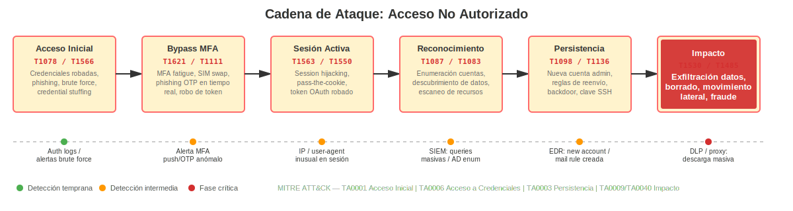
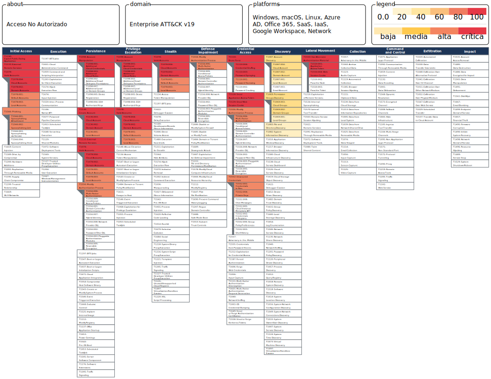
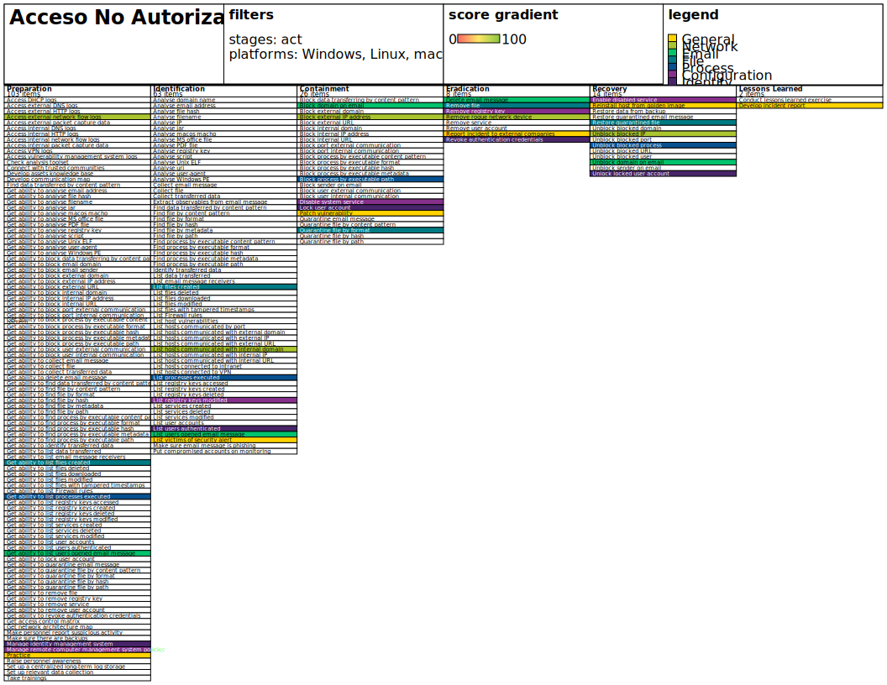

## Playbook: Acceso No Autorizado

**Investigar, remediar (contener, erradicar) y comunicar en paralelo.**

Asigne pasos a individuos o equipos para que trabajen simultáneamente, cuando sea posible; este libro de jugadas no es puramente secuencial. Utilice su mejor criterio.

---

### Cadena de Ataque

---

### Investigar

`OBJETIVO: Confirmar que se trata de un acceso no autorizado real (descartar falsos positivos), identificar el vector de entrada, el alcance del acceso y los datos o sistemas comprometidos.`

1. **Triage rápido (primeras 1–2 horas)**
    * Confirmar la alerta: verificar si el acceso detectado es realmente no autorizado (descartar accesos legítimos, cambios de turno, cuentas de servicio, accesos remotos autorizados).
    * Identificar el tipo de acceso:
        * Acceso físico no autorizado (instalaciones, CPD, hardware).
        * Acceso lógico remoto (RDP, VPN, SSH, acceso web/portal).
        * Acceso interno (empleado con permisos excesivos o cuenta comprometida).
        * Acceso a sistemas en la nube o SaaS (panel de administración, consola cloud, correo, almacenamiento).
        * Acceso a través de cuenta de tercero o proveedor.
    * Capturar evidencia mínima sin modificar sistemas:
        * Logs de autenticación (IPs, timestamps, agente de usuario, geolocalización).
        * Nombre de usuario/cuenta, sistemas accedidos, duración de la sesión.
        * Alertas de herramientas (SIEM, EDR, IAM, CASB, WAF).
        * Capturas de pantalla o exportaciones de logs relevantes.

1. **Determinar el vector de acceso**
    * Revisar los vectores de acceso inicial más comunes (MITRE ATT&CK TA0001:
        * Credenciales robadas o filtradas (phishing, credential stuffing, brute force, compra en dark web).
        * Sesión secuestrada (session hijacking, cookie theft, token robado).
        * Explotación de vulnerabilidad (servicio expuesto sin parchear: VPN, RDP, aplicación web).
        * Cuenta de proveedor/tercero comprometida.
        * Insider: empleado con acceso legítimo que actúa fuera de su ámbito.
        * Bypass de MFA (SIM swapping, MFA fatigue, phishing de OTP en tiempo real).
    * Cruzar la hora del acceso con:
        * Tickets de soporte o cambios recientes relacionados con la cuenta.
        * Alertas de phishing o malware previas.
        * Intentos fallidos de autenticación previos al acceso exitoso.

1. **Dimensionar el alcance**
    * Identificar todos los sistemas, datos y cuentas a los que se accedió o que podrían haberse visto expuestos:
        * Sistemas internos (servidores, endpoints, bases de datos, directorio activo).
        * Servicios en la nube (almacenamiento, correo, CRM/ERP, repositorios).
        * Datos sensibles: PII, datos financieros, propiedad intelectual, datos de clientes.
    * Determinar si el atacante realizó alguna de las siguientes acciones:
        * Descarga o exfiltración de datos (volumen, tipos de fichero, destinos).
        * Modificación o borrado de información.
        * Creación de nuevas cuentas o cambios de permisos.
        * Instalación de software, backdoors o mecanismos de persistencia.
        * Reconocimiento interno (escaneos, consultas al directorio, enumeración de recursos).
    * Revisar logs de:
        * EDR/AV: procesos lanzados, conexiones, cambios en el sistema.
        * SIEM: correlación de eventos de autenticación, acceso a datos y cambios de configuración.
        * Proxy/Firewall/DNS: conexiones salientes sospechosas, exfiltración.
        * SaaS audit logs: accesos, descargas, cambios de configuración, creación de reglas.

1. **Determinar el alcance en datos (qué información puede haberse expuesto)**
    * Identificar los repositorios accesibles desde la cuenta o sistema comprometido.
    * Estimar si hubo acceso, copia o exfiltración de:
        * Datos personales de clientes, empleados o proveedores (PII/datos especialmente protegidos).
        * Información financiera o bancaria.
        * Credenciales de otros sistemas (password stores, secretos de CI/CD, etc.).
        * Propiedad intelectual, contratos o documentación confidencial.
    * Determinar si aplican obligaciones legales de notificación (RGPD, normativa sectorial).

1. **Evaluar el impacto y priorizar**
    * Priorizar según: tipo de datos expuestos, número de sistemas/usuarios afectados, riesgo de movimiento lateral, impacto financiero/reputacional y obligaciones regulatorias.
    * Escalar a Dirección y Legal si hay indicios de exfiltración de datos personales o impacto significativo.

---

### Remediar

* **Planificar eventos de remediación** en los que estos pasos se lancen juntos (o de forma coordinada), con los equipos apropiados listos para responder a cualquier interrupción.
* **Considere el momento y las compensaciones** de las acciones de remediación: su respuesta tiene consecuencias.

#### Contención

`OBJETIVO: Detener el acceso no autorizado activo, reducir la superficie de exposición y evitar el movimiento lateral, sin destruir evidencia.`

`OBJETIVO: Especificar herramientas y procedimientos internos para cada paso (IAM, EDR, SIEM, proxy/firewall, MDM).`

* **Bloquear o deshabilitar la cuenta comprometida**
    * Deshabilitar o suspender de inmediato la cuenta de usuario o de servicio implicada.
    * Invalidar todas las sesiones activas, tokens OAuth, cookies y tokens de API asociados.
    * Si es una cuenta de proveedor: deshabilitar el acceso y notificar al proveedor.

* **Rotar credenciales de forma urgente**
    * Forzar el restablecimiento de contraseña en la cuenta comprometida y en cuentas relacionadas.
    * Revocar y rotar claves API, secretos de servicio y certificados asociados.
    * Si se sospecha reutilización de contraseñas: iniciar rotación en otros sistemas críticos.

* **Aislar sistemas afectados si se detectó movimiento lateral o persistencia**
    * Aislar de red los endpoints o servidores comprometidos.
    * Restringir acceso administrativo en sistemas críticos hasta confirmar el alcance.

* **Bloquear el vector de acceso**
    * Bloquear IPs, ASNs o rangos de origen identificados en firewall/WAF.
    * Si el vector es una vulnerabilidad: aplicar mitigación temporal (WAF rule, desactivar servicio vulnerable) hasta parchar.
    * Si el vector es una integración OAuth/API: revocar la app o el permiso.

* **Activar vigilancia reforzada**
    * Añadir reglas de detección en SIEM/EDR para la cuenta, IP o patrón identificado.
    * Activar alertas de umbral bajo para autenticación, acceso a datos sensibles y cambios de privilegios.

* **Retención forense**
    * Exportar y preservar todos los logs relevantes (autenticación, acceso a datos, actividad de red) antes de que expiren.
    * No modificar ni borrar sistemas comprometidos hasta completar la recogida de evidencias.

`OBJETIVO: Considerar la automatización de medidas de contención mediante herramientas de orquestación (SOAR) donde exista.`

#### Erradicar

`OBJETIVO: Eliminar cualquier mecanismo de persistencia, cerrar el vector de entrada y restaurar un estado de confianza verificado.`

`OBJETIVO: Especificar herramientas y procedimientos para cada paso (gestión de parches, IAM, EDR, golden images).`

* **Eliminar persistencia**
    * Buscar y eliminar backdoors, tareas programadas, scripts de inicio, cuentas ocultas o claves SSH no autorizadas.
    * Revisar reglas de reenvío de correo, reglas de buzón y delegaciones creadas durante el incidente.
    * Comprobar cambios en grupos de seguridad, roles IAM y permisos en la nube.

* **Parchear o mitigar el vector de acceso**
    * Aplicar el parche de seguridad correspondiente si el vector fue una vulnerabilidad.
    * Revisar y endurecer la configuración del servicio expuesto (desactivar funciones innecesarias, reducir superficie).

* **Reimagen o reinstalación si hay indicios de compromiso profundo**
    * Reinstalar o reimaginar endpoints/servidores donde se detectó actividad maliciosa.
    * Restaurar desde backup limpio y verificado si se modificaron datos o configuraciones.

* **Revisión y endurecimiento de identidades**
    * Auditar todas las cuentas con privilegios elevados: eliminar las que no sean necesarias.
    * Revisar y aplicar principio de mínimo privilegio en cuentas, roles e integraciones.
    * Asegurar que MFA está habilitado en todas las cuentas críticas, especialmente administradores y accesos remotos.

* **Validación post-erradicación**
    * Monitorizar reinfección, nuevos accesos anómalos y actividad de reconocimiento durante al menos 72 horas.
    * Confirmar que no quedan sesiones activas, tokens válidos ni backdoors en sistemas remediados.

#### Referencia: Recursos de remediación

`OBJETIVO: Especificar recursos financieros, de personal y logísticos para llevar a cabo la remediación (incluye soporte forense externo, ventanas de mantenimiento y comunicación con proveedores).`

---

### Comunicar

`OBJETIVO: Comunicar con precisión, evitando especulación; coordinar con Legal, Dirección y, si aplica, autoridades y afectados. Cumplir con las obligaciones regulatorias.`

`OBJETIVO: Especificar herramientas y procedimientos (incluyendo quién participa) o remitir al plan general.`

Además de los pasos y orientaciones generales del plan de respuesta a incidentes:

1. Notificar a Dirección y al responsable de seguridad con resumen inicial: qué cuenta/sistema fue accedido, cuándo, qué datos podrían haberse expuesto, y qué medidas de contención se han tomado.
1. Coordinar con Legal:
    * Evaluar obligaciones de notificación a autoridades (AEPD u organismo equivalente) en un plazo máximo de 72 horas si hay datos personales afectados (RGPD Art. 33).
    * Evaluar obligación de notificación a los interesados (RGPD Art. 34) si el riesgo para sus derechos es alto.
    * Revisar contratos con proveedores si el vector implicó a un tercero.
    * Notificar a la aseguradora si aplica la póliza de ciberriesgo.
1. Notificar internamente a los departamentos afectados (TIC, RRHH si hay cuentas de empleados, Finanzas si hay datos financieros, Comunicación).
1. Si hay clientes o usuarios afectados: preparar comunicado externo claro, conciso y verificable a través de canales oficiales, con instrucciones de actuación (cambio de contraseña, vigilancia de actividad, etc.).
1. Si el acceso fue realizado por un empleado o insider: coordinar con RRHH y Asesoría Jurídica antes de cualquier comunicación o acción disciplinaria.

---

### Recuperación

`OBJETIVO: Restaurar el servicio con confianza, mejorar controles de acceso e identidad, y reducir la probabilidad de recurrencia.`

`OBJETIVO: Especificar herramientas y procedimientos para cada paso (IAM, backups, gestión de parches, formación).`

Además de los pasos y orientaciones generales del plan de respuesta a incidentes:

1. Restablecer el acceso de la cuenta afectada (si procede) solo tras verificar la identidad del usuario, rotar credenciales y confirmar la ausencia de persistencia.
1. Reforzar controles de identidad y acceso:
    * MFA obligatorio en todos los accesos remotos, cuentas privilegiadas y aplicaciones críticas.
    * Revisión y reducción de permisos excesivos (access review periódico).
    * Desactivar cuentas inactivas y de exempleados.
    * Segmentación de red y acceso condicional (Zero Trust donde sea viable).
1. Mejorar la visibilidad y detección:
    * Revisar cobertura de logs y alertas de autenticación en todos los sistemas críticos.
    * Implementar o mejorar alertas de comportamiento anómalo (accesos fuera de horario, desde ubicaciones inusuales, volumen elevado de descargas).
1. Formación y concienciación:
    * Reforzar la formación en phishing y gestión segura de credenciales para todos los empleados.
    * Comunicar el incidente (de forma anónima si es necesario) como caso de aprendizaje interno.
1. Lecciones aprendidas:
    * Documentar la cronología completa, el vector de acceso, el impacto y las acciones realizadas.
    * Actualizar el registro de riesgos, los procedimientos de gestión de accesos y el plan de respuesta a incidentes.
    * Revisar controles técnicos: parcheo, gestión de vulnerabilidades, rotación periódica de credenciales.

---

### Referencia: Acciones del usuario ante la sospecha de acceso no autorizado a su cuenta

`OBJETIVO: Personalizar los pasos para usuarios que sospechen que su cuenta ha sido accedida sin autorización.`

1. Mantenga la calma. No cierre sesión ni modifique nada hasta recibir instrucciones.
1. Haga fotos o capturas de pantalla de cualquier actividad sospechosa que haya observado.
1. Tome nota de: qué detectó, cuándo, desde qué dispositivo y red, y con quién ha hablado sobre ello.
1. Contacte al servicio de soporte o al responsable de seguridad de inmediato y sea lo más descriptivo posible.
1. No comparta su contraseña ni otros datos de acceso con nadie, ni siquiera con el equipo de soporte (ellos no la necesitan).
1. Tenga paciencia: la respuesta puede implicar restricciones temporales, pero es para proteger a todos. **Gracias por avisar.**

---

### Referencia: Acciones del servicio de asistencia técnica ante la sospecha de acceso no autorizado

`OBJETIVO: Personalizar los pasos para el personal del helpdesk ante la sospecha de acceso no autorizado.`

1. Mantenga la calma y abra un ticket documentando el incidente.
1. Recopile la siguiente información del usuario o de los sistemas de monitorización:
    * ¿Qué actividad sospechosa se ha detectado y cuándo?
    * ¿Qué cuenta(s) y sistema(s) están implicados?
    * ¿Desde qué IP, dispositivo o ubicación geográfica se produjo el acceso?
    * ¿Ha habido intentos fallidos previos de autenticación?
    * ¿Ha recibido el usuario algún correo sospechoso recientemente?
1. No restablezca contraseñas ni deshabilite cuentas sin coordinación con el equipo de seguridad.
1. Preserve los logs: no borrar ni modificar registros de autenticación o acceso.
1. Escale al equipo de seguridad de inmediato con toda la información recopilada.
1. Siga las instrucciones del equipo de seguridad para las acciones de contención.

---

### Recursos

#### Información adicional

1. [MITRE ATT&CK: Initial Access (TA0001)](https://attack.mitre.org/tactics/TA0001/)
1. [MITRE ATT&CK: Credential Access (TA0006)](https://attack.mitre.org/tactics/TA0006/)
1. [NIST SP 800-61r2: Computer Security Incident Handling Guide](https://nvlpubs.nist.gov/nistpubs/SpecialPublications/NIST.SP.800-61r2.pdf)
1. [NIST SP 800-63B: Digital Identity Guidelines – Authentication](https://pages.nist.gov/800-63-3/sp800-63b.html)
1. [CISA: Implementing Phishing-Resistant MFA](https://www.cisa.gov/resources-tools/resources/implementing-phishing-resistant-mfa)
1. [ENISA: Guidelines for SMEs on the Security of Personal Data Processing](https://www.enisa.europa.eu/publications/guidelines-for-smes-on-the-security-of-personal-data-processing)
1. [AEPD: Guía para la notificación de brechas de datos personales](https://www.aepd.es/guias/guia-brechas-seguridad.pdf)
1. [INCIBE: Gestión de incidentes de seguridad](https://www.incibe.es/empresas/tematicas/gestion-incidentes)
1. [CCN-CERT: Guía de seguridad CCN-STIC – Gestión de identidades y accesos](https://www.ccn-cert.cni.es/)
1. [OWASP: Authentication Cheat Sheet](https://cheatsheetseries.owasp.org/cheatsheets/Authentication_Cheat_Sheet.html)