# Diagramas de flujo de playbooks

Este archivo se genera automáticamente desde scripts/generate-playbook-diagrams.ps1. Cada diagrama se construye leyendo las secciones reales del playbook: investigación, preguntas clave, falso positivo/escalado, contención, erradicación, comunicación, recuperación y recursos operativos.

Para regenerarlo:

```powershell
.\scripts\generate-playbook-diagrams.ps1
```

## Compromiso de servicios cloud

Playbook fuente: `playbooks/playbook-cloud-services.md`

Evidencias MITRE/RE&CT: `evidencias-mitre/attack-cloud-services-layer.json` y `evidencias-mitre/react-cloud-services-layer.json`.

```mermaid
flowchart TD
    A["Activación: Investigar, remediar, comunicar y recuperar en paralelo. Este playbook cubre accesos no autorizados, exposición de almacenamiento, abuso de cuentas, tokens/API keys, errores de configuración o indisponibilidad de servicios cloud usados por Nexo Lebrija."]
    B["Abrir expediente, conservar evidencias y nombrar el incidente"]
    A --> B
    M["Usar evidencias MITRE ATT&CK y RE&CT: evidencias-mitre/attack-cloud-services-layer.json y evidencias-mitre/react-cloud-services-layer.json."]
    B --> M
    I1["Investigar 1: Identificar servicio cloud afectado: almacenamiento, correo, CRM/ERP, repositorio documental, backup cloud o panel web."]
    M --> I1
    I2["Investigar 2: Recoger logs de:"]
    I1 --> I2
    I3["Investigar 3: Autenticación y MFA."]
    I2 --> I3
    I4["Investigar 4: Creación o modificación de usuarios, roles, grupos y permisos."]
    I3 --> I4
    I5["Investigar 5: Descargas, comparticiones, borrados y cambios de configuración."]
    I4 --> I5
    I6["Investigar 6: API keys, tokens, aplicaciones OAuth e integraciones."]
    I5 --> I6
    I7["Investigar 7: Accesos desde IPs, países o dispositivos no habituales."]
    I6 --> I7
    I8["Investigar 8: Revisar si hay datos personales o información fiscal/contable expuesta."]
    I7 --> I8
    I9["Investigar 9: Determinar si el incidente nace en:"]
    I8 --> I9
    I10["Investigar 10: Credenciales comprometidas."]
    I9 --> I10
    I11["Investigar 11: Error de configuración."]
    I10 --> I11
    I12["Investigar 12: Integración o token filtrado."]
    I11 --> I12
    I13["Investigar 13: Proveedor cloud afectado."]
    I12 --> I13
    I14["Investigar 14: Dispositivo de usuario comprometido."]
    I13 --> I14
    I15["Investigar 15: Clasificar severidad según datos, continuidad, privilegios y extensión."]
    I14 --> I15
    Q0["Responder preguntas clave de la investigación antes de cerrar alcance"]
    I15 --> Q0
    Q1["Pregunta clave 1: ¿Qué servicio cloud está afectado: correo, almacenamiento, CRM/ERP SaaS, backup, colaboración, panel web o integración?"]
    Q0 --> Q1
    Q2["Pregunta clave 2: ¿Qué cuenta, rol, grupo, token, API key, aplicación OAuth o dispositivo inició la actividad sospechosa?"]
    Q1 --> Q2
    Q3["Pregunta clave 3: ¿Qué cambios se realizaron en permisos, comparticiones, configuraciones, usuarios, roles o integraciones?"]
    Q2 --> Q3
    Q4["Pregunta clave 4: ¿Hay enlaces públicos, buckets/carpetas expuestas, descargas masivas o borrados anómalos?"]
    Q3 --> Q4
    Q5["Pregunta clave 5: ¿Desde qué IPs, países, dispositivos o clientes se accedió al servicio?"]
    Q4 --> Q5
    Q6["Pregunta clave 6: ¿El origen probable es credencial robada, error de configuración, token filtrado, proveedor cloud o endpoint comprometido?"]
    Q5 --> Q6
    Q7["Pregunta clave 7: ¿Qué datos personales, fiscales, contables o de clientes/proveedores pudieron exponerse?"]
    Q6 --> Q7
    Q8["Pregunta clave 8: ¿Qué procesos de negocio dependen del servicio afectado y qué impacto tendría revocar accesos o pausar integraciones?"]
    Q7 --> Q8
    Q9["Pregunta clave 9: ¿Qué visibilidad ofrece el proveedor cloud y cuándo caducan los logs necesarios?"]
    Q8 --> Q9
    Q10["Pregunta clave 10: ¿Qué IOCs, cuentas o patrones deben bloquearse, monitorizarse o compartirse en MISP si procede?"]
    Q9 --> Q10
    Q11["Pregunta clave 11: ¿Es necesario activar también los playbooks de identidad, fuga de datos, phishing o cadena de suministro?"]
    Q10 --> Q11
    FP0["Evaluar falso positivo: La alerta puede cerrarse como falso positivo si el acceso, cambio o descarga corresponde a una operacion legitima, documentada y autorizada, y no hay exposicion publica, permisos indebidos, tokens sospechosos, actividad anomala ni datos afectados."]
    Q11 --> FP0
    FP1["Comprobación falso positivo 1: Confirmar con el propietario del servicio si el cambio o acceso era esperado."]
    FP0 --> FP1
    FP2["Comprobación falso positivo 2: Revisar usuario, rol, IP, ubicacion, dispositivo, MFA y hora del evento."]
    FP1 --> FP2
    FP3["Comprobación falso positivo 3: Comprobar auditoria de permisos, enlaces compartidos, descargas, borrados y cambios de configuracion."]
    FP2 --> FP3
    FP4["Comprobación falso positivo 4: Revisar API keys, tokens, aplicaciones OAuth, integraciones y dispositivos recordados."]
    FP3 --> FP4
    FP5["Comprobación falso positivo 5: Verificar si hay almacenamiento publico o comparticiones externas no justificadas."]
    FP4 --> FP5
    FP6["Comprobación falso positivo 6: Revisar si hay actividad similar en otros servicios cloud o cuentas."]
    FP5 --> FP6
    FPD{"Se confirma falso positivo?"}
    FP6 --> FPD
    CLOSE["Cerrar como evento, documentar decisión y mantener monitorización si procede"]
    FPD -- "Si" --> CLOSE
    ESC0["Evaluar escalado: Debe escalarse si hay cuenta privilegiada, token/API key filtrado, almacenamiento publico con datos, descarga masiva, cambio de permisos no autorizado, integracion sospechosa, proveedor cloud implicado, borrado o cifrado de datos, datos personales expuestos o interrupcion de servicio."]
    FPD -- "No o duda" --> ESC0
    ESCD{"Requiere escalado?"}
    ESC0 --> ESCD
    ESCA["Activar roles del plan: IC, Adjunto si procede, Escriba, SMEs necesarios y Enlace para terceros/comunicación"]
    ESCD -- "Si" --> ESCA
    R0["Remediar en paralelo: proteger, detectar, contener, erradicar y preparar recuperación"]
    ESCD -- "No" --> R0
    ESCA --> R0
    RP1["Preparar remediación 1: Planificar eventos de remediación con TIC/CISO, propietarios del servicio, Legal y proveedor cloud."]
    R0 --> RP1
    RP2["Preparar remediación 2: Considerar el momento: revocar tokens o cortar integraciones puede parar procesos de negocio; documentar riesgo y aprobación."]
    RP1 --> RP2
    C1["Contención 1: Bloquear cuentas sospechosas y revocar sesiones activas."]
    RP2 --> C1
    C2["Contención 2: Revocar tokens, API keys, aplicaciones OAuth y dispositivos recordados."]
    C1 --> C2
    C3["Contención 3: Deshabilitar enlaces públicos y comparticiones externas no justificadas."]
    C2 --> C3
    C4["Contención 4: Restringir temporalmente acceso por ubicación, IP, dispositivo o grupo."]
    C3 --> C4
    C5["Contención 5: Pausar sincronizaciones o integraciones afectadas."]
    C4 --> C5
    C6["Contención 6: Activar alertas reforzadas sobre descargas masivas, cambios de permisos y nuevas apps."]
    C5 --> C6
    C7["Contención 7: Solicitar soporte del proveedor cloud si hay limitaciones de visibilidad o sospecha de incidente en su plataforma."]
    C6 --> C7
    E1["Erradicar 1: Eliminar roles, usuarios, reglas, apps o integraciones no autorizadas."]
    C7 --> E1
    E2["Erradicar 2: Corregir configuraciones inseguras: almacenamiento público, permisos heredados, ausencia de MFA o claves sin rotación."]
    E1 --> E2
    E3["Erradicar 3: Rotar secretos, certificados, API keys y contraseñas asociadas."]
    E2 --> E3
    E4["Erradicar 4: Revisar dispositivos de usuarios implicados y activar playbook de identidad o phishing si procede."]
    E3 --> E4
    E5["Erradicar 5: Aplicar políticas de mínimo privilegio y revisión trimestral de permisos."]
    E4 --> E5
    E6["Erradicar 6: Exportar evidencias antes de que caduquen logs del proveedor."]
    E5 --> E6
    RR1["Recurso de remediación 1: Consola de administración cloud."]
    E6 --> RR1
    RR2["Recurso de remediación 2: Logs de auditoría, CASB si existe, SIEM, correo y directorio."]
    RR1 --> RR2
    RR3["Recurso de remediación 3: TIC/CISO, propietario del servicio, Legal y proveedor cloud."]
    RR2 --> RR3
    RR4["Recurso de remediación 4: Copias locales/offsite para continuidad."]
    RR3 --> RR4
    COM1["Comunicar 1: Informar al Incident Commander de servicio afectado, severidad, datos y acciones de contención."]
    RR4 --> COM1
    COM2["Comunicar 2: Coordinar con proveedor cloud por canal oficial y registrar número de caso."]
    COM1 --> COM2
    COM3["Comunicar 3: Escalar a Legal si hay datos personales o acceso de terceros."]
    COM2 --> COM3
    COM4["Comunicar 4: Avisar a usuarios de cambios temporales: bloqueo de comparticiones, MFA obligatorio, revisión de permisos o indisponibilidad."]
    COM3 --> COM4
    COM5["Comunicar 5: Preparar comunicación a clientes/proveedores si se interrumpe un servicio o se exponen datos."]
    COM4 --> COM5
    COM6["Comunicar 6: Evaluar notificación a AEPD si procede."]
    COM5 --> COM6
    REC1["Recuperación 1: Restaurar datos borrados o modificados desde versionado o backup limpio."]
    COM6 --> REC1
    REC2["Recuperación 2: Rehabilitar cuentas e integraciones solo tras rotar credenciales y validar permisos."]
    REC1 --> REC2
    REC3["Recuperación 3: Validar con propietarios que el servicio funciona y los datos son íntegros."]
    REC2 --> REC3
    REC4["Recuperación 4: Mantener monitorización reforzada durante al menos 72 horas."]
    REC3 --> REC4
    REC5["Recuperación 5: Documentar controles nuevos: MFA, alertas, revisión de permisos, backup cloud/local y cláusulas con proveedor."]
    REC4 --> REC5
    REC6["Recuperación 6: Actualizar inventario de servicios cloud y responsables."]
    REC5 --> REC6
    END["Cerrar playbook: informe, AAR, actualizacion de detecciones, MISP si procede y mejoras del plan"]
    REC6 --> END
```



## Fuga de datos personales / brecha RGPD

Playbook fuente: `playbooks/playbook-data-breach.md`

Evidencias MITRE/RE&CT: `evidencias-mitre/attack-data-breach-layer.json` y `evidencias-mitre/react-data-breach-layer.json`.

```mermaid
flowchart TD
    A["Activación: Investigar, remediar, comunicar y recuperar en paralelo. Este playbook se activa cuando existe acceso, exfiltración, pérdida, modificación o divulgación no autorizada de datos personales de clientes, proveedores o empleados."]
    B["Abrir expediente, conservar evidencias y nombrar el incidente"]
    A --> B
    M["Usar evidencias MITRE ATT&CK y RE&CT: evidencias-mitre/attack-data-breach-layer.json y evidencias-mitre/react-data-breach-layer.json."]
    B --> M
    I1["Investigar 1: Confirmar tipo de incidente:"]
    M --> I1
    I2["Investigar 2: Acceso no autorizado."]
    I1 --> I2
    I3["Investigar 3: Exfiltración."]
    I2 --> I3
    I4["Investigar 4: Envío erróneo."]
    I3 --> I4
    I5["Investigar 5: Pérdida de dispositivo o soporte."]
    I4 --> I5
    I6["Investigar 6: Publicación accidental."]
    I5 --> I6
    I7["Investigar 7: Modificación o borrado de datos."]
    I6 --> I7
    I8["Investigar 8: Identificar datos afectados:"]
    I7 --> I8
    I9["Investigar 9: Nombre, DNI, datos fiscales, datos de contacto, documentación contable, contratos, nóminas o datos de proveedores."]
    I8 --> I9
    I10["Investigar 10: Ubicación: CRM/ERP, servidor de archivos, correo, cloud, backups, web/tienda o proveedor."]
    I9 --> I10
    I11["Investigar 11: Delimitar alcance:"]
    I10 --> I11
    I12["Investigar 12: Número aproximado de personas afectadas."]
    I11 --> I12
    I13["Investigar 13: Categorías de datos."]
    I12 --> I13
    I14["Investigar 14: Fecha/hora de acceso o exposición."]
    I13 --> I14
    I15["Investigar 15: Usuarios, cuentas, dispositivos o proveedores implicados."]
    I14 --> I15
    I16["Investigar 16: Recoger evidencias:"]
    I15 --> I16
    I17["Investigar 17: Logs de acceso, descarga, modificación y borrado."]
    I16 --> I17
    I18["Investigar 18: Registros de correo, proxy, VPN, cloud, CRM/ERP y servidores."]
    I17 --> I18
    I19["Investigar 19: Copias de mensajes, enlaces, archivos publicados o transferencias."]
    I18 --> I19
    I20["Investigar 20: Determinar si hay exfiltración confirmada o solo exposición potencial."]
    I19 --> I20
    I21["Investigar 21: Notificar inmediatamente a Legal/Cumplimiento para evaluar obligaciones RGPD/LOPDGDD."]
    I20 --> I21
    Q0["Responder preguntas clave de la investigación antes de cerrar alcance"]
    I21 --> Q0
    Q1["Pregunta clave 1: ¿Qué tipo de brecha se ha producido: acceso no autorizado, exfiltración, envío erróneo, pérdida, publicación accidental, modificación o borrado?"]
    Q0 --> Q1
    Q2["Pregunta clave 2: ¿Qué datos personales están afectados: identificación, contacto, fiscales, contables, laborales, contratos, nóminas o datos de proveedores?"]
    Q1 --> Q2
    Q3["Pregunta clave 3: ¿Dónde estaban los datos: CRM/ERP, correo, servidor de archivos, cloud, web/tienda, backup o proveedor?"]
    Q2 --> Q3
    Q4["Pregunta clave 4: ¿Cuántas personas están afectadas o potencialmente afectadas?"]
    Q3 --> Q4
    Q5["Pregunta clave 5: ¿Desde cuándo estuvieron accesibles, expuestos o manipulados los datos?"]
    Q4 --> Q5
    Q6["Pregunta clave 6: ¿Quién accedió, descargó, envió, modificó o borró la información?"]
    Q5 --> Q6
    Q7["Pregunta clave 7: ¿La exfiltración está confirmada o solo existe exposición potencial?"]
    Q6 --> Q7
    Q8["Pregunta clave 8: ¿Qué logs, mensajes, enlaces, transferencias o capturas prueban el alcance?"]
    Q7 --> Q8
    Q9["Pregunta clave 9: ¿Hay riesgo alto para derechos y libertades de las personas afectadas?"]
    Q8 --> Q9
    Q10["Pregunta clave 10: ¿Debe notificarse a la AEPD dentro del plazo aplicable o comunicarse a personas afectadas?"]
    Q9 --> Q10
    Q11["Pregunta clave 11: ¿Qué IOCs o patrones pueden compartirse en MISP sin incluir datos personales ni información sensible?"]
    Q10 --> Q11
    Q12["Pregunta clave 12: ¿Es necesario activar también los playbooks de phishing, identidad, cloud, web o cadena de suministro?"]
    Q11 --> Q12
    FP0["Evaluar falso positivo: La alerta puede cerrarse como falso positivo solo si se confirma que no hubo acceso no autorizado, envio indebido, publicacion, descarga anomala, perdida, modificacion ni exposicion de datos personales. Debe existir una explicacion legitima y documentada."]
    Q12 --> FP0
    FP1["Comprobación falso positivo 1: Identificar el conjunto de datos, ubicacion, propietario y permisos aplicados."]
    FP0 --> FP1
    FP2["Comprobación falso positivo 2: Revisar logs de acceso, descarga, comparticion, envio, borrado y modificacion."]
    FP1 --> FP2
    FP3["Comprobación falso positivo 3: Confirmar destinatarios, enlaces publicos, permisos externos y caducidad de comparticiones."]
    FP2 --> FP3
    FP4["Comprobación falso positivo 4: Validar con el propietario si la transferencia o acceso estaba autorizado."]
    FP3 --> FP4
    FP5["Comprobación falso positivo 5: Comprobar si hay datos personales, fiscales, contables, laborales o contractuales."]
    FP4 --> FP5
    FP6["Comprobación falso positivo 6: Revisar si el origen esta relacionado con phishing, identidad, cloud o proveedor."]
    FP5 --> FP6
    FPD{"Se confirma falso positivo?"}
    FP6 --> FPD
    CLOSE["Cerrar como evento, documentar decisión y mantener monitorización si procede"]
    FPD -- "Si" --> CLOSE
    ESC0["Evaluar escalado: Debe escalarse siempre a Legal/Cumplimiento si hay duda razonable sobre datos personales. Tambien debe escalarse si hay destinatario externo no autorizado, enlace publico, descarga masiva, cuenta comprometida, proveedor implicado, datos sensibles, muchas personas afectadas, exfiltracion probable o imposibilidad de reconstruir el alcance."]
    FPD -- "No o duda" --> ESC0
    ESCD{"Requiere escalado?"}
    ESC0 --> ESCD
    ESCA["Activar roles del plan: IC, Adjunto si procede, Escriba, SMEs necesarios y Enlace para terceros/comunicación"]
    ESCD -- "Si" --> ESCA
    R0["Remediar en paralelo: proteger, detectar, contener, erradicar y preparar recuperación"]
    ESCD -- "No" --> R0
    ESCA --> R0
    RP1["Preparar remediación 1: Planificar eventos de remediación con TIC/CISO, Legal, Comunicación y propietarios de datos."]
    R0 --> RP1
    RP2["Preparar remediación 2: Considerar el momento: preservar evidencias y cortar exposición sin destruir pruebas."]
    RP1 --> RP2
    C1["Contención 1: Retirar o restringir acceso al repositorio, enlace, carpeta, tabla o buzón afectado."]
    RP2 --> C1
    C2["Contención 2: Bloquear destinos externos, IPs, dominios o cuentas usadas para exfiltración."]
    C1 --> C2
    C3["Contención 3: Revocar enlaces compartidos públicamente y permisos excesivos."]
    C2 --> C3
    C4["Contención 4: Bloquear cuentas comprometidas y rotar credenciales relacionadas."]
    C3 --> C4
    C5["Contención 5: Pausar sincronizaciones cloud o integraciones si están filtrando datos."]
    C4 --> C5
    C6["Contención 6: Activar retención legal de evidencias y evitar borrados automáticos."]
    C5 --> C6
    E1["Erradicar 1: Corregir permisos y aplicar mínimo privilegio."]
    C6 --> E1
    E2["Erradicar 2: Eliminar copias no autorizadas internas si no son evidencia."]
    E1 --> E2
    E3["Erradicar 3: Solicitar retirada de datos a terceros si fueron enviados o publicados por error."]
    E2 --> E3
    E4["Erradicar 4: Corregir reglas de correo, automatizaciones, formularios o configuraciones cloud que expusieron datos."]
    E3 --> E4
    E5["Erradicar 5: Revisar si la brecha deriva de phishing, identidad, cloud o proveedor y activar playbook correspondiente."]
    E4 --> E5
    E6["Erradicar 6: Documentar causa raíz y controles fallidos."]
    E5 --> E6
    RR1["Recurso de remediación 1: Legal/Cumplimiento para evaluación RGPD/LOPDGDD."]
    E6 --> RR1
    RR2["Recurso de remediación 2: TIC/CISO para permisos, logs, bloqueo y recuperación."]
    RR1 --> RR2
    RR3["Recurso de remediación 3: Propietarios de datos para validar impacto."]
    RR2 --> RR3
    RR4["Recurso de remediación 4: Comunicación para mensajes internos/externos."]
    RR3 --> RR4
    RR5["Recurso de remediación 5: Proveedores si trataron o alojaron datos afectados."]
    RR4 --> RR5
    COM1["Comunicar 1: Escalar a Dirección, Legal y Comunicación desde el inicio."]
    RR5 --> COM1
    COM2["Comunicar 2: Preparar informe preliminar con qué ocurrió, datos afectados, personas afectadas, medidas tomadas y riesgo para derechos y libertades."]
    COM1 --> COM2
    COM3["Comunicar 3: Evaluar notificación a la Agencia Española de Protección de Datos dentro del plazo aplicable si procede."]
    COM2 --> COM3
    COM4["Comunicar 4: Evaluar comunicación a personas afectadas si el riesgo lo requiere."]
    COM3 --> COM4
    COM5["Comunicar 5: Coordinar mensajes a clientes/proveedores con lenguaje claro, factual y sin especulación."]
    COM4 --> COM5
    COM6["Comunicar 6: Registrar todas las decisiónes de notificación, incluida la justificación si no se notifica."]
    COM5 --> COM6
    REC1["Recuperación 1: Restaurar datos modificados o borrados desde copias limpias si procede."]
    COM6 --> REC1
    REC2["Recuperación 2: Validar integridad con propietarios de negocio."]
    REC1 --> REC2
    REC3["Recuperación 3: Reabrir accesos con permisos revisados y MFA cuando aplique."]
    REC2 --> REC3
    REC4["Recuperación 4: Monitorizar accesos a los datos afectados durante al menos 72 horas."]
    REC3 --> REC4
    REC5["Recuperación 5: Revisar controles: clasificación de información, DLP, cifrado, permisos, formación y procedimientos de brechas."]
    REC4 --> REC5
    REC6["Recuperación 6: Incorporar acciones correctivas al AAR."]
    REC5 --> REC6
    END["Cerrar playbook: informe, AAR, actualizacion de detecciones, MISP si procede y mejoras del plan"]
    REC6 --> END
```



## Desfiguración o compromiso web

Playbook fuente: `playbooks/playbook-defacement.md`

Evidencias MITRE/RE&CT: `evidencias-mitre/attack-web-provider-layer.json` y `evidencias-mitre/react-web-provider-layer.json`.

```mermaid
flowchart TD
    A["Activación: Investigar, remediar, comunicar y recuperar en paralelo. Este playbook se activa cuando la web corporativa o tienda online muestra contenido no autorizado, se sospecha de web shell, explotación de aplicación pública, caída de servicio o compromiso del proveedor web."]
    B["Abrir expediente, conservar evidencias y nombrar el incidente"]
    A --> B
    M["Usar evidencias MITRE ATT&CK y RE&CT: evidencias-mitre/attack-web-provider-layer.json y evidencias-mitre/react-web-provider-layer.json."]
    B --> M
    U0["Acciones del usuario"]
    A -.-> U0
    U1["Acciones del usuario 1: No interactuar con formularios ni enlaces sospechosos."]
    U0 --> U1
    U2["Acciones del usuario 2: Tomar captura de pantalla y anotar URL, hora y mensaje observado."]
    U1 --> U2
    U3["Acciones del usuario 3: Avisar al help desk o equipo de seguridad."]
    U2 --> U3
    U4["Acciones del usuario 4: No publicar capturas en redes ni reenviar fuera del equipo de respuesta."]
    U3 --> U4
    U4 -.-> B
    HD0["Acciones del help desk"]
    A -.-> HD0
    HD1["Acciones del help desk 1: Abrir ticket y escalar a seguridad si la web muestra contenido anómalo o está caída."]
    HD0 --> HD1
    HD2["Acciones del help desk 2: Recoger URL, captura, hora, usuario reportador y navegador."]
    HD1 --> HD2
    HD3["Acciones del help desk 3: No intentar corregir contenido directamente sin coordinación."]
    HD2 --> HD3
    HD4["Acciones del help desk 4: Avisar a Comunicación si el contenido es público o reputacionalmente sensible."]
    HD3 --> HD4
    HD4 -.-> B
    I1["Investigar 1: Capturar evidencia pública antes de retirar contenido:"]
    M --> I1
    I2["Investigar 2: Captura de pantalla."]
    I1 --> I2
    I3["Investigar 3: URL, hora, IP, dominio, contenido mostrado y navegador."]
    I2 --> I3
    I4["Investigar 4: Código fuente visible si procede."]
    I3 --> I4
    I5["Investigar 5: Determinar si el incidente es solo defacement o incluye acceso a datos, tienda, formularios o panel de administración."]
    I4 --> I5
    I6["Investigar 6: Revisar con el proveedor web:"]
    I5 --> I6
    I7["Investigar 7: Logs de acceso y error."]
    I6 --> I7
    I8["Investigar 8: WAF/CDN."]
    I7 --> I8
    I9["Investigar 9: Panel de hosting."]
    I8 --> I9
    I10["Investigar 10: Cambios de ficheros, plugins, temas, CMS y base de datos."]
    I9 --> I10
    I11["Investigar 11: Usuarios administrativos y sesiones recientes."]
    I10 --> I11
    I12["Investigar 12: Buscar causas probables:"]
    I11 --> I12
    I13["Investigar 13: CMS o plugin vulnerable."]
    I12 --> I13
    I14["Investigar 14: Credenciales de administrador comprometidas."]
    I13 --> I14
    I15["Investigar 15: Web shell o fichero malicioso."]
    I14 --> I15
    I16["Investigar 16: Inyección SQL, XSS, RFI/LFI o subida insegura de archivos."]
    I15 --> I16
    I17["Investigar 17: Compromiso del proveedor."]
    I16 --> I17
    I18["Investigar 18: Comprobar si hubo exfiltración de formularios, datos de clientes o pedidos."]
    I17 --> I18
    I19["Investigar 19: Clasificar severidad como S1/S2 si hay tienda parada, datos personales, alteración de pagos o compromiso del proveedor."]
    I18 --> I19
    Q0["Responder preguntas clave de la investigación antes de cerrar alcance"]
    I19 --> Q0
    Q1["Pregunta clave 1: ¿Qué URL, dominio, subdominio o formulario muestra comportamiento anómalo?"]
    Q0 --> Q1
    Q2["Pregunta clave 2: ¿El incidente es solo desfiguración visible o hay web shell, malware, redirecciones, robo de formularios o caída de servicio?"]
    Q1 --> Q2
    Q3["Pregunta clave 3: ¿Cuándo se produjo el primer cambio no autorizado y qué usuario, IP o proceso lo realizó?"]
    Q2 --> Q3
    Q4["Pregunta clave 4: ¿Qué CMS, plugin, tema, librería, panel de hosting o componente público pudo ser explotado?"]
    Q3 --> Q4
    Q5["Pregunta clave 5: ¿Existen ficheros nuevos, modificados o sospechosos en rutas web, uploads, plugins, temas o temporales?"]
    Q4 --> Q5
    Q6["Pregunta clave 6: ¿Se han creado usuarios administradores, claves API, cuentas FTP/SFTP o accesos de proveedor no autorizados?"]
    Q5 --> Q6
    Q7["Pregunta clave 7: ¿Hay evidencias de exfiltración de formularios, datos de clientes, pedidos, pagos o credenciales?"]
    Q6 --> Q7
    Q8["Pregunta clave 8: ¿El proveedor web/hosting dispone de logs, snapshots y línea de tiempo suficientes?"]
    Q7 --> Q8
    Q9["Pregunta clave 9: ¿Qué impacto tiene en reputación, continuidad, clientes y obligaciones RGPD?"]
    Q8 --> Q9
    Q10["Pregunta clave 10: ¿Qué dominios, IPs, rutas, hashes o patrones deben bloquearse o compartirse en MISP si procede?"]
    Q9 --> Q10
    Q11["Pregunta clave 11: ¿Es necesario activar también los playbooks de fuga de datos, identidad, cloud o cadena de suministro?"]
    Q10 --> Q11
    FP0["Evaluar falso positivo: La alerta puede cerrarse como falso positivo si el cambio en la web corresponde a una publicacion autorizada, mantenimiento, caida conocida del proveedor, error de monitorización, cache de CDN o despliegue planificado, y no hay cambios no autorizados en codigo, usuarios, ficheros o base de datos."]
    Q11 --> FP0
    FP1["Comprobación falso positivo 1: Confirmar con el propietario de la web y el proveedor si habia mantenimiento o despliegue."]
    FP0 --> FP1
    FP2["Comprobación falso positivo 2: Revisar logs web, WAF/CDN, panel de hosting y cambios recientes."]
    FP1 --> FP2
    FP3["Comprobación falso positivo 3: Comparar ficheros, plugins, temas y base de datos con una version limpia."]
    FP2 --> FP3
    FP4["Comprobación falso positivo 4: Verificar si existen usuarios administrativos nuevos, sesiones raras o cambios de permisos."]
    FP3 --> FP4
    FP5["Comprobación falso positivo 5: Comprobar formularios, pagos, redirecciones y contenido publico."]
    FP4 --> FP5
    FP6["Comprobación falso positivo 6: Revisar si hay web shell, subida de archivos o intentos de explotacion."]
    FP5 --> FP6
    FPD{"Se confirma falso positivo?"}
    FP6 --> FPD
    CLOSE["Cerrar como evento, documentar decisión y mantener monitorización si procede"]
    FPD -- "Si" --> CLOSE
    ESC0["Evaluar escalado: Debe escalarse si hay contenido no autorizado visible, redireccion maliciosa, web shell, alteracion de pagos, formularios capturando datos, cuenta administradora comprometida, datos personales afectados, proveedor implicado, caida de tienda/web o repeticion tras restaurar."]
    FPD -- "No o duda" --> ESC0
    ESCD{"Requiere escalado?"}
    ESC0 --> ESCD
    ESCA["Activar roles del plan: IC, Adjunto si procede, Escriba, SMEs necesarios y Enlace para terceros/comunicación"]
    ESCD -- "Si" --> ESCA
    R0["Remediar en paralelo: proteger, detectar, contener, erradicar y preparar recuperación"]
    ESCD -- "No" --> R0
    ESCA --> R0
    RP1["Preparar remediación 1: Planificar eventos de remediación con TIC/CISO, proveedor web, Legal y Comunicación."]
    R0 --> RP1
    RP2["Preparar remediación 2: Considerar el momento: si el contenido es dañino o puede captar datos, retirar o aislar inmediatamente."]
    RP1 --> RP2
    C1["Contención 1: Activar página de mantenimiento o redirigir tráfico a un sitio seguro temporal."]
    RP2 --> C1
    C2["Contención 2: Bloquear IPs, dominios, usuarios o rutas maliciosas identificadas."]
    C1 --> C2
    C3["Contención 3: Deshabilitar temporalmente formularios, pagos o administración si hay riesgo para clientes."]
    C2 --> C3
    C4["Contención 4: Revocar sesiones y credenciales de administradores web, FTP/SFTP, panel de hosting y API."]
    C3 --> C4
    C5["Contención 5: Congelar despliegues y cambios hasta preservar evidencias."]
    C4 --> C5
    C6["Contención 6: Solicitar al proveedor copia de logs y snapshot del estado comprometido."]
    C5 --> C6
    E1["Erradicar 1: Eliminar web shells, ficheros maliciosos, usuarios desconocidos y plugins no autorizados."]
    C6 --> E1
    E2["Erradicar 2: Actualizar CMS, plugins, temas, librerías y servidor web."]
    E1 --> E2
    E3["Erradicar 3: Corregir vulnerabilidades de subida de archivos, permisos, inyección o configuración."]
    E2 --> E3
    E4["Erradicar 4: Rotar credenciales de administración, base de datos, hosting, DNS, CDN y certificados si procede."]
    E3 --> E4
    E5["Erradicar 5: Revisar integridad de ficheros y base de datos contra versión limpia."]
    E4 --> E5
    E6["Erradicar 6: Añadir reglas WAF o controles de endurecimiento según el vector."]
    E5 --> E6
    RR1["Recurso de remediación 1: Proveedor web/hosting y propietario de la web/tienda."]
    E6 --> RR1
    RR2["Recurso de remediación 2: TIC/CISO para logs, DNS, WAF, credenciales y coordinación técnica."]
    RR1 --> RR2
    RR3["Recurso de remediación 3: Legal y Comunicación si hay clientes, datos personales o impacto público."]
    RR2 --> RR3
    RR4["Recurso de remediación 4: Backups limpios de web, base de datos y configuración."]
    RR3 --> RR4
    COM1["Comunicar 1: Informar a Dirección, Legal y Comunicación si el contenido fue público, dañino o afectó a clientes."]
    RR4 --> COM1
    COM2["Comunicar 2: Coordinar con proveedor web un informe técnico con línea de tiempo, causa, alcance y acciones aplicadas."]
    COM1 --> COM2
    COM3["Comunicar 3: Preparar comunicación externa si hubo indisponibilidad, alteración de contenido o posible captura de datos."]
    COM2 --> COM3
    COM4["Comunicar 4: Evaluar notificación a AEPD si hay datos personales afectados."]
    COM3 --> COM4
    COM5["Comunicar 5: Informar internamente de canales alternativos para atención a clientes si la web/tienda queda fuera de servicio."]
    COM4 --> COM5
    COM6["Comunicar 6: Evitar especulación pública hasta confirmar hechos."]
    COM5 --> COM6
    REC1["Recuperación 1: Restaurar contenido desde backup limpio o repositorio verificado."]
    COM6 --> REC1
    REC2["Recuperación 2: Validar funcionamiento de páginas, formularios, tienda, pagos, certificados y DNS."]
    REC1 --> REC2
    REC3["Recuperación 3: Verificar que no existen ficheros modificados, usuarios no autorizados ni puertas traseras."]
    REC2 --> REC3
    REC4["Recuperación 4: Mantener monitorización de integridad, WAF y logs durante al menos 72 horas."]
    REC3 --> REC4
    REC5["Recuperación 5: Reabrir el sitio solo con aprobación del Incident Commander y propietario del servicio."]
    REC4 --> REC5
    REC6["Recuperación 6: Documentar mejoras: escaneo periódico, SLA de proveedor, MFA en paneles, backups y pruebas trimestrales."]
    REC5 --> REC6
    END["Cerrar playbook: informe, AAR, actualizacion de detecciones, MISP si procede y mejoras del plan"]
    REC6 --> END
```



## Compromiso de identidad y acceso

Playbook fuente: `playbooks/playbook-identity-and-access.md`

Evidencias MITRE/RE&CT: `evidencias-mitre/attack-identity-layer.json` y `evidencias-mitre/react-identity-layer.json`.

```mermaid
flowchart TD
    A["Activación: Investigar, remediar, comunicar y recuperar en paralelo. Este playbook se activa cuando hay sospecha de uso indebido de credenciales, acceso no autorizado a correo, VPN, CRM/ERP, cloud o cuentas privilegiadas."]
    B["Abrir expediente, conservar evidencias y nombrar el incidente"]
    A --> B
    M["Usar evidencias MITRE ATT&CK y RE&CT: evidencias-mitre/attack-identity-layer.json y evidencias-mitre/react-identity-layer.json."]
    B --> M
    I1["Investigar 1: Confirmar la cuenta o identidad afectada: usuario, cuenta de servicio, administrador, buzón compartido, cuenta cloud o credencial API."]
    M --> I1
    I2["Investigar 2: Recoger logs de autenticación de correo, VPN, directorio, CRM/ERP, cloud, EDR y SIEM."]
    I1 --> I2
    I3["Investigar 3: Determinar desde cuándo existe actividad sospechosa y desde qué IP, país, dispositivo, navegador o cliente."]
    I2 --> I3
    I4["Investigar 4: Revisar señales de compromiso:"]
    I3 --> I4
    I5["Investigar 5: Inicios de sesión fuera de horario o ubicación habitual."]
    I4 --> I5
    I6["Investigar 6: Cambios de contraseña, MFA, teléfono de recuperación o reglas de buzón."]
    I5 --> I6
    I7["Investigar 7: Reenvíos externos, delegaciones, creación de cuentas o elevación de privilegios."]
    I6 --> I7
    I8["Investigar 8: Acceso anómalo a CRM/ERP, servidores de archivos, datos personales o cloud."]
    I7 --> I8
    I9["Investigar 9: Identificar si la cuenta se usó para phishing interno, exfiltración, movimiento lateral o cambios administrativos."]
    I8 --> I9
    I10["Investigar 10: Clasificar severidad:"]
    I9 --> I10
    I11["Investigar 11: S1 si afecta a cuentas privilegiadas, CRM/ERP, datos personales masivos o continuidad."]
    I10 --> I11
    I12["Investigar 12: S2 si hay acceso no autorizado probable a sistemas críticos."]
    I11 --> I12
    I13["Investigar 13: S3 si se limita a una cuenta de usuario sin evidencia de datos afectados."]
    I12 --> I13
    I14["Investigar 14: S4 si es intento bloqueado sin acceso confirmado."]
    I13 --> I14
    Q0["Responder preguntas clave de la investigación antes de cerrar alcance"]
    I14 --> Q0
    Q1["Pregunta clave 1: ¿Qué identidad está afectada: usuario, administrador, cuenta de servicio, buzón compartido, API key o cuenta cloud?"]
    Q0 --> Q1
    Q2["Pregunta clave 2: ¿Cuál fue el primer inicio de sesión sospechoso y desde qué IP, país, dispositivo, navegador o cliente?"]
    Q1 --> Q2
    Q3["Pregunta clave 3: ¿La autenticación superó MFA o hubo fatiga MFA, bypass, dispositivo recordado o token robado?"]
    Q2 --> Q3
    Q4["Pregunta clave 4: ¿Qué sistemas fueron accedidos con esa identidad: correo, VPN, CRM/ERP, cloud, servidores o paneles de proveedor?"]
    Q3 --> Q4
    Q5["Pregunta clave 5: ¿Se modificaron permisos, grupos, reglas de correo, delegaciones, aplicaciones OAuth o métodos de recuperación?"]
    Q4 --> Q5
    Q6["Pregunta clave 6: ¿Se crearon cuentas nuevas o se elevaron privilegios?"]
    Q5 --> Q6
    Q7["Pregunta clave 7: ¿La cuenta se usó para phishing interno, exfiltración, movimiento lateral o cambios administrativos?"]
    Q6 --> Q7
    Q8["Pregunta clave 8: ¿Qué datos personales o información crítica pudo consultar, descargar o modificar la identidad?"]
    Q7 --> Q8
    Q9["Pregunta clave 9: ¿Qué otras cuentas presentan patrones de autenticación similares?"]
    Q8 --> Q9
    Q10["Pregunta clave 10: ¿Qué IOCs o patrones de comportamiento deben enviarse al SIEM o compartirse en MISP si procede?"]
    Q9 --> Q10
    Q11["Pregunta clave 11: ¿Es necesario activar también los playbooks de phishing, cloud, ransomware o fuga de datos?"]
    Q10 --> Q11
    FP0["Evaluar falso positivo: La alerta puede cerrarse como falso positivo si el acceso corresponde a una actividad legitima del usuario, proveedor o administrador, y no hay cambios de permisos, sesiones sospechosas, reglas de correo, MFA anomalo ni acceso a datos fuera del uso normal."]
    Q11 --> FP0
    FP1["Comprobación falso positivo 1: Confirmar con el usuario si reconoce el inicio de sesion, dispositivo, ubicacion y hora."]
    FP0 --> FP1
    FP2["Comprobación falso positivo 2: Revisar si la IP corresponde a VPN corporativa, proveedor autorizado o viaje documentado."]
    FP1 --> FP2
    FP3["Comprobación falso positivo 3: Verificar MFA, cambios de contrasena, metodos de recuperación y dispositivos recordados."]
    FP2 --> FP3
    FP4["Comprobación falso positivo 4: Revisar sesiones activas, tokens, reglas de buzon, delegaciones y aplicaciones OAuth."]
    FP3 --> FP4
    FP5["Comprobación falso positivo 5: Comprobar accesos a CRM/ERP, cloud, servidores de archivos y datos personales."]
    FP4 --> FP5
    FP6["Comprobación falso positivo 6: Revisar si hay actividad similar en otras cuentas."]
    FP5 --> FP6
    FPD{"Se confirma falso positivo?"}
    FP6 --> FPD
    CLOSE["Cerrar como evento, documentar decisión y mantener monitorización si procede"]
    FPD -- "Si" --> CLOSE
    ESC0["Evaluar escalado: Debe escalarse si hay cuenta privilegiada implicada, inicio de sesion imposible o no reconocido, MFA rechazado o sospechoso, cambios de permisos, reenvios externos, tokens no autorizados, acceso a datos personales, uso de VPN/cloud anomalo, varias cuentas afectadas o indicios de phishing interno."]
    FPD -- "No o duda" --> ESC0
    ESCD{"Requiere escalado?"}
    ESC0 --> ESCD
    ESCA["Activar roles del plan: IC, Adjunto si procede, Escriba, SMEs necesarios y Enlace para terceros/comunicación"]
    ESCD -- "Si" --> ESCA
    R0["Remediar en paralelo: proteger, detectar, contener, erradicar y preparar recuperación"]
    ESCD -- "No" --> R0
    ESCA --> R0
    RP1["Preparar remediación 1: Planificar eventos de remediación con TIC/CISO, propietario del sistema y Legal si hay datos personales."]
    R0 --> RP1
    RP2["Preparar remediación 2: Considerar el momento: en ataques activos se prioriza contención inmediata; si se sospecha compromiso avanzado, preservar evidencias antes de cambios irreversibles."]
    RP1 --> RP2
    C1["Contención 1: Bloquear temporalmente la cuenta afectada y cualquier cuenta relacionada."]
    RP2 --> C1
    C2["Contención 2: Revocar sesiones, tokens, cookies persistentes, claves API y dispositivos recordados."]
    C1 --> C2
    C3["Contención 3: Forzar cambio de contraseña y reactivación de MFA desde un canal seguro."]
    C2 --> C3
    C4["Contención 4: Retirar permisos administrativos o accesos a CRM/ERP, servidores, correo, VPN y cloud hasta completar revisión."]
    C3 --> C4
    C5["Contención 5: Bloquear IPs, dominios o clientes sospechosos en firewall, correo, VPN o consola cloud."]
    C4 --> C5
    C6["Contención 6: Activar monitorización reforzada de cuentas similares, grupos privilegiados y accesos remotos."]
    C5 --> C6
    C7["Contención 7: Conservar evidencias antes de eliminar reglas, correos o configuraciones sospechosas."]
    C6 --> C7
    E1["Erradicar 1: Eliminar reglas de correo, reenvíos, delegaciones, buzones ocultos o aplicaciones OAuth no autorizadas."]
    C7 --> E1
    E2["Erradicar 2: Eliminar cuentas creadas por el atacante y restaurar grupos/permisos al mínimo privilegio."]
    E1 --> E2
    E3["Erradicar 3: Revisar cuentas de servicio y rotar secretos asociados."]
    E2 --> E3
    E4["Erradicar 4: Corregir configuraciones débiles: MFA ausente, contraseñas compartidas, permisos excesivos, excepciones sin justificar."]
    E3 --> E4
    E5["Erradicar 5: Revisar dispositivos usados por la cuenta comprometida y tratarlos con el playbook de malware/ransomware si aparecen indicadores."]
    E4 --> E5
    E6["Erradicar 6: Registrar todos los cambios en el archivo del incidente."]
    E5 --> E6
    RR1["Recurso de remediación 1: TIC/CISO para directorio, correo, VPN, CRM/ERP, SIEM y EDR."]
    E6 --> RR1
    RR2["Recurso de remediación 2: Propietarios de sistemas para validar permisos legítimos."]
    RR1 --> RR2
    RR3["Recurso de remediación 3: Legal y Cumplimiento si pudo haber acceso a datos personales."]
    RR2 --> RR3
    RR4["Recurso de remediación 4: Proveedor externo de respuesta si hay compromiso de cuentas privilegiadas o múltiples sistemas."]
    RR3 --> RR4
    COM1["Comunicar 1: Informar al Incident Commander con resumen de cuenta, alcance, sistemas afectados y severidad."]
    RR4 --> COM1
    COM2["Comunicar 2: Notificar al propietario del sistema y responsable de la unidad afectada."]
    COM1 --> COM2
    COM3["Comunicar 3: Coordinar con Legal si hay indicios de acceso a datos personales, CRM/ERP o información de clientes/proveedores."]
    COM2 --> COM3
    COM4["Comunicar 4: Comunicar al usuario afectado instrucciones concretas: no reutilizar contraseñas, no borrar evidencias, confirmar actividad legítima."]
    COM3 --> COM4
    COM5["Comunicar 5: Comunicar a la organización solo si hay riesgo de phishing interno, robo de credenciales generalizado o cambios de procedimiento."]
    COM4 --> COM5
    COM6["Comunicar 6: Coordinar con proveedores cloud/correo/VPN si el acceso no autorizado afecta a sus plataformas."]
    COM5 --> COM6
    REC1["Recuperación 1: Reactivar la cuenta solo tras rotar credenciales, revisar MFA y eliminar persistencia."]
    COM6 --> REC1
    REC2["Recuperación 2: Restaurar permisos estrictamente necesarios y documentar excepciones."]
    REC1 --> REC2
    REC3["Recuperación 3: Validar con el propietario que el usuario puede trabajar y que no se han perdido datos."]
    REC2 --> REC3
    REC4["Recuperación 4: Mantener monitorización reforzada durante al menos 72 horas para cuentas críticas."]
    REC3 --> REC4
    REC5["Recuperación 5: Revisar alertas retrospectivas para detectar actividad similar en otros usuarios."]
    REC4 --> REC5
    REC6["Recuperación 6: Incorporar lecciones aprendidas: formación, MFA obligatorio, revisión trimestral de permisos y mejora de detecciones."]
    REC5 --> REC6
    END["Cerrar playbook: informe, AAR, actualizacion de detecciones, MISP si procede y mejoras del plan"]
    REC6 --> END
```



## Phishing

Playbook fuente: `playbooks/playbook-phishing.md`

Evidencias MITRE/RE&CT: `evidencias-mitre/attack-phishing-layer.json` y `evidencias-mitre/react-phishing-layer.json`.

```mermaid
flowchart TD
    A["Activación: Este playbook se activa ante correos maliciosos, suplantación, enlaces fraudulentos, adjuntos peligrosos, robo de credenciales o campañas contra empleados, clientes o proveedores."]
    B["Abrir expediente, conservar evidencias y nombrar el incidente"]
    A --> B
    M["Usar evidencias MITRE ATT&CK y RE&CT: evidencias-mitre/attack-phishing-layer.json y evidencias-mitre/react-phishing-layer.json."]
    B --> M
    U0["Acciones del usuario"]
    A -.-> U0
    U1["Acciones del usuario 1: No haga clic en enlaces ni abra adjuntos."]
    U0 --> U1
    U2["Acciones del usuario 2: No responda al remitente ni facilite credenciales."]
    U1 --> U2
    U3["Acciones del usuario 3: Conserve el mensaje y repórtelo por el canal de soporte o seguridad."]
    U2 --> U3
    U4["Acciones del usuario 4: Si ya hizo clic o introdujo credenciales, avise inmediatamente y desconecte el equipo de la red si observa descargas, ventanas extrañas o ejecución de archivos."]
    U3 --> U4
    U5["Acciones del usuario 5: Indique qué hizo, cuándo, desde qué equipo y con qué cuenta."]
    U4 --> U5
    U5 -.-> B
    HD0["Acciones del help desk"]
    A -.-> HD0
    HD1["Acciones del help desk 1: Abrir ticket con asunto, remitente, destinatario, hora, usuario reportador y acciones realizadas."]
    HD0 --> HD1
    HD2["Acciones del help desk 2: Escalar al equipo de seguridad si hay adjunto, enlace, credenciales, cliente/proveedor implicado o varios usuarios afectados."]
    HD1 --> HD2
    HD3["Acciones del help desk 3: Pedir al usuario que no borre el correo y que no siga interactuando."]
    HD2 --> HD3
    HD4["Acciones del help desk 4: Recoger capturas si el usuario abrió una página o adjunto."]
    HD3 --> HD4
    HD5["Acciones del help desk 5: Aplicar aislamiento o bloqueo de cuenta si seguridad lo solicita."]
    HD4 --> HD5
    HD5 -.-> B
    I1["Investigar 1: Abrir expediente con nombre del incidente y conservar el mensaje original como evidencia."]
    M --> I1
    I2["Investigar 2: Determinar alcance:"]
    I1 --> I2
    I3["Investigar 3: Usuarios que recibieron el mensaje."]
    I2 --> I3
    I4["Investigar 4: Usuarios que lo abrieron, hicieron clic, descargaron adjuntos o introdujeron credenciales."]
    I3 --> I4
    I5["Investigar 5: Buzones, grupos o clientes/proveedores a los que se pudo reenviar."]
    I4 --> I5
    I6["Investigar 6: Analizar el mensaje en un entorno seguro:"]
    I5 --> I6
    I7["Investigar 7: Remitente visible y remitente real."]
    I6 --> I7
    I8["Investigar 8: Cabeceras, servidores de origen, SPF/DKIM/DMARC."]
    I7 --> I8
    I9["Investigar 9: Asunto, cuerpo, idioma, urgencia, marca suplantada y petición realizada."]
    I8 --> I9
    I10["Investigar 10: Enlaces, dominios, adjuntos, macros, hashes y URLs acortadas."]
    I9 --> I10
    I11["Investigar 11: Revisar logs de correo, proxy, DNS, firewall, EDR y autenticación."]
    I10 --> I11
    I12["Investigar 12: Comprobar si hay robo de credenciales:"]
    I11 --> I12
    I13["Investigar 13: Inicios de sesión posteriores desde ubicaciones inusuales."]
    I12 --> I13
    I14["Investigar 14: Reglas de correo, reenvíos externos o delegaciones nuevas."]
    I13 --> I14
    I15["Investigar 15: Acceso a CRM/ERP, datos personales, cloud o servidores de archivos."]
    I14 --> I15
    I16["Investigar 16: Categorizar el phishing:"]
    I15 --> I16
    I17["Investigar 17: Robo de credenciales."]
    I16 --> I17
    I18["Investigar 18: Malware o ransomware por adjunto/enlace."]
    I17 --> I18
    I19["Investigar 19: Fraude financiero o BEC."]
    I18 --> I19
    I20["Investigar 20: Suplantación de cliente/proveedor."]
    I19 --> I20
    I21["Investigar 21: Campaña masiva sin interacción confirmada."]
    I20 --> I21
    I22["Investigar 22: Clasificar severidad según usuarios afectados, credenciales comprometidas, datos personales y propagación."]
    I21 --> I22
    Q0["Responder preguntas clave de la investigación antes de cerrar alcance"]
    I22 --> Q0
    Q1["Pregunta clave 1: ¿Cuál fue el primer buzón que recibió o reportó el mensaje?"]
    Q0 --> Q1
    Q2["Pregunta clave 2: ¿Cuántos usuarios recibieron el correo y cuántos interactuaron con enlaces, adjuntos o formularios?"]
    Q1 --> Q2
    Q3["Pregunta clave 3: ¿Alguien introdujo credenciales, descargó archivos, habilitó macros o ejecutó contenido?"]
    Q2 --> Q3
    Q4["Pregunta clave 4: ¿El mensaje suplanta a un cliente, proveedor, entidad pública, banco, Dirección o personal interno?"]
    Q3 --> Q4
    Q5["Pregunta clave 5: ¿Qué cabeceras, dominios, URLs, IPs, hashes o asuntos pueden usarse como IOCs?"]
    Q4 --> Q5
    Q6["Pregunta clave 6: ¿Hay inicios de sesión posteriores desde ubicaciones, dispositivos o IPs anómalas?"]
    Q5 --> Q6
    Q7["Pregunta clave 7: ¿Se crearon reglas de reenvío, delegaciones, aplicaciones OAuth o sesiones persistentes?"]
    Q6 --> Q7
    Q8["Pregunta clave 8: ¿Se accedió a CRM/ERP, correo, cloud, servidores de archivos o datos personales tras la interacción?"]
    Q7 --> Q8
    Q9["Pregunta clave 9: ¿La campaña sigue activa o ha llegado a clientes/proveedores?"]
    Q8 --> Q9
    Q10["Pregunta clave 10: ¿Qué IOCs deben bloquearse y, si procede, compartirse en MISP con la clasificación TLP adecuada?"]
    Q9 --> Q10
    Q11["Pregunta clave 11: ¿Es necesario activar también los playbooks de identidad, ransomware o fuga de datos?"]
    Q10 --> Q11
    FP0["Evaluar falso positivo: La alerta puede cerrarse como falso positivo si el mensaje es una comunicación legitima, esperada y trazable, y no hay enlaces maliciosos, adjuntos peligrosos, suplantacion, robo de credenciales ni usuarios afectados."]
    Q11 --> FP0
    FP1["Comprobación falso positivo 1: Revisar remitente real, cabeceras, SPF, DKIM y DMARC."]
    FP0 --> FP1
    FP2["Comprobación falso positivo 2: Analizar enlaces, dominios, adjuntos, macros, hashes y URLs acortadas."]
    FP1 --> FP2
    FP3["Comprobación falso positivo 3: Confirmar con el usuario o área de negocio si el mensaje era esperado."]
    FP2 --> FP3
    FP4["Comprobación falso positivo 4: Comprobar si algún usuario hizo clic, descargó adjuntos o introdujo credenciales."]
    FP3 --> FP4
    FP5["Comprobación falso positivo 5: Buscar mensajes similares en otros buzones."]
    FP4 --> FP5
    FP6["Comprobación falso positivo 6: Revisar logs de correo, proxy, DNS, EDR y autenticación."]
    FP5 --> FP6
    FPD{"Se confirma falso positivo?"}
    FP6 --> FPD
    CLOSE["Cerrar como evento, documentar decisión y mantener monitorización si procede"]
    FPD -- "Si" --> CLOSE
    ESC0["Evaluar escalado: Debe escalarse si hay credenciales introducidas, adjunto ejecutado, enlace malicioso visitado, varios destinatarios, suplantacion de cliente/proveedor, fraude financiero, reglas de correo creadas, inicio de sesion sospechoso, malware, ransomware o posible acceso a datos personales."]
    FPD -- "No o duda" --> ESC0
    ESCD{"Requiere escalado?"}
    ESC0 --> ESCD
    ESCA["Activar roles del plan: IC, Adjunto si procede, Escriba, SMEs necesarios y Enlace para terceros/comunicación"]
    ESCD -- "Si" --> ESCA
    R0["Remediar en paralelo: proteger, detectar, contener, erradicar y preparar recuperación"]
    ESCD -- "No" --> R0
    ESCA --> R0
    RP1["Preparar remediación 1: Planificar eventos de remediación con correo, EDR, directorio, soporte y comunicaciónes internas."]
    R0 --> RP1
    RP2["Preparar remediación 2: Considerar el momento: si hay robo de credenciales o malware, contener primero; si solo hay campaña bloqueada, priorizar evidencias y prevención."]
    RP1 --> RP2
    C1["Contención 1: Purgar o poner en cuarentena los mensajes relacionados en todos los buzones."]
    RP2 --> C1
    C2["Contención 2: Bloquear remitentes, dominios, URLs, hashes de adjuntos e IPs en correo, DNS, proxy y firewall."]
    C1 --> C2
    C3["Contención 3: Aislar equipos donde se hayan abierto adjuntos o ejecutado archivos."]
    C2 --> C3
    C4["Contención 4: Bloquear cuentas que introdujeron credenciales o muestran autenticación anómala."]
    C3 --> C4
    C5["Contención 5: Revocar sesiones activas y tokens de las cuentas afectadas."]
    C4 --> C5
    C6["Contención 6: Activar búsqueda retrospectiva de mensajes similares por asunto, remitente, URL, hash o plantilla."]
    C5 --> C6
    C7["Contención 7: Elevar severidad si se detecta malware, ransomware, exfiltración o acceso a datos personales."]
    C6 --> C7
    E1["Erradicar 1: Eliminar adjuntos, scripts, macros, instaladores o artefactos descargados."]
    C7 --> E1
    E2["Erradicar 2: Ejecutar análisis EDR/antimalware en equipos afectados."]
    E1 --> E2
    E3["Erradicar 3: Rotar contraseñas de usuarios afectados y forzar MFA."]
    E2 --> E3
    E4["Erradicar 4: Eliminar reglas de correo, reenvíos externos y aplicaciones OAuth no autorizadas."]
    E3 --> E4
    E5["Erradicar 5: Corregir controles fallidos: SPF/DKIM/DMARC, filtrado de correo, bloqueo de macros, sandboxing o formación."]
    E4 --> E5
    E6["Erradicar 6: Registrar IOCs y actualizar detecciones."]
    E5 --> E6
    RR1["Recurso de remediación 1: Consola de correo, e-discovery o administración de buzones."]
    E6 --> RR1
    RR2["Recurso de remediación 2: SIEM, EDR, DNS, proxy y firewall."]
    RR1 --> RR2
    RR3["Recurso de remediación 3: Directorio/IAM para bloqueo de cuentas y MFA."]
    RR2 --> RR3
    RR4["Recurso de remediación 4: Help desk para contacto con usuarios."]
    RR3 --> RR4
    RR5["Recurso de remediación 5: Legal y Comunicación si hay clientes, proveedores o datos personales afectados."]
    RR4 --> RR5
    COM1["Comunicar 1: Informar al Incident Commander del alcance, tipo de phishing y acciones tomadas."]
    RR5 --> COM1
    COM2["Comunicar 2: Avisar a usuarios afectados con instrucciones: no reenviar, no borrar evidencias, no abrir enlaces, cambiar contraseña solo por canal oficial."]
    COM1 --> COM2
    COM3["Comunicar 3: Comunicar a toda la organización si la campaña es masiva o puede seguir llegando."]
    COM2 --> COM3
    COM4["Comunicar 4: Coordinar con Legal si se han introducido credenciales, accedido a datos personales o suplantado a clientes/proveedores."]
    COM3 --> COM4
    COM5["Comunicar 5: Notificar a proveedores o clientes si su marca, cuentas o comunicaciónes han sido usadas en la campaña."]
    COM4 --> COM5
    COM6["Comunicar 6: Considerar comunicación a fuerzas de seguridad o CERT si hay fraude, campaña persistente o impacto relevante."]
    COM5 --> COM6
    REC1["Recuperación 1: Restaurar acceso a usuarios afectados tras rotar credenciales, revisar MFA y validar el equipo."]
    COM6 --> REC1
    REC2["Recuperación 2: Confirmar que no quedan mensajes maliciosos en buzones ni reglas persistentes."]
    REC1 --> REC2
    REC3["Recuperación 3: Mantener monitorización reforzada de cuentas y dominios relacionados durante al menos 72 horas."]
    REC2 --> REC3
    REC4["Recuperación 4: Revisar si se activan otros playbooks: identidad, ransomware o fuga de datos."]
    REC3 --> REC4
    REC5["Recuperación 5: Actualizar formación y simulaciones de phishing con indicadores observados."]
    REC4 --> REC5
    REC6["Recuperación 6: Documentar lecciones aprendidas y mejoras de controles de correo."]
    REC5 --> REC6
    END["Cerrar playbook: informe, AAR, actualizacion de detecciones, MISP si procede y mejoras del plan"]
    REC6 --> END
```



## Ransomware

Playbook fuente: `playbooks/playbook-ransomware.md`

Evidencias MITRE/RE&CT: `evidencias-mitre/attack-ransomware-layer.json` y `evidencias-mitre/react-ransomware-layer.json`.

```mermaid
flowchart TD
    A["Activación: Investigar, remediar, comunicar y recuperar en paralelo. La contención es prioritaria porque el ransomware puede propagarse a CRM/ERP, servidores de archivos, copias de seguridad y puestos de trabajo."]
    B["Abrir expediente, conservar evidencias y nombrar el incidente"]
    A --> B
    M["Usar evidencias MITRE ATT&CK y RE&CT: evidencias-mitre/attack-ransomware-layer.json y evidencias-mitre/react-ransomware-layer.json."]
    B --> M
    U0["Acciones del usuario"]
    A -.-> U0
    U1["Acciones del usuario 1: Desconectar el equipo de red si observa cifrado, nota de rescate o comportamiento anómalo."]
    U0 --> U1
    U2["Acciones del usuario 2: No apagar salvo indicación del equipo de seguridad."]
    U1 --> U2
    U3["Acciones del usuario 3: Tomar fotos de pantalla y anotar hora, archivos afectados, acciones previas y red usada."]
    U2 --> U3
    U4["Acciones del usuario 4: Avisar inmediatamente al help desk o equipo de seguridad."]
    U3 --> U4
    U5["Acciones del usuario 5: No conectar discos USB ni intentar restaurar archivos por cuenta propia."]
    U4 --> U5
    U5 -.-> B
    HD0["Acciones del help desk"]
    A -.-> HD0
    HD1["Acciones del help desk 1: Abrir ticket y escalar inmediatamente como incidente de seguridad."]
    HD0 --> HD1
    HD2["Acciones del help desk 2: Pedir al usuario que desconecte red y no manipule evidencias."]
    HD1 --> HD2
    HD3["Acciones del help desk 3: Registrar equipo, usuario, ubicación, hora, síntomas, unidades afectadas y datos implicados."]
    HD2 --> HD3
    HD4["Acciones del help desk 4: Avisar al Incident Commander si hay más de un equipo, servidor, backup o dato personal afectado."]
    HD3 --> HD4
    HD5["Acciones del help desk 5: Coordinar aislamiento con TIC/CISO."]
    HD4 --> HD5
    HD5 -.-> B
    I1["Investigar 1: Activar severidad S1 si hay cifrado en CRM/ERP, servidores, backups, datos personales o parada de negocio."]
    M --> I1
    I2["Investigar 2: Identificar la variante:"]
    I1 --> I2
    I3["Investigar 3: Nota de rescate, extensión de archivos, correo o URL de contacto."]
    I2 --> I3
    I4["Investigar 4: Hashes de binarios, procesos, servicios, tareas programadas y rutas."]
    I3 --> I4
    I5["Investigar 5: Herramientas usadas para cifrado, compresión, borrado o movimiento lateral."]
    I4 --> I5
    I6["Investigar 6: Determinar alcance:"]
    I5 --> I6
    I7["Investigar 7: Puestos afectados, servidores, comparticiones, CRM/ERP, bases de datos y backups."]
    I6 --> I7
    I8["Investigar 8: Usuarios, grupos, cuentas privilegiadas y cuentas de servicio implicadas."]
    I7 --> I8
    I9["Investigar 9: Segmentos de red, VPN, RDP, SMB y conexiones externas."]
    I8 --> I9
    I10["Investigar 10: Determinar datos afectados:"]
    I9 --> I10
    I11["Investigar 11: Tipos de archivo cifrados o borrados."]
    I10 --> I11
    I12["Investigar 12: Datos personales de clientes/proveedores."]
    I11 --> I12
    I13["Investigar 13: Información fiscal, contable o contractual."]
    I12 --> I13
    I14["Investigar 14: Backups alcanzados, borrados o cifrados."]
    I13 --> I14
    I15["Investigar 15: Buscar vector inicial:"]
    I14 --> I15
    I16["Investigar 16: Phishing o adjunto malicioso."]
    I15 --> I16
    I17["Investigar 17: Credenciales válidas o VPN/RDP."]
    I16 --> I17
    I18["Investigar 18: Vulnerabilidad expuesta en web, servidor o proveedor."]
    I17 --> I18
    I19["Investigar 19: USB o software no autorizado."]
    I18 --> I19
    I20["Investigar 20: Preservar evidencias antes de reconstruir:"]
    I19 --> I20
    I21["Investigar 21: Capturas de nota de rescate."]
    I20 --> I21
    I22["Investigar 22: Logs de EDR, SIEM, correo, VPN, firewall, DNS y servidores."]
    I21 --> I22
    I23["Investigar 23: Muestras de malware si se pueden recoger sin aumentar el riesgo."]
    I22 --> I23
    Q0["Responder preguntas clave de la investigación antes de cerrar alcance"]
    I23 --> Q0
    Q1["Pregunta clave 1: ¿Cuál fue el primer equipo, usuario o servidor con síntomas de cifrado?"]
    Q0 --> Q1
    Q2["Pregunta clave 2: ¿Qué vector inicial encaja mejor con las evidencias: phishing, credenciales válidas, VPN/RDP, vulnerabilidad expuesta, proveedor o software no autorizado?"]
    Q1 --> Q2
    Q3["Pregunta clave 3: ¿El cifrado sigue activo o la propagación está detenida?"]
    Q2 --> Q3
    Q4["Pregunta clave 4: ¿Qué activos críticos están afectados: CRM/ERP, servidores de archivos, aplicaciones, puestos o backups?"]
    Q3 --> Q4
    Q5["Pregunta clave 5: ¿Hay indicios de movimiento lateral mediante SMB, RDP, VPN, cuentas privilegiadas o herramientas administrativas?"]
    Q4 --> Q5
    Q6["Pregunta clave 6: ¿Se han borrado, cifrado o manipulado copias de seguridad?"]
    Q5 --> Q6
    Q7["Pregunta clave 7: ¿Existen evidencias de exfiltración previa al cifrado?"]
    Q6 --> Q7
    Q8["Pregunta clave 8: ¿Qué datos personales, fiscales, contables o contractuales pueden estar afectados?"]
    Q7 --> Q8
    Q9["Pregunta clave 9: ¿Qué IOCs deben bloquearse o compartirse en MISP con la clasificación TLP adecuada?"]
    Q8 --> Q9
    Q10["Pregunta clave 10: ¿Es necesario activar también los playbooks de phishing, identidad, fuga de datos, cloud o cadena de suministro?"]
    Q9 --> Q10
    FP0["Evaluar falso positivo: La alerta puede cerrarse como falso positivo solo si se confirma que no hay cifrado, nota de rescate, procesos sospechosos, borrado de copias, propagacion ni actividad maliciosa. Tambien debe existir una explicacion legitima, como una prueba de backup, una herramienta de administracion, una actualizacion o un script autorizado."]
    Q10 --> FP0
    FP1["Comprobación falso positivo 1: Revisar si existen archivos cifrados, extensiones nuevas o notas de rescate."]
    FP0 --> FP1
    FP2["Comprobación falso positivo 2: Verificar procesos, servicios, tareas programadas y comandos recientes."]
    FP1 --> FP2
    FP3["Comprobación falso positivo 3: Comprobar logs de EDR, SIEM, servidores, SMB/RDP/VPN y backup."]
    FP2 --> FP3
    FP4["Comprobación falso positivo 4: Confirmar que no hay borrado de shadow copies, snapshots o repositorios de copia."]
    FP3 --> FP4
    FP5["Comprobación falso positivo 5: Validar con el usuario o administrador si la actividad era esperada."]
    FP4 --> FP5
    FP6["Comprobación falso positivo 6: Buscar el mismo indicador en otros equipos, servidores o comparticiones."]
    FP5 --> FP6
    FPD{"Se confirma falso positivo?"}
    FP6 --> FPD
    CLOSE["Cerrar como evento, documentar decisión y mantener monitorización si procede"]
    FPD -- "Si" --> CLOSE
    ESC0["Evaluar escalado: Debe escalarse de inmediato si hay cifrado confirmado, nota de rescate, varios equipos afectados, servidores implicados, backups tocados, cuentas privilegiadas usadas, datos personales afectados, conexion C2, borrado de copias o cualquier indicio de movimiento lateral."]
    FPD -- "No o duda" --> ESC0
    ESCD{"Requiere escalado?"}
    ESC0 --> ESCD
    ESCA["Activar roles del plan: IC, Adjunto si procede, Escriba, SMEs necesarios y Enlace para terceros/comunicación"]
    ESCD -- "Si" --> ESCA
    R0["Remediar en paralelo: proteger, detectar, contener, erradicar y preparar recuperación"]
    ESCD -- "No" --> R0
    ESCA --> R0
    RP1["Preparar remediación 1: Planificar eventos de remediación con equipos preparados para cortes de red, restauración y comunicación."]
    R0 --> RP1
    RP2["Preparar remediación 2: Considerar el momento: si el cifrado sigue activo, contener inmediatamente; si se sospecha actor persistente, preservar evidencias clave."]
    RP1 --> RP2
    C1["Contención 1: Aislar de red los sistemas infectados o sospechosos."]
    RP2 --> C1
    C2["Contención 2: Cortar temporalmente SMB/RDP/VPN no imprescindible y segmentar servidores críticos."]
    C1 --> C2
    C3["Contención 3: Bloquear cuentas afectadas, privilegiadas o usadas en movimiento lateral."]
    C2 --> C3
    C4["Contención 4: Proteger copias de seguridad: desconectar repositorios, verificar inmutabilidad y evitar sobrescritura."]
    C3 --> C4
    C5["Contención 5: Bloquear dominios, IPs, hashes y procesos asociados."]
    C4 --> C5
    C6["Contención 6: Purgar correos vectoriales si el origen fue phishing."]
    C5 --> C6
    C7["Contención 7: Deshabilitar tareas programadas, servicios o scripts de propagación identificados."]
    C6 --> C7
    C8["Contención 8: Subir severidad a Dirección y Legal si hay datos personales, backups afectados o indisponibilidad de CRM/ERP."]
    C7 --> C8
    E1["Erradicar 1: Reconstruir equipos comprometidos desde imagen limpia o reinstalación controlada."]
    C8 --> E1
    E2["Erradicar 2: Eliminar malware, persistencia, cuentas creadas y herramientas del atacante."]
    E1 --> E2
    E3["Erradicar 3: Parchear vulnerabilidades explotadas y cerrar servicios expuestos innecesarios."]
    E2 --> E3
    E4["Erradicar 4: Rotar contraseñas de usuarios, administradores, cuentas de servicio y secretos."]
    E3 --> E4
    E5["Erradicar 5: Actualizar reglas EDR/antivirus, SIEM, firewall y DNS con IOCs confirmados."]
    E4 --> E5
    E6["Erradicar 6: Validar que no hay conexiones C2, procesos sospechosos ni nuevas escrituras cifradas."]
    E5 --> E6
    RR1["Recurso de remediación 1: TIC/CISO, propietarios de CRM/ERP, servidores y backups."]
    E6 --> RR1
    RR2["Recurso de remediación 2: Herramientas EDR/antivirus, SIEM, firewall, DNS, backup y gestión de identidades."]
    RR1 --> RR2
    RR3["Recurso de remediación 3: Soporte externo de respuesta si hay S1, múltiples sedes o impacto en datos personales."]
    RR2 --> RR3
    RR4["Recurso de remediación 4: Legal, Comunicación y Dirección para decisiónes de negocio y notificaciones."]
    RR3 --> RR4
    COM1["Comunicar 1: Informar a Dirección y Legal desde el inicio si es S1 o S2."]
    RR4 --> COM1
    COM2["Comunicar 2: Comunicar internamente procedimientos temporales: no conectar equipos sospechosos, no restaurar sin autorización, no borrar evidencias."]
    COM1 --> COM2
    COM3["Comunicar 3: Coordinar mensajes a clientes si hay interrupción de servicio, retrasos o posible afectación de datos."]
    COM2 --> COM3
    COM4["Comunicar 4: Evaluar notificación a AEPD si hay brecha de datos personales."]
    COM3 --> COM4
    COM5["Comunicar 5: Contactar con proveedor de ciberseguro y soporte externo si procede."]
    COM4 --> COM5
    COM6["Comunicar 6: No pagar rescate como opción por defecto. Solo se evaluaría como decisión excepcional de Dirección y Legal cuando no exista alternativa técnica, teniendo en cuenta que no garantiza recuperación y puede aumentar riesgos legales y de reincidencia."]
    COM5 --> COM6
    REC1["Recuperación 1: Confirmar que la causa del compromiso está contenida antes de restaurar."]
    COM6 --> REC1
    REC2["Recuperación 2: Priorizar recuperación:"]
    REC1 --> REC2
    REC3["Recuperación 3: CRM/ERP."]
    REC2 --> REC3
    REC4["Recuperación 4: Servidores de archivos y aplicaciones."]
    REC3 --> REC4
    REC5["Recuperación 5: Correo corporativo."]
    REC4 --> REC5
    REC6["Recuperación 6: Copias críticas."]
    REC5 --> REC6
    REC7["Recuperación 7: Puestos de trabajo esenciales."]
    REC6 --> REC7
    REC8["Recuperación 8: Restaurar desde copias limpias, verificadas y anteriores al compromiso."]
    REC7 --> REC8
    REC9["Recuperación 9: Recuperar en sistemas parcheados, segmentados, monitorizados y con credenciales rotadas."]
    REC8 --> REC9
    REC10["Recuperación 10: Validar integridad de datos con propietarios de negocio."]
    REC9 --> REC10
    REC11["Recuperación 11: Mantener monitorización reforzada al menos 72 horas y búsqueda de IOCs en toda la organización."]
    REC10 --> REC11
    REC12["Recuperación 12: Documentar RTO/RPO real, pérdidas, excepciones y mejoras de backup 3-2-1."]
    REC11 --> REC12
    END["Cerrar playbook: informe, AAR, actualizacion de detecciones, MISP si procede y mejoras del plan"]
    REC12 --> END
```



## Compromiso de la cadena de suministro

Playbook fuente: `playbooks/playbook-supply-chain.md`

Evidencias MITRE/RE&CT: `evidencias-mitre/attack-supply-chain-layer.json` y `evidencias-mitre/react-supply-chain-layer.json`.

```mermaid
flowchart TD
    A["Activación: Investigar, remediar, comunicar y recuperar en paralelo. Este playbook cubre incidentes originados en proveedores, software de terceros, integraciones, actualizaciones comprometidas, servicios gestionados o accesos externos usados para prestar servicios a Nexo Lebrija."]
    B["Abrir expediente, conservar evidencias y nombrar el incidente"]
    A --> B
    M["Usar evidencias MITRE ATT&CK y RE&CT: evidencias-mitre/attack-supply-chain-layer.json y evidencias-mitre/react-supply-chain-layer.json."]
    B --> M
    I1["Investigar 1: Identificar el proveedor, producto, integración o servicio gestionado implicado."]
    M --> I1
    I2["Investigar 2: Revisar contratos, SLA, responsables, canal de notificación de incidentes y obligaciones de colaboración."]
    I1 --> I2
    I3["Investigar 3: Solicitar al proveedor:"]
    I2 --> I3
    I4["Investigar 4: Línea de tiempo del incidente."]
    I3 --> I4
    I5["Investigar 5: Sistemas, cuentas o datos de Nexo Lebrija potencialmente afectados."]
    I4 --> I5
    I6["Investigar 6: Logs disponibles y medidas de contención aplicadas."]
    I5 --> I6
    I7["Investigar 7: Indicadores de compromiso y recomendaciones técnicas."]
    I6 --> I7
    I8["Investigar 8: Revisar localmente:"]
    I7 --> I8
    I9["Investigar 9: Cuentas de proveedor, VPN, API keys, tokens OAuth, certificados y usuarios técnicos."]
    I8 --> I9
    I10["Investigar 10: Cambios en CRM/ERP, web/tienda, cloud, correo, firewall y servidores."]
    I9 --> I10
    I11["Investigar 11: Instalaciones o actualizaciones recientes procedentes del proveedor."]
    I10 --> I11
    I12["Investigar 12: Transferencias de datos, conexiones anómalas o cambios de permisos."]
    I11 --> I12
    I13["Investigar 13: Determinar si hay afectación de datos personales, continuidad de negocio o integridad de servicios."]
    I12 --> I13
    I14["Investigar 14: Clasificar severidad como S1 si el proveedor compromete datos personales, CRM/ERP, web/tienda, backups o disponibilidad crítica."]
    I13 --> I14
    Q0["Responder preguntas clave de la investigación antes de cerrar alcance"]
    I14 --> Q0
    Q1["Pregunta clave 1: ¿Qué proveedor, producto, integración, actualización o servicio gestionado está implicado?"]
    Q0 --> Q1
    Q2["Pregunta clave 2: ¿Qué relación mantiene con Nexo Lebrija: tratamiento de datos, acceso remoto, soporte, alojamiento, software o integración?"]
    Q1 --> Q2
    Q3["Pregunta clave 3: ¿Cuándo notificó el proveedor el incidente y qué evidencias técnicas ha entregado?"]
    Q2 --> Q3
    Q4["Pregunta clave 4: ¿Qué cuentas, VPN, API keys, tokens, certificados o usuarios técnicos del proveedor tienen acceso activo?"]
    Q3 --> Q4
    Q5["Pregunta clave 5: ¿Qué sistemas internos pudieron verse afectados: CRM/ERP, web/tienda, correo, cloud, servidores o backups?"]
    Q4 --> Q5
    Q6["Pregunta clave 6: ¿Se instalaron actualizaciones, agentes, scripts o binarios del proveedor durante la ventana de compromiso?"]
    Q5 --> Q6
    Q7["Pregunta clave 7: ¿Hay conexiones anómalas, transferencias de datos, cambios de permisos o actividad administrativa atribuible al proveedor?"]
    Q6 --> Q7
    Q8["Pregunta clave 8: ¿El proveedor ha contenido la causa raíz y puede demostrarlo con evidencias?"]
    Q7 --> Q8
    Q9["Pregunta clave 9: ¿Existe alternativa operativa o proveedor secundario para mantener continuidad?"]
    Q8 --> Q9
    Q10["Pregunta clave 10: ¿Qué IOCs, recomendaciones o TTPs del proveedor deben incorporarse a detecciones o MISP?"]
    Q9 --> Q10
    Q11["Pregunta clave 11: ¿Es necesario activar también los playbooks de cloud, web, identidad, ransomware o fuga de datos?"]
    Q10 --> Q11
    FP0["Evaluar falso positivo: La alerta puede cerrarse como falso positivo si el aviso del proveedor no afecta a los productos, versiones, integraciones, cuentas o datos usados por Nexo Lebrija, y las comprobaciones locales no muestran accesos, cambios ni indicadores relacionados."]
    Q11 --> FP0
    FP1["Comprobación falso positivo 1: Confirmar producto, version, servicio, integracion y periodo afectado por el proveedor."]
    FP0 --> FP1
    FP2["Comprobación falso positivo 2: Revisar si Nexo Lebrija usa el componente vulnerable o comprometido."]
    FP1 --> FP2
    FP3["Comprobación falso positivo 3: Comprobar cuentas de proveedor, VPN, API keys, tokens, certificados y accesos tecnicos."]
    FP2 --> FP3
    FP4["Comprobación falso positivo 4: Revisar cambios recientes, actualizaciones instaladas y conexiones desde infraestructura del proveedor."]
    FP3 --> FP4
    FP5["Comprobación falso positivo 5: Solicitar al proveedor confirmacion escrita de alcance, IOCs y medidas aplicadas."]
    FP4 --> FP5
    FP6["Comprobación falso positivo 6: Revisar logs locales en CRM/ERP, cloud, web/tienda, correo, firewall y servidores."]
    FP5 --> FP6
    FPD{"Se confirma falso positivo?"}
    FP6 --> FPD
    CLOSE["Cerrar como evento, documentar decisión y mantener monitorización si procede"]
    FPD -- "Si" --> CLOSE
    ESC0["Evaluar escalado: Debe escalarse si el proveedor confirma afectacion, hay acceso a datos personales, impacto en CRM/ERP, web/tienda, backups o correo, uso de cuentas de proveedor, actualizacion comprometida, integracion con permisos elevados, falta de informacion suficiente del proveedor o riesgo de interrupcion del servicio."]
    FPD -- "No o duda" --> ESC0
    ESCD{"Requiere escalado?"}
    ESC0 --> ESCD
    ESCA["Activar roles del plan: IC, Adjunto si procede, Escriba, SMEs necesarios y Enlace para terceros/comunicación"]
    ESCD -- "Si" --> ESCA
    R0["Remediar en paralelo: proteger, detectar, contener, erradicar y preparar recuperación"]
    ESCD -- "No" --> R0
    ESCA --> R0
    RP1["Preparar remediación 1: Planificar eventos de remediación con TIC/CISO, Legal, Compras, propietario del servicio y proveedor."]
    R0 --> RP1
    RP2["Preparar remediación 2: Considerar el momento: cortar un proveedor puede afectar operaciones, pero mantener acceso puede ampliar el daño."]
    RP1 --> RP2
    C1["Contención 1: Suspender temporalmente cuentas, VPN, API keys y accesos privilegiados del proveedor afectado."]
    RP2 --> C1
    C2["Contención 2: Bloquear IPs, dominios, certificados o endpoints vinculados al compromiso."]
    C1 --> C2
    C3["Contención 3: Deshabilitar integraciones automáticas o sincronizaciones hasta validar su integridad."]
    C2 --> C3
    C4["Contención 4: Congelar actualizaciones del producto afectado si se sospecha de software comprometido."]
    C3 --> C4
    C5["Contención 5: Activar controles compensatorios: revisión manual, doble aprobación, segmentación y monitorización reforzada."]
    C4 --> C5
    C6["Contención 6: Preservar evidencias contractuales, comunicaciónes, logs y cambios de configuración."]
    C5 --> C6
    E1["Erradicar 1: Eliminar componentes, agentes, scripts o binarios proporcionados por el proveedor si se confirma compromiso."]
    C6 --> E1
    E2["Erradicar 2: Reinstalar desde fuentes verificadas y comprobar hashes/firmas cuando sea posible."]
    E1 --> E2
    E3["Erradicar 3: Rotar credenciales compartidas, claves API, certificados y secretos usados por la integración."]
    E2 --> E3
    E4["Erradicar 4: Revisar permisos concedidos al proveedor y aplicar mínimo privilegio."]
    E3 --> E4
    E5["Erradicar 5: Validar que el proveedor ha corregido la causa raíz antes de restablecer acceso."]
    E4 --> E5
    E6["Erradicar 6: Documentar excepciones aceptadas por Dirección y Legal."]
    E5 --> E6
    RR1["Recurso de remediación 1: TIC/CISO para accesos, integraciones, logs y segmentación."]
    E6 --> RR1
    RR2["Recurso de remediación 2: Compras/Legal para SLA, contratos, notificaciones y responsabilidades."]
    RR1 --> RR2
    RR3["Recurso de remediación 3: Propietario del servicio para impacto operativo."]
    RR2 --> RR3
    RR4["Recurso de remediación 4: Proveedor afectado y proveedor alternativo si se activa continuidad."]
    RR3 --> RR4
    COM1["Comunicar 1: Informar a Dirección, Legal y Comunicación si la severidad es S1 o S2."]
    RR4 --> COM1
    COM2["Comunicar 2: Mantener comunicación formal con el proveedor por canal trazable y registrar todas las respuestas."]
    COM1 --> COM2
    COM3["Comunicar 3: Coordinar notificaciones a clientes si hay impacto en servicios, web/tienda o datos personales."]
    COM2 --> COM3
    COM4["Comunicar 4: Evaluar notificación a AEPD si el proveedor trata datos personales y existe brecha."]
    COM3 --> COM4
    COM5["Comunicar 5: Informar internamente de limitaciones temporales del servicio y procedimientos alternativos."]
    COM4 --> COM5
    COM6["Comunicar 6: No atribuir públicamente responsabilidad al proveedor hasta tener hechos confirmados y validación legal."]
    COM5 --> COM6
    REC1["Recuperación 1: Restablecer integraciones solo tras validar limpieza, credenciales rotadas y causa raíz corregida."]
    COM6 --> REC1
    REC2["Recuperación 2: Restaurar datos desde copias limpias si hubo manipulación o pérdida."]
    REC1 --> REC2
    REC3["Recuperación 3: Validar funcionamiento con el propietario del servicio y registrar pruebas."]
    REC2 --> REC3
    REC4["Recuperación 4: Mantener monitorización reforzada durante al menos 72 horas."]
    REC3 --> REC4
    REC5["Recuperación 5: Revisar el riesgo residual del proveedor y decidir si se mantiene, se limita o se sustituye."]
    REC4 --> REC5
    REC6["Recuperación 6: Incorporar mejoras: cláusulas de seguridad, evidencias de auditoría, canal de incidentes, pruebas periódicas y revisión de permisos."]
    REC5 --> REC6
    END["Cerrar playbook: informe, AAR, actualizacion de detecciones, MISP si procede y mejoras del plan"]
    REC6 --> END
```




