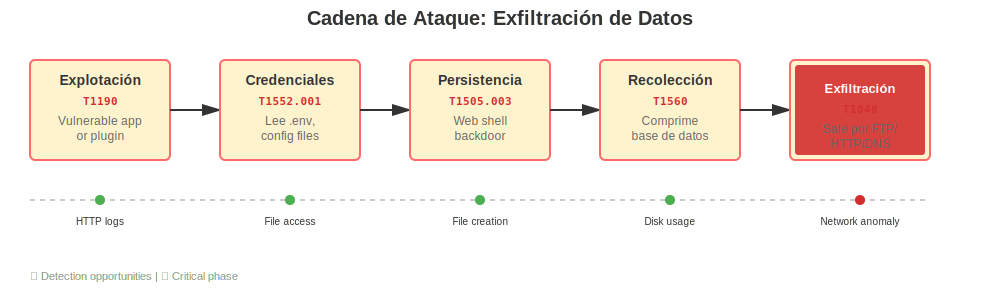
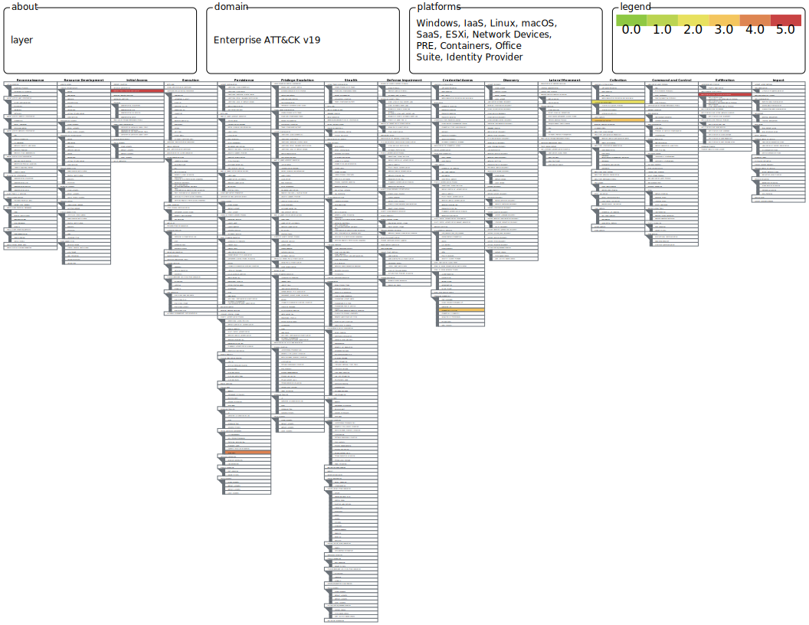
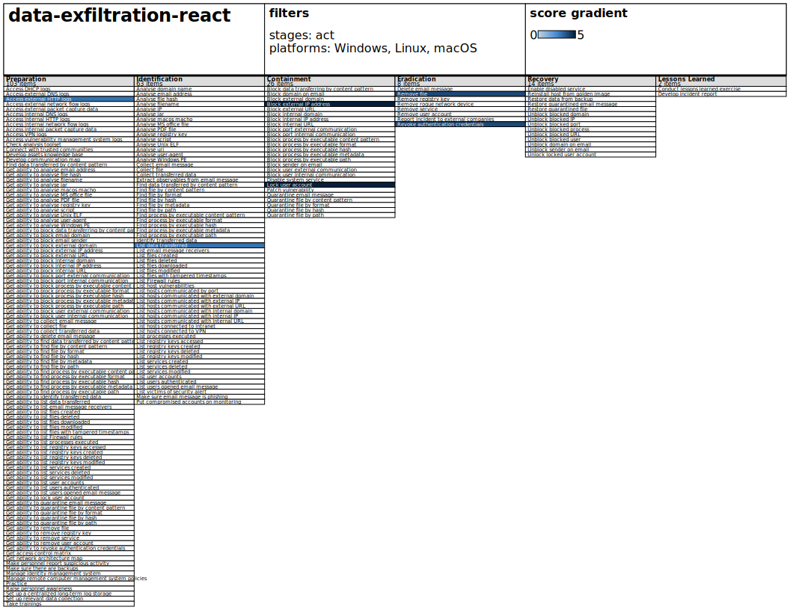

# Playbook: Exfiltración de Datos (Web/Tienda Online)

Cuando detectamos que datos están siendo extraídos de nuestro sistema, cada minuto cuenta. Este playbook te guía a través de los pasos necesarios para **investigar qué pasó, contener el daño y comunicar** de forma transparente.

**Lo más importante:** no hagas todo de forma secuencial. El equipo de seguridad investiga mientras el equipo de sistemas contiene el acceso; mientras tanto, Legal se prepara para notificar. Trabaja en paralelo cuando sea posible.

---

## Diagrama de Flujo del Incidente

[](https://mermaid.live/edit#pako:eNpVUstu2kAU_ZXRrAn1AwJYVSuwHYhURSiJVKmGxdS-mFHtGXo9TkMQH5NlF1nlAyrVP9ZrD0SNN54zc865zwNPdQY84DmK3ZbdRyvF6Jsm0wLQiIDdY_O8kalmQjWvpSg0-8DiR4MiTWXzqlgGbBat2cXFJzZLrtUDVEbmwr7tSS1FDswdXvgOK6VaW_tZxw8Pf__EjxtZtG6dABRLa6z056PlhcRjd81LR4-SUCsDqqMGbFbonzUIZNfLNiFAJShgWIMyolr_p7_RnTxOpqp5LmQlKxLXVUrSr_C92kJRVOzeHTpD0n_ReQvciXOyiKzYgrgDV0mMKDKZ2qxPxCv75iYzTa_IBKZb-aArRk2TqdQVHftPckf9-3UK-17pJbfwoNu09gy1oX-KkLX1igLOFV25HXlOvShrdU6hTRxy8WboWZJFcwvcJKaaC5HRKAtGcmma3-34Qmx7sn5H9pIbbeTmzX8aL6N2Oh_ZyNuy2_kyOvNtPgvKPa13gO9aMrd5LCxaWOAStTKiPs_8DnI6UwUR0A5mp9u4oHpo2ienhQ1znYQSEIHY0zqTRmPzItiSRt6uncrXvEeLLDMeGKyhx0vAUrSQH1qfFTdbKGHFAzpmAn-s-EodSbMT6pvW5VmGus63PNiIoiJU7zJhIKJFRlG-3SKoDDDUtTI88J3OgwcH_siDgev2nUt_4Iw933cHw1GP7-l20J94_mQ4nFz63sgZTI49_tQFdfpj1xm7I6J6vjcej_zjP_QHJSY)

---

## 1. Investigar

Lo primero es saber qué pasó y qué tan malo es. En los primeros 15–30 minutos necesitas responder tres preguntas fundamentales: ¿siguen saliendo datos ahora mismo?, ¿cómo entraron?, ¿qué información se fue?

### Los Primeros 15–30 Minutos (Acciones Inmediatas)

**¿Están sacando datos en este momento?** Lo primero es confirmar que el ataque está ocurriendo. Busca picos anómalos de tráfico de salida desde el servidor web hacia direcciones IP desconocidas. Si el ataque está en marcha, tienes que cortarlo ya.

**¿Cómo entraron?** Habitualmente es por una vulnerabilidad en la aplicación web misma (algo que el proveedor no ha parcheado) o por credenciales débiles/reutilizadas. Este tipo de entrada la rastrean en MITRE ATT&CK como **Exploit Public-Facing Application** (T1190) — significa que simplemente usaron una vulnerabilidad conocida en tu aplicación web.

**Acciones concretas ahora:**

1. Pide al equipo de sistemas que extraiga los logs de acceso del servidor web y del WAF (Web Application Firewall). Estos logs son volátiles en infraestructuras en la nube; si no los guardas ahora, desaparecerán. Cópialos a un almacenamiento seguro local.

2. Documenta las direcciones IP desde las que se está extrayendo el tráfico y hacia dónde va. Apunta todo: direcciones IP, puertos, protocolos.

3. Nombra un responsable de investigación (analista SOC o equivalente) y un responsable de contención (ingeniero de red/sistemas). Estos dos van a trabajar en paralelo.

4. Si hay datos de clientes implicados, avisa ya al equipo legal. Aquí estamos hablando de notificación obligatoria a la AEPD dentro de 72 horas.

---

### Entendiendo Qué Fue Comprometido

Una vez que has parado el sangrado inmediato, necesitas entender qué se llevaron exactamente.

**Preguntas clave:**

- ¿Fueron solo datos de catálogo (productos, descripciones) o también información de clientes (nombres, emails, direcciones)?
- ¿Accedieron a datos financieros? (números de tarjeta, cuentas bancarias)
- ¿Está comprometida solo la tienda online o también otros sistemas?

Para responder esto, busca patrones en los logs:

- Conexiones SSH/FTP raras hacia servidores externos. Los atacantes a veces copian datos usando herramientas estándar, así que verás intentos de conectar a máquinas que no son nuestras.
- Archivos `.zip` o `.tar.gz` grandes que aparecieron de repente en directorios públicos del servidor. Los atacantes suelen comprimir la base de datos antes de llevarla. En MITRE ATT&CK esto se cataloga como **Archive Collected Data** (T1560).
- Volcados SQL o consultas masivas en los logs de la base de datos. Si ves consultas como `SELECT * FROM customers;` saliendo de IP externas, sabes que alguien está robando datos de forma automatizada.

---

### Buscando el Punto de Entrada

Aquí es donde investigas cómo el atacante llegó hasta donde llegó. Típicamente:

1. Encontró una vulnerabilidad en tu aplicación web o en una de sus dependencias (WordPress, PrestaShop, un plugin específico).
2. Explotó esa vulnerabilidad para ejecutar código en el servidor.
3. Leyó archivos de configuración (`.env`, `wp-config.php`) que contenían credenciales de la base de datos en texto plano. Esto es lo que MITRE ATT&CK llama **Unsecured Credentials** (T1552.001) — simplemente credenciales que cualquiera puede leer si accede al servidor.
4. Con esas credenciales, se conectó a la base de datos directamente y volcó todo.

Busca en el servidor:

- Scripts PHP/JSP/ASP que fueron creados recientemente y que no reconoces. Los atacantes muchas veces dejan una "puerta trasera" (MITRE ATT&CK: **Web Shell**, T1505.003) para poder volver más tarde sin tener que explotar la vulnerabilidad de nuevo.
- En los logs de aplicación web, busca intentos de subida de archivos o cambios de permisos. Si ves algo como `PUT /shell.php` o `POST /admin/upload`, eso es un red flag.

---

### La Gravedad del Incidente

Este incidente es **CRÍTICO** por definición. Aquí está por qué:

- Los datos personales y financieros de tus clientes han salido de tu control.
- Tienes una obligación legal (RGPD) de notificar a cada cliente afectado.
- Tienes que notificar a la AEPD en 72 horas.
- Tus clientes (autónomos y pymes) pueden sufrir fraude o robo de identidad basado en esta información.
- Puedes ser víctima de extorsión: el atacante puede amenazar con publicar los datos si no pagas.

Esto requiere **escalado inmediato al Comité de Crisis** (CISO, CEO, Legal, Comunicación).

---

## 2. Remediar: Contener, Erradicar y Recuperar

Una vez que sabes qué pasó, necesitas hacer tres cosas:

1. **Contener**: Detener el daño inmediatamente. Si los atacantes todavía tienen acceso, córtalo ya.
2. **Erradicar**: Eliminar cualquier herramienta o acceso que dejaron los atacantes para no volver.
3. **Recuperar**: Levantar los servicios de forma segura.

### Contención: Frenar la Salida de Datos

La prioridad número uno es cerrar el grifo. Si los datos todavía se están filtrando, esto es lo que haces:

**Bloquear el acceso externo.** Identifica la dirección IP desde la que el atacante se está conectando y bloquéala en el firewall perimetral y en el WAF. Esta acción debería tardar minutos, no horas. Es una "regla drop" simple.

**Revoca los accesos comprometidos.** Si sabes que el atacante usó credenciales de la base de datos, cambia esas contraseñas ya. Desactiva cualquier cuenta de usuario o servicio que haya sido comprometida. En MITRE ATT&CK esto se llama **Revoke Authentication Credentials** (T3002) — simplemente dejar inutilizable lo que el atacante estaba usando.

**Aísla la infraestructura de la web hacia la sede central.** Si tu tienda online está conectada a tu red interna mediante una VPN site-to-site, desconéctala temporalmente. El atacante no debería poder saltar desde el servidor web hacia tus sistemas internos. Puedes reconectar cuando hayas limpiado todo.

**Nota importante:** Coordina esto con dirección. Desconectar la tienda online significa que deja de funcionar. Es una decisión que tiene impacto inmediato en ventas. Pero si estamos ante una exfiltración activa, el impacto de reputación de dejar la tienda comprometida es mucho mayor.

---

### Erradicación: Limpiar el Entorno

El atacante probablemente dejó una o varias "puertas traseras" para poder volver. Tienes que encontrarlas y eliminarlas.

**Busca y elimina web shells.** Las web shells son scripts (PHP, JSP, ASP) que el atacante sube al servidor para ejecutar código remotamente. Busca en el servidor archivos con extensiones sospechosas que fueron creados recientemente y que no reconoces. Los nombres típicos son cosas como `admin.php`, `shell.php`, `test.jsp`. Elimínalos. En MITRE ATT&CK esto es **Remove Files** (T1070.004).

**Busca y elimina archivos de volcado.** Si el atacante creó archivos ZIP o TAR de la base de datos antes de llevarlos, sigue habiendo copias en tu servidor. Busca en `/tmp`, en directorios públicos del servidor web, en cualquier lugar donde haya archivos grandes creados recientemente. Elimínalos.

**Revisa la configuración de la aplicación.** El atacante pudo haber dejado puertas traseras a nivel de aplicación: usuarios administrativos ocultos, tokens de API, claves SSH en archivos que no deberían tenerlas. Revisa archivos de configuración (`.env`, `wp-config.php`, `config.php`) y comprueba que:
- No hay credenciales en texto plano
- No hay claves SSH compartidas
- No hay tokens de API obsoletos

**Aplica parches de seguridad.** La vulnerabilidad que permitió que el atacante entrara sigue ahí si no la fixes. Aplica el parche de seguridad para la vulnerabilidad específica (WordPress, PrestaShop, el framework que uses) que fue explotada. Si no sabes cuál fue exactamente, coordina con el proveedor externo para que los aplique todos.

---

### Recuperación: Volver a Poner Todo en Marcha

Aquí es donde intentas que todo funcione de nuevo, pero de forma segura.

**Restaura desde un backup.** Si tienes un backup del servidor anterior al incidente, ese es tu punto de referencia para la recuperación. Idealmente, ese backup debería ser inmutable (no puedes modificarlo una vez creado) para que el atacante no lo haya comprometido también.

**Levanta la web en modo degradado primero.** No reconeches todo de golpe. Pon la web inicialmente en modo "solo lectura" o en una página de mantenimiento. De esa forma puedes validar que los cambios de seguridad que hiciste funcionan sin exponer los servicios de pago o datos de clientes.

**Conecta la base de datos con cuidado.** Una vez que hayas validado que el servidor web está limpio, reconecta la base de datos. Pero antes:
- Verifica que las credenciales que pusiste son nuevas (no las comprometidas).
- Checkea que los permisos de base de datos son los mínimos necesarios (no permiso total).
- Activa logs de acceso a la base de datos para poder detectar cualquier cosa rara de aquí en adelante.

**Habilita un WAF fuerte.** Antes de abrir el servicio completamente, asegúrate de que tienes un WAF (Web Application Firewall) configurado estrictamente. Debería bloquear:
- Intentos de subida de archivos PHP/JSP en directorios inesperados.
- Consultas SQL que parezcan intentos de inyección.
- Patrones de ataque web conocidos.

**Activa monitorización.** Desde este momento en adelante, cada petición a la web debería generar una alerta si parece sospechosa. Conecta los logs del servidor web y de la base de datos a tu SIEM (Security Information and Event Management). Si el atacante intenta volver, quieres saberlo lo antes posible.

---

## 3. Comunicar

No es suficiente con arreglarlo; tienes que decirle a la gente qué pasó. Y tienes que hacerlo dentro de plazos legales y de forma transparente.

### Los Primeros 72 Horas: La Notificación Regulatoria

Si has confirmado que se fugaron datos personales de clientes, tienes un plazo máximo de 72 horas para notificar a la Agencia Española de Protección de Datos (AEPD). No es una recomendación, es una obligación legal bajo el RGPD. Si no lo haces, las multas van desde los 10 millones hasta los 20 millones de euros (o el 4% de tu facturación anual, lo que sea mayor). En una empresa de 150 personas, eso probablemente signifique quiebra.

**¿Qué significa notificar a la AEPD?** Tienes que presentar un informe que detalle:
- Qué datos se fugaron exactamente (nombres, emails, números de cuentas bancarias, etc.)
- Cuándo descubriste que se habían fugado
- Qué medidas de seguridad tenías
- Qué medidas estás tomando ahora para evitar que vuelva a pasar
- Qué riesgos corre cada persona cuyos datos se fugaron

Este informe lo prepara el equipo legal con ayuda del equipo de seguridad. No es algo que puedas demorar.

---

### Elevar a Dirección: El Comité de Crisis

Este tipo de incidente requiere que toda la dirección se entere. Tienes que abrir una reunión de crisis con:

- **CISO** (Chief Information Security Officer): Lidera la respuesta técnica.
- **CEO/Dirección General**: Necesita saber el impacto empresarial y las decisiones que se van a tomar.
- **Legal**: Prepara la notificación a la AEPD, gestiona temas de responsabilidad civil.
- **Comunicación/PR**: Prepara el mensaje para clientes y prensa.

En esta reunión se decide si la tienda va a estar fuera de servicio, cuándo se levanta, qué se comunica a clientes.

---

### Comunicación a Clientes Afectados

Una vez que has notificado a la AEPD, tienes que comunicar a cada cliente cuyos datos se fugaron. Y tienes que hacerlo de forma clara y sin intentar esconder nada. Aquí está lo que tienes que incluir:

**¿Qué pasó?** Un párrafo claro: "Detectamos que los datos de nuestros clientes fueron accedidos sin autorización a través de una vulnerabilidad en nuestro servidor web. Hemos identificado qué información fue afectada y qué medidas estamos tomando."

**¿Qué datos se fugaron?** Sé específico. "Se fugaron nombres, emails, y direcciones de facturación" es mejor que "información de cuenta". Los clientes necesitan saber si su número de tarjeta está en peligro o si es "solo" dirección de email.

**¿Qué riesgo corren?** Sé honesto. Si se fugaron números de tarjeta, los clientes deben estar atentos a fraude. Si fue dirección de email, pueden esperar phishing. Si fue información de cuenta bancaria, la amenaza es mayor.

**¿Qué deben hacer?** Dale acciones concretas:
- Cambiar la contraseña en tu plataforma.
- Vigilar su estado de cuenta bancaria durante los próximos meses.
- Activar alertas de fraude con sus bancos si disponen de ello.
- Contactar con un número de teléfono o email si tienen preguntas.

**¿Qué estamos haciendo nosotros?** Detalla:
- Hemos cerrado el servidor comprometido.
- Hemos parqueado la vulnerabilidad.
- Hemos activado un WAF más estricto.
- Vamos a hacer una auditoría de seguridad externa.

Comunicación a los medios: Si el incidente es suficientemente grave, aparecerá en prensa. Es mejor que lo comuniques tú de forma controlada que dejar que salga en un titular sensacionalista. Un comunicado de prensa claro y transparente es tu mejor defensa reputacional en este momento.

---

### Coordinación con el Proveedor Externo

El servidor web está en las manos de tu proveedor de hosting. Tienes que exigirle:

1. **Un informe detallado**: Acceso físico y lógico a los servidores. ¿Quién accedió cuándo? ¿Se tocó algo en el hipervisor?
2. **Logs completados**: Asegúrate de que tienes copias de TODOS los logs (acceso, aplicación, sistema) desde antes del incidente.
3. **Auditoría externa**: El proveedor debería encargarse de una auditoría de seguridad para entender cómo pasó esto.
4. **Garantías de seguridad**: Asegúrate de que el proveedor tiene un plan para evitar que esto vuelva a pasar. Si no lo tiene claro, plantéate cambiar de proveedor.

---

## 4. Recuperación y Lecciones Aprendidas

Una vez que el incidente está "controlado", necesitas reconstruir con una mentalidad diferente: la de evitar que vuelva a pasar.

### Restauración del Servicio

**El plan de vuelta a la normalidad:** No abras la tienda de repente. Levanta el servicio en fases:

1. Servidor web limpio + base de datos restaurada + sin conexión a sistemas internos. Solo para que técnicos lo validen.
2. Servidor web limpio + base de datos + pasarela de pagos desactivada. La web funciona pero no se venden cosas (modo lectura).
3. Servidor web limpio + base de datos + pasarela de pagos activada + WAF estricto + monitorización máxima. Ya funciona normalmente pero con todas las alarmas puestas.

Cada fase requiere validación. Si algo huele mal, no avances a la siguiente.

---

### Medidas de Seguridad a Largo Plazo

Este incidente te enseña que confiar en tu proveedor externo "porque es experto" no es suficiente. Necesitas:

**WAF permanente y estricto.** Un Web Application Firewall debería estar en frente de tu tienda online de aquí en adelante. No es opcional. Debería bloquear patrones conocidos de ataque y alertarte de cosas raras.

**Auditoría de seguridad trimestral.** Paga a una empresa externa para que penetre tu tienda online buscando vulnerabilidades. Si encuentran algo, arréglalo antes de que un atacante lo encuentre.

**Monitorización 24/7.** Los logs de tu servidor web y base de datos deberían fluir a un SIEM (herramienta de monitorización). Si el atacante intenta volver, lo sabrás en tiempo real.

**Gestión de credenciales.** Jamás dejes contraseñas en archivos de configuración. Usa un gestor de secretos (Vault, AWS Secrets Manager, etc.) donde las credenciales están encriptadas y se rotan regularmente.

**Actualizaciones automáticas.** Tu CMS, plugins y dependencias deberían actualizarse automáticamente cuando hay parches de seguridad. No esperes a hacerlo manualmente.

---

### Lecciones Aprendidas

Después de que todo está estabilizado, reúnete con el equipo y pregunta:

**¿Por qué pasó esto?** Típicamente por una combinación de:
- Vulnerabilidad sin parchear en la aplicación web.
- Credenciales en texto plano en archivos de configuración.
- Falta de segmentación de red (el servidor web podía conectarse a sistemas internos).
- Falta de monitorización que detectara la anomalía más rápido.

**¿Qué vamos a cambiar?** Haz un plan concreto:
- Cambiar de proveedor si no tienen estándares de seguridad.
- Implementar un WAF si no lo tienes.
- Cambiar los procesos de parcheo para hacerlos más rápidos.
- Entrenar al equipo en desarrollo seguro (OWASP, manejo de secrets, etc).

**¿Qué tiempo perdimos en qué?** Analiza dónde se fue el tiempo:
- ¿Cuánto tardaste en detectar el incidente?
- ¿Cuánto en entender qué pasó?
- ¿Cuánto en contenerlo?
- ¿Cuánto en comunicar?

Cada una de estas fases es donde puedes mejorar para la próxima vez (esperamos que no la haya, pero si la hay, estarás más preparado).

---

## Recordatorios Prácticos

**Antes de que nadie reinicie o apague nada:** Los logs son la evidencia. En una infraestructura en la nube, los logs desaparecen rápido. Extrae y guarda los logs de acceso web, logs de base de datos, logs de firewall, y cualquier cosa que tenga timestamp **antes** de tocar nada. La cadena de custodia (probar que la evidencia no fue alterada) es crucial si esto acaba en procedimientos legales o regulatorios.

**No hagas nada en paralelo sin coordinación.** Si un técnico está restaurando un backup mientras otro está intentando parchar la vulnerabilidad, pueden pisarse los cambios. Tienes que tener un único "líder técnico" que coordina quién hace qué.

**Documenta todo mientras lo haces.** No esperes a que termine el incidente para escribir un informe. Apunta en tiempo real:
- Qué encontraste
- Qué hiciste
- A qué hora
- Quién lo validó

Esto hace que el informe final sea mucho más fácil de escribir y que no pierdas detalles importantes.

---

## Técnicas MITRE ATT&CK Relevantes en Este Playbook

### Cadena de Ataque: Visualización Completa

---

| Fase | Técnica MITRE | Descripción | Cómo la Detectamos |
|------|---------|-----|----|
| **Explotación** | [T1190: Exploit Public-Facing Application](https://attack.mitre.org/techniques/T1190/) | El atacante encuentra una vulnerabilidad en tu aplicación web (WordPress, PrestaShop, plugin, etc.) y la explota para ejecutar código. | Busca en los logs de acceso peticiones HTTP inusuales, errores 200 OK después de patrones de fuzzing, o POST requests a archivos que no deberían recibir input. |
| **Acceso a Credenciales** | [T1552.001: Unsecured Credentials](https://attack.mitre.org/techniques/T1552/001/) | El atacante lee archivos de configuración (`.env`, `wp-config.php`) que contienen credenciales de base de datos en texto plano. | Revisa si tus archivos de configuración están en directorios accesibles públicamente o están siendo leídos por el servidor web. |
| **Creación de Puerta Trasera** | [T1505.003: Web Shell](https://attack.mitre.org/techniques/T1505/003/) | El atacante deja un script (PHP, JSP, ASP) en el servidor para poder volver más tarde sin necesidad de re-explotar la vulnerabilidad. | Busca archivos PHP/JSP creados recientemente en directorios públicos, o cambios en ficheros de configuración de servidor web. |
| **Compresión de Datos** | [T1560: Archive Collected Data](https://attack.mitre.org/techniques/T1560/) | El atacante comprime la base de datos en un archivo `.zip` o `.tar.gz` antes de extraerlo. | Busca archivos grandes de compresión creados recientemente, especialmente en directorios públicos o `/tmp`. |
| **Exfiltración** | [T1048: Exfiltration Over Alternative Protocol](https://attack.mitre.org/techniques/T1048/) | El atacante extrae los datos usando HTTP, FTP, DNS, o cualquier protocolo que tenga permitido salir por el firewall. | Monitoriza el tráfico de salida anómalo, conectiones FTP/SFTP a IPs externas, o patrones DNS inusuales. |

---

### Visualización Interactiva con React

Si tu organización quiere un dashboard interactivo en tiempo real para monitorizar el estado del incidente y las técnicas MITRE ATT&CK detectadas, puedes construir una interfaz con **React** que:

- **Muestre la cadena de ataque en vivo** — cada técnica detectada se ilumina en el diagrama
- **Actualice en tiempo real** — integrado con tu SIEM o herramienta de logs
- **Sea colaborativo** — todos los equipos (SOC, sistemas, legal) ven el mismo estado
- **Mappe automáticamente** — relaciona alertas de tu plataforma con técnicas MITRE ATT&CK

Esta integración es especialmente valiosa durante el incidente porque permite que:
1. El equipo técnico vea qué técnicas se están usando
2. El Comité de Crisis vea el progreso en tiempo real
3. Legal sepa exactamente cuándo se detectó cada cosa (para cadena de custodia)

---

## Recursos y Referencias

- **AEPD (Agencia Española de Protección de Datos)**: [Guía de notificación de brechas](https://www.aepd.es) — todo sobre cómo notificar correctamente.
- **MITRE ATT&CK Framework**: [T1190 (Exploit Public-Facing Application)](https://attack.mitre.org/techniques/T1190/) — la técnica inicial típica en este tipo de ataques.
- **INCIBE**: [Gestión de incidentes de ciberseguridad](https://www.incibe.es) — guía práctica en español sobre respuesta a incidentes.
- **OWASP Top 10**: Ten esto en cuenta para el desarrollo seguro de tu aplicación web.
- **RE&CT Framework**: Acciones de respuesta estructuradas (RE&CT = Responder, Response Actions).
