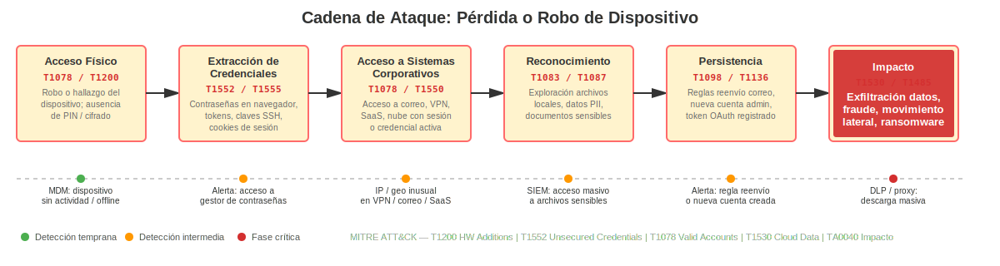
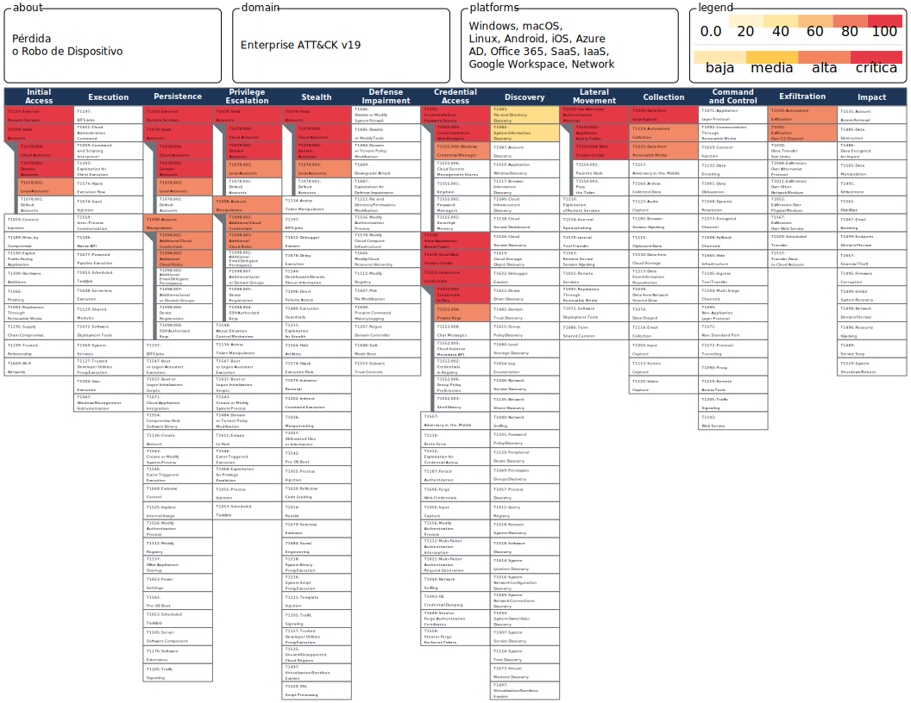
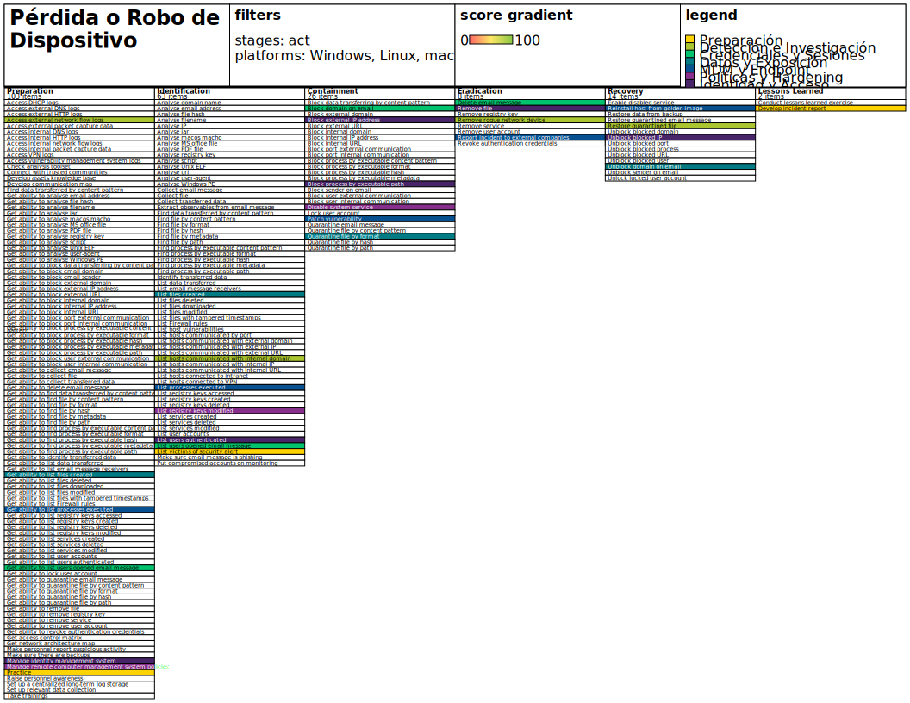

## Playbook: Pérdida o Robo de Dispositivo

**Investigar, remediar (contener, erradicar) y comunicar en paralelo.**

Asigne pasos a individuos o equipos para que trabajen simultáneamente, cuando sea posible; este libro de jugadas no es puramente secuencial. Utilice su mejor criterio.

---

### Cadena de Ataque

---

### Investigar

`OBJETIVO: Confirmar que el dispositivo ha sido perdido o robado (descartar extravíos temporales), identificar qué datos y sistemas podrían estar expuestos, y evaluar el riesgo real según el estado del dispositivo.`

1. **Triage rápido (primeras 1–2 horas)**
    * Confirmar el incidente: verificar si el dispositivo está realmente fuera del control del empleado (descartar que esté en otro puesto, en sala de reuniones, en mantenimiento, etc.).
    * Identificar el tipo de dispositivo:
        * Ordenador portátil corporativo.
        * Teléfono móvil corporativo o BYOD con acceso a sistemas de la empresa.
        * Tableta corporativa o BYOD.
        * Pendrive o disco duro externo con información corporativa.
    * Recopilar información básica del dispositivo:
        * Identificador del dispositivo (número de serie, IMEI, nombre de equipo, dirección MAC).
        * Usuario asignado y departamento.
        * Última ubicación conocida y circunstancias de la pérdida o robo.
        * Hora aproximada en que se detectó la ausencia.
    * Determinar el estado de protección del dispositivo:
        * ¿Tenía cifrado de disco activado (BitLocker, FileVault, cifrado Android/iOS)?
        * ¿Tenía PIN, contraseña o biometría configurada?
        * ¿Estaba inscrito en MDM (Mobile Device Management)?
        * ¿Tenía acceso activo a correo, VPN, aplicaciones corporativas o almacenamiento en la nube?

1. **Determinar qué información podía contener o acceder**
    * Revisar qué datos y sistemas eran accesibles desde el dispositivo:
        * Correo electrónico corporativo sincronizado localmente.
        * Documentos almacenados localmente (no en la nube).
        * Acceso a servicios internos mediante VPN o sesiones activas.
        * Credenciales guardadas en el navegador o en aplicaciones.
        * Datos de clientes, proveedores o empleados (PII).
        * Información financiera o contractual sensible.
    * Verificar si el dispositivo tenía acceso a la página web corporativa, tienda online o servicios externalizados con credenciales almacenadas.
    * Revisar si había sesiones activas en aplicaciones SaaS (correo, almacenamiento en la nube, CRM, ERP).

1. **Evaluar el riesgo real**
    * Clasificar el riesgo según:
        * **Alto**: dispositivo sin cifrado, sin PIN, con credenciales almacenadas o datos sensibles locales.
        * **Medio**: dispositivo con PIN pero sin cifrado, o con acceso a sistemas corporativos.
        * **Bajo**: dispositivo cifrado, con PIN robusto, sin datos locales sensibles y con MDM activo.
    * Determinar si hay indicios de robo dirigido (en lugar de pérdida fortuita) que sugieran intención de acceder a la información.
    * Escalar a Dirección y Legal si el dispositivo contenía datos personales de clientes, empleados o proveedores.

1. **Evaluar el impacto y priorizar**
    * Priorizar la respuesta según: tipo de datos expuestos, sistemas accesibles desde el dispositivo, número de personas afectadas y obligaciones regulatorias (RGPD).
    * Identificar si el dispositivo pertenecía a personal con acceso privilegiado (TIC, administración, dirección).

---

### Remediar

* **Planificar eventos de remediación** en los que estos pasos se lancen juntos (o de forma coordinada), con los equipos apropiados listos para responder a cualquier interrupción.
* **Considere el momento y las compensaciones** de las acciones de remediación: su respuesta tiene consecuencias.

#### Contención

`OBJETIVO: Impedir el acceso a sistemas corporativos desde el dispositivo perdido o robado, revocar credenciales y sesiones activas, y borrar remotamente el dispositivo si es posible, sin destruir evidencia cuando sea relevante.`

`OBJETIVO: Especificar herramientas y procedimientos internos para cada paso (MDM, IAM, directorio activo, correo, VPN).`

* **Bloquear el acceso del dispositivo a sistemas corporativos**
    * Revocar el certificado de VPN o desactivar el acceso VPN asociado al dispositivo o usuario.
    * Desactivar la cuenta de correo corporativo en el dispositivo (mediante MDM o desde el servidor de correo).
    * Revocar tokens de sesión activos en aplicaciones SaaS y servicios en la nube.
    * Bloquear el dispositivo de forma remota si el MDM lo permite.

* **Revocar y rotar credenciales**
    * Forzar el restablecimiento de contraseña de la cuenta corporativa del usuario afectado.
    * Revocar y regenerar claves API o tokens de acceso que pudieran estar almacenados en el dispositivo.
    * Si se sospecha reutilización de contraseñas: iniciar rotación en sistemas críticos relacionados.
    * Invalidar todas las sesiones activas del usuario en todos los sistemas.

* **Ejecutar borrado remoto (wipe) si procede**
    * Si el dispositivo está inscrito en MDM: ejecutar borrado remoto completo o borrado selectivo de datos corporativos.
    * Si es un dispositivo BYOD: ejecutar borrado selectivo limitado a datos y aplicaciones corporativas.
    * Documentar el momento y el resultado del borrado remoto.
    * Si el dispositivo no tiene MDM: coordinar con el fabricante o proveedor de la plataforma (Google, Apple) para bloqueo o borrado mediante cuenta corporativa asociada.

* **Denunciar ante las autoridades si hay indicios de robo**
    * Asesorar al empleado afectado para interponer denuncia ante las fuerzas de seguridad.
    * Documentar el número de denuncia para el expediente del incidente.
    * Proporcionar el IMEI u otros identificadores a las autoridades si lo solicitan.

* **Activar vigilancia reforzada**
    * Monitorizar accesos sospechosos a sistemas corporativos desde IPs o ubicaciones inusuales.
    * Activar alertas en SIEM para intentos de autenticación con las credenciales del usuario afectado.
    * Revisar logs de acceso a correo, VPN y aplicaciones durante las horas posteriores a la pérdida.

`OBJETIVO: Considerar la automatización de medidas de contención mediante herramientas de orquestación (SOAR o MDM) donde exista.`

#### Erradicar

`OBJETIVO: Eliminar cualquier vía de acceso residual que pudiera aprovecharse a través del dispositivo perdido o robado, y reforzar los controles para evitar que un dispositivo no gestionado pueda acceder a sistemas corporativos.`

`OBJETIVO: Especificar herramientas y procedimientos para cada paso (MDM, IAM, gestión de certificados).`

* **Eliminar el dispositivo del inventario activo**
    * Dar de baja el dispositivo en el inventario de activos TIC.
    * Eliminar el perfil del dispositivo en MDM una vez confirmado el borrado remoto.
    * Revocar certificados digitales asociados al dispositivo.

* **Auditar accesos posteriores al incidente**
    * Revisar logs de autenticación desde el momento de la pérdida hasta la contención para detectar accesos no autorizados realizados desde el dispositivo.
    * Comprobar si se realizaron descargas, envíos de correo o accesos a datos sensibles en ese período.
    * Verificar que no se crearon reglas de reenvío de correo ni se modificaron permisos durante el período de exposición.

* **Revisar y reforzar controles de acceso**
    * Asegurar que todos los dispositivos corporativos restantes tienen cifrado de disco activado.
    * Verificar que todos los dispositivos con acceso a sistemas corporativos están inscritos en MDM.
    * Aplicar política de acceso condicional: bloquear acceso a sistemas corporativos desde dispositivos no gestionados.

* **Validación post-erradicación**
    * Confirmar que el dispositivo ya no aparece activo en ningún sistema de directorio, MDM o VPN.
    * Monitorizar durante al menos 72 horas posibles intentos de acceso con las credenciales del usuario afectado.

---

### Comunicar

`OBJETIVO: Comunicar con precisión, evitando especulación; coordinar con Legal, Dirección y, si aplica, autoridades y afectados. Cumplir con las obligaciones regulatorias del RGPD.`

`OBJETIVO: Especificar herramientas y procedimientos (incluyendo quién participa) o remitir al plan general.`

Además de los pasos y orientaciones generales del plan de respuesta a incidentes:

1. Notificar a Dirección y al responsable de seguridad con resumen inicial: qué dispositivo se ha perdido o robado, cuándo, qué datos podrían haberse expuesto, y qué medidas de contención se han tomado.
1. Coordinar con Legal:
    * Evaluar obligaciones de notificación a la AEPD en un plazo máximo de 72 horas si el dispositivo contenía datos personales y no estaba cifrado (RGPD Art. 33).
    * Evaluar la obligación de notificación a los interesados (RGPD Art. 34) si el riesgo para sus derechos es alto (datos sensibles sin cifrar).
    * Revisar si aplica la póliza de ciberriesgo o seguro de equipos.
1. Notificar internamente a los departamentos afectados (TIC, RRHH si es un dispositivo de empleado, el departamento del usuario afectado).
1. Si hay clientes o proveedores cuyos datos pudieran haber sido expuestos: preparar comunicado externo claro y verificable con instrucciones de actuación, coordinado con Legal y Dirección.
1. Coordinar con RRHH si el incidente implica negligencia por parte del empleado (pérdida por descuido reiterado, incumplimiento de política de dispositivos): seguir el procedimiento disciplinario establecido.

---

### Recuperación

`OBJETIVO: Restablecer la operatividad del empleado afectado con un dispositivo seguro, reforzar los controles sobre dispositivos y mejorar la postura de seguridad para reducir la probabilidad de recurrencia.`

`OBJETIVO: Especificar herramientas y procedimientos para cada paso (MDM, inventario, formación, política de dispositivos).`

Además de los pasos y orientaciones generales del plan de respuesta a incidentes:

1. Proporcionar al empleado un dispositivo sustituto correctamente configurado:
    * Cifrado de disco activado desde el inicio.
    * Inscrito en MDM antes de la entrega.
    * Credenciales nuevas y MFA habilitado.
    * Solo aplicaciones y accesos necesarios según su rol (mínimo privilegio).
1. Reforzar controles sobre dispositivos corporativos:
    * Verificar que todos los dispositivos en uso tienen cifrado, PIN y MDM activo.
    * Implementar política de borrado remoto automático tras un número determinado de intentos fallidos de desbloqueo.
    * Establecer inventario actualizado de dispositivos con acceso a sistemas corporativos.
1. Mejorar la visibilidad y detección:
    * Revisar cobertura de MDM: todo dispositivo con acceso a sistemas corporativos debe estar gestionado.
    * Implementar acceso condicional que bloquee dispositivos no inscritos en MDM.
    * Asegurar que los logs de acceso cubren todos los sistemas críticos accesibles desde dispositivos móviles.
1. Formación y concienciación:
    * Recordar a todos los empleados la política de uso y custodia de dispositivos corporativos.
    * Comunicar el procedimiento de notificación inmediata ante pérdida o robo.
    * Reforzar la importancia del bloqueo automático de pantalla y el uso de contraseñas robustas.
1. Lecciones aprendidas:
    * Documentar la cronología completa, el tipo de dispositivo, los datos expuestos y las acciones realizadas.
    * Actualizar el registro de riesgos y la política de dispositivos móviles.
    * Revisar si la ausencia de MDM formalizado fue un factor agravante y planificar su implantación si no existe.

---

### Referencia: Acciones del empleado ante la pérdida o robo de un dispositivo corporativo

`OBJETIVO: Personalizar los pasos para empleados que detecten la pérdida o robo de un dispositivo con acceso a sistemas de la empresa.`

1. Mantenga la calma. No espere a ver si aparece: notifique de inmediato al responsable de TIC o al servicio de soporte.
1. Tome nota de: cuándo fue la última vez que tuvo el dispositivo, dónde estaba, y si cree que fue pérdida o robo.
1. Si sospecha robo, interponga denuncia ante la Policía o Guardia Civil y comunique el número de denuncia al equipo de TIC.
1. No intente acceder remotamente al dispositivo por su cuenta ni instalar aplicaciones de rastreo no autorizadas.
1. No comparta sus credenciales corporativas con nadie mientras el incidente esté activo.
1. Colabore con el equipo de TIC facilitando toda la información necesaria (número de serie, IMEI, últimas aplicaciones usadas, etc.).
1. Tenga paciencia: pueden aplicarse restricciones temporales a su cuenta mientras se resuelve el incidente. **Gracias por avisar de inmediato.**

---

### Referencia: Acciones del servicio de asistencia técnica ante la notificación de pérdida o robo de dispositivo

`OBJETIVO: Personalizar los pasos para el personal del helpdesk ante la notificación de pérdida o robo de un dispositivo corporativo.`

1. Mantenga la calma y abra un ticket documentando el incidente con la mayor cantidad de información posible.
1. Recopile del empleado afectado:
    * ¿Qué dispositivo es (tipo, marca, modelo, número de serie o IMEI)?
    * ¿Cuándo fue la última vez que lo tuvo y dónde?
    * ¿Fue pérdida o hay indicios de robo?
    * ¿Tenía PIN, contraseña o cifrado activado?
    * ¿Qué aplicaciones y datos corporativos tenía accesibles?
1. Verifique en el inventario si el dispositivo está inscrito en MDM y qué datos y accesos tenía configurados.
1. No restablezca contraseñas ni ejecute el borrado remoto sin coordinación con el responsable de seguridad o TIC.
1. Escale de inmediato al equipo de seguridad o al responsable de TIC con toda la información recopilada.
1. Siga las instrucciones del equipo de seguridad para las acciones de contención (bloqueo remoto, revocación de accesos, borrado).

---

### Recursos

#### Información adicional

1. [MITRE ATT&CK: Initial Access – Lost and Stolen Devices (T1078)](https://attack.mitre.org/techniques/T1078/)
1. [NIST SP 800-124r2: Guidelines for Managing the Security of Mobile Devices in the Enterprise](https://nvlpubs.nist.gov/nistpubs/SpecialPublications/NIST.SP.800-124r2.pdf)
1. [NIST SP 800-61r2: Computer Security Incident Handling Guide](https://nvlpubs.nist.gov/nistpubs/SpecialPublications/NIST.SP.800-61r2.pdf)
1. [AEPD: Guía para la notificación de brechas de datos personales](https://www.aepd.es/guias/guia-brechas-seguridad.pdf)
1. [RGPD Art. 33 – Notificación de una violación de la seguridad de los datos personales a la autoridad de control](https://gdpr-info.eu/art-33-gdpr/)
1. [INCIBE: Robo o pérdida de dispositivos móviles en la empresa](https://www.incibe.es/empresas/tematicas/dispositivos-moviles)
1. [CCN-CERT: Guía CCN-STIC – Seguridad en dispositivos móviles](https://www.ccn-cert.cni.es/)
1. [ENISA: Smartphone Secure Development Guidelines](https://www.enisa.europa.eu/publications/smartphone-secure-development-guidelines)
1. [CIS Controls – Control 12: Network Infrastructure Management (gestión de dispositivos)](https://www.cisecurity.org/controls/)
1. [Apple: Find My – Gestión remota de dispositivos iOS/macOS](https://support.apple.com/es-es/find-my)